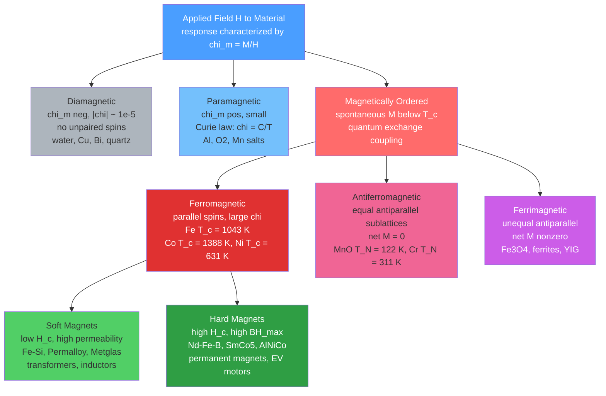

# Magnetic Materials and Magnetic Domains

> [!abstract] TL;DR
> Magnetic materials span a spectrum from weakly repelled diamagnets to powerfully aligned ferromagnets; in ferromagnets, quantum exchange interactions force neighboring spins to align into macroscopic domains separated by Bloch walls, and the resulting hysteresis loop — quantified by saturation magnetization $M_s$, remanence $M_r$, and coercivity $H_c$ — determines whether a material stores energy permanently (hard magnet) or channels flux with minimal loss (soft magnet), underpinning everything from transformer cores to the Nobel-Prize-winning giant magnetoresistance in hard-drive read heads.

---

## Intuition

**Analogy:** Imagine a stadium at a sports event. Each fan in a section automatically cheers with their immediate neighbors — but different sections of the stadium started cheering in random directions. From a blimp, the crowd looks disordered: some sections point left, some right, some forward. These sections are **magnetic domains**. When the home team scores (an external field is applied), sections begin flipping to face the scoreboard one by one. With enough excitement (a strong enough field), every fan faces the same direction — **saturation**. When the game ends and the energy fades, most fans retain their scoreboard orientation — **remanence**. To get the fans to flip back, a rival announcement (opposing field) must overcome the crowd inertia — that threshold is **coercivity**.

The deeper quantum reality: each "fan" is an electron spin. The reason neighbors align is not courtesy — it is the Pauli exclusion principle combined with the Coulomb interaction, a purely quantum effect called **exchange interaction** that has no classical counterpart.

---

## How It Works

### Core Mechanics

1. **Magnetic moment of an electron:** An electron carries two contributions to its magnetic moment: (i) orbital angular momentum $\mathbf{L}$ and (ii) intrinsic spin $\mathbf{S}$. The spin magnetic moment is $\boldsymbol{\mu}_s = -g_s \mu_B \mathbf{S}/\hbar$, where $g_s \approx 2.0023$ is the electron $g$-factor and $\mu_B = e\hbar/2m_e = 9.274 \times 10^{-24}$ J/T is the Bohr magneton.

2. **Classification by susceptibility $\chi_m = M/H$:**

| Class | $\chi_m$ | Magnitude | Origin | Examples |
|-------|----------|-----------|--------|---------|
| Diamagnetic | $< 0$ | $\sim 10^{-5}$ | Lenz's law — induced opposition | Water, Cu, Bi, SiO₂ |
| Paramagnetic | $> 0$ | $10^{-5}$–$10^{-3}$ | Partial alignment of unpaired spins | Al, O₂, MnSO₄, Cr |
| Ferromagnetic | $\gg 0$ | $10^2$–$10^6$ | Exchange-coupled, parallel spins | Fe, Co, Ni, Gd |
| Antiferromagnetic | $\approx 0$ | Small | Equal antiparallel sublattices, cancel | MnO, Cr, FeO, NiO |
| Ferrimagnetic | $> 0$ | Moderate–large | Unequal antiparallel sublattices, net $M$ | Fe₃O₄, ferrites, YIG |

3. **Curie law (paramagnets):** At temperature $T$, thermal fluctuations compete with the aligning field. The susceptibility follows:
$$\chi = \frac{C}{T}, \qquad C = \frac{\mu_0 N \mu_{\text{eff}}^2}{3k_B}$$
where $N$ is the number density of magnetic ions and $\mu_{\text{eff}} = g_J \sqrt{J(J+1)}\, \mu_B$ is the effective magnetic moment.

4. **Curie-Weiss law (ferromagnets above $T_C$):** The exchange field adds a Weiss molecular field $H_{\text{mol}} = \lambda M$. This shifts the divergence of $\chi$:
$$\chi = \frac{C}{T - T_C}, \qquad T_C = \lambda C$$
The susceptibility diverges as $T \to T_C^+$ — a second-order phase transition into the ferromagnetic state.

5. **Exchange interaction — quantum origin:** The Heisenberg model captures spin-spin coupling:
$$\hat{\mathcal{H}} = -2J \sum_{\langle i,j \rangle} \hat{\mathbf{S}}_i \cdot \hat{\mathbf{S}}_j$$
where the sum runs over nearest-neighbor pairs $\langle i,j \rangle$. The exchange integral $J$ arises from the overlap of spatial wavefunctions combined with the antisymmetry requirement of the Pauli principle. **$J > 0$:** parallel alignment is energetically favorable → **ferromagnetism**. **$J < 0$:** antiparallel → antiferromagnetism.

6. **Magnetic domains:** A uniformly magnetized macroscopic sample would have enormous magnetostatic (stray-field) energy. The material lowers its total energy by breaking into domains of opposing orientation, reducing stray fields outside the sample. Domain formation continues until the magnetostatic energy saved equals the energy cost of creating domain walls.

7. **Hysteresis loop parameters:**
   - **Saturation magnetization $M_s$:** all magnetic moments aligned; maximum $M$ achievable.
   - **Remanence $M_r$:** $M$ remaining after field is reduced to zero; $0 \leq M_r \leq M_s$.
   - **Coercive field $H_c$:** field required to drive $M$ back to zero; distinguishes soft from hard magnets.
   - **Energy product $(BH)_{\max}$:** figure of merit for hard magnets; equals twice the energy stored per unit volume of magnet; Nd-Fe-B achieves $\approx 400–450$ kJ/m³.

### Classification Architecture



---

## Key Concepts

### Secondary

**Why is iron magnetic but copper is not?**

Iron has four unpaired 3d electrons per atom. Because of Hund's rules (maximizing total spin), these unpaired spins contribute a net atomic magnetic moment of $\approx 2.2\,\mu_B$ per Fe atom. More importantly, the exchange interaction in iron is large and positive — neighboring Fe atoms strongly prefer parallel spin alignment, creating macroscopic order below the Curie temperature of 1043 K. Copper has a completely filled 3d shell ($3d^{10}4s^1$); the 3d electrons all pair up with zero net spin, leaving only a weak orbital contribution. There is no large positive exchange integral, so copper is merely diamagnetic.

**Permanent magnets vs soft magnets — a practical perspective:**

| Property | Soft Magnet | Hard Magnet |
|----------|-------------|-------------|
| Coercivity $H_c$ | $< 1$ kA/m | $> 100$ kA/m |
| Permeability $\mu_r$ | $10^3$–$10^6$ | $\sim 1$–$10$ |
| Hysteresis loss | Minimal (narrow loop) | High (wide loop) |
| Use case | Transformer cores, motors (flux channel) | Loudspeakers, MRI bias, EV motors |
| Example | Fe-3.2%Si steel, Permalloy | Nd-Fe-B, SmCo₅, ferrite |

The B-H loop area equals the energy dissipated as heat per unit volume per cycle. Soft magnets minimize this (used in AC transformers running at 50–60 Hz). Hard magnets maximize the area in the second quadrant of the B-H plane (the "energy product" $(BH)_{\max}$).

**The five magnetic states — intuitive summary:**

- **Diamagnetic:** Every electron is paired. An applied field slightly modifies orbital motion (Lenz's law), inducing a tiny opposing moment. Materials gently repelled by magnets. Superconductors are perfect diamagnets ($\chi = -1$).
- **Paramagnetic:** Unpaired electrons exist but do not interact enough to order spontaneously. Field aligns a small fraction of moments; thermal motion randomizes them. Magnetism vanishes when the field is removed.
- **Ferromagnetic:** Exchange interaction so strong that moments spontaneously align below $T_C$. Produces permanent magnetism and hysteresis.
- **Antiferromagnetic:** Equal and opposite sublattice magnetizations exactly cancel. Appears non-magnetic macroscopically, but has rich internal order; detected by neutron diffraction.
- **Ferrimagnetic:** Like antiferromagnetic, but the two sublattices have different moment magnitudes, leaving a net spontaneous magnetization. Most ferrite magnets (including magnetite Fe₃O₄, the original lodestone) are ferrimagnetic.

---

### Undergraduate

**Curie law — microscopic derivation:**

For an ion with total angular momentum quantum number $J$, the thermal-average magnetization per ion in field $H$ is:
$$\langle \mu \rangle = g_J \mu_B J \cdot B_J(x), \qquad x = \frac{g_J \mu_B J \mu_0 H}{k_B T}$$
where $B_J(x) = \frac{2J+1}{2J}\coth\!\left(\frac{(2J+1)x}{2J}\right) - \frac{1}{2J}\coth\!\left(\frac{x}{2J}\right)$ is the Brillouin function. In the high-temperature, low-field limit ($x \ll 1$), $B_J(x) \to x(J+1)/(3J)$, giving:
$$\chi = \frac{M}{H} = \frac{N \mu_0 g_J^2 \mu_B^2 J(J+1)}{3 k_B T} = \frac{C}{T}$$
This is the Curie law. Note: $C$ depends on the specific ion through $g_J$ and $J$.

**Weiss molecular field theory and $T_C$:**

Weiss proposed that in a ferromagnet, each spin experiences an internal "molecular field" proportional to the average magnetization:
$$H_{\text{mol}} = \lambda M$$
Substituting $H_{\text{eff}} = H + \lambda M$ into the Curie law:
$$M = \frac{C(H + \lambda M)}{T} \implies \chi = \frac{C}{T - C\lambda} = \frac{C}{T - T_C}$$
The Curie temperature is $T_C = \lambda C$. For iron, $T_C = 1043$ K corresponds to a molecular field of $\sim 10^9$ A/m — unphysical as a classical field, confirming its quantum (exchange) origin.

**Magnetic domain structure:**

Three competing energies determine the equilibrium domain pattern:

| Energy | Symbol | Prefers | Effect |
|--------|--------|---------|--------|
| Magnetostatic (stray field) | $E_{\text{ms}}$ | Many small domains | Drives domain formation |
| Exchange | $E_{\text{ex}} \propto A(\nabla \hat{m})^2$ | Uniform magnetization | Opposes domain formation |
| Magnetocrystalline anisotropy | $E_K \propto K_1 \sin^2\theta$ | Moments along easy axis | Sets domain orientation |
| Domain wall | $\sigma_w = 4\sqrt{AK_1}$ | Fewer, thicker walls | Sets wall thickness |

The equilibrium domain size scales as $d \sim \sqrt{\sigma_w L / \mu_0 M_s^2}$ where $L$ is the sample dimension — domains shrink as the sample grows.

**Bloch domain wall:**

In the most common (bulk) domain wall, spins rotate **out of the plane** of the wall from one domain to the next (Bloch rotation). The wall has a width:
$$\delta_w = \pi\sqrt{\frac{A}{K_1}}$$
and an energy per unit area:
$$\sigma_w = 4\sqrt{A K_1}$$
where $A$ is the exchange stiffness constant (J/m) and $K_1$ is the first-order magnetocrystalline anisotropy constant (J/m³).

For iron: $A \approx 21$ pJ/m, $K_1 \approx 48$ kJ/m³:
$$\delta_w^{\text{Fe}} = \pi\sqrt{\frac{21 \times 10^{-12}}{48 \times 10^3}} \approx \pi \times 20.9\,\text{nm} \approx 66\,\text{nm}$$

For cobalt (high anisotropy): $K_1 \approx 450$ kJ/m³, so walls are $\sim 3\times$ thinner ($\approx 15$ nm). Thinner walls are harder to move — explaining why Co-based alloys have higher coercivity.

**Néel wall:** In thin films where surface charges make out-of-plane rotation costly, the spins instead rotate **within the plane** of the wall. Néel walls dominate when film thickness $t < \delta_w$.

**Hysteresis mechanism — domain wall motion:**

- **Below saturation:** The applied field moves domain walls preferentially. Walls bow and then jump past pinning sites (defects, grain boundaries) — each jump is an irreversible **Barkhausen jump** that dissipates energy. The B-H loop area is the total energy loss per cycle.
- **Coercivity $H_c$:** Set by the density and strength of domain wall pinning sites. Introducing defects increases $H_c$ (hardens the magnet). Ultra-pure annealed Fe-Si has almost no pinning sites → extremely soft magnet.
- **Single-domain particles:** Particles smaller than $\sim 2\delta_w$ cannot support a domain wall. Magnetization reversal occurs by coherent rotation (Stoner-Wohlfarth model), which requires a very large field — these particles have intrinsically high $H_c$.

---

### Graduate

**Exchange integral from quantum mechanics:**

Consider two electrons on adjacent atoms (atoms $i$ and $j$). The total Hamiltonian including Coulomb repulsion gives two possible states: symmetric spatial wavefunction (singlet spin, antiparallel) and antisymmetric spatial (triplet spin, parallel). The energy difference between these states is:
$$E_{\text{triplet}} - E_{\text{singlet}} = -2J_{ij}$$
where the exchange integral is:
$$J_{ij} = \int \int \phi_i^*(\mathbf{r}_1)\phi_j^*(\mathbf{r}_2) \frac{e^2}{4\pi\epsilon_0 r_{12}} \phi_i(\mathbf{r}_2)\phi_j(\mathbf{r}_1)\,d^3r_1\,d^3r_2$$
This integral involves the overlap of spatial wavefunctions at the positions of both electrons. For nearest-neighbor Fe atoms, $J > 0$, so the triplet (parallel spins) is the ground state.

The Bethe-Slater curve explains why Fe, Co, Ni are ferromagnetic while Mn and Cr are antiferromagnetic: $J$ depends sensitively on the ratio $d/r_d$ (interatomic distance / $d$-orbital radius). Mn lies on the antiferromagnetic side; expanding its lattice by 10% would make it ferromagnetic — confirmed in MnBi.

**Mean-field Curie temperature:**

The exchange coupling can be mapped onto a mean-field Hamiltonian $\hat{H} = -g\mu_B \mathbf{S} \cdot (\mathbf{H} + \mathbf{H}_{\text{mol}})$ with $\mathbf{H}_{\text{mol}} = (2zJ/g^2\mu_B^2 \mu_0)\mathbf{M}$ where $z$ is the coordination number. This gives:
$$k_B T_C = \frac{2}{3} z J S(S+1)$$
For Fe ($z=8$, $S=1$, $J = 2.16 \times 10^{-21}$ J): $T_C \approx 1340$ K — the mean-field result overestimates the experimental 1043 K by ~28%, a systematic failure of mean-field theory that ignores spin-wave fluctuations.

**Spin waves (magnons):**

Near $T = 0$, the leading correction to saturation magnetization comes from spin-wave excitations (magnons). The dispersion relation for a simple cubic ferromagnet is:
$$\hbar\omega_k = 4JS(1 - \cos ka) \approx 2JSa^2k^2 \quad (ka \ll 1)$$
The reduction in magnetization at low temperature follows the Bloch $T^{3/2}$ law:
$$M(T) = M(0)\left[1 - \left(\frac{T}{T_C}\right)^{3/2} + \cdots\right]$$
This has been confirmed experimentally for Fe and Ni to within $\sim 1\%$ below $\sim 0.5\, T_C$.

**Giant Magnetoresistance (GMR) — Nobel Prize 2007:**

GMR was discovered independently by Albert Fert (France) and Peter Grünberg (Germany) in 1988. In a multilayer stack of alternating ferromagnetic and non-magnetic thin films (e.g., Fe/Cr/Fe), the electrical resistance depends strongly on whether adjacent FM layers are aligned parallel (P) or antiparallel (AP):
$$\text{GMR} = \frac{R_{AP} - R_P}{R_P}$$
Typical values: 10–80% at room temperature in Fe/Cr multilayers; $> 200\%$ in current-perpendicular-to-plane (CPP) geometry.

The mechanism: in a FM layer, spin-up electrons (majority) travel with low scattering, while spin-down electrons (minority) scatter strongly. In the P configuration, majority electrons of layer 1 are also majority in layer 2 → low total resistance. In the AP configuration, majority electrons from layer 1 become minority in layer 2 → all electrons scatter strongly → high resistance. Switching the relative orientation of two magnetic layers by $\sim 100$ Oe changes resistance by $\sim 60\%$ — a strikingly large effect useful for sensing nanoscale fields.

**Tunneling Magnetoresistance (TMR) and MRAM:**

Replacing the metallic spacer with an insulator (e.g., AlO$_x$ or crystalline MgO) creates a **magnetic tunnel junction (MTJ)**. Electrons tunnel quantum-mechanically through the barrier; the tunneling probability depends on the density of states at the Fermi level for each spin channel. For crystalline MgO-based MTJs, TMR exceeds 600% at room temperature (Yuasa et al., 2004), enabling MRAM cells with switching fields well below 100 Oe.

**Magnetostriction:**

Ferromagnetic materials change shape when magnetized — this is **magnetostriction**. The saturation magnetostriction $\lambda_s = \Delta L / L$ is a measure of the fractional length change at saturation. For iron, $\lambda_s \approx -7$ ppm; for nickel, $\lambda_s \approx -33$ ppm (both contract). Terfenol-D (Tb₀.₃Dy₀.₇Fe₂) has $\lambda_s \approx 1500\text{–}2000$ ppm — "giant" magnetostriction used in sonar transducers and precision actuators. Conversely, applying mechanical stress shifts the easy axis (inverse magnetostriction, Villari effect), a noise source in transformer cores (audible 60/120 Hz hum).

**Single-domain critical size:**

A sphere of radius $r$ will be single-domain when the magnetostatic energy of a two-domain state exceeds the domain wall energy:
$$r_c \approx \frac{9\sigma_w}{\mu_0 M_s^2}$$
For Fe: $r_c \approx 6$ nm; for Nd-Fe-B: $r_c \approx 200$ nm. Nanoparticles below $r_c$ are single-domain → extremely hard; above $r_c$, domain walls form → magnetization reversal becomes much easier.

---

## Python Demo

```python
import numpy as np
import matplotlib.pyplot as plt

def bh_loop(H_max, Ms, Hc, alpha, n_pts=600):
    """
    Empirical symmetric hysteresis loop using a tanh model.

    Upper branch (from +H_sat to -H_sat, after positive saturation):
        M = Ms * tanh((H + Hc) / alpha)
    Lower branch (from -H_sat to +H_sat, after negative saturation):
        M = Ms * tanh((H - Hc) / alpha)

    Parameters
    ----------
    H_max : float  Maximum applied field (same units as Hc, alpha)
    Ms    : float  Saturation magnetization (normalized or T-equivalent)
    Hc    : float  Coercive field
    alpha : float  Controls the sharpness of the transition (smaller = sharper)
    """
    H_upper = np.linspace(H_max, -H_max, n_pts)   # demagnetization
    H_lower = np.linspace(-H_max, H_max, n_pts)   # remagnetization
    M_upper = Ms * np.tanh((H_upper + Hc) / alpha)
    M_lower = Ms * np.tanh((H_lower - Hc) / alpha)
    return H_upper, M_upper, H_lower, M_lower

# Hard magnet: Nd-Fe-B inspired (H in kA/m, M in T-equivalent)
H_u_h, M_u_h, H_l_h, M_l_h = bh_loop(
    H_max=2500.0, Ms=1.28, Hc=900.0, alpha=220.0)

# Soft magnet: Fe-Si 3.2% inspired (H in A/m, M in T-equivalent)
H_u_s, M_u_s, H_l_s, M_l_s = bh_loop(
    H_max=300.0, Ms=1.97, Hc=60.0, alpha=25.0)

fig, axes = plt.subplots(1, 2, figsize=(13, 5))

for ax, H_u, M_u, H_l, M_l, Ms, Hc, alpha, title, xlabel, color in [
    (axes[0], H_u_h, M_u_h, H_l_h, M_l_h,
     1.28, 900.0, 220.0,
     "Hard Magnet — Nd-Fe-B type", "Applied Field H (kA/m)", "#c0392b"),
    (axes[1], H_u_s, M_u_s, H_l_s, M_l_s,
     1.97, 60.0, 25.0,
     "Soft Magnet — Fe-Si 3.2% type", "Applied Field H (A/m)", "#2980b9"),
]:
    Mr = Ms * np.tanh(Hc / alpha)    # remanence at H=0 on upper branch

    # Plot the two branches
    ax.plot(H_u, M_u, color=color, lw=2.5, label="Demagnetization branch")
    ax.plot(H_l, M_l, color=color, lw=2.5, ls="--", label="Remagnetization branch")

    # Shade the enclosed loop area (= energy dissipated per cycle)
    ax.fill(
        np.concatenate([H_u, H_l[::-1]]),
        np.concatenate([M_u, M_l[::-1]]),
        alpha=0.10, color=color
    )

    ax.axhline(0, color="k", lw=0.8)
    ax.axvline(0, color="k", lw=0.8)

    # Annotate M_s
    ax.annotate(
        r"$M_s$",
        xy=(H_u[50], M_u[50]),
        xytext=(H_u.max() * 0.35, Ms * 1.10),
        fontsize=12, fontweight="bold",
        arrowprops=dict(arrowstyle="->", lw=1.3)
    )
    # Annotate M_r (remanence at H=0, upper branch)
    ax.annotate(
        r"$M_r$",
        xy=(0.0, Mr),
        xytext=(H_u.max() * 0.18, Mr + Ms * 0.13),
        fontsize=12, color="navy",
        arrowprops=dict(arrowstyle="->", color="navy", lw=1.2)
    )
    # Annotate H_c (coercive field, upper branch goes through H=-Hc, M=0)
    ax.annotate(
        r"$H_c$",
        xy=(-Hc, 0.0),
        xytext=(-Hc * 1.7, Ms * 0.25),
        fontsize=12, color="darkgreen",
        arrowprops=dict(arrowstyle="->", color="darkgreen", lw=1.2)
    )

    ax.set_xlabel(xlabel, fontsize=12)
    ax.set_ylabel("Magnetization M (T equiv.)", fontsize=12)
    ax.set_title(
        f"{title}\n$H_c$ = {Hc:.0f} {'kA/m' if 'Nd' in title else 'A/m'}, "
        f"$M_r$ = {Mr:.2f} T",
        fontsize=11
    )
    ax.set_ylim(-Ms * 1.35, Ms * 1.35)
    ax.legend(fontsize=9, loc="lower right")
    ax.grid(True, alpha=0.3)

plt.suptitle(
    "Magnetic Hysteresis Loop: Hard vs Soft Magnet\n"
    "Shaded area = energy dissipated per cycle (core loss)",
    fontsize=13, fontweight="bold"
)
plt.tight_layout()
plt.savefig("magnetic_hysteresis.png", dpi=150)
plt.show()

# Print summary
for label, Ms, Hc, alpha in [
    ("Hard (Nd-Fe-B)", 1.28, 900.0, 220.0),
    ("Soft (Fe-Si)",   1.97,  60.0,  25.0),
]:
    Mr = Ms * np.tanh(Hc / alpha)
    print(f"{label:20s}  Ms = {Ms:.2f} T,  Hc = {Hc:6.0f},  Mr = {Mr:.3f} T,  "
          f"Mr/Ms = {Mr/Ms:.3f}")
```

**What to observe:**
- The **hard magnet** loop is wide and tall — a large area means a large energy stored per cycle. $H_c \approx 900$ kA/m means you need an opposing field of roughly 1.1 T to demagnetize it.
- The **soft magnet** loop is extremely narrow — almost a vertical line — reflecting near-zero coercivity. The loop area (core loss) is tiny, critical for power transformers running 24/7.
- The `Mr/Ms` ratio (squareness) is close to 1 for both because the tanh model saturates rapidly; in real materials, squareness is reduced by domain rotation inefficiencies.
- The shaded area represents joule heating in a transformer core or motor stator on every AC cycle. At 50 Hz, even a small loop area multiplied by $f$ gives substantial watt-per-kilogram losses.

---

## Real-World Applications

> **Example 1 — Nd-Fe-B permanent magnets in EV motors (Tesla, BYD):** The rotor of a permanent-magnet synchronous motor (PMSM) in a Tesla Model 3 uses $\sim 1.5$ kg of sintered Nd-Fe-B magnets with $(BH)_{\max} \approx 380\text{–}420$ kJ/m³. This is $\sim 10\times$ the energy density of ferrite magnets, enabling a much lighter rotor and a power-to-weight ratio of $\sim 4$ kW/kg. The magnets are fabricated by powder metallurgy: Nd₂Fe₁₄B alloy is jet-milled to single-domain particles ($\sim 3\text{–}5\,\mu$m), aligned in a field, pressed, and sintered. The grain boundaries contain a Nd-rich phase that pins domain walls, giving $H_c > 800$ kA/m. A critical supply-chain concern: Nd is a rare-earth element with $> 60\%$ global supply from China.

> **Example 2 — GMR read heads in hard-disk drives (Western Digital, Seagate):** Every HDD manufactured from 1997 onward uses a GMR spin-valve sensor as the read head. The head floats $\sim 5\text{–}10$ nm above the disk surface and detects flux transitions (magnetic bit boundaries). The spin-valve stack is: pinned FM layer / Cu spacer / free FM layer. The stray field from a bit rotates the free layer, changing resistance by $\sim 10\text{–}20\%$. This enabled areal densities to grow from $\sim 10$ Gb/in² (1997) to $\sim 1000$ Gb/in² (2020). Modern drives use tunneling magnetoresistance (TMR) heads with even higher sensitivity ($\Delta R/R > 100\%$), allowing individual bits $< 10$ nm in diameter to be reliably read.

> **Example 3 — Fe-Si transformer cores (power grid infrastructure):** Electrical power grids use millions of distribution transformers whose cores are laminated Fe-3.2%Si grain-oriented silicon steel. Silicon increases resistivity (reducing eddy current losses), and grain orientation aligns the easy magnetization axis $\langle 100 \rangle$ with the flux direction (Goss texture). Coercivity is reduced to $\sim 10\text{–}20$ A/m and permeability reaches $\sim 40,000$. Core losses are $\sim 0.3$ W/kg at 1.7 T, 50 Hz. Global distribution transformers consume $\sim 1$ EJ/year of losses — improving core materials by 10% saves $\sim 10^{17}$ J/year, which is why Metglas amorphous alloys (Fe-B-Si, nearly zero anisotropy, $H_c < 2$ A/m) are used in ultra-high-efficiency designs.

---

## Common Pitfalls

- **Confusing $B$, $H$, and $M$:** In SI, $\mathbf{B} = \mu_0(\mathbf{H} + \mathbf{M})$. Inside a ferromagnet, $\mathbf{B}$ and $\mathbf{H}$ differ by $\mu_0 \mathbf{M}$, which can be enormous ($\mu_0 M_s \approx 2.2$ T for Fe). Plotting "B-H" versus "M-H" loops is not equivalent — the B-H loop closes differently and the slopes differ by $\mu_0$.

- **Applying Curie-Weiss below $T_C$:** The formula $\chi = C/(T - T_C)$ is only valid for $T > T_C$. Below $T_C$, $M$ is finite even without applied field; you need the full Brillouin function (or Landau theory) to describe $M(T)$. Using Curie-Weiss at $T < T_C$ gives negative susceptibility — physically meaningless.

- **Assuming coercivity is a materials constant:** $H_c$ is extremely sensitive to microstructure — grain size, precipitates, defects, grain boundary chemistry, and surface treatment. The same Nd-Fe-B composition can have $H_c$ ranging from 400 kA/m (poor processing) to 1600 kA/m (optimized grain boundary diffusion). This is why the phrase "hard magnet alloy" describes composition but not performance; processing determines $H_c$.

- **Ignoring demagnetization effects:** A finite-geometry sample creates a demagnetizing field $H_d = -N_d M$ opposing the magnetization ($N_d$ is the demagnetization factor, $0 \leq N_d \leq 1$ depending on shape). The internal field $H_{\text{int}} = H_{\text{app}} - N_d M$, so a round disk with $N_d = 1$ has its apparent susceptibility reduced by a factor of $1/(1 + \chi N_d)$. Ignoring this makes measured $\chi$ appear much smaller than the intrinsic value.

- **Assuming domain walls are static:** Domain walls creep thermally even without applied field (magnetic viscosity / magnetic aftereffect). At temperatures above $\sim 0.5\,T_C$, thermal activation allows walls to hop over pinning barriers, leading to time-dependent magnetization decay. This is critical for long-term magnetic data storage: a bit written in a magnetic medium slowly demagnetizes at elevated temperature — the **superparamagnetic limit** is reached when the thermal energy $k_BT$ exceeds the energy barrier for domain reversal $K_1 V$.

- **Neglecting eddy current losses at high frequency:** The B-H hysteresis loss is the quasi-static (DC) core loss. At AC frequencies, induced eddy currents add a frequency-dependent loss $\propto f^2 B^2 d^2 / \rho$ (where $d$ is lamination thickness, $\rho$ is resistivity). This is why transformer cores are made of thin laminations (0.3 mm) and modern high-frequency power electronics use ferrite (insulating ceramic) cores — not metal alloys.

---

## Related Concepts

- [[Magnetism_and_Biot_Savart]] — the macroscopic Maxwell-equation framework for $\mathbf{B}$, $\mathbf{H}$, $\mathbf{M}$, and the boundary conditions that domain walls must satisfy; paramagnetic/diamagnetic materials introduced here
- [[Angular_Momentum_and_Spin]] — quantum mechanics of electron spin $\mathbf{S}$ and orbital angular momentum $\mathbf{L}$; the Bohr magneton $\mu_B$ and $g$-factors that determine individual atomic moments come from here
- [[Quantum_Statistical_Mechanics]] — the Fermi-Dirac and Bose-Einstein statistics underlying spin-wave (magnon) excitations and the $T^{3/2}$ Bloch law for magnetization; also the partition function approach to the Brillouin function
- [[Phase_Transitions_and_Critical_Phenomena]] — the ferromagnetic transition at $T_C$ is a canonical second-order phase transition with order parameter $M$; critical exponents ($\beta$, $\gamma$, $\delta$) describe how $M$ and $\chi$ diverge near $T_C$, going beyond mean-field theory
- [[Superconductivity]] — Type I superconductors are perfect diamagnets ($\chi = -1$, Meissner effect); Type II allow partial flux penetration through vortex domains — the conceptual mirror image of magnetic domain physics
- [[Electronic_Band_Structure]] — the band splitting between majority-spin (spin-up) and minority-spin (spin-down) $d$-bands in Fe, Co, Ni is what makes exchange coupling possible; the Stoner criterion $I \cdot D(E_F) > 1$ predicts which itinerant metals are ferromagnetic
- [[Crystal_Structure_and_Band_Theory]] — magnon dispersion and exchange integrals depend on crystal symmetry; magnetocrystalline anisotropy is set by spin-orbit coupling in the crystal field
- [[Semiconductors_Intrinsic_and_Extrinsic]] — dilute magnetic semiconductors (Mn-doped GaAs, etc.) bridge this note and semiconductor physics; spintronic devices attempt to combine spin and charge degrees of freedom
- [[Thermoelectric_and_Spintronic_Devices]] — spintronics exploits the spin degree of freedom for logic and memory; GMR, TMR, spin-transfer torque, and spin Hall effect are the core phenomena
- [[Superconductivity_and_BCS_Theory]] — BCS Cooper pairs are spin-singlet states; the competition between superconducting and ferromagnetic orders drives exotic physics in ferromagnetic superconductors (UGe₂, URhGe)
- [[_MOC_Electronic_Magnetic_and_Optical_Properties]] — section map for all electronic, magnetic, and optical properties of materials in this vault

---

## Review Questions

1. **(Conceptual)** A student claims that antiferromagnetic materials are "not magnetic" because they show no net magnetization. Explain why this is incorrect by describing what neutron diffraction would reveal about the internal spin structure of MnO, and why antiferromagnets are technologically crucial in modern hard-disk drives.

2. **(Scenario)** You are designing a power transformer core for a 50 Hz grid application. You have access to: (a) pure iron, (b) Fe-3.2%Si grain-oriented steel, (c) Nd-Fe-B sintered magnet material, (d) Metglas amorphous Fe-B-Si ribbon. Rank these from best to worst core material and justify your ranking using quantitative properties ($H_c$, permeability, eddy current behavior) rather than general assertions.

3. **(Trade-off)** The superparamagnetic limit sets a lower bound on magnetic particle size for stable data storage. Using the single-domain critical radius $r_c \approx 9\sigma_w/(\mu_0 M_s^2)$ and the thermal stability criterion $K_1 V / k_BT > 40$ (for 10-year retention), calculate the minimum stable particle radius for (a) Fe ($K_1 = 48$ kJ/m³) and (b) FePt ($K_1 = 6700$ kJ/m³). Discuss why HAMR (heat-assisted magnetic recording) uses FePt media and how the thermal write process navigates the superparamagnetic limit.

---

## Sources

- [Callister & Rethwisch, *Materials Science and Engineering: An Introduction*, 10th ed.](https://www.wiley.com/en-us/Materials+Science+and+Engineering%3A+An+Introduction%2C+10th+Edition-p-9781119405498) — Chapter 20: Magnetic Properties; comprehensive treatment of classification, B-H loops, soft and hard magnets with engineering context
- [Jiles, *Introduction to Magnetism and Magnetic Materials*, 3rd ed.](https://www.routledge.com/Introduction-to-Magnetism-and-Magnetic-Materials/Jiles/p/book/9781482238877) — The definitive mid-level textbook; covers Curie-Weiss theory, domain walls, hysteresis modeling, and applications in depth
- [Kittel, *Introduction to Solid State Physics*, 8th ed.](https://www.wiley.com/en-us/Introduction+to+Solid+State+Physics%2C+8th+Edition-p-9780471415268) — Chapters 12–15: dia/paramagnetism, ferromagnetism, antiferromagnetism, magnons; graduate-level quantum treatment
- [Coey, *Magnetism and Magnetic Materials*, Cambridge UP, 2010](https://www.cambridge.org/core/books/magnetism-and-magnetic-materials/B4B9CF1D65CA6E7DBC5FBD8E3E0D44E1) — Modern comprehensive reference; exchange interactions, domains, hard magnet design, spintronics
- [Fert & Grünberg, Nobel Lectures 2007](https://www.nobelprize.org/prizes/physics/2007/summary/) — Original GMR discovery and applications in magnetic storage

---

#MaterialsScience #MagneticMaterials #Ferromagnetism #Domains #Spintronics #HysteresisLoop #BlochWall #CurieWeiss #GMR #HardMagnets #SoftMagnets #ExchangeInteraction
