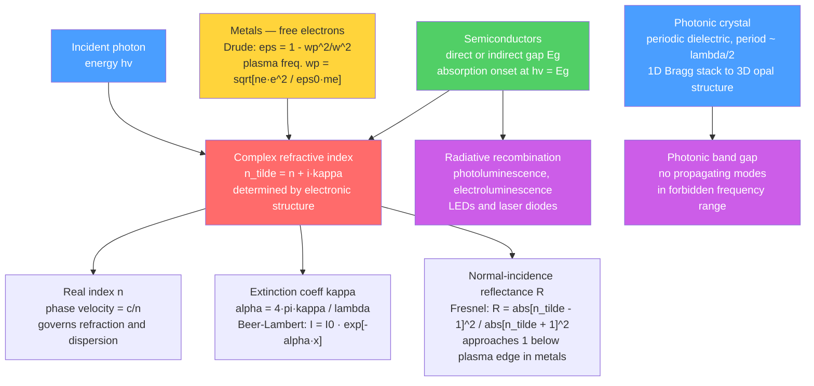

# Optical Properties and Photonic Materials

> [!abstract] TL;DR
> A material's color, transparency, and reflectance are governed by its complex refractive index ñ = n + iκ, which encodes both wave propagation speed (n) and absorption (κ) and is determined entirely by the material's electronic structure — the same physics that makes gold yellow, glass transparent, LEDs glow, and optical fibers carry the internet.

---

## Intuition

**Analogy:** A red tomato, a gold ring, and a glass window look completely different — yet they share the same underlying explanation. Lycopene in tomato skin absorbs blue-green photons (2.5–3 eV) and reflects red ones (~1.8 eV): selective molecular absorption. Gold's conduction-band electrons interact strongly with photons above ~2.3 eV (interband transitions), absorbing them and reflecting the yellow-red remainder: selective metallic absorption. Glass has a band gap of ~8 eV, far above any visible photon, so all visible light passes through without loss: transparency by band structure.

In each case the decisive quantity is identical: how strongly do the material's electrons respond to the oscillating electromagnetic field of the incoming photon? Quantum mechanics encodes this response in the complex permittivity ε(ω). Its square root is the complex refractive index ñ = √ε, which controls every measurable optical outcome — how fast a wave travels, how quickly it decays, and how much bounces back at a surface.

---

## How It Works

### Core Mechanics

**1. Complex refractive index**

When a monochromatic plane wave propagates through a medium, the wavevector k = ñω/c where:

$$\tilde{n} = n + i\kappa$$

- **n** (real part, phase index): the wave travels at phase velocity v = c/n. Governs refraction at interfaces (Snell's law: n₁ sinθ₁ = n₂ sinθ₂) and chromatic dispersion.
- **κ** (imaginary part, extinction coefficient): controls amplitude decay. Intensity falls as exp(−2κωx/c) = exp(−αx), where α is the absorption coefficient.

Both n and κ are real and non-negative for passive media. Causality forces them to be interdependent via the **Kramers–Kronig relations**:

$$n(\omega) - 1 = \frac{2}{\pi}\,\mathcal{P}\!\int_0^\infty \frac{\omega'\,\kappa(\omega')}{\omega'^2 - \omega^2}\,d\omega'$$

Measuring κ across the entire spectrum uniquely determines n — a profound consequence of causality alone.

**2. Reflectance: Fresnel formula at normal incidence**

At a flat interface between vacuum (n = 1) and a material with complex index ñ, the reflected intensity fraction is:

$$R = \left|\frac{\tilde{n} - 1}{\tilde{n} + 1}\right|^2 = \frac{(n-1)^2 + \kappa^2}{(n+1)^2 + \kappa^2}$$

For silver at 2 eV: n ≈ 0.05, κ ≈ 3 → R ≈ (1 + 9)/(1 + 9) ≈ 0.95 (95% reflective).
For glass at 2 eV: n ≈ 1.5, κ ≈ 0 → R = (0.5/2.5)² = 0.04 (4% — nearly invisible reflection).

**3. Absorption: Beer-Lambert law**

The absorption coefficient α links the extinction coefficient to the measurable intensity decay:

$$\alpha = \frac{4\pi\kappa}{\lambda_0}$$

where λ₀ is the vacuum wavelength. Inside an absorbing medium:

$$I(x) = I_0\,\exp(-\alpha x)$$

The penetration (skin) depth is δ = 1/α. For copper at radio wavelengths (1 mm), δ ≈ 66 μm; at visible wavelengths, δ ≈ 25 nm. This is why radio signals travel through building walls but visible light cannot penetrate a sheet of aluminium foil.

**4. Color in metals: Drude free-electron model**

Free electrons in a metal behave like a plasma of unconstrained charges. An oscillating electric field drives them, and their response is captured by the **Drude permittivity**:

$$\varepsilon(\omega) = 1 - \frac{\omega_p^2}{\omega^2 + i\gamma\omega}$$

where the **plasma frequency** is:

$$\omega_p = \sqrt{\frac{n_e\,e^2}{\varepsilon_0\,m_e}}$$

with n_e = free-electron density, e = electron charge, m_e = effective electron mass.

- For ω ≪ ωp: ε is large and negative → n ≈ 0, κ >> 1, R ≈ 1 (perfect metallic reflection).
- For ω > ωp: ε → 1 from below → n → 1, κ → 0, R drops sharply — the metal becomes **transparent** above its plasma frequency.

| Metal | ωp (eV) | Appearance | Physical reason |
|-------|---------|------------|-----------------|
| Aluminum | 14.7 | Silvery-white | R > 90% across entire visible and near-UV |
| Silver | ~9.0 | Bright silver | Very high R in visible; sharp plasma edge ~3.8 eV |
| Gold | ~9.0 | Yellow-gold | Interband transitions at ~2.3 eV absorb blue; not captured by pure Drude |
| Copper | ~9.0 | Reddish | Interband at ~2.1 eV absorbs blue-green |

Quantitative accuracy for Au and Cu requires adding Lorentz oscillator terms for d-band interband transitions on top of the Drude free-electron term.

**5. Absorption edge in semiconductors**

A semiconductor absorbs photons only when hν ≥ E_g. The character of the absorption edge depends on the band structure:

- **Direct gap** (GaAs, InP, GaN): the conduction band minimum and valence band maximum share the same crystal momentum **k**. A single photon provides both energy and satisfies momentum conservation. Absorption rises steeply: $\alpha \propto \sqrt{h\nu - E_g}$ just above the edge.
- **Indirect gap** (Si, Ge): conduction band minimum and valence band maximum are at different **k**. A phonon (quantised lattice vibration) must also participate to conserve momentum. The onset is softer and can occur slightly below the direct gap: $\alpha \propto (h\nu - E_g \pm E_\text{ph})^2$.

This distinction is decisive for optoelectronics: only direct-gap materials emit light efficiently (LEDs, laser diodes), because momentum conservation is satisfied without phonon involvement.

**6. Luminescence**

Luminescence is the inverse of absorption — an electron-hole pair recombines and emits a photon. Different excitation mechanisms define the sub-types:

| Type | Excitation | Timescale | Examples |
|------|-----------|-----------|---------|
| Photoluminescence (PL) | Absorbed photons | ns (spin-allowed) to ms (forbidden) | QDs, fluorescent dyes, ruby |
| Electroluminescence (EL) | Injected current | Same as PL for the material | LEDs, OLEDs |
| Fluorescence | UV photons (S₁ → S₀ singlet) | < 10 ns | Fluorescein, GFP |
| Phosphorescence | UV photons (T₁ → S₀ triplet) | ms to hours | ZnS:Cu, Ce:YAG, glow-in-dark |

Phosphorescence is slow because the T₁ → S₀ transition is spin-forbidden; the electron must flip its spin, requiring spin-orbit coupling to mix states.

**7. Optical fibers: total internal reflection**

When light strikes a boundary from a denser medium (n₁) to a less dense medium (n₂ < n₁), **total internal reflection** (TIR) occurs for angles beyond the critical angle:

$$\theta_c = \arcsin\!\left(\frac{n_2}{n_1}\right)$$

An optical fiber confines light in a high-index silica core (n₁ ≈ 1.46–1.48) surrounded by a slightly lower-index cladding (n₂ ≈ 1.45). The **numerical aperture** (NA) measures the half-angle acceptance cone:

$$\text{NA} = \sqrt{n_1^2 - n_2^2} \approx n_1\sqrt{2\Delta}$$

where Δ = (n₁ − n₂)/n₁ ≈ 0.3–1% for telecom fibers.

Fiber attenuation in dB/km: $A = -10\log_{10}(P_\text{out}/P_\text{in})$. Silica achieves ~0.17 dB/km at 1550 nm — the lowest measured attenuation of any transmission medium.

| Fiber type | Core diameter | Modes | Primary use |
|-----------|-------------|-------|-------------|
| Single-mode (SMF) | 8–10 μm | 1 | Long-haul telecom, >1 km |
| Multimode graded-index | 50–62.5 μm | 100+ | Short-haul LAN, data centers |
| Multimode step-index | 125–200 μm | 1000+ | Short links, illumination, sensing |

Single-mode operation requires V-number < 2.405, where $V = 2\pi a\,\text{NA}/\lambda$ and a is the core radius.

**8. Photonic crystals**

A photonic crystal is a medium with a **periodic variation in dielectric constant** on the scale of the optical wavelength (~λ/2). Just as the periodic atomic potential creates electronic band gaps (forbidden electron energies), the periodic dielectric contrast creates a **photonic band gap** — a range of frequencies for which electromagnetic wave propagation is forbidden for all wavevectors and polarisations.

The underlying physics is Bragg diffraction of light: destructive interference of partial reflections from each dielectric interface at the Brillouin zone boundary. For a 1D Bragg stack (alternating layers n_H, n_L with thicknesses d_H, d_L), the stop band is centred at:

$$\lambda_\text{Bragg} = 2(n_H d_H + n_L d_L)$$

The width of the photonic gap scales with the dielectric contrast ratio n_H/n_L. A complete 3D photonic band gap (forbidden at all angles and both polarisations) requires sufficient contrast (ε_H/ε_L > ~2 for FCC opal lattice) and occurs in structures such as woodpile, diamond, and inverse-opal architectures.

**9. Nonlinear optics**

At high light intensities (pulsed lasers, ~GW/cm²), the polarisation of a medium responds nonlinearly to the electric field:

$$\mathbf{P} = \varepsilon_0\!\left[\chi^{(1)}\mathbf{E} + \chi^{(2)}\mathbf{E}^2 + \chi^{(3)}\mathbf{E}^3 + \cdots\right]$$

**Second-order effects** (require non-centrosymmetric crystals, χ⁽²⁾ ≠ 0 by inversion symmetry breaking):
- **Second harmonic generation (SHG)**: two photons at ω combine to produce one photon at 2ω. Requires phase matching: n(ω) = n(2ω).
- **Optical rectification**: an intense AC field drives a DC polarisation, generating terahertz radiation.

**Third-order effects** (χ⁽³⁾ ≠ 0 in all materials, including centrosymmetric):
- **Third harmonic generation (THG)**: three ω → one 3ω
- **Kerr effect**: intensity-dependent refractive index n = n₀ + n₂I, leading to self-phase modulation and optical soliton propagation in fibers.

The **phase-matching condition** for SHG is Δk = k(2ω) − 2k(ω) = 0. Without it, the SHG signal oscillates with crystal length L with coherence length L_c = π/|Δk| ≈ 10 μm. Phase matching is achieved by angle tuning birefringent crystals (BBO, KDP) or quasi-phase matching via periodic domain inversion in LiNbO₃ waveguides (PPLN).

### Flow / Architecture



---

## Key Concepts

### Secondary

**Why is glass transparent?**
Glass (amorphous SiO₂) has a band gap of ~8 eV. Visible photons carry only 1.77–3.1 eV — far below the gap. No electronic transition is available to absorb them, so they propagate through freely. Infrared photons (0.05–0.5 eV) are absorbed because they excite Si–O bond vibrations (phonons). UV photons above 8 eV bridge the electronic gap and are absorbed. The transparency window is determined entirely by the gap.

**Why do metals shine?**
Free electrons in metals can respond to photons of any energy because there is no gap in the conduction band — electrons can always find slightly higher states to transition into. They oscillate in phase with the incoming field and re-radiate it as a reflected wave. Below ωp, essentially all incident energy is reflected. Above ωp, the electron plasma cannot follow the fast field oscillations, reflection collapses, and the metal becomes transparent in the UV (aluminium is transparent above ~80 nm).

**What makes an LED glow?**
In a direct-gap p-n junction under forward bias, injected electrons (from the n-side) and holes (from the p-side) meet in the active region and recombine, releasing the band gap energy as photons. The colour is tuned by changing the semiconductor: AlGaAs for red (~660 nm), InGaN for green (~520 nm) and blue (~450 nm), GaN for near-UV. Silicon cannot make an efficient LED because its indirect gap requires phonon assistance, making radiative recombination far too slow.

**How does an optical fiber guide light without loss?**
The silica core (n₁ = 1.46) and glass cladding (n₂ = 1.45) differ in refractive index by less than 1%. Any ray that hits the core-cladding boundary at an angle shallower than the critical angle (arcsin 1.45/1.46 ≈ 83°) satisfies TIR and is perfectly reflected back into the core. There is no transmission into the cladding — the light is trapped. On an intercontinental scale, only material absorption (Rayleigh scattering, OH⁻ overtones) attenuates the signal.

### Undergraduate

**Kramers–Kronig relations and sum rules**

Causality — the principle that a material cannot respond before being excited — imposes an exact relationship between the real and imaginary parts of ε(ω):

$$\varepsilon_1(\omega) - 1 = \frac{2}{\pi}\,\mathcal{P}\!\int_0^\infty \frac{\omega'\,\varepsilon_2(\omega')}{\omega'^2 - \omega^2}\,d\omega'$$

The **f-sum rule** follows from the high-frequency limit of this relation:

$$\int_0^\infty \omega\,\varepsilon_2(\omega)\,d\omega = \frac{\pi\,\omega_p^2}{2}$$

Measuring the total integrated absorption spectrum over all frequencies is equivalent to counting all electrons (through ωp = √(n_e e²/ε₀m_e)). This sum rule is used to verify optical data and to extract carrier densities from ellipsometry.

**Tauc plots: extracting E_g from optical absorption**

Near the absorption edge, α follows power-law behaviour:

$$(\alpha h\nu)^{1/r} \propto (h\nu - E_g)$$

where r = 1/2 for direct allowed, r = 2 for indirect allowed, r = 3/2 for direct forbidden transitions. Plotting (αhν)^{2} vs hν for a direct-gap material (Tauc plot) gives a straight line whose x-intercept is E_g. Using the wrong exponent gives a systematically incorrect band gap.

**Colour centres and impurity-controlled absorption**

Transition metal ions introduce d-orbital levels inside the host gap. Cr³⁺ in Al₂O₃ (ruby) absorbs in the green/blue (crystal field splitting ≈ 2.2 eV) and transmits red → red crystal. The same Cr³⁺ in Be₃Al₂Si₆O₁₈ (emerald) sees a different crystal field, shifting absorption to absorb red and violet while transmitting green → green crystal. F-centres (electrons trapped at anion vacancies in ionic crystals) produce colour by the same mechanism: the electron oscillates in the vacancy potential like a particle-in-a-box, absorbing visible photons.

**Numerical aperture and V-number for fiber modes**

The number of guided modes scales as $N \approx V^2/2$ for a step-index fiber. Single-mode operation requires the V-number below 2.405 (first zero of Bessel function J₀). At λ = 1310 nm with NA = 0.12, the maximum core radius for single-mode operation is:

$$a_\text{max} = \frac{2.405\,\lambda}{2\pi\,\text{NA}} = \frac{2.405 \times 1310\,\text{nm}}{2\pi \times 0.12} \approx 4.17\,\mu\text{m}$$

This tiny core requires precision splicing and connectors, but eliminates modal dispersion — the main advantage of single-mode fibers for long-distance transmission.

### Graduate

**Drude–Lorentz model and interband transitions**

The full optical permittivity of a real metal combines a Drude free-electron term with Lorentz bound-electron oscillators:

$$\varepsilon(\omega) = 1 - \frac{\omega_p^2}{\omega^2 + i\gamma\omega} + \sum_j \frac{f_j\,\omega_{p,j}^2}{\omega_j^2 - \omega^2 - i\gamma_j\omega}$$

For gold, two Lorentz oscillators centred at ~2.3 eV and ~3.1 eV (transitions from the filled d-band to the Fermi level) reproduce the measured ε(ω) across the visible, quantitatively predicting the yellow colour and the onset of near-UV absorption. Silver has no interband transitions in the visible, so the pure Drude model works well there.

**Photonic crystal band structure**

Maxwell's equations in a photonic crystal reduce to a Hermitian eigenvalue problem:

$$\nabla \times \left[\frac{1}{\varepsilon(\mathbf{r})}\,\nabla \times \mathbf{H}\right] = \frac{\omega^2}{c^2}\mathbf{H}$$

Bloch's theorem applies identically to photons: modes are labelled (n, **k**) and the photonic band structure ωₙ(**k**) displays gaps wherever Bragg reflection creates destructive interference. A **complete photonic band gap** (forbidden for all **k** and both polarisations) requires 3D periodicity and sufficient dielectric contrast (ε_H/ε_L ≳ 2 for FCC opal, ≳ 6 for simple cubic).

Line defects in a photonic crystal create **photonic crystal waveguides** with near-zero group velocity (flat band → ng ~ 100). Point defects create **photonic crystal cavities** with enormous quality factors (Q ~ 10⁶ in Si slabs) and sub-cubic-wavelength mode volumes V. The **Purcell factor** quantifies the emission-rate enhancement of a dipole emitter placed in such a cavity:

$$F_P = \frac{3}{4\pi^2}\left(\frac{\lambda}{n}\right)^3\frac{Q}{V}$$

A quantum dot in a photonic crystal cavity with Q = 10⁵ and V = (λ/n)³ achieves F_P ~ 10⁴ — the radiative lifetime is shortened by four orders of magnitude, enabling near-deterministic single-photon emission.

**Nonlinear susceptibilities and phase matching in depth**

Kleinman symmetry in a lossless medium makes the SHG coefficient tensor d_ijk = χ²_ijk/2 fully symmetric. The SHG conversion efficiency for a phase-matched crystal of length L with input peak intensity I₀:

$$\eta_\text{SHG} = \frac{P_{2\omega}}{P_\omega} = \frac{8\pi^2 d_\text{eff}^2 L^2 I_0}{n^3\,\varepsilon_0 c\,\lambda^2}$$

Key NLO materials sorted by d_eff:

| Material | d_eff (pm/V) | Phase-matching | Application |
|----------|------------|----------------|------------|
| KH₂PO₄ (KDP) | ~0.4 | Type I angle-tuned | High-energy 3ω pulses at ICF |
| β-BaB₂O₄ (BBO) | ~2.0 | Type I/II angle-tuned | Broad UV-vis SHG |
| LiNbO₃ (bulk) | ~5.8 | Temperature-tuned | OPO |
| PPLN waveguide | ~17 (effective) | Quasi-phase matching | High-efficiency CW 2ω |

Quasi-phase matching via periodic domain inversion (Λ ≈ 18–20 μm for 1064→532 nm in LiNbO₃) relaxes the crystal cut and temperature constraints, enables use of the largest d tensor element, and is now the dominant technology for compact green laser pointers and squeezed-light sources in quantum optics.

---

## Python Demo

```python
import numpy as np
import matplotlib.pyplot as plt

# Drude free-electron model: complex permittivity in energy units
#   eps(hv) = 1 - wp^2 / [hv * (hv + i*gamma)]   (energies in eV)
# Fresnel reflectance at normal incidence:
#   R = |(n_tilde - 1) / (n_tilde + 1)|^2   where n_tilde = sqrt(eps)

# Drude parameters (Rakic et al. 1998, Appl. Opt. 37, 5271)
# wp = plasma frequency (eV),  gamma = damping rate (eV)
drude_params = {
    "Aluminum": {"wp": 14.7,  "gamma": 0.08,  "color": "#5b9bd5"},
    "Silver":   {"wp": 9.01,  "gamma": 0.018, "color": "#888888"},
    "Gold":     {"wp": 9.03,  "gamma": 0.053, "color": "#c8a400"},
}

hv = np.linspace(0.5, 16.0, 2000)   # photon energy sweep in eV

fig, ax = plt.subplots(figsize=(9, 5))

for metal, p in drude_params.items():
    wp, gamma = p["wp"], p["gamma"]
    # Complex permittivity: 1D array of dtype complex128
    eps = 1.0 - wp**2 / (hv * (hv + 1j * gamma))
    # Principal square root — numpy guarantees Re[n_tilde] >= 0
    n_tilde = np.sqrt(eps)
    # Normal-incidence Fresnel reflectance
    R = np.abs((n_tilde - 1.0) / (n_tilde + 1.0))**2
    ax.plot(hv, R, color=p["color"], lw=2.0, label=metal)
    # Mark each plasma frequency with a dashed vertical line
    ax.axvline(wp, color=p["color"], lw=1.0, ls="--", alpha=0.55)

# Shade visible spectral range (400–700 nm = 1.77–3.10 eV)
ax.axvspan(1.77, 3.10, alpha=0.15, color="gold", zorder=0, label="Visible (400–700 nm)")

ax.set_xlabel("Photon energy  (eV)", fontsize=12)
ax.set_ylabel("Normal-incidence reflectance  R", fontsize=12)
ax.set_title(
    "Drude free-electron model: Al, Ag, Au\n"
    "Dashed lines = plasma frequencies  |  Note: pure Drude cannot reproduce Au/Cu colour (interband terms needed)",
    fontsize=10,
)
ax.set_xlim(0.5, 16.0)
ax.set_ylim(0.0, 1.05)
ax.axhline(1.0, color="gray", lw=0.7, ls=":")
ax.legend(fontsize=11)
ax.grid(alpha=0.3)

plt.tight_layout()
plt.savefig("drude_reflectance.png", dpi=150)
plt.show()
```

The plot reveals three features that directly explain observed metal colors:

1. **Perfect reflection in the visible for all three metals** — all have ωp far above 3.1 eV, so R ≈ 1 across the entire visible range in the free-electron picture.
2. **Sharp plasma edges** — Al drops at ~14.7 eV (deep UV), Ag at ~9 eV. Below the edge, Re[ε] < 0 and the wave is evanescent. Above it, the metal transmits.
3. **Drude limitation on gold color** — Au and Ag have nearly identical plasma frequencies, so the *pure* Drude model predicts they look identical (both silvery). The yellow color of gold arises from d-band interband transitions near 2.3 eV, which are entirely absent from the free-electron model and must be added via Lorentz oscillators.

---

## Real-World Applications

> **Submarine optical cables:** Modern transoceanic cables (e.g., MAREA, 6,600 km Atlantic crossing) carry ~160 Tbit/s over a single cable via dense wavelength-division multiplexing (DWDM) in the C+L band (1530–1625 nm). The 1550 nm window is chosen because silica fiber hits its absolute attenuation minimum (0.17 dB/km) there: Rayleigh scattering (∝ λ⁻⁴) is minimised and OH⁻ absorption is absent. Erbium-doped fiber amplifiers (EDFA) exploit the ⁴I₁₃/₂ → ⁴I₁₅/₂ optical transition of Er³⁺ at 1550 nm to regenerate signals every ~80 km without opto-electronic conversion.

> **GaN blue LED (Nakamura's Nobel discovery, 1994):** GaN has a direct band gap of 3.4 eV. By growing InGaN quantum wells (In composition 15–25%), the emission is shifted to 450–520 nm (blue-green). White LEDs add a Ce³⁺:YAG phosphor that converts part of the blue to broad yellow emission (photoluminescence), producing the white spectrum used in all modern LED lighting. Efficiency exceeds 50% internal quantum efficiency — impossible in indirect-gap Si.

> **Second harmonic generation for green laser pointers:** A 1064 nm pulsed Nd:YAG or 976 nm diode laser is frequency-doubled to 532 nm (green) using a periodically-poled LiNbO₃ (PPLN) waveguide. The periodic domain inversion (Λ ≈ 19 μm) achieves quasi-phase matching over a broad temperature range with conversion efficiencies exceeding 50%. The same PPLN technology in the reverse direction (optical parametric oscillation) produces widely tunable infrared light for spectroscopy.

> **Photonic crystal fiber (PCF) for supercontinuum generation:** Air holes in a triangular lattice around a solid silica core shift the zero-dispersion wavelength to 800 nm — matching Ti:Sapphire lasers. A single femtosecond pulse launched into a 20 cm PCF undergoes soliton fission, self-phase modulation, and Raman shifting, broadening the spectrum to 400–2400 nm. This white-light supercontinuum is used in optical coherence tomography (OCT), fluorescence microscopy, and environmental gas sensing.

> **Anti-reflection coatings on solar cells:** Bare silicon reflects ~35% of incident light. A single λ/4 SiN_x layer (n ≈ 2.05 at 600 nm) reduces reflection to ~3% by destructive interference of partial reflections from top and bottom interfaces. Multi-layer AR stacks reduce it further to <1% over a broad wavelength range. Every percentage point of improved light capture translates directly to solar cell efficiency.

---

## Common Pitfalls

- **Confusing phase index n with group index n_g** — The group index n_g = n − λ(dn/dλ) governs pulse propagation speed (v_g = c/n_g). Near resonances dn/dλ is large and n_g >> n. Phase-matching calculations for SHG must use n (phase index); pulse delay calculations and dispersion management must use n_g. In slow-light photonic crystal waveguides, n_g ~ 100 while n ≈ 2.

- **Sign convention for ε(ω)** — Physics uses exp(−iωt): ε = ε₁ + iε₂ with ε₂ > 0 for loss. Engineering/RF uses exp(+jωt): ε = ε' − jε'' with ε'' > 0 for loss. The Drude formula appears with a sign flip depending on the convention. Mixed-convention data lead to n < 0 artifacts (negative index confusion) when κ values are subtracted rather than added.

- **Applying Beer-Lambert to scattering media** — I = I₀ exp(−αx) assumes a homogeneous, non-scattering medium. Biological tissue, ceramic powders, and nanoparticle dispersions scatter strongly; the appropriate attenuation coefficient is μ_t = μ_a + μ_s (absorption + scattering). Ignoring scattering can underestimate true optical density by orders of magnitude.

- **Assuming indirect-gap semiconductors make usable LEDs** — Silicon's radiative recombination lifetime is ~1 ms (phonon-assisted, low probability). Non-radiative Shockley-Read-Hall recombination via defect levels occurs in ~1 μs — 1000 times faster. Silicon's LED internal quantum efficiency is < 0.01%. Direct-gap GaAs has a radiative lifetime of ~1 ns, so it dominates over typical non-radiative channels at reasonable doping.

- **Forgetting phase matching in SHG** — Without Δk = 0, SHG intensity oscillates with crystal length with period 2L_c = 2π/|Δk| ≈ 20–30 μm (coherence length in BBO). Over a 1 cm crystal the power pumped into 2ω is re-converted back on each coherence length, producing negligible net conversion. Phase matching extends the effective interaction length from ~10 μm to the full crystal length, raising efficiency by (L/L_c)² ~ 10⁶.

- **Wrong Tauc exponent for indirect materials** — For an indirect-gap semiconductor, plot (αhν)^{1/2} vs hν; the x-intercept of the linear region gives E_g(indirect). Plotting (αhν)² as for a direct gap gives a curved line with no clean intercept, and fitting it anyway yields a number that is neither the direct nor the indirect gap.

---

## Related Concepts

**Existing vault notes:**

- [[Electronic_Band_Structure]] — provides the quantum mechanical origin of ε(ω), the DOS, and transition matrix elements that determine n and κ for any material class
- [[Semiconductors_Intrinsic_and_Extrinsic]] — band gap, carrier concentration, and the direct/indirect distinction underpin luminescence efficiency, absorption edge position, and LED design
- [[Electromagnetic_Waves_and_Radiation]] — Maxwell-equation foundation for wave propagation in media; the link between ε, μ, and the complex refractive index is derived there
- [[Semiconductors_and_Devices]] — device-level applications (laser diodes, photodetectors, solar cells) built directly on the optical properties covered here
- [[Ocean_Optics_and_Light_Penetration]] — applies Beer-Lambert attenuation and the absorption spectra of water, chlorophyll, and dissolved organics to oceanographic remote sensing; a direct application of α(λ)
- [[_MOC_Physics_Master]] — master index for cross-domain physics connections including condensed matter and electromagnetism

**Forward links (same vault — notes planned):**

- [[p_n_Junctions_and_Diodes]] — electroluminescence and photodetection require understanding of minority-carrier injection, recombination zones, and junction fields under bias
- [[Two_Dimensional_Materials_Beyond_Graphene]] — MoS₂, WSe₂, and other TMDs are direct-gap 2D semiconductors with valley-selective circularly polarised photoluminescence and giant excitonic binding energies
- [[Nanoparticles_and_Colloidal_Systems]] — localised surface plasmon resonance (LSPR) in Au and Ag nanoparticles arises when ε₁(ω) = −2ε_medium, producing intense, geometry-tunable extinction peaks in the visible
- [[_MOC_Electronic_Magnetic_and_Optical_Properties]] — section map of the optical, electronic, and magnetic properties module in this vault

---

## Review Questions

**Conceptual (Secondary)**
1. Ruby and emerald both contain Cr³⁺ impurities, yet one is red and the other green. Using crystal field theory and the concept of selective absorption, explain why they differ in color.
2. A step-index fiber has n₁ = 1.48, n₂ = 1.46. Calculate the critical angle at the core-cladding boundary, the numerical aperture, and the V-number at λ = 850 nm for a 25 μm core radius. Is this fiber single-mode?
3. Why does increasing the operating wavelength from 850 nm to 1550 nm in a silica fiber reduce signal attenuation by roughly a factor of 7? Identify the dominant loss mechanism.

**Analytical (Undergraduate)**
4. Starting from the Drude permittivity ε(ω) = 1 − ωp²/(ω² + iγω), show that for ω >> ωp and γ → 0, R → 0 and derive the leading-order expression for R as a function of ωp/ω. What does this predict for aluminium at 20 eV?
5. A semiconductor shows Beer-Lambert absorption that follows (αhν)^{1/2} ∝ (hν − 1.12 eV) for hν between 1.15 and 1.4 eV. The absorption rises steeply again above 3.4 eV. Identify the gap type in each energy range, determine both band gaps, and explain why silicon cannot make an efficient LED.
6. Derive the Beer-Lambert relation I = I₀ exp(−αx) from the wave equation for a plane wave in a medium with complex ñ = n + iκ. Then calculate the skin depth for silver at λ = 500 nm given κ_Ag ≈ 3.0.

**Synthesis (Graduate)**
7. A photonic crystal nanocavity in a silicon slab has Q = 3 × 10⁵ and V = 1.5(λ/n)³. A quantum dot emitter is placed at the field maximum. Estimate the Purcell factor, the enhanced radiative rate, and the resulting internal quantum efficiency if the non-radiative rate is 10⁸ s⁻¹ and the free-space radiative rate is 10⁶ s⁻¹. What limits Q in real fabricated silicon photonic crystal cavities?
8. Explain, using symmetry arguments, why a centrosymmetric crystal has χ⁽²⁾ = 0 exactly. How does quasi-phase matching in periodically-poled LiNbO₃ overcome both the phase-mismatch problem and the limitation of angle-tuned BBO, and why does PPLN achieve higher effective d_eff?
9. A material has a sharp absorption peak (Lorentz oscillator) centred at ω₀ in κ(ω). Without computing the Kramers–Kronig integral explicitly, sketch n(ω) in the vicinity of ω₀ and describe what anomalous dispersion means physically. Why does anomalous dispersion not violate Einstein causality despite appearing to support superluminal group velocities?

---

## Sources

- [W. D. Callister & D. G. Rethwisch, *Materials Science and Engineering: An Introduction*, 10th ed., Wiley (2018) — Ch. 21: Optical Properties](https://www.wiley.com/en-us/Materials+Science+and+Engineering%3A+An+Introduction%2C+10th+Edition-p-9781119405498)
- [M. Fox, *Optical Properties of Solids*, 2nd ed., Oxford University Press (2010)](https://global.oup.com/academic/product/optical-properties-of-solids-9780199573363)
- [J. D. Joannopoulos, S. G. Johnson et al., *Photonic Crystals: Molding the Flow of Light*, 2nd ed., Princeton University Press (2008)](https://ab-initio.mit.edu/book/)
- [A. D. Rakic et al., "Optical Properties of Metallic Films for Vertical-Cavity Optoelectronic Devices," *Appl. Opt.* 37, 5271 (1998) — Drude–Lorentz parameters for Al, Ag, Au](http://www.wave-scattering.com/drudefit.html)
- [R. W. Boyd, *Nonlinear Optics*, 4th ed., Academic Press (2020)](https://www.elsevier.com/books/nonlinear-optics/boyd/978-0-12-811002-7)

---

#MaterialsScience #OpticalProperties #Photonics #Luminescence #ComplexRefractiveIndex #DrudeModel #PhotonicCrystal #NonlinearOptics #OpticalFibers
