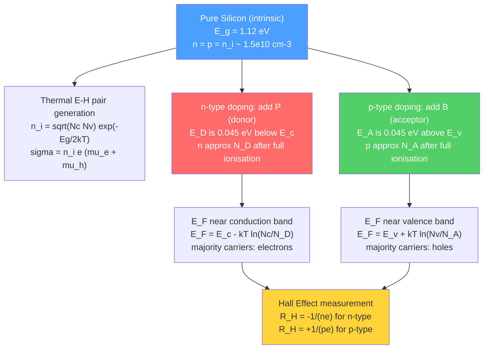

# Semiconductors: Intrinsic and Extrinsic

> [!abstract] TL;DR
> A pure semiconductor has an almost-empty conduction band and almost-full valence band separated by a small gap E_g; adding controlled impurities (doping) shifts the balance of electrons and holes by orders of magnitude, enabling every transistor, LED, and solar cell in modern technology.

---

## Intuition

**Analogy:** Imagine a two-lane highway. The lower lane (valence band) is completely packed with cars; the upper lane (conduction band) is empty. A car can only move if it has room — so a bumper-to-bumper lower lane and an empty upper lane both carry zero traffic. A *pure (intrinsic) semiconductor* is like this highway at room temperature: a tiny fraction of cars have just enough energy to jump the barrier into the upper lane, leaving "holes" (empty spaces) behind in the lower lane that can also flow like traffic moving backward. *Doping* is like permanently installing a few ramps (donors) that inject extra cars into the upper lane (n-type), or a few drain traps (acceptors) that suck cars out of the lower lane, leaving extra holes (p-type). A handful of ramps can change the traffic by a billion-fold.

The analogy extends to temperature: on a hot day more cars have enough energy to jump; cool it to near absolute zero and the road freezes entirely. This extreme thermal sensitivity is the double-edged sword of semiconductor engineering.

---

## How It Works

### Core Mechanics

1. **Energy band gap E_g:** The energy separation between the top of the valence band (E_v) and the bottom of the conduction band (E_c). Electrons can occupy states at or below E_v or at or above E_c — never in between.

2. **Intrinsic excitation:** Thermal energy promotes electrons across the gap, simultaneously creating a hole in the valence band. Because they always come in pairs: $n = p = n_i$ (intrinsic carrier concentration).

3. **Intrinsic carrier concentration:**
$$n_i = \sqrt{N_c N_v}\,\exp\!\left(-\frac{E_g}{2k_BT}\right)$$
where the effective density-of-states (DOS) at the band edges scale as $T^{3/2}$:
$$N_c = 2\!\left(\frac{2\pi m_e^* k_B T}{h^2}\right)^{\!\!3/2}, \qquad N_v = 2\!\left(\frac{2\pi m_h^* k_B T}{h^2}\right)^{\!\!3/2}$$
The exponential wins over the $T^{3/2}$ prefactor: $n_i$ roughly **doubles for every ~11 °C rise** in silicon near room temperature.

4. **Intrinsic conductivity:** $\sigma = n_i\, e\,(\mu_e + \mu_h)$, where $\mu_e$ and $\mu_h$ are electron and hole mobilities (cm² V⁻¹ s⁻¹).

5. **Doping — controlled impurities:**
   - **n-type** (donor): Pentavalent atoms (P, As in Si) occupy lattice sites and donate one electron to the conduction band. Donor level E_D lies ~0.04–0.05 eV below E_c — easily ionised at 300 K.
   - **p-type** (acceptor): Trivalent atoms (B, Al in Si) accept one electron from the valence band, creating a hole. Acceptor level E_A lies ~0.04–0.05 eV above E_v.

6. **Charge neutrality:** At any temperature, the total positive charge equals the total negative charge:
$$n + N_A^- = p + N_D^+$$
At room temperature (complete ionisation), $N_D^+ \approx N_D$ and $N_A^- \approx N_A$.

7. **Mass-action law** (always holds in thermal equilibrium):
$$np = n_i^2$$

8. **Extrinsic carrier concentrations** (dominant dopant, $N_D \gg n_i$):
$$n \approx N_D, \qquad p \approx \frac{n_i^2}{N_D} \quad \text{(n-type)}$$
$$p \approx N_A, \qquad n \approx \frac{n_i^2}{N_A} \quad \text{(p-type)}$$

### Flow / Architecture



---

## Key Concepts

### Secondary

**What is a semiconductor?**
Silicon has four valence electrons forming four covalent bonds in a diamond cubic lattice. At 0 K, all bonds are satisfied — no free carriers, zero conductivity. Above 0 K, thermal energy breaks some bonds, releasing electrons (free to move) and holes (the broken-bond site that neighbouring electrons can hop into). The result: conductivity that rises exponentially with temperature — the opposite of a metal.

**Common semiconductors and their band gaps:**

| Material | E_g (eV) | Gap type | n_i at 300 K (cm⁻³) | Key use |
|----------|----------|----------|----------------------|---------|
| Si | 1.12 | Indirect | ~1.5 × 10¹⁰ | CMOS, solar cells |
| Ge | 0.67 | Indirect | ~2.4 × 10¹³ | Early transistors, IR detectors |
| GaAs | 1.43 | Direct | ~1.8 × 10⁶ | LEDs, RF transistors |
| GaN | 3.4 | Direct | ~10⁻¹⁰ | Blue LEDs, power devices |
| SiC | 3.26 | Indirect | ~10⁻⁶ | High-voltage power electronics |

**Direct vs indirect gap:** In a direct-gap material (GaAs), the conduction band minimum and valence band maximum are at the same crystal momentum **k** — an electron-hole recombination can emit a photon directly. In an indirect-gap material (Si, Ge), a phonon (lattice vibration) must also participate to conserve momentum, making optical emission inefficient. This is why Si does not make good LEDs.

### Undergraduate

**Fermi-Dirac statistics and the Fermi level:**
The probability that a state at energy E is occupied is:
$$f(E) = \frac{1}{1 + \exp\!\left(\frac{E - E_F}{k_BT}\right)}$$
The Fermi level E_F is the chemical potential for electrons. In an intrinsic semiconductor:
$$E_F^{\text{int}} = \frac{E_c + E_v}{2} + \frac{k_BT}{2}\ln\!\left(\frac{N_v}{N_c}\right) \approx E_{\text{midgap}}$$
(small correction because $N_v \neq N_c$ in general; for Si the correction is $\approx -0.013$ eV at 300 K).

**Fermi level in doped materials:**

*n-type* ($N_D \gg n_i$, complete ionisation):
$$E_F = E_c - k_BT\ln\!\left(\frac{N_c}{N_D}\right)$$
As $N_D$ increases, $E_F$ moves toward E_c. At $N_D = N_c$, $E_F = E_c$ (degenerate semiconductor — behaves metal-like).

*p-type* ($N_A \gg n_i$, complete ionisation):
$$E_F = E_v + k_BT\ln\!\left(\frac{N_v}{N_A}\right)$$

**Hall effect — measuring carrier type and density:**
A current $I$ flows along x; a magnetic field $B$ is applied along z. The Lorentz force deflects carriers to one side, building up a transverse Hall voltage $V_H$:
$$V_H = \frac{IB}{nqt}$$
where $t$ is the sample thickness. The Hall coefficient:
$$R_H = \frac{E_y}{J_x B_z} = \begin{cases} -\dfrac{1}{ne} & \text{n-type} \\[6pt] +\dfrac{1}{pe} & \text{p-type} \end{cases}$$
The sign of $V_H$ directly identifies the majority carrier type; the magnitude gives carrier density $n$ or $p$.

**Carrier mobility:**
$$\mu = \frac{e\tau}{m^*}$$
where $\tau$ is the mean time between scattering events and $m^*$ is the carrier effective mass. Two dominant scattering mechanisms:

| Mechanism | Origin | Temperature dependence |
|-----------|--------|------------------------|
| Phonon (lattice) scattering | Thermal lattice vibrations disrupt carrier motion | $\mu \propto T^{-3/2}$ (decreases with T) |
| Ionised impurity scattering | Coulomb deflection by charged dopant ions | $\mu \propto T^{+3/2}$ (increases with T) |

At 300 K in lightly doped Si: $\mu_e \approx 1350$ cm² V⁻¹ s⁻¹, $\mu_h \approx 480$ cm² V⁻¹ s⁻¹. Heavy doping ($N_D > 10^{17}$ cm⁻³) reduces mobility significantly through impurity scattering.

**Resistivity and sheet resistance:**
$$\rho = \frac{1}{\sigma} = \frac{1}{e(n\mu_e + p\mu_h)}$$
For n-type with complete ionisation: $\rho \approx 1/(eN_D\mu_e)$. A doping of $10^{16}$ cm⁻³ gives Si a resistivity of ~0.5 Ω·cm — roughly 10 orders of magnitude lower than intrinsic Si.

### Graduate

**Temperature regimes in extrinsic semiconductors:**

Three distinct regions describe how carrier concentration varies with temperature in an n-type semiconductor:

1. **Freeze-out (low T, < ~100 K for Si):** $k_BT \ll E_c - E_D$. Donors are not ionised; electrons "freeze" onto donor atoms. $n \ll N_D$. Conductivity plummets.
2. **Extrinsic (saturation, 100–500 K for Si):** All donors ionised, $n = N_D$. Carrier concentration is flat; conductivity decreases slowly because mobility falls ($\mu \propto T^{-3/2}$).
3. **Intrinsic (high T, > ~500 K for Si):** $n_i$ becomes comparable to $N_D$; intrinsic carrier generation dominates. Conductivity rises again exponentially. This sets the upper operating temperature of Si devices (~150 °C).

**Compensation doping:**
If both donors and acceptors are present simultaneously:
$$n + N_A = p + N_D$$
With $N_D > N_A$ (net n-type): $n \approx N_D - N_A$, but ionised impurity scattering is increased by the total impurity count $N_D + N_A$, degrading mobility. Heavily compensated material has both low carrier density and poor mobility.

**Effective density of states — derivation sketch:**
Starting from the 3D free-electron DOS $g(E) = (1/2\pi^2)(2m^*/\hbar^2)^{3/2}\sqrt{E - E_c}$ near the band edge and integrating against the Fermi function under non-degenerate conditions ($E_c - E_F \gg k_BT$):
$$n = \int_{E_c}^{\infty} g(E)\,f(E)\,dE = N_c\,\exp\!\left(-\frac{E_c - E_F}{k_BT}\right)$$
This is the origin of $N_c$. The physical content: $N_c$ is the effective number of states at $E_c$ that the carrier "sees" within $k_BT$ of the band edge. Its $T^{3/2}$ scaling reflects that the thermal de Broglie wavelength $\lambda_{\text{th}} = h/\sqrt{2\pi m^* k_BT}$ shrinks with temperature, fitting more states per unit volume.

---

## Python Demo

```python
import numpy as np
import matplotlib.pyplot as plt

# Physical constants
k_eV = 8.617e-5       # Boltzmann constant in eV/K

# Semiconductor parameters: N_c, N_v at 300 K (cm^-3), E_g in eV
# N_c and N_v scale as (T/300)^1.5; E_g held constant (approximation)
materials = {
    "Si":   {"Eg": 1.12,  "Nc300": 2.80e19, "Nv300": 1.04e19, "color": "#1f77b4"},
    "Ge":   {"Eg": 0.67,  "Nc300": 1.04e19, "Nv300": 6.00e18, "color": "#d62728"},
    "GaAs": {"Eg": 1.43,  "Nc300": 4.70e17, "Nv300": 7.00e18, "color": "#2ca02c"},
}

T = np.linspace(200, 600, 800)

fig, ax = plt.subplots(figsize=(9, 6))

for name, p in materials.items():
    Nc = p["Nc300"] * (T / 300.0) ** 1.5
    Nv = p["Nv300"] * (T / 300.0) ** 1.5
    ni = np.sqrt(Nc * Nv) * np.exp(-p["Eg"] / (2.0 * k_eV * T))
    ax.semilogy(T, ni, label=f"{name}  (E_g = {p['Eg']} eV)", color=p["color"], linewidth=2.5)

# Mark 300 K reference line
ax.axvline(300, color="gray", linestyle="--", linewidth=1.2, alpha=0.7, label="T = 300 K")

# Annotate 300 K values
for name, p in materials.items():
    ni_300 = np.sqrt(p["Nc300"] * p["Nv300"]) * np.exp(-p["Eg"] / (2.0 * k_eV * 300))
    ax.annotate(
        f"{name}: {ni_300:.1e}",
        xy=(300, ni_300),
        xytext=(320, ni_300 * 1.8),
        fontsize=9,
        color=p["color"],
        arrowprops=dict(arrowstyle="->", color=p["color"], lw=1),
    )

ax.set_xlabel("Temperature (K)", fontsize=13)
ax.set_ylabel("Intrinsic carrier concentration n_i (cm⁻³)", fontsize=13)
ax.set_title("n_i vs Temperature for Si, Ge, and GaAs\n(constant E_g approximation)", fontsize=13)
ax.set_ylim(1e1, 1e22)
ax.legend(fontsize=11)
ax.grid(True, which="both", alpha=0.3)
plt.tight_layout()
plt.savefig("ni_vs_temperature.png", dpi=150)
plt.show()

# Print 300 K summary
print("Intrinsic carrier concentration at 300 K:")
for name, p in materials.items():
    ni_300 = np.sqrt(p["Nc300"] * p["Nv300"]) * np.exp(-p["Eg"] / (2.0 * k_eV * 300))
    print(f"  {name:6s}: {ni_300:.2e} cm^-3")
```

**What to observe:**
- All three curves are exponentially steep — the log scale is essential.
- **Ge** has the highest n_i at every temperature (smallest E_g) — it goes intrinsic at lower T.
- **GaAs** stays intrinsic at an extremely low level well past 500 K — useful for high-temperature operation.
- **Si** hits its practical extrinsic-to-intrinsic crossover around 500 K for typical doping levels (~10¹⁶ cm⁻³), explaining the ~150 °C upper limit for Si integrated circuits.

---

## Real-World Applications

> **Example 1 — CMOS integrated circuits (Intel, TSMC):** Every MOSFET in a CPU is built from a doped Si region. The source and drain are heavily doped n⁺ or p⁺ (N_D or N_A ~ 10²⁰ cm⁻³), giving near-metallic conductivity; the body is lightly doped (~10¹⁵–10¹⁷ cm⁻³), providing controllable threshold voltage. The exact doping profile — set by ion implantation and diffusion — determines switching speed, leakage current, and power consumption. At the 3 nm node, the doped regions themselves are only a few nanometers thick.

> **Example 2 — GaN power transistors (Wolfspeed, Infineon):** GaN's 3.4 eV gap and high breakdown field (~3.3 MV/cm, vs 0.3 MV/cm for Si) let GaN devices block high voltages and operate at high temperature. n-type GaN is produced by Si doping; p-type by Mg doping (which has a deep acceptor level at ~0.17 eV — activation is non-trivial). GaN HEMTs in EV chargers and 5G base stations reduce energy loss by 2–5× compared to Si MOSFETs.

> **Example 3 — Hall sensors (Texas Instruments, Allegro):** The Hall effect is used directly in position sensors, current sensors, and angle encoders. A thin InAs or GaAs Hall plate carries a bias current; an external magnetic field (from a magnet or current-carrying wire) generates a measurable Hall voltage. InAs is preferred for high-sensitivity Hall sensors because its high electron mobility (~33,000 cm² V⁻¹ s⁻¹) gives a large Hall coefficient.

---

## Common Pitfalls

- **Applying extrinsic formulas outside their temperature range.** The formula $n \approx N_D$ assumes complete ionisation and $N_D \gg n_i$. Below ~100 K in Si, donors freeze out ($n \ll N_D$); above ~450 K, $n_i$ grows past $N_D$ and the material goes intrinsic. Always check which regime applies.
- **Confusing majority and minority carriers.** In n-type Si, electrons are majority carriers and holes are minority carriers ($p = n_i^2/N_D \ll n$). Devices like bipolar transistors and photodiodes operate on minority carrier injection — overlooking this leads to wrong device equations.
- **Ignoring mobility degradation at high doping.** At $N_D > 10^{17}$ cm⁻³, ionised impurity scattering reduces $\mu_e$ by 3–10×. Assuming bulk mobility values at heavy doping overestimates conductivity and transistor current.
- **Forgetting that E_g is temperature-dependent.** The Varshni relation $E_g(T) = E_g(0) - \alpha T^2/(T + \beta)$ means Si's band gap shrinks from 1.17 eV at 0 K to 1.12 eV at 300 K. Ignoring this underestimates n_i at elevated temperatures.
- **Sign of Hall coefficient.** $R_H < 0$ for electrons (force and velocity oppose), $R_H > 0$ for holes. Getting the sign wrong means misidentifying the majority carrier — a classic measurement pitfall.
- **Compensation doping reduces both carrier density and mobility simultaneously.** A sample with $N_D = 5\times10^{16}$ and $N_A = 4\times10^{16}$ gives $n = 10^{16}$ but impurity scattering is governed by $N_D + N_A = 9\times10^{16}$ — mobility is much lower than a sample doped with $N_D = 10^{16}$ alone.

---

## Related Concepts

- [[Crystal_Structure_and_Band_Theory]] — The Bloch theorem and band structure that define E_g, E_c, and E_v; effective masses arise from band curvature $m^* = \hbar^2/(d^2E/dk^2)$
- [[Quantum_Statistical_Mechanics]] — The Fermi-Dirac distribution $f(E)$ that governs how electrons occupy states; the non-degenerate approximation that collapses it to Boltzmann gives the $N_c \exp(-(E_c - E_F)/kT)$ formula
- [[Semiconductors_and_Devices]] — The Physics-vault companion note covering p-n junctions, MOSFETs, heterostructures, and device-level consequences of doping
- [[p_n_Junctions_and_Diodes]] — The direct application of doping: putting n-type and p-type material in contact creates the depletion region, built-in field, and diode I-V characteristic
- [[Diffusion_in_Solids_and_Ficks_Laws]] — Dopant atoms enter the crystal via diffusion (Fick's second law); the doping profile in a real device is set by diffusion time and temperature
- [[Nano_Electronics_and_MEMS_NEMS]] — At sub-10 nm scales, quantum confinement modifies the effective band gap and DOS; doping of nanowires and 2D materials follows different statistics
- [[_MOC_Electronic_Magnetic_and_Optical_Properties]] — Section map for electronic, magnetic, and optical properties of materials

---

## Review Questions

1. **(Conceptual)** Silicon has $n_i \approx 1.5\times10^{10}$ cm⁻³ at 300 K, while GaAs has $n_i \approx 1.8\times10^6$ cm⁻³. Both are used in transistors. Without doing a calculation, explain from the band structure why a GaAs device can operate reliably at higher temperature than Si — and why GaAs is the better choice for microwave power amplifiers even at room temperature.

2. **(Scenario)** You are given an unknown semiconductor sample. You measure a Hall coefficient $R_H = +4.2\times10^{-3}$ cm³/C and a resistivity $\rho = 0.35$ Ω·cm at 300 K. (a) What is the majority carrier type? (b) Calculate the majority carrier concentration. (c) Calculate the majority carrier mobility. (d) If you cool the sample to 77 K and $R_H$ doubles while $\rho$ also doubles, what physical mechanism is most likely responsible?

3. **(Trade-off)** A device engineer must choose between lightly doped Si ($N_D = 10^{14}$ cm⁻³) and heavily doped Si ($N_D = 10^{19}$ cm⁻³) for the channel region of a MOSFET. Discuss the trade-offs in terms of (a) threshold voltage, (b) carrier mobility and drive current, (c) susceptibility to going intrinsic at elevated temperatures, and (d) depletion region width.

---

## Sources

- [Callister & Rethwisch, *Materials Science and Engineering: An Introduction*, 10th ed.](https://www.wiley.com/en-us/Materials+Science+and+Engineering%3A+An+Introduction%2C+10th+Edition-p-9781119405498) — Chapters 18–19: Electrical properties of materials, semiconductor fundamentals
- [Neamen, *Semiconductor Physics and Devices*, 4th ed.](https://www.mheducation.com/highered/product/semiconductor-physics-devices-neamen/M9780073529585.html) — Definitive undergraduate semiconductor textbook; Chapters 2–4 cover intrinsic/extrinsic carrier statistics exhaustively
- [Streetman & Banerjee, *Solid State Electronic Devices*, 7th ed.](https://www.pearson.com/en-us/subject-catalog/p/solid-state-electronic-devices/P200000003280) — Strong on physical intuition for doping and drift-diffusion
- [Sze & Ng, *Physics of Semiconductor Devices*, 3rd ed.](https://onlinelibrary.wiley.com/doi/book/10.1002/0470068329) — Graduate reference for Hall effect, mobility, and scattering mechanisms
- [Kittel, *Introduction to Solid State Physics*, 8th ed.](https://www.wiley.com/en-us/Introduction+to+Solid+State+Physics%2C+8th+Edition-p-9780471415268) — Chapter 8: Semiconductor crystals; band structure origin of effective mass

---

#MaterialsScience #Semiconductors #Doping #ElectronicProperties #BandGap #HallEffect #CarrierConcentration #ntype #ptype
