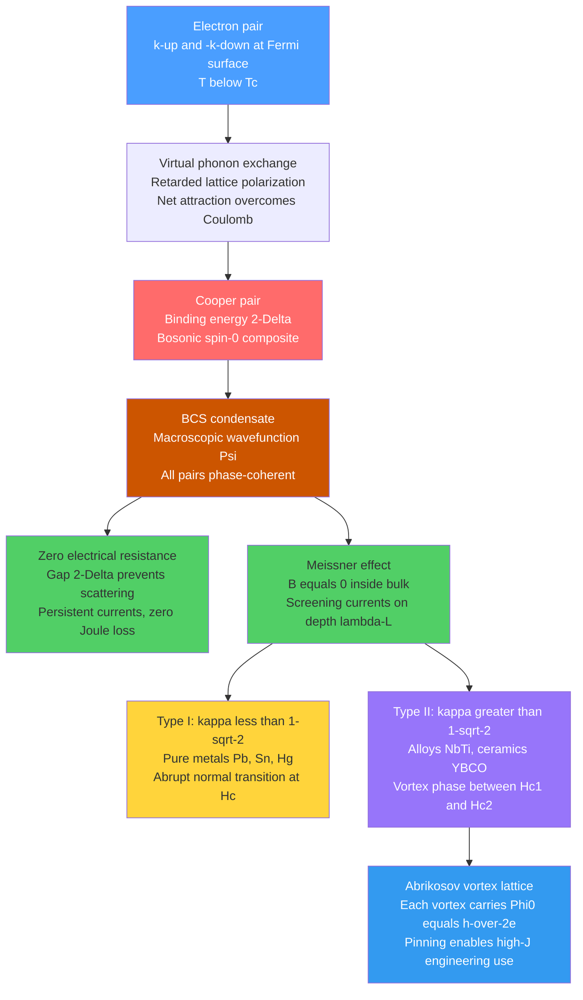

# Superconductivity and BCS Theory

> [!abstract] TL;DR
> Below a material-specific critical temperature $T_c$, certain metals and ceramics exhibit exactly zero electrical resistance and perfect diamagnetism (Meissner effect: $\mathbf{B} = 0$ inside). BCS theory (1957) explains this through phonon-mediated pairing of electrons into Cooper pairs that condense into a single macroscopic quantum state, opening an energy gap $2\Delta$ that protects the condensate from scattering. Type II superconductors tolerate high magnetic fields via a mixed vortex phase, enabling MRI magnets, particle accelerators, and quantum computers.

---

## Intuition

**Analogy:** Imagine a ballroom filled with dancers. Normally, each dancer navigates the crowded floor individually, bumping into pillars (lattice defects) and other dancers (phonons), losing energy with every collision — that is ordinary electrical resistance. Now suppose each dancer finds a partner; together they move in perfect synchrony, and because the whole floor of paired dancers locks into the same choreography, no single pillar can scatter them without disrupting every pair simultaneously — which costs more energy than the collision can provide. The entire ballroom glides without friction. That is superconductivity.

The second miracle — the Meissner effect — is as if the dancers collectively sense an approaching magnet and immediately rearrange to generate a counter-field that keeps it out. This is not just "resistance zero, field cannot change"; it is active expulsion, a thermodynamic state fundamentally different from a perfect conductor.

In real terms: the "dancers" are electrons near the Fermi surface; the "rhythm they share" is the phase of the macroscopic quantum wavefunction $\Psi = |\Psi|e^{i\theta}$; and the "choreography synchronizer" is the crystal lattice itself, which transmits a net attractive force between electrons through virtual phonon exchange.

---

## How It Works

### Core Mechanics

1. **Normal metal above $T_c$:** Electrons scatter off phonons, defects, and impurities, dissipating energy as heat. Resistance is finite.

2. **Phonon-mediated attraction (Cooper mechanism):** An electron moving through the lattice attracts positive ions slightly toward it, creating a transient region of increased positive charge density. A second electron, arriving slightly later, is attracted to this polarization cloud. The net interaction is a weak retarded attraction between electrons of opposite momenta and opposite spin: $(\mathbf{k}, \uparrow)$ and $(-\mathbf{k}, \downarrow)$.

3. **Cooper pair formation:** Even an arbitrarily weak attraction at the Fermi surface creates a bound state — the Cooper pair — because the Fermi sea forbids states below $E_F$, turning a 3D scattering problem into an effectively 1D one where any attraction produces binding. The pair has total spin $S=0$, total momentum $\mathbf{K}=0$, and binding energy $2\Delta$.

4. **BCS condensate:** All Cooper pairs in the material condense into the same macroscopic quantum state described by a single wavefunction $\Psi(\mathbf{r}) = |\Psi(\mathbf{r})|e^{i\theta(\mathbf{r})}$. The condensate is protected by the energy gap: any scattering event that would destroy a pair requires energy $\geq 2\Delta$, which thermal fluctuations at $T \ll T_c$ cannot supply.

5. **Zero DC resistance:** Because no scattering can occur below threshold, an applied current flows indefinitely without dissipation. Persistent currents in superconducting rings have been maintained for years without measurable decay.

6. **Meissner effect:** The condensate responds to an applied magnetic field by establishing surface screening currents (on a depth scale $\lambda_L$, the London penetration depth) that precisely cancel the interior field: $\mathbf{B} = 0$ inside. This perfect diamagnetism is thermodynamically distinct from a perfect conductor and is the defining signature of the superconducting phase.

### Flow / Architecture



---

## Key Concepts

### Secondary

**What zero resistance actually means.**
Resistance zero is not just "very low." It is mathematically exact. A superconducting ring set into oscillation carries a persistent current indefinitely — measurements in Nb rings have detected no decay over years. The electrical analogy is a frictionless track: once you push, it rolls forever.

**The Meissner effect is not zero resistance.**
A perfect conductor (hypothetical zero resistance) would trap whatever magnetic flux was present when it became "perfect" — it cannot change because $\nabla \times \mathbf{E} = -\partial\mathbf{B}/\partial t$ and $\mathbf{E} = 0$ implies $\partial\mathbf{B}/\partial t = 0$. A superconductor goes further: it actively expels flux regardless of the history of the field. Cooling a superconductor in a field expels the flux as it crosses $T_c$. This makes the superconducting state a distinct thermodynamic phase, not just a metallic extreme.

**Critical temperature table.**

| Material | Type | $T_c$ (K) | $\mu_0 H_{c2}$ (T) | Notes |
|----------|------|-----------|---------------------|-------|
| Mercury (Hg) | I | 4.15 | 0.041 | First discovered, Onnes 1911 |
| Lead (Pb) | I | 7.20 | 0.080 | Pure elemental Type I |
| Niobium (Nb) | II | 9.25 | 0.82 | Highest $T_c$ pure element |
| NbTi alloy | II | 9.0 | 14 | MRI and accelerator wire |
| Nb$_3$Sn | II | 18.3 | 29 | LHC inner dipoles |
| MgB$_2$ | II | 39 | 18 | Conventional phonon-BCS |
| YBCO (YBa$_2$Cu$_3$O$_7$) | II | 93 | > 100 | First liquid-N$_2$ SC |
| Bi-2212 (BiSrCaCuO) | II | 110 | > 100 | Cuprate, HTS wire |
| HgBaCaCuO | II | 138 | — | Highest $T_c$ at ambient $P$ |
| H$_3$S at 200 GPa | II | 203 | — | Highest $T_c$ recorded |

**Type I vs Type II intuition.**
Type I superconductors are simple pure metals. Apply a magnetic field and they either expel it completely (Meissner state) or give up entirely and go normal — no middle ground. Type II superconductors (alloys, compounds) tolerate a partial penetration of flux through quantized vortex tubes, allowing them to remain superconducting to very high fields. This is why engineering magnets use NbTi and Nb$_3$Sn, not lead.

---

### Undergraduate

**London equations (1935).**
Before BCS, Fritz and Heinz London wrote phenomenological equations for the superconducting current $\mathbf{J}_s$ (where $n_s$ is the superfluid carrier density, each of charge $e$, mass $m$):

$$\frac{\partial \mathbf{J}_s}{\partial t} = \frac{n_s e^2}{m}\,\mathbf{E} \qquad \text{(London I: acceleration equation)}$$

$$\nabla \times \mathbf{J}_s = -\frac{n_s e^2}{m}\,\mathbf{B} \qquad \text{(London II: Meissner equation)}$$

Taking the curl of Ampere's law $\nabla \times \mathbf{B} = \mu_0 \mathbf{J}_s$ and substituting London II yields:

$$\boxed{\nabla^2 \mathbf{B} = \frac{\mathbf{B}}{\lambda_L^2}}$$

This is a screened (Yukawa-type) equation. Its solution for a semi-infinite superconductor with surface at $x=0$ is $B(x) = B(0)\,e^{-x/\lambda_L}$: the field decays exponentially with the **London penetration depth**:

$$\lambda_L = \sqrt{\frac{m}{\mu_0 n_s e^2}}$$

Typical values: $\lambda_L \approx 50\text{–}500$ nm. Macroscopic samples are field-free in the bulk; only a thin surface shell carries the screening current.

**Coherence length $\xi$ and the GL parameter $\kappa$.**
The Cooper pair has a spatial extent called the coherence length $\xi$ — roughly the distance over which the superconducting order parameter $|\Psi|$ can vary. From BCS at $T=0$:

$$\xi_0 = \frac{\hbar v_F}{\pi\,\Delta(0)}$$

The Ginzburg-Landau (GL) coherence length near $T_c$ is:

$$\xi_{GL}(T) = \frac{\xi_0}{\sqrt{1 - T/T_c}}$$

Both characteristic lengths diverge (or go to zero) at $T_c$ in different ways, but their ratio — the **GL parameter** — is nearly temperature-independent:

$$\kappa = \frac{\lambda_L}{\xi_{GL}}$$

This single dimensionless number determines the type of superconductor:

$$\kappa < \frac{1}{\sqrt{2}} \Rightarrow \text{Type I} \qquad \kappa > \frac{1}{\sqrt{2}} \Rightarrow \text{Type II}$$

Physically, $\kappa$ governs the sign of the domain wall energy between normal and superconducting regions. Type I materials have positive domain wall energy, so mixed states are costly; Type II have negative domain wall energy, making vortex formation thermodynamically favourable.

**BCS energy gap and universal ratio.**
The zero-temperature gap $\Delta(0)$ is related to $T_c$ by the universal BCS weak-coupling result:

$$\boxed{2\Delta(0) = 3.52\,k_B T_c}$$

This is the hallmark prediction of BCS theory, confirmed experimentally in conventional superconductors (Al, Pb, Nb) to within a few percent. The gap closes continuously as $T \to T_c$, following the BCS gap function $\Delta(T)/\Delta(0)$ (see Python Demo below).

**Flux quantization: the $2e$ fingerprint.**
Magnetic flux through any superconducting loop is quantized:

$$\Phi = n\,\Phi_0, \qquad \Phi_0 = \frac{h}{2e} \approx 2.07 \times 10^{-15}\ \text{Wb}$$

The denominator $2e$ — twice the electron charge — is direct experimental proof that the charge carriers are **pairs**. Measuring flux quantization in the early 1960s confirmed the BCS prediction before the theory was two years old.

**Critical field temperature dependence.**
Both Type I and Type II critical fields follow an approximately parabolic law (exact in GL theory near $T_c$):

$$H_c(T) \approx H_c(0)\left[1 - \left(\frac{T}{T_c}\right)^2\right]$$

For Type II, both $H_{c1}$ and $H_{c2}$ follow this form with their respective $T=0$ values:

$$\mu_0 H_{c2}(0) = \frac{\Phi_0}{2\pi\xi^2}, \qquad \mu_0 H_{c1}(0) \approx \frac{\Phi_0}{4\pi\lambda^2}\ln\kappa$$

For NbTi ($\kappa \approx 70$): $\mu_0 H_{c2}(0) \approx 14$ T — enabling MRI magnet fields of 1.5–7 T with margin.

---

### Graduate

**BCS self-consistency equation.**
The gap $\Delta$ at finite temperature is determined by a self-consistent integral:

$$\frac{1}{N(0)V} = \int_0^{\hbar\omega_D} \frac{\tanh\!\left(\dfrac{\sqrt{\xi^2+\Delta^2}}{2k_BT}\right)}{\sqrt{\xi^2+\Delta^2}}\,d\xi$$

where $N(0)$ is the electronic density of states at the Fermi level, $V$ is the pairing strength, $\xi$ is the quasiparticle energy measured from $E_F$, and $\hbar\omega_D$ is the Debye cutoff (phonons only couple electrons within $\hbar\omega_D$ of $E_F$). At $T=0$, this gives:

$$\Delta(0) = \frac{\hbar\omega_D}{\sinh(1/N(0)V)} \approx 2\hbar\omega_D\,e^{-1/N(0)V} \quad \text{(weak coupling)}$$

Setting $\Delta = 0$ (condition at $T_c$) recovers the critical temperature:

$$k_BT_c = 1.13\,\hbar\omega_D\,\exp\!\left(-\frac{1}{N(0)V}\right)$$

The ratio of these two results gives the universal BCS number: $2\Delta(0)/k_BT_c = 3.52$.

**Ginzburg-Landau theory.**
Near $T_c$, the free energy density is written as a functional of the complex order parameter $\Psi(\mathbf{r}) = |\Psi|e^{i\theta}$, whose modulus squared is the local superfluid density $n_s(\mathbf{r})$:

$$\mathcal{F} = \mathcal{F}_n + \alpha|\Psi|^2 + \frac{\beta}{2}|\Psi|^4 + \frac{1}{2m^*}\left|(-i\hbar\nabla - 2e\mathbf{A})\Psi\right|^2 + \frac{B^2}{2\mu_0}$$

where $\alpha \propto (T - T_c)$ changes sign at $T_c$ and $\beta > 0$. Minimizing with respect to $\Psi^*$ and $\mathbf{A}$ gives the two GL equations. The equilibrium order parameter below $T_c$ is $|\Psi_\infty|^2 = -\alpha/\beta \propto (T_c - T)$.

**Abrikosov vortex lattice (Type II).**
In the mixed state $H_{c1} < H < H_{c2}$, magnetic flux enters as a lattice of quantized vortex filaments, each carrying exactly $\Phi_0 = h/2e$. Each vortex has:
- A **normal core** of radius $\sim \xi$ (order parameter suppressed to zero).
- Circulating supercurrents that decay over $\sim \lambda$ away from the core.
- An interaction with other vortices: repulsive at long range, arranging into a triangular (Abrikosov) lattice to minimize energy.

**Vortex pinning and critical current density $J_c$.**
Free vortices, driven by the Lorentz force $\mathbf{f} = \mathbf{J} \times \mathbf{B}$, move and dissipate energy — destroying zero resistance. Real Type II magnets work because grain boundaries, precipitates, and radiation-induced defects **pin** vortices. The critical current density $J_c$ (the maximum dissipation-free current) is set by the pinning strength, not by thermodynamics. NbTi wires achieve $J_c \sim 3 \times 10^9$ A/m² at 5 T — essential for practical magnets.

**High-temperature superconductors (HTS): cuprates.**
In 1986, Bednorz and Müller discovered $T_c \approx 35$ K in La$_2$CuO$_4$. Within two years, YBCO reached $T_c = 93$ K — above liquid nitrogen (77 K). Key structural feature: $\text{CuO}_2$ planes separated by charge-reservoir layers. Key departures from BCS:

- Gap symmetry is $d_{x^2-y^2}$ (four nodes on the Fermi surface), not isotropic $s$-wave.
- Pairing mechanism is not phonon-mediated; leading candidates are spin fluctuations and resonating valence bonds.
- A **pseudogap** phase exists above $T_c$ in the underdoped regime: pairs form but do not condense.
- Strange-metal phase: resistivity $\rho \propto T$ (linear, not $T^2$ Fermi liquid).
- Phase diagram controlled by hole doping $p$: underdoped (insulating parent), optimally doped ($T_c$ max), overdoped (conventional metal-like).

After 38 years, the microscopic mechanism of cuprate superconductivity remains an open problem in condensed matter physics.

**Josephson effect.**
Two superconductors separated by a thin insulating barrier (Josephson junction) allow Cooper pairs to tunnel coherently:
- **DC Josephson:** $I = I_c \sin\phi$ ($\phi$ = phase difference across junction) — supercurrent with zero voltage.
- **AC Josephson:** With voltage $V$: $d\phi/dt = 2eV/\hbar$, giving AC current at $f = 2eV/h = 484$ MHz/µV.
- **Voltage standard:** The AC Josephson relation is exact in terms of fundamental constants; adopted internationally in 1990.
- **Superconducting qubit:** A Josephson junction is an anharmonic LC oscillator. Its non-linearity (unlike a capacitor or inductor) makes the two lowest energy levels addressable as a qubit at frequency $\sim 5$–$8$ GHz.

---

## Python Demo

```python
import numpy as np
import matplotlib.pyplot as plt
from scipy import optimize

# ──────────────────────────────────────────────────────────────
# BCS gap function: empirical approximation + numerical solution
# ──────────────────────────────────────────────────────────────

def bcs_gap_approx(t_arr):
    """
    Empirical BCS approximation valid for 0 < T < Tc:
        Delta(T)/Delta(0) ~ tanh(1.74 * sqrt(Tc/T - 1))
    Error vs exact numerical solution is < 1% everywhere.
    """
    t = np.asarray(t_arr, dtype=float)
    out = np.zeros_like(t)
    mask = (t > 0.0) & (t < 1.0)
    out[mask] = np.tanh(1.74 * np.sqrt(1.0 / t[mask] - 1.0))
    return out


def bcs_gap_numerical(t_ratios, NV=0.28, n_xi=1500):
    """
    Numerically solve the BCS self-consistency equation:
        1/N(0)V = integral_0^omega_D  tanh(E/2kT) / E  d_xi
    where E = sqrt(xi^2 + Delta^2).
    Works in natural units where hbar*omega_D / k_B = 1.
    """
    omega_D = 1.0
    xi = np.linspace(1e-5, omega_D, n_xi)

    # T=0 analytic: Delta(0) = omega_D / sinh(1/NV)
    Delta0 = omega_D / np.sinh(1.0 / NV)

    # Find Tc numerically: at Delta=0 the gap eq becomes integral of tanh(xi/2T)/xi
    def tc_eq(Tc_val):
        return np.trapz(np.tanh(xi / (2.0 * Tc_val)) / xi, xi) - 1.0 / NV

    Tc = optimize.brentq(tc_eq, 0.005, 1.0)

    print(f"BCS parameters  (N(0)V = {NV}):")
    print(f"  T_c          = {Tc:.5f}  [hbar*omega_D / k_B units]")
    print(f"  Delta(0)     = {Delta0:.5f}")
    print(f"  2*Delta(0)/k_B*T_c = {2.0*Delta0/Tc:.4f}   (BCS universal: 3.52)")

    deltas = []
    for t_ratio in t_ratios:
        T = t_ratio * Tc
        if t_ratio >= 0.999:
            deltas.append(0.0)
            continue

        def gap_eq(delta):
            E = np.sqrt(xi**2 + delta**2)
            return np.trapz(np.tanh(E / (2.0 * T)) / E, xi) - 1.0 / NV

        try:
            d_sol = optimize.brentq(gap_eq, 1e-10, Delta0 * 1.002, xtol=1e-12)
            deltas.append(d_sol / Delta0)
        except ValueError:
            deltas.append(0.0)

    return np.array(deltas)


# ──────────────────────────────────────────────────────────────
# Compute data
# ──────────────────────────────────────────────────────────────

t_fine = np.linspace(0.001, 0.999, 300)
t_num  = np.linspace(0.05,  0.95,   30)

gap_approx = bcs_gap_approx(t_fine)
gap_num    = bcs_gap_numerical(t_num)

# Critical field vs temperature:  H(T)/H(0) = 1 - (T/Tc)^2  (GL parabolic law)
t_H   = np.linspace(0.0, 1.0, 300)
hc_norm = 1.0 - t_H**2

# Type II fractions relative to thermodynamic Hc, for kappa = 10 (NbTi-like)
kappa      = 10.0
hc1_frac   = np.log(kappa) / (kappa * np.sqrt(2.0))   # Hc1/Hc(0) ~ 0.163
hc2_frac   = kappa * np.sqrt(2.0)                       # Hc2/Hc(0) ~ 14.1
hc1_curve  = hc1_frac * hc_norm
hc2_curve  = hc2_frac * hc_norm

# ──────────────────────────────────────────────────────────────
# Plot
# ──────────────────────────────────────────────────────────────

fig, (ax1, ax2) = plt.subplots(1, 2, figsize=(13, 6))

# Left panel: BCS gap function
ax1.plot(t_fine, gap_approx, '-', color='#d62728', linewidth=2.5,
         label=r'Empirical: $\tanh(1.74\sqrt{T_c/T - 1})$')
ax1.plot(t_num,  gap_num,    'o', color='#1f77b4', markersize=6, zorder=5,
         label='Numerical BCS  (N(0)V = 0.28)')
ax1.axvline(1.0, color='gray', linestyle='--', linewidth=1.2, alpha=0.7)
ax1.axhline(0.0, color='gray', linewidth=0.8)
ax1.annotate(r'$T = T_c,\;\Delta \to 0$', xy=(1.0, 0.04), xytext=(0.68, 0.20),
             fontsize=10, arrowprops=dict(arrowstyle='->', color='gray'))
ax1.text(0.05, 0.10, r'$2\Delta(0) = 3.52\,k_B T_c$', fontsize=12,
         transform=ax1.transAxes,
         bbox=dict(boxstyle='round', facecolor='wheat', alpha=0.6))
ax1.set_xlabel(r'$T\,/\,T_c$', fontsize=14)
ax1.set_ylabel(r'$\Delta(T)\,/\,\Delta(0)$', fontsize=14)
ax1.set_title('BCS Energy Gap Function', fontsize=13, fontweight='bold')
ax1.set_xlim(0, 1.12)
ax1.set_ylim(-0.05, 1.15)
ax1.legend(fontsize=10, loc='upper right')
ax1.grid(True, alpha=0.3)

# Right panel: critical field phase diagram
ax2.plot(t_H, hc_norm,  '-',  color='#2ca02c', linewidth=2.5,
         label=r'Type I: $H_c(T)/H_c(0) = 1-(T/T_c)^2$')
ax2.plot(t_H, hc1_curve, '--', color='#ff7f0e', linewidth=2.0,
         label=r'Type II: $H_{c1}(T)/H_c(0)$  ($\kappa=10$)')
ax2.plot(t_H, hc2_curve, '-.', color='#9467bd', linewidth=2.0,
         label=r'Type II: $H_{c2}(T)/H_c(0)$  ($\kappa=10$)')

ax2.fill_between(t_H, 0, np.minimum(hc1_curve, hc_norm),
                 alpha=0.15, color='#2ca02c')
ax2.fill_between(t_H, hc1_curve, hc2_curve,
                 alpha=0.10, color='#9467bd')

ax2.text(0.25, 0.06, 'Meissner state\n' + r'$\mathbf{B}=0$',
         fontsize=10, ha='center', color='#1a6e1a')
ax2.text(0.45, 7.0,  'Vortex\nstate', fontsize=10, ha='center', color='#7b4ca0')
ax2.text(0.60, 12.5, 'Normal', fontsize=10, ha='center', color='#666666')
ax2.axvline(1.0, color='gray', linestyle='--', linewidth=1.2, alpha=0.7)

ax2.set_xlabel(r'$T\,/\,T_c$', fontsize=14)
ax2.set_ylabel(r'$H\,/\,H_c(0)$  (normalized to Type I thermodynamic field)', fontsize=12)
ax2.set_title('Critical Field Phase Diagram\n(GL parabolic law, Type I and II)', fontsize=12,
              fontweight='bold')
ax2.set_xlim(0, 1.05)
ax2.set_ylim(-0.2, 15.0)
ax2.legend(fontsize=9, loc='upper right')
ax2.grid(True, alpha=0.3)

plt.suptitle('Superconductivity — BCS Gap and Critical Fields', fontsize=14, fontweight='bold')
plt.tight_layout()
plt.savefig('superconductivity_bcs.png', dpi=150)
plt.show()
```

**What to observe.**
- **Left panel:** The BCS gap is essentially flat near $T=0$ (the condensate is robust at low temperature) and then collapses steeply as $T \to T_c$. The analytical approximation matches the numerical solution to within line width.
- **Right panel:** For a Type II material with $\kappa = 10$, $H_{c2}$ is $\approx 14\times$ the thermodynamic $H_c$, explaining why NbTi ($\kappa \approx 70$, $H_{c2} \approx 14$ T) can sustain the fields needed for MRI magnets while Type I materials like Pb ($\mu_0 H_c = 0.08$ T) cannot.
- **Printed output** will confirm $2\Delta(0)/k_BT_c \approx 3.52$, the universal BCS ratio.

---

## Real-World Applications

> **MRI magnets (NbTi and Nb$_3$Sn wire):** A clinical 3 T MRI scanner contains roughly 150 kg of multifilamentary NbTi wire wound into a solenoid and cooled to 4.2 K with liquid helium. The superconducting coil is charged once to $\sim$500 A; the persistent current maintains the field indefinitely with zero power consumption in the winding (only the refrigerator runs). NbTi's $H_{c2} \approx 14$ T at 4.2 K provides ample headroom; Nb$_3$Sn ($H_{c2} \approx 29$ T) is used in 7–11 T research scanners and the LHC's inner triplet magnets.

> **Particle accelerators (CERN LHC):** The LHC uses 1,232 superconducting dipole magnets, each 14 m long, generating 8.33 T at 1.9 K to bend 7 TeV protons around a 27 km ring. The wire is NbTi operating in superfluid helium (1.9 K rather than 4.2 K) to access higher critical current density. Keeping the magnets cold costs roughly 30 MW; the alternative — room-temperature copper magnets for the same field — would require approximately 10 GW and would be physically impossible.

> **MAGLEV trains (JR Maglev, Japan):** The SCMaglev L0 series uses onboard NbTi superconducting magnets (cooled with liquid helium) in null-flux levitation coils to float and propel the train at 603 km/h (world speed record, 2015). The Meissner effect and persistent currents eliminate contact between train and guideway, removing friction as the speed-limiting factor.

> **Josephson junction quantum computers (IBM, Google):** Every superconducting qubit (transmon, fluxonium, etc.) is based on a Josephson junction — an Al/AlO$_x$/Al tunnel junction $\sim 200 \times 200$ nm in area. The junction provides the non-linearity that makes the two lowest energy levels selectively addressable as a qubit at $\sim 5$ GHz. Operating temperature is $\sim 15$ mK from a dilution refrigerator. IBM's 1,121-qubit Condor processor contains more than 3,000 individual Josephson junctions.

> **SQUID magnetometers (biomagnetism, dark matter):** A DC-SQUID (two Josephson junctions in a loop) can resolve flux changes of $\sim 10^{-6}\Phi_0/\sqrt{\text{Hz}}$, corresponding to $\delta B \sim 10^{-15}$ T. Applications include brain magnetoencephalography (MEG), heart magnetocardiography (MCG), and searches for axion dark matter (ADMX experiment at University of Washington).

---

## Common Pitfalls

- **Meissner effect confused with zero resistance.** A perfect conductor traps flux; a superconductor expels it. The Meissner effect is an active thermodynamic process, not a consequence of $\rho = 0$. This distinction is frequently missed in introductory treatments and always tested in graduate qualifying exams.

- **BCS gap $2\Delta$ confused with a band gap.** The BCS gap lives in the quasiparticle (Bogoliubov) excitation spectrum centered at $E_F$, not in a band structure gap between valence and conduction bands. A superconductor has a full Fermi sea; the gap appears only in the spectrum of excitations above the condensate.

- **Type II does not mean "dirty Type I."** The Type I/II classification is governed by the intrinsic material parameter $\kappa = \lambda/\xi$, which depends on composition and crystal structure — not on sample purity. Nb is Type II even as a perfect crystal; Pb is Type I even as a polycrystal. Impurities can shift $\kappa$ by changing $\lambda$ (via $n_s$) and $\xi$ (via mean free path), but they cannot convert a fundamentally Type I material to Type II unless $\kappa$ crosses $1/\sqrt{2}$.

- **Conflating $T_c$ with useful operating temperature.** YBCO has $T_c = 93$ K but practical wire operates at 65–77 K because $J_c$ and $H_{c2}$ drop sharply with temperature. The "liquid-nitrogen temperature superconductor" headline obscures that you still need cooling infrastructure and that $J_c$ at 77 K is 10–100$\times$ lower than at 4.2 K.

- **Assuming BCS ratio $3.52$ holds for all superconductors.** The ratio $2\Delta/k_BT_c = 3.52$ is valid only in weak-coupling BCS. Strong-coupling metals deviate: Pb gives 4.50, Hg gives 4.60. Cuprates have multiple gaps and $d$-wave symmetry — there is no single universal ratio.

- **Cooper pairs are not stable molecules.** The pair coherence length $\xi_0 \sim 1$–$1000$ nm means many pairs overlap heavily in the same region of space. In cuprates $\xi_0 \sim 1$–$3$ nm; in conventional BCS metals $\xi_0 \sim 100$–$1000$ nm. Pairs are collective, overlapping quantum states — not discrete diatomic molecules. Thinking of them as molecules leads to wrong intuitions about pair breaking.

---

## Related Concepts

- [[Electronic_Band_Structure]] — The Fermi surface, density of states $N(0)$ at $E_F$, and electron effective mass: all direct inputs to the London penetration depth and BCS $T_c$ formula; higher $N(0)$ favours higher $T_c$
- [[Phonons_and_Lattice_Dynamics]] — Phonon-mediated electron-electron attraction is the BCS pairing mechanism; the Debye frequency $\omega_D$ sets the energy window for pairing and the exponential prefactor in $T_c$
- [[Superconductivity]] — Companion Physics vault note with deeper treatment of the BCS wavefunction in second quantization, Josephson effect formalism, and topological superconductors
- [[Quantum_Statistical_Mechanics]] — Cooper pairs are bosons that undergo Bose-Einstein condensation; the Fermi-Dirac distribution of unpaired electrons and the condition $\Delta(T_c) = 0$ both use statistical mechanics directly
- [[Many_Body_Quantum_Systems]] — The BCS ground state is a variational many-body wavefunction; Bogoliubov-de Gennes (BdG) equations diagonalize the BCS Hamiltonian into quasiparticle excitations
- [[Phase_Transitions_and_Critical_Phenomena]] — The normal-to-superconductor transition is second-order (continuous) in zero field; Ginzburg-Landau theory is Landau's theory of second-order transitions with a complex order parameter; fluctuations are significant in cuprates
- [[Crystal_Structure_and_Band_Theory]] — Crystal symmetry determines phonon dispersion and Fermi surface topology; $d$-wave gap symmetry in cuprates is dictated by the $D_{4h}$ tetragonal symmetry of the CuO$_2$ planes
- [[Semiconductors_Intrinsic_and_Extrinsic]] — Instructive contrast: semiconductors have a single-particle energy gap from band structure; superconductors develop a many-body gap from pairing. Both gaps close with temperature, but by entirely different mechanisms
- [[Maxwells_Equations]] — London equations are a modification of Ampere's law that enforce the Meissner condition; the Josephson AC effect gives a voltage-frequency relation traceable to Faraday's law
- [[_MOC_Physics_Master]] — Physics vault entry for condensed matter, BCS, and quantum field theory extensions of superconductivity
- [[_MOC_Electronic_Magnetic_and_Optical_Properties|↑ Electronic, Magnetic, and Optical Properties MOC]] — Section map for all electronic, magnetic, and optical properties in this Materials Science vault

---

## Review Questions

1. **(Secondary — Conceptual)** A ring of lead (Type I, $T_c = 7.2$ K) is cooled to 4 K while sitting inside a 0.05 T magnetic field. The field is then switched off. A separate ring of lead is cooled to 4 K with no field, and a 0.05 T field is then applied. Describe what happens to the magnetic flux inside each ring and explain why the two outcomes differ. What fundamental property of the superconducting state does this illustrate, and why would a hypothetical "perfect conductor" behave differently?

2. **(Undergraduate — Scenario)** You are designing a superconducting dipole magnet for a synchrotron that requires a 9 T central field at 4.2 K. You have access to NbTi wire ($T_c = 9.0$ K, $\mu_0 H_{c2}(4.2\text{ K}) \approx 11$ T, $J_c(4.2\text{ K}, 5\text{ T}) \approx 3 \times 10^9$ A/m²) and Nb$_3$Sn wire ($T_c = 18.3$ K, $\mu_0 H_{c2}(4.2\text{ K}) \approx 27$ T). Which material can achieve 9 T with more operating margin, and why? What are the manufacturing trade-offs between NbTi and Nb$_3$Sn that would enter a practical engineering decision?

3. **(Graduate — Trade-off)** BCS theory predicts $T_c = 1.13\,\hbar\omega_D\exp(-1/N(0)V)$. This formula suggests three independent routes to higher $T_c$: increase $\omega_D$, increase $N(0)$, or increase $V$. For each route: (a) identify a real material strategy that attempts it, (b) explain what physical limit prevents the strategy from reaching room-temperature superconductivity, and (c) discuss why the discovery of cuprate high-$T_c$ superconductors in 1986 suggested that phonon-BCS might not be the right framework at all.

---

## Sources

- [Kittel, *Introduction to Solid State Physics*, 8th ed. (2005)](https://www.wiley.com/en-us/Introduction+to+Solid+State+Physics%2C+8th+Edition-p-9780471415268) — Chapters 10–12: superconductivity phenomenology, London equations, BCS gap; the standard first treatment
- [Tinkham, *Introduction to Superconductivity*, 2nd ed. (2004)](https://store.doverpublications.com/0486435032.html) — The definitive graduate-level text; Type I/II, GL theory, vortex physics, Josephson effects, and HTS
- [Bardeen, Cooper & Schrieffer, "Theory of Superconductivity," *Phys. Rev.* 108, 1175 (1957)](https://doi.org/10.1103/PhysRev.108.1175) — Original BCS paper; Nobel Prize 1972
- [Callister & Rethwisch, *Materials Science and Engineering: An Introduction*, 10th ed.](https://www.wiley.com/en-us/Materials+Science+and+Engineering%3A+An+Introduction%2C+10th+Edition-p-9781119405498) — Chapter 19: applied context for superconducting materials, processing, and engineering use
- [Bednorz & Müller, "Possible high-$T_c$ superconductivity in the Ba-La-Cu-O system," *Z. Phys. B* 64, 189 (1986)](https://doi.org/10.1007/BF01303701) — Discovery of cuprate HTS; Nobel Prize 1987

---

#MaterialsScience #Superconductivity #BCSTheory #CooperPairs #MeissnerEffect #LondonEquations #TypeII #AbrikosovVortex #GinzburgLandau #HighTcSuperconductor #JosephsonEffect #CondensedMatter
