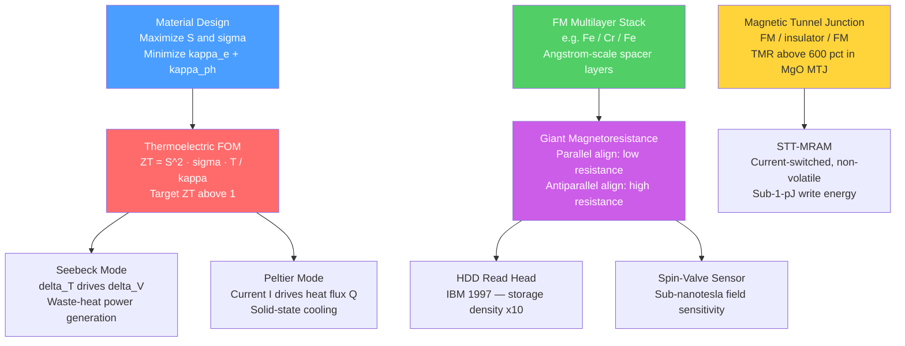

# Thermoelectric and Spintronic Devices

> [!abstract] TL;DR
> Thermoelectric devices convert a temperature gradient directly into voltage (or vice versa) using only solid-state materials — no moving parts, no fluids. Spintronic devices exploit the electron's spin degree of freedom rather than just its charge, enabling memory and sensing that approach fundamental physical limits. Both fields exploit quantum mechanical properties of electrons to do things that classical circuit theory cannot.

---

## Intuition

**Analogy (thermoelectrics):** Imagine a city with two neighbourhoods connected by a bridge. In the hot neighbourhood, people are restless and move quickly; in the cold one, they move slowly. If you wire the two sides together, the restless hot-side people push across the bridge, creating a net current — a voltage you can harvest. Disconnect the wire and the pressure difference (voltage) sits there waiting. This is the Seebeck effect: a temperature difference is directly a voltage source. Run it in reverse — pump current across the bridge — and you forcibly push people from the cold side to the hot side, actively cooling the cold neighbourhood. That is the Peltier effect.

**Analogy (spintronics):** Ordinary electronics uses electrons as balls — counting or moving them. Spintronics notices that each electron also has a tiny compass needle (spin) pointing either up or down. Two magnetic layers acting as spin filters in series pass current easily when both filters point the same way (parallel) and block it when they point opposite (antiparallel). Flip one layer with a weak magnetic field and the resistance jumps dramatically — a magnetic field detector with extraordinary sensitivity. That is giant magnetoresistance.

---

## How It Works

### Core Mechanics — Thermoelectricity

**1. The three thermoelectric effects**

All three effects are manifestations of the coupling between heat flow and charge flow in a conductor.

*Seebeck effect* — a temperature gradient across a material drives a net flow of charge carriers (electrons or holes) from hot to cold, building up an electrostatic voltage that opposes further flow. At open circuit:
$$S = -\frac{\Delta V}{\Delta T} \qquad \text{(V K}^{-1}\text{, or typically } \mu\text{V K}^{-1}\text{)}$$
$S$ is the Seebeck coefficient (thermopower). Its sign equals the sign of the dominant carrier: negative for electrons (n-type), positive for holes (p-type). Metals have $|S| \sim 1$–$10\,\mu\text{V K}^{-1}$; optimised thermoelectric semiconductors reach $|S| \sim 200$–$300\,\mu\text{V K}^{-1}$.

*Peltier effect* — when current $I$ flows across a junction between two different conductors, heat is either absorbed or released at the junction. This is the reverse of Seebeck:
$$\dot{Q}_\text{Peltier} = \Pi\, I \qquad \text{(W)}$$
$\Pi$ is the Peltier coefficient (W A⁻¹). By the Kelvin relation, $\Pi = ST$. A large Seebeck coefficient means an equally large Peltier coefficient at the same temperature.

*Thomson effect* — when current flows along a conductor with a temperature gradient, additional heat is reversibly absorbed or released within the bulk (not just at junctions). This is the gradient analogue of the Peltier effect and is described by the Thomson coefficient $\tau_T = T\,dS/dT$. The Thomson effect is small for most practical thermoelectric materials and is often neglected in module design.

**2. Thermoelectric figure of merit ZT**

The single number that determines how efficiently a material converts heat to electricity (or vice versa) is the dimensionless figure of merit:
$$ZT = \frac{S^2\,\sigma\,T}{\kappa} = \frac{S^2\,\sigma\,T}{\kappa_e + \kappa_\text{ph}}$$

- $S$ — Seebeck coefficient (V K⁻¹): large $|S|$ means each degree of temperature difference drives more voltage.
- $\sigma$ — electrical conductivity (S m⁻¹): high conductivity reduces Joule losses.
- $T$ — absolute temperature (K).
- $\kappa$ — total thermal conductivity (W m⁻¹ K⁻¹), split into electronic ($\kappa_e$) and phonon ($\kappa_\text{ph}$) contributions.

The numerator $S^2\sigma$ is the **power factor (PF)**:
$$\text{PF} = S^2\,\sigma \qquad \text{(W m}^{-1}\text{ K}^{-2}\text{)}$$

Maximising ZT requires maximising PF and minimising $\kappa$. This is brutally hard because $S$, $\sigma$, and $\kappa_e$ are all interlinked through carrier concentration $n$:

| As $n$ increases | $\sigma$ | $S$ | $\kappa_e$ | ZT |
|---|---|---|---|---|
| Metal regime ($n > 10^{21}$ cm⁻³) | High | Low | High | Low |
| Optimum semiconductor ($n \sim 10^{19}$–$10^{20}$ cm⁻³) | Moderate | Moderate | Moderate | Peak |
| Insulator ($n < 10^{17}$ cm⁻³) | Low | High | Low | Low |

The peak ZT almost always occurs near heavy-doping semiconductor densities.

**3. Wiedemann-Franz coupling**

Because the same electrons that carry charge also carry heat, $\kappa_e$ and $\sigma$ are tied together by the **Wiedemann-Franz law**:
$$\frac{\kappa_e}{\sigma} = L\,T, \qquad L = \frac{\pi^2 k_B^2}{3e^2} = 2.44\times10^{-8}\ \text{W}\,\Omega\,\text{K}^{-2}$$
$L$ is the Lorenz number. This means increasing $\sigma$ always increases $\kappa_e$ by the same factor. The only way to improve ZT without sacrificing $\sigma$ is to reduce $\kappa_\text{ph}$ independently — the phonon contribution to thermal conductivity, which does not carry charge.

---

### Core Mechanics — Spintronics

**4. Electron spin and spin-polarised transport**

Every electron carries spin angular momentum $\pm\hbar/2$, designated spin-up ($\uparrow$) and spin-down ($\downarrow$). In a ferromagnetic metal (Fe, Co, Ni), the density of states at the Fermi level is different for the two spin channels because exchange splitting shifts the majority and minority spin bands relative to each other. Current passing through a ferromagnet is therefore partially spin-polarised: one spin direction has more available states and scatters less.

Spin polarisation:
$$P = \frac{D_\uparrow(E_F) - D_\downarrow(E_F)}{D_\uparrow(E_F) + D_\downarrow(E_F)}$$
where $D_{\uparrow,\downarrow}(E_F)$ are the spin-resolved densities of states at the Fermi level.

**5. Giant Magnetoresistance (GMR)**

In a multilayer structure of alternating ferromagnetic (FM) and non-magnetic spacer layers — the classic example is Fe/Cr/Fe — the spacer thickness is tuned so that without an applied field the two FM layers couple antiferromagnetically (antiparallel magnetisations). The two configurations give dramatically different resistances:

- **Parallel (P):** Both FM layers have the same magnetisation. Majority-spin electrons pass through both with low scattering; minority-spin electrons scatter heavily in both. One channel dominates — low total resistance.
- **Antiparallel (AP):** Majority-spin electrons of layer 1 become minority-spin electrons in layer 2 — both spin channels scatter heavily. Both channels are blocked — high total resistance.

The GMR ratio is defined as:
$$\text{GMR} = \frac{R_\text{AP} - R_\text{P}}{R_\text{P}}$$
In the original Fe/Cr multilayers (Fert, Grünberg 1988), this reached 80% at low temperature. Modern spin-valve structures (single pinned + free FM layer) achieve 5–15% at room temperature — sufficient for hard-drive read heads. The Nobel Prize in Physics 2007 was awarded to Albert Fert and Peter Grünberg for this discovery.

**6. Tunneling Magnetoresistance (TMR)**

Replace the metallic spacer with a thin insulating tunnel barrier (e.g. Al₂O₃ or MgO). Electrons now tunnel quantum-mechanically between the two FM electrodes. The tunnel probability depends on the overlap of the two spin-resolved DOS at the Fermi level (Jullière model):
$$\text{TMR} = \frac{2P_1 P_2}{1 - P_1 P_2}$$
MgO-based magnetic tunnel junctions (MTJs) achieve TMR ratios > 600% at room temperature, far exceeding metallic GMR. MTJs are the reading and writing elements in modern MRAM.

**7. Spin-Transfer Torque (STT)**

When a spin-polarised current passes from a pinned FM layer into a free FM layer, the transverse component of spin angular momentum is transferred to the free layer's magnetisation — exerting a torque. Above a critical current density $J_c$, this torque is large enough to switch the free layer without any external magnetic field:
$$J_c \propto \frac{\alpha M_s t}{\eta}\left(H_k + H_\text{demag}/2\right)$$
where $\alpha$ is Gilbert damping, $M_s$ is saturation magnetisation, $t$ is free-layer thickness, and $\eta$ is spin-transfer efficiency. STT-MRAM achieves write energies below 1 pJ per bit and scales well below 28 nm, unlike field-switched MRAM.

---

### Flow / Architecture



---

## Key Concepts

### Secondary

**What does a thermoelectric module actually look like?**

A practical thermoelectric generator (TEG) or Peltier module consists of many n-type and p-type semiconductor pillars connected electrically in series but thermally in parallel. Hot-side and cold-side ceramic plates press against the array. The n-type legs (electrons as majority carrier, negative $S$) and p-type legs (holes as majority carrier, positive $S$) are arranged so their Seebeck voltages add rather than cancel. A standard commercial Peltier tile (TEC1-12706, 40 mm × 40 mm) contains 127 couples and can pump ~60 W of heat while consuming ~70 W — a coefficient of performance (COP) below 1.

**No moving parts — the thermoelectric advantage:**
Conventional heat engines and refrigerators use working fluids, pistons, compressors, and turbines. Thermoelectric devices have zero moving parts, operate silently, scale from microwatts to kilowatts, and last decades without maintenance. The trade-off is efficiency: a Carnot engine between 300 K and 400 K achieves 25% efficiency in principle; the best thermoelectric device with ZT = 1 achieves only ~6–8% in practice. For waste heat recovery and niche cooling applications, the simplicity outweighs the efficiency penalty.

**Why spin? The GMR story in brief:**
Before GMR (pre-1988), hard-drive read heads were inductive coils — bulky and limited in sensitivity. The discovery that stacking two nanometre-thin magnetic layers separated by a non-magnetic spacer produced a resistance that jumped 80% on reversing a magnetic field changed data storage permanently. IBM commercialised GMR read heads in 1997. Virtually every hard drive made since uses a descendant of this effect.

---

### Undergraduate

**Thermoelectric efficiency — generators and coolers:**

For a thermoelectric generator operating between $T_h$ (hot) and $T_c$ (cold) with average figure of merit $\overline{ZT}$:
$$\eta_\text{TEG} = \frac{T_h - T_c}{T_h}\cdot\frac{\sqrt{1 + \overline{ZT}} - 1}{\sqrt{1 + \overline{ZT}} + T_c/T_h}$$

The first factor is the Carnot limit; the second factor approaches 1 as $\overline{ZT} \to \infty$. For $\overline{ZT} = 1$: the second factor is $(\sqrt{2}-1)/(\sqrt{2}+T_c/T_h)$. With $T_h = 500$ K and $T_c = 300$ K this gives $\eta \approx 8\%$ versus a Carnot limit of 40%.

For a thermoelectric cooler (Peltier device) the maximum COP is:
$$\text{COP}_\text{max} = \frac{T_c}{T_h - T_c}\cdot\frac{\sqrt{1 + \overline{ZT}} - T_h/T_c}{\sqrt{1 + \overline{ZT}} + 1}$$

**Classic thermoelectric materials and their operating windows:**

| Material | Peak ZT | Optimal T range | Dominant carrier | Notes |
|---|---|---|---|---|
| Bi₂Te₃ / Sb₂Te₃ | ~1.0–1.4 | 250–450 K | p-type or n-type | All commercial Peltier modules |
| PbTe (nanostructured) | ~2.2 | 600–900 K | n-type or p-type | Waste heat, automotive exhaust |
| SiGe alloy | ~1.0–1.5 | 900–1300 K | n-type or p-type | RTGs in space probes |
| Half-Heusler alloys | ~1.0–1.5 | 700–1000 K | n-type | Earth-abundant, mechanically robust |
| SnSe single crystal | ~2.6 | ~920 K | p-type | Record holder; brittle, single-crystal only |

**Two-current model for GMR:**

Mott (1936) proposed that in ferromagnets, spin-up and spin-down electrons conduct largely independently in parallel channels, with resistivities $\rho_\uparrow$ and $\rho_\downarrow$ respectively. In the parallel FM configuration both spin channels encounter a low-resistance FM layer and a high-resistance FM layer — but each channel's majority spin sees one good conductor:
$$R_P = \frac{(\rho_\uparrow^\downarrow + \rho_\downarrow^\downarrow)}{2} \quad \text{(schematic; full expression depends on geometry)}$$

In the antiparallel configuration, both spin channels encounter high scattering in one of the two layers:
$$R_{AP} = \frac{\rho_\uparrow^\uparrow + \rho_\downarrow^\downarrow}{2}$$

Because $\rho_\uparrow^\uparrow \gg \rho_\uparrow^\downarrow$ (majority vs minority scattering), $R_{AP} > R_P$ always. The relative change is the GMR ratio.

**Jullière model for TMR:**

For a magnetic tunnel junction, tunneling conductance at low bias is proportional to the product of DOS at the Fermi level in the two electrodes:
$$G_P \propto D_{1\uparrow} D_{2\uparrow} + D_{1\downarrow} D_{2\downarrow}$$
$$G_{AP} \propto D_{1\uparrow} D_{2\downarrow} + D_{1\downarrow} D_{2\uparrow}$$

This gives:
$$\text{TMR} = \frac{G_P - G_{AP}}{G_{AP}} = \frac{2P_1 P_2}{1 - P_1 P_2}$$

For Co (P ≈ 0.42) with Al₂O₃ barrier: TMR ≈ 40%. With MgO(100) barrier, coherent tunneling through the $\Delta_1$ symmetry band of Fe/CoFe boosts effective polarisation toward 1 and achieves TMR > 600%.

---

### Graduate

**Boltzmann transport approach to Seebeck and conductivity:**

In the relaxation-time approximation the Seebeck coefficient and electrical conductivity emerge from the same transport integral:
$$\sigma = e^2 \int \left(-\frac{\partial f_0}{\partial E}\right)\Xi(E)\,dE$$
$$S = \frac{e}{T\sigma}\int \left(-\frac{\partial f_0}{\partial E}\right)(E - E_F)\,\Xi(E)\,dE$$
where $\Xi(E) = \tau(E)v^2(E)g(E)/3$ is the transport distribution function, $\tau(E)$ is the energy-dependent scattering time, $v(E)$ is band velocity, and $g(E)$ is the DOS. The Seebeck coefficient is essentially the energy-weighted average of $\Xi$ relative to $E_F$. For $S$ to be large, $\Xi(E)$ must be strongly asymmetric around $E_F$ — meaning the transport changes sharply near $E_F$. This is why:
- A sharp DOS peak just above $E_F$ (resonant level from Tl in PbTe) enhances $S$ dramatically.
- Heavy band effective masses increase DOS near $E_F$, boosting $S$ at the cost of $\sigma$.
- Multi-valley band structures (PbTe has 4 L-point valleys, SnSe has 4 along $\Gamma$-Y) provide high degeneracy $N_v$: $S^2\sigma \propto N_v^{2/3} m_b^{*3/2}$, raising PF without the full penalty on $\sigma$.

**Phonon engineering — decoupling $\kappa_\text{ph}$ from $\kappa_e$:**

Since Wiedemann-Franz ties $\kappa_e$ to $\sigma$, the only path to high ZT at fixed PF is to minimise $\kappa_\text{ph}$ independently:

1. **Nanostructuring (grain-boundary scattering):** Reducing grain size to 10–100 nm introduces interfaces that scatter mid-to-long wavelength phonons more strongly than electrons (because electron mean free paths are shorter). Ball-milled BiSbTe nanocomposites achieved $ZT = 1.4$ at 373 K by cutting $\kappa_\text{ph}$ by 30% with minimal PF loss.

2. **Rattler modes (cage compounds, skutterudites):** In CoSb₃ filled with Ba, La, or Ce, the heavy guest atom "rattles" with low-frequency local vibrations that resonantly scatter heat-carrying acoustic phonons. $\kappa_\text{ph}$ can be suppressed below the amorphous limit in some compositions.

3. **PGEC concept (Phonon-Glass Electron-Crystal):** Coined by Slack, the ideal thermoelectric behaves as a crystal for electron transport (maintaining high $\mu$ and band structure) while behaving as a glass for phonon transport (strong Umklapp scattering, short MFP). Clathrates and chalcogenides approximating this limit include $\beta$-Zn₄Sb₃$ and AgSbTe₂.

4. **Minimum thermal conductivity:** The lower bound of $\kappa_\text{ph}$ for a solid (the Cahill-Watson-Pohl model) is set by phonon MFP $\approx$ half a wavelength — approximately the interatomic spacing. SnSe single crystals approach this limit along certain crystallographic directions at high temperature, explaining their record ZT.

**Spin Hall effect and spin-orbit torque (SOT):**

Beyond GMR and STT, a new family of spintronic phenomena exploits the spin Hall effect (SHE): in a heavy metal with strong spin-orbit coupling (Pt, W, Ta), a charge current in the $x$-direction generates a transverse spin current in the $z$-direction with spin polarisation along $y$. When the heavy-metal layer is adjacent to an FM free layer, this spin current exerts a torque on the FM without requiring current through the tunnel barrier. SOT switching separates the read and write current paths, improving reliability and enabling sub-ns switching. $W/CoFeB/MgO$ stacks are the leading SOT-MRAM candidates as of 2025.

---

## Python Demo

```python
import numpy as np
import matplotlib.pyplot as plt

# Thermoelectric figure of merit ZT vs temperature
# Parameterised Gaussian envelopes calibrated to published experimental data

def zt_profile(T, T_peak, ZT_max, width):
    """Gaussian envelope approximating ZT(T) for a single thermoelectric material."""
    return ZT_max * np.exp(-0.5 * ((T - T_peak) / width) ** 2)

T = np.linspace(200, 1500, 800)

# Bi2Te3 / Sb2Te3: room-temperature champion, ZT ~ 1.0 near 350 K
zt_BiTe = zt_profile(T, T_peak=350, ZT_max=1.05, width=120)

# PbTe (nanostructured): mid-range champion, ZT ~ 2.2 near 800 K
zt_PbTe = zt_profile(T, T_peak=800, ZT_max=2.20, width=190)

# SiGe alloy: high-temperature, ZT ~ 1.3 near 1100 K (space-probe RTGs)
zt_SiGe = zt_profile(T, T_peak=1100, ZT_max=1.30, width=220)

fig, ax = plt.subplots(figsize=(10, 6))

ax.plot(T, zt_BiTe, lw=2.5, color="#1f77b4",
        label="Bi$_2$Te$_3$ / Sb$_2$Te$_3$  (room-temp, commercial Peltier)")
ax.plot(T, zt_PbTe, lw=2.5, color="#d62728",
        label="PbTe nanostructured  (mid-temp, automotive exhaust)")
ax.plot(T, zt_SiGe, lw=2.5, color="#2ca02c",
        label="SiGe alloy  (high-temp, space RTGs)")

ax.axhline(1.0, color="dimgray", ls="--", lw=1.5, label="ZT = 1 practical threshold")
ax.fill_between(T, 0, 1.0, alpha=0.06, color="red")
ax.fill_between(T, 1.0, 3.0, alpha=0.06, color="green")
ax.text(1300, 0.50, "Below commercial\npractical threshold", color="firebrick",
        fontsize=10, ha="center", va="center")
ax.text(1300, 1.60, "Commercial\nviability zone", color="darkgreen",
        fontsize=10, ha="center", va="center")

ax.set_xlabel("Temperature (K)", fontsize=13)
ax.set_ylabel("Figure of Merit ZT", fontsize=13)
ax.set_title("Thermoelectric ZT vs Temperature for Key Material Families", fontsize=14)
ax.legend(fontsize=11, loc="upper left")
ax.set_xlim(200, 1500)
ax.set_ylim(0, 2.8)
ax.grid(True, alpha=0.3)
plt.tight_layout()
plt.show()

# --- Bonus: carrier concentration optimisation trade-off ---
fig2, axes = plt.subplots(1, 3, figsize=(13, 4))

n = np.logspace(17, 22, 300)   # carrier concentration (cm^-3)

# Simplified power-law models for Bi2Te3-like material at 300 K
sigma = 1e-18 * n ** 1.0        # conductivity scales ~ n (linear, rough approximation)
S_abs = 500 * (1e20 / n) ** 0.5  # |S| decreases as n rises
kappa_e = 2.44e-8 * 300 * sigma  # Wiedemann-Franz: kappa_e = L T sigma

PF = S_abs ** 2 * sigma
ZT_approx = PF * 300 / (kappa_e + 2.0)  # assume kappa_ph ~ 2 W/mK (fixed)

for ax_i, (y, ylabel, color) in zip(axes, [
    (S_abs, "|S|  (µV K$^{-1}$)", "#1f77b4"),
    (sigma * 1e2,  "sigma  (S m$^{-1}$, ×1e2)", "#d62728"),
    (ZT_approx, "ZT (approx.)", "#2ca02c"),
]):
    ax_i.semilogx(n, y, lw=2.5, color=color)
    ax_i.set_xlabel("Carrier concentration n (cm$^{-3}$)", fontsize=11)
    ax_i.set_ylabel(ylabel, fontsize=11)
    ax_i.grid(True, alpha=0.3)

axes[2].axvline(n[np.argmax(ZT_approx)], color="gray", ls="--",
                label=f"Optimal n ≈ {n[np.argmax(ZT_approx)]:.1e} cm⁻³")
axes[2].legend(fontsize=10)
axes[2].set_title("ZT peaks in the heavily-doped semiconductor range", fontsize=11)
plt.suptitle("Seebeck, Conductivity, and ZT vs Carrier Concentration", fontsize=13)
plt.tight_layout()
plt.show()
```

---

## Real-World Applications

> **Thermoelectric generators (TEGs) — space probes:** NASA's Radioisotope Thermoelectric Generators (RTGs) power the Voyager probes, Cassini, and Curiosity rover. They use SiGe alloy couples heated by decaying Pu-238 (heat ~2000 W) to generate ~300–450 W of electrical power with no moving parts and a designed lifetime exceeding 40 years. The thermoelectric efficiency is only ~6–7%, but in deep space there is no alternative power source.

> **Peltier coolers — precision temperature control:** Laser diode modules, CCD image sensors, and DNA thermal cyclers (PCR machines) all use Peltier tiles for precise active cooling to ±0.01 K. Unlike vapour-compression refrigerators, Peltier devices can both heat and cool, change setpoint in milliseconds, and occupy cubic-centimetre volumes. Modern CPU liquid-cooler assist designs combine Peltier tiles for the die hotspot with conventional heatsinks for the main thermal load.

> **GMR read heads — hard disk drives:** IBM shipped the first GMR read head in September 1997 with the Deskstar 16GP drive. The magnetic sensitivity of a GMR spin valve allowed bits to be written at 30% the area previously required, instantly doubling areal density. By 2001, essentially every HDD shipped used GMR heads, and by 2004 TMR heads (magnetic tunnel junctions) replaced them for still higher sensitivity — enabling today's 10+ TB/platter drives.

> **STT-MRAM:** Everspin Technologies shipped the first commercial STT-MRAM in 2012 (64 Mb). By 2024, Samsung, TSMC, and GlobalFoundries all offer embedded STT-MRAM as an SRAM/Flash replacement in IoT and automotive SoCs. Key advantage over SRAM: non-volatile (retains data without power), radiation-hard, and endurance > 10¹² write cycles. Key advantage over Flash: write latency < 10 ns at full bandwidth.

---

## Common Pitfalls

- **Treating S, σ, κ as independent variables** — All three are determined by the same electronic structure and carrier concentration. Raising $\sigma$ by doping inevitably raises $\kappa_e$ via Wiedemann-Franz and lowers $S$ via band filling. Strategies that improve ZT (nanostructuring, band engineering) must decouple these parameters physically, not just algebraically.

- **Ignoring the ZT → efficiency mapping** — ZT = 1 does not mean 50% Carnot efficiency. For a generator between 300 K and 600 K, ZT = 1 gives only ~14% efficiency versus the 50% Carnot limit. The square-root dependence in the efficiency formula means diminishing returns: going from ZT = 1 to ZT = 4 only doubles device efficiency.

- **Confusing GMR (metallic) with TMR (tunnel junction)** — GMR uses a conducting spacer (Cu, Cr); electron transport is diffusive with spin-dependent scattering. TMR uses an insulating barrier (MgO, Al₂O₃); transport is quantum-mechanical tunneling, coherent in MgO. TMR ratios are 10–50× larger than GMR ratios. HDD read heads used GMR until ~2004, then switched to TMR. Most MRAM uses TMR.

- **Assuming ZT is temperature-independent** — Published "peak ZT" values occur at one specific temperature. Integrating ZT over the full operating temperature range (engineering ZT, or $ZT_\text{eng}$) always gives a lower effective figure than the peak value. Module efficiency calculations using the peak ZT overestimate actual performance by 20–50%.

- **Overlooking contact resistance in thermoelectric modules** — Interfacial electrical resistance between the semiconductor pillars and the metal interconnects becomes dominant at small leg heights (< 0.5 mm). Ultra-thin TEG designs for wearable devices spend more power in contact resistance than in useful conversion if bonding metallurgy is not optimised.

- **Confusing spin current with charge current** — A pure spin current (equal and opposite spin flows, zero net charge flow) carries angular momentum and can switch a magnetic layer via STT, but produces no classical voltage drop. Measuring or detecting a pure spin current requires spin Hall magnetoresistance or non-local spin-valve geometries, not a simple voltmeter.

---

## Related Concepts

- [[Thermal_Properties_and_Heat_Conduction]] — Fourier's law, Wiedemann-Franz law, and phonon mean-free-path physics are the direct foundation of ZT optimisation; thermal conductivity $\kappa = \kappa_e + \kappa_\text{ph}$ and the Lorenz number appear in both notes.
- [[Semiconductors_Intrinsic_and_Extrinsic]] — Carrier concentration $n$, effective mass $m^*$, and Fermi level position all determine $S$, $\sigma$, and $\kappa_e$; thermoelectric materials operate in the heavily-doped extrinsic regime at the boundary of the metal transition.
- [[Electronic_Band_Structure]] — Multi-valley band convergence, flat bands near the Fermi level, and resonant impurity levels are the band-engineering strategies used to maximise the power factor $S^2\sigma$.
- [[Phonons_and_Lattice_Dynamics]] — Phonon scattering mechanisms (Umklapp, grain boundary, rattler modes) determine $\kappa_\text{ph}$; reducing phonon mean free path without disrupting electron transport is the core challenge of thermoelectric engineering.
- [[Magnetism_and_Biot_Savart]] — Classical magnetostatics underpins how external fields align or switch the free FM layer in a GMR/TMR stack; the exchange coupling energy between FM layers across a spacer determines whether layers sit parallel or antiparallel at zero field.
- [[Semiconductors_and_Devices]] — p-n junction physics and thin-film transistor concepts are the device-level context for thermoelectric modules and spintronic read-head circuits in integrated systems.
- [[Nano_Electronics_and_MEMS_NEMS]] — Nanoscale grain structures in thermoelectric nanocomposites and the sub-10-nm free layers in STT-MRAM represent the convergence of thermoelectrics and spintronics with nanofabrication technology.
- [[_MOC_Physics_Master]] — Gateway to the condensed matter and electromagnetism notes that underpin the quantum mechanics of spin transport and solid-state thermodynamics.
- [[_MOC_Electronic_Magnetic_and_Optical_Properties|↑ Electronic, Magnetic, and Optical Properties MOC]] — Section map for all electronic, magnetic, and optical properties in this Materials Science vault

---

## Review Questions

**Secondary level**

1. A Peltier cooler runs hot on one face and cold on the other when current flows in one direction. If you reverse the current direction, which face becomes cold? Explain using the Peltier effect equation $\dot{Q} = \Pi I$ and the sign of the Peltier coefficient.

2. Two hard drives are next to each other on a shelf. One was made in 1995 (inductive read head), one in 2002 (GMR read head). Without looking at the specs, which one likely has greater storage capacity per platter? Why, in one sentence?

**Undergraduate level**

3. A thermoelectric generator operates between $T_h = 800$ K and $T_c = 400$ K using a PbTe module with $\overline{ZT} = 1.8$. Calculate (a) the Carnot efficiency, (b) the actual TEG efficiency using the exact formula, and (c) the ratio of actual to Carnot efficiency. What does this ratio approach as $ZT \to \infty$?

4. A GMR spin valve has a free layer and a pinned layer, both CoFe, separated by a Cu spacer. The resistance in the antiparallel state is $R_{AP} = 120\,\Omega$ and in the parallel state $R_P = 100\,\Omega$. Compute the GMR ratio. If the same junction used a MgO tunnel barrier instead of Cu and achieved TMR = 400%, what would $R_{AP}$ be (keeping $R_P$ the same)?

**Graduate level**

5. The Wiedemann-Franz law sets $\kappa_e = L\sigma T$. Show that this imposes an upper bound on the electronic contribution to ZT: $ZT_e \leq S^2 / L$. For a material with $S = 250\,\mu$V K⁻¹ and $L = 2.44\times10^{-8}$ W Ω K⁻², calculate $ZT_e^{\max}$ and explain why this means phonon engineering is mandatory to achieve $ZT > 1$.

6. In the Boltzmann transport framework, the Seebeck coefficient can be written as $S = \frac{1}{eT}\frac{\int (E-E_F)(-\partial f/\partial E)\Xi(E)\,dE}{\int(-\partial f/\partial E)\Xi(E)\,dE}$. Explain why introducing a sharp resonant DOS peak at energy $E_F + 3k_BT$ increases $|S|$ but does not necessarily reduce $\sigma$, and identify which real thermoelectric material exploits this mechanism.

---

## Sources

- [Goldsmid, H. J. — *Introduction to Thermoelectricity* (2nd ed., Springer 2016)](https://link.springer.com/book/10.1007/978-3-662-49256-7)
- [Callister, W. D. & Rethwisch, D. G. — *Materials Science and Engineering: An Introduction* (10th ed., Wiley 2018)](https://www.wiley.com/en-us/Materials+Science+and+Engineering%3A+An+Introduction%2C+10th+Edition-p-9781119405498)
- [Snyder, G. J. & Toberer, E. S. — "Complex thermoelectric materials", *Nature Materials* 7, 105–114 (2008)](https://www.nature.com/articles/nmat2090)
- [Baibich, M. N. et al. — "Giant Magnetoresistance of Fe/Cr Magnetic Superlattices", *Physical Review Letters* 61, 2472 (1988)](https://journals.aps.org/prl/abstract/10.1103/PhysRevLett.61.2472)
- [Parkin, S. S. P. et al. — "Giant tunnelling magnetoresistance at room temperature with MgO tunnel barriers", *Nature Materials* 3, 862–867 (2004)](https://www.nature.com/articles/nmat1256)
- [Binasch, G. et al. — "Enhanced magnetoresistance in layered magnetic structures with antiferromagnetic interlayer exchange", *Physical Review B* 39, 4828 (1989)](https://journals.aps.org/prb/abstract/10.1103/PhysRevB.39.4828)

---

#MaterialsScience #Thermoelectric #Spintronics #GMR #ZT #Seebeck #Peltier #MRAM #STT #PhononEngineering #CondensedMatter
