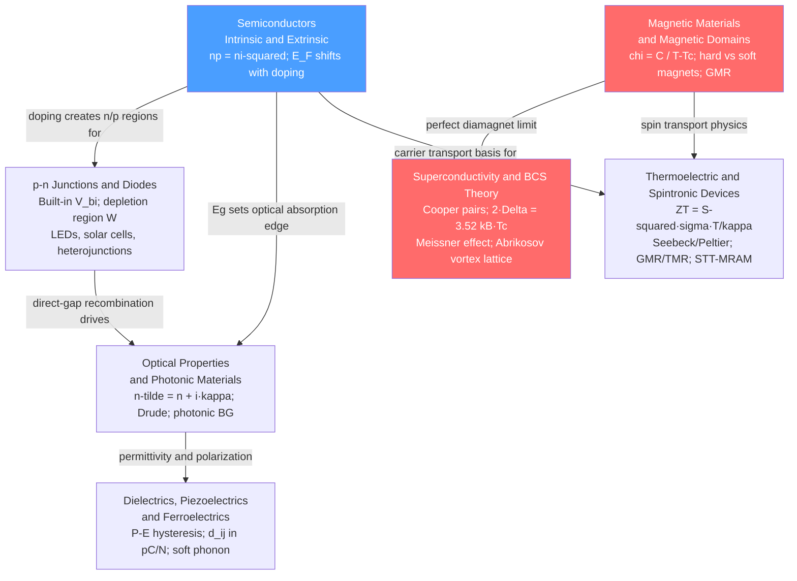

# Electronic, Magnetic, and Optical Properties — Map of Content

> [!info] How to use this map
> Start with **Fundamentals**, follow the arrows, and use the Learning Path below as your guide.
> Each node links to a full note. Come back to this map when you feel lost.

The electrical, optical, magnetic, and thermomechanical behavior of materials all emerge from how electrons respond to fields, phonons, and each other at the quantum level. This section builds from the foundational carrier physics of doped semiconductors through p-n junction devices, light-matter interaction, polar dielectrics, magnetic domain ordering, Cooper-pair condensation, and spin-driven functional devices. Mastering these seven notes provides the conceptual vocabulary for every active device in modern technology — from transistors and LEDs to MRI magnets and MRAM chips.

---

## Concept Map

*(Blue = fundamental entry point, Red = most advanced; arrows = "leads to" or "requires")*

---

## Learning Path

*Recommended order for a first pass through this section:*

1. [[Semiconductors_Intrinsic_and_Extrinsic]] — Start here: band gaps, doping, carrier concentration, the mass-action law, and Hall effect provide the vocabulary for every note that follows
2. [[p_n_Junctions_and_Diodes]] — Applies semiconductor doping directly to the n/p contact; establishes the Shockley equation, depletion region physics, forward/reverse bias, LEDs, and solar cells
3. [[Optical_Properties_and_Photonic_Materials]] — Connects band structure and carrier physics to light-matter interaction; explains transparency, metallic reflectance, luminescence, fiber optics, and photonic crystals
4. [[Dielectrics_Piezoelectrics_and_Ferroelectrics]] — Shifts focus from free carriers to bound charges and crystal symmetry; covers dielectric polarization mechanisms, piezoelectric transduction, and ferroelectric hysteresis
5. [[Magnetic_Materials_and_Magnetic_Domains]] — Explores spin-based ordering: exchange interactions, Curie-Weiss law, domain wall physics, hysteresis loops, and the GMR effect that launched modern data storage
6. [[Superconductivity_and_BCS_Theory]] — The quantum extreme: phonon-mediated Cooper-pair condensation, the Meissner effect, Type I/II behavior, Josephson junctions, and high-Tc cuprates
7. [[Thermoelectric_and_Spintronic_Devices]] — Applied convergence node: Seebeck/Peltier energy conversion with ZT optimization, and spin-valve/MTJ/STT-MRAM devices that unite electronic and magnetic physics

---

## All Notes in This Section

| Note | Key Equation / Concept | Application Level |
|------|------------------------|-------------------|
| [[Semiconductors_Intrinsic_and_Extrinsic]] | Mass-action law: np = ni²; ni ∝ exp(−Eg/2kBT); Hall coefficient RH = ±1/ne | Intermediate |
| [[p_n_Junctions_and_Diodes]] | Shockley: I = I₀[exp(qV/nkT) − 1]; built-in Vbi = (kT/q)·ln(NA·ND/ni²) | Intermediate |
| [[Optical_Properties_and_Photonic_Materials]] | Complex index ñ = n + iκ; Beer-Lambert I = I₀·exp(−αx); Fresnel R | Intermediate |
| [[Dielectrics_Piezoelectrics_and_Ferroelectrics]] | Piezo: Di = dij·Tj in pC/N; Curie-Weiss: εr = C/(T − Tc); P-E loop | Intermediate |
| [[Magnetic_Materials_and_Magnetic_Domains]] | Curie-Weiss: χ = C/(T − Tc); wall energy σw = 4√(AK₁); GMR ratio | Advanced |
| [[Superconductivity_and_BCS_Theory]] | BCS gap: 2Δ(0) = 3.52·kBTc; London depth λL = √(m/μ₀nse²); flux quantum Φ₀ = h/2e | Advanced |
| [[Thermoelectric_and_Spintronic_Devices]] | Figure of merit: ZT = S²σT/κ; Seebeck S in μV/K; TMR = 2P₁P₂/(1 − P₁P₂) | Intermediate |

---

## Key Questions This Section Answers

- What determines whether a material is metallic, semiconducting, or insulating — and how does doping shift the Fermi level to tune conductivity by ten orders of magnitude?
- How does a p-n junction create a built-in electric field, and why does forward bias produce exponentially rising current while reverse bias permits only a tiny leakage?
- Why can gallium nitride emit blue light efficiently while silicon cannot, and how does the direct vs indirect band gap distinction govern all LED and laser design?
- What microscopic polarization mechanisms control a dielectric's permittivity, and how does broken inversion symmetry in a crystal give rise to piezoelectricity and switchable ferroelectric polarization?
- Why do iron and cobalt spontaneously magnetize below their Curie temperatures, and what microstructural parameters decide whether a magnet is soft or hard?
- How do phonon-mediated Cooper pairs condense into a macroscopic quantum state that produces exactly zero resistance and active flux expulsion — and why does the Type II vortex state allow practical high-field magnets?
- How is a temperature gradient converted directly into electricity with no moving parts, and how does the electron's spin degree of freedom enable non-volatile memory storage at sub-picojoule energies per bit?

---

## Connections to Other Topics

- [[_MOC_MaterialsScience_Master]] — Master entry point for the full Materials Science vault; this section is one of six covering the breadth from crystal structure to advanced functional materials
- [[_MOC_Crystal_Structure_and_Bonding]] — Crystal symmetry and bonding are the prerequisites underpinning this entire section: the absence of an inversion center is necessary for piezoelectricity, band structure arises from the periodic atomic potential, and exchange integrals in magnetic materials depend critically on interatomic spacing and orbital overlap
- [[_MOC_Nanotechnology_and_Nanomaterials]] — Quantum confinement shifts band gaps and density of states in nanostructures; nanostructuring is the primary strategy for suppressing phonon thermal conductivity to boost thermoelectric ZT; and the GMR/TMR multilayers at the heart of spintronics are themselves atomic-scale heterostructures
