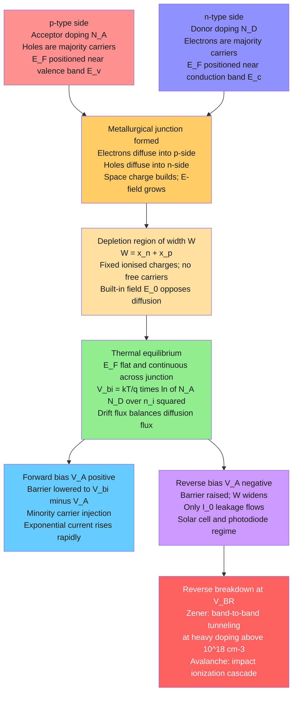

# ⚡ p-n Junctions and Diodes

> [!abstract] TL;DR
> A p-n junction — the contact between a hole-rich (p-type) and electron-rich (n-type) semiconductor — is the single most important structure in modern electronics. A built-in electric field blocks current in reverse but permits an exponentially growing current in forward bias (Shockley equation: $I = I_0[\exp(qV/nkT)-1]$). Every rectifier diode, LED, solar cell, photodiode, and bipolar transistor is one p-n junction or a stack of them; heterojunctions extend the concept to interfaces between different-bandgap materials, enabling semiconductor lasers and high-electron-mobility transistors.

---

## Intuition

**Analogy:** Think of a one-way turnstile at a subway entrance. People (charge carriers) can push through easily going one direction (forward bias) but the turnstile locks against them going the other way (reverse bias). A tiny trickle sneaks through in reverse — the rare person who jumps the barrier — corresponding to the reverse saturation current $I_0$.

At a real p-n junction, the "turnstile" is a thin layer of built-in electric field called the depletion region. Electrons on the n-side and holes on the p-side are both eager to diffuse across, but their own diffusion charges up an internal potential $V_{bi}$ that halts them at equilibrium. Apply a forward voltage and you lower that potential; carriers flood through and current rises exponentially. Apply a reverse voltage and you raise it; only thermally generated minority carriers trickle across.

---

## How It Works

### Core Mechanics

**1. Depletion region formation.** When p-type and n-type silicon are brought into contact, electrons diffuse from n to p and holes from p to n. They leave behind fixed, ionised donor atoms (positive charge) on the n-side and fixed, ionised acceptor atoms (negative charge) on the p-side — a space-charge region with no free carriers: the **depletion region** of width $W$.

**2. Built-in potential.** The space-charge electric field opposes further diffusion. At equilibrium the Fermi level $E_F$ must be flat (constant) across the junction. The resulting built-in electrostatic potential is:
$$V_{bi} = \frac{kT}{q}\ln\!\left(\frac{N_A N_D}{n_i^2}\right)$$
For Si with $N_A = N_D = 10^{16}$ cm$^{-3}$ and $n_i \approx 1.5\times10^{10}$ cm$^{-3}$ at 300 K: $V_{bi} \approx 0.72$ V.

**3. Depletion width.** Under the depletion approximation (abrupt junction, fully ionised dopants) and Poisson's equation:
$$W = x_n + x_p = \sqrt{\frac{2\varepsilon_s}{q}\!\left(\frac{N_A + N_D}{N_A N_D}\right)\!\left(V_{bi} - V_A\right)}$$
Charge neutrality forces $x_n N_D = x_p N_A$: the depletion layer extends further into the *lighter-doped* side. Reverse bias ($V_A < 0$) widens $W$; forward bias ($V_A > 0$) narrows it.

**4. Shockley (ideal) diode equation.** Minority carriers injected at the depletion edge diffuse and recombine, producing the current:
$$I = I_0\!\left[\exp\!\left(\frac{qV}{nkT}\right) - 1\right]$$
- $n = 1$: diffusion-limited (ideal), moderate forward bias.
- $n = 2$: recombination inside the depletion region dominates (low forward bias, lightly doped junctions).
- Real diodes show an $n$ between 1 and 2, sometimes voltage-dependent.

**5. Reverse saturation current $I_0$.** Proportional to $n_i^2$, hence strongly temperature-dependent:
$$I_0 = Aqn_i^2\!\left(\frac{D_p}{L_p N_D} + \frac{D_n}{L_n N_A}\right) \propto T^3 \exp\!\left(-\frac{E_g}{kT}\right)$$
For silicon, $I_0$ roughly doubles for every $\sim$10 K rise near room temperature. A Si diode with $I_0 = 10^{-12}$ A at 300 K has $I_0 \approx 10^{-7}$ A at 400 K — five orders of magnitude larger.

### Flow / Architecture



---

## Key Concepts

### Secondary

**Rectification and the diode symbol.** A diode passes conventional current from anode (p-side) to cathode (n-side) with a ~0.6–0.7 V forward drop in silicon, and blocks it in the other direction. The circuit-symbol arrow points in the direction of easy current flow. Four diodes in a bridge convert AC to pulsating DC — the starting point of every power supply.

**Light-emitting diode.** A forward-biased diode made from a **direct-gap** semiconductor (GaAs, GaN, InGaN) where conduction-band electrons recombine directly with valence-band holes, emitting a photon whose energy equals the bandgap:
$$\lambda \approx \frac{hc}{E_g}$$
Silicon is an **indirect-gap** semiconductor: electron-hole recombination requires a phonon to conserve crystal momentum, making optical emission ~$10^4$–$10^6$ times less probable. Silicon does not make practical visible LEDs.

| Material | $E_g$ (eV) | Gap type | LED colour / wavelength |
|----------|-----------|----------|------------------------|
| InGaAsP | 0.9–1.4 | Direct | Near-IR (880–1600 nm) |
| GaAs | 1.43 | Direct | Near-IR (870 nm) |
| AlGaInP | 1.9–2.2 | Direct | Red–amber (560–660 nm) |
| InGaN | 2.4–3.4 | Direct | Green–blue (375–520 nm) |
| GaN | 3.4 | Direct | Violet / UV (365 nm) |

**Solar cell basics.** A p-n junction illuminated by sunlight: photons with $h\nu > E_g$ excite electron-hole pairs that are swept apart by the built-in field, generating a photocurrent $I_{sc}$ (short-circuit current). The four performance metrics:
- $I_{sc}$: current at zero terminal voltage (proportional to light intensity)
- $V_{oc}$: voltage at zero current (logarithmically dependent on $I_{sc}/I_0$)
- Fill factor: $FF = P_{max}/(I_{sc}\,V_{oc})$ — how "square" the power quadrant is (0.70–0.85 for good Si)
- Efficiency: $\eta = P_{max}/P_{incident} = FF\cdot I_{sc}\cdot V_{oc}\,/\,P_{incident}$

### Undergraduate

**Band bending and the energy band diagram.** At equilibrium $E_F$ is flat, so the bands must bend to accommodate the potential step $qV_{bi}$ across the junction. On the p-side the bands are pushed *up* (more negative potential energy for electrons); on the n-side they are lower. Under forward bias the n-side Fermi level rises by $qV_A$, reducing the barrier height; under reverse bias the barrier increases.

**Detailed depletion widths** (abrupt one-sided $p^+$-n junction, $N_A \gg N_D$):
$$W \approx x_n \approx \sqrt{\frac{2\varepsilon_s\left(V_{bi}-V_A\right)}{qN_D}}$$
The maximum electric field at the junction: $\mathcal{E}_{max} = qN_D x_n/\varepsilon_s = 2(V_{bi}-V_A)/W$.

**Open-circuit voltage of a solar cell:**
$$V_{oc} = \frac{nkT}{q}\ln\!\left(\frac{I_{sc}}{I_0} + 1\right) \approx \frac{kT}{q}\ln\!\left(\frac{I_{sc}}{I_0}\right)$$
Lower $I_0$ (smaller $n_i^2$, i.e., larger bandgap or lower temperature) raises $V_{oc}$. For Si under AM1.5: $V_{oc} \approx 0.65$–$0.70$ V.

**Reverse breakdown mechanisms.**

*Zener breakdown* (tunnel breakdown): At heavy doping ($N > 10^{18}$ cm$^{-3}$) the depletion width is so narrow ($< 10$ nm) that electrons quantum-mechanically tunnel from the p-side valence band to the n-side conduction band under the applied reverse field. Breakdown voltage $V_{BR} < 6$ V; temperature coefficient is **negative** (voltage decreases as temperature rises — the Fermi-Dirac smearing narrows the effective tunnel barrier).

*Avalanche breakdown*: At lighter doping and higher $V_{BR} > 6$ V, a carrier traversing the wide high-field depletion region gains enough energy between scattering events to impact-ionise a second electron-hole pair. These carriers ionise more — a self-sustaining multiplication cascade. Temperature coefficient is **positive** (phonon scattering increases with $T$, requiring a higher field to sustain the cascade).

**Photodiode.** A reverse-biased p-n junction (or zero-biased for low noise). Incident photons with $h\nu > E_g$ generate electron-hole pairs in or near the depletion region; the reverse-bias field sweeps them apart rapidly (response time $\sim$ps–ns), producing a photocurrent $I_{ph} = R_\lambda P_{opt}$ where $R_\lambda$ (A/W) is the responsivity:
$$R_\lambda = \frac{\eta_{QE}\,q\lambda}{hc}$$
with $\eta_{QE}$ the quantum efficiency (fraction of photons generating a collected carrier pair).

**Bipolar junction transistor (BJT).** Two back-to-back p-n junctions: emitter–base (forward biased) and base–collector (reverse biased), in NPN or PNP configurations. The thin base ($\sim 100$ nm – a few µm) allows minority carriers injected from the emitter to diffuse across before recombining, reaching the collector. A small base current $I_B$ controls a much larger collector current:
$$I_C = \beta\, I_B, \qquad \beta = \frac{\alpha}{1-\alpha}, \quad \alpha = I_C/I_E \lesssim 1$$
with common-emitter gain $\beta \sim 50$–300 for silicon BJTs. BJTs remain the dominant active device in RF amplifiers, precision analog circuits, and bipolar power stages.

### Graduate

**Heterojunctions — band alignment.** A heterojunction interfaces two semiconductors with different bandgaps ($E_{g1} \neq E_{g2}$). The discontinuity distributes between the conduction and valence bands as offsets $\Delta E_c$ and $\Delta E_v$:
$$\Delta E_c + \Delta E_v = \left|E_{g1} - E_{g2}\right|$$
Anderson's rule (vacuum-level alignment) predicts $\Delta E_c = \chi_1 - \chi_2$ from electron affinities $\chi$, but interface chemistry, polarisation charges, and dipoles shift the actual offsets by 0.1–0.3 eV; experimental values (XPS, C-V profiling) are authoritative.

**Type I / II / III alignment:**

| Classification | Band relationship | Representative system | Application |
|----------------|-------------------|----------------------|-------------|
| Type I — straddling | Both $E_c$ and $E_v$ of narrow-gap material lie within the gap of the wide-gap host | GaAs / Al$_{0.3}$Ga$_{0.7}$As | Quantum-well lasers, HEMTs |
| Type II-A — staggered | $E_c$ and $E_v$ stagger; partial gap overlap | In$_{0.53}$Ga$_{0.47}$As / InP | Long-$\lambda$ photodetectors |
| Type II-B — broken gap | Valence band of one material lies *above* conduction band of other | InAs / GaSb | Tunnel FETs, mid-IR lasers |
| Type III — misaligned semimetal | Complete band crossing; no gap at interface | HgTe / CdTe (topological) | Topological surface states |

**High-electron-mobility transistor (HEMT).** At a Type I AlGaAs/GaAs or AlGaN/GaN interface, conduction-band offset traps electrons (donated from modulation-doped AlGaAs barriers, or from polarisation charges in GaN) into a triangular quantum well at the interface. These electrons form a **2D electron gas (2DEG)** spatially separated from their ionised donors — suppressing ionised-impurity scattering. The result: mobilities $\mu > 10^6$ cm$^2$ V$^{-1}$ s$^{-1}$ at low $T$ in GaAs/AlGaAs, and $\mu \sim 2000$ cm$^2$ V$^{-1}$ s$^{-1}$ at 300 K in GaN HEMTs. The latter are the backbone of 5G sub-6 GHz and mmWave power amplifiers.

**Non-ideal diode effects in real devices.**
- *Series resistance* $R_s$: at high forward current, the voltage drop $IR_s$ flattens the $\ln I$ vs $V$ slope; the curve rolls off from the ideal exponential.
- *Generation-recombination* in the depletion region: adds an $n \approx 2$ component at low forward bias, visible as a kink in a log-linear I-V plot.
- *High injection*: when minority-carrier density approaches the majority density, the Fermi levels crowd together; $n \rightarrow 2$ at high current.
- *Shunt resistance* $R_{sh}$: parallel leakage through surface states or defect paths; dominant at low illumination in solar cells, reducing $V_{oc}$.
- *Band-gap narrowing* at heavy doping: overlap of donor/acceptor wave functions shifts $E_c$ or $E_v$, lowering $V_{bi}$ slightly; important above $10^{18}$ cm$^{-3}$.

---

## Python Demo

```python
import numpy as np
import matplotlib.pyplot as plt

# ----------------------------------------------------------------
# Physical constants
# ----------------------------------------------------------------
q   = 1.602e-19   # elementary charge, C
kB  = 1.381e-23   # Boltzmann constant, J/K
Eg  = 1.12        # Si bandgap, eV

# Reference reverse saturation current for a Si p-n diode at 300 K
I0_ref = 1e-12    # A  (typical small-signal Si diode)
T_ref  = 300.0    # K
n_id   = 1.0      # ideality factor: n=1 for diffusion-limited regime

def I0_of_T(T):
    """
    Temperature-dependent reverse saturation current.
    I0 ∝ ni^2 ∝ T^3 * exp(-Eg/kT).
    Scale from a known reference value at T_ref:
      I0(T) = I0_ref * (T/T_ref)^3 * exp[(Eg*q/kB)*(1/T_ref - 1/T)]
    """
    return I0_ref * (T / T_ref)**3 * np.exp(
        Eg * q / kB * (1.0 / T_ref - 1.0 / T)
    )

def diode_IV(V, T):
    """Shockley ideal diode equation: I = I0(T) * [exp(qV / n*kT) - 1]."""
    VT       = kB * T / q
    exponent = np.clip(V / (n_id * VT), -50.0, 50.0)  # prevent overflow
    return I0_of_T(T) * (np.exp(exponent) - 1.0)

# ----------------------------------------------------------------
# Voltage sweep: reverse bias through forward bias
# ----------------------------------------------------------------
V      = np.linspace(-0.50, 0.70, 2000)
temps  = [200, 300, 400]
colors = ["steelblue", "darkorange", "firebrick"]

fig, axes = plt.subplots(1, 2, figsize=(13, 5))
fig.suptitle("Si p-n Diode: Shockley I-V at T = 200 K, 300 K, 400 K", fontsize=13)

for T, col in zip(temps, colors):
    I   = diode_IV(V, T)
    lbl = f"T = {T} K  |  I0 = {I0_of_T(T):.1e} A"
    axes[0].plot(V, I * 1e3,       color=col, lw=2, label=lbl)
    axes[1].semilogy(V, np.abs(I), color=col, lw=2, label=lbl)

for ax in axes:
    ax.axvline(0, color="k", lw=0.6)
    ax.axhline(0, color="k", lw=0.6)
    ax.set_xlabel("Voltage  V  (V)")
    ax.legend(fontsize=9)
    ax.grid(alpha=0.3)

# Linear scale: shows forward-bias exponential rise
axes[0].set_ylim(-1.0, 25.0)
axes[0].set_ylabel("Current  I  (mA)")
axes[0].set_title("Linear scale — forward-bias exponential rise")

# Log scale: shows I0 flat plateau in reverse bias, strong T-dependence
axes[1].set_ylim(1e-26, 1e-1)
axes[1].set_ylabel("|I|  (A)")
axes[1].set_title("Log scale — I0 plateau shifts 15 decades over 200 K")

plt.tight_layout()
plt.savefig("pn_diode_iv.png", dpi=150, bbox_inches="tight")
plt.show()

# ----------------------------------------------------------------
# Summary table: I0 and thermal voltage vs temperature
# ----------------------------------------------------------------
print(f"{'T (K)':<8}  {'I0 (A)':<15}  {'VT (mV)':<12}  {'Voc @ Isc=1mA (V)'}")
print("-" * 58)
for T in temps:
    VT  = kB * T / q
    I0  = I0_of_T(T)
    Voc = VT * np.log(1e-3 / I0 + 1)
    print(f"{T:<8}  {I0:<15.2e}  {VT*1e3:<12.2f}  {Voc:.4f}")
```

**What to observe:**
- *Linear scale*: The forward I-V knee shifts left as temperature rises (lower $V_T$) and the curve steepens because $I_0$ increases by ~$10^5$ from 200 K to 400 K.
- *Log scale*: The flat reverse-bias plateau is $I_0(T)$, which spans 15 orders of magnitude across the three temperatures — the dominant temperature effect in real devices.
- *$V_{oc}$ column*: Higher temperature raises $I_0$ faster than it raises $kT$, so $V_{oc}$ falls with increasing $T$, consistent with the $\sim -2$ mV/K coefficient of real Si solar cells.

---

## Real-World Applications

**Silicon rectifier diodes** (1N4001 series): every AC-to-DC power adapter uses a bridge of four p-n junctions. The ~0.7 V forward drop is a fundamental power loss in low-voltage (<5 V) converters, motivating Schottky diodes (metal-semiconductor junction, ~0.3 V drop) for USB chargers and switching regulators.

**Zener voltage references** (LM336, LM4040): precisely controlled reverse breakdown ($V_{BR}$ = 1.8–200 V) used for voltage regulation, ADC references, and overvoltage clamping. The sign of the temperature coefficient distinguishes zener ($dV_{BR}/dT < 0$, $V_{BR} < 6$ V) from avalanche ($dV_{BR}/dT > 0$, $V_{BR} > 6$ V) devices; ~5.6 V zener diodes intentionally operate at the crossover point for near-zero temperature drift.

**White LEDs** (InGaN/GaN heterostructure, 2014 Nobel Prize): A blue InGaN quantum-well LED ($\lambda \approx 450$ nm) coated with cerium-doped YAG phosphor (Ce:YAG) down-converts part of the blue emission to a broad yellow band; the mixture appears white. Luminous efficacy exceeds 200 lm/W for commercial chips — roughly 20 times more efficient than incandescent bulbs.

**Crystalline silicon solar cells** (PERC technology): a p-n junction ~200–300 µm thick with passivated rear contacts. Commercial single-crystal cells reach $\eta \approx 22$–$24\%$; the Shockley-Queisser single-junction limit for Si ($E_g = 1.12$ eV) is $\approx 29$–$30\%$ under AM1.5G. Perovskite-silicon tandem cells (two junctions in series, different $E_g$ values) have demonstrated $\eta > 33\%$ in 2024.

**CMOS image sensors** (smartphone cameras): $10^7$–$10^9$ silicon p-n junction pixels in a reverse-biased photodiode configuration. Photogenerated minority carriers integrate on a small capacitor; the readout circuit converts charge to voltage. Back-side illuminated (BSI) sensors eliminate the polysilicon wiring shadow, boosting $\eta_{QE}$ to $\sim 80$–$95\%$ in the visible.

**GaN HEMTs** (5G base stations, satellite communications): the AlGaN/GaN Type I heterojunction provides a spontaneously formed 2DEG of $\sim 10^{13}$ cm$^{-2}$ without intentional doping. Breakdown voltages of 100–600 V combined with high electron velocity ($v_{sat} \sim 10^7$ cm/s) make GaN HEMTs the preferred transistor for 3–100 GHz power amplification.

---

## Common Pitfalls

- **$V_{bi}$ cannot be measured with a voltmeter.** The built-in potential is an internal electrostatic quantity. Metal-semiconductor contact potentials at the probes exactly cancel $V_{bi}$ in equilibrium — a voltmeter across an unbiased diode reads zero. This confuses students expecting to measure 0.7 V.
- **$I_0$ is exponentially sensitive to temperature.** A 10 K change in silicon nearly doubles $I_0$. Simulation results using a 300 K value for $I_0$ at elevated temperatures can be off by orders of magnitude — critical for high-temperature power electronics design.
- **Ideality factor $n$ is not constant.** At low forward bias in silicon, depletion-region recombination gives $n \approx 2$; at moderate bias, diffusion gives $n \approx 1$; at high current, series resistance bends the curve further. A $\ln I$ vs $V$ plot reveals these regimes as regions of different slope.
- **Zener and avalanche have opposite temperature coefficients.** Zener diodes ($V_{BR} < 6$ V): $dV_{BR}/dT < 0$. Avalanche diodes ($V_{BR} > 6$ V): $dV_{BR}/dT > 0$. Swapping them in a precision reference introduces a large, wrong temperature drift.
- **$\lambda = hc/E_g$ only applies to direct-gap materials.** Applying this formula to silicon predicts emission at ~1100 nm, but the phonon-assisted indirect recombination makes Si an extremely poor emitter. Indirect-gap materials should not be used for LEDs.
- **Fill factor is not efficiency.** $FF$ describes the rectangularity of the I-V power quadrant. A high-FF cell may still have low efficiency if $V_{oc}$ or $I_{sc}$ is low. Both $I_0$ (affecting $V_{oc}$) and reflectance / minority-carrier lifetime (affecting $I_{sc}$) must be optimised independently.
- **Holes are not protons.** A hole is the absence of an electron in the valence band — a quasi-particle with effective mass $m_h^*$, positive charge, and its own (different) mobility. Treating holes as classical positive ions leads to errors in drift-diffusion calculations.

---

## Related Concepts

- [[Semiconductors_Intrinsic_and_Extrinsic]] — prerequisite; doping concentrations $N_A$, $N_D$ and the intrinsic carrier density $n_i$ determine $V_{bi}$, $I_0$, and every junction parameter
- [[Optical_Properties_and_Photonic_Materials]] — LEDs and photodiodes are the direct connection between junction physics and photon emission/absorption in materials
- [[Nano_Electronics_and_MEMS_NEMS]] — MOSFET and FinFET scaling builds on the p-n junction depletion model; gate dielectrics control the field-effect version of the same barrier
- [[Nanoscale_Physics_and_Quantum_Confinement]] — quantum wells at heterojunctions (HEMT 2DEG, quantum-well lasers) arise from carrier confinement at the atomically sharp interface
- [[_MOC_Electronic_Magnetic_and_Optical_Properties]] — section map for electronic, magnetic, and optical properties
- [[Electromagnetic_Waves_and_Radiation]] — photon generation in LEDs and photon absorption in photodiodes connect junction recombination physics to EM wave theory
- [[Semiconductors_and_Devices]] — the Physics vault treatment of the same devices, extending to MOSFET scaling, 2DEG quantum Hall physics, and spintronics

---

## Review Questions

1. **(Secondary)** A silicon p-n junction has $N_A = 10^{17}$ cm$^{-3}$ on the p-side and $N_D = 10^{16}$ cm$^{-3}$ on the n-side. Without calculating: on which side does the depletion region extend further, and why? Sketch the energy band diagram under (a) zero bias, (b) $+0.5$ V forward bias, (c) $-5$ V reverse bias, labelling $E_c$, $E_v$, $E_F$, and $qV_{bi}$.

2. **(Undergraduate)** A solar cell delivers $I_{sc} = 8$ A and $V_{oc} = 0.64$ V under AM1.5 illumination ($P_{inc} = 100$ mW cm$^{-2}$, cell area 100 cm²). If $FF = 0.79$, what is the power-conversion efficiency? By what factor must $I_0$ decrease to raise $V_{oc}$ by 60 mV, and which material parameter has the largest leverage on $I_0$ for a Si diode?

3. **(Graduate)** Explain the band alignment in a GaAs / Al$_{0.3}$Ga$_{0.7}$As Type I heterojunction. Why does modulation doping give the 2DEG higher mobility than bulk GaAs doped to the same carrier density? At what temperature does the low-field mobility peak, and what phonon scattering mechanism limits it at higher temperatures?

---

## Sources

- Callister, W. D. & Rethwisch, D. G., *Materials Science and Engineering: An Introduction*, 10th ed. — Chapters 18–19 (electronic and optical properties of semiconductors)
- Streetman, B. G. & Banerjee, S. K., *Solid State Electronic Devices*, 7th ed. — Chapters 5–8 (p-n junctions, BJT, LEDs, photodetectors, heterojunctions)
- Sze, S. M. & Ng, K. K., *Physics of Semiconductor Devices*, 3rd ed. (Wiley, 2007) — definitive device-physics reference
- Neamen, D. A., *Semiconductor Physics and Devices*, 4th ed. (McGraw-Hill, 2011) — undergraduate derivations
- Shockley, W. & Queisser, H. J., "Detailed Balance Limit of Efficiency of p-n Junction Solar Cells," *J. Appl. Phys.* **32**, 510 (1961)

---

#MaterialsScience #pnJunction #Diode #Semiconductor #LED #SolarCell #Heterojunction #ElectronicDevices #undergraduate #graduate
