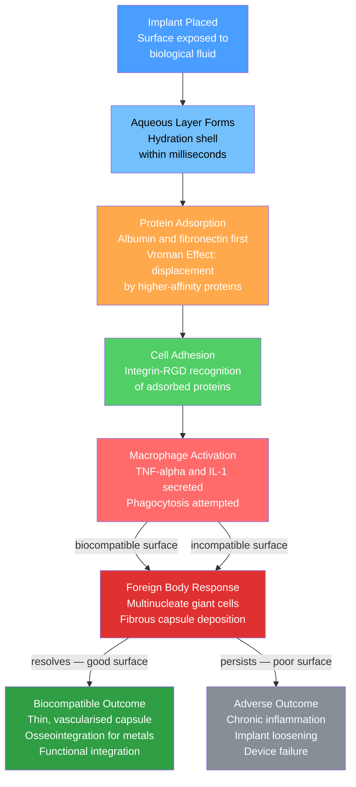

# Biomaterials and Biocompatibility

> [!abstract] TL;DR
> A biomaterial is any substance — metal, ceramic, polymer, or composite — intentionally placed in contact with biological tissue to restore or augment function; its success depends entirely on biocompatibility: the ability to perform its intended function without eliciting a harmful host response. Surface chemistry governs everything — protein adsorption within milliseconds of implantation sets off a cascade that ultimately determines whether bone grows into a Ti-6Al-4V implant, a silicone capsule hardens around a breast implant, or a PLGA scaffold dissolves harmlessly after delivering a drug.

---

## Intuition

**Analogy:** A biomaterial is like a houseguest the body must decide to accept or evict. The host — your immune system — cannot see the guest directly; instead, it reads a calling card left on the guest's surface within seconds of arrival. That calling card is a thin film of adsorbed proteins: if the protein layer looks "self-like," the immune system shrugs and the guest settles in; if it looks foreign, macrophages arrive, try to engulf the intruder, fail, fuse into giant cells, and eventually wall the whole thing off in scar tissue. The material scientist's job is to engineer the calling card — through surface chemistry, wettability, and texture — so the body says "come in, stay as long as you like" rather than "security, we have a problem."

In practice, this means that two Ti-6Al-4V implants with identical bulk composition but different surface treatments can produce radically different clinical outcomes. The *surface*, not the bulk, is the interface with life.

---

## How It Works

### Core Mechanics

**1. Protein adsorption — the first event at the interface**

Within milliseconds of contacting blood or interstitial fluid, a biomaterial surface is coated with a competitive protein film. Small, abundant proteins (albumin, fibronectin) arrive first simply because of their high concentration; over minutes to hours, rarer but higher-affinity proteins displace them — a sequence known as the **Vroman effect** (Leo Vroman, 1954). The final protein layer composition determines which cell adhesion receptors (integrins) can bind, which in turn governs the inflammatory cascade.

**2. Surface wettability — Young's equation**

Protein adsorption is controlled by surface free energy, quantified through contact angle $\theta$. For a liquid droplet on a solid surface in vapour, the **Young equation** balances the three interfacial tensions at the triple-phase line:

$$\cos\theta = \frac{\gamma_{SV} - \gamma_{SL}}{\gamma_{LV}}$$

where $\gamma_{SV}$ is the solid–vapour interfacial energy, $\gamma_{SL}$ the solid–liquid energy, and $\gamma_{LV}$ the liquid–vapour energy (72.8 mN/m for water at 37 °C). A surface with $\theta < 90°$ is hydrophilic (promotes protein spreading); $\theta > 90°$ is hydrophobic (promotes protein denaturation). Optimal biocompatibility is often achieved in an intermediate range ($\theta \approx 40-60°$) that supports cell spreading without protein denaturation.

**3. ISO 10993 — biological evaluation framework**

ISO 10993 defines the battery of tests a device must pass before clinical use:
- **10993-5** — cytotoxicity (cell culture survival assay; pass requires >70% viability relative to control)
- **10993-4** — hemocompatibility (haemolysis, platelet activation, complement activation; required for blood-contacting devices)
- **10993-3** — genotoxicity (Ames test for mutagenicity; comet assay for DNA strand breaks)
- **10993-10** — sensitization and skin irritation (Guinea pig maximisation or Buehler test)

Risk-based selection: not all tests are needed for every device; a rigid bone screw in a non-vascularised site has a different test matrix than a coronary stent in direct blood contact.

**4. Foreign body response cascade**

The cascade from implantation to stable tissue integration follows a stereotyped sequence governed by the biomaterial's surface properties:

### Flow / Architecture



---

## Key Concepts

### Secondary Level

**Material classes for biomedical applications**

Biomaterials are grouped by chemical class, each with characteristic strengths and limitations:

| Class | Representative materials | Primary applications | Key advantage | Key limitation |
|-------|-------------------------|----------------------|---------------|----------------|
| Metallic | Ti-6Al-4V, 316L SS, CoCrMo | Load-bearing implants | High strength and toughness | Stress shielding; corrosion in vivo |
| Ceramic | Hydroxyapatite, bioglass 45S5, ZrO₂ | Bone substitutes, dental | Bioactivity; bone bonding | Brittle; difficult to machine |
| Polymer — biostable | UHMWPE, silicone, PTFE | Joint liners, vascular grafts | Compliant; low friction | Wear debris; creep |
| Polymer — bioresorbable | PLA, PGA, PLGA | Sutures, screws, drug delivery | Degrades harmlessly | Strength loss with degradation |
| Composite | HA/collagen, PEEK/HA | Bone-mimetic scaffolds | Tunable stiffness | Complex manufacturing |

**Bone and tooth as natural composites**

Natural hard tissue achieves properties no synthetic material matches by organising the same two components — brittle hydroxyapatite (HA) and compliant type-I collagen — across six levels of hierarchy:

| Scale | Structure | Dimension |
|-------|-----------|-----------|
| Molecular | Collagen triple helix + HA platelets (2 × 25 × 50 nm) | 1–10 nm |
| Fibrillar | Mineralized collagen fibrils (HA in "staggered" arrangement) | 100–500 nm |
| Lamellar | Parallel fibril sheets at alternating angles (plywood) | 1–10 µm |
| Osteon | Concentric lamellae around Haversian canal | 200–300 µm |
| Cortical/cancellous | Dense cortical shell; open trabecular core | 1–10 mm |
| Whole bone | Long bones: hollow tube minimising weight at fixed bending stiffness | cm |

Cortical bone: elastic modulus $E \approx 7$–$25\ \text{GPa}$ (longitudinal); ultimate tensile strength ~130–180 MPa. The mineral content is ~65 wt% HA, ~25 wt% collagen, ~10 wt% water.

Tooth enamel (~96% HA by weight) is the hardest tissue in the human body ($H \approx 5\ \text{GPa}$); dentin beneath it is composite-like (~70% HA, ~20% collagen) and much tougher.

**Osseointegration — why titanium stays put**

Osseointegration (Per-Ingvar Brånemark, 1952) is the direct structural and functional connection between ordered living bone and the surface of a load-bearing implant, with no intervening fibrous layer. It occurs with titanium because:
1. TiO₂ surface oxide (2–10 nm thick, PBR = 1.73) is stable, passivating, and non-toxic
2. The oxide surface adsorbs fibronectin and vitronectin in a conformation that presents RGD motifs to osteoblast integrins
3. Osteoblasts differentiate and deposit mineralised matrix directly on the titanium surface
4. Surface roughness ($R_a \approx 1$–$2\ \mu\text{m}$, achieved by acid etching or grit blasting) provides mechanical interlocking

Dental implants and orthopaedic stems rely entirely on this mechanism. Failure occurs when the oxide layer is disrupted by fretting (micromotion) or when the local inflammatory environment prevents osteoblast differentiation.

---

### Undergraduate Level

**Metallic biomaterials — composition–property–function links**

*Ti-6Al-4V (ASTM F136):* The workhorse orthopaedic and dental alloy. The HCP α-phase is stabilised by Al (6 wt%); the BCC β-phase by V (4 wt%). The duplex microstructure gives yield strength ~880 MPa and fracture toughness ~80 MPa√m — sufficient for hip stems and spinal cages. Modulus (~110 GPa) is closer to bone (7–25 GPa) than stainless steel (~200 GPa), reducing stress shielding. Corrosion in simulated body fluid (SBF) is negligible; ion release (Ti⁴⁺, Al³⁺, V⁵⁺) is orders of magnitude below toxicity thresholds.

*316L stainless steel (ASTM F138):* Fe–17Cr–12Ni–2Mo, low-carbon (L = $<0.03$ wt% C). Used for fracture fixation hardware (screws, plates, intramedullary nails) intended for removal after healing. Cheaper and easier to machine than titanium. Susceptible to crevice and pitting corrosion at modular junctions in chloride-rich synovial and blood environments; see [[Corrosion_and_Electrochemical_Degradation]]. Not suitable for permanent implants.

*CoCrMo alloys (ASTM F75 cast; F1537 wrought):* Cobalt–28Cr–6Mo. The highest wear resistance of any metallic biomaterial — hardness ~300 HV, wear rate in metal-on-metal articulation ~10× lower than steel. Used for femoral heads and knee condyles where articulating surfaces must sustain millions of loading cycles. Risk: nano-sized wear particles and dissolved Co²⁺/Cr³⁺ ions cause aseptic lymphocyte-dominated vasculitis associated lesions (ALVAL) — a class effect responsible for metal-on-metal hip recalls (ASR XL, DePuy, 2010).

**Ceramic biomaterials**

*Hydroxyapatite — Ca₁₀(PO₄)₆(OH)₂* is the mineral phase of bone. Synthetic HA is osteoconductive (supports bone growth on its surface) and bioactive (bonds directly to bone through an intermediate carbonated HA layer). The calcium-to-phosphorus molar ratio (Ca/P = 1.67 for stoichiometric HA) is critical: deviations produce more soluble tricalcium phosphate or less soluble fluorapatite. HA is brittle ($K_{Ic} \approx 1\ \text{MPa}\sqrt{\text{m}}$, vs cortical bone $\sim$6 MPa√m) and cannot bear cyclic loads alone; it is used as a coating (~50–100 µm, plasma-sprayed) on metallic stems to accelerate osseointegration, or as a scaffold filler.

*Bioglass 45S5* (Larry Hench, 1969): 45 wt% SiO₂ – 24.5% Na₂O – 24.5% CaO – 6% P₂O₅. The sodium and calcium leach rapidly in SBF, raising local pH and Ca²⁺ concentration; a silica-rich surface gel forms, then an amorphous carbonated HA layer that bonds directly to collagen in bone. No other synthetic material bonds to soft tissue as well as bioglass. Limitation: very brittle ($K_{Ic} \approx 0.6\ \text{MPa}\sqrt{\text{m}}$) and not resorbable after bonding — used for small bone defects, ear ossicles, and dentistry.

*Zirconia — ZrO₂ (Y-TZP):* Partially stabilised with 3 mol% yttria to maintain the tetragonal phase at room temperature. Hardness ~1200 HV, fracture toughness ~6–10 MPa√m (transformation toughening: stress at crack tip transforms tetragonal → monoclinic, expanding ~4%, closing the crack). Used for dental crowns (all-ceramic restorations) and femoral heads in ceramic-on-ceramic hip bearings. Concern: hydrothermal degradation (low-temperature ageing) in humid conditions below 300 °C triggers spontaneous tetragonal → monoclinic transformation, roughening the surface and generating wear particles.

**Polymer biomaterials — biostable**

*UHMWPE* (ultra-high molecular weight polyethylene, $M_w > 3 \times 10^6\ \text{g/mol}$): The gold standard acetabular cup liner in total hip replacement. Highly crystalline, tough, and self-lubricating. The failure mode is wear: sub-micron polyethylene particles ($\sim$0.1–1 µm) are phagocytosed by macrophages, which secrete RANKL, activating osteoclasts and causing periprosthetic osteolysis — aseptic loosening. Crosslinking (gamma irradiation, 50–100 kGy) reduces wear rate ~80% by creating a network resistant to chain pullout, but reduces fracture toughness. Vitamin-E-stabilised highly crosslinked UHMWPE is the current best practice.

*Silicone* (polydimethylsiloxane, PDMS): Very low modulus (~0.5–3 MPa), chemically inert, hydrophobic, excellent biocompatibility. Used for breast implants (cohesive gel), finger joint prostheses (small joints), and cardiac pacemaker lead insulation. The fibrous capsular contracture response (Baker grade III/IV) is the dominant complication with breast implants: macrophages fail to phagocytose silicone, form a foreign-body giant cell layer, and the surrounding fibrous capsule contracts, distorting the implant.

*PTFE* (polytetrafluoroethylene, expanded ePTFE / Gore-Tex): Contact angle ~108° — extremely hydrophobic, non-thrombogenic. Used for vascular bypass grafts (aortoiliac, femoropopliteal), facial reconstruction patches, and hernia mesh. The expanded form has a node-and-fibril microstructure with controllable internodal distance (IND = 10–60 µm) that governs tissue ingrowth depth. Limitation: poor patency below the knee (small calibre grafts, $<6\ \text{mm}$ diameter) due to low blood flow and neointimal hyperplasia.

**Bioresorbable polymers — degradation kinetics**

PLA, PGA, and their copolymers PLGA degrade by hydrolytic chain scission of the ester backbone — autocatalytic because the carboxylic acid end groups produced lower local pH and accelerate further hydrolysis.

**Two-stage bulk-erosion model:**

*Stage 1 — molecular weight decrease:* Water penetrates the bulk (the polymer is amorphous or has absorbing amorphous regions). Random chain scission follows first-order kinetics:

$$\frac{dM_n}{dt} = -k_{hydrolysis} \cdot M_n \implies M_n(t) = M_{n,0} \cdot e^{-k_{hydrolysis} \cdot t}$$

where $k_{hydrolysis}$ depends on backbone chemistry (ester hydrolysis rate), crystallinity (water exclusion from crystalline domains), and $T_g$ relative to 37 °C.

*Stage 2 — mass loss:* Begins when $M_n$ drops below a critical value (~2–10 kDa), below which oligomers are water-soluble and leach out. Mass loss follows a sigmoidal curve because the autocatalytic production of acid end groups accelerates hydrolysis once it begins. The lag between Stage 1 and Stage 2 is why PLA bone screws retain structural integrity for months before dissolving.

**Comparative rates (physiological conditions, pH 7.4, 37 °C):**

| Polymer | $k_{hydrolysis}$ (day⁻¹) | $M_n$ half-life | $t_{50\%}$ mass loss | Clinical use |
|---------|--------------------------|-----------------|----------------------|--------------|
| PGA | ~0.11 | ~6 days | ~35 days | Sutures, haemostatic meshes |
| PLGA 50:50 | ~0.028 | ~25 days | ~85 days | Drug-eluting stents, microspheres |
| PLA | ~0.006 | ~115 days | ~400 days | Bone fixation screws, interference screws |

PLGA copolymers are tunable: higher PGA content → faster degradation. The 50:50 ratio degrades faster than either homopolymer because crystallinity is minimised and water uptake maximised.

**Surface wettability — Young's equation and protein adsorption**

The contact angle $\theta$ measured by sessile-drop goniometry reports the balance of surface tensions at the three-phase contact line. For water on a biomaterial surface:

$$\cos\theta = \frac{\gamma_{SV} - \gamma_{SL}}{\gamma_{LV}}$$

The **work of adhesion** of a protein to the surface is:
$$W_a = \gamma_{LV}(1 + \cos\theta)$$

Highly hydrophobic surfaces ($\theta > 90°$) show high $W_a$ but cause protein unfolding (denaturation) on adsorption, exposing cryptic epitopes that trigger macrophage activation. Highly hydrophilic surfaces ($\theta < 20°$) resist protein adsorption altogether — this is the principle behind PEGylation (grafting polyethylene glycol chains): entropic repulsion from hydrated PEG brushes prevents protein adsorption and enables "stealth" behaviour that suppresses the foreign body response.

---

### Graduate Level

**The Vroman effect — competitive protein adsorption kinetics**

At a surface first contacting blood plasma, protein adsorption follows the Vroman sequence:
1. **Rapid deposition phase (~ms):** Albumin (most abundant, 35–50 mg/mL, $M_w = 67\ \text{kDa}$) and IgG (8–16 mg/mL) adsorb within the first second — purely by concentration-driven Langmuir kinetics
2. **Displacement phase (~min):** Fibrinogen (2–4 mg/mL, $M_w = 340\ \text{kDa}$) displaces albumin; its adsorption is thermodynamically driven (higher surface affinity) despite lower bulk concentration
3. **Late phase (~hours):** High-molecular-weight kininogen (HMWK, ~80 µg/mL) and Factor XII displace fibrinogen; HMWK adsorption activates the contact pathway of coagulation

The Vroman effect is surface-dependent: hydrophilic surfaces (PEG, phosphorylcholine) suppress the sequence entirely; hydrophobic surfaces accelerate it. Designing an implant surface that presents fibronectin (rather than fibrinogen) promotes osteoblast adhesion over platelet activation — the difference between osseointegration and thrombosis.

**Tissue engineering scaffolds — design criteria**

A tissue engineering scaffold must simultaneously satisfy mechanical, geometric, and biological constraints that are often in tension:

| Parameter | Target (bone) | Rationale |
|-----------|--------------|-----------|
| Pore size | 200–500 µm diameter | Minimum for vascularisation; <100 µm blocks vessel ingrowth |
| Porosity | 60–90 vol% | Balance between permeability and mechanical strength |
| Interconnectivity | >90% open pores | Essential for cell migration and nutrient diffusion |
| Compressive modulus | 1–20 GPa (cortical: 7–25 GPa) | Matching stiffness prevents stress shielding; mismatch causes scaffold failure |
| Degradation rate | Matched to bone regeneration (~3–12 months) | Too fast: mechanical failure before tissue forms; too slow: interferes with remodelling |
| Surface chemistry | RGD-presenting, hydroxyl or amine groups | Promotes integrin-mediated cell adhesion |

Scaffold fabrication: selective laser sintering (SLS) and direct ink writing (DIW) can print interconnected 3D architectures; freeze-casting (ice templating) creates aligned lamellar channels that mimic the osteon structure of cortical bone; electrospinning produces nano-fibrous mats for soft tissue scaffolds.

**Drug-eluting stents — biocompatibility engineered at the coating scale**

First-generation bare-metal stents (BMS) achieved mechanical patency but suffered in-stent restenosis rates of 20–30% from neointimal hyperplasia (smooth muscle cell proliferation). Drug-eluting stents (DES) coat the metal struts with a polymer (PLGA, or durable fluoropolymer) loaded with antiproliferative drugs:
- *Sirolimus* (rapamycin): mTOR inhibitor, blocks smooth muscle cell cycle at G1/S
- *Paclitaxel*: stabilises microtubules, arrests mitosis

The drug elutes over 1–6 months; the underlying polymer film remains permanently on the strut unless biodegradable PLGA is used (second-generation bioresorbable stents: Absorb BVS, Abbott). The permanent polymer coating is the Achilles' heel: late stent thrombosis ($<1\%$/year but fatal when it occurs) is attributed to polymer hypersensitivity reactions that delay endothelialisation. Modern thin-strut DES ($<75\ \mu\text{m}$ vs $>140\ \mu\text{m}$ for early BMS) achieve near-complete endothelialisation by 3 months.

**TAVI — materials engineering at the heart valve scale**

Transcatheter Aortic Valve Implantation (TAVI) demonstrates the integration of nearly every biomaterial class in a single device:
- **Nitinol frame** (NiTi shape-memory alloy): superelastic at body temperature, enabling crimping to <7 mm diameter catheter and self-expansion to full 26–29 mm at deployment. Ni release concern managed by oxide passivation and TiN coatings.
- **Porcine or bovine pericardium leaflets**: glutaraldehyde-crosslinked to prevent immune recognition; the crosslinking preserves collagen architecture while masking xenoantigens. Primary failure mode is structural valve degeneration (calcification) after ~10–15 years — deposition of calcium phosphate on crosslinked collagen driven by residual phospholipids.
- **PET skirt**: sewn around the annular seal zone to reduce paravalvular leak; PET is biostable, promotes tissue ingrowth

TAVI outcomes (mortality <2% in low-risk patients, PARTNER 3 trial) have made it the dominant aortic valve replacement in patients over 65.

**Fretting corrosion at modular junctions**

Modular hip implants (femoral head–neck tapers, neck–stem junctions) allow intraoperative length adjustment but create a crevice under cyclic loading. The mechanism:
1. Micromotion (1–60 µm displacement) mechanically disrupts the passive TiO₂ or Cr₂O₃ oxide layer — a process called **fretting**
2. The freshly exposed metal corrodes rapidly in the crevice electrolyte (synergistic fretting-corrosion = tribocorrosion)
3. Metallic wear debris (Ti, Cr, Co ions and nano-particles) accumulates locally
4. Adverse local tissue reaction (ALTR) including osteolysis and pseudo-tumour formation

The material pair at the taper matters enormously: Ti neck–CoCrMo head is more susceptible than CoCrMo–CoCrMo because the galvanic couple (Ti is active, CoCr is noble) accelerates Ti corrosion; see [[Corrosion_and_Electrochemical_Degradation]] for galvanic series principles.

---

## Python Demo

```python
import numpy as np
import matplotlib.pyplot as plt

# ---------------------------------------------------------------
# Bioresorbable polymer degradation: bulk-erosion two-stage model
# Stage 1 — random chain hydrolysis: Mn(t) = Mn0 * exp(-k_mw * t)
# Stage 2 — mass loss: sigmoidal, onset when Mn < MW_crit
#            autocatalytic acid end-groups accelerate hydrolysis
# Conditions: pH 7.4 phosphate-buffered saline, 37 degrees C
# References: Gopferich (1996) Biomaterials 17(2):103
#             Lyu & Untereker (2009) Biomacromolecules 10(12):3113
# ---------------------------------------------------------------

t = np.linspace(0, 700, 2000)     # days (up to ~23 months)

Mn0 = 100000.0    # initial number-average MW (g/mol)
MW_crit = 5000.0  # water-soluble threshold for oligomers (g/mol)

# Parameters: (label, k_mw [1/day], k_mass [1/day], clinical_use, color, ls)
polymers = [
    ('PGA',        0.110, 0.35, 'Sutures — absorbed 4-8 weeks',         '#e03131', '-'),
    ('PLGA 50:50', 0.028, 0.10, 'Drug-eluting stent scaffold — 3-4 mo', '#2f9e44', '--'),
    ('PLA',        0.006, 0.028,'Bone fixation screws — 12-18 mo',       '#1971c2', '-.'),
]

fig, (ax1, ax2) = plt.subplots(1, 2, figsize=(14, 6))
fig.suptitle(
    'Bioresorbable Polymer Degradation — Bulk-Erosion Model\n'
    'Physiological conditions: pH 7.4, 37 degrees C',
    fontsize=12, fontweight='bold'
)

for label, k_mw, k_mass, clinical, color, ls in polymers:
    # --- Stage 1: molecular weight decay ---
    Mn = Mn0 * np.exp(-k_mw * t)
    # Critical time when Mn first drops below MW_crit (oligomers leach out)
    t_crit = np.log(Mn0 / MW_crit) / k_mw

    # --- Stage 2: sigmoidal mass loss ---
    # Sigmoid centred at 1.3 * t_crit (lag before mass loss is measurable)
    t_50 = 1.3 * t_crit
    M_rem = 100.0 / (1.0 + np.exp(k_mass * (t - t_50)))

    # Panel 1: Mn over time
    ax1.plot(t, Mn / 1000.0, color=color, ls=ls, lw=2.5, label=label)
    ax1.axvline(t_crit, color=color, lw=0.9, ls=':', alpha=0.65)
    ax1.annotate(
        f't_crit = {t_crit:.0f} d',
        xy=(t_crit, MW_crit / 1000.0),
        xytext=(t_crit + 15, MW_crit / 1000.0 + 4),
        fontsize=8, color=color,
        arrowprops=dict(arrowstyle='->', color=color, lw=0.8)
    )

    # Panel 2: mass remaining over time
    ax2.plot(t, M_rem, color=color, ls=ls, lw=2.5,
             label=f'{label}  —  {clinical}')
    ax2.annotate(
        f't_50 = {t_50:.0f} d',
        xy=(t_50, 50),
        xytext=(t_50 + 20, 63),
        fontsize=8, color=color,
        arrowprops=dict(arrowstyle='->', color=color, lw=0.9)
    )

# MW_crit reference line on Panel 1
ax1.axhline(MW_crit / 1000.0, color='gray', ls=':', lw=1.2)
ax1.text(480, MW_crit / 1000.0 + 1.2,
         'MW_crit = 5 kDa\n(water-soluble threshold)',
         fontsize=8.5, color='gray')

ax1.set_xlabel('Time (days)', fontsize=11)
ax1.set_ylabel('Number-Average MW, Mn (kDa)', fontsize=11)
ax1.set_title(
    'Stage 1: MW Decrease by Hydrolytic Chain Scission\n'
    'First-order: Mn(t) = Mn0 * exp(-k_mw * t)',
    fontsize=10
)
ax1.set_xlim(0, 700)
ax1.set_ylim(-2, 103)
ax1.legend(fontsize=10)
ax1.grid(True, alpha=0.25)

ax2.set_xlabel('Time (days)', fontsize=11)
ax2.set_ylabel('Mass Remaining (%)', fontsize=11)
ax2.set_title(
    'Stage 2: Mass Loss after Mn < MW_crit\n'
    'Sigmoidal — autocatalytic acid end-groups accelerate hydrolysis',
    fontsize=10
)
ax2.set_xlim(0, 700)
ax2.set_ylim(-3, 103)
ax2.legend(fontsize=8.5, loc='upper right')
ax2.grid(True, alpha=0.25)

plt.tight_layout(rect=[0, 0, 1, 0.93])
plt.savefig('bioresorbable_degradation.png', dpi=150, bbox_inches='tight')
plt.show()

# Summary table
print(f"\n{'Polymer':<14} {'k_mw (1/d)':>13} {'Mn half-life (d)':>18} "
      f"{'t_crit (d)':>13} {'t_50 mass (d)':>15}")
print('-' * 78)
for label, k_mw, k_mass, *_ in polymers:
    t_half_mw = np.log(2) / k_mw
    t_crit = np.log(Mn0 / MW_crit) / k_mw
    t50_m = 1.3 * t_crit
    print(f"{label:<14} {k_mw:>13.4f} {t_half_mw:>18.1f} "
          f"{t_crit:>13.1f} {t50_m:>15.1f}")
```

**Reading the output:** PGA (red solid) reaches $M_n < 5\ \text{kDa}$ in ~27 days and loses 50% mass by ~35 days — consistent with complete suture absorption by 6–8 weeks clinically. PLGA 50:50 (green dashed) degradation midpoint is ~85 days, matching the 3-month window for drug-eluting stent scaffold bioresorption. PLA (blue dash-dot) retains structural mass for ~400 days — explaining why PLA interference screws maintain fixation through ACL graft ligamentisation (~12 months) before dissolving. The lag between $t_{crit}$ (end of Stage 1) and $t_{50}$ (Stage 2 mass loss midpoint) reflects the time required for autocatalytic acid accumulation to reach critical concentration.

---

## Real-World Applications

> **Ti-6Al-4V dental implants — 5-million-per-year market, >95% 10-year survival.** A modern screw-type dental implant (Straumann, Nobel Biocare) is a Ti-6Al-4V screw, ~4 mm diameter × 10–13 mm length, with a micro-rough sandblasted acid-etched (SLA) surface ($R_a \approx 1.4\ \mu\text{m}$). The SLA surface has contact angle ~40°, adsorbs fibronectin preferentially (not fibrinogen), and achieves osseointegration in 6–8 weeks — compared to 12–16 weeks for machined surfaces. The evidence base for Ti-6Al-4V osseointegration is the largest in all biomaterials: >500,000 implant-years in multi-centre trials. Surface chemistry, not bulk alloy composition, is the critical variable.

> **PLGA microspheres for sustained hormone delivery — Lupron Depot.** Leuprolide acetate (GnRH agonist) encapsulated in PLGA 75:25 microspheres (100–150 µm diameter) achieves 1-month or 3-month sustained release by diffusion through and degradation of the PLGA matrix. The key materials-science challenge is maintaining zero-order release kinetics over the dosing window — drug burst (>20% released in 24 hours from surface-loaded drug) causes hormonal spikes. Optimised PLGA 75:25 with molecular weight ~75 kDa gives near-linear release over 28 days. FDA-approved since 1989; the first commercially successful biodegradable drug delivery system.

> **Gore-Tex vascular grafts — ePTFE in aortoiliac bypass.** Expanded PTFE grafts (W. L. Gore, 1975) have internodal distances of 30 µm (for above-knee applications) to 10 µm (below-knee, where tighter structure resists compliance mismatch). The non-thrombogenic surface (no protein fouling due to high hydrophobicity) is paradoxically also responsible for poor endothelialisation — endothelial cells need an RGD-presenting protein substrate to adhere, which PTFE does not provide. Carbon surface deposition and fibronectin-coating protocols are used to improve endothelialisation in small-calibre grafts.

> **CoCrMo femoral heads — 250 million cycles over a lifetime.** A total hip replacement femoral head (28–36 mm diameter, CoCrMo) articulates against a UHMWPE or ceramic acetabular liner at walking loads of 3–5× body weight, ~1 million cycles/year. Modern highly crosslinked UHMWPE (XLPE) generates ~0.02–0.05 mm/year of linear wear depth — roughly 20-fold improvement over conventional UHMWPE. The key insight: crosslinking converts the UHMWPE crystalline–amorphous interface into a network that resists single-chain pullout, which is the dominant wear mechanism. Remelting or annealing after irradiation restores oxidation resistance at the cost of slightly lower crosslink density.

---

## Common Pitfalls

- **Confusing biocompatibility with bioinertness** — "biocompatible" does not mean the material does nothing; it means the host response does not harm the patient. Bioglass is highly bioactive (bonds chemically to bone) and is biocompatible. A permanently inert PTFE patch is also biocompatible. Testing biocompatibility requires the full ISO 10993 matrix for the specific implant site and contact duration — a note that passed cytotoxicity tests is not necessarily haemocompatible.

- **Ignoring the Young's equation limitations** — the Young equation assumes a perfectly flat, chemically homogeneous, rigid solid. Real biomaterial surfaces are rough (Wenzel roughness amplifies the intrinsic contact angle) and chemically heterogeneous (Cassie–Baxter heterogeneity). A textured surface with $\theta_{intrinsic} = 70°$ can behave as either superhydrophilic ($\theta_{apparent} < 10°$ in the Wenzel regime) or superhydrophobic ($\theta_{apparent} > 150°$ in the Cassie–Baxter regime) depending on the scale and geometry of the texture. Reporting a single contact angle without specifying surface roughness is incomplete.

- **Neglecting the Vroman effect when interpreting in vitro cytotoxicity** — standard ISO 10993-5 cytotoxicity assays use serum-supplemented media, but the protein composition of full blood plasma differs significantly from foetal bovine serum. A surface that performs well in FBS may adsorb a different protein layer in whole blood, changing cell adhesion and activation. For blood-contacting devices, human platelet-rich plasma (PRP) or whole-blood flow assays better predict in vivo hemocompatibility.

- **Assuming first-order degradation throughout** — PLA, PGA, and PLGA all show a lag phase during which mass is nearly constant while MW decreases. Applying a simple first-order mass-loss model to calculate device lifetime overestimates early mass retention and underestimates the abrupt mass-loss phase. The autocatalytic nature means that thicker devices (>2–3 mm) can hollow out internally — forming a hollow shell that collapses suddenly — while thin films degrade uniformly. Geometric effects must be captured in any degradation model used for regulatory submissions.

- **Stress-shielding and stiffness mismatch** — a metallic implant much stiffer than the surrounding bone (316L SS, $E = 200\ \text{GPa}$; bone, $E = 7$–$25\ \text{GPa}$) carries the majority of the mechanical load, shielding bone from normal stress. By Wolff's Law, understressed bone resorbs. This is why hip stems and spinal fusion cages are increasingly made from PEEK ($E \approx 4\ \text{GPa}$ with HA fill, $\approx 20\ \text{GPa}$) or porous titanium lattices — reducing stiffness without sacrificing strength. Using a stiff monolithic metal in a load-sharing application will cause progressive bone loss regardless of how well osseointegration was achieved initially.

- **Overlooking fretting corrosion at modular interfaces** — corrosion testing of the individual components of a modular implant (head, neck, stem) may pass ISO 10993 in isolation, but the assembled junction under cyclic loading generates tribocorrosion currents orders of magnitude higher than static corrosion. The regulatory path now requires fretting-corrosion testing of the assembled device under simulated physiological loading (ASTM F1875, F3052) — a lesson learned from widespread MoM hip recalls.

- **Calcium phosphate coating spallation** — plasma-sprayed HA coatings (~50 µm thick) on Ti-6Al-4V stems provide early osseointegration benefits, but the coating–substrate interface is mechanically weak and the HA can be partially amorphous (more soluble). Delamination of the coating in the first 2–5 years generates HA debris that accumulates in the joint space. Coating crystallinity must be >62% (ISO 13779-2) and adhesion strength >35 MPa (ISO 13779-2) to minimise spallation risk.

---

## Related Concepts

**Same vault — Materials Science:**
- [[Corrosion_and_Electrochemical_Degradation]] — metallic biomaterials degrade by electrochemical corrosion in chloride-rich physiological fluids; galvanic couples at modular junctions and fretting-corrosion mechanisms are direct applications of Evans-diagram analysis
- [[Composite_Materials_and_Fiber_Reinforcement]] — bone and dentin are the premier natural composites; synthetic HA–polymer and PEEK–HA composites are designed with the same rule-of-mixtures logic as fibre-reinforced materials
- [[Nanomedicine_and_Drug_Delivery_Systems]] — PLGA microspheres and nanoparticles bridge the gap between biomaterials and nanomedicine; EPR-effect targeting, encapsulation efficiency, and release kinetics are direct extensions of degradation kinetics
- [[Sustainable_Materials_and_Circular_Economy]] — bioresorbable PLA and PGA originate from the same biobased polymer family discussed in sustainability; closed-loop circularity and biodegradability trade-offs apply equally here
- [[Stress_Strain_and_Elastic_Moduli]] — stiffness matching between implant and host tissue is the central mechanical design constraint; Wolff's Law remodelling is the biological consequence of stiffness mismatch
- [[Diffusion_in_Solids_and_Ficks_Laws]] — drug diffusion through PLGA matrices and ion transport through oxide passive films obey Fickian kinetics at the device scale

**Cross-vault — Chemistry:**
- [[Protein_Structure_and_Function]] — protein adsorption kinetics and the Vroman effect depend on protein secondary/tertiary structure; fibrinogen's domain structure determines its conformational change on adsorption to hydrophobic surfaces
- [[Chemical_Kinetics]] — hydrolytic degradation of ester bonds in PLA/PGA follows first-order kinetics; autocatalytic acid production is a coupled kinetic system directly modelled with rate-law formalism
- [[Pericyclic_Radical_and_Polymer_Chemistry]] — PLA synthesis via ring-opening polymerisation of lactide, PGA via condensation polymerisation of glycolic acid; crosslinking of UHMWPE by gamma-initiated radical reactions
- [[Membranes_and_Cell_Signaling]] — integrin-mediated cell adhesion, macrophage activation by foreign-body surfaces, and osteoblast differentiation signalling cascades are membrane-receptor events triggered by the protein-coated biomaterial surface
- [[Electrochemistry]] — Nernst equation and galvanic-cell thermodynamics underpin in-vivo corrosion of metallic implants; pitting potential analysis for 316L SS in simulated body fluid
- [[_MOC_Chemistry_Master]] — master index for all supporting organic, physical, and biochemistry concepts

---

## Review Questions

1. **(Secondary)** A surgeon is choosing between a Ti-6Al-4V hip stem and a 316L stainless-steel hip stem for a 45-year-old active patient expected to need the implant for 40 years. List three material properties that favour titanium for permanent implantation, and explain why 316L SS would be inappropriate over this timescale despite its lower cost. Your answer should address both mechanical and electrochemical considerations.

2. **(Undergraduate)** A PLGA 50:50 drug-eluting stent scaffold must release 80% of its drug payload within 90 days while retaining sufficient radial strength (>150 kPa) to prevent vessel recoil for the first 60 days. Using the bulk-erosion model $M_n(t) = M_{n,0} \cdot e^{-k \cdot t}$ and a critical $M_n$ of 5 kDa, calculate (a) the molecular weight after 60 days at $k = 0.028$ day⁻¹ and state whether structural integrity is likely maintained, and (b) the time at which 50% mass loss occurs given a sigmoid centred at $1.3 \cdot t_{crit}$. Does this satisfy the 90-day drug release requirement? What design parameter would you adjust if it does not?

3. **(Graduate)** Compare the surface engineering requirements for three distinct applications: (a) a coronary stent in direct blood contact for 5 years, (b) an acetabular cup liner articulating against a CoCrMo femoral head, and (c) a bone tissue engineering scaffold seeded with mesenchymal stem cells. For each application, specify the required contact angle range, the dominant protein adsorption event that must be controlled, the most critical biocompatibility test from ISO 10993, and the primary long-term failure mode that surface engineering must address. Why is a single universal "biocompatible" surface impossible across these three applications?

---

## Sources

- Ratner, B. D., Hoffman, A. S., Schoen, F. J. & Lemons, J. E. — *Biomaterials Science: An Introduction to Materials in Medicine*, 4th ed., Academic Press (2020); the definitive comprehensive reference covering all material classes, host response, and clinical applications
- Williams, D. F. — "On the mechanisms of biocompatibility," *Biomaterials*, 29(20), 2941–2953 (2008); seminal re-definition of biocompatibility as a surface-mediated interactive process rather than inertness
- ISO 10993-1:2018 — *Biological Evaluation of Medical Devices — Part 1: Evaluation and Testing within a Risk Management Process*; the regulatory framework for all biocompatibility testing
- Gopferich, A. — "Mechanisms of polymer degradation and erosion," *Biomaterials*, 17(2), 103–114 (1996); mathematical framework for bulk- vs. surface-erosion and first-order MW degradation
- Lyu, S. & Untereker, D. — "Degradability of polymers for implantable biomedical devices," *Biomacromolecules*, 10(12), 3113–3128 (2009); comprehensive review of bioresorbable polymer kinetics with clinical context
- Hench, L. L. — "The story of Bioglass," *Journal of Materials Science: Materials in Medicine*, 17(11), 967–978 (2006); original bioglass synthesis and bioactivity mechanism
- Brånemark, P. I. et al. — "Osseointegrated implants in the treatment of the edentulous jaw," *Scandinavica Journal of Plastic and Reconstructive Surgery*, 16(Suppl), 1–132 (1977); foundational osseointegration clinical study
- Urban, J. A. et al. — "Dissemination of wear particles to the liver, spleen, and abdominal lymph nodes of patients with hip or knee replacement," *Journal of Bone and Joint Surgery*, 82(4), 457–476 (2000); in-vivo evidence for systemic dissemination of polyethylene and metallic wear debris

---

#MaterialsScience #Biomaterials #Biocompatibility #TissueEngineering #Implants #Bioresorbable #Osseointegration #ISO10993 #VromanEffect #DrugDelivery #PLGA #PLA #TiAlloy #secondary #undergraduate #graduate
