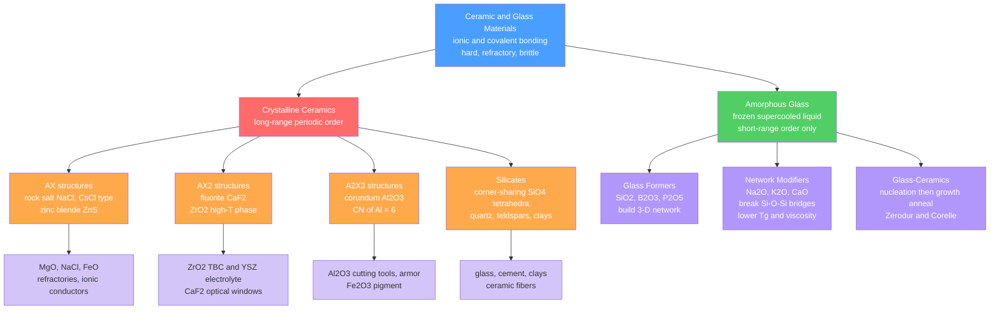

# 🏺 Ceramics and Glasses

> [!abstract] TL;DR
> Ceramics and glasses are inorganic, non-metallic solids bonded by ionic and covalent forces — hard, refractory, chemically inert, and electrically insulating, but brittle. Their brittleness is not a flaw of chemistry but of geometry: ionic/covalent crystals offer almost no operative slip systems at room temperature, so stress concentrations at microscopic flaws cause fracture rather than plastic flow. Weibull statistics quantify this flaw-controlled variability. Transformation toughening in ZrO₂ partially defeats it. The glass transition lets network-forming oxides bypass crystallization entirely — enabling tailored viscosity, near-zero expansion glass-ceramics, and piezoelectric perovskites that power modern sensors and turbines.

---

## Intuition

**Analogy:** Pick up a coffee mug. It withstands your morning grip, survives the dishwasher, shrugs off dilute acid — extraordinary chemical resilience. Then nudge it off the counter. It hits the floor and shatters instantly, not because it was weak everywhere, but because it had one tiny, invisible scratch that concentrated the impact stress a thousand-fold, and the ceramic had no way to blunt it.

A metal mug dents. The ceramic mug cannot: it has no dislocations ready to glide and redistribute the load around the crack tip. Every microscopic surface scratch is a potential catapult, turning a small flaw in an otherwise perfect structure into the point that breaks everything. This is the defining physics of ceramics and glasses — exceptional strength-per-bond, catastrophic sensitivity to flaws.

---

## How It Works

### Core Mechanics

**Bond type controls slip availability.** Ceramic bonding is ionic (MgO, Al₂O₃) or mixed ionic-covalent (Si₃N₄, SiC). In an ionic crystal, a dislocation moving on a slip plane would bring like-charged ions into nearest-neighbour contact — Na⁺ next to Na⁺ in NaCl — creating a massive electrostatic penalty. Covalent ceramics (SiC, Si₃N₄) have directed bonds that must rupture completely for any dislocation motion; the Peierls-Nabarro barrier is orders of magnitude higher than in FCC metals (see [[Defects_and_Dislocations_in_Crystals]] for the full Peierls stress formula). The practical result below ~1000°C: ceramics are almost perfectly elastic until they fracture.

**Griffith crack criterion.** A real ceramic part contains microscopic cracks — scratches from grinding, grain-boundary pores from incomplete sintering, inclusions — with half-lengths $a \sim 1$–100 μm. The Griffith energy-balance criterion for the critical stress to propagate such a flaw is:

$$\sigma_f = \sqrt{\frac{2E\gamma_s}{\pi a}}$$

where $E$ is Young's modulus and $\gamma_s$ is the surface energy of the newly created crack faces. The theoretical cohesive strength is $\sim E/10$; actual ceramics fracture at $\sim E/1000$. A $a = 100$ μm surface crack in alumina ($E = 380$ GPa, $\gamma_s \approx 1$ J/m²) gives $\sigma_f \approx 49$ MPa — consistent with handbook values — while the theoretical limit is ~38 GPa. The thousand-fold gap is entirely explained by pre-existing flaws, not weak bonds.

---

### Flow / Architecture



---

## Key Concepts / Details

### Secondary Level

**Ceramic crystal structures — filling the right holes.** All ceramic crystal structures can be understood as a close-packed anion array with cations placed into available holes, governed by the radius-ratio rule $r_+/r_-$ (see [[Solid_State_and_Crystal_Structures]] for derivation):

| Structure type | Prototype | Cation site | CN(+/−) | Radius ratio range |
|---|---|---|---|---|
| Rock salt (AX) | NaCl, MgO, FeO | Octahedral holes in FCC | 6 / 6 | 0.414–0.732 |
| Cesium chloride (AX) | CsCl, CsBr | Body-center of simple cubic | 8 / 8 | > 0.732 |
| Zinc blende (AX) | ZnS, β-SiC | Half of tetrahedral holes in FCC | 4 / 4 | 0.225–0.414 |
| Fluorite (AX₂) | CaF₂, UO₂, ZrO₂ | All tetrahedral holes in FCC Ca lattice | 8 / 4 | > 0.732 |
| Corundum (A₂X₃) | Al₂O₃, Fe₂O₃, Cr₂O₃ | 2/3 of octahedral holes in HCP | 6 / 4 | 0.414–0.732 |

**Why ceramics shatter.** Metals deform plastically because dislocations glide on close-packed planes; FCC metals have 12 independent slip systems. Ionic ceramics like NaCl have some slip on $\{110\}\langle 1\bar{1}0\rangle$, but glide immediately brings like-charge planes into contact — the electrostatic penalty stops the dislocation. Covalent ceramics (SiC, Si₃N₄) have directional bonds that must be ruptured for any slip, requiring far more energy than the thermal energy available at room temperature. The practical result: below ~1000°C, ceramics have essentially zero plasticity. When a stress concentration builds at a crack, there is nothing to blunt it — the crack propagates.

**Silicate structures — nature's ceramics.** The silica tetrahedron $[\mathrm{SiO_4}]^{4-}$ is the universal building unit, shared with geological mineralogy (see [[Silicate_Minerals]]). Sharing 0, 2, 3, or all 4 corners creates a ladder of polymerization from isolated orthosilicates ($[\mathrm{SiO_4}]^{4-}$, as in forsterite Mg₂SiO₄) through chains, sheets, and up to the fully three-dimensional framework of quartz ($\mathrm{SiO_2}$). Feldspars (KAlSi₃O₈, NaAlSi₃O₈, CaAl₂Si₂O₈) are framework silicates with Al³⁺ substituting for Si⁴⁺ in some tetrahedral sites, requiring K⁺, Na⁺, or Ca²⁺ for charge balance — the most abundant minerals in Earth's crust and the basis of clay-forming weathering products.

**What is glass?** Glass is a solid with amorphous (non-crystalline) structure — it cooled too fast from the melt to nucleate and grow crystals. Structurally, it retains the short-range order of SiO₄ tetrahedra linked at corners, but lacks the long-range periodicity of quartz. All properties vary continuously with temperature: there is no sharp melting point, only a gradual **glass transition** at $T_g$ where the viscosity exceeds ~$10^{12}$ Pa·s and the material behaves as a rigid solid on practical timescales.

---

### Undergraduate Level

**Viscosity and the glass-working window.** The viscosity of a silicate glass follows an Arrhenius-like relationship, more precisely described by the Vogel-Tammann-Fulcher (VTF) equation:

$$\eta = A\exp\!\left(\frac{B}{T - T_0}\right)$$

For practical engineering purposes, the working window is characterised by reference viscosities:

| Reference point | Viscosity (Pa·s) | Approx. T for soda-lime (°C) | Significance |
|---|---|---|---|
| Melting | $\sim 10^{1}$ | ~1600 | Batch melting, homogenisation |
| Working point | $\sim 10^{3}$ | ~1050 | Glass blowing, pressing |
| Softening point | $\sim 4\times10^{6}$ | ~727 | Upper limit for forming |
| Annealing point | $\sim 10^{12}$ | ~545 | Stress relief, practical $T_g$ |
| Strain point | $\sim 10^{13.5}$ | ~516 | Lower limit of stress relief |

Adding network **modifiers** (Na₂O, K₂O, CaO) breaks Si–O–Si bridges and creates **non-bridging oxygens** (NBOs), reducing viscosity and $T_g$ dramatically. Soda-lime glass (SiO₂ + Na₂O + CaO) has $T_g \approx 520°\text{C}$; pure vitreous silica has $T_g \approx 1200°\text{C}$. The same NBO/T polymerization logic from [[Silicate_Minerals]] applies directly to glass melts.

**Zachariasen's rules for glass formation.** For an oxide to form a glass: (1) each oxygen is shared between at most 2 cation polyhedra; (2) the cation coordination number is 3 or 4; (3) polyhedra share corners only, not edges or faces; (4) at least 3 corners of each polyhedron are shared, enabling a continuous network. This explains why SiO₂ (4-fold tetrahedral network), B₂O₃ (trigonal/tetrahedral mixed network), and P₂O₅ are glass formers, while MgO (CN = 6, too ionic) is not. Al₂O₃ is an **intermediate**: it needs modifiers (Na₂O) present to enter the network as charge-balanced [AlO₄]⁵⁻ tetrahedra; without them it disrupts the network.

**Weibull statistics — the engineering language of ceramic reliability.** A ceramic's failure stress is controlled by its worst flaw, not an average property. Strength data therefore follow a Weibull (extreme-value) distribution rather than Gaussian. The two-parameter Weibull cumulative probability of failure is:

$$P_f = 1 - \exp\!\left[-\left(\frac{\sigma}{\sigma_0}\right)^m\right]$$

where $\sigma_0$ is the **characteristic strength** (at which $P_f = 1 - e^{-1} \approx 63.2\%$) and $m$ is the **Weibull modulus**. A high $m$ (say, 20+) means a narrow flaw-size distribution — every specimen fails at nearly the same stress, consistent with fine powder processing and tight machining quality. A low $m$ (say, 5) means high scatter — some specimens fail at a third of the mean strength, forcing very conservative designs. Typical engineering ceramics have $m = 5$–20; advanced turbine-grade Si₃N₄ can reach $m \approx 18$–22; structural steel has $m \approx 50$–100 (effectively deterministic).

Taking the double logarithm linearises the Weibull equation for parameter fitting:

$$\ln\!\left[-\ln(1 - P_f)\right] = m\ln\sigma - m\ln\sigma_0$$

Plotting $\ln[-\ln(1-P_f)]$ vs $\ln\sigma$ (Weibull probability paper) gives a straight line with slope $m$, determined experimentally from $N \geq 20$ specimens loaded to failure.

**Important engineering ceramics.**

| Ceramic | Crystal structure | Key property | Application |
|---|---|---|---|
| Al₂O₃ (alumina) | Corundum, A₂X₃ | Mohs 9, $K_{IC}$ ~3–4 MPa·m^½, chemically inert | Cutting tools, hip implants, body armor |
| ZrO₂ (zirconia) | Fluorite, AX₂ | Transformation toughening, $K_{IC}$ ~10–15 MPa·m^½ | TBC on turbine blades, dental crowns, YSZ electrolyte |
| SiC | Zinc blende / wurtzite | Extreme hardness, high thermal conductivity, chemical inertness | Abrasives, SiC armor tiles, power semiconductors |
| Si₃N₄ | Hexagonal covalent | Low CTE (~3×10⁻⁶ K⁻¹), excellent thermal shock resistance | Cutting tools for cast iron, turbocharger rotors |
| TiO₂ (titania, rutile) | Rutile, AX₂ | Photocatalysis, bandgap ~3.0–3.2 eV (anatase) | Self-cleaning glass, sunscreen, pigments |
| BaTiO₃ | Perovskite, ABO₃ | Ferroelectric below $T_C \approx 120°C$, large piezo response | Capacitors, ultrasound transducers, PTC thermistors |

---

### Graduate Level

**Transformation toughening in ZrO₂.** Pure ZrO₂ undergoes a martensitic (diffusionless) phase sequence: monoclinic (room temperature) $\rightarrow$ tetragonal (~1170°C) $\rightarrow$ cubic (~2370°C). The tetragonal-to-monoclinic ($t \to m$) transformation involves ~4% volume expansion and ~7° shear — fast enough to shatter a piece on cooling. Adding Y₂O₃ (2–3 mol%, **TZP** — tetragonal zirconia polycrystal) retards the transformation by chemically stabilising the tetragonal phase metastably at room temperature. When a crack propagates through TZP, the stress field at the crack tip triggers the $t \to m$ transformation in a process zone of radius $r_p$. The ~4% expansion puts the crack faces in compression, imposing a **crack-closure stress intensity**:

$$\Delta K_{tip} \approx -0.22\, E\, \varepsilon_T \left(\frac{V_f\, r_p}{2\pi}\right)^{1/2}$$

where $\varepsilon_T \approx 0.04$ is the transformation strain and $V_f$ is the volume fraction of transformable particles. TZP achieves $K_{IC} \approx 10$–15 MPa·m^½ — roughly five times undoped Al₂O₃ and approaching some aluminium alloys. However, the mechanism is temperature-limited: above ~500°C the tetragonal phase becomes thermodynamically stable without stress, the process zone vanishes, and toughening disappears. This rules out TZP for high-temperature structural applications even though it excels at ambient conditions.

**Glass-ceramics and controlled crystallisation (Pyroceram, Zerodur, Corelle).** Glass-ceramics are produced by deliberately crystallising a glass in two controlled heat-treatment stages:

1. **Nucleation anneal** at $T_n$ (just above $T_g$): a nucleating agent (TiO₂, ZrO₂, or P₂O₅, added at 2–5 wt%) forms nano-sized crystal embryos (~10 nm), typically a metastable phase that acts as a template for the target crystalline phase.
2. **Crystallisation anneal** at $T_c > T_n$: embryos grow into 0.1–1 μm crystals, consuming essentially all of the glass matrix in the best products.

The number density of nuclei is so high (~10¹⁵/m³) that the resulting grain size is far smaller than in a conventionally sintered ceramic — below the critical flaw size for Griffith fracture. By choosing the crystal phase, the coefficient of thermal expansion (CTE) is engineered to near zero:

- **Zerodur** (Schott): the high-quartz solid-solution phase has a negative CTE that is balanced against residual glass to give $\alpha \approx 0 \pm 0.007 \times 10^{-6}$ K⁻¹ at 0–50°C. Keck, VLT, and ESO telescope mirror blanks achieve sub-nanometre dimensional stability over diurnal temperature swings.
- **Corelle / CorningWare**: Li₂O–Al₂O₃–SiO₂ (LAS) glass-ceramics whose primary phase (β-spodumene or β-eucryptite) has near-zero CTE, giving thermal-shock resistance sufficient to transfer directly from freezer to oven.

**Sintering — from pressed powder to dense solid.** Most ceramic components are fabricated by pressing a powder compact and firing. The thermodynamic driving force is reduction of total surface energy (surface area × $\gamma_s$). Three stages of sintering:

1. **Initial stage** (density 50% → 65%): neck formation at particle contacts by surface diffusion and grain-boundary diffusion. Little shrinkage; interconnected pore network.
2. **Intermediate stage** (65% → 92%): pore channels pinch off at grain junctions; most macroscopic shrinkage occurs here; density rises steeply.
3. **Final stage** (92% → 99.5%): isolated, roughly spherical pores coarsen and shrink by grain-boundary and lattice diffusion; rate slows as surface area diminishes.

**Liquid-phase sintering** adds a small amount (1–5 wt%) of a second oxide (e.g., MgO in Al₂O₃, or Y₂O₃ + Al₂O₃ in Si₃N₄) that forms a liquid at sintering temperature. Capillary pressure of the liquid draws particles together, provides fast diffusion paths, and achieves >99% density at temperatures 100–200°C below solid-state sintering. The liquid solidifies on cooling to a thin intergranular glassy phase — often the life-limiting element at high temperature (glass softens, enabling creep).

**Spark plasma sintering (SPS).** Pulsed DC current (5–20 kA) is passed through a conducting graphite die and powder compact simultaneously. Joule heating at inter-particle contacts, combined with uniaxial pressure (20–100 MPa), densifies ceramics in minutes (vs hours) at temperatures 200–400°C lower than conventional sintering. The short dwell time suppresses grain growth, enabling nanoceramics ($d < 200$ nm) and functionally graded ceramic-metal composites that would coarsen irreversibly in a conventional furnace.

**Piezoelectricity and ferroelectricity in BaTiO₃ (perovskite).** The perovskite structure (ABO₃) places Ba²⁺ at cube corners, O²⁻ at face centres, and Ti⁴⁺ at the body centre in an octahedron of six oxygens. Above $T_C \approx 120°C$ the structure is cubic and centrosymmetric: net polarisation $\mathbf{P} = 0$. Below $T_C$ the Ti⁴⁺ ion displaces ~0.12 Å along $\langle 001\rangle$, breaking inversion symmetry and generating a spontaneous polarisation $P_s \approx 0.26$ C/m². Electric-field poling of a polycrystalline ceramic aligns ferroelectric domains; the remnant piezoelectric coefficient $d_{33} \approx 200$–600 pC/N (depending on PZT composition) underpins ultrasonic transducers, inkjet actuators, MEMS resonators, and energy harvesters.

---

## Python Demo

```python
import numpy as np
import matplotlib.pyplot as plt

# Weibull probability of failure for ceramics
# P_f = 1 - exp(-(sigma / sigma_0)^m)
# sigma_0 : characteristic strength (P_f = 63.2% when sigma = sigma_0)
# m       : Weibull modulus  --  higher m means tighter scatter and more consistent ceramic

sigma_0 = 400.0                        # MPa, characteristic strength (same for all three)
sigma   = np.linspace(0, 800, 1200)   # MPa, range of applied stresses

weibull_cases = [
    ( 5, "m = 5   (coarse powder, variable flaw population)", "firebrick"),
    (10, "m = 10  (typical engineering ceramic)",             "steelblue"),
    (20, "m = 20  (hot-pressed Si3N4, fine quality control)", "seagreen"),
]

fig, axes = plt.subplots(1, 2, figsize=(12, 5))

for m, label, color in weibull_cases:
    Pf = 1.0 - np.exp(-(sigma / sigma_0) ** m)
    axes[0].plot(sigma, Pf, lw=2.2, color=color, label=label)

    # Weibull probability paper:  ln(-ln(1-Pf)) vs ln(sigma)  is a straight line
    # slope = m,  x-intercept at ln(sigma_0)
    mask = (Pf > 0.005) & (Pf < 0.995)
    y_wp = np.log(-np.log(1.0 - Pf[mask]))
    x_wp = np.log(sigma[mask])
    axes[1].plot(x_wp, y_wp, lw=2.2, color=color, label=f"m = {m}  (slope)")

# Left panel
axes[0].axvline(sigma_0, ls="--", color="gray", lw=1.3, alpha=0.7,
                label=f"sigma_0 = {sigma_0:.0f} MPa")
axes[0].axhline(1.0 - np.exp(-1.0), ls=":", color="gray", lw=1.3, alpha=0.6,
                label="P_f = 63.2%  at sigma_0")
axes[0].set_xlabel("Applied stress  sigma  (MPa)", fontsize=11)
axes[0].set_ylabel("Probability of failure  P_f", fontsize=11)
axes[0].set_title("Weibull Failure Probability vs Stress\n"
                  "(all three share sigma_0 = 400 MPa)", fontsize=10)
axes[0].legend(loc="upper left", fontsize=8.5)
axes[0].set_ylim(-0.02, 1.05)
axes[0].set_xlim(0, 800)
axes[0].grid(True, alpha=0.3)

# Right panel
axes[1].set_xlabel("ln(sigma)", fontsize=11)
axes[1].set_ylabel("ln( -ln(1 - P_f) )", fontsize=11)
axes[1].set_title("Weibull Probability Paper\n"
                  "Slope of each line = Weibull modulus m", fontsize=10)
axes[1].legend(fontsize=8.5)
axes[1].grid(True, alpha=0.3)

plt.tight_layout()
plt.savefig("weibull_ceramics.png", dpi=130)
plt.show()

# Print design stress table: stress corresponding to key failure probabilities
print(f"\nDesign stress table  (sigma_0 = {sigma_0:.0f} MPa)")
print(f"{'m':>5s}  {'P_f = 1%':>10s}  {'P_f = 10%':>10s}  {'P_f = 50%':>10s}  MPa")
for m, _, _ in weibull_cases:
    # Invert Weibull CDF: sigma = sigma_0 * (-ln(1 - P_f))^(1/m)
    vals = [sigma_0 * (-np.log(1.0 - p)) ** (1.0 / m) for p in [0.01, 0.10, 0.50]]
    print(f"{m:>5d}  {vals[0]:>10.1f}  {vals[1]:>10.1f}  {vals[2]:>10.1f}")

# Expected output (approximate):
# m      P_f = 1%  P_f = 10%  P_f = 50%  MPa
#  5        166.5      238.1      371.8
# 10        257.9      308.4      384.8
# 20        320.3      352.1      392.3
#
# Interpretation: for m = 5, the 1% design stress is only 42% of the median.
# For m = 20, it is 82% of the median -- a much more efficient structural use.
```

---

## Real-World Applications

> **Yttria-stabilised zirconia (YSZ) thermal barrier coatings in jet turbines.** Rolls-Royce and GE apply 100–200 μm YSZ coatings on Ni superalloy turbine blades by electron-beam physical vapour deposition. YSZ's thermal conductivity (~2.2 W/m·K) is 30× lower than the Ni alloy beneath it, dropping the blade-surface temperature by ~100–150°C. This allows turbine inlet temperatures beyond 1600°C — above the alloy's melting point — while the metal itself stays cool. The metastable tetragonal phase in 7 wt% YSZ resists spallation cracking through the same transformation-toughening mechanism used in dental ZrO₂ crowns.

> **Corelle dinnerware.** The thin, translucent plates that seem indestructible (and occasionally shatter explosively on impact) are a LAS glass-ceramic. The fine-grained β-spodumene crystal phase has near-zero CTE; thermal gradients from sudden temperature changes cannot build large stresses because the plate barely expands. The very thin walls (~1.5 mm vs ~5 mm for porcelain) exploit the Griffith scaling: critical flaw size scales with section thickness, so a thinner section statistically contains fewer large cracks and is actually stronger per unit area.

> **Medical-grade alumina in total hip replacements.** High-purity Al₂O₃ ($> 99.9\%$, grain size $< 1.5$ μm) ceramic femoral heads and acetabular cups produce wear debris at ~0.01 mm³/million cycles vs ~1 mm³ for ultra-high molecular weight polyethylene — a 100× improvement. Weibull modulus $m \approx 14$–20 for medical alumina enables statistical **proof-testing**: every implant component is loaded to 1.5× the clinical design load before implantation, eliminating the left tail of the flaw-size distribution and guaranteeing a minimum in-service strength.

> **TiO₂ photocatalysis in self-cleaning glass.** Pilkington Activ glass carries a ~15 nm anatase TiO₂ coating deposited by atmospheric-pressure chemical vapour deposition. Anatase's bandgap of ~3.2 eV absorbs UV light ($\lambda < 388$ nm), generating electron–hole pairs. Holes oxidise adsorbed organics via ·OH radicals (photocatalytic decomposition of dirt); simultaneously, UV irradiation makes TiO₂ superhydrophilic so rain sheets off uniformly rather than forming droplets, washing away debris — the coating both breaks down and rinses organic contamination with no maintenance.

---

## Common Pitfalls

- **Assuming high hardness means high toughness** — hardness (resistance to plastic indentation) and fracture toughness $K_{IC}$ (resistance to crack propagation) are independent properties. Alumina is Mohs 9 but $K_{IC} \approx 4$ MPa·m^½; annealed steel is Mohs ~5–6 but $K_{IC} \approx 50$–150 MPa·m^½. Ceramics fail this comparison by one to two orders of magnitude.

- **Using the mean strength as the design value** — Weibull scatter means the 1% failure-probability stress can be 30–60% below the mean for low-$m$ ceramics. Always design to a $P_f$ percentile (typically $P_f = 10^{-3}$ for structural use) derived from a Weibull fit to statistically adequate specimen data ($N \geq 20$), never the sample mean.

- **Confusing glass transition with melting** — $T_g$ is not a first-order phase transition: it has no latent heat, it shifts with cooling rate (faster cooling → higher apparent $T_g$), and it is reversible. There is no crystalline-to-amorphous transition at $T_g$. Calling glass "amorphous solid" is correct; characterising it as "supercooled liquid" is technically accurate on geological timescales but viscosity at room temperature ($\sim 10^{19}$–$10^{21}$ Pa·s) makes it immovable on any engineering timescale. The old myth that medieval window glass is thicker at the bottom because it has flowed is false.

- **Confusing the corundum vs fluorite stoichiometries** — Al₂O₃ is **A₂X₃** (corundum, CN(Al) = 6, occupies 2/3 of octahedral sites in HCP O²⁻). ZrO₂ is **AX₂** (fluorite, CN(Zr) = 8, sits in all tetrahedral sites of an FCC Zr lattice with F in all tetrahedral positions). Mixing these up leads to wrong radius-ratio predictions and wrong defect calculations.

- **Treating all glass modifiers as equivalent** — Na₂O lowers viscosity and $T_g$ more per mole than K₂O or CaO because Na⁺ (small, high field strength) disrupts the network more effectively. CaO simultaneously acts as a network restorer in some contexts, improving chemical durability. Standard soda-lime glass (SiO₂–Na₂O–CaO) requires all three to achieve a workable viscosity window and chemical durability.

- **Confusing Y-TZP (structural) with YSZ (ionic conductor)** — Tetragonal zirconia polycrystal (2–3 mol% Y₂O₃, TZP) retains the metastable tetragonal phase at room temperature; stress-induced transformation toughening operates. Fully stabilised YSZ (7–8 wt% or ~8 mol% Y₂O₃) is cubic at all temperatures: no phase transformation, no toughening, but maximum oxygen-vacancy concentration for ionic conductivity — used as the solid electrolyte in solid-oxide fuel cells. Using TZP formulation in a fuel cell or YSZ formulation in a structural component is a major design error.

---

## Related Concepts

- [[Crystal_Systems_and_Space_Groups]] — the Bravais lattice framework within which all AX, AX₂, and A₂X₃ ceramic structures sit; space group specifies which hole fraction is occupied
- [[Chemical_Bonding_in_Solids]] — ionic and covalent bonding types that determine the large Peierls stress, brittleness, wide bandgap, and high melting points of ceramics
- [[Defects_and_Dislocations_in_Crystals]] — high Peierls stress in ceramics vs metals explained; Frenkel/Schottky defect equilibria in ionic ceramics like NaCl, MgO, and ZrO₂
- [[Stress_Strain_and_Elastic_Moduli]] — Young's modulus $E$ enters the Griffith equation; ceramics sit at the stiff, low-toughness corner of Ashby material property charts
- [[Plastic_Deformation_and_Slip_Systems]] — ceramics have almost no operative slip systems at room temperature, in direct contrast to FCC metals with 12 systems
- [[Composite_Materials_and_Fiber_Reinforcement]] — ceramic matrix composites (CMC, e.g. SiC/SiC) use crack bridging and fibre pull-out to add toughness by a completely different mechanism from transformation toughening
- [[Fatigue_Creep_and_High_Temperature_Failure]] — static fatigue (stress corrosion cracking) in glass, and slow crack growth in ceramics driven by reactive species at the crack tip, are the dominant time-dependent failure modes
- [[X_Ray_Diffraction_and_Braggs_Law]] — XRD is the standard method to identify ceramic phases and quantify monoclinic vs tetragonal ZrO₂ volume fractions after transformation
- [[Phonons_and_Lattice_Dynamics]] — thermal conductivity of ceramics (SiC has $\kappa \approx 120$ W/m·K; YSZ only ~2.2 W/m·K) is set by phonon–phonon and phonon–defect scattering; the basis for thermal barrier coating design
- [[Solid_State_and_Crystal_Structures]] — (Chemistry vault) rock salt, fluorite, zinc blende, and corundum structures in the ionic bonding and lattice energy (Born-Landé) context
- [[Silicate_Minerals]] — (Earth Science vault) full detail on SiO₄ polymerisation, silicate classes, quartz and feldspar framework structures — shared structural language between geological and engineering ceramics
- [[_MOC_Chemistry_Master]] — (Chemistry vault) gateway to solid-state chemistry, crystal-field theory, and oxide bonding
- [[_MOC_Earth_Science_Master]] — (Earth Science vault) gateway to mineralogy, petrology, and silicate geochemistry

---

## Review Questions

1. **Secondary:** A ceramic floor tile and a steel plate of identical dimensions are tested by dropping a steel ball from the same height onto each. The tile shatters; the plate dents. (a) Explain in terms of dislocation physics and Griffith crack mechanics why the tile cannot absorb the impact energy plastically. (b) If you halved the size of the surface scratches on the tile through better polishing (reducing $a$ from 50 μm to 12.5 μm), by what factor would you expect the failure stress to increase?

2. **Undergraduate:** You test 25 specimens of an alumina ceramic in biaxial flexure and obtain failure stresses. After rank-ordering them and assigning probability estimates $P_{f,i} = (i - 0.5)/N$, you fit the Weibull probability paper and find slope $m = 12$ with intercept at $\sigma_0 = 380$ MPa. (a) Compute the stress at which 1% of components fail. (b) A design specification calls for $P_f < 10^{-4}$ under 100 MPa working stress — does this ceramic meet the requirement? (c) The manufacturer claims switching to liquid-phase sintering raises $m$ to 18 at the same $\sigma_0$. Recompute the $P_f$ at 100 MPa and assess the improvement.

3. **Graduate:** Compare transformation toughening in Y-TZP zirconia with crack bridging in SiC fibre-reinforced SiC (SiC/SiC CMC). For each mechanism: (a) identify the microstructural scale of the toughening event; (b) sketch how $K_{tip}$ is reduced as a function of crack-opening displacement; (c) identify the temperature at which the mechanism degrades and explain the physical reason (for TZP, invoke the tetragonal-to-monoclinic free-energy difference $\Delta G_{t \to m} \approx -50\,\text{kJ/mol}$ at 25°C and zero at ~1170°C); (d) conclude which is more suitable for a 1400°C gas-turbine shroud application and justify based on the relevant thermodynamics.

---

## Sources

- [Callister, W. D. & Rethwisch, D. G. — *Materials Science and Engineering: An Introduction*, 10th ed., Chs. 12–13 (ceramic structures, properties, applications)](https://www.wiley.com/en-us/Materials+Science+and+Engineering%3A+An+Introduction%2C+10th+Edition-p-9781119405498)
- Kingery, W. D., Bowen, H. K. & Uhlmann, D. R. — *Introduction to Ceramics*, 2nd ed. (Wiley-Interscience, 1976) — the standard graduate-level ceramic science text
- Ashby, M. F. & Jones, D. R. H. — *Engineering Materials 2: An Introduction to Microstructures and Processing*, 4th ed. (Butterworth-Heinemann) — practical ceramic and glass material selection
- Green, D. J., Hannink, R. H. J. & Swain, M. V. — *Transformation Toughening of Ceramics* (CRC Press, 1989) — definitive treatment of ZrO₂ toughening mechanisms
- [Weibull analysis of ceramics and related materials: A review — *Heliyon* 10, e34309 (2024)](https://www.cell.com/heliyon/fulltext/S2405-8440(24)08526-8)
- [Mechanical Behavior and Reliability of Engineering Ceramics — *Ceramics* 9, 41 (2026)](https://www.mdpi.com/2571-6131/9/4/41)

---

#materialscience #ceramics #glasses #brittleness #weibull #silicates #sintering #glassceramics #transformationtoughening #perovskite #piezoelectric #secondary #undergraduate #graduate
