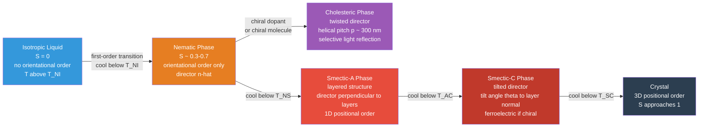

# Liquid Crystals and Colloids

> [!abstract] TL;DR
> Liquid crystals are mesophases between solid and liquid: molecules share a preferred orientation (the *director* $\hat{\mathbf{n}}$) quantified by the order parameter $S = \tfrac{1}{2}\langle 3\cos^2\theta - 1\rangle$, and their elasticity is described by three Frank constants $K_1, K_2, K_3$. Colloids are 1 nm–1 µm particles in suspension stabilized by the competition between electrostatic repulsion and van der Waals attraction captured in DLVO theory — the balance shifts with ionic strength, controlled by the Debye screening length $\kappa^{-1}$. Together they underpin LCD displays, paint, pharmaceuticals, food science, and self-assembled photonic crystals.

---

## Intuition

**Analogy:** Picture a crowd streaming out of a stadium. Halfway down the exit ramp, everyone is still walking in roughly the same direction — that is *orientational* order — but there are no assigned seats, no rows, no grid: *positional* order is absent. This is a nematic liquid crystal. Now imagine each person has an electrostatic force-field that keeps others at arm's length: that personal-space force is the electrostatic repulsion that stabilises a colloid. Add enough salt to the crowd (high ionic strength) and the force-fields are screened, everyone crowds together, and the suspension aggregates.

The key insight common to both systems is that **thermal energy $kT$ and intermolecular forces compete at the same scale** — roughly $10^{-21}$ J. This competition produces mesophases and colloidal crystals that sit between the fully ordered solid and the fully random fluid, with structure that can be switched by electric fields, temperature, or salt concentration.

---

## How It Works

### Core Mechanics

**Liquid crystal phases** arise in anisotropic molecules (rods or discs) when temperature places them between the melting point and the isotropic clearing point. Three main mesophases are distinguished by how much order they carry:

| Phase | Orientational order | Positional order | Example molecule |
|---|---|---|---|
| Nematic | Yes (1D: director $\hat{\mathbf{n}}$) | None | 5CB, MBBA |
| Cholesteric | Yes (helical twist of $\hat{\mathbf{n}}$) | None | cholesteryl benzoate |
| Smectic-A | Yes ($\hat{\mathbf{n}}$ normal to layers) | 1D (layer spacing $d$) | 8CB |
| Smectic-C | Yes ($\hat{\mathbf{n}}$ tilted by angle $\theta$ to layers) | 1D | DOBAMBC |
| Crystal | Yes | 3D | — |

**Colloids** are dispersions of particles in the 1 nm–1 µm size range. At this scale, gravity is negligible compared to $kT$ (sedimentation time for a 100 nm particle in water is months), and Brownian motion keeps particles in perpetual random walk described by the Stokes–Einstein diffusion coefficient

$$D = \frac{k_B T}{6\pi\eta r}$$

where $\eta$ is the solvent viscosity and $r$ the particle radius. Stability against aggregation depends on whether the total interparticle potential $V(h)$ has a barrier large enough to prevent close approach.

### Flow / Architecture



---

## Key Concepts

### Secondary Level

#### What is a Liquid Crystal?

A liquid crystal flows like a liquid but scatters light like a crystal, because its rod-shaped molecules spontaneously align along a common axis — the **director** $\hat{\mathbf{n}}$. If you pour a nematic between two glass plates and look at it under crossed polarisers, you see beautiful coloured textures (Schlieren textures) that change when you apply a voltage. This is the heart of every LCD screen.

The three main phases are:
- **Nematic** — molecules point the same way but wander freely; the fluid you find in most LCDs
- **Smectic** — molecules stack into layers in addition to aligning; thicker, like soap
- **Cholesteric** — a nematic with a built-in helical twist; reflects specific colours of light and produces the iridescence seen in beetle shells and butterfly wings

#### What is a Colloid?

A colloid is a suspension of tiny particles — too large to be molecules, too small to settle quickly under gravity. Milk (fat droplets in water), blood (red cells in plasma), paint (pigment in binder), and fog (water droplets in air) are all colloids. The particles stay suspended partly because Brownian motion keeps them moving and partly because electrostatic charges on their surfaces push them apart.

---

### Undergraduate Level

#### Order Parameter and the Nematic–Isotropic Transition

The degree of orientational order in a nematic is captured by the **scalar order parameter**

$$S = \frac{1}{2}\langle 3\cos^2\theta - 1\rangle$$

where $\theta$ is the angle between a molecule's long axis and the director $\hat{\mathbf{n}}$, and $\langle\cdots\rangle$ denotes a thermal average. Limits:
- $S = 1$: perfect alignment (crystal)
- $S = 0$: isotropic liquid (random)
- $S \approx 0.4$–$0.7$: typical nematic at room temperature

The **nematic–isotropic (N–I) transition** at $T_{NI}$ is **first-order**: $S$ jumps discontinuously from $\sim 0.3$ to $0$ at the clearing point with a measurable latent heat (~1–5 kJ/mol). Landau–de Gennes theory expands the free energy in powers of $S$:

$$F = F_0 + \tfrac{1}{2}a(T - T^*)S^2 - \tfrac{1}{3}bS^3 + \tfrac{1}{4}cS^4 + \cdots$$

The cubic term $-\tfrac{1}{3}bS^3$ (allowed because $S$ is not a vector; the symmetry only forbids odd *vector* terms) is what forces the transition to be first-order. The equilibrium value $S_{eq}$ jumps from $2b/3c$ just below $T_{NI}$ to zero above it.

#### Frank Elastic Energy

Distortions of the director field $\hat{\mathbf{n}}(\mathbf{r})$ cost elastic energy. There are three independent distortion modes, each characterised by an elastic constant:

$$f_{el} = \tfrac{1}{2}K_1(\nabla\cdot\hat{\mathbf{n}})^2 + \tfrac{1}{2}K_2(\hat{\mathbf{n}}\cdot\nabla\times\hat{\mathbf{n}})^2 + \tfrac{1}{2}K_3|\hat{\mathbf{n}}\times(\nabla\times\hat{\mathbf{n}})|^2$$

| Term | Mode | Physical picture | Typical value |
|---|---|---|---|
| $K_1$ | Splay | Directors fan outward from a point (like radii of a circle) | 5–10 pN |
| $K_2$ | Twist | Directors rotate helically along the director axis | 3–6 pN |
| $K_3$ | Bend | Directors curve into arcs | 6–20 pN |

For 5CB (the most studied nematic): $K_1 = 6.2$ pN, $K_2 = 3.5$ pN, $K_3 = 8.2$ pN. The one-constant approximation $K_1 = K_2 = K_3 = K$ is often used for estimates.

#### Freedericksz Transition and LCD Operation

In a liquid crystal cell of thickness $d$, a planar-aligned nematic resists reorientation by an applied electric field. Below the **Freedericksz threshold voltage**

$$V_F = \pi\sqrt{\frac{K_1}{\varepsilon_0\,\Delta\varepsilon}}$$

the director remains undistorted. Above $V_F$, it gradually tilts toward the field. Because $V_F$ is **independent of cell thickness** $d$ (only the ratio $K_1/\varepsilon_0\Delta\varepsilon$ matters), cell-thickness tolerances do not affect the switching threshold — a crucial manufacturing advantage. Typical values: $V_F \approx 1$–$2$ V for $K_1 \approx 6$ pN and $\Delta\varepsilon \approx 5$.

**Twisted nematic (TN) LCD operation:**
1. Without voltage: director twists 90° from front to back plate. Polarised light follows the director twist (Mauguin waveguide condition $d\,\Delta n \gg \lambda$) and emerges rotated 90° — passes through the rear analyser (normallywhite mode).
2. With voltage $V > V_F$: director aligns with field (perpendicular to substrates). Light polarisation is not rotated; rear analyser blocks it — the pixel is dark.

**IPS (in-plane switching)** places both electrodes on the same substrate, generating a lateral field. The director rotates in the plane of the cell, preserving the cell birefringence at oblique viewing angles and eliminating the grey-level inversion seen in TN panels. Twist ($K_2$) and splay ($K_1$) constants govern IPS switching, whereas bend ($K_3$) dominates standard TN edge-field switching.

**OLED comparison:** Organic LEDs do not use liquid crystals at all; each pixel emits light directly. They achieve higher contrast ratios and faster switching but require encapsulation against moisture and have finite organic-layer lifetimes not present in inorganic LC cells.

#### DLVO Theory: Colloidal Stability

**Derjaguin–Landau–Verwey–Overbeek (DLVO) theory** treats the total interaction potential between two colloidal particles as the sum of electrostatic repulsion and van der Waals attraction:

$$V_{total}(h) = V_{elec}(h) + V_{vdW}(h)$$

**Electrostatic repulsion** (Derjaguin approximation, constant potential, spheres of radius $r$):

$$V_{elec}(h) = 2\pi\varepsilon_0\varepsilon_r\, r\,\psi_0^2\,e^{-\kappa h}$$

where $h$ is the surface-to-surface separation and $\psi_0$ is the surface potential (approximated by the zeta potential $\zeta$ for thin double layers). The electrostatic term is long-range at low ionic strength and decays on the **Debye screening length**

$$\kappa^{-1} = \sqrt{\frac{\varepsilon_0\varepsilon_r k_B T}{2n_0 z^2 e^2}}$$

For a 1:1 electrolyte (e.g., NaCl) at 25 °C: $\kappa^{-1}\,[\text{nm}] \approx 0.304/\sqrt{c\,[\text{mol/L}]}$. Adding 100 mM NaCl collapses $\kappa^{-1}$ from ~10 nm to ~1 nm, devastating the repulsion.

**Van der Waals attraction** (Derjaguin approximation, non-retarded):

$$V_{vdW}(h) = -\frac{A_{132}\,r}{12\,h}$$

where $A_{132}$ is the **Hamaker constant** for material 1 interacting across medium 3 with particle 2 (typically $10^{-21}$–$10^{-19}$ J). For silica in water: $A \approx 1$–$3 \times 10^{-20}$ J. The VdW potential diverges as $h^{-1}$ for sphere–sphere (Derjaguin) and as $h^{-2}$ for flat plates.

**DLVO potential landscape** typically shows three features:
- **Primary maximum** (energy barrier): height $V_{max}/k_BT$ controls aggregation rate. If $V_{max} > 20\,k_BT$ the colloid is kinetically stable; if $V_{max} < 5\,k_BT$ aggregation is fast.
- **Secondary minimum** at $h \sim 10$–$30$ nm: shallow well (few $k_BT$) causing reversible flocculation (easily redispersed by shaking).
- **Primary minimum** at $h < 1$ nm: deep irreversible well; coagulation/aggregation.

#### Zeta Potential and Stability Criteria

The **zeta potential $\zeta$** is the electric potential at the shear plane of the diffuse double layer, typically 0.5–2 nm from the surface. It is measured experimentally by electrophoresis ($\mu = \zeta\varepsilon_0\varepsilon_r / \eta$, Smoluchowski limit for $\kappa r \gg 1$) and serves as a practical proxy for $\psi_0$. Empirical stability criteria:

| $|\zeta|$ | Colloidal behaviour |
|---|---|
| $> 60$ mV | Excellent stability (strong repulsion) |
| $> 30$ mV | Good stability (standard threshold) |
| 10–30 mV | Marginal stability, onset of agglomeration |
| $< 10$ mV | Rapid coagulation |

The 30 mV threshold is the most commonly cited criterion in industrial formulation.

---

### Graduate Level

#### Maier–Saupe Theory

The molecular mean-field theory of Maier and Saupe (1958) models each nematic molecule as interacting with a mean orientational field generated by all its neighbours:

$$U_i = -u\,S\,P_2(\cos\theta_i), \qquad u = u_0/V^2$$

where $u$ is the mean-field coupling constant (inversely proportional to the square of molar volume $V$, capturing dispersive interactions). Self-consistency requires

$$S = \frac{\int_0^\pi P_2(\cos\theta)\exp\!\left(\frac{u S}{k_B T}P_2(\cos\theta)\right)\sin\theta\,d\theta}{\int_0^\pi \exp\!\left(\frac{u S}{k_B T}P_2(\cos\theta)\right)\sin\theta\,d\theta}$$

This self-consistency equation always has the solution $S = 0$ (isotropic) and, below $T_{NI}$, also has a nematic solution with $S \approx 0.43$ at the transition. The Maier–Saupe transition temperature is $k_BT_{NI} = 0.2202\,u$, and the theory correctly predicts the weakly first-order character of the N–I transition. However, it overestimates the discontinuity in $S$ at $T_{NI}$ (predicting 0.43 vs. experimental 0.28–0.35) because it ignores short-range positional correlations.

#### Defects in Nematics

Because the director field lives on a sphere $S^2$ modulo $\hat{\mathbf{n}} \equiv -\hat{\mathbf{n}}$ (the projective plane $\mathbb{RP}^2$), nematic textures support topological defects with half-integer charge $s = \pm 1/2$ (disclinations) as well as integer-charged defects. The Frank energy cost of an isolated disclination line of charge $s$ per unit length is

$$F/L = \pi K s^2 \ln(R/r_c)$$

where $R$ is the sample size and $r_c$ is the core radius (~10 nm). Half-integer defects ($s = \pm 1/2$) cost one quarter the energy of integer defects — explaining why the Schlieren textures of nematics show predominately 4-brush (integer) and 2-brush (half-integer) disclination pairs.

#### Hamaker Constant and Retardation

The non-retarded Hamaker constant $A_{132}$ can be estimated from the dielectric response using **Lifshitz theory**:

$$A_{132} \approx \frac{3}{4}k_BT\!\left(\frac{\varepsilon_1-\varepsilon_3}{\varepsilon_1+\varepsilon_3}\right)\!\!\left(\frac{\varepsilon_2-\varepsilon_3}{\varepsilon_2+\varepsilon_3}\right) + \frac{3h_P\nu_e}{8\sqrt{2}}\frac{(n_1^2-n_3^2)(n_2^2-n_3^2)}{(n_1^2+n_3^2)^{1/2}(n_2^2+n_3^2)^{1/2}\left[(n_1^2+n_3^2)^{1/2}+(n_2^2+n_3^2)^{1/2}\right]}$$

For large separations ($h > 100$ nm), relativistic retardation slows the electromagnetic correlation between fluctuating dipoles, reducing VdW attraction. The retarded Hamaker constant scales roughly as $A_{ret}(h) \approx A_0/(1 + 14h/\lambda_c)$ where $\lambda_c \approx 100$ nm. At separations relevant to colloidal stability (1–50 nm), retardation is minor; at $h > 50$ nm it can halve the effective Hamaker constant.

#### Colloidal Self-Assembly

When colloidal particles are monodisperse and the DLVO balance is tuned to a shallow secondary minimum, particles can crystallise into long-range periodic arrays — **colloidal crystals**. Sedimentation or electrophoretic deposition of 200–500 nm silica or polystyrene spheres yields FCC-packed opals with a photonic stop-band: Bragg reflection of visible light at wavelengths $\lambda = 2n_{eff}d_{hkl}$ produces structural colour without dye. Inverse opals (opal template infiltrated with a high-index material then etched) have full photonic band gaps exploited in waveguides and sensors.

**Pickering emulsions** trap solid particles (usually charged clays or silica) at the oil–water interface; the contact angle $\theta_c$ determines which side the particle sits on. The energy of detachment is $E = \pi r^2\gamma_{OW}(1\pm\cos\theta_c)^2$, typically hundreds of $k_BT$ — producing emulsions orders of magnitude more stable than surfactant-stabilised ones.

**Surfactant micelles** (diameter ~5 nm) form when amphiphile concentration exceeds the **critical micelle concentration (CMC)**: above the CMC, adding more surfactant does not increase monomer concentration; instead micelles nucleate spontaneously. This is a cooperative, entropically driven self-assembly — the **hydrophobic effect** — not a phase transition in the thermodynamic sense (no latent heat, no symmetry breaking), but a continuous structural reorganisation captured by a two-state model.

---

## Python Demo

```python
import numpy as np
import matplotlib.pyplot as plt

# Physical constants
k_B    = 1.381e-23    # J / K   Boltzmann constant
e_q    = 1.602e-19    # C       elementary charge
eps_0  = 8.854e-12    # F / m   permittivity of free space
N_A    = 6.022e23     # mol^-1  Avogadro

# System parameters  silica spheres in aqueous NaCl at 25 C
T      = 298.0        # K
eps_r  = 78.5         # water relative permittivity
r      = 100e-9       # m   particle radius  100 nm
psi_0  = 0.025        # V   surface potential  25 mV
A_H    = 2e-20        # J   Hamaker constant  silica in water
kT     = k_B * T      # ~4.12e-21 J

# Surface-to-surface separation  avoid singularity at h = 0
h = np.linspace(0.4e-9, 30e-9, 3000)   # 0.4 nm to 30 nm

# Ionic strengths (1:1 electrolyte, 1 mM = 1 mol/m^3)
concentrations_mM = [1.0, 10.0, 100.0]
labels  = [
    "1 mM   (kappa_inv ~ 9.6 nm)  stable",
    "10 mM  (kappa_inv ~ 3.0 nm)  marginal",
    "100 mM (kappa_inv ~ 0.96 nm) aggregation",
]
colors  = ["#2980b9", "#e67e22", "#c0392b"]

fig, ax = plt.subplots(figsize=(10, 6))

for c_mM, label, color in zip(concentrations_mM, labels, colors):
    n0    = N_A * c_mM            # number density  m^-3  (c in mol/m^3 = mM)
    kappa = np.sqrt(2.0 * n0 * e_q**2 / (eps_0 * eps_r * kT))

    # Electrostatic repulsion: Derjaguin approx, constant potential
    V_elec  = 2.0 * np.pi * eps_0 * eps_r * r * psi_0**2 * np.exp(-kappa * h)

    # van der Waals attraction: Derjaguin approx, non-retarded
    V_vdW   = -A_H * r / (12.0 * h)

    V_total = (V_elec + V_vdW) / kT    # dimensionless  units of kT

    ax.plot(h * 1e9, V_total, color=color, lw=2.2, label=label)

ax.axhline(0, color="black", lw=0.8)

# Annotate key features
ax.annotate(
    "Energy barrier ~35 kT\nkinetically stable",
    xy=(2.8, 35.0), xytext=(6.5, 50.0),
    fontsize=9, color="#2980b9",
    arrowprops=dict(arrowstyle="->", color="#2980b9", lw=1.2),
)
ax.annotate(
    "Secondary minimum ~-2 kT\nweak flocculation",
    xy=(12.5, -2.2), xytext=(17.0, -15.0),
    fontsize=9, color="#e67e22",
    arrowprops=dict(arrowstyle="->", color="#e67e22", lw=1.2),
)
ax.annotate(
    "No barrier:\nimmediate aggregation",
    xy=(2.0, -12.5), xytext=(5.5, -22.0),
    fontsize=9, color="#c0392b",
    arrowprops=dict(arrowstyle="->", color="#c0392b", lw=1.2),
)

ax.text(
    25, 58,
    "|zeta| > 30 mV\nfor stability",
    fontsize=9, ha="center",
    bbox=dict(boxstyle="round", fc="white", ec="gray"),
)

ax.set_xlim(0.0, 30.0)
ax.set_ylim(-28.0, 65.0)
ax.set_xlabel("Surface Separation  h  (nm)", fontsize=12)
ax.set_ylabel("DLVO Potential  V_total / kT", fontsize=12)
ax.set_title(
    "DLVO Colloidal Stability: Effect of Ionic Strength\n"
    "SiO2 spheres  r = 100 nm   psi_0 = 25 mV   A_H = 2e-20 J",
    fontsize=11,
)
ax.legend(fontsize=9.5, loc="upper right")
ax.grid(True, alpha=0.22)

plt.tight_layout()
plt.savefig("dlvo_colloidal_stability.png", dpi=150, bbox_inches="tight")
plt.show()
```

The plot shows three DLVO potential curves (one per ionic strength). At 1 mM the energy barrier is ~35 $k_BT$ — a thermodynamically stable colloid that will not aggregate on any practical timescale. At 10 mM the barrier shrinks to ~14 $k_BT$ and a shallow secondary minimum (~-2 $k_BT$) appears at $h \approx 12$ nm — reversible flocculation. At 100 mM the barrier disappears entirely; $V_{total}$ is negative at all separations and particles coagulate rapidly. This captures the critical coagulation concentration (CCC) phenomenon.

---

## Real-World Applications

> **LCD Displays.** Every twisted-nematic or IPS display panel uses the Freedericksz transition as its switching mechanism. A 5 µm cell filled with a positive-$\Delta\varepsilon$ nematic (e.g., E7, a eutectic mixture of cyano-biphenyls with $\Delta\varepsilon \approx 14$) switches between transparent and opaque at $V_{TN} \approx 1.2$ V. Modern IPS panels in smartphone screens and monitors achieve 178° viewing angles by keeping the director in-plane, exploiting $K_1$ and $K_2$ rather than $K_3$.

> **Cholesteric Photonic Crystals.** Cholesteric LCs with helical pitch $p \approx 400$–$700$ nm selectively reflect circularly polarised light matching the handedness of the helix at wavelength $\lambda = n_{avg}\,p$. This structural colour, requiring no dye, is the basis of cholesteric LCD (ChLCD) reflective displays used in e-readers and smart labels. The same principle explains the iridescence of peacock feathers, morpho butterfly wings, and scarab beetles.

> **Paint and Coatings.** Titanium dioxide ($r \approx 100$–$200$ nm, $A_{TiO_2/water} \approx 5 \times 10^{-20}$ J) is the dominant white pigment in paint. Achieving zeta potentials of $|\zeta| > 40$ mV through surface modification with carboxylate or phosphonate ligands is the central formulation challenge — aggregation would collapse the scattering efficiency. Pigment volume concentration (PVC) near the critical PVC (CPVC) also drives film formation mechanics that depend on colloidal packing.

> **Pharmaceutical Nanoparticles.** Drug-loaded PLGA nanoparticles (~150 nm) for intravenous delivery are stabilised at $|\zeta| \approx 35$–$50$ mV in isotonic buffer. Upon injection into blood (ionic strength ~150 mM NaCl), the Debye length collapses from ~10 nm to ~0.8 nm, annihilating the DLVO barrier — particles intended for systemic circulation are engineered with steric PEG coatings rather than purely electrostatic stabilisation to survive physiological ionic strength.

> **Colloidal Crystals and Photonic Band Gap Materials.** Monodisperse 270 nm silica spheres (Stöber synthesis) self-assemble by slow centrifugation or vertical deposition into FCC opals with a photonic stop-band at $\lambda \approx 570$ nm (green). Infiltrating the opal with silicon and removing the silica template yields an **inverse opal** with a calculated full photonic band gap at 1.5 µm — exploited in prototype optical filters and chemical sensors where analyte uptake shifts the Bragg wavelength.

---

## Common Pitfalls

- **Confusing the director $\hat{\mathbf{n}}$ with a vector** — the director has the symmetry $\hat{\mathbf{n}} \equiv -\hat{\mathbf{n}}$ (head-tail equivalent rods); it lives in projective space $\mathbb{RP}^2$, not $S^2$. This is why half-integer disclinations are topologically stable in nematics but not in ferromagnets.

- **Using $\zeta$ when you need $\psi_0$** — the zeta potential is measured at the shear plane, typically a few Ångströms outside the Stern layer, and is always smaller in magnitude than the surface potential $\psi_0$ used in DLVO. For thin double layers ($\kappa r \gg 1$) the difference is small; for $\kappa r \sim 1$ (small particles or low ionic strength) Smoluchowski's equation for electrophoretic mobility overestimates $\psi_0$ by 20–50%.

- **Forgetting that DLVO is a pairwise, mean-field theory** — it predicts only the pair potential; many-body effects (depletion, bridging, hydration forces) are not captured. Hydration repulsion between hydrophilic surfaces at $h < 3$ nm is routinely larger than both DLVO terms and stabilises concentrated dispersions that DLVO predicts should coagulate.

- **Ignoring retardation in VdW at large $h$** — at separations $h > 50$ nm, the non-retarded Hamaker formula overestimates attraction by a factor of 2–5. Retardation is critical when computing aggregation rates near the CCC or when designing colloidal structures that depend on the secondary minimum.

- **The Freedericksz threshold $V_F$ is cell-thickness independent, but the response time is not** — switching time $\tau_{on} \propto \eta d^2 / (K_1 V^2)$ and $\tau_{off} \propto \eta d^2 / K_1$, so thinner cells switch faster. Doubling cell thickness quadruples response time: a key constraint in high-refresh-rate displays.

- **Cholesteric pitch is temperature-sensitive** — because the helical pitch $p(T)$ depends on thermal expansion and orientational fluctuations, cholesteric structural colour drifts with temperature. This is exploited in liquid-crystal thermometers but must be compensated in display applications.

- **CMC is not a phase transition** — micelle formation lacks the discontinuous thermodynamic signature of a true phase transition; the CMC is a crossover region spanning roughly a decade in concentration. Treating it as a sharp threshold causes errors in partition coefficient calculations for drug solubilisation.

---

## Related Concepts

- [[Phase_Transitions_and_Critical_Phenomena]] — the nematic–isotropic transition is a weakly first-order phase transition described by Landau–de Gennes theory; the Ising and nematic universality classes share the mean-field framework but differ in order-parameter symmetry.
- [[Polarization_and_Dispersion]] — LCD operation depends entirely on the birefringence $\Delta n = n_e - n_o$ of the liquid crystal and the Mauguin waveguide condition for polarised light propagation through the twisted cell.
- [[Fluid_Statics_and_Properties]] — viscosity $\eta$ (Stokes–Einstein diffusion) and surface tension (Pickering emulsions, wettability) are the continuous-medium properties that couple to colloidal and liquid-crystal behaviour.
- [[Chemical_Thermodynamics]] — the Gibbs free energy framework underlies Maier–Saupe mean-field theory, the CMC thermodynamics of micelle formation, and the Debye–Hückel electrostatic free energy that generates the $\kappa^{-1}$ expression.
- [[Chemical_Kinetics]] — Smoluchowski coagulation kinetics quantifies how fast particles aggregate once the DLVO barrier is removed; rate constants depend exponentially on $V_{max}/k_BT$.
- [[Electrochemistry]] — the Poisson–Boltzmann equation, Debye length, and zeta potential all derive from the electrostatics of the electric double layer, the same framework as electrode–electrolyte interfaces in electrochemistry.
- [[Nanofabrication_and_Self_Assembly]] — colloidal self-assembly into opal templates and inverse opals is a key bottom-up nanofabrication route; block-copolymer microphase separation is the molecular analogue of micellar self-organisation.
- [[Nanoparticles_and_Colloidal_Systems]] — detailed treatment of nanoparticle synthesis, surface functionalisation, and quantum-confinement effects for the particles whose stability is governed by the DLVO framework described here. *(forward link — note not yet created)*
- [[Polymer_Structure_and_Glass_Transition]] — liquid-crystalline polymers (LCPs, e.g., Kevlar, PEEK) couple LC orientational order with polymer chain conformations; the glass transition of side-chain LCPs freezes the director field into a solid glassy texture. *(forward link — note not yet created)*
- [[_MOC_Polymers_Ceramics_and_Biomaterials]] — section index for polymers, biomaterials, and soft-matter topics. *(forward link — MOC not yet created)*
- [[_MOC_Physics_Master]] — condensed matter, fluid mechanics, and optics sections provide the physical foundations for liquid crystal elasticity and colloidal transport.
- [[_MOC_Chemistry_Master]] — physical chemistry sections (equilibrium, kinetics, electrochemistry) supply the molecular-level theory underlying DLVO and micelle formation.

---

## Review Questions

1. **Conceptual (secondary).** Explain in plain language why the nematic–isotropic transition is first-order rather than continuous, referencing both the order parameter symmetry and the Landau free-energy expansion. What experimental signature distinguishes it from a continuous transition?

2. **Scenario (undergraduate).** A pharmaceutical company formulates 150 nm PLGA drug-delivery nanoparticles stabilised at $\zeta = -40$ mV and ionic strength 1 mM PBS. Upon intravenous injection into blood (ionic strength ~150 mM, dominated by NaCl), predict qualitatively what happens to: (a) the Debye screening length $\kappa^{-1}$, (b) the DLVO energy barrier height, and (c) the colloidal stability. Propose a surface-chemistry strategy that maintains stability at physiological ionic strength without relying on electrostatic repulsion.

3. **Trade-off (graduate).** An LCD engineer can choose between a TN cell and an IPS cell for a new panel. The liquid crystal has $K_1 = 7$ pN, $K_2 = 4$ pN, $K_3 = 12$ pN, and $\Delta\varepsilon = 10$. (a) Compute the Freedericksz threshold voltage for the TN geometry (splay deformation). (b) Explain why IPS panels have better viewing-angle uniformity. (c) For a 5 µm cell with rotational viscosity $\gamma_1 = 80$ mPa·s, estimate the off-state relaxation time $\tau_{off} = \gamma_1 d^2/(\pi^2 K_1)$ in milliseconds, and state which elastic constant reduces this time if replaced by a material with a higher value.

---

## Sources

- [Callister, W.D. & Rethwisch, D.G. — *Materials Science and Engineering: An Introduction*, 10th Ed., Wiley (2018)](https://www.wiley.com/en-us/Materials+Science+and+Engineering%3A+An+Introduction%2C+10th+Edition-p-9781119405498)
- [Israelachvili, J.N. — *Intermolecular and Surface Forces*, 3rd Ed., Academic Press (2011)](https://www.sciencedirect.com/book/9780123919274/intermolecular-and-surface-forces)
- [de Gennes, P.G. & Prost, J. — *The Physics of Liquid Crystals*, 2nd Ed., Oxford University Press (1993)](https://global.oup.com/academic/product/the-physics-of-liquid-crystals-9780198520245)
- [Russel, W.B., Saville, D.A. & Schowalter, W.R. — *Colloidal Dispersions*, Cambridge University Press (1989)](https://www.cambridge.org/core/books/colloidal-dispersions/2C35E2A8FBD37ABF7BD7C01DB80CF3EC)
- [Derjaguin, B.V. & Landau, L. — "Theory of the stability of strongly charged lyophobic sols", *Acta Physicochimica URSS* 14, 633 (1941)](https://doi.org/10.1016/0079-6816(93)90013-L)
- [Verwey, E.J.W. & Overbeek, J.T.G. — *Theory of the Stability of Lyophobic Colloids*, Elsevier (1948)](https://archive.org/details/theoryofstabilit00verw)

---

#MaterialsScience #LiquidCrystals #Colloids #SoftMatter #DLVO #Nematic #Smectic #Cholesteric #FrankElasticEnergy #FreederickszTransition #ZetaPotential #DebyeLength #ColloidalSelfAssembly #PhotonicCrystal
