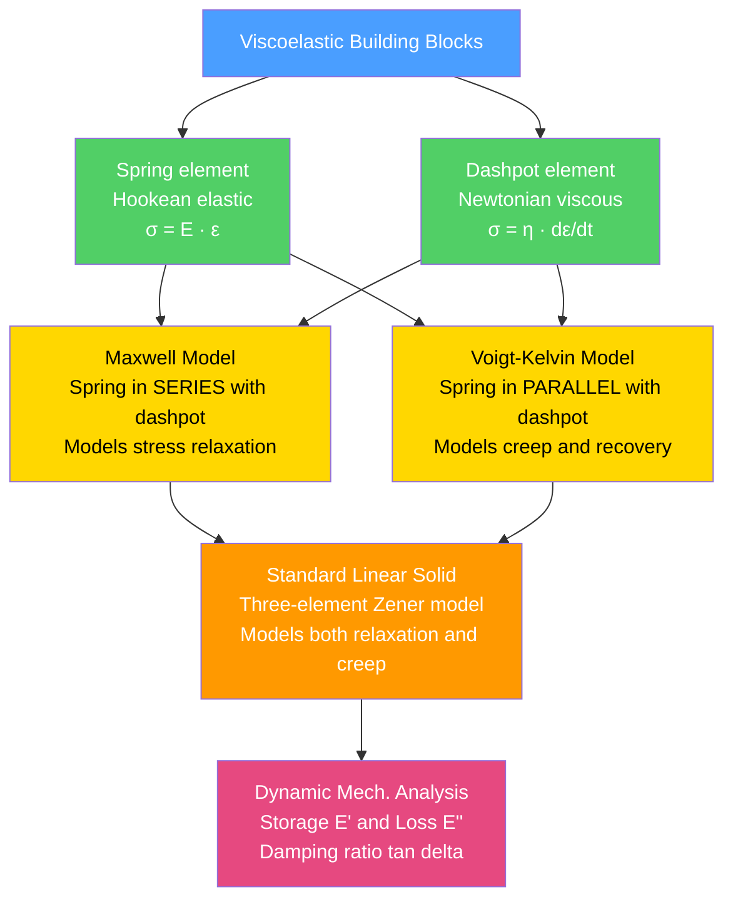

# Polymer Mechanics and Viscoelasticity

> [!abstract] TL;DR
> Polymers are neither purely elastic solids nor purely viscous liquids — they are **viscoelastic**: their mechanical response depends on both load magnitude and the *rate* and *duration* of loading. Rubber elasticity is entropic (stretching a network reduces configurational entropy, not enthalpic bond energy), described by the neo-Hookean relation $\sigma = nkT(\lambda - 1/\lambda^2)$. Viscoelasticity is modelled by combining Hookean springs with Newtonian dashpots: the Maxwell model (series) captures stress relaxation; the Voigt-Kelvin model (parallel) captures creep; the three-element Standard Linear Solid captures both. Dynamic Mechanical Analysis (DMA) measures the complex modulus $E^* = E' + iE''$ and damping factor $\tan\delta$. Time-Temperature Superposition lets engineers predict decade-long service behaviour from hour-long lab experiments. Understanding these ideas is essential for every application from vibration-damping mounts to car tyres to biomedical implants.

---

## Intuition

**Analogy:** Hold a ball of Silly Putty. Pull it apart slowly and it stretches like taffy, thinning and flowing — it behaves like a **viscous liquid**. Now snatch it apart with a sharp, fast jerk and it snaps cleanly like chalk — it behaves like a **brittle elastic solid**. The material has not changed; only the timescale has. That is viscoelasticity in one demonstration: the mechanical response is a function of *both* stress and loading rate (or, equivalently, time).

In a polymer melt or rubber network, long chain molecules are perpetually coiling and uncoiling. At very short timescales they have no time to re-arrange — they respond like a stiff elastic solid. At very long timescales they can fully relax and flow — they respond like a liquid. The glass transition temperature $T_g$ and the experimental timescale together determine which regime you are in, and the models below quantify how the transition unfolds.

---

## How It Works

### Fundamental Constitutive Elements

Two primitive mechanical elements combine to describe all viscoelastic behaviour:

| Element | Symbol | Constitutive law | Physical meaning |
|---------|--------|-----------------|-----------------|
| Hookean spring | $E$ | $\sigma = E\varepsilon$ | Instantaneous, reversible deformation; energy *stored* |
| Newtonian dashpot | $\eta$ | $\sigma = \eta\,\dot{\varepsilon}$ | Rate-dependent, irreversible deformation; energy *dissipated* |

Connecting these elements in **series** gives the Maxwell model; in **parallel** gives the Voigt-Kelvin model.

### Model Hierarchy



### Relaxation Time

Every spring-dashpot combination defines a **relaxation time** $\tau = \eta / E$. This is the characteristic time over which stress relaxes (Maxwell) or creep equilibrates (Voigt). When the experimental time $t \ll \tau$, the material behaves elastically (spring dominates); when $t \gg \tau$, it behaves viscously (dashpot dominates). The ratio of timescale to $\tau$ is the **Deborah number** $\text{De} = \tau / t_\text{exp}$; $\text{De} \gg 1$ means solid-like, $\text{De} \ll 1$ means liquid-like.

---

## Key Concepts / Details

### Secondary Level

**What makes polymers different from metals?**

A structural steel beam responds to a static load in microseconds and then holds that deformation indefinitely — stress and strain are linked by a fixed modulus $E$. Leave a polyethylene plumbing pipe under pressure for a year and it will sag measurably even at room temperature and at stresses far below the short-term yield strength. The fundamental reason is molecular: polymer chains are long, flexible, and entangled. Rearranging them takes time, so the mechanical response is inherently time- and temperature-dependent.

**Elastic vs viscous vs viscoelastic at the introductory level:**

- **Elastic solid** (steel spring): apply load → instant deformation; remove load → instant recovery. Energy is conserved.
- **Viscous liquid** (honey): apply load → deformation rate proportional to stress; remove load → no recovery. Energy is dissipated.
- **Viscoelastic** (polymer): apply load → some immediate elastic response plus additional time-dependent deformation; remove load → partial or full recovery over time. Energy is partially stored, partially dissipated.

**Creep and stress relaxation at a glance:**

| Experiment | Input | Output |
|-----------|-------|--------|
| **Stress relaxation** | Step strain $\varepsilon_0$ held constant | Stress $\sigma(t)$ decays with time |
| **Creep** | Step stress $\sigma_0$ held constant | Strain $\varepsilon(t)$ grows with time |

These are the two canonical experiments that distinguish viscoelastic behaviour from purely elastic behaviour.

---

### Undergraduate Level

**Rubber (Entropic) Elasticity**

Metals deform elastically by stretching interatomic bonds — this is an *enthalpic* mechanism and the restoring force is energetic. Rubber and other crosslinked polymer networks are completely different: the restoring force is *entropic*.

Consider a single polymer chain modelled as a freely jointed chain of $N$ bonds of length $l$. The probability of finding the end-to-end vector at magnitude $r$ follows a Gaussian distribution:

$$p(r) \propto \exp\!\left(-\frac{3r^2}{2Nl^2}\right)$$

The Boltzmann entropy of this configuration is:

$$S = -\frac{3k}{2Nl^2}\,r^2 + \text{const}$$

The retractive force at extension $r$ (at constant temperature $T$) is:

$$f = -T\frac{\partial S}{\partial r} = \frac{3kT}{Nl^2}\,r$$

This is a linear spring-like response — but driven entirely by entropy, not energy. For a crosslinked **network** with $n$ elastic chain segments per unit volume, the neo-Hookean model gives the true stress in uniaxial extension as:

$$\boxed{\sigma = nkT\!\left(\lambda - \frac{1}{\lambda^2}\right)}$$

where $\lambda = L/L_0$ is the extension ratio ($\lambda = 1$ is undeformed; $\lambda > 1$ is stretched; $\lambda < 1$ is compressed). At small strains $(\lambda = 1 + \varepsilon,\; \varepsilon \ll 1)$, this linearises to give Young's modulus:

$$E_\text{rubber} = 3nkT$$

This carries two profound consequences:
1. **Temperature stiffening**: $E \propto T$, so rubber becomes *stiffer* as temperature rises — the opposite of metals.
2. **Thermoelastic inversion**: stretching rubber at constant $T$ decreases entropy, which releases heat (the material warms on extension — the Gough-Joule effect).

**The Maxwell Model (series)**

Place a spring ($E$) and dashpot ($\eta$) in series. Total strain rate = sum of individual strain rates:

$$\dot{\varepsilon} = \frac{\dot{\sigma}}{E} + \frac{\sigma}{\eta}$$

Rearranging to the standard form:

$$\sigma + \frac{\eta}{E}\dot{\sigma} = \eta\dot{\varepsilon}$$

*Stress relaxation* (hold $\varepsilon = \varepsilon_0$ constant, so $\dot{\varepsilon} = 0$):

$$\sigma(t) = E\varepsilon_0\,e^{-t/\tau}, \qquad \tau = \frac{\eta}{E}$$

The relaxation modulus is $E(t) = E_0\,e^{-t/\tau}$. Stress decays from $E_0\varepsilon_0$ to zero — the model predicts complete relaxation at long times, appropriate for a liquid.

*Creep* (hold $\sigma = \sigma_0$ constant): $\varepsilon(t) = \sigma_0/E + \sigma_0 t/\eta$ — strain grows without bound. This makes the Maxwell model appropriate for polymer melts but not for crosslinked solids.

**The Voigt-Kelvin Model (parallel)**

Place a spring and dashpot in parallel. Total stress = sum of individual stresses:

$$\sigma = E\varepsilon + \eta\dot{\varepsilon}$$

*Creep* (hold $\sigma = \sigma_0$ constant):

$$\varepsilon(t) = \frac{\sigma_0}{E}\!\left(1 - e^{-t/\tau}\right), \qquad \tau = \frac{\eta}{E}$$

The creep compliance is:

$$J(t) = \frac{\varepsilon(t)}{\sigma_0} = \frac{1}{E}\!\left(1 - e^{-t/\tau}\right)$$

Strain asymptotically approaches $\sigma_0/E$ — the model is bounded and recoverable, appropriate for a viscoelastic solid. However, the Voigt model predicts instantaneous recovery upon load removal and cannot describe stress relaxation (it has no mechanism for $\sigma \to 0$ at constant $\varepsilon$).

**The Standard Linear Solid (Zener Model)**

The SLS combines a Maxwell element (spring $E_1$ in series with dashpot $\eta$) placed in parallel with a spring $E_2$. It has three parameters and correctly captures both stress relaxation and recoverable creep:

- *Unrelaxed modulus* $E_U = E_1 + E_2$ (response at $t \to 0$, before dashpot moves)
- *Relaxed modulus* $E_R = E_2$ (response at $t \to \infty$, after dashpot fully strains)
- *Relaxation time* $\tau = \eta/E_1$

Stress relaxation under step strain $\varepsilon_0$:

$$\sigma(t) = \varepsilon_0\!\left[E_R + (E_U - E_R)\,e^{-t/\tau}\right]$$

This decays from $E_U\varepsilon_0$ to a finite equilibrium value $E_R\varepsilon_0$ — physically representing a material that stores some residual elastic stress indefinitely, as a crosslinked rubber does.

**Dynamic Mechanical Analysis (DMA)**

Apply an oscillatory strain $\varepsilon(t) = \varepsilon_0 \sin(\omega t)$. For a viscoelastic material the stress response is:

$$\sigma(t) = \sigma_0 \sin(\omega t + \delta)$$

where $\delta$ (the *loss angle*) is the phase lag between stress and strain. Expanding:

$$\sigma(t) = \varepsilon_0\!\left[E'\sin(\omega t) + E''\cos(\omega t)\right]$$

The two components of the complex modulus $E^* = E' + iE''$ are:

$$E' = \frac{\sigma_0}{\varepsilon_0}\cos\delta \qquad \text{(storage modulus — in-phase, energy stored per cycle)}$$

$$E'' = \frac{\sigma_0}{\varepsilon_0}\sin\delta \qquad \text{(loss modulus — out-of-phase, energy dissipated per cycle)}$$

$$\tan\delta = \frac{E''}{E'} \qquad \text{(loss tangent, damping factor)}$$

Limiting cases: $\delta = 0$ (pure elastic, $E'' = 0$); $\delta = 90°$ (pure viscous, $E' = 0$). A DMA temperature scan at fixed $\omega$ reveals a dramatic drop in $E'$ and a peak in $\tan\delta$ at the **glass transition temperature** $T_g$, and smaller secondary peaks at sub-$T_g$ transition temperatures ($\beta$, $\gamma$ transitions).

---

### Graduate Level

**Free-Volume Theory and the WLF Equation**

Near and above $T_g$, polymer chain mobility is governed by the *free volume* $v_f$ — the space not occupied by the chains themselves. Williams, Landel, and Ferry (1955) showed that the viscosity $\eta$ (and hence any relaxation time $\tau$) shifts with temperature according to:

$$\log_{10} a_T = \frac{-C_1(T - T_\text{ref})}{C_2 + (T - T_\text{ref})}$$

where $a_T = \tau(T)/\tau(T_\text{ref})$ is the horizontal **shift factor**, and the universal WLF constants (when $T_\text{ref} = T_g$) are $C_1 \approx 17.44$ and $C_2 \approx 51.6\,\text{K}$.

**Time-Temperature Superposition (TTS) and Master Curves**

Since $a_T$ shifts all relaxation times by the same multiplicative factor, a complete modulus-vs-frequency or modulus-vs-time curve measured at one temperature can be shifted horizontally to construct a **master curve** at a reference temperature spanning many decades of time or frequency. Practically:

1. Measure $E'(\omega)$ or $E(t)$ isotherms at several temperatures.
2. Shift each isotherm by $\log_{10} a_T$ along the log-frequency axis until they overlap on a single curve.
3. The resulting master curve can span 10–15 decades of time from experiments conducted over 2–3 decades — predicting 10-year creep from 1-hour measurements.

The WLF equation applies only in the range $T_g$ to $T_g + 100\,\text{K}$. Below $T_g$, the Arrhenius equation ($a_T = \exp[E_a/R(1/T - 1/T_\text{ref})]$) typically governs secondary relaxations.

**Crazing vs Shear Yielding in Glassy Polymers**

Glassy polymers (PMMA, PS, PC below $T_g$) can fail by two competing mechanisms depending on temperature, strain rate, and stress state:

*Crazing* — initiated under tensile stress when local stress exceeds a critical value:
- Fibrils of oriented polymer bridge the craze plane, bearing load (a craze is NOT a crack — it carries stress).
- The craze plane is perpendicular to the maximum principal stress.
- Involves $\sim 10\%$ volume increase (dilatational); creates high local hydrostatic tension.
- Fibrils eventually break → craze converts to a crack → fast fracture (brittle appearance).
- Dominant in PS, PMMA under uniaxial tension at low temperature.

*Shear yielding* — occurs at lower stress triaxiality or higher temperatures:
- Shear bands propagate at $\sim 45°$ to the tensile axis (maximum shear stress plane).
- Isochoric (no volume change) — contrasts sharply with crazing.
- Each band is a region of intense local plastic shear; material within is highly oriented.
- Leads to ductile, neck-drawing type failure.

**Rubber-Particle Toughening**

Blending a glassy matrix with $\sim 10$–$20\,\text{vol}\%$ rubber particles (diameter $0.1$–$1\,\mu\text{m}$) can increase impact toughness by a factor of 10–100. Mechanism:
1. Triaxial stress at the matrix–particle interface causes the rubber particle to **cavitate** internally.
2. Cavitation relieves hydrostatic constraint and triggers **crazing** in the surrounding matrix.
3. Each craze fibrils absorb energy; thousands of crazes distributed throughout the volume consume vastly more energy than a single large crack.
4. The rubber particle also bridges any growing crack, providing crack-tip shielding.
Applications: High-impact polystyrene (HIPS = PS + polybutadiene), ABS (acrylonitrile-butadiene-styrene).

**Comparison: Polymers vs Metals**

| Property | Structural Steel | Aluminium 6061-T6 | HDPE | Natural Rubber |
|----------|-----------------|------------------|------|----------------|
| Young's modulus $E$ | 200 GPa | 69 GPa | ~1 GPa | ~0.05 GPa |
| Yield / flow stress | 250 MPa | 276 MPa | ~25 MPa | — |
| Failure strain | ~20% | ~12% | ~800% | up to 800% |
| Rate dependence | Negligible | Negligible | Strong | Strong |
| $E$ vs temperature | Weak decrease | Weak decrease | Drops 3 orders near $T_g$ | Increases (entropic) |
| Creep at service $T$ | Negligible | Negligible | Significant | Significant |

The central design message: polymer moduli are rate- and temperature-dependent at service conditions in a way that metal moduli are not — failure to account for this leads to underdesigned polymer components.

---

## Python Demo

```python
# Demonstrates Maxwell stress relaxation and Voigt creep compliance
# for three different relaxation times, plotted side by side.

import numpy as np
import matplotlib.pyplot as plt

t = np.linspace(0, 20, 500)        # time axis, seconds

tau_values = [1.0, 3.0, 8.0]       # three relaxation times
colors     = ["#2196F3", "#FF5722", "#4CAF50"]

fig, (ax1, ax2) = plt.subplots(1, 2, figsize=(13, 5))
fig.suptitle("Spring-Dashpot Models of Viscoelasticity", fontsize=13, fontweight="bold")

# --- Maxwell model: stress relaxation ---
# E(t) = E0 * exp(-t / tau),  normalized so E0 = 1
for tau, col in zip(tau_values, colors):
    ax1.plot(t, np.exp(-t / tau), color=col, linewidth=2.2,
             label=f"τ = {tau:.0f} s")

ax1.set_xlabel("Time  (s)", fontsize=11)
ax1.set_ylabel("E(t) / E₀  (normalised relaxation modulus)", fontsize=10)
ax1.set_title("Maxwell Model — Stress Relaxation\nE(t) = E₀ exp(−t/τ),   τ = η/E", fontsize=10)
ax1.set_ylim(0, 1.08)
ax1.axhline(0, color="black", linewidth=0.8)
ax1.legend(fontsize=10)
ax1.grid(True, alpha=0.3)

# --- Voigt model: creep compliance ---
# J(t) * E = 1 - exp(-t / tau),  normalized so J_inf * E = 1
for tau, col in zip(tau_values, colors):
    ax2.plot(t, 1.0 - np.exp(-t / tau), color=col, linewidth=2.2,
             label=f"τ = {tau:.0f} s")

ax2.axhline(1.0, color="gray", linestyle="--", linewidth=1.2, alpha=0.7,
            label="Equilibrium  J·E = 1")
ax2.set_xlabel("Time  (s)", fontsize=11)
ax2.set_ylabel("J(t) · E  (normalised creep compliance)", fontsize=10)
ax2.set_title("Voigt-Kelvin Model — Creep\nJ(t) = (1/E)(1 − exp(−t/τ)),   τ = η/E", fontsize=10)
ax2.set_ylim(0, 1.18)
ax2.legend(fontsize=10)
ax2.grid(True, alpha=0.3)

plt.tight_layout()
plt.savefig("viscoelastic_models.png", dpi=150, bbox_inches="tight")
plt.show()
print("Saved: viscoelastic_models.png")
```

The left panel shows how a larger relaxation time $\tau$ means the Maxwell element holds its stress longer before decaying to zero. The right panel shows how a larger $\tau$ means the Voigt element creeps more slowly toward equilibrium. Both curves are controlled by exactly the same ratio $\tau = \eta/E$ — the dashpot viscosity relative to the spring stiffness.

---

## Real-World Applications

> **Car tyres (SBR/NR blends and DMA optimisation):** A tyre must simultaneously provide high wet grip (requires high $\tan\delta$ at ~10 Hz, the wheel vibration frequency during cornering) and low rolling resistance (requires low $\tan\delta$ at ~100 Hz, the continuous road-contact deformation frequency). These conflicting demands at different frequencies are resolved using WLF-guided blend design: a styrene-butadiene / natural rubber formulation is tuned so the $\tan\delta$ peak (from DMA master curve) falls between the two operating frequencies, maximising the ratio of grip to rolling resistance.

> **Vibration isolation mounts (automotive, aerospace):** A constrained-layer damper sandwiches a viscoelastic polymer (high $\tan\delta$) between two stiff facesheets. When the structure flexes, the stiff layers force the polymer to undergo large shear strain, converting vibrational energy to heat. Engineers use DMA data to confirm the peak $\tan\delta$ occurs at the target frequency and service temperature.

> **Time-Temperature Superposition in pipe design:** HDPE water pipes must resist creep under internal pressure for 50 years. Testing a pipe at 23 °C for 50 years is impractical. Instead, short-term creep tests are conducted at elevated temperatures (40–80 °C), master curves are constructed via WLF shifting, and the 23 °C 50-year compliance is read off the extrapolated master curve. This is the basis for the ISO 9080 long-term hydrostatic strength standard.

> **Rubber bearings in seismic isolation (buildings):** High-damping natural rubber (HDNR) bearings placed under buildings reduce earthquake damage by shifting the building's natural frequency below the dominant seismic band. The large-strain Mooney-Rivlin or neo-Hookean constitutive model is used to design the rubber layer thickness, while DMA characterises the frequency-dependent damping.

> **Polyurea coatings for blast protection:** At blast loading rates ($\dot{\varepsilon} \sim 10^4\,\text{s}^{-1}$), the Deborah number is enormous and polyurea is glassy ($E \sim 1\,\text{GPa}$). At quasi-static rates it is rubbery ($E \sim 10\,\text{MPa}$). This extreme rate stiffening, combined with high energy-absorbing capacity, makes polyurea coatings effective for hull protection of military vehicles.

---

## Common Pitfalls

- **Using a single elastic modulus for polymers** — Quoting a single $E$ from a tensile test datasheet ignores strain-rate dependence; a polymer tested at $100\,\text{mm/min}$ can show twice the modulus of the same polymer at $1\,\text{mm/min}$. Always report the test speed and temperature alongside the modulus.

- **Ignoring creep in structural calculations** — A bolt-flanged HDPE joint designed to Hookean elastic stress calculations may leak after months because stress relaxation reduces the clamping force. The Maxwell model creep compliance must be integrated over the service life.

- **Applying WLF outside its valid range** — The WLF equation is empirically valid only between $T_g$ and $T_g + 100\,\text{K}$. Extrapolating it to temperatures far above or below $T_g$ produces large errors in predicted shift factors; use the Arrhenius equation below $T_g$.

- **Confusing a craze with a crack** — A craze looks like a crack under optical microscopy but is fibril-bridged and load-bearing. Measuring the "crack length" in a crazing polymer with optical methods and feeding it into fracture-mechanics formulas (which assume a stress-free crack face) will severely overestimate crack-tip stress intensity and underestimate toughness.

- **Neglecting physical aging** — A glassy polymer below $T_g$ is not in thermodynamic equilibrium. Over years its free volume decreases (physical aging), stiffness increases, and toughness drops. A rubber gasket that passes specification tests when new may become brittle after a decade. Accelerated aging protocols (elevated temperature, extended time, ASTM D573) are necessary.

- **Treating entropic rubber elasticity with the metal stiffness mindset** — Rubber's modulus *increases* with temperature because $E = 3nkT$. Design teams accustomed to metals (where $E$ falls with temperature) can make the opposite sign error in thermal-expansion/stiffness calculations for elastomeric seals.

---

## Related Concepts

- [[Stress_Strain_and_Elastic_Moduli]] — defines Young's modulus, yield strength, and the Hookean spring concept that forms the elastic element in every spring-dashpot model; also covers the fundamental tensile test from which viscoelastic parameters are extracted.

- [[Composite_Materials_and_Fiber_Reinforcement]] — fiber-reinforced polymers exhibit rate-dependent matrix-dominated properties (shear modulus, transverse modulus) governed by viscoelasticity; creep in the matrix is a key long-term failure concern for CFRP structures.

- [[Fatigue_Creep_and_High_Temperature_Failure]] — creep in metals is thermally activated dislocation climb (Norton power law), whereas creep in polymers is viscoelastic; comparing the two clarifies why WLF/free-volume governs polymers while Arrhenius/diffusion governs metals.

- [[Plastic_Deformation_and_Slip_Systems]] — shear yielding in glassy polymers proceeds by shear-band formation analogous to slip-band formation in metals, though the microscopic mechanism (conformational rearrangement vs dislocation glide) is entirely different.

- [[Pericyclic_Radical_and_Polymer_Chemistry]] — crosslink density $n$ in the neo-Hookean model is set during vulcanisation or radical polymerisation; the chemistry of network formation directly controls the macroscopic rubber modulus $E = 3nkT$.

- [[Fluid_Statics_and_Properties]] — Newtonian viscosity $\eta$ governing the dashpot element is the same property introduced in fluid mechanics; a Maxwell fluid at long times recovers Newtonian liquid behaviour, linking polymer rheology to classical fluid mechanics.

- [[Sustainable_Materials_and_Circular_Economy]] — biobased elastomers (polyisoprene, PHA-based rubbers) and recyclable thermoplastic elastomers are evaluated partly on their viscoelastic service performance relative to conventional styrene-butadiene rubber.

- [[_MOC_Physics_Master]] — statistical mechanics (Boltzmann entropy, Gaussian chain statistics) provides the theoretical foundation for entropic rubber elasticity; thermodynamics of rubber-like networks is a standard topic in polymer physics.

---

## Review Questions

### Secondary (Conceptual)

1. A ball of Silly Putty is dropped from chest height and bounces off the floor; the same ball is left resting on a flat surface and after an hour it has spread into a pancake. Explain this behaviour in terms of elastic, viscous, and viscoelastic material response. What experiment would you run to determine the relaxation time of the Silly Putty?

2. Why does a rubber band become *stiffer* when you warm it, whereas a steel spring becomes slightly *softer*? What does this difference tell you about the microscopic origins of their respective elasticity?

3. Sketch the expected creep curve (strain vs time) for (a) a Hookean elastic solid, (b) a Newtonian viscous liquid, and (c) a Voigt-Kelvin viscoelastic solid, all under the same constant tensile stress. Label the key features.

### Undergraduate (Applied)

4. A polymer rod (Maxwell material, $E_0 = 2\,\text{GPa}$, $\tau = 5\,\text{s}$) is suddenly stretched to a strain $\varepsilon_0 = 0.005$ and held there. Calculate the stress at $t = 0$, $t = 5\,\text{s}$, and $t = 20\,\text{s}$. At what time has the stress fallen to 10% of its initial value?

5. A DMA scan of a polymer shows $E' = 1500\,\text{MPa}$, $E'' = 300\,\text{MPa}$ at 25 °C and 1 Hz. Calculate $\tan\delta$ and the fraction of energy dissipated per oscillation cycle. If you needed this material to absorb maximum energy per cycle (maximum damping), would you want $\tan\delta$ to be higher or lower, and what material change would achieve this?

6. Explain why crazing in a glassy polymer produces a *dilational* strain (volume increase) while shear yielding does not. Which mechanism would you expect to dominate in a thin film of PMMA under plane-stress conditions vs a thick block under plane-strain conditions, and why?

### Graduate (Analytical and Design)

7. The WLF equation gives $\log_{10} a_T = -17.44(T - T_g)/(51.6 + T - T_g)$. A DMA experiment measures the 1-hour creep compliance $J(1\,\text{h})$ of a polymer at 60 °C; the polymer has $T_g = 50\,\text{°C}$. Predict the compliance at 25 °C over what equivalent time does this measurement represent? Discuss the physical limitations of this prediction.

8. Derive the neo-Hookean stress-extension relation $\sigma = nkT(\lambda - 1/\lambda^2)$ starting from the Gaussian chain entropy $S = -3k r^2/(2Nl^2)$, the definition of engineering stress, and the incompressibility condition. Where does the $1/\lambda^2$ term come from?

9. You are designing a constrained-layer damping panel for an aircraft fuselage that vibrates at 200 Hz at a service temperature ranging from $-40\,\text{°C}$ to $+80\,\text{°C}$. Using the WLF framework, describe the complete experimental and computational workflow to select and validate a viscoelastic polymer interlayer. What material properties would you optimise, and what are the practical limits of the WLF-based approach in this application?

---

## Sources

- [Callister, W.D. & Rethwisch, D.G. — *Materials Science and Engineering: An Introduction*, 10th ed. (Wiley, 2018), Chapters 15–16](https://www.wiley.com/en-us/Materials+Science+and+Engineering%3A+An+Introduction%2C+10th+Edition-p-9781119321590)
- [Ferry, J.D. — *Viscoelastic Properties of Polymers*, 3rd ed. (Wiley, 1980)](https://www.wiley.com/en-us/Viscoelastic+Properties+of+Polymers%2C+3rd+Edition-p-9780471048947)
- [Treloar, L.R.G. — *The Physics of Rubber Elasticity*, 3rd ed. (Oxford University Press, 2005)](https://global.oup.com/academic/product/the-physics-of-rubber-elasticity-9780198570271)
- [Williams, M.L., Landel, R.F., Ferry, J.D. — "The Temperature Dependence of Relaxation Mechanisms in Amorphous Polymers and Other Glass-Forming Liquids", *J. Am. Chem. Soc.* 77 (1955) 3701](https://doi.org/10.1021/ja01619a008)
- [Sperling, L.H. — *Introduction to Physical Polymer Science*, 4th ed. (Wiley, 2006), Chapters 8–12](https://www.wiley.com/en-us/Introduction+to+Physical+Polymer+Science%2C+4th+Edition-p-9780471705536)

---

#MaterialsScience #Viscoelasticity #PolymerMechanics #RubberElasticity #DMA #WLF #SpringDashpot #Creep #StressRelaxation #TimeTemperatureSuperposition
