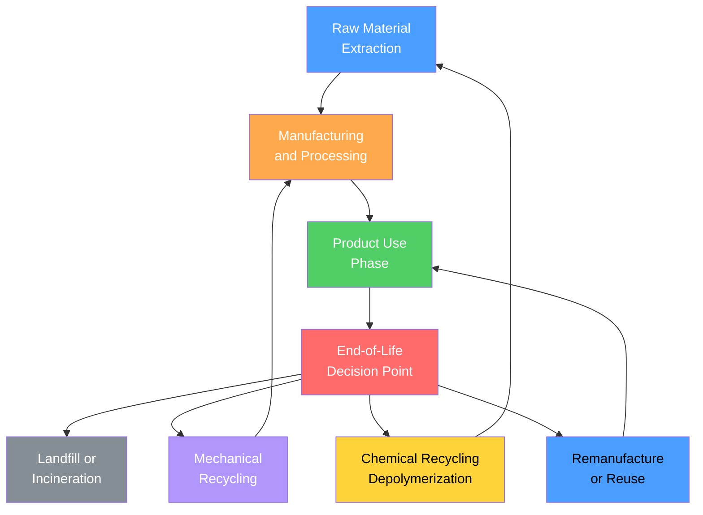

# Sustainable Materials and Circular Economy

> [!abstract] TL;DR
> Sustainable materials engineering closes the loop between resource extraction and end-of-life: Life Cycle Assessment (LCA) quantifies environmental cost across every stage; Ashby selection charts make embodied energy and carbon footprint first-class design parameters; biobased polymers (PLA, PHA) and near-infinite metal recycling reduce dependence on virgin resources; and the circular economy framework — keep materials cycling rather than spending them once — reframes waste as a design failure rather than an inevitable outcome.

---

## Intuition

**Analogy:** Think of materials the way a prudent banker thinks about money. In a linear economy, every material expenditure is a one-way withdrawal: you mine ore, use the metal once, then throw it in a landfill — the account empties. In a circular economy, materials are like money in a revolving fund: every "withdrawal" (manufacturing) is matched by an eventual "deposit" (recycling, remanufacturing, or composting). The goal is not to spend zero — that would mean building nothing — but to keep the principal intact while drawing only on the interest generated by renewable inputs.

In practice, this means designing products so that their materials can be efficiently recovered and re-entered into industrial streams with minimal energy penalty. Just as compound interest rewards patience, circular material flows reward foresight at the design stage: a chair designed for disassembly at the beginning of its life is worth orders of magnitude more in raw material recovery at the end of it than one bonded together with mixed-material adhesives that make separation impossible.

---

## How It Works

### Life Cycle Assessment

Life Cycle Assessment (LCA) is the standardized quantitative framework (ISO 14040/14044) for measuring the environmental impact of a material or product across its entire life. It answers: "How much energy, water, land, and greenhouse gas emission does this material *truly* cost?"

**Four LCA stages:**
1. **Goal and scope definition** — which functional unit (e.g., "1 kg of structural material capable of sustaining 100 MPa") and which system boundary?
2. **Life Cycle Inventory (LCI)** — account for all inputs (energy, raw materials, water) and outputs (emissions, waste) at each stage
3. **Life Cycle Impact Assessment (LCIA)** — translate inventory flows into impact categories: global warming potential (GWP, kg CO₂-eq), acidification potential, eutrophication, human toxicity, resource depletion
4. **Interpretation** — identify hotspots, compare alternatives, draw conclusions

**System boundary conventions:**

| Boundary | Scope | Use case |
|----------|-------|----------|
| Cradle-to-gate | Extraction through factory gate; excludes use and disposal | Material suppliers comparing production routes |
| Cradle-to-grave | Full life including use phase and final disposal | Product designers; whole-system comparisons |
| Cradle-to-cradle | Cradle-to-grave + credit for material recovery at end-of-life | Circular economy benchmarking |
| Gate-to-gate | Manufacturing step only | Process optimization within a factory |

The most commonly cited number — for example, "steel emits 1.9 kg CO₂/kg" — is a cradle-to-gate figure for the primary production route. Recycled routes change that number dramatically.

### Carbon Footprint Benchmarks

The following values are representative cradle-to-gate figures from Ashby (2013) and the worldsteel and Aluminum Association databases:

| Material | Embodied Energy (MJ/kg) | CO₂ footprint (kg/kg) | Recyclability |
|----------|------------------------|----------------------|---------------|
| Concrete | 1.5 | 0.10 | Low (crush to aggregate) |
| Wood (structural) | 8 | 0.45 | Compostable; limited recycling |
| Glass | 14 | 0.70 | Good (cullet melting) |
| Steel (virgin, BF-BOF) | 24 | 1.90 | Near-infinite |
| Steel (recycled, EAF) | 9 | 0.40 | Near-infinite |
| HDPE | 78 | 2.70 | Mechanical recycling |
| Copper | 70 | 4.00 | Near-infinite |
| PLA (biobased) | 55 | 2.30 | Industrial compost; chemical recycle |
| PHA (bacterial) | 50 | 2.00 | Marine biodegradable |
| GFRP | 45 | 3.00 | Very difficult |
| Aluminum (primary) | 196 | 8.20 | Near-infinite |
| Aluminum (recycled) | 14 | 0.50 | Near-infinite |
| CFRP | 286 | 21.0 | Very difficult |
| Titanium | 920 | 35.0 | Good (dense scrap market) |

Two patterns dominate: (1) metals have high primary footprints but collapse to very low figures when recycled — aluminum recycled uses 93% less energy than primary; (2) thermoset composites (CFRP, GFRP) carry a high initial burden *and* resist recycling, making their use compelling only where specific stiffness or strength genuinely justifies the cost.

### The Linear-to-Circular Material Flow



The gray node (landfill/incineration) represents the linear economy endpoint. The three circular paths — mechanical recycling back to manufacturing, chemical recycling back to raw material precursors, and remanufacture/reuse back to the use phase — each close a loop at a different level of the hierarchy. Higher loops preserve more embodied value: reuse retains the full manufacturing investment; mechanical recycling retains most of the processing investment; chemical recycling recovers only the feedstock.

### Ashby Materials Selection for Sustainability

Michael Ashby (Cambridge Engineering Design Centre) extended his classic performance-index methodology to include environmental merit. The **Cambridge Engineering Selector (CES EduPack)** plots materials on charts where axes are sustainability metrics rather than purely mechanical ones.

The methodology proceeds in four steps:
1. **Translate the design brief** into objectives (minimize embodied energy, maximize recyclability) and constraints (strength ≥ X MPa, cost ≤ Y $/kg)
2. **Derive material indices** — for example, a panel loaded in bending with minimum embodied energy per unit stiffness has index $M = E^{1/3}/(\rho \cdot H_{prod})$ where $H_{prod}$ is the embodied energy per unit mass
3. **Plot selection charts** — embodied energy vs yield strength, CO₂ vs density, recyclability fraction vs cost; materials above the selection line pass both constraints
4. **Shortlist and detailed comparison** — validate against manufacturing feasibility and end-of-life routes

Key chart insight: plotting **embodied energy vs CO₂ footprint** on log-log axes shows that materials scatter along a near-linear trend — because most primary energy comes from fossil combustion. Materials that deviate *below* the trend (lower CO₂ than expected for their energy content) have cleaner energy mixes in their production (e.g., aluminum smelted with hydroelectric power). Materials that deviate *above* are red flags for high-process-emission steps.

---

## Key Concepts

### Secondary Level

**Four recyclability tiers for common material classes:**

*Metals* enjoy near-infinite recyclability. The atoms are indestructible and the sorting/smelting process restores composition. Aluminum can be recycled indefinitely with only ~7% of the primary production energy. Steel scrap is the world's most recycled material by mass (~630 million tonnes/year). The key challenge is contamination by tramp elements (e.g., copper from wiring harnesses in shredded cars degrades steel mechanical properties).

*Thermoplastics* (HDPE, PET, PP, PLA) can be melted and remolded but suffer degradation (molecular weight reduction, color change, loss of additives) with each cycle. Mechanical recycling is limited to 4–7 cycles before the polymer becomes too degraded for structural use. Chemical recycling (depolymerization back to monomers) offers a route to closed-loop polymers without quality loss.

*Thermosets* (epoxy, polyester, phenolic resins) cannot be remolded because the crosslinked network is permanent — heating does not restore flow. This makes CFRP and GFRP among the most recyclability-challenged structural materials. Emerging routes include pyrolysis (recovers carbon fiber at ~60% of virgin strength), solvolysis (chemical breakdown in superheated solvents), and mechanical grinding to short-fiber filler.

*Ceramics and glass* can theoretically be remelted but sorting is difficult and most concrete ends up as low-grade fill aggregate ("downcycling"). Flat glass has a well-established cullet recycling stream; container glass achieves 70%+ recycling rates in Europe.

**The Second Law constraint on circular economy.** Entropy increases in every real process — mixed materials unmix only with energy input. Perfect circularity is thermodynamically impossible. The [[Laws_of_Thermodynamics]] establish that there will always be energy losses and degradation in any material cycle. The practical implication: design to keep materials sorted and pure from the start, because un-mixing a contaminated material stream costs far more energy than keeping it pure.

**Carbon footprint numbers worth memorizing:**

| Benchmark | CO₂ (kg/kg) |
|-----------|-------------|
| Concrete | 0.10 |
| Steel (primary) | 1.9 |
| Aluminum (primary) | 8.2 |
| Aluminum (recycled) | 0.5 |
| CFRP | ~21 |
| Titanium | ~35 |

These numbers apply to the production phase. Use phase often dominates the total — a 1 kg weight reduction in a car body saves ~20 kg of CO₂ over the vehicle's lifetime through improved fuel economy, dwarfing the production footprint.

### Undergraduate Level

**Biobased Polymers: PLA, PHA, and bio-PET**

*Polylactic acid (PLA)* is synthesized from lactic acid derived by bacterial fermentation of corn starch or sugarcane. The ring-opening polymerization of lactide gives a semi-crystalline thermoplastic with:
- $T_g \approx 60°C$, $T_m \approx 170°C$
- Tensile strength ~50 MPa, modulus ~3.5 GPa — comparable to polystyrene
- Industrially compostable (not home compostable; requires >58°C and high humidity for weeks)
- Chemical recycling via hydrolysis back to lactic acid is technically demonstrated but not yet widely deployed at scale

PLA is renewable-carbon-sourced but is NOT carbon-neutral in production: energy inputs for farming, fermentation, and polymerization give a cradle-to-gate CO₂ footprint of ~2.0–2.5 kg CO₂/kg, similar to conventional thermoplastics. The advantage is biological carbon sequestration during crop growth and the potential for end-of-life composting rather than landfill.

*Polyhydroxyalkanoates (PHA)* are polyesters produced directly by bacteria (e.g., *Cupriavidus necator*, *Pseudomonas putida*) as intracellular carbon storage granules under nutrient stress. Key properties:
- Wide range of compositions: PHB (poly(3-hydroxybutyrate)) is brittle; PHBV copolymers are tougher
- Fully biodegradable in soil, freshwater, and marine environments within months — unlike PLA which requires industrial composting
- Current production cost is $3–6/kg vs $1–2/kg for conventional plastics, the main commercialization barrier
- Feedstocks include agricultural waste streams, CO₂-fixing organisms, and waste cooking oil, giving potential for genuinely low carbon intensity

*Bio-PET* (partially biobased polyethylene terephthalate) replaces ethylene glycol (MEG) — a 30% portion of PET by mass — with bio-MEG from sugarcane ethanol. Terephthalic acid (TPA, 70% of PET) remains petroleum-derived until bio-paraxylene routes mature. Bio-PET has identical mechanical properties to fossil PET and drops into existing PET recycling infrastructure, making it the most immediately scalable biobased polymer.

**Mechanical comparison of biopolymers vs. conventional:**

| Property | PLA | PHA (PHB) | HDPE | PP | PET |
|----------|-----|-----------|------|----|-----|
| Density (g/cm³) | 1.24 | 1.25 | 0.95 | 0.91 | 1.38 |
| Tensile strength (MPa) | 50–70 | 25–40 | 20–37 | 30–40 | 55–75 |
| Young's modulus (GPa) | 3.5 | 3.5 | 0.8–1.4 | 1.2–1.7 | 2.7–4.1 |
| $T_g$ (°C) | 55–65 | 5 (brittle below) | −120 | −10 | 75 |
| Biodegradable | Industrial compost | Yes (soil, marine) | No | No | No |

**Green Chemistry: Anastas and Warner's 12 Principles (1998)**

Applied to materials processing, the key principles are:

1. **Prevention** — design synthesis routes that generate no waste rather than treating waste after the fact; atomic economy $(= M_\text{product}/M_\text{reagents} \times 100\%)$ quantifies this
2. **Atom economy** — maximize the fraction of reactant atoms incorporated into the final product; ring-opening polymerization scores ~100% vs condensation polymerization which loses small molecules (water, HCl)
3. **Design for energy efficiency** — conduct reactions at ambient temperature and pressure where possible; replace energy-intensive high-pressure hydrogenation with enzymatic or electrochemical alternatives
4. **Renewable feedstocks** — preferentially use plant- or waste-derived feedstocks over petroleum; applies directly to biobased polymers and bio-solvents
5. **Catalysis** — use catalytic rather than stoichiometric reagents (e.g., organocatalytic ring-opening of lactide for PLA vs earlier stoichiometric tin catalysts)
6. **Design for degradation** — engineer products to break down into innocuous fragments after use; ester linkages in PLA/PHA hydrolyze cleanly; C–C backbone polymers (PE, PP) do not
7. **Real-time analysis** — integrate in-line monitoring (NIR, Raman) into processing to prevent off-spec production and waste
8. **Inherent safety** — eliminate hazardous auxiliary solvents; replace toxic catalysts (e.g., mercury in chlor-alkali) with safer alternatives

Principles 9–12 (reduce derivatives, use renewable energy, minimize by-products, safer design) all reduce the embodied energy and environmental impact of the production route itself.

**Critical Minerals and Supply Chain Risk**

Several materials underpinning the clean-energy transition have concentrated and fragile supply chains:

| Mineral | Key use | Supply concentration | Risk |
|---------|---------|---------------------|------|
| Lithium (Li) | Li-ion batteries | Chile, Australia, Argentina supply ~90% | Brine depletion, water stress, political |
| Cobalt (Co) | NMC/NCA cathodes | ~70% from DRC | Geopolitical, artisanal mining ethics |
| Neodymium (Nd) | NdFeB permanent magnets | ~60% from China | Export controls, mine concentration |
| Indium (In) | ITO transparent electrodes | By-product of Zn smelting; China dominant | Supply inelasticity (by-product economics) |
| Platinum (Pt) | PEM fuel cell catalysts | ~75% from South Africa | Very low abundance (5 ppb in crust) |

The supply risk matters to materials scientists because it drives substitution research: NMC cathodes are moving toward lower-cobalt (NMC 811: 80% Ni, 10% Mn, 10% Co) and cobalt-free LFP (LiFePO₄); NdFeB magnets are being partly replaced by ferrite magnets or Mn-Bi alternatives. See [[Economic_Geology_and_Resources]] for the geology of ore formation and [[Transition_Metals_and_the_d_Block]] for the coordination chemistry of these elements.

### Graduate Level

**Ashby Selection Index for Environmental Merit**

For a structural panel loaded in bending with the objective of minimizing embodied energy $U_p$ (MJ) per unit stiffness, the Ashby analysis yields a material performance index analogous to specific stiffness:

$$M_1 = \frac{E^{1/3}}{\rho \cdot h_p}$$

where $E$ is Young's modulus, $\rho$ is density, and $h_p$ is the embodied energy per unit mass (MJ/kg). Materials with high $M_1$ deliver structural stiffness at low environmental cost. On a log-log chart of $h_p$ vs $E/\rho^3$ (specific stiffness), selection lines of slope 3 isolate the frontier materials.

For mass-limited applications (transport structures where weight savings reduce lifetime fuel consumption), the **break-even analysis** asks: how many service kilometres of fuel saving must a lighter material deliver to justify its higher production embodied energy? For aluminum vs steel in an automotive body panel:

$$\Delta E_{mfg} = (h_{Al} - h_{steel}) \times \Delta m = (196 - 24) \times 0.5 \approx 86 \text{ MJ}$$

A 10% fuel saving on a 100,000 km vehicle life at 7 L/100 km gives a fuel saving of 700 L of petrol ≈ 25,000 MJ. The production premium is recovered in the first ~350 km — making lightweight aluminum the obvious choice for any structural application in a vehicle with a long service life.

**Circular Economy Framework: Ellen MacArthur Foundation**

The Ellen MacArthur Foundation (2013) defines circular economy through three principles derived from ecological systems theory:

1. **Design out waste and pollution** — waste is a design defect, not an inevitability; use LCA and Design for Disassembly (DfD) from the concept stage
2. **Keep products and materials in use** — prioritize reuse > remanufacture > recycling > energy recovery; each step down the hierarchy loses more embodied value
3. **Regenerate natural systems** — distinguish technical cycles (metals, polymers) from biological cycles (biopolymers, natural materials); biological materials should return nutrients to the soil, not landfill

**Material passports** are digital records attached to a product or building component that contain: composition (alloy grade, additive package, coating type), origin, processing history, and end-of-life instructions. The European Union's Ecodesign for Sustainable Products Regulation (ESPR, 2024) is mandating material passports for batteries, textiles, and electronics. Passports enable automated sorting (via QR code or RFID), support design for future recyclability, and provide traceability for conflict-mineral due diligence.

**Industrial Symbiosis — Kalundborg, Denmark**

The Kalundborg Industrial Symbiosis (operating since the 1970s) is the canonical example of circular economy at the industrial park level:
- Asnaes coal power station waste heat → Novo Nordisk pharmaceutical fermentation and district heating
- Flue gas desulfurization gypsum (from SO₂ scrubbing) → Gyproc wallboard factory
- Fly ash → cement clinker replacement
- Waste steam → fish farming and greenhouse heating
- Statoil refinery sulfur → Kemira sulfuric acid production

The network reduces ~240,000 tonnes of CO₂/year and $10 million/year in resource costs, having emerged organically from bilateral agreements rather than top-down planning. It demonstrates that material efficiency gains multiply when firms coordinate across industry boundaries.

**Design for Disassembly (DfD) Principles**

| Design choice | Linear economy | Circular economy |
|---------------|----------------|------------------|
| Joining method | Adhesive bonding, welding | Mechanical fasteners, snap-fits |
| Material variety | Mixed, unidentified | Minimized, labeled |
| Composite structure | Co-cured CFRP/aluminum hybrid | Single-material zones with bolted interfaces |
| Coating | Multi-layer paint/primer | Water-based single-coat or anodizing |
| Embedded electronics | Soldered, potted | Modular, socketed |
| End-of-life documentation | None | Material passport with disassembly guide |

**Thermodynamic Limits on Closed-Loop Recycling**

The [[Entropy_and_Second_Law]] imposes a fundamental minimum on the energy required to de-mix materials. Gibbs free energy of mixing ($\Delta G_{mix} = \Delta H_{mix} - T\Delta S_{mix}$) quantifies why separation is never free. For an ideal binary alloy, the entropy of mixing per mole of atoms is $\Delta S_{mix} = -R(x\ln x + (1-x)\ln(1-x))$. At $x = 0.5$ and $T = 300$ K, $T\Delta S_{mix} \approx 1.7$ kJ/mol — a small but non-zero free energy that must be invested to recover pure components.

In practice, the real barrier is kinetic rather than thermodynamic: contaminated scrap (mixed polymers, alloyed metal streams with tramp elements, composite materials) requires energy-intensive sorting and purification that far exceeds the thermodynamic minimum. The exergy loss in real recycling processes is dominated by process inefficiency, not the Gibbs barrier.

**Future Frontiers**

*High-entropy alloys (HEAs):* Compositions containing 5 or more principal elements in near-equiatomic ratios (e.g., CoCrFeMnNi — the Cantor alloy) form simple BCC or FCC solid solutions stabilized by the very high configurational entropy ($\Delta S_{config} = -R\sum x_i\ln x_i$, maximized at equiatomic). CoCrFeMnNi achieves fracture toughness $K_{Ic} > 200$ MPa√m at cryogenic temperatures — exceptional by any standard. The sustainability challenge: HEAs often use critical elements (Co, W, Nb) and their multi-principal-element nature complicates recycling, since small compositional deviations destroy the targeted properties.

*Self-healing materials:* Microencapsulated healing agents (dicyclopentadiene + Grubbs ruthenium catalyst, White et al., 2001) release DCPD when crack-induced capsule rupture occurs; ring-opening metathesis polymerization seals the crack autonomously. Intrinsic self-healing via reversible Diels-Alder adducts or dynamic hydrogen-bond networks (e.g., in polyurethane or polysiloxane matrices) can completely restore mechanical properties at moderate temperatures. Self-healing directly extends service life, reducing the material throughput rate.

*Bio-inspired structural materials:* Nacre (mother-of-pearl) achieves fracture toughness 3000× higher than monolithic aragonite through a brick-and-mortar microstructure of aragonite tablets (~200 nm × 10 µm) in a 5 nm protein mortar. Spider dragline silk sustains ~1 GPa tensile strength with 30% elongation — a specific toughness rivaling Kevlar. These architectures guide efforts to manufacture hierarchically structured synthetic materials by bottom-up self-assembly, 3D printing, or freeze-casting — targeting high performance with minimized material quantity.

---

## Python Demo

```python
import numpy as np
import matplotlib.pyplot as plt
import matplotlib.patches as mpatches

# -------------------------------------------------------------------
# Ashby-style sustainability chart
# Data: representative cradle-to-gate values
# Sources: Ashby "Materials and the Environment" (2013), CES EduPack
# -------------------------------------------------------------------

materials = [
    "Concrete",
    "Wood",
    "Glass",
    "Steel virgin",
    "Steel recycled",
    "HDPE",
    "PET",
    "PLA",
    "PHA",
    "GFRP",
    "Copper",
    "Aluminum primary",
    "Aluminum recycled",
    "CFRP",
    "Titanium",
]

# Embodied energy (MJ/kg), cradle-to-gate primary production
embodied_energy = [1.5, 8.0, 14.0, 24.0, 9.0, 78.0, 84.0, 55.0, 50.0,
                   45.0, 70.0, 196.0, 14.0, 286.0, 920.0]

# CO2 footprint (kg CO2/kg), cradle-to-gate
co2_footprint = [0.10, 0.45, 0.70, 1.90, 0.40, 2.70, 3.40, 2.30, 2.00,
                 3.00, 4.00, 8.20, 0.50, 21.0, 35.0]

# Material class for color coding
classes = [
    "Inorganic", "Natural", "Inorganic", "Metal", "Metal",
    "Polymer", "Polymer", "Biopolymer", "Biopolymer", "Composite",
    "Metal", "Metal", "Metal", "Composite", "Metal",
]

class_colors = {
    "Metal":     "#4a9eff",
    "Polymer":   "#ffa94d",
    "Biopolymer":"#51cf66",
    "Composite": "#ff6b6b",
    "Inorganic": "#868e96",
    "Natural":   "#7bc67e",
}

colors = [class_colors[c] for c in classes]
sizes  = [160] * len(materials)

fig, axes = plt.subplots(1, 2, figsize=(15, 6))
fig.suptitle("Ashby Sustainability Charts: Embodied Energy and CO2 Footprint",
             fontsize=13, fontweight="bold")

# -------------------------------------------------------------------
# Left panel: Embodied Energy vs CO2 (log-log scale)
# -------------------------------------------------------------------
ax1 = axes[0]
ax1.scatter(embodied_energy, co2_footprint, c=colors, s=sizes,
            alpha=0.85, edgecolors="white", linewidths=0.8, zorder=3)

# Annotate each material
for i, mat in enumerate(materials):
    offset_x = 1.08
    ax1.annotate(mat, xy=(embodied_energy[i], co2_footprint[i]),
                 xytext=(embodied_energy[i] * offset_x, co2_footprint[i]),
                 fontsize=6.5, va="center", ha="left",
                 arrowprops=dict(arrowstyle="-", color="gray", lw=0.4))

# Trend line (log-log linear fit)
log_e = np.log10(embodied_energy)
log_c = np.log10(co2_footprint)
coeffs = np.polyfit(log_e, log_c, 1)
x_fit = np.logspace(np.log10(0.8), np.log10(1100), 200)
y_fit = 10**(coeffs[0] * np.log10(x_fit) + coeffs[1])
ax1.plot(x_fit, y_fit, "k--", lw=1.0, alpha=0.4, label="Trend (log-log fit)")

ax1.set_xscale("log")
ax1.set_yscale("log")
ax1.set_xlabel("Embodied Energy (MJ/kg)", fontsize=11)
ax1.set_ylabel("CO2 Footprint (kg CO2/kg)", fontsize=11)
ax1.set_title("Embodied Energy vs CO2 Footprint\n(log-log Ashby chart)", fontsize=10)
ax1.grid(True, which="both", alpha=0.2)
ax1.set_xlim(0.8, 2000)
ax1.set_ylim(0.05, 80)

# Annotate the recycling benefit arrows for Al
ax1.annotate("",
             xy=(14.0, 0.50), xytext=(196.0, 8.20),
             arrowprops=dict(arrowstyle="->", color="navy", lw=1.5))
ax1.text(45, 3.0, "Al recycling\nsaves 93% energy", fontsize=7.5,
         color="navy", ha="center")

# -------------------------------------------------------------------
# Right panel: Embodied Energy bar chart sorted for comparison
# -------------------------------------------------------------------
ax2 = axes[1]
sort_idx = np.argsort(embodied_energy)
sorted_mats   = [materials[i] for i in sort_idx]
sorted_energy = [embodied_energy[i] for i in sort_idx]
sorted_colors = [colors[i] for i in sort_idx]

ax2.barh(sorted_mats, sorted_energy, color=sorted_colors,
         edgecolor="white", linewidth=0.6)
ax2.set_xscale("log")
ax2.set_xlabel("Embodied Energy (MJ/kg, log scale)", fontsize=10)
ax2.set_title("Embodied Energy by Material (sorted)\nCradle-to-Gate Primary Production", fontsize=10)
ax2.grid(True, axis="x", alpha=0.2)
ax2.tick_params(axis="y", labelsize=8)

# Add CO2 annotation on bars
for idx, (eng, co2) in enumerate([(sorted_energy[i], co2_footprint[sort_idx[i]])
                                    for i in range(len(sorted_mats))]):
    ax2.text(eng * 1.15, idx, f"{co2:.2f} kg CO2", va="center",
             fontsize=6.5, color="#444")

# Shared legend for material classes
legend_handles = [mpatches.Patch(color=c, label=cls)
                  for cls, c in class_colors.items()]
fig.legend(handles=legend_handles, loc="lower center", ncol=6,
           bbox_to_anchor=(0.5, -0.03), fontsize=9, title="Material class")

plt.tight_layout(rect=[0, 0.06, 1, 0.97])
plt.savefig("ashby_sustainability_chart.png", dpi=150, bbox_inches="tight")
plt.show()

# -------------------------------------------------------------------
# Print summary statistics
# -------------------------------------------------------------------
print("Material sustainability summary (sorted by embodied energy):")
print(f"{'Material':<22} {'Energy (MJ/kg)':>16} {'CO2 (kg/kg)':>12} {'CO2/Energy ratio':>18}")
print("-" * 70)
for i in sort_idx:
    ratio = co2_footprint[i] / embodied_energy[i]
    print(f"{materials[i]:<22} {embodied_energy[i]:>16.1f} "
          f"{co2_footprint[i]:>12.2f} {ratio:>18.4f}")
```

The log-log chart reveals the near-linear trend between embodied energy and CO₂ — a consequence of fossil-fuel-dominated global energy supply. Materials that fall significantly *below* the trend line have greener production energy mixes (e.g., aluminum smelted with hydropower). Materials *above* it have high-emission process steps beyond energy consumption (e.g., calcination of limestone for cement releases stoichiometric CO₂ independent of energy source).

---

## Real-World Applications

> **Tesla Model 3 Battery Pack — Critical Minerals in Practice.** A single 75 kWh Model 3 pack contains approximately 8 kg of lithium, 13 kg of cobalt (in earlier NMC 532 chemistry; falling toward 6–7 kg in NMC 811), and 63 kg of nickel. The ~$4,000 material cost for the cathode alone drives intense research into high-nickel, low-cobalt chemistries (NMC 811, NCA) and cobalt-free alternatives (LFP, used in Tesla's Standard Range). The supply chain spans lithium brine fields in the Atacama Desert, DRC cobalt mines, and Chinese cathode precursor refiners — each a potential bottleneck. Material passport schemes and battery recycling regulations (EU Battery Regulation 2023, requiring minimum recycled content from 2031) are the policy response.

> **Aluminum in Aerospace — The Recycling Premium.** The Boeing 737 MAX airframe is approximately 80% aluminum alloy by weight. A used 737 contains roughly 42 tonnes of high-grade aluminum alloys (7075, 2024, 6061). Aircraft-grade scrap commands premium prices (~$0.90–1.20/kg vs $0.35/kg for household aluminum) because its composition is tightly known and it can be re-rolled into aerospace billet with minimal reprocessing. The embodied energy saving over primary production: (196 − 14) MJ/kg × 42,000 kg = 7,644 GJ per aircraft — equivalent to about 210 tonnes of fuel. This economics makes aircraft end-of-life (AELF) recycling a formal industry, with facilities in Victorville, California and Tarbes, France processing ~700 aircraft per year.

> **Kalundborg Industrial Symbiosis — Industrial Ecology at Scale.** Operating since 1972, the Kalundborg network in Denmark links a coal power plant, petroleum refinery, pharmaceutical manufacturer, wallboard producer, and city district heating system. Waste heat, gypsum by-product, fly ash, sulfur, and treated wastewater circulate between facilities as inputs rather than being discharged. The network eliminates approximately 275,000 tonnes CO₂/year and saves ~$15 million/year in resource costs — emerging entirely from bilateral commercial agreements, demonstrating that circular material flows can be economically self-sustaining.

> **Patagonia and Worn Wear — Textile Circular Economy.** Patagonia's Worn Wear program collects used garments for repair, resale, or material recycling. Their recycled nylon and polyester products (made from used fishing nets and plastic bottles) carry a ~45% lower carbon footprint than virgin fiber. More critically, Patagonia publishes full supply-chain LCA data including Higg Index scores — a direct application of transparent material passports enabling consumer decision-making. The program demonstrates that circular economy principles apply equally to consumer goods as to structural engineering materials.

---

## Common Pitfalls

- **Confusing biobased with biodegradable** — PLA is biobased (from corn) but only biodegrades in industrial composting conditions (>58°C, high humidity). Littered PLA in a marine environment persists for years, just like conventional plastic. Biobased is a carbon sourcing attribute; biodegradable is an end-of-life attribute; they are orthogonal.

- **Ignoring the use-phase dominance in LCA** — for high-utilization products (cars, aircraft, industrial motors), the production footprint is typically 10–20% of total life cycle impact. A 5% reduction in operating energy over 20 years easily outweighs a 50% reduction in manufacturing energy. LCA truncated to cradle-to-gate systematically misleads design decisions for durable goods.

- **Treating recycled content as automatically sustainable** — mechanical recycling of mixed-plastic streams often downcycles to lower-grade applications (e.g., carpet fiber → park benches → landfill). True closed-loop recycling requires material sorting purity typically above 95%. "Recycled content" claims without disclosure of the recycling rate and downgrade fraction are greenwashing.

- **Neglecting tramp elements in metal recycling** — copper contamination in steel scrap above ~0.1 wt% causes hot-shortness (cracking during hot rolling) and limits the recycled steel to lower-grade applications (rebar, not automotive sheet). End-of-life vehicle shredders systematically mix steel and copper wiring. Design for disassembly — accessible wiring harnesses in EV architectures — is the engineering solution.

- **Applying single-score LCA without uncertainty bounds** — LCA results vary significantly with the geographic energy grid, the specific production route, and allocation method choices. A 30% uncertainty is typical; presenting a single number (e.g., "PLA produces 2.3 kg CO₂/kg") without noting the ±30% range from alternative methodologies invites false precision in comparative decisions.

- **Assuming high-entropy alloys are inherently sustainable** — HEAs maximize configurational entropy using multiple elements in near-equiatomic ratios, but their very high compositional entropy also makes recycling them back to the target composition energy-intensive. An HEA containing Co, W, Mo, and Nb effectively locks critical elements into a mixed stream that is very expensive to separate. Long service life must justify this end-of-life penalty.

- **Overlooking the chemistry of "chemical recycling"** — depolymerization of PET to bis(2-hydroxyethyl) terephthalate (BHET) or terephthalic acid (TPA) requires significant solvent and energy inputs (glycolysis at 190–240°C, typically). Life cycle analyses of chemical recycling sometimes show higher energy use per tonne of output than virgin production; the benefit is feedstock quality, not necessarily energy efficiency. Context-specific LCA is essential.

---

## Related Concepts

**Same vault — Materials Science:**
- [[Composite_Materials_and_Fiber_Reinforcement]] — CFRP and GFRP have the highest production carbon footprints among structural materials and the most intractable end-of-life recyclability challenges; sustainability selection methodology applies directly here
- [[Chemical_Bonding_in_Solids]] — ionic, covalent, and metallic bonding types determine recyclability (metals melt and re-alloy; crosslinked covalents cannot be remolded) and degradability (ester hydrolysis in PLA vs. C–C backbone in polyethylene)

**Cross-vault — Physics:**
- [[Laws_of_Thermodynamics]] — thermodynamic basis of energy accounting in LCA; first law mandates full energy bookkeeping across all process stages
- [[Entropy_and_Second_Law]] — the second law imposes a minimum energy cost on any de-mixing or purification step; circular economy cannot violate thermodynamics, only approach the exergy-theoretic limit

**Cross-vault — Chemistry:**
- [[Pericyclic_Radical_and_Polymer_Chemistry]] — polymerization mechanisms (ring-opening for PLA/PHA, free-radical for PE/PP, condensation for PET) determine the feasibility and energy demand of depolymerization in chemical recycling
- [[Chemical_Thermodynamics]] — Gibbs free energy and enthalpy of reaction underpin both the energy release during incineration and the energy input required for endothermic depolymerization routes
- [[Electrochemistry]] — electrochemical extraction (Hall–Héroult for aluminum, electrorefining for copper) accounts for the dominant portion of primary metal production embodied energy; understanding the cell reactions explains why recycled routes are so much cheaper
- [[Transition_Metals_and_the_d_Block]] — critical minerals (Co, Nd, Pt) are d-block elements; their coordination chemistry, oxidation states, and extraction metallurgy explain supply chain bottlenecks and substitution research directions

**Cross-vault — Earth Science:**
- [[Economic_Geology_and_Resources]] — ore deposit types (porphyry copper, brine evaporite lithium, laterite cobalt), crustal abundances, and mine economics that set the supply risk profile for critical minerals
- [[Non_Silicate_and_Ore_Minerals]] — mineralogy of sulfide, oxide, and carbonate ores for Fe, Cu, Co, and Ni; geochemical context for critical mineral scarcity

**Cross-vault — Meteorology/Climate:**
- [[Anthropogenic_Climate_Change]] — materials production accounts for approximately 23% of global CO₂ emissions; decarbonizing steel, cement, and aluminum production are first-order levers for meeting 1.5°C targets
- [[_MOC_Meteorology_Master]] — climate science vault entry point

**Master MOCs:**
- [[_MOC_Physics_Master]] — thermodynamics, energy, and entropy reference vault
- [[_MOC_Chemistry_Master]] — organic and inorganic chemistry underpinning materials synthesis and recycling

---

## Review Questions

1. **(Secondary)** A product designer is choosing between aluminum and steel for an automotive body panel. Virgin aluminum has a production carbon footprint of 8.2 kg CO₂/kg while virgin steel is 1.9 kg CO₂/kg. However, aluminum is 2.7× lighter per unit stiffness. If a 10% mass reduction in a vehicle saves 20 kg CO₂ per kg saved over the vehicle's 200,000 km lifetime, write out the lifetime carbon balance. At what fraction of recycled aluminum content does the production footprint of aluminum fall below that of steel? What does this tell you about the importance of end-of-life collection infrastructure?

2. **(Undergraduate)** Poly(lactic acid) and poly(ethylene terephthalate) are both polyesters with similar tensile properties. Compare them on: (a) carbon feedstock origin and cradle-to-gate CO₂ footprint; (b) depolymerization chemistry and the thermodynamic feasibility of closed-loop chemical recycling; (c) end-of-life fate if collected in a mixed-plastics stream. Under which application scenario would you recommend PLA over PET, and when would you do the opposite?

3. **(Graduate)** The second law of thermodynamics is sometimes invoked to argue that a "true" circular economy is impossible. Develop a quantitative argument: using the Gibbs free energy of mixing for a binary metallic alloy at equiatomic composition, estimate the minimum exergy (in kJ/mol) required to separate it into pure components at 1500 K. Then compare this theoretical minimum to the actual energy used in aluminum recycling (~14 MJ/kg). What is the exergetic efficiency of the industrial process, and what are the dominant irreversibilities that explain the gap? Finally, explain why reducing the number of alloy grades in the scrap stream is more effective than improving furnace efficiency in closing the circular economy gap.

---

## Sources

- Ashby, M. F. — *Materials and the Environment: Eco-informed Material Choice*, 2nd ed., Butterworth-Heinemann (2013); the definitive reference for embodied energy data, selection charts, and eco-design methodology
- Callister, W. D. & Rethwisch, D. G. — *Materials Science and Engineering: An Introduction*, 10th ed., Wiley (2018); Chapter 22 covers economic, environmental, and sustainability issues in materials selection
- Anastas, P. T. & Warner, J. C. — *Green Chemistry: Theory and Practice*, Oxford University Press (1998); original formulation of the 12 principles
- Ellen MacArthur Foundation — [*Towards a Circular Economy: Business Rationale for an Accelerated Transition* (2015)](https://www.ellenmacarthurfoundation.org/towards-a-circular-economy-business-rationale-for-an-accelerated-transition); framework definition and industrial case studies
- European Environment Agency — [*Critical Raw Materials for Strategic Technologies and Sectors in the EU* (2020)](https://www.eea.europa.eu/publications/critical-raw-materials-for-strategic); supply risk assessment for Li, Co, Nd, In, Pt
- Geyer, R., Jambeck, J. R. & Law, K. L. — "Production, use, and fate of all plastics ever made," *Science Advances*, 3(7), e1700782 (2017); foundational data on polymer production and waste flows
- IEA — [*The Role of Critical Minerals in Clean Energy Transitions* (2021)](https://www.iea.org/reports/the-role-of-critical-minerals-in-clean-energy-transitions); mineral demand scenarios for clean-energy build-out
- White, S. R. et al. — "Autonomic healing of polymer composites," *Nature*, 409, 794–797 (2001); original self-healing materials paper
- worldsteel Association — [*Steel's Contribution to a Low Carbon Future* (2020)](https://worldsteel.org/publications/policy-papers/steels-contribution-to-a-low-carbon-future/); steel LCA and recycling rate data

---

#MaterialsScience #Sustainability #CircularEconomy #GreenMaterials #LCA #Biopolymers #CriticalMinerals #Ashby #GreenChemistry #EcoDesign #secondary #undergraduate #graduate
