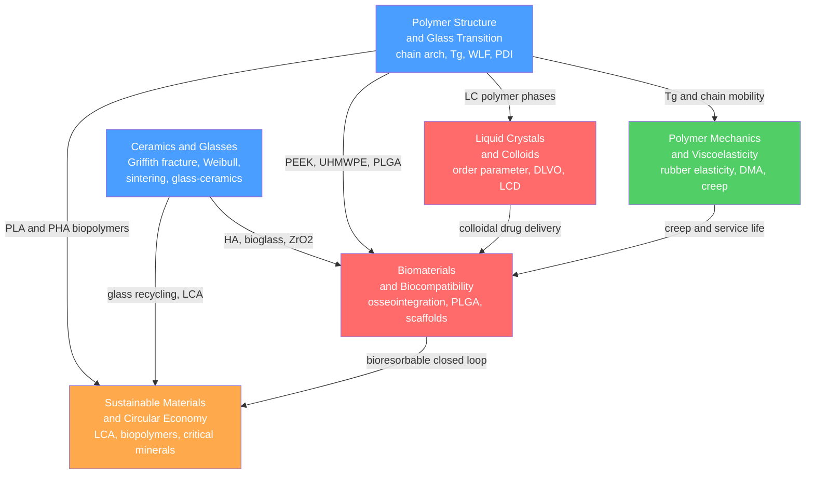

# Polymers, Ceramics, and Biomaterials — Map of Content

> [!info] How to use this map
> Start with **Fundamentals**, follow the arrows, and use the Learning Path below as your guide.
> Each node links to a full note. Come back to this map when you feel lost.

This section covers the two major non-metallic engineering material classes — polymers and ceramics — and extends into the soft-matter territory of liquid crystals and colloids, the applied frontier of biomaterials, and the cross-cutting lens of sustainability. The six notes together span from chain-level molecular physics and crystallographic structure all the way to clinical implant design and circular-economy strategy, forming a coherent arc from molecular origins to societal consequences.

---

## Concept Map

*(Blue = fundamental, Green = intermediate build, Red = advanced application, Orange = integrative capstone; arrows = "leads to" or "requires")*

---

## Learning Path

*Recommended order for a first pass through this topic:*

1. [[Polymer_Structure_and_Glass_Transition]] — start here to establish the molecular vocabulary: chain architecture, polydispersity index, tacticity, crystallinity, and the glass transition temperature that governs nearly every downstream polymer property; the WLF equation and Flory-Huggins theory are introduced at this stage
2. [[Polymer_Mechanics_and_Viscoelasticity]] — builds directly on Tg and WLF from note 1; adds entropic rubber elasticity, the Maxwell and Voigt spring-dashpot models, dynamic mechanical analysis, and time-temperature superposition — the engineering toolkit for predicting polymer behaviour over real service lifetimes
3. [[Ceramics_and_Glasses]] — parallel entry for the other major non-metallic class; Griffith fracture mechanics and Weibull reliability statistics contrast sharply with polymer ductility; sintering densification, transformation toughening in ZrO2, and piezoelectric perovskites complete the picture
4. [[Liquid_Crystals_and_Colloids]] — soft-matter bridge; the nematic order parameter and Frank elastic constants explain LCD switching via the Freedericksz transition; DLVO theory links electrostatic and van der Waals forces to colloidal stability, with direct relevance to pharmaceutical nanoparticles
5. [[Biomaterials_and_Biocompatibility]] — integrative application note drawing on all four preceding material classes; covers metallic, ceramic, and polymer implants, the Vroman protein-adsorption cascade, bioresorbable PLGA degradation kinetics, tissue engineering scaffold design, and fretting corrosion at modular junctions
6. [[Sustainable_Materials_and_Circular_Economy]] — capstone lens applied across all classes; Life Cycle Assessment methodology, Ashby eco-design charts, biobased PLA and PHA polymers, recycling thermodynamics constrained by the Second Law, critical minerals supply risk, and the Ellen MacArthur circular economy framework

---

## All Notes in This Topic

| Note | Key Concept | Level |
|------|-------------|-------|
| [[Polymer_Structure_and_Glass_Transition]] | Chain architecture, PDI, Tg, WLF equation, Flory-Huggins theory, Avrami crystallization | Intermediate |
| [[Polymer_Mechanics_and_Viscoelasticity]] | Rubber entropic elasticity, Maxwell/Voigt/SLS models, DMA, time-temperature superposition | Beginner to Advanced |
| [[Ceramics_and_Glasses]] | Griffith fracture, Weibull modulus, transformation toughening, sintering, glass-ceramics, perovskites | Intermediate |
| [[Liquid_Crystals_and_Colloids]] | Nematic order parameter, Frank elasticity, Freedericksz transition, DLVO theory, zeta potential | Advanced |
| [[Biomaterials_and_Biocompatibility]] | Osseointegration, Vroman effect, bioresorbable degradation, ISO 10993, tissue scaffolds | Advanced |
| [[Sustainable_Materials_and_Circular_Economy]] | LCA, embodied energy, PLA/PHA biopolymers, circular economy, critical minerals | Intermediate |

---

## Key Questions This Topic Answers

- Why do polymers become brittle below their glass transition temperature, and how does the WLF equation predict relaxation time across a hundred degrees of temperature change?
- What is the physical origin of rubber elasticity — why does a stretched rubber band stiffen on heating, opposite to every metal?
- Why do ceramics with hardness exceeding Mohs 9 shatter at stresses a thousand times below their theoretical cohesive strength, and what does Weibull statistics say about designing around this variability?
- How does transformation toughening in yttria-stabilised ZrO2 raise fracture toughness from 4 to 15 MPa m^0.5, and why does it vanish above 500 degrees C?
- What determines the nematic–isotropic clearing point of a liquid crystal, and why is the Freedericksz threshold voltage independent of cell thickness?
- Why does protein adsorption in the first milliseconds after implantation — the Vroman effect — determine whether a titanium implant osseointegrates or triggers chronic inflammation?
- How are PLGA degradation timelines tuned from weeks to years by adjusting copolymer ratio and molecular weight?
- What does Life Cycle Assessment reveal about the true cost of CFRP versus aluminium, and how does the Second Law set a thermodynamic floor on the energy needed to recycle any material?

---

## Connections to Other Topics

- [[_MOC_Mechanical_Properties]] — stress-strain fundamentals, fracture mechanics, and fatigue underpin the ceramic Griffith criterion, the polymer glassy-to-rubbery modulus drop, and implant load-bearing design across all six notes in this section
- [[_MOC_Nanotechnology_and_Nanomaterials]] — colloidal self-assembly from Liquid Crystals and Colloids and PLGA nanoparticles from Biomaterials connect directly to nanofabrication, quantum-confinement effects, and nanoparticle surface chemistry
- [[_MOC_Thermal_and_Phase_Behavior]] — glass transition, polymer crystal melting, and liquid-crystal mesophase transitions are all thermally driven phase phenomena; nucleation and growth theory from that section maps directly onto polymer spherulite crystallisation and ceramic sintering densification
- [[_MOC_MaterialsScience_Master]] — master entry point for the full Materials Science vault
