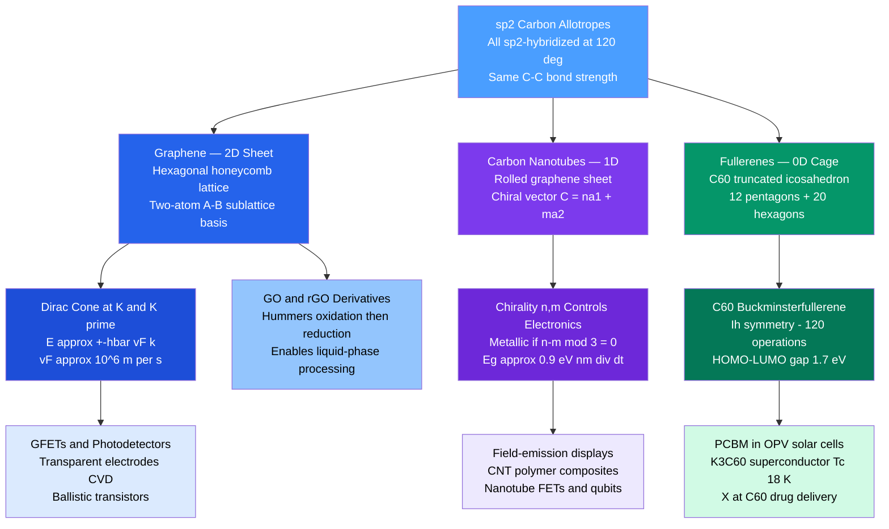

# Carbon Nanomaterials: Graphene, Nanotubes, and Fullerenes

> [!abstract] TL;DR
> Carbon's sp² hybridization produces three distinct nanostructures differing only in how the hexagonal sheet is folded: a flat 2D sheet (graphene), a seamless cylinder (carbon nanotube, CNT), or a closed cage (fullerene, C₆₀). Graphene's two-sublattice honeycomb lattice generates a **Dirac cone** band structure at the K and K' points of the Brillouin zone — a linear dispersion $E \approx \pm\hbar v_F|\mathbf{k}|$ with $v_F \approx 10^6$ m/s — making its charge carriers massless Dirac fermions with intrinsic mobility up to ~200,000 cm²/V·s. Carbon nanotubes inherit this band structure projected onto a cylinder; their $(n,m)$ chiral index dictates whether the tube is metallic or semiconducting with a tunable bandgap $E_g \approx 0.9\ \text{eV·nm}/d_t$. C₆₀ — a truncated icosahedron of 12 pentagons and 20 hexagons — is the 0D archetype, with a 1.7 eV HOMO-LUMO gap and rich chemistry enabling superconducting salts, photovoltaic acceptors, and drug delivery vectors.

---

## Intuition

**Analogy:** Start with a roll of hexagonal chicken-wire fencing — that is graphene: a single-atom-thick sheet of carbon in a honeycomb. Roll that sheet into a seamless cylinder and weld the edges shut — you have a carbon nanotube. Crumple the edges of the sheet inward, insert twelve pentagonal patches to fill the gaps and seal the ball completely — and you have a fullerene, the carbon soccer ball. The three allotropes are built from exactly the same $\text{sp}^2$ carbon-carbon bond (~524 kJ/mol, one of the strongest in nature), and differ only in topology. That topological distinction reshapes every electronic, mechanical, thermal, and optical property from the ground up.

What makes the chicken-wire analogy physically deep is the **two-sublattice structure** of the honeycomb. The lattice can be decomposed into two interlocking triangular sub-lattices (A and B), and the quantum interference between electron wavefunctions on A and B sites cancels exactly at the six corners of the Brillouin zone — the **K and K' points** — producing a gapless band crossing with linear (rather than parabolic) dispersion. Electrons there obey the 2D massless Dirac equation instead of Schrödinger's, behaving like photons trapped in a sheet — with all the relativistic consequences that follow.

---

## How It Works

### Core Mechanics

#### 1. Graphene: Lattice, Band Structure, and Dirac Physics

**Crystal structure.** Graphene forms a 2D hexagonal lattice with two carbon atoms per primitive unit cell — the A and B sublattices — connected by C–C bonds of length $a_{\text{CC}} = 0.142$ nm. The primitive lattice vectors are:

$$\mathbf{a}_1 = \frac{a}{2}\!\left(\sqrt{3},\; 1\right), \qquad \mathbf{a}_2 = \frac{a}{2}\!\left(\sqrt{3},\; -1\right)$$

where $a = a_{\text{CC}}\sqrt{3} = 0.246$ nm is the graphene lattice constant. The reciprocal lattice is also hexagonal; its two inequivalent high-symmetry corner points K and K' (the **Dirac points**) are located at $\mathbf{K} = (2\pi/a)(1/\sqrt{3},\, 1/3)$ and $\mathbf{K}' = (2\pi/a)(1/\sqrt{3},\, -1/3)$ in Cartesian coordinates.

**Tight-binding band structure.** Writing a Bloch Hamiltonian on the A-B basis with nearest-neighbor hopping parameter $\gamma_0 \approx 2.7$ eV gives:

$$H(\mathbf{k}) = \gamma_0\begin{pmatrix} 0 & f(\mathbf{k}) \\ f^*(\mathbf{k}) & 0 \end{pmatrix}, \qquad f(\mathbf{k}) = 1 + e^{i\mathbf{k}\cdot\mathbf{a}_1} + e^{i\mathbf{k}\cdot\mathbf{a}_2}$$

The two energy eigenvalues (valence and conduction bands) are:

$$\boxed{E_\pm(\mathbf{k}) = \pm\,\gamma_0\sqrt{3 + 2\cos(\mathbf{k}\cdot\mathbf{a}_1) + 2\cos(\mathbf{k}\cdot\mathbf{a}_2) + 2\cos\!\bigl(\mathbf{k}\cdot(\mathbf{a}_1-\mathbf{a}_2)\bigr)}}$$

At $\mathbf{k} = \mathbf{K}$, one can verify that the argument of the square root is exactly zero, so $E_\pm(\mathbf{K}) = 0$: the bands touch with **zero gap**. Expanding $\mathbf{k} = \mathbf{K} + \boldsymbol{\delta k}$ for small $|\boldsymbol{\delta k}|$ yields the **Dirac cone**:

$$E_\pm \approx \pm\hbar v_F|\boldsymbol{\delta k}|, \qquad v_F = \frac{\sqrt{3}\,\gamma_0\,a}{2\hbar} \approx 10^6\ \text{m/s} \approx \frac{c}{300}$$

The carriers near K satisfy the 2D massless Dirac equation $H = \hbar v_F\,\boldsymbol{\sigma}\cdot\mathbf{k}$, where $\boldsymbol{\sigma}$ are Pauli matrices acting on the A-B pseudospin. This pseudospin acquires a **Berry phase of $\pi$** on encircling a Dirac point, leading to: (i) suppression of backscattering (no $\mathbf{k} \to -\mathbf{k}$ scattering from smooth potentials); (ii) **Klein tunneling** — perfect transmission through electrostatic barriers regardless of height; (iii) a **half-integer anomalous quantum Hall effect** observable even at room temperature, with Hall conductivity $\sigma_{xy} = (4e^2/h)(n + 1/2)$.

**Exceptional properties.** The Dirac dispersion and strong sp² bonding conspire to produce an unprecedented combination:

| Property | Graphene value | Benchmark comparison |
|----------|---------------|---------------------|
| Intrinsic carrier mobility $\mu$ | ~200,000 cm²/V·s (suspended) | Si: 1,400; GaAs: 8,500 cm²/V·s |
| Thermal conductivity $\kappa$ | ~5,000 W/m·K | Cu: 400; diamond: 2,200 W/m·K |
| Young's modulus $E$ | ~1 TPa | Steel: 200 GPa; Kevlar: 125 GPa |
| Tensile strength | ~130 GPa | High-strength steel: ~0.4 GPa |
| Optical transmittance | 97.7% per layer | Each layer absorbs $\pi\alpha \approx 2.3\%$ |
| Impermeability | He-impermeable monolayer | One atom thick (~0.34 nm) |

The $2.3\%$ per-layer optical absorption follows directly from the Dirac cone: the universal value $\pi\alpha$ (where $\alpha \approx 1/137$ is the fine-structure constant) makes layer counting possible optically.

**Synthesis.** Three routes dominate:

1. **Mechanical exfoliation (Scotch-tape method):** Novoselov and Geim (2004, Nobel Prize 2010) repeatedly peeled graphite with adhesive tape onto SiO₂/Si wafers. Produces the highest-quality crystals ($\mu > 10^5$ cm²/V·s), but only millimeter-scale flakes — for research and device prototyping.

2. **CVD on Cu foil:** CH₄/H₂ gas at ~1000 °C on copper foil; the low carbon solubility in Cu self-limits growth to a monolayer. Wet-transfer to arbitrary substrates yields 30-inch films used in flexible electronics and touch-screen electrodes.

3. **Epitaxial growth on SiC:** Heating SiC above 1200 °C drives preferential Si sublimation, leaving graphene on the surface. Substrate-coupled quality is lower than CVD, but the approach is CMOS-compatible.

---

#### 2. Carbon Nanotubes: Rolling Graphene into 1D

**Chiral vector.** Conceptually, a single-wall carbon nanotube (SWCNT) is formed by rolling a graphene sheet so that the lattice point at the origin coincides with the lattice point at the **chiral vector**:

$$\mathbf{C} = n\mathbf{a}_1 + m\mathbf{a}_2 \equiv (n,m), \qquad n \geq m \geq 0$$

The circumference equals $|\mathbf{C}|$, giving tube diameter:

$$\boxed{d_t = \frac{|\mathbf{C}|}{\pi} = \frac{a}{\pi}\sqrt{n^2 + nm + m^2}}$$

For a $(10,10)$ armchair tube: $d_t = (0.246/\pi)\sqrt{300} \approx 1.36$ nm. The **chiral angle** $\theta = \arctan\!\left(\sqrt{3}m/(2n+m)\right)$ ranges from $0°$ (zigzag, $m=0$) to $30°$ (armchair, $n=m$).

**Electronic character from chirality.** Rolling imposes the quantization condition $\mathbf{k}\cdot\mathbf{C} = 2\pi p$ ($p \in \mathbb{Z}$) on allowed $k$-vectors, slicing the graphene BZ with parallel cutting lines. If a cutting line passes through a Dirac point K or K', the tube is **metallic**. Otherwise a gap opens:

| Chirality | Index | Always metallic? | Bandgap |
|-----------|-------|-----------------|---------|
| Armchair | $(n,n)$ | Yes — K point always on cutting line | 0 |
| Zigzag | $(n,0)$ | Yes if $n \bmod 3 = 0$ | 0 or $E_g \approx 0.9\ \text{eV·nm}/d_t$ |
| Chiral | $(n,m)$ general | Yes if $(n-m)\bmod 3 = 0$ | 0 or $E_g \approx 0.9\ \text{eV·nm}/d_t$ |

The bandgap formula:

$$E_g = \frac{2\gamma_0 a_{\text{CC}}}{d_t} \approx \frac{0.9\ \text{eV·nm}}{d_t}$$

is continuously tunable: a $(7,0)$ tube ($d_t \approx 0.55$ nm) gives $E_g \approx 1.6$ eV; a $(17,0)$ tube ($d_t \approx 1.33$ nm) gives $E_g \approx 0.67$ eV. Statistically ~$1/3$ of randomly grown SWCNTs are metallic and ~$2/3$ semiconducting — separation by chirality is a major processing challenge.

**Transport properties.** Metallic SWCNTs support **ballistic 1D transport** with a minimum conductance quantum of $G_0 = 4e^2/h \approx 155\ \mu\text{S}$ (two spin degeneracies $\times$ two Dirac cones) over lengths up to micrometers at room temperature. Their mechanical properties mirror graphene: Young's modulus ~1 TPa, tensile strength ~50 GPa.

Multi-wall CNTs (MWCNTs) consist of 2–50 coaxial SWCNTs spaced ~0.34 nm apart. They are produced in bulk by arc discharge or catalytic CVD but have more complex, less precisely defined electronic structure.

---

#### 3. Fullerenes: Closing the Sheet into 0D Cages

**C₆₀ structure.** Buckminsterfullerene C₆₀ is a closed cage of 60 carbon atoms arranged as a **truncated icosahedron** — the geometry of a soccer ball — with 12 pentagonal and 20 hexagonal faces, 60 vertices, and 90 edges. By **Euler's polyhedron theorem** ($V - E + F = 2$), any closed cage built from pentagons and hexagons requires *exactly* 12 pentagons regardless of the total number of hexagons. The **isolated pentagon rule (IPR)** — no two pentagons share an edge — is required for stability; C₆₀ is the smallest fullerene satisfying IPR. C₆₀ was discovered in 1985 by Kroto, Curl, and Smalley (Nobel Prize 1996) via laser ablation of graphite.

Two types of C–C bonds appear in C₆₀:
- **[6:6] bonds** (shared between two hexagons): $d = 1.40$ Å, stronger double-bond character
- **[6:5] bonds** (shared between a hexagon and a pentagon): $d = 1.45$ Å, weaker single-bond character

The $\pi$ electrons delocalize over the entire cage. The C₆₀ cage has icosahedral symmetry ($I_h$, 120 symmetry operations), making it the most symmetric molecule known.

**Electronic properties.** The HOMO level is 5-fold degenerate ($h_u$ symmetry) and fully occupied; the LUMO level is 3-fold degenerate ($t_{1u}$). The HOMO-LUMO gap is approximately $\mathbf{1.7}$ **eV** (optical onset ~700 nm). C₆₀ is an excellent **electron acceptor** with three accessible reduction states (C₆₀⁻, C₆₀²⁻, C₆₀³⁻).

**Derivatives and higher fullerenes:**

- **C₇₀:** Elongated cage ($D_{5h}$ symmetry); lower symmetry gives a richer absorption spectrum and is produced alongside C₆₀ in arc discharge synthesis.
- **Endofullerenes ($X$@C$_{60}$):** Atoms (La, N, noble gases, H₂) or small molecules trapped inside the cage with no covalent bonding. Used as MRI contrast agents and as spin qubits (N@C₆₀).
- **Fullerides:** Alkali-metal-doped C₆₀ solids. $\text{K}_3\text{C}_{60}$ donates three electrons into the $t_{1u}$ LUMO band, making a superconductor with $T_c = 18$ K; $\text{Cs}_3\text{C}_{60}$ under pressure reaches $T_c = 38$ K — the highest $T_c$ in any molecular superconductor.
- **PCBM** ([6,6]-phenyl-C₆₁-butyric acid methyl ester): a soluble functionalized C₆₀ derivative and the standard electron-acceptor component in bulk-heterojunction organic photovoltaic (OPV) cells (PCE up to ~12% in fullerene-based OPVs).

---

#### 4. Graphene Oxide and Reduced Graphene Oxide

**GO synthesis.** Graphite is chemically oxidized (Hummers method: KMnO₄/H₂SO₄ in ice) to insert hydroxyl (–OH), epoxide, and carboxyl (–COOH) functional groups on and at the edges of the carbon planes. The sp² network is disrupted, converting the conductor into an electrical insulator (~$10^{-3}$ S/m). GO is water-dispersible, enabling liquid-phase processing and thin-film deposition over large areas.

**rGO.** Partial reduction of GO — by thermal annealing, chemical reduction (hydrazine, ascorbic acid), or electrochemical treatment — restores sp² conjugation, raising conductivity to $10^3$–$10^4$ S/m. Residual oxygen groups allow covalent attachment of polymers, nanoparticles, and biomolecules. Neither GO nor rGO achieves pristine graphene crystallinity, but rGO is the practical workhorse for composite electrodes, flexible sensors, and supercapacitors at industrial scale.

---

### Flow / Architecture



---

## Key Concepts

### Secondary Level

**Three allotropes, one bond.** All three carbon nanomaterials use the same sp² C–C bond (120° bond angles). The dimensionality — 2D, 1D, or 0D — is entirely determined by how the sheet is topologically closed.

**Why is graphene special?** Silicon — the dominant semiconductor — has a parabolic band structure: carriers behave like slow, heavy electrons. Graphene's linear Dirac cone means carriers behave like massless photons in 2D: they travel at ~$10^6$ m/s regardless of gate voltage and scatter far less from impurities. This is why graphene transistors can operate at terahertz frequencies in principle.

**Nanotubes as molecular wires.** A metallic SWCNT with diameter ~1 nm and length ~1 µm has essentially zero electrical resistance — it is a 1D ballistic conductor. A bundle of aligned metallic SWCNTs would have a current capacity of ~$10^9$ A/cm², versus ~$10^6$ A/cm² for copper.

**The soccer ball molecule.** C₆₀ with its 12 pentagons and 20 hexagons is the same geometry as the classic black-and-white soccer ball. The carbon cage is 0.7 nm in diameter — about 40,000× smaller than the diameter of a human hair.

**Key properties summary:**

| Material | Dimensionality | Mobility (cm²/V·s) | $E$ Young (TPa) | Notable application |
|---------|--------------|------------------|-----------------|---------------------|
| Graphene | 2D | ~200,000 | ~1.0 | GFET, transparent electrode |
| Metallic SWCNT | 1D | ~100,000 (eff.) | ~1.0 | Ballistic interconnect |
| Semiconducting SWCNT | 1D | ~10,000 | ~1.0 | CNT-FET |
| C₆₀ | 0D | — | — | OPV acceptor (PCBM) |
| rGO | 2D (defective) | ~1,000–10,000 | ~0.25 | Composite, sensor |

---

### Undergraduate Level

**sp² hybridization and the $\pi$ system.** In graphene, each carbon is sp²-hybridized: three equivalent $\sigma$ bonds (in-plane, ~$120°$) hold the lattice together, and one unhybridized $p_z$ orbital perpendicular to the plane contributes to the $\pi$-band network. In an isolated graphene sheet, the 2D $\pi$ electrons are the charge carriers. The same sp² $p_z$ orbitals form $\pi$ bonds in benzene and graphite — graphene is the infinite-lattice limit of the polycyclic aromatic hydrocarbon series.

**Two-sublattice basis and the Hamiltonian.** The key reason graphene is different from, say, a triangular lattice is that nearest-neighbor hopping connects **only** A to B sites, never A to A or B to B. This off-diagonal Hamiltonian structure guarantees the eigenvalues come in $\pm$ pairs symmetric around $E=0$, and imposes the pseudospin constraint that gives the Berry phase. In a simple square lattice tight-binding model, you get a cosine band with no Dirac cone; the honeycomb geometry is essential.

**Graphene optical absorption: $\pi\alpha \approx 2.3\%$.** The optical conductance of graphene is $\sigma_\text{opt} = e^2/(4\hbar)$ — a universal constant set only by fundamental constants. The transmittance of a suspended graphene layer is $T = 1 - \pi\alpha \approx 97.7\%$. This was measured by simply looking at a graphene flake over a hole and measuring how much it darkened the transmitted light (Nair et al., *Science* 2008).

**CNT density of states (DOS) and van Hove singularities.** Quantizing the 2D graphene dispersion onto the cylinder creates 1D subbands. Each subband edge produces a **van Hove singularity** (sharp peak in DOS as $1/\sqrt{E-E_0}$) — observable as sharp peaks in optical absorption spectra ($S_{11}$, $S_{22}$ for semiconducting; $M_{11}$ for metallic transitions). Raman spectroscopy (radial breathing mode ~100–300 cm⁻¹, inversely proportional to $d_t$) is the standard tool for CNT diameter characterization.

**Hückel theory and C₆₀.** Treating C₆₀ as a 3D aromatic molecule, the 60 $p_z$ orbitals form 60 molecular orbitals. The HOMO ($h_u$, 5-fold degenerate, 10 electrons) sits 1.7 eV below the LUMO ($t_{1u}$, 3-fold degenerate). The electron affinity of C₆₀ is 2.68 eV — much larger than most organic molecules — making it an excellent acceptor. By contrast, the ionization potential is 7.6 eV, so C₆₀ is a poor donor.

**Kataura plot.** The transition energies $E_{ii}$ for CNTs are plotted versus tube diameter as the Kataura plot, which shows the characteristic "fan" pattern separating semiconducting $S_{11}$/$S_{22}$ from metallic $M_{11}$ families. This plot is the essential reference for assigning optical absorption and Raman resonances to specific chiralities.

---

### Graduate Level

**Topological protection and Berry phase consequences.** The Berry phase $\phi_B = \pi$ accumulated when an electron encircles a Dirac point in graphene has measurable consequences. (1) **Weak anti-localization (WAL):** in ordinary metals, coherent backscattering from impurities leads to weak *localization* (suppressed conductance). In graphene, the $\pi$ Berry phase reverses the sign of the quantum interference correction, giving WAL instead — a signature observable as a positive magnetoconductance at low temperature. (2) **Anomalous QHE:** the half-integer Hall conductivity $\sigma_{xy} = 4e^2/h(N + 1/2)$ cannot be explained by conventional Landau-level physics; it is a direct consequence of the non-trivial Berry phase. (3) **Klein tunneling:** a massless Dirac fermion is transmitted with unit probability through a potential step of arbitrary height perpendicular to the barrier — a relativistic phenomenon with no analogue in ordinary semiconductor 2DEGs.

**Strain engineering and pseudo-magnetic fields.** Non-uniform strain in graphene deforms the hopping integrals $\gamma_0 \to \gamma_0 + \delta\gamma$ asymmetrically, generating a pseudo-vector potential $\mathbf{A}_\text{ps}$ that acts like a magnetic field but with opposite sign at K and K'. Highly strained graphene nanobubbles (>300 pm height) can generate pseudo-magnetic fields exceeding 300 T — far beyond any laboratory magnet — with corresponding pseudo-Landau levels observable by scanning tunneling spectroscopy.

**Twisted bilayer graphene (TBG) and magic-angle superconductivity.** When two graphene layers are stacked with a relative twist angle $\theta \approx 1.1°$ (the "magic angle"), the moiré superlattice potential creates nearly flat electronic bands with bandwidth ~10 meV and an enhanced density of states. At this magic angle, correlated insulating states (at half-filling) and unconventional superconductivity ($T_c \sim 1$–$3$ K) emerge — a landmark result (Cao et al., *Nature* 2018) connecting graphene to strongly correlated electron physics.

**CNTs as Luttinger liquids.** In 1D, electron-electron interactions are not perturbative: the Fermi-liquid framework breaks down entirely and electrons fractionalize into independent charge and spin excitations (**spin-charge separation**). CNTs are among the cleanest experimental realizations of the **Tomonaga-Luttinger liquid (TLL)**: their tunneling DOS is predicted to scale as a power law $\rho(E) \propto |E|^{\alpha}$ (with exponent $\alpha \approx 0.3$–$0.6$ depending on screening). TLL behavior manifests as a power-law suppression of conductance at low temperature and zero bias, confirmed by multiple tunneling experiments.

**Fulleride superconductivity: orbital degeneracy and Jahn-Teller coupling.** In $\text{A}_3\text{C}_{60}$ (A = K, Rb, Cs), three electrons half-fill the 3-fold degenerate $t_{1u}$ LUMO band. The Mott-insulating phase of $\text{Cs}_3\text{C}_{60}$ at ambient pressure (which becomes superconducting at 38 K under pressure) highlights the competition between electron-electron correlations and phonon-mediated pairing. The key coupling is the **Jahn-Teller (JT) electron-phonon interaction**: distortion of the C₆₀ cage lifts the $t_{1u}$ orbital degeneracy and drives pairing, with the JT phonons playing the role of Cooper-pair glue. This is an example of orbital-physics-driven superconductivity outside the conventional BCS-McMillan picture.

**Graphene field-effect transistors (GFETs).** The ambipolar nature of graphene (both electrons and holes are carriers, controllable by gate voltage through the Dirac point) makes GFETs operate differently from MOSFET-style transistors: there is no "off state" unless a bandgap is engineered (e.g., by quantum confinement in graphene nanoribbons, or substrate interaction). The minimum conductivity is $\sigma_\text{min} \approx 4e^2/h$ regardless of disorder — a direct prediction of the Dirac spectrum confirmed by Novoselov et al. (*Nature* 2005). Practical RF-GFET devices have demonstrated $f_T > 300$ GHz, exploiting the high $v_F$ and low effective mass.

---

## Python Demo

```python
import numpy as np
import matplotlib.pyplot as plt

# -------------------------------------------------------------------
# Graphene nearest-neighbor tight-binding band structure
# Dispersion: E_pm(k) = pm gamma0 * |f(k)|
# |f(k)|^2 = 3 + 2cos(k.a1) + 2cos(k.a2) + 2cos(k.(a1-a2))
# Lattice vectors (a = 1 normalized):
#   a1 = (sqrt(3)/2,  1/2)
#   a2 = (sqrt(3)/2, -1/2)
# -------------------------------------------------------------------

a  = 1.0    # normalized lattice constant
g0 = 2.7    # eV, nearest-neighbor hopping gamma_0
a1 = np.array([np.sqrt(3) / 2.0,  0.5])
a2 = np.array([np.sqrt(3) / 2.0, -0.5])

def E_plus(kx, ky):
    """Upper (conduction) band energy of graphene tight-binding model."""
    kda1 = kx * a1[0] + ky * a1[1]
    kda2 = kx * a2[0] + ky * a2[1]
    f2   = 3.0 + 2.0 * np.cos(kda1) + 2.0 * np.cos(kda2) + 2.0 * np.cos(kda1 - kda2)
    return g0 * np.sqrt(np.maximum(f2, 0.0))

# High-symmetry k-points (Cartesian, a = 1)
Gamma = np.array([0.0,  0.0])
K_pt  = np.array([2 * np.pi / (np.sqrt(3) * a),  2 * np.pi / (3 * a)])   # Dirac point
Kp_pt = np.array([2 * np.pi / (np.sqrt(3) * a), -2 * np.pi / (3 * a)])   # K' point
M_pt  = np.array([2 * np.pi / (np.sqrt(3) * a),  0.0])                   # BZ edge midpoint

# Verify: E_plus at K should be 0
print(f"E_plus at Gamma = {E_plus(*Gamma):.3f} eV  (expected 3*gamma0 = {3*g0:.3f})")
print(f"E_plus at K     = {E_plus(*K_pt):.6f} eV  (expected 0)")
print(f"E_plus at M     = {E_plus(*M_pt):.3f} eV  (expected gamma0 = {g0:.3f})")

# -------------------------------------------------------------------
# Panel 1: 2D colormap of conduction band E_+(kx, ky)
# -------------------------------------------------------------------
N    = 600
kmax = 5.0
kx_1d = np.linspace(-kmax, kmax, N)
ky_1d = np.linspace(-kmax, kmax, N)
KX, KY = np.meshgrid(kx_1d, ky_1d)
EP     = E_plus(KX, KY)

# -------------------------------------------------------------------
# Panel 2: Band dispersion along Gamma -> K -> M -> Gamma
# -------------------------------------------------------------------
n_seg = 300   # k-points per segment

def make_seg(p1, p2):
    """Create n_seg k-points from p1 toward p2 (not including p2)."""
    t = np.linspace(0.0, 1.0, n_seg, endpoint=False)
    return p1 + np.outer(t, p2 - p1)

path = np.vstack([
    make_seg(Gamma, K_pt),
    make_seg(K_pt,  M_pt),
    make_seg(M_pt,  Gamma),
    Gamma.reshape(1, 2),
])

dk   = np.diff(path, axis=0)
arc  = np.concatenate([[0.0], np.cumsum(np.linalg.norm(dk, axis=1))])
E_up = E_plus(path[:, 0], path[:, 1])
E_dn = -E_up

# Tick positions at high-symmetry points
ticks      = [arc[0], arc[n_seg], arc[2 * n_seg], arc[-1]]
tick_labels = [r"$\Gamma$", "K", "M", r"$\Gamma$"]

# -------------------------------------------------------------------
# Plot
# -------------------------------------------------------------------
fig, axes = plt.subplots(1, 2, figsize=(13, 5))
fig.suptitle(
    r"Graphene Nearest-Neighbor Tight-Binding Band Structure ($\gamma_0 = 2.7$ eV)",
    fontsize=12,
)

# Left: 2D colormap
ax1 = axes[0]
pcm = ax1.pcolormesh(KX, KY, EP, cmap="inferno", shading="auto", vmin=0, vmax=g0 * 3)
plt.colorbar(pcm, ax=ax1, label=r"$E_+(k_x,\,k_y)$  (eV)")
ax1.scatter([K_pt[0], Kp_pt[0]], [K_pt[1], Kp_pt[1]],
            color="white", s=80, zorder=6, label="K, K'  Dirac points")
ax1.set_xlabel(r"$k_x$  (units of $1/a$)", fontsize=11)
ax1.set_ylabel(r"$k_y$  (units of $1/a$)", fontsize=11)
ax1.set_title(r"Conduction Band $E_+(k_x, k_y)$", fontsize=11)
ax1.set_aspect("equal")
ax1.set_xlim(-kmax, kmax)
ax1.set_ylim(-kmax, kmax)
ax1.legend(fontsize=8, loc="upper right")

# Right: Band dispersion along high-symmetry path
ax2 = axes[1]
ax2.plot(arc, E_up, "b-", lw=2.0, label=r"$E_+(k)$ — conduction band")
ax2.plot(arc, E_dn, "r-", lw=2.0, label=r"$E_-(k)$ — valence band")
ax2.axhline(0, color="k", lw=0.8, ls="--", alpha=0.5, label="Fermi level (undoped)")
for xv in ticks[1:-1]:
    ax2.axvline(xv, color="gray", lw=0.8, ls="--", alpha=0.4)
ax2.set_xticks(ticks)
ax2.set_xticklabels(tick_labels, fontsize=12)
ax2.set_ylabel("Energy (eV)", fontsize=11)
ax2.set_title(r"Dispersion along $\Gamma \to$ K $\to$ M $\to$ $\Gamma$", fontsize=11)
ax2.set_xlim(arc[0], arc[-1])
ax2.set_ylim(-9.0, 9.0)
ax2.legend(fontsize=9, loc="upper right")
ax2.annotate(
    "Dirac cone\n" + r"$E \approx \pm\hbar v_F|k|$",
    xy=(ticks[1], 0.0),
    xytext=(ticks[1] + 0.45, 3.5),
    arrowprops=dict(arrowstyle="->", color="black", lw=1.2),
    fontsize=9,
    ha="center",
)

plt.tight_layout()
plt.savefig("graphene_tight_binding_bands.png", dpi=150, bbox_inches="tight")
plt.show()
```

**Expected output:**
```
E_plus at Gamma = 8.100 eV  (expected 3*gamma0 = 8.100)
E_plus at K     = 0.000000 eV  (expected 0)
E_plus at M     = 2.700 eV  (expected gamma0 = 2.700)
```

The left panel shows the conduction band $E_+$ as an `inferno` colormap: dark spots at K and K' where the band touches zero (the Dirac points), bright regions at $\Gamma$ ($E = 3\gamma_0 = 8.1$ eV). The right panel shows the characteristic linear crossing at K — the Dirac cone — between the parabola-like bands near $\Gamma$ and $M$.

---

## Real-World Applications

> **Graphene field-effect transistors (GFETs) and RF electronics.** IBM demonstrated a GFET with $f_T = 155$ GHz on SiC in 2010, subsequently pushed past 300 GHz on diamond substrates. The high $v_F$ and low carrier effective mass ($m^* = 0$ at the Dirac point) allow intrinsic transit frequencies far beyond silicon at the same gate length. The challenge is the absence of a bandgap: GFETs cannot achieve the $10^6$–$10^7$ on/off current ratio required for digital logic, so their niche is **analog RF amplifiers** (radar, satellite communications) rather than binary computing.

> **CVD graphene as transparent conducting electrodes.** Samsung and other manufacturers demonstrated roll-to-roll CVD graphene on flexible PET substrates, achieving sheet resistance ~125 Ω/□ at 97.4% transmittance — competitive with ITO but on flexible, non-brittle, non-indium-containing substrates. Large-area GFET touchscreens and OLED electrodes are the target applications.

> **CNT field-emission displays (FEDs).** The sharp tip geometry of a SWCNT ($r \sim 0.5$ nm) generates field-enhancement factors $\beta \sim 10^4$, enabling cold electron emission at fields of ~$10^7$ V/m. Samsung developed prototype FEDs using aligned MWCNT arrays as cathodes. The emission current density exceeds $10^4$ mA/cm² — orders of magnitude above conventional thermionic cathodes.

> **CNT-reinforced polymer composites.** Adding 0.5–2 wt% MWCNTs to an epoxy matrix increases tensile strength by ~25% and fracture toughness by ~40% with virtually no weight penalty. CNT-reinforced CFRP overwrap is used on Boeing 787 secondary structures. The 1 TPa axial stiffness of MWCNTs is the highest known reinforcement modulus; the limitation is achieving dispersion and load transfer without agglomeration.

> **PCBM in organic photovoltaics (OPVs).** In the standard P3HT:PCBM bulk-heterojunction OPV cell, photoexcited excitons in the polymer donor diffuse to a P3HT/PCBM interface, where the large LUMO offset ($\Delta E_{\text{LUMO}} \approx 1.0$ eV) drives ultrafast charge transfer (~100 fs) to PCBM, separating electron and hole. The high electron mobility of PCBM (~$3 \times 10^{-3}$ cm²/V·s in thin films) and three-dimensional percolation network carry electrons to the cathode. PCE exceeds 6–8% for binary P3HT:PCBM, with non-fullerene acceptors (NFAs) now largely replacing PCBM at higher efficiency.

---

## Common Pitfalls

- **Confusing graphene's zero bandgap with metallic behavior.** Graphene is a **zero-gap semiconductor** (semimetal), not a metal. At exactly the Dirac point the DOS is zero (unlike in a metal where it is finite at $E_F$). The minimum conductivity $4e^2/h$ arises from evanescent wave transmission, not from a partially filled band. Calling graphene "metallic" leads to incorrect predictions about optical absorption, carrier statistics, and device behavior.

- **Applying the $(n-m)\bmod 3 = 0$ rule without accounting for curvature.** The strict metallic criterion assumes the graphene Dirac cones sit exactly at the K point. For small-diameter tubes ($d_t < 1$ nm), curvature effects shift the K point relative to the cutting lines, opening a small curvature-induced gap even in nominally "metallic" zigzag tubes (except armchair). Only armchair tubes are truly metallic for all diameters.

- **Using the bandgap formula $E_g \approx 0.9$ eV·nm/$d_t$ for large-diameter tubes.** This formula is derived from the zone-folding approximation of graphene. For $d_t > 3$ nm, many-body corrections, substrate screening, and environmental dielectric screening shift the actual optical gap significantly. Conversely, for $d_t < 0.5$ nm, rehybridization toward sp³ becomes non-negligible.

- **Treating GO as "oxidized graphene" interchangeable with graphene.** GO is structurally damaged: the sp² network is broken into isolated aromatic islands. Its properties (optical, mechanical, electrical) are dominated by defect sites and functional groups, not Dirac physics. There is no path from GO back to pristine graphene; rGO always retains residual defects that limit both mobility and thermal conductivity.

- **Assuming 1/3 metallic CNTs means 1/3 of the electrical current in a random film is metallic.** In a random SWCNT network, metallic tubes percolate at lower concentrations than semiconducting ones (lower percolation threshold), so even a small fraction of metallic tubes can dominate transport. Device engineers must either sort tubes chirally or chemically selectively destroy metallic species (e.g., by gas-phase oxidation).

- **Misidentifying the Madelung constant analogy for C₆₀ stability.** The stability of C₆₀ is often attributed to "aromaticity" using Hückel's $4n+2$ rule. C₆₀ has 60 $\pi$ electrons — far from $4n+2$ in the simple Hückel sense. Its stability comes from the IPR (isolated pentagons avoid antiaromatic $[4n]$ 5-membered rings adjacent to each other) and from the 3D closed-shell molecular orbital structure, not from simple planar aromaticity.

- **Forgetting that graphene's high mobility is observed only in ideal conditions.** The ~200,000 cm²/V·s mobility is measured in suspended graphene or hexagonal BN-encapsulated graphene at low temperature. On SiO₂ at room temperature, charged impurities and surface phonons limit mobility to ~10,000–15,000 cm²/V·s — still excellent, but two orders of magnitude below the intrinsic limit. Substrate engineering is critical for device performance.

---

## Related Concepts

**Same vault — Materials Science (confirmed backlinks):**
- [[Chemical_Bonding_in_Solids]] — sp² hybridization, $\pi$ vs $\sigma$ bonding, graphite as a vdW solid, band theory from LCAO; the bonding foundation of all three allotropes
- [[Crystal_Systems_and_Space_Groups]] — the 2D hexagonal space group $p6mm$ of graphene; translational symmetry and the two-atom basis that generate the Dirac cone
- [[Phonons_and_Lattice_Dynamics]] — acoustic and optical phonon branches of graphene (especially the A₁' Raman-active $G$-band at 1580 cm⁻¹ and $2D$-band); phonon-limited thermal conductivity and carrier scattering
- [[Defects_and_Dislocations_in_Crystals]] — Stone-Wales defects in graphene (pentagon-heptagon pair); vacancy-induced magnetic moments; effect of point defects on mobility and the $D$-band Raman peak
- [[Composite_Materials_and_Fiber_Reinforcement]] — CNT-reinforced polymers; graphene-platelet composites; rule-of-mixtures and critical-fiber-length considerations applied at the nanoscale
- [[Semiconductors_Intrinsic_and_Extrinsic]] — GFET operation, gate-tunable carrier density, and the analogy between electrostatic doping in graphene and doping in conventional semiconductors

**Cross-vault — Physics:**
- [[Crystal_Structure_and_Band_Theory]] — Bloch theorem, Brillouin zones, tight-binding model, and band gaps; the physics-level treatment underlying the graphene dispersion derived here
- [[Semiconductors_and_Devices]] — MOSFET vs GFET comparison, 1D quantum conductance $G_0 = 2e^2/h$, Landauer transport formalism applicable to CNTs and GFETs

**Cross-vault — Chemistry:**
- [[Chemical_Bonding_and_Molecular_Geometry]] — sp², sp³ hybridization, molecular orbital theory, HOMO-LUMO gaps; the molecular-scale foundation of C₆₀ chemistry
- [[Quantum_Chemistry_and_Atomic_Orbitals]] — Hückel MO theory for $\pi$ systems; benzene aromaticity extended to graphene and C₆₀; electron delocalization and HOMO-LUMO gaps
- [[Aromaticity_and_Electrophilic_Aromatic_Substitution]] — aromaticity and the isolated pentagon rule in fullerenes; chemical functionalization of graphene and CNT sidewalls via aromatic substitution chemistry

**Master MOCs:**
- [[_MOC_Physics_Master]] — condensed matter physics, quantum mechanics, and electromagnetism underlying Dirac cones, Berry phases, and quantum transport
- [[_MOC_Chemistry_Master]] — organic/physical chemistry of carbon allotropes, fullerene derivatives, and functionalization reactions

**Same vault — forward links (not yet created):**
- [[Nanoscale_Physics_and_Quantum_Confinement]] — quantum confinement in 0D and 1D nanostructures; the dimensional crossover from bulk semiconductor to quantum dot / nanotube
- [[Electronic_Band_Structure]] — full $E(\mathbf{k})$ dispersion, effective mass tensor, density of states, and optical matrix elements for 2D materials
- [[Two_Dimensional_Materials_Beyond_Graphene]] — hBN, MoS₂, WSe₂, black phosphorus: 2D materials that lack graphene's zero-gap and add valleys, spin-orbit coupling, and intrinsic bandgaps
- [[Nano_Electronics_and_MEMS_NEMS]] — NEMS resonators using CNTs and graphene; GFET circuits; fabrication at the nanoscale
- [[_MOC_Nanotechnology_and_Nanomaterials]] — section map of this nanotechnology folder

---

## Review Questions

1. **(Secondary / Undergraduate)** Graphene's optical transmittance is 97.7% per layer. (a) Explain physically why each layer absorbs exactly $\pi\alpha \approx 2.3\%$ of light, where $\alpha = e^2/(4\pi\varepsilon_0\hbar c) \approx 1/137$ is the fine-structure constant. (b) A stack of five graphene layers absorbs approximately how much of normally incident visible light? (c) Why does adding a sixth layer produce a nearly linear increment in absorption rather than a multiplicative decrease?

2. **(Undergraduate)** For a $(10,0)$ zigzag CNT: (a) Is it metallic or semiconducting? Justify using the $(n-m)\bmod 3$ rule and explain why by referencing the quantization condition $\mathbf{k}\cdot\mathbf{C} = 2\pi p$. (b) Calculate the diameter $d_t$ using $a = 0.246$ nm. (c) Calculate the predicted optical bandgap $E_g$ and state to what photon wavelength this corresponds. (d) A $(9,0)$ tube has the same diameter but different metallicity — explain the change.

3. **(Graduate)** Graphene's Berry phase is $\phi_B = \pi$. (a) Starting from the effective Dirac Hamiltonian $H = \hbar v_F(\sigma_x k_x + \sigma_y k_y)$, compute the eigenstates at a general momentum $\mathbf{k} = k(\cos\phi, \sin\phi)$ and show that the spinor acquires a phase of $\pi$ on encircling the origin in $\mathbf{k}$-space. (b) Explain why this Berry phase suppresses backscattering ($\mathbf{k} \to -\mathbf{k}$) from a smooth long-range impurity. (c) Predict the sign of the quantum correction to conductivity (weak localization or weak anti-localization) and explain what magnetoconductance experiment would distinguish graphene from a conventional 2DEG metal.

---

## Sources

- Novoselov, K. S. & Geim, A. K. et al. — "Electric Field Effect in Atomically Thin Carbon Films," *Science* **306**, 666–669 (2004) — original discovery of graphene by mechanical exfoliation; Nobel Prize 2010
- Castro Neto, A. H. et al. — "The electronic properties of graphene," *Reviews of Modern Physics* **81**, 109–162 (2009) — comprehensive review: lattice structure, Dirac Hamiltonian, Berry phase, transport
- Dresselhaus, M. S., Dresselhaus, G. & Eklund, P. C. — *Science of Fullerenes and Carbon Nanotubes* (Academic Press, 1996) — definitive reference for CNT chirality, zone-folding, Kataura plots, and C₆₀ electronic structure
- Saito, R., Dresselhaus, G. & Dresselhaus, M. S. — *Physical Properties of Carbon Nanotubes* (Imperial College Press, 1998) — tight-binding band structure, van Hove singularities, 1D quantization
- Kroto, H. W. et al. — "C₆₀: Buckminsterfullerene," *Nature* **318**, 162–163 (1985) — discovery paper for fullerenes; Nobel Prize 1996
- Nair, R. R. et al. — "Fine Structure Constant Defines Visual Transparency of Graphene," *Science* **320**, 1308 (2008) — $\pi\alpha$ absorption; optical transmittance measurement
- Cao, Y. et al. — "Unconventional superconductivity in magic-angle graphene superlattices," *Nature* **556**, 43–50 (2018) — magic-angle twisted bilayer graphene superconductivity
- Wallace, P. R. — "The Band Theory of Graphite," *Physical Review* **71**, 622–634 (1947) — original tight-binding band structure calculation for graphene

---

#materialsscience #graphene #carbonnanotubes #fullerenes #nanomaterials #diracfermions #tightbinding #sp2carbon #bandstructure #CNT #C60 #grapheneoxide #secondary #undergraduate #graduate
