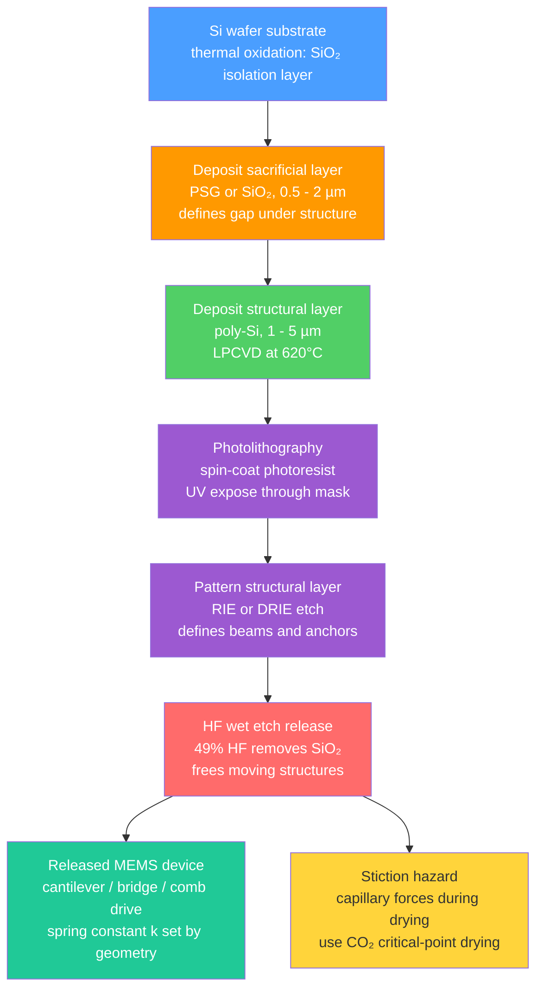

# Nano-Electronics and MEMS/NEMS

> [!abstract] TL;DR
> Nano-electronics extends transistor scaling to quantum-mechanical regimes (FinFETs, gate-all-around nanosheets, single-electron transistors) while MEMS/NEMS marry semiconductor fabrication techniques to mechanical structures — etching complete springs, gears, and resonators onto silicon chips — enabling everything from the accelerometer in your phone to zeptogram-resolution mass sensors.

---

## Intuition

**Analogy:** Imagine a master watchmaker who, instead of carving gears from brass under a loupe, pours chemicals over a silicon wafer and watches an entire clockwork mechanism emerge from the etching of sacrificial layers — gears, springs, and pivot bearings all defined by light through a photomask. That is MEMS: the full vocabulary of mechanical engineering (springs, masses, dampers, resonators) miniaturised to micrometre dimensions on a chip the size of your fingernail. Shrink those same springs to nanometre scale and the resonator's natural frequency climbs from kilohertz into gigahertz, its mass sensitivity reaching individual molecules — that is NEMS.

The electronics side follows the same logic of miniaturisation: Intel's first transistor in 1971 was about 10 µm wide; a 2 nm-node nanosheet transistor in 2024 is narrower than a strand of DNA. At these scales, classical drift-diffusion physics gives way to quantum transport — electrons tunnel, their wave nature sets a minimum conductance quantum, and even adding a single electron to a tiny island can block all current (Coulomb blockade).

---

## How It Works

### Core Mechanics

**MOSFET scaling law:** A planar MOSFET's switching speed and density both improve as the gate length $L_g$ shrinks. Moore's law (empirical, 1965) observed transistor count doubling roughly every 18 months. But scaling exposes short-channel effects:

- **Drain-induced barrier lowering (DIBL):** The drain potential lowers the source-side potential barrier, effectively reducing the threshold voltage $V_{th}$ at high $V_{DS}$. DIBL = $\Delta V_{th}/\Delta V_{DS}$ (mV/V), worsening as $L_g$ shrinks.
- **Subthreshold slope limit:** The subthreshold swing $S = (k_BT/e)\ln 10 \times (1 + C_{dep}/C_{ox})$ has a thermodynamic floor of $60\,\text{mV/decade}$ at 300 K, regardless of geometry. Below this slope, transistors cannot switch faster without raising $V_{DD}$ — the root cause of the power wall.

**Advanced transistor architectures** solve these by maximising gate electrostatic control over the channel:

| Architecture | Gate geometry | Node | Key benefit |
|---|---|---|---|
| Planar MOSFET | One gate above channel | 28 nm and older | Simple fabrication |
| FinFET | Gate wraps three sides of a fin | 14 nm → 5 nm | Reduced DIBL, lower leakage |
| Gate-all-around (GAA) nanosheet | Gate encircles all four sides of stacked sheets | 3 nm → 2 nm | Maximum electrostatic control; tunable sheet width |

**MEMS cantilever mechanics:** A rectangular cantilever beam of length $L$, width $w$, thickness $t$, Young's modulus $E$, and density $\rho$ obeys:

$$k = \frac{Ewt^3}{4L^3} \quad \text{(spring constant, point load at tip)}$$

$$f_0 = \frac{0.162}{L^2}\sqrt{\frac{Et^2}{\rho}} \quad \text{(first flexural resonance, clamped-free)}$$

The prefactor $0.162 = \beta_1^2/(2\pi\sqrt{12})$ where $\beta_1 = 1.8751$ is the first eigenvalue of the Euler-Bernoulli beam equation. The key scaling: $f_0 \propto t/L^2$, so shortening $L$ by $10\times$ raises frequency $100\times$.

The quality factor $Q$ measures energy stored relative to energy dissipated per radian:

$$Q = \frac{\omega_0 m_{\text{eff}}}{\gamma} = \frac{f_0}{\Delta f_{3\text{dB}}}$$

MEMS devices in air have $Q \approx 10\text{–}100$; in vacuum they reach $Q \approx 10^4\text{–}10^6$.

### MEMS Fabrication Flow



---

## Key Concepts

### Secondary

**What is MEMS?**
Microelectromechanical systems (MEMS) use the same photolithography, deposition, and etching tools as microelectronics to build mechanical structures at the 1–1000 µm scale. The structures — beams, membranes, gears, pumps — move: they flex, vibrate, or deflect in response to force, pressure, or acceleration. Silicon is the preferred structural material because (a) its Young's modulus ($E \approx 170$ GPa along $\langle 110\rangle$) is high and uniform, (b) it is nearly perfectly elastic with no fatigue under normal operation, and (c) it can be integrated with CMOS readout circuits on the same die.

**Two micromachining strategies:**

- **Surface micromachining:** Build up alternating structural and sacrificial layers on top of a substrate, then etch away the sacrificial layers to release the structure. The final device sits above the substrate on thin anchoring feet. Advantage: compatible with CMOS back-end processes. Used in: MEMS microphones (Knowles, TSMC-MEMS), comb-drive gyroscopes.
- **Bulk micromachining:** Etch directly into the silicon substrate (from front or back) to remove large volumes of material. Produces thicker, stronger structures. Techniques: KOH wet etching (anisotropic, reveals {111} planes), deep reactive ion etching (DRIE/Bosch process). Used in: pressure sensors, accelerometer proof masses.

**Common MEMS devices in consumer electronics:**

| Device | Sensing principle | Product examples |
|---|---|---|
| Accelerometer | Capacitance change of comb-drive proof mass | iPhone, AirPods, airbag triggers |
| Gyroscope | Coriolis-induced coupling between two vibration modes | Drone stabilisation, AR/VR headsets |
| MEMS microphone | Pressure deflects a thin membrane, changes capacitance | iPhone earpiece, AirPods, hearing aids |
| Pressure sensor | Membrane deflection vs piezoresistive gauges | Altimeters, barometric weather apps |
| MEMS mirror (LiDAR) | Electrostatic or electromagnetic tip-tilt of mirror | Waymo LiDAR, optical switching |

**Moore's Law in simple terms:**
Gordon Moore observed in 1965 that the number of transistors on a chip doubled roughly every 18 months. This held for ~50 years primarily through optical lithography using ever-shorter wavelengths (from 365 nm mercury lamps to 13.5 nm EUV) and clever device architectures. A modern Apple M4 chip has approximately 28 billion transistors in an area the size of a thumbnail.

---

### Undergraduate

**FinFET and gate-all-around (GAA) nanosheet transistors:**

The key metric for transistor control is the **natural length** $\lambda$, which sets how far drain fields penetrate under the gate:

$$\lambda \approx \sqrt{\frac{\varepsilon_{Si}}{\varepsilon_{ox}} \cdot t_{Si} \cdot t_{ox}}$$

A short $\lambda$ means good electrostatic control and suppressed DIBL. Thinning the channel body (FinFET fin width $t_{Si}$) directly reduces $\lambda$. In a GAA nanosheet, the gate encircles all four faces of each nanosheet — minimising $t_{Si}$ in all directions and giving $\lambda$ values below 5 nm even at the 2 nm process node (Samsung SF2, TSMC N2, Intel 20A/18A).

**NEMS and the mass sensing principle:**

A doubly-clamped beam or cantilever vibrating at resonance acts as an ultrasensitive balance. Adding a small mass $\delta m$ to an effective mass $m_{\text{eff}}$ shifts the resonant frequency:

$$\frac{\delta f}{f_0} \approx -\frac{\delta m}{2\, m_{\text{eff}}}$$

Carbon nanotube resonators ($m_{\text{eff}} \sim 10^{-21}$ kg) achieve **zeptogram** ($10^{-21}$ g) resolution — sufficient to weigh a single protein molecule. Graphene membranes push even lower because their $m_{\text{eff}}$ is the mass of a single atomic layer.

**Deep reactive ion etching — the Bosch process:**

Conventional RIE etches isotropically in the lateral direction, which limits aspect ratio. The Bosch process alternates two steps cyclically (each 5–15 s):

1. **Etch step:** SF₆ plasma etches Si isotropically, deepening the trench.
2. **Passivation step:** C₄F₈ deposits a thin fluorocarbon polymer layer on all surfaces.

At the next etch step, the ion bombardment preferentially sputters the polymer off horizontal surfaces (the trench floor) while the sidewalls remain protected — giving nearly vertical walls with aspect ratios up to 50:1. The characteristic scalloping of Bosch-etched sidewalls (amplitude 100–500 nm) can be reduced by shortening the step times.

**Quality factor in MEMS:**

Dominant loss mechanisms and how to mitigate them:

| Loss mechanism | Physical origin | Mitigation |
|---|---|---|
| Thermoelastic damping (TED) | Local temperature gradients caused by bending create irreversible heat flow | Operate at $f_0 \gg$ thermal relaxation frequency |
| Viscous (squeeze-film) damping | Air film between vibrating plate and substrate absorbs energy | Operate in vacuum; perforate the plate |
| Support (clamping) loss | Energy radiates into substrate at anchor points | Optimise anchor stiffness; use phononic shields |
| Surface loss | Surface oxides and adsorbates dissipate at sub-nm motion amplitudes | H-terminate surfaces; operate in ultra-high vacuum |

---

### Graduate

**Quantum transport and the Landauer formula:**

At nanometre gate lengths, the channel is shorter than the electron mean free path $\ell = v_F \tau$ (in silicon at 300 K, $\ell \approx 10\text{–}20$ nm). Electrons traverse the channel without scattering — **ballistic transport**. In this regime, current is limited not by bulk resistivity but by the availability of quantum channels (transverse modes) and their transmission probability $\mathcal{T}$.

The Landauer formula gives the conductance of a single quantum channel:

$$G = \frac{2e^2}{h}\,\mathcal{T} = G_0\,\mathcal{T}$$

where $G_0 = 2e^2/h \approx 77.5\,\mu\text{S}$ is the **conductance quantum** (resistance $R_0 = h/2e^2 \approx 12.9\,\text{k}\Omega$). For $N$ parallel channels each with transmission $\mathcal{T}$:

$$G = N\,\frac{2e^2}{h}\,\mathcal{T}$$

In practice, even a "perfect" conductor has contact resistance $R_{\text{contact}} = h/(2e^2 N)$ at each metal-semiconductor interface — an irreducible quantum limit. For $N = 1$, $R_{\text{contact}} = 12.9\,\text{k}\Omega$ per contact. This **contact resistance** dominates in nanowire and CNT-FET devices and is a major challenge for 2 nm node technology.

**Single-electron transistor (SET) and Coulomb blockade:**

A SET consists of a nanometre-scale metallic or semiconducting island connected to source and drain through tunnel junctions (capacitances $C_1$, $C_2$) and capacitively coupled to a gate ($C_g$). The electrostatic energy to add one electron to the island with total capacitance $C_\Sigma = C_1 + C_2 + C_g$:

$$E_C = \frac{e^2}{2C_\Sigma}$$

For **Coulomb blockade** to block current, the charging energy must exceed thermal fluctuations:

$$E_C \gg k_BT \implies C_\Sigma \ll \frac{e^2}{2k_BT} \approx 3\,\text{aF at 300 K}$$

This sets a severe constraint: room-temperature operation requires islands below ~10 nm. In practice, SETs operate at cryogenic temperatures (4 K or millikelvin) where $k_BT \ll E_C$ even for larger islands.

**Coulomb oscillations:** As the gate voltage $V_g$ is swept, the electrostatic energy of the island oscillates. Conductance peaks occur whenever the charge states $N$ and $N+1$ electrons are degenerate in energy — approximately periodically with period $\Delta V_g = e/C_g$. Between peaks, current is exponentially suppressed (Coulomb blockade).

The **single-electron addition spectrum** maps directly to the discrete quantum energy levels of the island when the latter is small enough (quantum dot). Spacing between levels: $\Delta E \sim \hbar^2\pi^2/(2m^*L^2)$ for a 1D box, which becomes experimentally resolvable at island sizes below ~50 nm.

**NEMS: carbon nanotube and graphene resonators:**

A single-walled carbon nanotube (SWCNT, diameter ~1 nm, length ~1 µm) suspended between contacts and electrostatically driven is a prototypical NEMS resonator. Its effective mass is of order $m_{\text{eff}} \sim \rho_{\text{CNT}} \cdot \pi r^2 L \approx 10^{-21}$ kg. The resonance frequency reaches 1–4 GHz for sub-micron tubes.

Graphene membranes (single atomic layer, $\rho_s = 7.6 \times 10^{-7}$ kg/m²) have even lower effective mass per area. Under tension $T$ (N/m), the fundamental drumhead mode:

$$f_0 = \frac{0.765}{D}\sqrt{\frac{T}{\rho_s}}$$

where $D$ is drum diameter. NEMS graphene resonators have demonstrated room-temperature mass resolution of ~1 zg (10⁻²¹ g), enabling single-molecule detection.

**Stiction in MEMS — physics of adhesion at the microscale:**

When a released MEMS beam is dried from a wet etch, the liquid surface tension creates a capillary pressure $P = 2\gamma\cos\theta / d$ (where $d$ is gap, $\gamma$ surface tension, $\theta$ contact angle). For a gap of 1 µm with water ($\gamma = 72$ mN/m, $\theta = 0$): $P \approx 0.14$ MPa, producing a pull-down force that can permanently contact the beam to the substrate — **stiction**. Once surfaces contact, van der Waals and hydrogen bonding hold them. Solutions include supercritical CO₂ drying (eliminates liquid-vapour interface entirely), self-assembled monolayer (SAM) coatings to raise contact angle, and dimple structures that limit contact area.

---

## Python Demo

```python
import numpy as np
import matplotlib.pyplot as plt

# ---------------------------------------------------------------
# MEMS cantilever: resonant frequency f0 vs beam length L
# for three thicknesses (0.1, 0.5, 1.0 µm) in silicon
# Formula: f0 = (0.162 / L^2) * sqrt(E * t^2 / rho)
# ---------------------------------------------------------------

# Silicon material properties (MEMS-relevant orientation)
E_Si = 170e9      # Young's modulus [Pa], <110> direction
rho_Si = 2330.0   # Density [kg/m^3]

# Beam thicknesses
thicknesses_m = [0.1e-6, 0.5e-6, 1.0e-6]  # metres
labels = ["t = 0.1 µm", "t = 0.5 µm", "t = 1.0 µm"]
colors = ["#1f77b4", "#d62728", "#2ca02c"]

# Cantilever length range: 1 to 500 µm
L = np.linspace(1e-6, 500e-6, 1000)

fig, axes = plt.subplots(1, 2, figsize=(13, 6))

# --- Left panel: frequency vs length ---
ax = axes[0]
for t, lbl, col in zip(thicknesses_m, labels, colors):
    f0 = (0.162 / L**2) * np.sqrt(E_Si * t**2 / rho_Si)
    ax.semilogy(L * 1e6, f0 / 1e3, label=lbl, color=col, linewidth=2.5)

ax.axhspan(1, 100, alpha=0.08, color="blue",
           label="MEMS sensor range (kHz)")
ax.axhspan(1e3, 1e6, alpha=0.08, color="orange",
           label="NEMS range (MHz–GHz)")
ax.set_xlabel("Cantilever Length L (µm)", fontsize=12)
ax.set_ylabel("Resonant Frequency f₀ (kHz)", fontsize=12)
ax.set_title("MEMS Cantilever Resonant Frequency\n(clamped-free, first flexural mode)", fontsize=11)
ax.legend(fontsize=10)
ax.grid(True, which="both", alpha=0.3)
ax.set_xlim(1, 500)
ax.set_ylim(0.01, 1e6)

# --- Right panel: spring constant vs length ---
ax2 = axes[1]
w = 10e-6  # fixed width 10 µm
for t, lbl, col in zip(thicknesses_m, labels, colors):
    k = E_Si * w * t**3 / (4 * L**3)
    ax2.loglog(L * 1e6, k, label=lbl, color=col, linewidth=2.5)

ax2.axhline(0.1, color="gray", linestyle=":", linewidth=1.2)
ax2.text(1.5, 0.12, "AFM cantilever range", fontsize=8, color="gray")
ax2.set_xlabel("Cantilever Length L (µm)", fontsize=12)
ax2.set_ylabel("Spring Constant k (N/m)", fontsize=12)
ax2.set_title("Spring Constant vs Length\n(width w = 10 µm, Si)", fontsize=11)
ax2.legend(fontsize=10)
ax2.grid(True, which="both", alpha=0.3)
ax2.set_xlim(1, 500)

plt.suptitle("Silicon MEMS Cantilever: Mechanical Properties vs Geometry",
             fontsize=13, fontweight="bold", y=1.02)
plt.tight_layout()
plt.savefig("mems_cantilever_properties.png", dpi=150)
plt.show()

# Numerical summary at L = 100 µm, w = 10 µm
print("At L = 100 µm, w = 10 µm (silicon):")
print(f"{'Thickness':>12}  {'f0 (kHz)':>10}  {'k (N/m)':>10}")
print("-" * 36)
L_ref = 100e-6
for t, lbl in zip(thicknesses_m, labels):
    f0 = (0.162 / L_ref**2) * np.sqrt(E_Si * t**2 / rho_Si)
    k  = E_Si * w * t**3 / (4 * L_ref**3)
    print(f"{lbl:>12}  {f0/1e3:>10.1f}  {k:>10.4f}")

# Mass sensitivity: delta_m = 2 * m_eff * |delta_f / f0|
# For t=1 µm cantilever at L=100 µm, w=10 µm
t_ref = 1e-6
m_eff = 0.243 * rho_Si * w * t_ref * L_ref  # effective mass = 0.243 * total mass
f0_ref = (0.162 / L_ref**2) * np.sqrt(E_Si * t_ref**2 / rho_Si)
print(f"\nMass sensitivity (t=1µm, L=100µm, w=10µm):")
print(f"  Effective mass m_eff = {m_eff*1e15:.2f} fg")
delta_f_min = 1.0  # assume 1 Hz frequency resolution
delta_m = 2 * m_eff * delta_f_min / f0_ref
print(f"  At 1 Hz resolution: delta_m = {delta_m*1e18:.2f} ag (attogram)")
```

**What to observe:**
- $f_0$ spans kHz (long, thin cantilevers) to tens of MHz (short or thick). The $1/L^2$ dependence is steep on the log scale.
- Doubling thickness doubles $f_0$ (linear) but raises spring constant 8-fold (cubic) — a stiff, fast beam at the cost of needing larger drive forces.
- Spring constants span $10^{-4}$ to $10^3$ N/m: lighter than AFM cantilevers for sensing, stiffer for inertial MEMS. This tunability is the design space of MEMS engineering.
- The 100 µm / 1 µm thick cantilever shows attogram mass sensitivity — sufficient for detecting adsorbed protein layers.

---

## Real-World Applications

> **Example 1 — iPhone accelerometer (Analog Devices ADXL series / STMicroelectronics LIS series):** The accelerometer in every iPhone uses a surface-micromachined polysilicon proof mass suspended on folded springs, forming one plate of a differential capacitor ($\Delta C \sim 1\text{–}10$ fF per g of acceleration). The proof mass is ~100 µg, the spring constant ~1 N/m, and the resonant frequency ~1–3 kHz — well above audio frequencies to avoid false triggers. The Bosch process etches the comb fingers with aspect ratios of ~20:1. The entire mechanical and readout IC is co-packaged in a 2 × 2 mm footprint.

> **Example 2 — TSMC 2 nm GAA nanosheet (N2 process, 2025):** TSMC's N2 node uses stacked gate-all-around nanosheets — typically 3–4 sheets of Si, each ~5 nm thick and ~20–30 nm wide, with a high-κ/metal gate (HfO₂ / TiN) deposited by ALD wrapping all four faces. Each nanosheet is a quantum-mechanically confined channel: transverse quantisation lifts the subband by $\Delta E \sim \hbar^2\pi^2/(2m^* t^2) \approx 100\text{–}200$ meV, effectively increasing the band gap and reducing leakage. Contact resistance is managed by epitaxially grown Si:P (n-type) or Si:B (p-type) source/drain with in-situ doping.

> **Example 3 — Carbon nanotube mass spectrometer (Caltech/NIST):** CNT-based NEMS resonators in ultrahigh vacuum (UHV) at 4 K have demonstrated atomic-scale mass sensitivity. By monitoring the stochastic frequency jumps caused by single molecules landing on or desorbing from the CNT surface, researchers have measured the mass of individual gold atoms, xenon atoms, and protein fragments — turning a resonant beam into a mass spectrometer without ionisation. This was demonstrated by Chaste et al. (*Nature Nanotechnology*, 2012) with resolution reaching 1.7 yg (yoctogram = $10^{-24}$ g).

> **Example 4 — MEMS gyroscope in Waymo LiDAR and consumer drones:** MEMS gyroscopes exploit the Coriolis effect: a proof mass driven to vibrate in one axis experiences a Coriolis force along a perpendicular axis when the device rotates. Reading out the secondary vibration amplitude with a capacitive sense comb gives rotation rate. Modern MEMS gyroscopes (InvenSense/TDK, Bosch) achieve angle random walk below $0.01°/\sqrt{\text{hr}}$, enabling inertial navigation accurate to metres over minutes — without GPS.

---

## Common Pitfalls

- **Ignoring the subthreshold slope floor.** Many students assume transistors can be made arbitrarily fast by reducing supply voltage. The 60 mV/decade limit means a transistor switching across its full threshold voltage range (~300 mV) requires at least 5 decades of current change — setting the practical trade-off between speed, voltage, and leakage.

- **Confusing MEMS resonant frequency with bandwidth.** A MEMS accelerometer has resonant frequency $f_0 \sim 1\text{–}10$ kHz, but its usable sensing bandwidth is typically only $f_0/2Q \sim 10\text{–}500$ Hz. Operating near resonance amplifies the signal but makes the sensor highly sensitive to mechanical shocks — the device must be designed to survive being dropped.

- **Applying the bulk Young's modulus to thin films.** Thin-film poly-Si has a Young's modulus 10–20% lower than bulk single-crystal Si due to grain boundary effects and residual deposition stress. Residual stress (tensile or compressive) shifts $f_0$ significantly: a tensile pre-stress $\sigma_0$ adds a term $\propto \sigma_0 / (\rho L^2)$ to $f_0^2$. Always measure the actual film modulus and stress before designing a resonator.

- **Stiction during wet release.** Forgetting to use critical-point drying or SAM anti-stiction coatings leads to yield loss from in-process stiction. Even after a functional release, in-use stiction occurs if shock or electrostatic pull-in force brings surfaces into contact.

- **Misapplying the Landauer formula.** The Landauer formula $G = (2e^2/h)\mathcal{T}$ gives the two-terminal conductance including contact resistance. The intrinsic conductance of a 1D channel is infinite in the ballistic limit — the measured resistance is purely from the contacts. Forgetting this leads to the paradox of a "perfect wire" having non-zero resistance.

- **Room-temperature Coulomb blockade requires aF capacitances.** Students often design SET circuits at room temperature using micrometer-scale islands. The charging energy $E_C = e^2/2C$ must exceed $k_BT \approx 26$ meV at 300 K, requiring $C < 3$ aF — a sub-10 nm island. Islands of 100 nm have $C \sim 10$ aF and require cooling to below ~10 K. Coulomb blockade experiments at 300 K use molecular junctions or single atoms as islands.

- **DRIE scalloping causing stress concentration.** The Bosch-process scallops on etch sidewalls are not merely cosmetic: they act as notches that concentrate stress under bending. Fatigue failure in high-cycle MEMS resonators often initiates at scallop roots. For high-reliability applications, a brief isotropic smoothing etch is applied after DRIE.

---

## Related Concepts

**Existing notes:**
- [[Semiconductors_Intrinsic_and_Extrinsic]] — Carrier concentration, doping, and band gap in Si: the electronic substrate upon which all MOSFET scaling builds; quantum confinement at the 2 nm node modifies the effective band gap just as doping does
- [[Semiconductors_and_Devices]] — Physics-vault companion covering p-n junctions, MOSFETs, and heterostructures at the device-physics level; complements the fabrication and quantum-transport perspective here
- [[Crystal_Structure_and_Band_Theory]] — Band structure and effective mass determine subband energies in GAA nanosheets; Bloch states underlie the transmission probability in the Landauer formula
- [[Stress_Strain_and_Elastic_Moduli]] — Young's modulus $E$ appears directly in the cantilever spring constant $k$ and resonance frequency $f_0$; thin-film stress modifies both
- [[Oscillations_and_SHM]] — MEMS resonators are damped harmonic oscillators; the quality factor $Q$ and resonance width $\Delta f = f_0/Q$ follow directly from SHM with damping
- [[Quantum_Harmonic_Oscillator]] — At the NEMS scale, a resonator in its quantum ground state has zero-point motion amplitude $x_{\text{zpf}} = \sqrt{\hbar/2m_{\text{eff}}\omega_0}$; measuring and controlling this is the frontier of quantum NEMS
- [[_MOC_Physics_Master]] — Physics master index linking condensed matter, quantum mechanics, and mechanics notes cross-referenced here

**Forward links (planned notes in this vault series):**
- [[p_n_Junctions_and_Diodes]] — The p-n junction is the building block of MOSFET source-drain engineering; DIBL is a direct short-channel perturbation of the junction barrier
- [[Nanoscale_Physics_and_Quantum_Confinement]] — Quantum confinement energy $\Delta E \sim \hbar^2\pi^2/(2m^*L^2)$ sets the subband structure of nanowire and nanosheet channels; ballistic transport emerges when $L < \ell$
- [[Carbon_Nanomaterials_Graphene_Nanotubes_Fullerenes]] — CNT mechanical resonators are prototypical NEMS devices; CNT-FETs are single-channel Landauer conductors with near-ideal $\mathcal{T}$
- [[Two_Dimensional_Materials_Beyond_Graphene]] — MoS₂ and other TMDs are explored as 1-nm-thick channel materials for beyond-silicon GAA transistors; their piezoelectric properties enable MEMS sensing
- [[_MOC_Nanotechnology_and_Nanomaterials]] — Section map for nanotechnology and nanomaterials notes

---

## Review Questions

**Secondary:**
1. A MEMS accelerometer cantilever is 200 µm long, 10 µm wide, and 2 µm thick (silicon). Using $k = Ewt^3/4L^3$ and $E = 170$ GPa, compute its spring constant. If a proof mass of 1 µg is attached at the tip, what acceleration (in g) is needed to deflect the tip by 1 nm?

**Undergraduate:**
2. A FinFET at the 7 nm node has a subthreshold swing of 65 mV/decade and a DIBL of 80 mV/V. (a) Explain physically why the swing exceeds the 60 mV/decade limit. (b) If $V_{DD}$ is reduced from 0.7 V to 0.5 V to cut dynamic power by $\propto V_{DD}^2$, what happens to the off-state leakage current and why does this create a power management challenge? (c) Which transistor architecture — FinFET or GAA — better controls DIBL at sub-5 nm gate length, and why?

**Graduate:**
3. A quantum dot (single-electron transistor island) at 4 K has total capacitance $C_\Sigma = 10$ aF. (a) Calculate $E_C$ and compare it to $k_BT$ at 4 K. (b) Sketch the expected $G(V_g)$ trace, labelling the Coulomb oscillation period $\Delta V_g = e/C_g$ (assume $C_g = 2$ aF). (c) If the island is small enough that quantum level spacing $\Delta E \approx 2$ meV is comparable to $E_C$, how does this modify the addition spectrum, and what experimental signature distinguishes even-odd filling from purely classical Coulomb blockade?

---

## Sources

- [Callister & Rethwisch, *Materials Science and Engineering: An Introduction*, 10th ed.](https://www.wiley.com/en-us/Materials+Science+and+Engineering%3A+An+Introduction%2C+10th+Edition-p-9781119405498) — Chapter 22: Economic, environmental, and societal issues in materials science; Chapters 18–19: electronic properties, semiconductor fundamentals
- [Madou, *Fundamentals of Microfabrication and Nanotechnology*, 3rd ed., Vols. I–III (CRC Press, 2011)](https://www.routledge.com/Fundamentals-of-Microfabrication-and-Nanotechnology-Three-Volume-Set/Madou/p/book/9780849331800) — The definitive MEMS fabrication reference: surface and bulk micromachining, DRIE, stiction, packaging, scaling laws
- [Senturia, *Microsystem Design* (Springer, 2001)](https://link.springer.com/book/10.1007/b117574) — Analytical treatment of MEMS mechanics, electrostatics, damping, and quality factor; derivation of beam resonance frequencies
- [Datta, *Electronic Transport in Mesoscopic Systems* (Cambridge, 1995)](https://www.cambridge.org/core/books/electronic-transport-in-mesoscopic-systems/76B3F2CB3F18CFBFEBC06F4B90CCE7CB) — Original pedagogical treatment of the Landauer formula, ballistic transport, and contact resistance
- [Kouwenhoven et al., "Electron transport in quantum dots," in *Mesoscopic Electron Transport* (NATO ASI, 1997)](https://link.springer.com/chapter/10.1007/978-94-015-8839-3_4) — Coulomb blockade, single-electron transistors, and quantum level spectroscopy
- [Chaste et al., "A nanomechanical mass sensor with yoctogram resolution," *Nature Nanotechnology* 7, 301–304 (2012)](https://www.nature.com/articles/nnano.2012.42) — CNT NEMS resonator achieving sub-yoctogram mass sensitivity
- [Taur & Ning, *Fundamentals of Modern VLSI Devices*, 2nd ed. (Cambridge, 2009)](https://www.cambridge.org/core/books/fundamentals-of-modern-vlsi-devices/98B7B6BD36E3D7B2E6D4A10E8A4C8C1D) — MOSFET scaling theory, DIBL, subthreshold slope, FinFET and GAA electrostatics

---

#MaterialsScience #MEMS #NEMS #NanoElectronics #MOSFET #FinFET #GAATransistor #QuantumTransport #CoulombBlockade #Microfabrication #SiliconMEMS #BallisitcTransport
