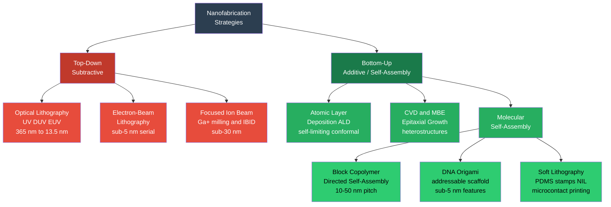

# Nanofabrication and Self-Assembly

> [!abstract] TL;DR
> Nanofabrication creates functional structures at the 1–100 nm scale through two complementary strategies: top-down methods (lithography, milling) that carve patterns into a material, and bottom-up methods (ALD, CVD, self-assembly) that build structures atom-by-atom or molecule-by-molecule — together they underpin the entire semiconductor industry, MEMS, biosensors, and quantum device research.

---

## Intuition

**Analogy:** Top-down nanofabrication is like a master sculptor chiseling a statue from marble: you start with a bulk material and remove everything that is not the desired feature. Bottom-up self-assembly is like building with LEGO: individual pieces snap together according to built-in geometric rules, and the final structure emerges automatically from those rules without a sculptor's chisel.

The deepest insight is that both strategies hit a wall around the same scale. The sculptor's tool — light — diffracts around features below roughly half the wavelength, blurring the pattern. The LEGO approach sidesteps that wall entirely by exploiting chemical affinity, thermodynamics, and molecular shape to guide assembly at the sub-10 nm regime where no lens can operate.

---

## How It Works

### Core Mechanics Overview

Nanofabrication divides cleanly along the direction of material flow:

| Strategy | Principle | Resolution | Throughput | Cost |
|---|---|---|---|---|
| Optical lithography (EUV) | Diffraction of light, photoresist exposure | ~7–14 nm (multi-patterning) | Very high (wafer-scale) | Extreme (ASML NXE tool ~$180M) |
| Electron-beam lithography | Focused e⁻ beam, serial exposure | sub-5 nm | Low (serial) | High |
| Focused ion beam | Ga⁺ sputtering / IBID deposition | sub-30 nm | Very low | Moderate |
| Atomic layer deposition | Self-limiting surface half-reactions | conformal, ~1 Å/cycle | Moderate (batch) | Moderate |
| CVD / MBE | Precursor decomposition / molecular beams | atomic layer | Moderate | High (MBE) |
| Block copolymer DSA | Microphase separation, lamellar/cylinder | 10–50 nm pitch | High (parallel) | Low |
| DNA origami | Scaffold + staple strand hybridisation | sub-5 nm addressable | Low (synthesis) | Low–moderate |
| Soft lithography / NIL | Elastomeric stamping / mold imprint | ~10–100 nm | High (parallel) | Very low |

### Flow / Architecture



---

## Key Concepts

### Secondary Level

#### Top-Down: Lithography as Pattern Transfer

Optical lithography is a photographic process scaled to the atomic realm. A silicon wafer is coated with a photoresist — a polymer whose solubility changes on UV exposure. A glass mask (reticle) containing the circuit pattern is illuminated, and a lens projects the image onto the wafer, shrinking it typically 4×. Exposed regions are developed away (positive resist) or retained (negative resist), leaving a polymer template. Etching then transfers the pattern into the underlying material.

The fundamental constraint is diffraction: light bends around features smaller than approximately half its wavelength. The minimum printable feature is

$$R = \frac{k_1 \lambda}{NA}$$

where $k_1$ is the process factor (0.25–0.5), $\lambda$ is the wavelength, and $NA$ is the numerical aperture of the projection lens. The entire history of Moore's Law is a campaign to reduce $\lambda$: g-line (436 nm) → i-line (365 nm) → KrF (248 nm) → ArF (193 nm) → EUV (13.5 nm).

#### Bottom-Up: Atoms Assembling Themselves

Bottom-up strategies let chemistry do the work. In atomic layer deposition, the substrate surface is exposed to one precursor gas, which reacts with surface sites until every available site is occupied and the reaction stops — self-limitation ensures exactly one monolayer at a time. A purge, then the second precursor completes the reaction cycle. Repeat 100 times and you have a 12 nm conformal film covering every cavity and sidewall of a three-dimensional structure with nanometer precision.

Self-assembly is even more remarkable: polymer blocks that chemically dislike each other are chained together so they cannot phase-separate macroscopically. Instead they segregate into nanoscale domains — cylinders, lamellae, spheres — whose size is set by the chain length. No mask required.

---

### Undergraduate Level

#### Photolithography: From i-line to EUV

**Diffraction limit and $k_1$ factor.** The Rayleigh criterion gives the minimum resolvable half-pitch as $R = k_1 \lambda / NA$. In practice, $k_1$ has been pushed below 0.30 through resolution-enhancement techniques (RET): phase-shift masks (destructive interference at feature edges sharpens the aerial image), off-axis illumination (exploits higher diffraction orders), optical proximity correction (OPC, pre-distorts the mask so proximity effects cancel).

**Immersion lithography.** Replacing air with water between the lens and wafer raises $NA$ from ~0.93 to ~1.35 (the upper limit is the refractive index of water, 1.44). Combined with ArF 193 nm source this gives $R \approx 36$ nm at $k_1 = 0.25$ — but production nodes below 20 nm required quadruple patterning (four separate lithography + etch steps to write one pitch level).

**EUV lithography.** At $\lambda = 13.5$ nm (extreme ultraviolet, actually soft X-ray) a single exposure can print ~13 nm half-pitch. The source is a tin plasma (CO₂ laser + Sn droplet) generating 13.5 nm photons inside an ASML NXE tool. Because EUV is absorbed by air and glass, the entire optical train uses Mo/Si multilayer Bragg-reflecting mirrors (reflectance ~70% per bounce; 11 bounces = 3% total throughput) in ultra-high vacuum. TSMC's N2 node (GAA nanosheet, volume production Q4 2025) uses EUV for all critical layers.

**Photoresist chemistry.** The workhorse is chemically amplified resist (CAR): an acid generator (PAG) produces a strong acid on EUV exposure; the acid catalytically cleaves protecting groups from a polymer backbone during a post-exposure bake (PEB), unlocking solubility. EUV stochastic effects — photon shot noise (~100 photons/nm² at current dose) — cause local resist-bridge defects and line-edge roughness (LER) that are the primary reliability challenge at the 2 nm node.

#### Electron-Beam Lithography (EBL)

EBL scans a focused electron beam across a resist-coated substrate, exposing a pattern without any mask. Standard resist: PMMA (poly-methyl-methacrylate), positive, developed in MIBK:IPA 1:3; resolution < 5 nm is achievable.

**Proximity effect.** Electrons scatter laterally (forward scatter within 10–30 nm; backscatter from the substrate over 1–10 µm), exposing adjacent regions unintentionally. Proximity-effect correction (PEC) algorithms model the point-spread function (PSF) of electron scattering and pre-modify dose assignments so the net exposure is uniform. At 100 keV beam voltage, forward scattering is minimized but backscattering from a Si substrate can still span several microns.

**Resolution and throughput.** Sub-3 nm features have been patterned with cold-field-emission guns. However, the fundamental limitation is throughput: EBL is serial (one pixel at a time), making full-wafer patterning at chip-fabrication speeds impractical. EBL is used for mask writing, research prototyping, and photonic device fabrication.

#### Focused Ion Beam (FIB)

A gallium liquid-metal ion source (LMIS) accelerates Ga⁺ ions (typically 2–30 keV) to a focused spot of 5–10 nm diameter. Two modes:

- **Milling (sputtering):** ions knock surface atoms off by momentum transfer; sub-30 nm trenches, vias, and cross-sections are carved directly. Primary application: TEM lamella preparation — the FIB cuts and lifts out a ~100 nm-thick slice of a device cross-section in situ.
- **Ion-beam-induced deposition (IBID):** a precursor gas (e.g., W(CO)₆ for tungsten, phenanthrene for carbon) is injected near the beam; the ion beam cracks the precursor, depositing the metal locally. Used for circuit edit (nano-scale wire bonding to fix IC defects) and nano-antenna fabrication.

Dual-beam FIB/SEM systems combine the Ga⁺ mill column with an electron column for simultaneous imaging without additional sputtering damage, enabling slice-and-view 3D tomography of nanostructures.

#### Atomic Layer Deposition (ALD)

ALD deposits one atomic monolayer per cycle through alternating, self-limiting half-reactions. The canonical example is Al₂O₃ from TMA + H₂O:

**Half-reaction A (TMA pulse):**
$$\text{Al-OH}^* + \text{Al(CH}_3)_3 \rightarrow \text{Al-O-Al(CH}_3)_2^* + \text{CH}_4$$

**Half-reaction B (H₂O pulse):**
$$\text{Al-CH}_3^* + \text{H}_2\text{O} \rightarrow \text{Al-OH}^* + \text{CH}_4$$

**Net reaction:** $2\,\text{Al(CH}_3)_3 + 3\,\text{H}_2\text{O} \rightarrow \text{Al}_2\text{O}_3 + 6\,\text{CH}_4$

Growth rate: ~1.2 Å/cycle at 200–300°C. Self-limitation means growth automatically stops once the surface is saturated — no precursor excess can deposit more. This guarantees:
- **Atomic thickness control** (count cycles)
- **Perfect conformality** over high-aspect-ratio 3D features (fin gates, 256-layer 3D NAND)
- **Large area uniformity** across 300 mm wafers

ALD high-κ dielectrics (HfO₂, κ ~ 25 vs SiO₂ κ ~ 3.9) replaced SiO₂ gate oxides starting at the 45 nm node, resolving the gate-leakage crisis.

#### Chemical Vapor Deposition (CVD) and MBE

**CVD** flows precursor gases over a heated substrate; thermal decomposition deposits the desired film. Graphene CVD on Cu foil: methane (CH₄) at 1000°C decomposes, carbon dissolves in Cu and precipitates as graphene on cooling; catalytic surface limits growth to one layer. Silicon epitaxy: SiH₄ → Si + 2H₂ on a Si seed crystal; growth is epitaxial (atoms land in register with the substrate), enabling doped p-n junction stacks.

**Molecular beam epitaxy (MBE)** operates in ultrahigh vacuum (< 10⁻¹⁰ torr). Elemental sources are heated until they effuse as thermal beams aimed at a crystalline substrate. The extremely slow deposition rate (0.1–1 monolayer/s) and UHV environment allow atomic-layer-by-atomic-layer growth monitored in real time by RHEED (reflection high-energy electron diffraction). MBE is the gold standard for III-V heterostructures (GaAs/AlGaAs quantum wells, InP HEMTs), 2D material heterostack research, and topological insulator films.

#### Self-Assembled Monolayers (SAMs)

Alkanethiols (HS-(CH₂)ₙ-X) spontaneously chemisorb onto Au(111) surfaces via the Au-S bond (~45 kcal/mol), forming a densely packed, ordered monolayer. The tail group X (–CH₃, –OH, –COOH, –NH₂) controls surface chemistry: wettability, protein adhesion, coupling chemistry.

**SAM lithography:** expose a SAM-coated Au surface through a mask; UV or particle bombardment cleaves the S-C bond in exposed regions, creating a pattern of damaged/intact SAM. Selective etching of bare Au completes the pattern transfer. Feature size is limited by the lithographic tool, but SAMs enable sub-5 nm bio-functionalisation.

#### Block Copolymer Lithography

A block copolymer (BCP) is a chain where block A (e.g., polystyrene, PS) is covalently bonded to block B (e.g., poly-methyl methacrylate, PMMA). The Flory–Huggins interaction parameter χ measures A-B repulsion; when the product χN (N = degree of polymerisation) exceeds ~10.5, the blocks microphase separate into periodic nanodomains. The equilibrium morphology depends on the volume fraction f:
- f ≈ 0.5: lamellae (alternating sheets, pitch L₀ = ~10–50 nm)
- f ≈ 0.3: hexagonally packed cylinders
- f ≈ 0.15: BCC spheres

**Directed self-assembly (DSA):** a pre-patterned guiding layer (EUV-defined chemical stripes or topographic trenches) registers the BCP domains to specific locations, correcting the natural line-edge roughness of the BCP and aligning features with circuit requirements. The BCP then "heals" the imperfect guide pattern to thermodynamic perfection. PS-PMMA (χ = 0.04) gives L₀ ~ 25 nm; high-χ BCPs (PS-b-PDMS, χ ~ 0.27; PS-b-P2VP) achieve L₀ < 10 nm.

---

### Graduate Level

#### EUV Stochastics and the N2 Challenge

At EUV dose ~30 mJ/cm² and 13.5 nm wavelength, each nm² of resist receives only ~12–15 photons. Poisson shot-noise means dose varies by ±1/√N ≈ ±28% locally. This causes:
- **Microbridges:** under-exposed regions fail to develop, bridging adjacent lines
- **Line-edge roughness (LER):** σ_LER ~ 1–2 nm rms at state-of-the-art, must be < 10% of the half-pitch (< 0.2 nm at 2 nm node — not yet achieved)
- **Stochastic defects:** isolated random fails that require yield-killing inspection

The N2 nanosheet architecture (GAA wrapping the channel on all 4 sides, nanosheet width ~18 nm, height ~5 nm) also demands sub-nm ALD thickness control for gate dielectric and work-function metal stacks deposited inside the GAA cavity.

#### MBE Heterostructure Engineering

In MBE, abrupt interfaces between semiconductors with different band gaps (e.g., GaAs / AlₓGa₁₋ₓAs) create quantum wells where electrons are confined to 2D states. The RHEED pattern oscillates with intensity at a frequency equal to one monolayer per period, providing real-time monolayer counting. Strain engineering: depositing InAs (a = 6.06 Å) on GaAs (a = 5.65 Å) introduces 7% biaxial compressive strain; above the critical thickness (Matthew-Blakeslee), misfit dislocations relieve strain. Below it: coherent pseudomorphic layer with strained band structure useful for strained-layer superlattices and quantum-dot nucleation.

#### Block Copolymer χN Scaling and High-χ Systems

The equilibrium lamellar period scales as $L_0 \approx 1.03\,a\,N^{2/3}\,\chi^{1/6}$ (strong segregation limit). To shrink $L_0$ below 10 nm without impractically short chains (low N → poor film properties), the industry turns to **high-χ BCPs**. PS-b-PDMS (χ ≈ 0.27 at 25°C vs χ ≈ 0.04 for PS-PMMA) gives $L_0$ ~ 12 nm at $N = 80$. Recent triblock architectures (A-b-(B-r-C)) enable sub-10 nm patterning with pitch uniformity compatible with 3 nm node requirements (2025 Trends in Chemistry review).

#### DNA Origami

Paul Rothemund (2006, *Nature*) showed that a long single-stranded DNA scaffold (~7249 nucleotides from M13 bacteriophage) folds into arbitrary 2D shapes when mixed with ~200 short "staple" strands (16–28 nt) that bridge different scaffold segments. Each staple binds uniquely to two specific scaffold regions, enforcing a fold. Because each staple strand has a unique sequence and position, individual molecules on the origami are addressable with sub-5 nm precision — chemical modifications on a specific staple place a nanoparticle, drug, protein, or fluorophore at a programmable site.

3D origami: staple strands that bridge multiple parallel helices create box, barrel, or polyhedral structures. Applications: drug delivery containers that open on cancer-cell receptor binding, molecular logic gates, and spatial organisation of enzymes into synthetic metabolic pathways.

#### Nanoimprint Lithography (NIL) and Soft Lithography

**NIL** presses a rigid mold (often Si or quartz) into a polymer resist under heat/UV; the mold geometry is imprinted into the resist. Key advantages: feature size is determined entirely by the mold (sub-5 nm demonstrated), not by any optical diffraction limit; very low cost per wafer once a mold exists. Limitations: mold wear, defect replication, overlay accuracy.

**Microcontact printing (μCP):** a PDMS stamp inked with a SAM molecule is pressed onto Au; the SAM transfers to the contact regions, defining a self-assembled pattern at the stamp–substrate interface. Resolution ~100 nm in practice (PDMS deformation limits it), but roll-to-roll μCP enables large-area flexible electronics on polymer substrates.

---

## Python Demo

```python
import numpy as np
import matplotlib.pyplot as plt

# Photolithography resolution limit: R = k1 * lambda / NA
# k1  = process factor (0.25 aggressive multi-patterning)
# lam = exposure wavelength (nm)
# NA  = numerical aperture of the projection lens

k1 = 0.25
wavelengths = np.linspace(5, 420, 1000)  # nm

# Three representative NA values used in production
configs = [
    (0.75, "ArF dry  NA=0.75",          "#4c72b0"),
    (1.20, "ArF immersion  NA=1.20",    "#dd8452"),
    (1.35, "ArF immersion  NA=1.35",    "#55a868"),
]

fig, ax = plt.subplots(figsize=(12, 6))

for na, label, col in configs:
    R = k1 * wavelengths / na
    ax.plot(wavelengths, R, color=col, lw=2.2, label=label)

# Historical source wavelengths
sources = [
    (436,  "g-line\n436 nm",  "#aaa"),
    (365,  "i-line\n365 nm",  "#888"),
    (248,  "KrF\n248 nm",     "#666"),
    (193,  "ArF\n193 nm",     "#444"),
    (13.5, "EUV\n13.5 nm",    "#9b59b6"),
]
for wl, name, col in sources:
    ax.axvline(wl, color=col, ls=":", lw=1.3, alpha=0.85)
    ax.text(wl + 2, 193, name, fontsize=7.5, color=col, va="top")

# Technology nodes as horizontal reference lines
nodes = [
    (250, "250 nm"),
    (130, "130 nm"),
    (90,  " 90 nm"),
    (45,  " 45 nm"),
    (14,  " 14 nm"),
    (7,   "  7 nm"),
    (2,   "  2 nm"),
]
for node_nm, label in nodes:
    ax.axhline(node_nm, color="#ddd", ls="--", lw=0.9)
    ax.text(423, node_nm, label, fontsize=7, color="#666", va="center")

# Mark key operating points
# EUV single exposure: k1=0.25, NA=0.33 (first-gen NXE) -> R ~ 10 nm
euv_r_nxe = 0.25 * 13.5 / 0.33
ax.scatter([13.5], [euv_r_nxe], color="purple", zorder=7, s=90,
           label=f"EUV NA=0.33 (NXE:3400) -> R~{euv_r_nxe:.0f} nm")
ax.scatter([13.5], [2], color="red", zorder=7, s=90,
           label="TSMC N2 (2 nm) via EUV + multi-patterning + GAA")

ax.annotate(f"~{euv_r_nxe:.0f} nm",
            xy=(13.5, euv_r_nxe), xytext=(45, euv_r_nxe + 12),
            fontsize=8, color="purple",
            arrowprops=dict(arrowstyle="->", color="purple", lw=1.1))
ax.annotate("N2: 2 nm node\nEUV + multipatterning\n+ nanosheet GAA",
            xy=(13.5, 2), xytext=(50, 28),
            fontsize=8, color="red",
            arrowprops=dict(arrowstyle="->", color="red", lw=1.1))

ax.set_xlim(0, 420)
ax.set_ylim(0, 200)
ax.set_xlabel("Exposure Wavelength  lambda  (nm)", fontsize=12)
ax.set_ylabel("Minimum Feature Size  R  (nm)", fontsize=12)
ax.set_title(
    "Photolithography Resolution  R = k1 * lambda / NA   (k1 = 0.25)\n"
    "Moore's Law = wavelength scaling + immersion + multi-patterning",
    fontsize=12
)
ax.legend(fontsize=8.5, loc="upper left")
ax.grid(True, alpha=0.22)
plt.tight_layout()
plt.savefig("photolithography_resolution.png", dpi=150, bbox_inches="tight")
plt.show()
```

The plot shows three curves (R vs λ for three NA values) and vertical lines marking each historical source. Every major node transition corresponds to either a wavelength jump or an NA jump — often both. The 2 nm node (far left, red dot) lies well below the single-exposure EUV curve, revealing that multi-patterning is mandatory even with EUV.

---

## Real-World Applications

> **TSMC N2 — EUV + GAA Nanosheet (2025).** TSMC's first gate-all-around production node uses ASML NXE:3600D EUV scanners with $\lambda = 13.5$ nm and NA = 0.33. Critical layer patterning achieves ~13 nm half-pitch per EUV exposure; multi-patterning compositions achieve the final 2 nm design rule. The gate stack uses ALD HfO₂ gate dielectric (~1.5 nm equivalent oxide thickness) and ALD TiN/TaN work-function metals, all deposited conformally inside the nanosheet cavities — impossible with any other deposition technique.

> **Intel 3D NAND — ALD for 300+ Layer Stacks.** Samsung and Micron 3D NAND flash (200+ layer stacks as of 2025) relies entirely on ALD to deposit alternating SiO₂/Si₃N₄ layers uniformly over sub-100 nm diameter vertical channel holes punched through the entire stack. A 300-layer stack requires ~600 ALD cycles; conformality tolerances are < 1 Å across 10 µm deep features.

> **Rothemund DNA Origami (Nature 2006).** The first DNA origami paper demonstrated smiley faces, triangles, and a map of the Western hemisphere at ~6 nm feature resolution using a single M13 scaffold strand and ~200 staple strands. Subsequent work placed gold nanoparticles at predetermined sites, demonstrated 3D hollow boxes that open on specific antibody binding, and implemented DNA strand-displacement logic gates — the beginning of molecular computing.

> **IBM Research — Block Copolymer DSA on 300 mm Wafers.** IBM/IMEC demonstrated PS-b-PMMA DSA on 300 mm wafers at 28 nm pitch (14 nm half-pitch) guided by EUV-defined chemical pre-patterns, achieving defect densities < 1/cm² — the first demonstration at a level potentially compatible with semiconductor manufacturing specifications.

> **Soft Lithography in Microfluidics — Lab-on-a-Chip.** George Whitesides' group at Harvard established PDMS microcontact printing and soft lithography as the foundation of microfluidics. PDMS stamps replicate SU-8 masters from photolithography, enabling rapid prototyping of microfluidic channels at 10–100 µm scale for point-of-care diagnostics, organ-on-chip platforms, and single-cell genomics devices.

---

## Common Pitfalls

- **Confusing resolution and half-pitch.** The Rayleigh formula gives the minimum resolvable *half-pitch* (half of one period), not the minimum linewidth. A 14 nm half-pitch node requires patterning features at 28 nm pitch — still far above EUV's single-exposure limit, necessitating multi-patterning.

- **ALD window violations.** ALD only works within a temperature "process window" (typically 150–350°C for Al₂O₃) where both self-limitation and sufficient reactivity coexist. Too cold: incomplete reaction, non-self-limiting CVD-like growth. Too hot: precursor decomposition (CVD mode), loss of conformality. Each new precursor/material pair requires characterising its own ALD window.

- **EBL proximity effect neglect.** Ignoring backscattered electron dose when writing dense patterns causes bridging of features that look well-separated in the design file. Proximity-effect correction is mandatory for sub-50 nm work; omitting it is the single most common cause of failed EBL exposures.

- **FIB Ga⁺ implantation.** Ga⁺ ions implant to ~20 nm depth, creating a gallium-contaminated amorphous layer that compromises TEM diffraction data and electrical measurements. Low-kV (2–5 keV) final polishing and plasma FIB (Xe⁺ or Ar⁺) sources reduce but do not eliminate this.

- **BCP film thickness tuning.** Block copolymer microphase separation requires a film thickness that is an integer multiple of L₀. Off-thickness films produce mixed or poorly ordered morphologies. Thickness must be calibrated by ellipsometry before annealing.

- **SAM incomplete coverage.** Even trace oxygen or moisture before SAM deposition occupies Au binding sites, creating pinhole defects. Working under inert atmosphere and cleaning Au with UV-ozone immediately before thiol immersion is essential for monolayer quality.

- **DNA origami misfolding.** Incorrect annealing ramp rate is the most common source of structural defects. The standard protocol ramps from 90°C to 20°C over 1–2 hours; too-fast cooling kinetically traps misfolded staple configurations.

---

## Related Concepts

- [[X_Ray_Diffraction_and_Braggs_Law]] — XRD characterises the crystal structure and strain state of thin films deposited by ALD/CVD/MBE; also X-rays in the EUV range (13.5 nm) are the imaging radiation for the most advanced lithography.
- [[Interference_and_Diffraction]] — the diffraction limit $R = k_1\lambda/NA$ is a direct consequence of wave optics; understanding Rayleigh and Abbe criteria grounds the resolution limit calculation.
- [[Electromagnetic_Waves_and_Radiation]] — EUV photons are soft X-rays (92 eV, λ = 13.5 nm); the physics of plasma emission, multilayer mirror reflectance, and photon-resist interaction are all electromagnetic wave phenomena.
- [[Fourier_Transform]] — the aerial image formed by a projection lens is the Fourier transform of the mask transmission function; resolution enhancement techniques (OPC, PSM, SMO) all operate in the spatial-frequency domain.
- [[Chemical_Bonding_in_Solids]] — surface chemisorption (SAMs, ALD half-reactions) and molecular self-assembly all depend on bond energy hierarchies: Au-S (~45 kcal/mol), van der Waals (~1 kcal/mol), hydrogen bonds (~5 kcal/mol).
- [[Semiconductors_and_Devices]] — nanofabrication is the manufacturing pipeline for every semiconductor device; FinFET/GAA transistors, DRAM capacitors, and 3D NAND require the complete tool chain described here.
- [[_MOC_Physics_Master]] — condensed matter, quantum mechanics, and optics sections all provide the physical foundations underlying nanofabrication techniques.
- [[_MOC_SS_Master]] — Fourier analysis and frequency-domain thinking underpin optical lithography resolution theory.
- [[Carbon_Nanomaterials_Graphene_Nanotubes_Fullerenes]] — CVD graphene growth on Cu and CVT nanotube synthesis are direct nanofabrication applications; graphene is also a candidate interconnect material for post-Si nodes.
- [[Nano_Electronics_and_MEMS_NEMS]] — the devices built by nanofabrication; MEMS fabrication combines deep reactive-ion etching, ALD, and soft lithography.
- [[Nanoparticles_and_Colloidal_Systems]] — colloidal self-assembly is a bottom-up route to photonic crystal templates; DNA origami is used to organise nanoparticle arrangements with sub-5 nm precision.
- [[_MOC_Nanotechnology_and_Nanomaterials]] — master index for this section.

---

## Review Questions

1. **Conceptual.** Explain why water immersion increases the NA of an ArF lens but cannot push NA beyond 1.44. What physical property sets this ceiling, and why did the industry not fill the gap with a higher-index fluid (n > 1.44)?

2. **Scenario.** You need to deposit a 3 nm HfO₂ layer with < 5% thickness variation inside cylindrical pores that are 5 nm wide and 50 nm deep (aspect ratio 10:1). You have access to CVD and ALD. Which do you choose and why? What process temperature constraints apply to a substrate that already has Al metal interconnects (melting point 660°C, but reliability issues above ~250°C)?

3. **Trade-off.** A startup proposes using DNA origami as a lithographic template for 5 nm half-pitch patterning of semiconductor chips. Identify the two most fundamental barriers to inserting DNA origami into a CMOS fab process flow (consider throughput, process compatibility, and yield) and suggest for which application domain DNA origami templating is already practical today.

---

## Sources

- [Madou, M. J. — *Fundamentals of Microfabrication and Nanotechnology*, 3rd Ed., CRC Press (2011)](https://www.routledge.com/Fundamentals-of-Microfabrication-and-Nanotechnology-Three-Volume-Set/Madou/p/book/9781420055160)
- [Rothemund, P. W. K. — "Folding DNA to create nanoscale shapes and patterns", *Nature* 440, 297–302 (2006)](https://doi.org/10.1038/nature04586)
- [Ober, C. K. et al. — "Directed block copolymer self-assembly for next-generation lithography", *Trends in Chemistry* (2026)](https://www.cell.com/trends/chemistry/abstract/S2589-5974(26)00018-3)
- [TSMC N2 Technology Overview (2025–2026)](https://www.tsmc.com/english/dedicatedFoundry/technology/logic/l_2nm)
- [George, S. M. — "Atomic Layer Deposition: An Overview", *Chemical Reviews* 110, 111–131 (2010)](https://doi.org/10.1021/cr900056b)
- [Whitesides, G. M. & Grzybowski, B. — "Self-Assembly at All Scales", *Science* 295, 2418–2421 (2002)](https://doi.org/10.1126/science.1070821)

---

#MaterialsScience #Nanofabrication #SelfAssembly #Lithography #ALD #Nanotechnology #EUV #BlockCopolymer #DNAOrigami
