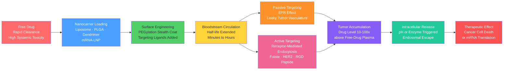

# Nanomedicine and Drug Delivery Systems

> [!abstract] TL;DR
> Nanomedicine uses engineered particles in the 1–1000 nm size range to carry drugs, proteins, or nucleic acids — exploiting the physics of tumor vasculature, surface engineering, and triggered release to concentrate therapeutics exactly where they are needed while sparing healthy tissue, enabling treatments from Doxil (1995) to mRNA COVID vaccines (2021).

---

## Intuition

**Analogy:** Conventional chemotherapy is like fumigating an entire city to kill a single colony of ants — every room, every building, every person is exposed to poison just to reach the target. Nanomedicine is like deploying GPS-guided delivery trucks: each truck is loaded with the exact dose needed, coated so it slips past security checkpoints undetected, and programmed to unlock its cargo only when it reaches the address of the diseased cell.

The "GPS" is either passive — tumors have uniquely leaky blood vessels that let tiny parcels through, but healthy vessels do not — or active, where the truck's exterior carries a molecular key that fits only the lock on the target cell's surface. The packaging that makes this possible — liposomes, polymer spheres, dendrimers, lipid nanoparticles — is what the materials science of nanomedicine is really about.

---

## How It Works

### Core Mechanics

**1. Why nanoscale size matters**

Particles in the 10–200 nm range exhibit properties unavailable to either molecular drugs or bulk materials:
- **EPR effect (Enhanced Permeability and Retention):** Tumor blood vessels are structurally abnormal — pore sizes reach 200–1200 nm vs ~8 nm in healthy endothelium. Nanoparticles smaller than ~200 nm extravasate into tumor tissue passively; because tumors also lack functional lymphatics, the particles are retained rather than drained away. The result is a 10–100x higher drug concentration in tumor tissue compared to free-drug plasma levels. First described by Matsumura and Maeda in 1986.
- **Surface-area-to-volume ratio:** At 10 nm diameter, ~30% of atoms are at the surface, enabling dense ligand loading impossible in bulk.
- **Circulation time:** Nanoparticles can be engineered to circulate in blood for hours rather than the minutes typical of unmodified small molecules.

**2. Nanocarrier classes and their loading strategies**

| Carrier | Size Range | Drug Compartment | Key Characteristic |
|---------|-----------|-----------------|-------------------|
| Liposomes | 50–400 nm | Aqueous core (hydrophilic drugs) + lipid bilayer (hydrophobic drugs) | Biocompatible, FDA-approved (Doxil 1995) |
| PLGA microspheres/nanospheres | 100 nm–100 µm | Polymer matrix (hydrophobic drugs) | Biodegradable; controlled release weeks to months |
| Dendrimers | 1–15 nm | Core cavities + surface conjugation | Monodisperse; precise molecular weight |
| Iron oxide (SPION) | 5–30 nm | Surface-conjugated drugs | Dual: MRI contrast + magnetic hyperthermia |
| mRNA Lipid Nanoparticles | 70–150 nm | Aqueous RNA core surrounded by ionizable lipid | COVID-19 vaccines; endosomal escape |

**3. Drug release kinetics**

Three mathematical models describe how drug escapes from a nanocarrier matrix:

**Zero-order release** — constant release rate independent of remaining drug (reservoir systems with a rate-controlling membrane):
$$Q(t) = k_0\,t$$

**First-order release** — rate proportional to remaining drug concentration (porous matrices, osmotic pumps):
$$Q(t) = Q_{\infty}\!\left(1 - e^{-k_1 t}\right)$$

**Higuchi model** (1963) — drug diffusion from a homogeneous matrix where total drug loading $A$ far exceeds drug solubility $C_s$ in the matrix. The moving depletion front analysis gives:
$$Q(t) = \sqrt{D\,(2A - C_s)\,C_s\,t}$$

Under the assumption $A \gg C_s$:
$$\boxed{Q(t) \approx \sqrt{2\,A\,C_s\,D\,t} = k_H\,\sqrt{t}}$$

where $k_H = \sqrt{2\,A\,C_s\,D}$ is the Higuchi dissolution constant (units: amount·time^{-1/2}). The $\sqrt{t}$ dependence is the hallmark diagnostic of diffusion-controlled matrix release; a plot of $Q$ vs $\sqrt{t}$ that is linear confirms this mechanism.

**4. Drug loading metrics**

Two related but distinct efficiency metrics are used in formulation science:

$$\text{Encapsulation Efficiency (EE\%)} = \frac{\text{mass of drug in NP formulation}}{\text{total drug mass added}} \times 100$$

$$\text{Drug Loading Efficiency (DLE\%)} = \frac{\text{mass of drug in NP formulation}}{\text{total mass of NP formulation}} \times 100$$

EE% measures how efficiently the drug was captured during preparation; DLE% measures the drug payload as a fraction of the total particle mass. DLE% is always smaller than EE% because the carrier polymer/lipid contributes to total mass. Release kinetics are assessed in vitro by the dialysis method: drug-loaded NPs are placed in a dialysis bag immersed in phosphate-buffered saline, aliquots are withdrawn at time intervals, and drug concentration is measured by HPLC or UV spectrophotometry to build a cumulative release curve.

### Flow: Nanocarrier Delivery Pathway



---

## Key Concepts

### Secondary

**Liposomes — the first class of nanomedicines**

A liposome is a spherical vesicle with a phospholipid bilayer shell surrounding an aqueous core — structurally identical to a cell membrane wrapped into a closed sphere. This dual compartment design allows two types of drugs to be co-loaded: water-soluble drugs (doxorubicin, cisplatin) dissolve in the aqueous interior; lipophilic drugs (paclitaxel, amphotericin B) partition into the hydrophobic bilayer core.

Phospholipids self-assemble into bilayers spontaneously when dispersed in water because the hydrophobic tails flee the aqueous environment. Liposome size is controlled by extrusion through polycarbonate membranes of defined pore size (50–200 nm). Typical components: DPPC or DSPC (structural lipid), cholesterol (membrane rigidity, reduces permeability), DSPE-PEG (stealth coating, ~5–10 mol%).

**Doxil** (liposomal doxorubicin, Sequus Pharmaceuticals 1995) was the first nanomedicine approved by the FDA. It encapsulates the anti-cancer drug doxorubicin in PEGylated liposomes (~90 nm), reducing the severe cardiotoxicity of free doxorubicin by eliminating peak plasma concentration spikes while maintaining equivalent anti-tumor efficacy. Clinical use: Kaposi's sarcoma, ovarian cancer, multiple myeloma.

**PLGA microspheres and nanospheres**

Poly(lactic-co-glycolic acid) is a bioresorbable copolymer approved by the FDA and EMA. The ester bonds hydrolyze in vivo to yield lactic acid and glycolic acid — both normal metabolites — eliminating the need for surgical removal. The hydrolysis rate is tuned by the LA:GA ratio: 50:50 PLGA degrades in weeks; 75:25 degrades over months. Drug is dispersed throughout the polymer matrix (nanosphere) or encapsulated in a polymer shell (nanocapsule).

Preparation methods:
- **Single emulsion (O/W):** for hydrophobic drugs dissolved in organic phase
- **Double emulsion (W/O/W):** for hydrophilic drugs (proteins, peptides, nucleic acids)

Release from PLGA matrices follows approximately Higuchi kinetics in the first phase, followed by bulk erosion as the polymer degrades. **Lupron Depot** (PLGA microspheres, leuprolide acetate) is a widely used PLGA product — one monthly injection instead of daily subcutaneous dosing for prostate cancer.

**Dendrimers — the precision architecture**

Dendrimers are tree-like branched macromolecules grown layer-by-layer from a central core. Each growth cycle is called a **generation** (G). For PAMAM (polyamidoamine) dendrimers starting from an ethylenediamine core:

| Generation | Surface Groups | Diameter (nm) | Approximate MW (Da) |
|-----------|---------------|--------------|----------------------|
| G0 | 4 | 1.5 | 517 |
| G1 | 8 | 2.2 | 1,430 |
| G2 | 16 | 2.9 | 3,256 |
| G3 | 32 | 3.6 | 6,909 |
| G4 | 64 | 4.5 | 14,215 |

**G4-PAMAM** is a widely studied platform: 64 primary amine surface groups for drug conjugation or surface modification, a hydrophobic core for guest molecule encapsulation, and a MW small enough to be renally cleared (below the ~30 kDa kidney filtration threshold at lower generations). The **multivalent surface** provides cooperative binding to receptors — attaching multiple folate ligands to a single G5 dendrimer enhances binding affinity by orders of magnitude over monovalent folate alone.

**Iron oxide nanoparticles (SPIONs)**

Superparamagnetic iron oxide nanoparticles (Fe₃O₄ or γ-Fe₂O₃, 5–30 nm) exhibit superparamagnetism: they magnetize strongly under an external field but retain no remanent magnetization when the field is removed (because the particle contains only a single magnetic domain). Two biomedical applications exploit this:

1. **MRI negative contrast:** SPIONs reduce T₂ relaxation time of surrounding water protons, darkening areas where SPIONs accumulate on T₂-weighted MRI. Ferumoxytol (Feraheme) — FDA approved — provides both iron supplementation and lymph-node MRI contrast.

2. **Magnetic hyperthermia:** When SPIONs are exposed to an alternating magnetic field (AMF, ~100 kHz), Neel relaxation and Brownian rotation of magnetic moments generate localized heat. Tumor temperatures raised to 42–45°C sensitize cancer cells to radiation and induce apoptosis without damaging normothermic healthy tissue. NanoTherm therapy (MagForce) is approved in Europe for recurrent glioblastoma.

### Undergraduate

**PEGylation and the stealth effect**

Without surface modification, nanoparticles injected into blood are rapidly coated by serum proteins (opsonization — primarily IgG, complement C3b, fibronectin). Opsonized particles are recognized by Fc and complement receptors on macrophages of the mononuclear phagocyte system (MPS), primarily in the liver (Kupffer cells) and spleen. A 100-nm bare liposome is cleared from circulation in minutes.

**PEGylation** — grafting polyethylene glycol chains ([-CH₂CH₂O-]_n, MW 2000–5000 Da) to the particle surface — creates a dense hydrophilic corona that sterically repels opsonin proteins. The mechanism:
- PEG chains adopt a brush conformation above a critical surface density
- The entropic cost of compressing the brush deters protein adsorption
- Water molecules tightly associated with PEG chains form a hydration shell

The result: circulation half-life extends from ~5 minutes to 12–48 hours for optimally PEGylated 100-nm liposomes. This dramatically increases the number of passes through tumor vasculature, amplifying EPR accumulation.

PEGylation does introduce one complication: the **ABC phenomenon** (accelerated blood clearance). Repeat injections of PEGylated NPs can trigger IgM anti-PEG antibody production, causing the second dose to be cleared faster than the first. This has prompted interest in alternatives: poly(2-oxazoline), zwitterionic polymers, and CD47 "don't eat me" peptide coatings.

**Targeted delivery: active targeting strategies**

Passive EPR-based targeting enriches nanoparticles in tumors overall. Active targeting adds a molecular homing layer that improves uptake by specific cell types within the tumor. Three major approaches:

1. **Antibody-conjugated NPs (immunoliposomes):** Full IgG antibodies or Fab fragments against tumor antigens (HER2 in breast cancer, EGFR in lung cancer) are conjugated to the NP surface via maleimide-thiol chemistry. Trastuzumab-conjugated liposomes showed ~3-fold higher HER2-positive cell uptake vs non-targeted liposomes in preclinical studies. The large size of full antibodies (150 kDa) can sterically hinder PEG, so smaller formats (scFv, nanobodies) are preferred.

2. **Aptamers:** Short single-stranded DNA or RNA oligonucleotides selected by SELEX to bind a target with antibody-like affinity. The PSMA aptamer conjugated to docetaxel-loaded PLGA NPs (BIND-014) reached Phase II clinical trials for prostate cancer. Advantages: small size (8–15 kDa), no immunogenicity, chemical synthesis at scale.

3. **Peptide ligands:**
   - **RGD tripeptide** (Arg-Gly-Asp): binds integrin αvβ3, overexpressed on angiogenic tumor endothelium and many cancer cells. Cyclic RGD has higher binding affinity than linear (constrained conformation).
   - **Folate receptor targeting:** Folate receptors are overexpressed on ovarian, lung, and breast cancer cells (5–300x normal). Folic acid (MW 441 Da) conjugated to NPs binds with high affinity (Kd ~0.1 nM) and triggers receptor-mediated endocytosis. EC145 (folate-vinblastine conjugate, not NP) demonstrated the concept in clinic.

**Drug loading and encapsulation: formulation parameters**

Key variables affecting EE% and DLE%:
- **Drug-polymer compatibility:** The Flory-Huggins interaction parameter χ between drug and polymer matrix — smaller χ means better miscibility and higher loading
- **Drug:polymer ratio:** There is a maximum loading before drug crystallizes on the particle surface and reduces EE%
- **Preparation method and solvent:** Nanoprecipitation, emulsion-solvent evaporation, supercritical CO₂ — each gives different loading for a given drug
- **pH of aqueous phase:** For weakly basic drugs (doxorubicin), remote loading into preformed liposomes using a pH or ammonium sulfate gradient achieves near 100% EE%

**Dialysis method release testing:** Regulatory agencies require in vitro release data as a surrogate for in vivo bioavailability. The dialysis bag method places a defined amount of drug-loaded NPs inside a semi-permeable membrane (MWCO > NP but < free drug MW is problematic — more commonly MWCO > free drug is used with "sample-and-separate" protocols). The FDA guidance on in vitro release (IVIVC) for nano-formulations recommends testing at pH 7.4 (blood), pH 5.5 (endosomal), and pH 6.8 (GI) to understand release across physiological compartments.

**SPION synthesis and surface chemistry**

SPIONs are synthesized by coprecipitation of Fe²⁺/Fe³⁺ salts in alkaline solution, or by thermal decomposition of iron oleate in high-boiling solvents (giving monodisperse, size-controlled particles). Bare Fe₃O₄ is hydrophobic and aggregates in water; surface stabilization uses:
- **Dextran coating:** Feridex, clinically withdrawn 2008 but historically used
- **Carboxymethyl dextran:** Ferumoxytol (Feraheme), IV iron for CKD patients
- **Oleic acid / DMSA:** For research SPIONs needing further functionalization

Zeta potential (surface charge in mV) is a key stability indicator: |ζ| > 30 mV indicates colloidal stability through electrostatic repulsion; ζ near 0 mV means rapid aggregation (van der Waals dominates).

### Graduate

**mRNA Lipid Nanoparticles: design principles for the COVID-19 vaccines**

mRNA-LNP technology demonstrated in the Pfizer-BioNTech BNT162b2 and Moderna mRNA-1273 vaccines is the most consequential nanomedicine advance since Doxil. The LNP formulation contains four lipid components in specific molar ratios (Pfizer: ~47.4:10.6:41.3:0.7 for ionizable lipid:DSPC:cholesterol:PEG-lipid):

**Ionizable lipid** is the enabling innovation. It carries a tertiary amine headgroup with a pKa carefully tuned to ~6.2–6.5:
- At physiological pH 7.4 (blood): neutral → minimal interaction with serum proteins and red blood cells, low toxicity
- At endosomal pH 5–6: protonated → cationic → complexes with anionic mRNA phosphate backbone, and destabilizes the endosomal membrane

Pfizer uses **ALC-0315** (heptadecan-9-yl 8-[(2-hydroxyethyl){6-oxo-6-(undecyloxy)hexyl}amino]octanoate); Moderna uses **SM-102**.

**Endosomal escape** is the critical bottleneck. After receptor-mediated endocytosis of LNPs, the vesicle is acidified by vacuolar ATPase. Ionizable lipids become cationic and fuse with the anionic endosomal membrane (forming non-bilayer hexagonal phase lipid structures), rupturing the endosome and releasing mRNA into the cytoplasm. Efficiency of endosomal escape is typically 1–2% — this is a major area of active optimization. Cytoplasmic mRNA is then translated by ribosomes into the encoded protein (spike protein for COVID-19 vaccines).

**LNP characterization requirements** for regulatory filing:
- Particle size by DLS or cryo-TEM (target: 70–150 nm, PDI < 0.2)
- Encapsulation efficiency by RiboGreen assay (disrupting LNPs with detergent reveals total RNA, then EE% = 1 − accessible RNA fraction)
- Zeta potential (typically mildly negative at pH 7.4)
- pKa of ionizable lipid by TNS fluorescence assay
- mRNA integrity by gel electrophoresis or capillary electrophoresis
- Residual solvents (ethanol) by GC headspace

**Release mechanism taxonomy: Fickian vs anomalous transport**

The Korsmeyer-Peppas model unifies the kinetic models:
$$\frac{Q}{Q_\infty} = k\,t^n$$

where the exponent $n$ identifies the release mechanism for slab geometry:

| n | Mechanism | Physical description |
|---|-----------|---------------------|
| 0.5 | Fickian diffusion | Drug diffuses through a rigid matrix; matches Higuchi at early times |
| 0.5 < n < 1.0 | Anomalous transport | Combined diffusion and polymer relaxation |
| 1.0 | Case II transport | Zero-order; swelling-controlled polymer relaxation dominates |
| > 1.0 | Super Case II | Polymer erosion plus swelling; unusual |

Most PLGA nanospheres show n ≈ 0.5–0.7 (Fickian to anomalous), while erodible PLGA matrices in late-stage degradation transition toward n = 1.

**Regulatory framework for nanomedicines**

The FDA issued foundational guidance in 2014: *"Considering Whether an FDA-Regulated Product Involves the Application of Nanotechnology."* Key regulatory challenges:

1. **No universal definition of "nanomaterial":** FDA uses "materials in the nanoscale range of approximately 1–1000 nm" as a working definition, with regulatory decisions made case-by-case.
2. **Characterization standards:** FDA expects comprehensive physicochemical characterization (size distribution, surface chemistry, charge, shape, crystallinity, drug loading) as part of the IND/NDA/BLA submission.
3. **ADME challenges:** Nanoparticles do not follow classical ADME pharmacokinetics (absorption-distribution-metabolism-excretion is particle-size, surface-charge, and protein-corona dependent). Standard PK models fail; population PK modeling or physiologically-based PK (PBPK) for NPs is required.
4. **Immunotoxicology:** SPION and PLGA NPs can trigger complement activation-related pseudoallergy (CARPA) — the innate immune system misidentifies NPs as pathogens. Doxil causes CARPA in ~5–7% of patients on first infusion (treated by slowing infusion rate).
5. **Mononuclear phagocyte system (MPS) clearance:** Even PEGylated NPs are captured by the liver and spleen (estimated 99% of an IV NP dose). This sets an absolute ceiling on tumor delivery efficiency — a fundamental limitation now motivating MPS-blocking strategies (dexamethasone pre-treatment, CSF1R inhibitors) and local delivery approaches.
6. **Generic nanomedicine:** The FDA's "Sameness" question for liposomal generic drugs has been particularly contentious — Doxil generics were held to the same Q3 microstructure standard as small molecules, requiring particle size, lamellarity, and PEG density to match the innovator product.

---

## Python Demo

```python
import numpy as np
import matplotlib.pyplot as plt

# Time axis: 0 to 72 hours (standard in-vitro release test duration)
t = np.linspace(0, 72, 600)

# --- Model 1: Zero-order release ---
# Q = k0 * t, capped at 100% (reservoir with rate-controlling membrane)
# k0 = 1.25 %/hr -> theoretical 100% complete at ~80 h
k0 = 1.25
Q_zero = np.minimum(k0 * t, 100.0)

# --- Model 2: First-order release ---
# Q = 100 * (1 - exp(-k1 * t))  (porous matrix, osmotic pump)
# k1 = 0.050 /hr -> half-release time = ln(2)/k1 = 13.9 h
k1 = 0.050
Q_first = 100.0 * (1.0 - np.exp(-k1 * t))

# --- Model 3: Higuchi model ---
# Q = kH * sqrt(t), capped at 100% (homogeneous drug-loaded matrix)
# kH = 10.5 %/sqrt(hr) -> ~89% released at 72 h
kH = 10.5
Q_higuchi = np.minimum(kH * np.sqrt(t), 100.0)

# --- Compute T50 (time to 50% release) for each model ---
def t50(Q_curve, t_axis):
    idx = np.argmin(np.abs(Q_curve - 50.0))
    return t_axis[idx]

t50_z = t50(Q_zero, t)
t50_f = t50(Q_first, t)
t50_h = t50(Q_higuchi, t)

fig, axes = plt.subplots(1, 2, figsize=(13, 5))
fig.suptitle("In Vitro Drug Release Kinetics: Three Mathematical Models", fontsize=13)

# --- Left panel: Q vs t (linear scale) ---
ax = axes[0]
ax.plot(t, Q_zero,    "b-",  lw=2.5, label=f"Zero-order  k0={k0} %/hr  (T50={t50_z:.0f} h)")
ax.plot(t, Q_first,   "r--", lw=2.5, label=f"First-order  k1={k1} /hr  (T50={t50_f:.0f} h)")
ax.plot(t, Q_higuchi, "g-.", lw=2.5, label=f"Higuchi  kH={kH} %/sqrt-hr  (T50={t50_h:.0f} h)")
ax.axhline(50, color="gray", ls=":", lw=1.4, alpha=0.7)
ax.text(73, 51.5, "50% line", color="gray", fontsize=9, va="bottom")
ax.set_xlabel("Time (hours)", fontsize=12)
ax.set_ylabel("Cumulative Drug Release Q (%)", fontsize=12)
ax.set_title("Q vs t — Linear Scale", fontsize=11)
ax.set_xlim(0, 72)
ax.set_ylim(0, 105)
ax.legend(fontsize=9.5)
ax.grid(True, alpha=0.3)

# --- Right panel: Q vs sqrt(t) — linearisation of Higuchi ---
sqrt_t = np.sqrt(t)
ax2 = axes[1]
ax2.plot(sqrt_t, Q_zero,    "b-",  lw=2.0, label="Zero-order — curved here")
ax2.plot(sqrt_t, Q_first,   "r--", lw=2.0, label="First-order — curved here")
ax2.plot(sqrt_t, Q_higuchi, "g-.", lw=2.5, label="Higuchi — linear here")
# Ideal Higuchi reference line (unrestricted)
mask = kH * sqrt_t <= 100
ax2.plot(sqrt_t[mask], kH * sqrt_t[mask], "k:", lw=1.5,
         label=f"Ideal line: slope = kH = {kH}")
ax2.set_xlabel("sqrt(Time)  [sqrt-hours]", fontsize=12)
ax2.set_ylabel("Cumulative Drug Release Q (%)", fontsize=12)
ax2.set_title("Q vs sqrt(t) — Higuchi Linearisation", fontsize=11)
ax2.set_xlim(0, np.sqrt(72))
ax2.set_ylim(0, 105)
ax2.legend(fontsize=9.5)
ax2.grid(True, alpha=0.3)

plt.tight_layout()
plt.savefig("drug_release_kinetics.png", dpi=150, bbox_inches="tight")
plt.show()

print("Release summary at t = 72 h:")
for name, Q_arr, t50_val in [
    ("Zero-order ", Q_zero,    t50_z),
    ("First-order", Q_first,   t50_f),
    ("Higuchi    ", Q_higuchi, t50_h),
]:
    print(f"  {name}: Q(72h) = {Q_arr[-1]:.1f}%   T50 = {t50_val:.1f} h")
```

**Expected output:**
```
Release summary at t = 72 h:
  Zero-order : Q(72h) = 90.0%   T50 = 40.0 h
  First-order: Q(72h) = 97.3%   T50 = 13.9 h
  Higuchi    : Q(72h) = 89.1%   T50 = 22.5 h
```

**What the two panels reveal:**

- The **left panel** (Q vs t) shows the contrasting release profiles: first-order releases most of its payload in the first 24 h then asymptotes (burst-release kinetics); zero-order is linear and reaches completion later; Higuchi starts fast then decelerates due to the √t dependence.
- The **right panel** (Q vs √t) is the decisive diagnostic: only the Higuchi curve becomes a straight line passing through the origin, confirming Fickian diffusion through a matrix. Plotting measured release data against √t and finding linearity up to ~60–70% release is the standard test for the Higuchi mechanism.
- The first-order model represents typical porous PLGA nanospheres early in their lifetime; zero-order is ideal for reservoir-type patches or oral osmotic pump tablets; Higuchi governs dense, non-eroding PLGA matrices.

---

## Real-World Applications

> **Doxil — first FDA-approved nanomedicine (1995):** Doxorubicin-loaded PEGylated liposomes (~90 nm) reduced the cumulative cardiotoxicity of free doxorubicin from a clinical threshold of 400 mg/m² to >500 mg/m² while maintaining equivalent anti-tumor activity in Kaposi's sarcoma and ovarian cancer. The mechanism: PEGylation extends the t½ of doxorubicin from ~5 h (free drug) to ~80 h; remote loading via ammonium sulfate pH gradient achieves EE% > 99%; EPR accumulation delivers ~4x more drug per gram of tumor tissue than free doxorubicin. Annual global sales exceed \$400 million. The same formulation strategy later produced Myocet (non-PEGylated liposomal doxorubicin, Europe) and Caelyx (same as Doxil, non-US tradename).

> **Pfizer-BioNTech BNT162b2 and Moderna mRNA-1273 (2021):** The COVID-19 mRNA vaccines are lipid nanoparticles (~100 nm) encapsulating modified mRNA encoding SARS-CoV-2 spike protein. Ionizable lipids ALC-0315 (Pfizer) and SM-102 (Moderna) were selected from screens of hundreds of candidates optimized for pKa ~6.4, efficient endosomal escape, and low inflammatory profile. The key formulation insight was that mRNA must be encapsulated at acidic pH (4.0) where the ionizable lipid is cationic and complexes mRNA, then the final product is formulated at pH 7.4 where the lipid is neutral. LNP technology transformed a mRNA delivery problem that had stalled for decades into a 90%-efficacy vaccine deployed in less than 12 months from sequence to approval — the fastest vaccine development in history.

> **Abraxane — albumin-bound paclitaxel (nab-paclitaxel, FDA 2005):** Paclitaxel is highly hydrophobic and was historically dissolved in Cremophor EL (castor oil-ethanol), which caused severe hypersensitivity requiring steroid premedication. Abraxane reformulates paclitaxel as ~130-nm albumin-bound nanoparticles formed by high-pressure homogenization. The albumin surface reduces immune reactions and exploits SPARC protein overexpression in pancreatic cancer stroma and gp60 transcytosis receptor on tumor endothelium for active accumulation. Abraxane achieved ~15% response rate in pancreatic cancer where free paclitaxel had negligible activity — attributable entirely to the nanoparticle formulation improving tumor penetration through SPARC binding.

> **MagForce NanoTherm SPION hyperthermia (EMA 2010):** 15-nm aminosilane-coated iron oxide NPs are injected directly into glioblastoma tumors. An alternating magnetic field (100 kHz, 0–18 kA/m) applied by the NanoActivator device heats the tumor to 40–45°C for 60-minute sessions combined with radiotherapy. The Phase II study showed median overall survival of 23.2 months vs ~14.6 months for standard of care alone in recurrent glioblastoma. Local injection bypasses the blood-brain barrier, and the heating effect is self-limiting because magnetic susceptibility decreases at high temperatures (Curie effect).

---

## Common Pitfalls

- **Assuming the EPR effect is universally reliable** — EPR is highly heterogeneous. Well-vascularized fast-growing tumors show strong EPR; hypovascular tumors (pancreatic, desmoplastic breast cancer) have dense stroma that physically excludes NPs. A meta-analysis by Wilhelm et al. (2016, Nature Reviews Materials) found a median of only 0.7% of an IV NP dose reaches the tumor — sobering evidence that EPR alone is insufficient for many solid tumors.

- **Neglecting protein corona formation** — When NPs enter blood, serum proteins adsorb within milliseconds to form a protein corona that completely changes the particle's biological identity. Surface targeting ligands may be buried; the cell that actually recognizes and engulfs the NP may be a macrophage reading the corona, not the intended target cell. In vitro results (no serum) routinely overestimate active-targeting efficacy vs in vivo.

- **Over-relying on in vitro release data without IVIVC** — The dialysis method measures drug diffusion through a membrane under infinite sink conditions that do not exist in vivo. Without an established in vitro/in vivo correlation (IVIVC), in vitro release profiles cannot predict clinical pharmacokinetics. Many nano formulations with excellent in vitro release fail in vivo.

- **PEG density too low (mushroom regime) or too high (loss of targeting)** — PEGylation is effective only in the dense brush regime. Below a critical surface density, PEG chains adopt a mushroom conformation with insufficient steric exclusion. Conversely, very high PEG density can sterically block targeting ligands from reaching their receptors, reducing active targeting to near zero.

- **Ignoring aggregation at physiological salt concentration** — Nanoparticles stable in deionized water may aggregate instantly in PBS or plasma due to ionic screening of surface charge (Debye length collapses from ~10 nm in DI water to ~0.7 nm at physiological ionic strength). Always characterize size and PDI in relevant physiological media, not just water.

- **Scale-up challenges with liposome and LNP formulations** — Microfluidic mixing (used for LNP production) has precise laminar flow that changes at scale. Size, PDI, and EE% depend critically on flow rate ratios and total flow rate. Many lab-scale LNP formulations fail to reproduce at 100-liter scale without re-optimization of chip geometry, flow rates, and lipid concentration. This is a regulatory risk: any manufacturing change post-approval requires bioequivalence data.

- **Using the wrong kinetic model** — Fitting all release data to first-order is a common over-simplification. A good fit (R² > 0.99) does not mean the model is mechanistically correct. The Korsmeyer-Peppas exponent n should always be calculated; n values >0.85 suggest swelling/erosion dominates and the drug release mechanism is not Fickian, which has implications for in vivo behavior in swelling-responsive environments like GI mucosa.

---

## Related Concepts

- [[Membranes_and_Cell_Signaling]] — phospholipid bilayer structure and membrane fluidity are the direct physical basis for liposome self-assembly; cell receptor signaling governs active-targeting endocytosis and downstream drug action
- [[Pericyclic_Radical_and_Polymer_Chemistry]] — PLGA is a biodegradable polyester synthesized by ring-opening polymerization; dendrimer synthesis uses iterative Michael addition (divergent) or esterification (convergent) steps; polymer chain architecture determines degradation rate and release kinetics
- [[Nucleic_Acids_and_the_Central_Dogma]] — mRNA vaccines and siRNA therapeutics require intact, functional nucleic acids encapsulated in LNPs; mRNA sequence engineering (5' cap, poly-A tail, N1-methyl-pseudouridine modification) is prerequisite knowledge for understanding LNP payloads
- [[Chemical_Kinetics]] — the zero-order, first-order, and Higuchi release models are direct applications of reaction and diffusion kinetics; Korsmeyer-Peppas power-law analysis is analogous to non-integer-order kinetics
- [[Protein_Structure_and_Function]] — antibody-conjugated nanoparticles use the antigen-binding site of IgG; serum albumin in Abraxane exploits SPARC and gp60 binding; protein corona formation depends on protein tertiary structure and hydrophobic surface patch exposure
- [[_MOC_Chemistry_Master]] — entry point to biochemistry, polymer chemistry, and physical chemistry underpinning all nanocarrier design
- [[_MOC_Nanotechnology_and_Nanomaterials]] — section map for nanotechnology and nanomaterials notes in this vault; this note is the biomedical application pillar of the section

---

## Review Questions

1. **(Secondary / Conceptual)** Explain why a 100-nm liposome accumulates in a tumor via the EPR effect but an equivalent dose of free doxorubicin does not. Your answer should address: the structural difference between tumor and healthy vasculature, the role of the lymphatic system, and why PEGylation is necessary for EPR to be clinically relevant.

2. **(Undergraduate / Scenario)** You formulate paclitaxel-loaded PLGA nanospheres (50:50 LA:GA, 200 nm) and measure the following in vitro release data: Q = 15% at 4 h, 29% at 16 h, 45% at 36 h, 59% at 64 h. (a) Plot Q vs t and Q vs √t. (b) Which kinetic model best fits the data? (c) Calculate the Higuchi constant kH and determine what it tells you about the effective diffusion coefficient if the drug loading A = 200 mg/mL and the drug solubility in PLGA Cs = 0.5 mg/mL. (d) At what time would you predict complete release according to the Higuchi model, and why would real PLGA actually deviate from this at later times?

3. **(Graduate / Trade-off)** You are designing a nanocarrier for siRNA delivery to a liver hepatocellular carcinoma. Compare the following three strategies: (i) DSPE-PEG-GalNAc liposomes exploiting ASGPR receptor targeting, (ii) ionizable lipid LNPs optimized for liver tropism after IV injection, (iii) G5-PAMAM dendrimer-siRNA polyplexes. For each: assess likely EE%, circulation half-life, endosomal escape efficiency, immunogenicity risk, and regulatory complexity. Which would you prioritize for IND-filing and why?

---

## Sources

- [Matsumura, Y. & Maeda, H. "A new concept for macromolecular therapeutics in cancer chemotherapy." *Cancer Research* 46, 6387–6392 (1986)](https://cancerres.aacrjournals.org/content/46/12/6387) — the original paper establishing the EPR effect
- [Langer, R. & Folkman, J. "Polymers for the sustained release of proteins and other macromolecules." *Nature* 263, 797–800 (1976)](https://www.nature.com/articles/263797a0) — foundational paper on controlled-release polymers that seeded the PLGA field
- [Allen, T. M. & Cullis, P. R. "Drug Delivery Systems: Entering the Mainstream." *Science* 303, 1818–1822 (2004)](https://www.science.org/doi/10.1126/science.1095833) — comprehensive overview of liposomal and polymer nanoparticle drug delivery
- [Higuchi, T. "Mechanism of sustained-action medication." *Journal of Pharmaceutical Sciences* 52, 1145–1149 (1963)](https://jpharmsci.org/article/S0022-3549(15)43192-4/abstract) — original derivation of the √t release model
- [Wilhelm, S. et al. "Analysis of nanoparticle delivery to tumours." *Nature Reviews Materials* 1, 16014 (2016)](https://www.nature.com/articles/natrevmats201614) — the landmark meta-analysis showing only 0.7% median tumor delivery efficiency
- [Reichmuth, A. M. et al. "mRNA vaccine delivery using lipid nanoparticles." *Therapeutic Delivery* 7, 319–334 (2016)](https://www.future-science.com/doi/10.4155/tde-2016-0006) — ionizable lipid design rationale and endosomal escape mechanisms
- [FDA Nanotechnology Guidance Documents](https://www.fda.gov/science-research/nanotechnology-programs-fda/nanotechnology-guidance-documents) — regulatory framework for nano-enabled products

---

#MaterialsScience #Nanomedicine #DrugDelivery #Nanoparticles #Liposomes #PLGA #mRNA #EPREffect #PEGylation #CancerTherapy #PharmaceuticalEngineering
