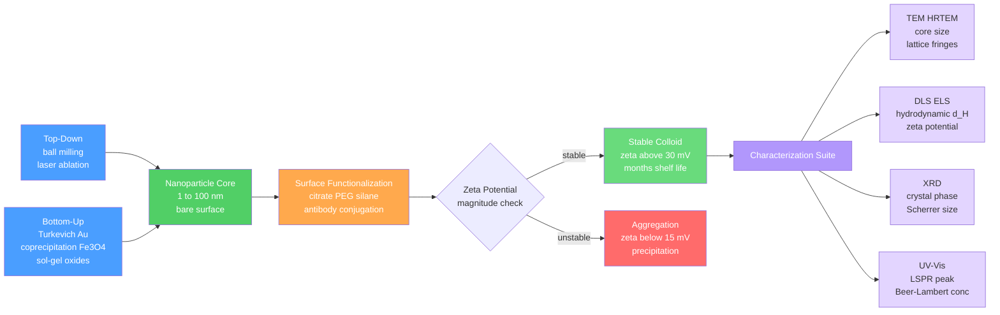

# ⚗️ Nanoparticles and Colloidal Systems

> [!abstract] TL;DR
> Nanoparticles (1–100 nm) exhibit size-dependent properties — red color, superparamagnetism, melting point depression, and catalytic enhancement — that are absent in bulk matter, because at this scale quantum confinement, surface-to-volume ratio, and electromagnetic resonance rewrite the rules. Understanding their optical response (Mie/LSPR), magnetic behavior (Néel relaxation), synthesis (Turkevich, coprecipitation), and colloidal stability (DLVO, zeta potential) is the foundation of nanomedicine, catalysis, and photonics.

---

## Intuition

**Analogy:** Drop a vial of 10 nm gold nanoparticles and it glows wine-red — not gold-colored. The same atoms that form a yellow ingot are now producing a completely different color. The difference is confinement. In bulk gold, billions of free electrons roam a macroscopic sea and simply reflect light. At 10 nm, those same electrons are squeezed into a cavity barely 50 atom-widths wide. When light's oscillating electric field shakes that electron cloud, all electrons slosh back and forth in unison — like water sloshing in a bowl. At one specific frequency, the sloshing resonates: the bowl rings, that wavelength is absorbed from white light, and you see the complementary color. This is **localized surface plasmon resonance (LSPR)**. Change the bowl size (particle diameter) and the resonant pitch changes; 10 nm Au particles absorb green (~520 nm) and appear red, while 80 nm particles absorb yellow-orange and appear blue.

The same size-dependent logic governs magnetism: a 10 nm iron oxide nanoparticle cannot sustain two magnetic domains — forming a domain wall would cost more surface energy than it saves in magnetostatic energy — so all its moments align in one single domain. Thermal energy then randomly flips that single giant dipole faster than you can measure it. The particle behaves as if it has no permanent magnetism: **superparamagnetism**.

---

## How It Works

### Size-Dependent Properties

Three distinct mechanisms drive the property changes observed in nanoparticles:

**1. Surface-to-volume ratio.** For a sphere of radius $R$, the fraction of surface atoms scales as $\sim 3a/R$ where $a$ is the lattice parameter (~0.29 nm for Au). A 5 nm Au particle has ~30% of its atoms at the surface; these atoms have fewer bonds and lower cohesive energy. This lowers the melting point via the **Gibbs-Thomson effect**:

$$\boxed{T_m(d) = T_m(\infty)\!\left[1 - \frac{4\gamma_{sl}}{\rho_s \,\Delta H_f \, d}\right]}$$

where $\gamma_{sl}$ is the solid–liquid interfacial energy, $\rho_s$ the solid density, $\Delta H_f$ the bulk latent heat of fusion, and $d$ the particle diameter. For Au at $d = 5\,\text{nm}$, $T_m$ drops from 1337 K to below 900 K — enabling sintering of nanoparticle inks at 150°C.

**2. Quantum confinement.** When $d$ is comparable to the electron de Broglie wavelength or the exciton Bohr radius, the continuous density of states becomes discretized. For semiconductor quantum dots (CdSe, ZnO, InP), this widens the effective band gap:

$$\Delta E_g \approx \frac{\hbar^2\pi^2}{2\mu d^2} - \frac{1.786\,e^2}{4\pi\varepsilon_0\varepsilon_r\,(d/2)}$$

where $\mu$ is the reduced electron–hole mass — yielding size-tunable fluorescence from blue (2 nm CdSe) to red (8 nm CdSe).

**3. Electromagnetic coupling and surface plasmon resonance.** In metallic nanoparticles, conduction electrons confined to $d \lesssim 100\,\text{nm}$ support coherent collective oscillations visible as LSPR peaks in the UV-Vis spectrum, enabling $10^6$-fold Raman enhancement (SERS) and tunable structural color.

### Localized Surface Plasmon Resonance: From Drude to Fröhlich

The optical response of a metallic nanoparticle is governed by its complex permittivity $\varepsilon(\omega)$. The **Drude free-electron model** gives:

$$\varepsilon(\omega) = \varepsilon_\infty - \frac{\omega_p^2}{\omega^2 + i\gamma\omega}$$

where $\varepsilon_\infty$ captures interband transitions, $\omega_p = \sqrt{ne^2/m\varepsilon_0}$ is the plasma frequency, and $\gamma$ is the damping rate (bulk Au: $\gamma_0 = 4.05\times10^{13}\,\text{rad/s}$, $\hbar\omega_p = 9.02\,\text{eV}$, $\varepsilon_\infty = 9.5$).

In the **quasi-static (Rayleigh) limit** — particle diameter $d \ll \lambda$ — the particle behaves as a point dipole with polarizability:

$$\alpha = 4\pi R^3 \varepsilon_m \,\frac{\varepsilon(\omega) - \varepsilon_m}{\varepsilon(\omega) + 2\varepsilon_m}$$

Resonance occurs when $|\varepsilon(\omega) + 2\varepsilon_m|$ is minimized — the **Fröhlich condition**:

$$\boxed{\varepsilon_r(\omega_\text{LSPR}) = -2\varepsilon_m}$$

At low damping ($\gamma \to 0$), substituting the Drude model:

$$\omega_\text{LSPR} = \frac{\omega_p}{\sqrt{\varepsilon_\infty + 2\varepsilon_m}}$$

For Au in water ($\varepsilon_m = 1.77$): $\omega_\text{LSPR}$ corresponds to $\lambda \approx 520\,\text{nm}$ — green absorption, red transmitted color — consistent with observation.

#### Mie Theory vs. Quasi-Static Approximation

**Mie theory** (1908) solves Maxwell's equations exactly for a sphere using an expansion in vector spherical harmonics with Lorenz-Mie coefficients $a_n$ (TM modes) and $b_n$ (TE modes):

$$Q_\text{ext} = \frac{2}{x^2}\sum_{n=1}^{\infty}(2n+1)\,\text{Re}(a_n + b_n)$$

where $x = \pi d n_m / \lambda_0$ is the size parameter. In the quasi-static limit ($x \ll 1$), only $a_1$ (electric dipole) survives:

$$Q_\text{ext} \approx \underbrace{4x\,\text{Im}\!\left[\frac{\varepsilon - \varepsilon_m}{\varepsilon + 2\varepsilon_m}\right]}_{Q_\text{abs}} + \underbrace{\frac{8}{3}\,x^4\,\left|\frac{\varepsilon - \varepsilon_m}{\varepsilon + 2\varepsilon_m}\right|^2}_{Q_\text{scat}}$$

| Regime | Condition | Dominant process |
|--------|-----------|-----------------|
| Quasi-static (Rayleigh) | $d < 60\,\text{nm}$ for Au | Absorption ($Q_\text{abs} \propto d$) dominates; $Q_\text{scat} \propto d^4$ negligible |
| Intermediate | $60 < d < 200\,\text{nm}$ | Scattering comparable to absorption; multipoles appear; LSPR red-shifts |
| Large (Mie) | $d > 200\,\text{nm}$ | Full multipole expansion needed; radiation damping broadens resonance |

**Size-dependent damping** (Kreibig model): when the particle radius $R$ falls below the electron mean free path (~50 nm in bulk Au), surface scattering adds to $\gamma$:

$$\gamma(R) = \gamma_\text{bulk} + \frac{A\,v_F}{R}, \quad v_F = 1.4\times10^6\,\text{m/s},\; A \approx 1$$

This broadens and dampens the LSPR for very small particles ($d < 10\,\text{nm}$).

### Magnetic Nanoparticles and Superparamagnetism

Bulk Fe₃O₄ (magnetite, inverse spinel) and γ-Fe₂O₃ (maghemite) are ferrimagnets with spontaneous magnetization arising from antiparallel Fe³⁺ and Fe²⁺/Fe³⁺ sublattices. In bulk, energy minimization produces **multiple magnetic domains**. Below a **critical single-domain diameter** $D_c$ (≈128 nm for Fe₃O₄, ≈166 nm for γ-Fe₂O₃), forming a domain wall costs more energy than it saves:

$$D_c \approx \frac{72\sqrt{AK}}{\mu_0 M_s^2}$$

where $A$ is exchange stiffness, $K$ the anisotropy constant, and $M_s$ the saturation magnetization. Below $D_c$, the particle is a **single magnetic domain** — all moments aligned.

**Superparamagnetic limit:** In a single-domain particle of volume $V$, the magnetic moment can thermally flip over the anisotropy barrier $\Delta E = KV$. The **Néel relaxation time** is:

$$\boxed{\tau_N = \tau_0 \exp\!\left(\frac{KV}{k_BT}\right)}, \quad \tau_0 \approx 10^{-9}\,\text{s}$$

When $KV \ll k_BT$: $\tau_N$ drops to nanoseconds, the moment fluctuates randomly, and the time-averaged magnetization is zero — **superparamagnetic behavior** (zero coercivity, zero remanence). The **blocking temperature** marks the crossover:

$$T_B = \frac{KV}{k_B\,\ln(\tau_\text{obs}/\tau_0)}$$

Above $T_B$: superparamagnetic. Below $T_B$: ferromagnetic-like with hysteresis.

In a fluid, the magnetic moment can also relax by **Brownian rotation** of the whole particle:

$$\tau_B = \frac{3\eta V_H}{k_B T}$$

where $\eta$ is fluid viscosity and $V_H$ is hydrodynamic volume. The effective relaxation is $\tau_\text{eff}^{-1} = \tau_N^{-1} + \tau_B^{-1}$; whichever path is faster dominates.

### Colloidal Stability: DLVO Theory

A colloidal dispersion is thermodynamically metastable — van der Waals attraction pulls particles toward aggregation unless an opposing force stabilizes them. **DLVO theory** models the interaction potential as a sum of two competing contributions:

$$V_\text{DLVO}(h) = V_\text{vdW}(h) + V_\text{EDL}(h)$$

**Van der Waals attraction** (always present):

$$V_\text{vdW} = -\frac{A_H\,R}{12\,h}$$

where $A_H$ is the Hamaker constant (10–100 zJ for metals in water), $R$ the particle radius, and $h$ the surface-to-surface separation.

**Electrostatic double-layer (EDL) repulsion:** surface charges (from ionized surface groups, adsorbed ions) attract counterions, forming a diffuse layer characterized by the Debye screening length:

$$\kappa^{-1} = \sqrt{\frac{\varepsilon\varepsilon_0 k_BT}{2n_0 z^2 e^2}}$$

In pure water, $\kappa^{-1} \approx 10\,\text{nm}$; in physiological saline (150 mM NaCl), $\kappa^{-1} \approx 0.7\,\text{nm}$ — the double layer is almost completely screened.

The **zeta potential** $\zeta$ (electrostatic potential at the hydrodynamic shear plane) serves as the practical stability criterion:

$$|\zeta| > 30\,\text{mV} \Rightarrow \text{electrostatically stable}$$
$$|\zeta| < 15\,\text{mV} \Rightarrow \text{rapid aggregation}$$

Beyond DLVO, **steric stabilization** (PEG, polymer brush) adds an entropic repulsion term: compressing a polymer brush costs conformational entropy, providing a strong, salt-insensitive barrier. Combining electrostatic and steric terms gives **electrosteric stabilization**.

### Synthesis Methods

**Top-down** approaches mechanically reduce bulk material:
- *Ball milling*: high-energy collisions grind powders to 10–100 nm; simple and scalable but produces broad size distributions and contamination from mill media.
- *Laser ablation in liquid*: pulsed laser removes metal atoms from a submerged target; yields ligand-free surfaces but low throughput.

**Bottom-up** approaches assemble nanoparticles from molecular precursors:

| Method | Target | Chemistry | Key Parameters |
|--------|--------|-----------|---------------|
| **Turkevich** (1951) | Au NPs, ~15 nm | AuCl₄⁻ reduced by citrate at 100°C; citrate reduces and caps | Temperature controls nucleation; $d \approx 15\,\text{nm}$, $\zeta \approx -35\,\text{mV}$ |
| **Seed-mediated growth** | Au nanorods | Small Au seeds + CTAB + AgNO₃ + ascorbic acid | Aspect ratio 1–6 tunes LSPR from 520 to 1300 nm |
| **Coprecipitation** | Fe₃O₄, γ-Fe₂O₃ | FeCl₂ + FeCl₃ (1:2) + NH₃ at pH 9–11 under N₂ | Fast, scalable; broad PSD; strict O₂ exclusion required |
| **Thermal decomposition** | Fe₃O₄, FePt | Iron oleate complex at 300°C in 1-octadecene | Narrow PSD ($\sigma < 5\%$); hydrophobic surface; solvent exchange needed |
| **Sol-gel** | SiO₂, TiO₂, ZnO | Metal alkoxide hydrolysis + condensation | Tunable porosity; amorphous → crystalline on calcination |

### Surface Functionalization

Bare nanoparticles aggregate in biological media and lack selectivity. Four key functionalization strategies:

1. **Ligand exchange.** Replace as-synthesized citrate or oleate capping with functional thiols: the Au–S bond ($E_b \approx 40\,\text{kcal/mol}$) displaces weakly bound citrate, attaching –COOH, –NH₂, or –OH termini for further conjugation.
2. **PEGylation.** Grafting poly(ethylene glycol) chains creates a steric brush that prevents opsonization (non-specific plasma protein adsorption) and extends blood circulation half-life from minutes to hours — essential for passive tumor accumulation via the EPR effect.
3. **Silane coupling.** Organotriethoxysilanes (APTES for –NH₂, MPTMS for –SH) react with oxide surface hydroxyls, converting Fe₃O₄ or SiO₂ surfaces to amine- or thiol-terminated for covalent conjugation chemistry.
4. **Antibody conjugation.** EDC/NHS coupling links carboxyl-functionalized NPs to antibody primary amines; His-tag/Ni²⁺-NTA coordinates recombinant antibody fragments site-directionally, preserving paratope orientation for active targeting in diagnostics.

### Characterization Suite

| Technique | What it measures | Key output |
|-----------|-----------------|-----------|
| **TEM / HRTEM** | Core size, shape, lattice fringes, crystallinity | Direct size distribution, d-spacing of crystal planes |
| **DLS** (dynamic light scattering) | Brownian motion decay rate → hydrodynamic diameter $d_H$ | $d_H$ (core + shell + hydration), PDI (polydispersity) |
| **XRD** (powder) | Crystal phase (peak positions), crystallite size (Scherrer eq.) | Phase ID, $\tau = K\lambda/\beta\cos\theta$ |
| **UV-Vis spectroscopy** | LSPR absorption peak position and linewidth | Concentration (Beer-Lambert), size estimate, aggregation |
| **ELS / Zeta-sizer** | Electrophoretic mobility → $\zeta$ | Colloidal stability, surface charge sign |
| **ICP-MS / ICP-OES** | Elemental composition | Metal concentration, stoichiometry |

### Flow — From Precursor to Characterized Colloid



---

## Key Concepts

### Secondary

A nanoparticle is an object so small — 1 to 100 nanometres across — that the majority of its atoms sit on the surface rather than buried in the interior. Surface atoms have fewer neighbors, more "dangling" bonds, and higher energy than interior atoms. Three consequences follow immediately:

- **More reactive:** a higher fraction of atoms are high-energy surface sites ready to participate in chemistry. Catalytic rates can be 10–100× higher than bulk.
- **Lower melting point:** with fewer bonds to break, a 5 nm gold particle melts hundreds of degrees below the bulk melting point (1064°C).
- **Different color:** for metallic particles, confined surface electrons oscillate in resonance with visible-light photons at a frequency set by the particle size. Gold looks red (not yellow) at 10 nm; this is the LSPR effect.

Iron oxide nanoparticles below about 20 nm behave as if they have no permanent magnetism at room temperature — the "superparamagnetic" state — because thermal energy is enough to randomly flip the entire magnetic moment. This makes them ideal for biomedical applications: they are strongly magnetic only when needed (in an external field) and do not magnetically aggregate in blood otherwise.

### Undergraduate

**LSPR physics (quasi-static limit).** When light hits a metal nanoparticle much smaller than $\lambda$, the particle polarizes as a dipole with polarizability $\alpha \propto (\varepsilon - \varepsilon_m)/(\varepsilon + 2\varepsilon_m)$. Resonance (denominator → 0) occurs at the Fröhlich condition $\varepsilon_r = -2\varepsilon_m$. For gold, this falls in the visible range (~520 nm for spheres in water), explaining the wine-red color. The extinction cross section is $C_\text{ext} = (k/\varepsilon_0)\,\text{Im}(\alpha)$ in the dipole limit, where $k = 2\pi n_m/\lambda_0$.

**Size-dependent damping.** Below ~20 nm, the electron mean free path exceeds the particle radius, so surface collisions add extra damping $\gamma(R) = \gamma_\text{bulk} + Av_F/R$. This broadens and weakens the LSPR peak for very small particles — a reminder that the Drude model must be corrected at the nanoscale.

**Colloidal stability.** The zeta potential $\zeta$ is the practical metric: $|\zeta| > 30\,\text{mV}$ indicates stable dispersion (electrostatic repulsion wins over van der Waals attraction); $|\zeta| < 15\,\text{mV}$ means imminent aggregation. High ionic strength compresses the Debye length $\kappa^{-1}$, screening the EDL — so nanoparticles stable in pure water can instantly aggregate in physiological saline. PEGylation is the standard fix.

**Superparamagnetism.** The ratio $KV/k_BT$ governs whether a single-domain particle retains its magnetization ($KV \gg k_BT$, blocked state) or thermally fluctuates ($KV \ll k_BT$, superparamagnetic). The Néel relaxation time $\tau_N = \tau_0\exp(KV/k_BT)$ changes by 10 orders of magnitude across the blocking temperature $T_B$.

### Graduate

**Full Mie theory.** The Lorenz-Mie coefficients $a_n$, $b_n$ involve Riccati-Bessel functions $\psi_n(x)$, $\xi_n(x)$ evaluated at $x = k_m R$ and $mx$ ($m = n_\text{sphere}/n_\text{medium}$):

$$a_n = \frac{m\psi_n(mx)\psi_n'(x) - \psi_n(x)\psi_n'(mx)}{m\psi_n(mx)\xi_n'(x) - \xi_n(x)\psi_n'(mx)}$$

The electric dipole ($n=1$) dominates for $x < 0.5$; higher multipoles ($n = 2$: quadrupole, $n = 3$: octupole) cause the LSPR to red-shift and develop a multipolar shoulder as $d$ increases. Radiation damping ($\propto x^3$) provides an intrinsic linewidth contribution that is absent in the quasi-static approximation and is the dominant broadening mechanism for $d > 80\,\text{nm}$.

**Plasmonic coupling and SERS.** When two Au NPs approach within $\sim d/10$ of each other, their plasmon modes hybridize into bonding (red-shifted) and antibonding (blue-shifted) modes. In the bonding mode the electric field is concentrated in the gap: $|E/E_0|^2 \propto (d/g)^3$ for gap $g \to 0$. This "hotspot" enhancement reaches $10^{10}$–$10^{11}$ for SERS, enabling single-molecule Raman detection.

**Beyond DLVO.** Real colloidal potentials include polymer brush steric repulsion (scales as $e^{-h/L}$ for brush height $L$), depletion attraction (from non-adsorbing polymers that create an osmotic pressure when excluded from the gap between particles), and hydration forces at $h < 1\,\text{nm}$. The full interaction:

$$V_\text{total} = V_\text{vdW} + V_\text{EDL} + V_\text{steric} + V_\text{depletion} + V_\text{hydration}$$

**Magnetic relaxation switching (MRSw).** $T_2$-weighted MRI contrast from SPIONs arises from local magnetic field inhomogeneity dephasing water proton spins. In the outer-sphere (motional narrowing) regime, transverse relaxivity scales as $r_2 \propto M_s^2 V / D_\text{water}$. Deliberate SPION clustering (triggered by target analyte binding) increases the effective magnetic moment, boosting $r_2$ by up to 10×. This is the basis of the MRSw biosensor platform, where aggregation state encodes analyte concentration with nanomolar sensitivity.

---

## Python Demo

```python
import numpy as np
import matplotlib.pyplot as plt

# ─── Quasi-static Mie extinction for Au nanoparticles in water ────────────────
# Drude-Kreibig model: bulk Drude + size-dependent surface scattering damping
# Valid for diameter d < ~60 nm (electric dipole term dominates)
#
# Outputs:
#   Panel A — Q_ext, Q_abs, Q_scat vs diameter at lambda = 532 nm
#   Panel B — LSPR peak wavelength vs diameter (demonstrating red-shift with size)

c_light  = 3.0e8    # speed of light, m/s
eps_inf  = 9.5      # Au interband contribution to permittivity
omega_p  = 1.37e16  # Au plasma frequency, rad/s
gamma_0  = 4.05e13  # Au bulk Drude damping rate, rad/s
v_F      = 1.40e6   # Au Fermi velocity, m/s
A_surf   = 1.0      # surface scattering coefficient (Fermi-gas: A = 1)


def au_permittivity(lam_nm, d_nm):
    """Drude-Kreibig Au permittivity including size-dependent surface scattering.

    gamma(d) = gamma_0 + A * v_F / R   where R = d/2 is particle radius.
    Both lam_nm and d_nm may be numpy arrays (broadcasting applies).
    """
    R     = d_nm * 0.5e-9                        # radius in metres
    gamma = gamma_0 + A_surf * v_F / R           # size-corrected damping
    omega = 2.0 * np.pi * c_light / (lam_nm * 1e-9)
    return eps_inf - omega_p**2 / (omega**2 + 1j * gamma * omega)


def Q_ext_rayleigh(d_nm, lam_nm=532.0, n_m=1.33):
    """Extinction, absorption, and scattering efficiencies (quasi-static limit).

    Q_abs  = 4x * Im[(eps - eps_m)/(eps + 2*eps_m)]
    Q_scat = (8/3)*x**4 * |CM|**2
    x      = pi * d * n_m / lambda_0   (size parameter using diameter)
    """
    eps   = au_permittivity(lam_nm, d_nm)
    eps_m = n_m**2
    x     = np.pi * d_nm * n_m / lam_nm          # size parameter
    CM    = (eps - eps_m) / (eps + 2.0 * eps_m)  # Clausius-Mossotti factor
    Q_abs  = 4.0 * x * np.imag(CM)
    Q_scat = (8.0 / 3.0) * x**4 * np.abs(CM)**2
    return Q_abs + Q_scat, Q_abs, Q_scat


# ─── Panel A: extinction components vs diameter at lambda = 532 nm ────────────
d_arr = np.linspace(5, 100, 800)
Qe, Qa, Qs = Q_ext_rayleigh(d_arr, lam_nm=532.0)

# ─── Panel B: LSPR peak wavelength red-shifts with increasing size ─────────────
lam_arr   = np.linspace(400, 800, 800)
d_scan    = np.arange(5, 105, 5, dtype=float)
peak_lams = []
for d_val in d_scan:
    Qe_spec, _, _ = Q_ext_rayleigh(d_val, lam_nm=lam_arr)
    peak_lams.append(lam_arr[np.argmax(Qe_spec)])

# ─── Plotting ─────────────────────────────────────────────────────────────────
fig, (ax1, ax2) = plt.subplots(1, 2, figsize=(13, 5))

ax1.plot(d_arr, Qe, color='#d4a017', linewidth=2.2,
         label=r'$Q_\mathrm{ext}$')
ax1.plot(d_arr, Qa, color='firebrick', linewidth=1.6,
         linestyle='--', label=r'$Q_\mathrm{abs}$')
ax1.plot(d_arr, Qs, color='steelblue', linewidth=1.6,
         linestyle=':', label=r'$Q_\mathrm{scat}$')
ax1.set_xlabel(r'Diameter $d$ (nm)', fontsize=12)
ax1.set_ylabel(r'Efficiency $Q$', fontsize=12)
ax1.set_title(r'Au NPs in water  —  $\lambda = 532$ nm', fontsize=12)
ax1.legend(fontsize=11)
ax1.grid(True, alpha=0.25, linestyle='--')
ax1.set_xlim(5, 100)

sc = ax2.scatter(d_scan, peak_lams, c=peak_lams, cmap='plasma', s=70, zorder=5)
ax2.plot(d_scan, peak_lams, 'k-', alpha=0.25, linewidth=1)
plt.colorbar(sc, ax=ax2, label='LSPR peak (nm)')
ax2.set_xlabel(r'Diameter $d$ (nm)', fontsize=12)
ax2.set_ylabel('LSPR peak wavelength (nm)', fontsize=12)
ax2.set_title('LSPR peak red-shifts with increasing size', fontsize=12)
ax2.grid(True, alpha=0.25, linestyle='--')

plt.tight_layout()
plt.savefig('au_nanoparticle_lspr.png', dpi=150, bbox_inches='tight')
plt.show()
```

**What the demo reveals:**
- *Panel A*: At 532 nm, $Q_\text{abs}$ grows approximately linearly with $d$ (dipole absorption dominates at small sizes) while $Q_\text{scat}$ grows as $d^4$ — very small particles are pure absorbers (heat generators), larger ones are efficient scatterers (light redirectors). This crossover near 60–80 nm is exploited: absorbers are preferred for photothermal therapy; scatterers for dark-field imaging.
- *Panel B*: The LSPR peak red-shifts from ~515 nm at 5 nm to ~540 nm at 100 nm via the size-dependent damping correction — qualitatively capturing the color evolution of Au nanoparticle suspensions.

---

## Real-World Applications

> **Lateral flow assay diagnostics (Au NPs).** Rapid antigen tests — including COVID-19 lateral flow assays — use 20–40 nm Au NPs conjugated to capture antibodies. The LSPR wine-red color provides a naked-eye signal at the test line when antigen is captured; no instrumentation required. Sensitivity reaches ~10⁶ viral particles/mL using silver-enhancement amplification. The assay is manufactured by simple nitrocellulose membrane deposition.

> **MRI contrast agents (SPIONs).** Feridex (ferumoxides, ~80 nm clusters of 4–5 nm Fe₃O₄ cores) have transverse relaxivity $r_2 \approx 120\,\text{mM}^{-1}\text{s}^{-1}$ — far exceeding Gd-chelate $r_1$ agents. Kupffer cells in the liver phagocytose the particles, darkening healthy parenchyma on $T_2$-weighted images and revealing tumors as bright unphagocytosed regions.

> **Three-way automotive catalyst (Pt/Pd NPs).** Platinum and palladium nanoparticles (2–5 nm) dispersed on γ-Al₂O₃ washcoat catalyze simultaneous oxidation of CO and hydrocarbons and reduction of NO$_x$. Size criticality: below ~1.5 nm, the CO binding energy becomes too high (poisoning); above ~10 nm, precious metal dispersion drops and cost-efficiency collapses.

> **Photothermal cancer therapy (Au nanorods).** Aspect-ratio-controlled Au nanorods (e.g., 40 × 10 nm, AR ≈ 4) shift their longitudinal LSPR to 808 nm — in the near-infrared tissue transparency window. After IV injection and tumor accumulation via the EPR effect, a 808 nm CW laser heats the tumor locally to >50°C, inducing thermal ablation without ionizing radiation or systemic toxicity.

> **Transparent UV-blocking sunscreen (ZnO NPs).** 20–30 nm ZnO particles are too small to scatter visible light (Rayleigh scattering $\propto d^6/\lambda^4$ is negligible in this regime) so sunscreens appear colorless on skin. They absorb UV below 380 nm via the wide band gap ($E_g = 3.37\,\text{eV}$), replacing the opaque white zinc oxide formulations of earlier generations.

---

## Common Pitfalls

- **Ignoring size-dependent damping** — Using bulk-gold Drude permittivity in the quasi-static formula gives a too-sharp, too-intense LSPR for particles below ~20 nm. Always apply the Kreibig correction $\gamma(R) = \gamma_\text{bulk} + Av_F/R$; failure to do so underestimates the linewidth by a factor of 2–3 at $d = 5\,\text{nm}$.
- **Confusing core diameter with hydrodynamic diameter** — DLS reports $d_H$ (core + ligand shell + hydration layer), which can be 5–15 nm larger than TEM core diameter for PEGylated particles. Reporting DLS size as "particle size" without specifying "hydrodynamic" is a common ambiguity in literature.
- **Coprecipitation under ambient atmosphere** — Fe₃O₄ synthesis requires strict N₂/Ar atmosphere. Even trace O₂ oxidizes Fe²⁺ completely to Fe³⁺, yielding maghemite (γ-Fe₂O₃) instead of the 2:1 Fe²⁺/Fe³⁺ magnetite stoichiometry, reducing saturation magnetization by ~30% and changing the crystal phase.
- **Treating blocking temperature as a material constant** — $T_B \propto 1/\ln(\tau_\text{obs}/\tau_0)$ is measurement-frequency-dependent. The same nanoparticles appear superparamagnetic under AC susceptometry (kHz) but blocked (ferromagnetic-like) under slow DC magnetometry (100 s timescale). Always specify the measurement time or frequency.
- **Ignoring ionic strength for zeta potential** — A colloid stable in pure water ($\kappa^{-1} \approx 10\,\text{nm}$) can aggregate instantly when diluted into PBS ($\kappa^{-1} \approx 0.7\,\text{nm}$) because the EDL is screened. Zeta potential measurements should be conducted at the intended use ionic strength; PEGylation is essential for physiological applications.
- **Reporting LSPR peak without specifying medium** — The LSPR peak position shifts ~2–3 nm per 0.01 refractive index unit change in the surrounding medium. A 20 nm Au NP peak shifts ~15–20 nm between ethanol ($n = 1.36$) and water ($n = 1.33$). This sensitivity is exploited in refractometric biosensors but becomes a source of irreproducibility if solvent is not controlled.

---

## Related Concepts

- [[X_Ray_Diffraction_and_Braggs_Law]] — the Scherrer equation is the primary method for extracting crystallite size from nanoparticle XRD patterns; reciprocal-space analysis reveals the crystal phase (spinel Fe₃O₄ vs. rock-salt FeO) that governs magnetic properties
- [[Electromagnetic_Waves_and_Radiation]] — LSPR and Mie scattering are exact solutions to Maxwell's equations for metallic spheres; the quasi-static polarizability connects to classical dipole radiation and the Larmor formula
- [[Chemical_Bonding_in_Solids]] — the Drude free-electron model starts from metallic bonding theory; surface coordination chemistry (Au–S bond for thiols, M–O bond for silane coupling) governs all functionalization chemistry
- [[Crystal_Systems_and_Space_Groups]] — the inverse spinel structure of Fe₃O₄, FCC structure of Au, and wurtzite ZnO each impose specific symmetry constraints on anisotropy constants, optical selection rules, and surface terminations
- [[_MOC_Physics_Master]] — condensed matter section covers Drude model, band theory, and magnetism; electromagnetism section provides the foundation for Mie scattering and LSPR; quantum mechanics section covers quantum confinement
- [[_MOC_Chemistry_Master]] — inorganic synthesis section covers coprecipitation and sol-gel chemistry; physical chemistry section covers DLVO colloidal thermodynamics and electrokinetics

### See Also — Within This Vault Section

- [[_MOC_Nanotechnology_and_Nanomaterials]] — parent MOC for this nanotechnology section
- [[Nanomedicine_and_Drug_Delivery_Systems]] — applies LSPR photothermal heating, SPION MRI contrast, and PEGylation to targeted drug delivery, in vivo imaging, and cancer therapy
- [[Nanofabrication_and_Self_Assembly]] — top-down lithography and bottom-up self-assembly methods for creating ordered 2-D and 3-D nanostructures beyond simple spherical nanoparticles

---

## Review Questions

**Secondary / Conceptual**

1. Two vials of gold nanoparticle suspension are placed side by side — one appears red, one appears blue-gray. Which vial contains larger particles? Sketch the electron oscillation inside a single nanoparticle and explain why its size sets the resonant color.
2. Bulk iron is strongly magnetic and retains its magnetization after the applied field is removed. Explain why a 5 nm iron oxide nanoparticle at room temperature behaves as if it has no permanent magnetism. What would happen to the same particle if it were cooled to near absolute zero?

**Undergraduate / Quantitative**

3. Starting from the quasi-static polarizability $\alpha = 4\pi R^3 \varepsilon_m(\varepsilon - \varepsilon_m)/(\varepsilon + 2\varepsilon_m)$, derive the Fröhlich resonance condition. Using the zero-damping Drude model, show that $\omega_\text{LSPR} = \omega_p/\sqrt{\varepsilon_\infty + 2\varepsilon_m}$. Calculate the predicted $\lambda_\text{LSPR}$ for Au in water ($\varepsilon_m = 1.77$, $\hbar\omega_p = 9.02\,\text{eV}$, $\varepsilon_\infty = 9.5$) and compare to the experimentally observed ~520 nm.
4. A suspension of 15 nm Fe₃O₄ nanoparticles measures a zeta potential of $-22\,\text{mV}$ in water. (a) Is this suspension stable? (b) Predict qualitatively what happens when you dilute it 1:1 into PBS (150 mM NaCl). (c) Propose one surface modification strategy to maintain stability at physiological ionic strength, and explain its mechanism in terms of interaction potential terms.

**Graduate / Research**

5. The Drude-Kreibig model adds surface-scattering damping $\gamma(R) = \gamma_\text{bulk} + Av_F/R$. (a) What physical scattering process does this correction describe, and why does it become important only below ~20 nm? (b) Predict the qualitative effect on the LSPR linewidth $\Delta\lambda$ as diameter decreases from 60 nm to 2 nm. (c) At what particle size does the discrete-level spacing $\delta E \sim E_F(d/a_0)^{-3}$ become comparable to $k_BT$ at room temperature, and what new physics emerges beyond the Kreibig model?
6. Compare three LSPR wavelength tuning strategies for Au: (a) sphere diameter 5–100 nm, (b) nanorod aspect ratio 1–6, (c) surrounding medium refractive index 1.33–1.50. For each, estimate the achievable LSPR wavelength range and identify one application that specifically exploits that tuning axis. Why is strategy (b) preferred for near-infrared biomedical applications?

---

## Sources

- [Burda, C. et al. — "Chemistry and Properties of Nanocrystals of Different Shapes," *Chem. Rev.* 105, 1025 (2005)](https://doi.org/10.1021/cr030063a) — comprehensive review of synthesis and size/shape-dependent optical and electronic properties; standard reference for LSPR theory
- [Turkevich, J., Stevenson, P. C. & Hillier, J. — "A Study of the Nucleation and Growth Processes in the Synthesis of Colloidal Gold," *Discuss. Faraday Soc.* 11, 55 (1951)](https://doi.org/10.1039/df9511100055) — original citrate-reduction gold nanoparticle synthesis; one of the most-cited nanoscience papers
- [Mie, G. — "Beiträge zur Optik trüber Medien, speziell kolloidaler Metallösungen," *Ann. Phys.* 330, 377 (1908)](https://doi.org/10.1002/andp.19083300302) — original Mie scattering theory for metallic spheres in a dielectric medium
- [Bohren, C. F. & Huffman, D. R. — *Absorption and Scattering of Light by Small Particles* (Wiley-VCH, 1983)](https://www.wiley.com/en-us/Absorption+and+Scattering+of+Light+by+Small+Particles-p-9780471293408) — definitive textbook; Chapter 4 derives all Mie coefficients; Chapter 12 covers metal spheres and LSPR
- [Lu, A.-H., Salabas, E. L. & Schüth, F. — "Magnetic Nanoparticles: Synthesis, Protection, Functionalization, and Application," *Angew. Chem. Int. Ed.* 46, 1222 (2007)](https://doi.org/10.1002/anie.200602866) — authoritative review of magnetic nanoparticle synthesis, superparamagnetism, and biomedical applications
- [Verwey, E. J. W. & Overbeek, J. T. G. — *Theory of the Stability of Lyophobic Colloids* (Elsevier, 1948)](https://archive.org/details/theoryofstabilit0000verw) — original DLVO colloidal stability monograph; foundational for all nanoparticle dispersion work

---

#MaterialsScience #Nanoparticles #Colloids #LSPR #Gold #Nanotechnology #Superparamagnetism #MieScattering #SPIONs #Plasmonic
