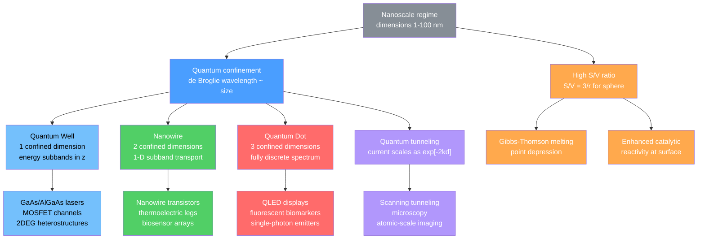

# ⚛️ Nanoscale Physics and Quantum Confinement

> [!abstract] TL;DR
> At the nanoscale (1–100 nm) two revolutions collide: the electron's de Broglie wavelength becomes comparable to the object's size, so only standing waves that fit inside the box are allowed — producing discrete, size-tunable energy levels — and the surface-to-volume ratio $S/V = 3/r$ balloons so high that surface energy governs melting, reactivity, and optical behavior. Understanding these effects — confinement, tunneling, Coulomb blockade, ballistic transport, and Gibbs–Thomson depression — is the physical foundation of quantum dots, STM, single-electron transistors, and every modern nanodevice.

---

## Intuition

**Analogy:** Imagine blowing differently sized soap bubbles and tapping each one. Tiny bubbles ring at a high pitch; large bubbles ring low. This happens because only certain standing acoustic waves fit inside each bubble — the smaller the bubble, the shorter (higher-frequency, higher-energy) those waves must be to satisfy the boundary condition. An electron inside a nanoscale crystal is exactly the same: its quantum mechanical wave must fit without gaps, so only certain wavelengths — and therefore only certain energies — are permitted. Shrink the crystal and the electron is forced into a higher-energy standing wave.

At the nanoscale, this is not a small correction. Halving the box size quadruples the minimum electron energy. The color of light emitted by a CdSe nanocrystal shifts from deep red all the way to violet simply by changing its diameter from 8 nm to 2 nm. The physics is identical to a particle in a box; only the box has a visible-light emission tag attached.

---

## How It Works

### Core Mechanics

**1. Surface-to-volume ratio and why nanoscale is different.**

For a sphere of radius $r$ the ratio of surface area $4\pi r^2$ to volume $\tfrac{4}{3}\pi r^3$ is:

$$\frac{S}{V} = \frac{3}{r}$$

At $r = 1\ \mu\text{m}$ this equals $3 \times 10^6\ \text{m}^{-1}$; at $r = 5\ \text{nm}$ it is $6 \times 10^8\ \text{m}^{-1}$ — two hundred times larger. Surface atoms have fewer bonding neighbors, contributing excess surface energy $\gamma$ (J m$^{-2}$). When $S/V$ is large enough, this surface energy term overwhelms bulk thermodynamics and redefines every equilibrium property.

**2. de Broglie wavelength and the onset of quantum effects.**

For an electron with momentum $p$ the de Broglie wavelength is:

$$\lambda = \frac{h}{p} = \frac{h}{\sqrt{2m^* E}}$$

In bulk silicon at room temperature ($E \sim 25\ \text{meV}$, $m^* \approx 0.19\,m_e$) this gives $\lambda \approx 12\ \text{nm}$. Once the physical dimension $L$ of a nanostructure satisfies $L \lesssim \lambda$, an electron can no longer behave as a classical point particle in a continuous band. The boundary of the material forces the wavefunction into discrete standing modes.

**3. Particle-in-a-box: discrete, size-dependent energy levels.**

An electron of effective mass $m^*$ confined in an infinite square well of size $L$ must satisfy $\psi(0) = \psi(L) = 0$. This forces an integer number of half-wavelengths to fit, giving:

$$E_n = \frac{n^2 \pi^2 \hbar^2}{2\, m^* L^2}, \qquad n = 1, 2, 3, \ldots$$

Two immediate consequences define all of nanoelectronics and quantum photonics:

- **Discrete spectrum** — the continuous band of bulk is replaced by quantized sub-levels.
- **Size-dependent gap** — reducing $L$ by a factor of 2 raises $E_1$ by a factor of 4.

The number of spatial dimensions subjected to confinement produces a hierarchy of nanostructures:

| Structure | Confined dims | Free dims | Level structure |
|-----------|:---:|:---:|-----------------|
| Bulk semiconductor | 0 | 3 | Continuous bands |
| Quantum well (thin film) | 1 ($z$) | 2 ($x,y$) | Discrete $E_z$ subbands; 2-D DOS |
| Nanowire | 2 ($x,y$) | 1 ($z$) | Discrete $E_x, E_y$; 1-D subbands |
| Quantum dot | 3 | 0 | Fully discrete, atom-like spectrum |

**4. Quantum dots and the Brus equation.**

For a spherical semiconductor nanocrystal of diameter $d$ (radius $r = d/2$), Brus (1984) derived the size-dependent optical gap by treating the exciton as a particle-in-a-sphere and adding a first-order Coulomb correction:

$$\boxed{E_\text{gap}(r) = E_\text{bulk} + \frac{\hbar^2\pi^2}{2\mu r^2} - \frac{1.8\,e^2}{4\pi\varepsilon_0\varepsilon_r\,r}}$$

The first correction term is the kinetic **confinement blueshift** ($\propto r^{-2}$); the second is the electron–hole Coulomb **attraction redshift** ($\propto r^{-1}$). The reduced exciton mass $\mu = m_e^* m_h^* / (m_e^* + m_h^*)$ combines both carrier masses.

The **exciton Bohr radius** sets the crossover length:

$$a_B = \frac{4\pi\varepsilon_0\varepsilon_r\hbar^2}{\mu\,e^2} = \frac{\varepsilon_r}{\mu/m_e}\,a_0$$

where $a_0 = 0.0529\ \text{nm}$ is the hydrogen Bohr radius. For CdSe: $m_e^* = 0.13\,m_e$, $m_h^* = 0.45\,m_e$, $\varepsilon_r = 9.4$, giving $\mu \approx 0.101\,m_e$ and $a_B \approx 5\ \text{nm}$.

- **Strong confinement** ($r \ll a_B$): kinetic term dominates, $E_\text{gap} \propto r^{-2}$, large blueshift.
- **Weak confinement** ($r \gg a_B$): Coulomb term recovers bulk-like exciton physics.

**5. Quantum tunneling and scanning tunneling microscopy.**

A classical electron with energy $E < V_0$ cannot penetrate a potential barrier. Quantum mechanically, the wavefunction decays exponentially through the barrier with decay constant:

$$\kappa = \frac{\sqrt{2m^*(V_0 - E)}}{\hbar}$$

The tunneling current across a gap of width $d$ is:

$$I \propto \exp(-2\kappa d)$$

For a typical metal work function $V_0 - E \approx 4\ \text{eV}$ and $m^* = m_e$, $\kappa \approx 1.02\ \text{nm}^{-1}$. A 0.1 nm change in tip–sample distance changes $I$ by $e^{-0.2} \approx 18\%$ — giving the extraordinary vertical sensitivity that makes STM capable of imaging individual atoms.

**6. Surface energy dominance and Gibbs–Thomson melting depression.**

The chemical potential of a curved surface is elevated relative to a flat bulk surface. For a sphere of radius $r$ with surface energy $\gamma$ and molar volume $V_m$:

$$\mu_\text{nano}(r) = \mu_\text{bulk} + \frac{2\gamma V_m}{r}$$

This raises the melting temperature (or, equivalently, depresses it relative to what flat-surface equilibrium would predict), giving the **Gibbs–Thomson relation**:

$$T_m(r) = T_{m,\text{bulk}}\!\left(1 - \frac{2\gamma V_m}{\Delta H_\text{fus}\,r}\right)$$

For gold nanoparticles ($\gamma \approx 1.5\ \text{J m}^{-2}$, $T_{m,\text{bulk}} = 1337\ \text{K}$), a 3 nm radius particle melts near 600 K — over 700 K below bulk gold. This effect is exploited in nanoscale sintering of interconnects in printed electronics.

**7. Coulomb blockade in nanoscale capacitors.**

A quantum dot coupled to two leads acts as a nanoscale capacitor with capacitance $C \sim 10^{-18}\ \text{F}$ (attofarad). Adding a single electron costs charging energy:

$$E_C = \frac{e^2}{2C}$$

For $C = 1\ \text{aF}$, $E_C \approx 80\ \text{meV} \gg k_BT$ at low temperature. Electron transfer is therefore blocked unless a gate voltage exactly compensates this energy — **Coulomb blockade**. Sweeping the gate traces out sharp conductance peaks (Coulomb oscillations) spaced by $e/C$, with one additional electron per peak. This is the operating principle of single-electron transistors.

**8. Ballistic transport and the Landauer formula.**

When device length $L$ falls below the electron mean free path $\ell$ (typically $\ell \sim 10$–100 nm in clean metals), the electron traverses the device without scattering. Conductance is then set by the number of available quantum channels, not by Ohmic resistance. The **Landauer formula** gives:

$$G = \frac{2e^2}{h} \sum_n T_n$$

where $T_n \in [0,1]$ is the transmission probability of the $n$-th transverse mode and $2e^2/h \approx 77.5\ \mu\text{S}$ is the conductance quantum $G_0$. Atomic-scale gold contacts exhibit step-like conductance in integer multiples of $G_0$ as the contact is stretched one atom at a time — a direct experimental signature of quantum transport.

### Flow / Architecture



---

## Key Concepts

### Secondary Level

**Why "nano" is special.**  At the macroscale, doubling the size of an object doubles everything proportionally. At the nanoscale this fails. A 10 nm gold sphere has ~40% of its atoms at or near the surface; a 1 mm sphere has fewer than 0.000 001% at the surface. Those surface atoms have dangling bonds and higher energy — changing the melting point, color, and reactivity entirely.

**Quantum dots as tunable LEDs.**  A quantum dot is a tiny semiconductor crystal, 2–10 nm across. Because its energy levels are set by size (via the particle-in-a-box formula), it emits a color determined purely by how big it is:

| CdSe dot diameter | Emission color | Wavelength range |
|-------------------|----------------|------------------|
| ~2.5 nm | Violet–blue | 400–460 nm |
| ~3.5 nm | Green | 510–540 nm |
| ~5 nm | Yellow–orange | 570–600 nm |
| ~7 nm | Red | 620–650 nm |

The same material, different size, different color — pure quantum mechanics in action.

**Quantum tunneling makes STM possible.**  Bring a sharp metal tip within 1 nm of a surface, apply a small voltage, and electrons tunnel across the vacuum gap. Because tunneling current falls by ~10× for every 0.1 nm increase in gap, keeping the current constant while scanning traces the surface topography at better than 0.01 nm height resolution — well enough to image individual atoms.

### Undergraduate Level

**Particle-in-a-box energy quantization.** Solving the time-independent Schrödinger equation $-(\hbar^2/2m)\psi'' = E\psi$ in an infinite square well $[0, L]$ with boundary conditions $\psi(0) = \psi(L) = 0$ gives standing-wave solutions $\psi_n = \sqrt{2/L}\sin(n\pi x/L)$ with energies $E_n = n^2\pi^2\hbar^2/(2mL^2)$. The ground-state energy $E_1 \propto L^{-2}$ is the quantum zero-point energy — it cannot be zero because that would violate the uncertainty principle ($\Delta x = L \Rightarrow \Delta p \geq \hbar/2L$).

**Confinement regime classification.** In a quantum well, free carriers still exist in 2-D (in-plane) but their out-of-plane energy is quantized into subbands. The 2-D density of states becomes step-like (constant per subband interval, unlike the parabolic bulk DOS), enabling laser diode gain without broadening from thermal carrier spread — the key advantage of quantum-well lasers over bulk lasers.

**Exciton and the Bohr radius.** When a photon is absorbed in a semiconductor, it creates an electron–hole pair bound by Coulomb attraction: an **exciton**. The exciton Bohr radius $a_B = (4\pi\varepsilon_0\varepsilon_r\hbar^2)/(\mu e^2)$ is the natural length scale. In bulk GaAs, $a_B \approx 14\ \text{nm}$; in CdSe, $a_B \approx 5\ \text{nm}$. When the dot radius $r < a_B$, the exciton wavefunction is compressed by the boundary, increasing kinetic energy — the strong confinement regime.

**Tunneling decay length.** The wavefunction amplitude in a classically forbidden region decays as $\psi \propto e^{-\kappa x}$ where $\kappa = \sqrt{2m(V_0 - E)}/\hbar$. For a 4 eV barrier and free electrons, $\kappa \approx 10.2\ \text{nm}^{-1}$, meaning the probability density halves every 0.068 nm. This extreme sensitivity is why STM achieves sub-atomic vertical resolution.

**Gibbs–Thomson and nano-catalysis.** Nanoparticles used as catalysts (Pt, Pd, Au) have most of their atoms at the surface with coordinatively unsaturated sites. The Gibbs–Thomson effect also slightly lowers the activation barrier for surface reactions by shifting the chemical potential of surface atoms. Combined with the large surface area, this makes nanoparticle catalysts orders of magnitude more active per gram than bulk metals.

### Graduate Level

**Full Brus equation derivation.** The ground state of an exciton in a sphere of radius $r$ uses the particle-in-a-sphere energy $E_{100} = \hbar^2\pi^2/(2\mu r^2)$ (lowest spherical Bessel root $j_0$) as the kinetic term, and treats the Coulomb interaction $-e^2/(4\pi\varepsilon_0\varepsilon_r r_{eh})$ in first-order perturbation theory. The result is:

$$E_\text{gap}(r) = E_\text{bulk} + \underbrace{\frac{\hbar^2\pi^2}{2\mu r^2}}_{\text{kinetic }\propto r^{-2}} - \underbrace{\frac{1.8\,e^2}{4\pi\varepsilon_0\varepsilon_r r}}_{\text{Coulomb }\propto r^{-1}}$$

The factor 1.8 is a numerical result from integrating $\langle 1/r_{eh}\rangle$ over the ground-state spherical Bessel wavefunctions. At small $r$ the $r^{-2}$ term wins; at large $r$ the $r^{-1}$ term causes a slight redshift before converging to $E_\text{bulk}$. Higher Brus corrections include image-charge terms, non-parabolic dispersion, and spin-orbit splitting.

**Strong vs weak confinement in detail.** In strong confinement ($r \ll a_B$), the single-particle picture applies — electron and hole are quantized independently. In weak confinement ($r \gg a_B$), the center-of-mass quantization of the whole exciton dominates: $\Delta E \approx \hbar^2\pi^2/(2M r^2)$ where $M = m_e^* + m_h^*$ (total exciton mass), giving much smaller shifts. CdSe nanocrystals in the 2–10 nm range are almost entirely in the strong confinement regime since $a_B \approx 5\ \text{nm}$.

**Coulomb blockade and single-electron transistor physics.** The total energy of $N$ electrons on a quantum dot with gate voltage $V_g$ and gate capacitance $C_g$ is:

$$E(N) = \frac{e^2 N^2}{2C_\Sigma} - N e V_g C_g / C_\Sigma$$

where $C_\Sigma$ is the total capacitance. A conductance peak occurs whenever $E(N) = E(N-1)$, i.e., when $V_g = (N - 1/2)e/C_g$. Sweeping $V_g$ through these values produces periodic Coulomb oscillations, one peak per added electron. In the valleys between peaks, the dot is Coulomb-blockaded and conductance drops to near zero (suppressed by $e^{-E_C/k_BT}$).

**Landauer–Büttiker formalism.** The Landauer formula $G = (2e^2/h)\sum_n T_n$ can be derived from the Fermi golden rule applied to quantum channels. The quantum of conductance $G_0 = 2e^2/h$ (factor of 2 for spin) arises because each perfectly transmitting 1-D mode carries a current $(2e^2/h)\Delta\mu/e$ for a bias $\Delta\mu$. In a quantum point contact (a saddle-point constriction in a 2DEG), channels open one by one as the constriction widens, giving conductance steps of exactly $G_0$ — directly observable at low temperature.

**InP quantum dots and heavy-metal-free displays.** Cadmium-free InP quantum dots ($E_\text{bulk} = 1.35\ \text{eV}$, $a_B \approx 10\ \text{nm}$) cover the full visible spectrum from 450 nm to 750 nm as diameter ranges from ~1.5 nm to 5 nm. They use a ZnS or ZnSe passivating shell to reduce surface trap emission (shell isolates core from surface states), achieving quantum yields >90%. InP/ZnS QDs are now the commercial material in Samsung QLED televisions, having replaced toxic CdSe-based dots in consumer products.

---

## Python Demo

```python
import numpy as np
import matplotlib.pyplot as plt

# --- Physical constants (SI) ---
hbar   = 1.0545718e-34   # J s
e_ch   = 1.60218e-19     # C
m_e    = 9.10938e-31     # kg
eps0   = 8.854187817e-12 # F m^-1
hc_eV  = 1239.84         # eV nm (convenient unit for wavelength)

# --- CdSe material parameters ---
E_bulk_eV = 1.74          # bulk band gap of CdSe at 300 K (eV)
m_star_e  = 0.13          # electron effective mass (m_e units)
m_star_h  = 0.45          # heavy-hole effective mass (m_e units)
eps_r     = 9.4           # relative permittivity of CdSe

# Reduced exciton mass
mu_kg = (m_star_e * m_star_h / (m_star_e + m_star_h)) * m_e  # ~0.101 m_e

# Exciton Bohr radius (for reference)
a_B_nm = (4 * np.pi * eps0 * eps_r * hbar**2) / (mu_kg * e_ch**2) * 1e9
print(f"CdSe exciton Bohr radius: a_B = {a_B_nm:.2f} nm")

# --- Diameter range 2–8 nm; Brus equation uses RADIUS r = d/2 ---
d_nm = np.linspace(2.0, 8.0, 400)
r_m  = (d_nm / 2.0) * 1e-9   # radius in metres

kinetic_J  = (hbar**2 * np.pi**2) / (2.0 * mu_kg * r_m**2)
coulomb_J  = (1.8 * e_ch**2)   / (4.0 * np.pi * eps0 * eps_r * r_m)

E_gap_J  = E_bulk_eV * e_ch + kinetic_J - coulomb_J
E_gap_eV = E_gap_J / e_ch

# Emission wavelength lambda = hc / E_gap
lambda_nm = hc_eV / E_gap_eV

# --- Approximate sRGB color for each emission wavelength ---
def wl_to_rgb(wl):
    """Map visible wavelength (nm) to approximate RGB tuple."""
    if   wl < 380: return (0.50, 0.00, 0.80)
    elif wl < 440: t = (440 - wl) / 60.0;  return (t,   0.0, 1.0)
    elif wl < 490: t = (wl  - 440) / 50.0; return (0.0, t,   1.0)
    elif wl < 510: t = (510 - wl)  / 20.0; return (0.0, 1.0, t)
    elif wl < 580: t = (wl  - 510) / 70.0; return (t,   1.0, 0.0)
    elif wl < 645: t = (645 - wl)  / 65.0; return (1.0, t,   0.0)
    else:                                   return (1.0, 0.0, 0.0)

# --- Plotting ---
fig, axes = plt.subplots(1, 2, figsize=(13, 5))

# Left panel: emission wavelength vs dot diameter, colored by emitted color
for i in range(len(d_nm) - 1):
    axes[0].plot(d_nm[i : i + 2], lambda_nm[i : i + 2],
                 color=wl_to_rgb(lambda_nm[i]), linewidth=3)
axes[0].axhline(710, color="gray", linestyle="--", linewidth=1,
                label="CdSe bulk limit (~710 nm)")
axes[0].set_xlabel("Quantum Dot Diameter  d  (nm)")
axes[0].set_ylabel("Peak Emission Wavelength  (nm)")
axes[0].set_title("CdSe Quantum Dots: Tunable Color via Size\n(Brus Equation)")
axes[0].set_ylim(380, 750)
axes[0].legend(fontsize=9)
axes[0].grid(True, alpha=0.3)
axes[0].text(2.4, 430, "Violet / UV\n(strong confinement)", fontsize=8, color="indigo")
axes[0].text(6.0, 660, "Red\n(weak confinement)", fontsize=8, color="darkred")

# Right panel: band gap vs diameter
axes[1].plot(d_nm, E_gap_eV, color="#4a9eff", linewidth=2.5,
             label="E_gap (Brus equation)")
axes[1].axhline(E_bulk_eV, color="orange", linestyle="--", linewidth=1.5,
                label=f"CdSe bulk  E_g = {E_bulk_eV} eV")
axes[1].fill_between(d_nm, E_gap_eV, E_bulk_eV,
                     where=(E_gap_eV > E_bulk_eV),
                     alpha=0.15, color="#4a9eff", label="Confinement blueshift")
axes[1].set_xlabel("Quantum Dot Diameter  d  (nm)")
axes[1].set_ylabel("Band Gap  E_g  (eV)")
axes[1].set_title("Quantum Confinement Widens the CdSe Band Gap\n(Brus Equation)")
axes[1].legend(fontsize=9)
axes[1].grid(True, alpha=0.3)

plt.tight_layout()
plt.savefig("cdse_quantum_dot_emission.png", dpi=150, bbox_inches="tight")
plt.show()

# Print reference table
print("\nCdSe emission wavelength vs dot diameter (Brus equation):")
print(f"{'d (nm)':>8}  {'E_gap (eV)':>12}  {'lambda (nm)':>12}  Color")
for d_val in [2.5, 3.0, 3.5, 4.0, 5.0, 6.0, 7.0, 8.0]:
    idx = int(np.argmin(np.abs(d_nm - d_val)))
    lam = lambda_nm[idx]
    if   lam < 450: color_label = "violet"
    elif lam < 500: color_label = "blue"
    elif lam < 560: color_label = "green"
    elif lam < 590: color_label = "yellow"
    elif lam < 625: color_label = "orange"
    else:           color_label = "red"
    print(f"{d_val:>8.1f}  {E_gap_eV[idx]:>12.3f}  {lam:>12.0f}  {color_label}")
```

---

## Real-World Applications

> **Quantum dots in QLED displays (Samsung, TCL):** Samsung's QLED televisions use CdSe (legacy) and InP/ZnS (current cadmium-free) quantum dots as wavelength-converting phosphors. A blue LED pump excites dots of three precisely tuned sizes that emit narrow-band red (~630 nm), green (~530 nm), and blue (~450 nm) light. Because the emission linewidth is ~20–30 nm vs 50–80 nm for conventional phosphors, QLED panels achieve wider color gamut (DCI-P3 > 90%) and higher peak brightness than OLED at lower manufacturing cost. The entire product depends on the Brus equation: the size of each dot batch is engineered to within 0.1 nm to hit the target wavelength.

> **Scanning tunneling microscopy and atomic manipulation (IBM, 1989):** When Eigler and Schweizer at IBM spelled out "IBM" by repositioning 35 xenon atoms on a nickel surface at 4 K, they were exploiting the $I \propto e^{-2\kappa d}$ tunneling current to sense and position individual atoms. STM has since been used to construct single-molecule logic gates, measure the Kondo resonance on a single atom, and image the charge density waves in 2-D materials with sub-angstrom resolution — all powered by the same exponential tunneling formula.

> **GaAs/AlGaAs quantum well lasers (every fiber-optic link):** The 1.31 and 1.55 µm laser diodes that drive global fiber-optic communications are quantum-well devices. A 5–10 nm GaAs quantum well between AlGaAs barriers confines both electrons and holes into 2-D subbands, concentrating the joint density of states at a single energy and producing threshold currents 10× lower than bulk lasers. Without quantum confinement engineering, the internet's fiber backbone would require impractically high pump powers.

---

## Trade-offs

| Aspect | Pro | Con |
|--------|-----|-----|
| Size-tunability | Single material covers full visible spectrum (QD) | Extremely tight size distribution required (< 5% polydispersity for narrow emission) |
| Surface reactivity | Enhanced catalysis, faster kinetics at nano | Surface trap states quench QD fluorescence; needs passivation shell |
| Ballistic transport | Near-zero resistance in short channels | Only achievable at low temperature or very short $L$; hard to integrate at scale |
| Coulomb blockade | Single-electron control, ultra-low-power logic | Operates only at $k_BT \ll E_C$, requiring cryogenic cooling for current dot sizes |
| Melting depression | Enables low-temperature sintering of nanoink | Nanoparticles coarsen and lose nano-properties during use at elevated temperature |

---

## When to Use vs Avoid

**Use when:**
- You need wavelength-tunable emission from a single semiconductor system (QD-LEDs, biological labels).
- You are engineering a laser or photodetector and want to tailor the emission wavelength without changing the semiconductor alloy composition.
- You want to exploit the high surface area of nanoparticles for catalysis, sensing, or drug delivery.
- You are studying quantum transport phenomena (conductance quantization, Coulomb blockade) at low temperature.

**Avoid when:**
- Size distribution cannot be controlled tightly — polydisperse QDs give broad, featureless emission and lose all confinement advantages.
- Operating above ~50 K with Coulomb blockade devices — thermal fluctuations $k_BT$ exceed $E_C$ and the single-electron effect washes out.
- Long-term stability under high-power optical pumping — nanoparticle surfaces oxidize and photobleach unless rigorously shelled and encapsulated.
- Cost is a primary constraint — high-purity monodisperse nanocrystal synthesis is significantly more expensive than bulk semiconductor processing.

---

## Common Pitfalls

- **Confusing dot diameter with dot radius in the Brus equation** — The original Brus (1984) formulation uses the sphere radius $r$, not the diameter. Substituting diameter directly doubles the kinetic energy term, red-shifting all predicted wavelengths and giving wrong confinement energies by up to a factor of 4. Always check which length convention a formula uses.

- **Applying bulk effective masses at very small sizes** — Effective masses are defined in the bulk band structure. For dots below ~1.5 nm, non-parabolicity of the bands makes the simple Brus equation unreliable; atomistic or tight-binding calculations become necessary.

- **Assuming all surface atoms are "defects"** — Surface atoms are in a lower-coordination environment and can be passivated by organic ligands (TOPO, oleate) or inorganic shells (ZnS). Unpassivated surfaces introduce mid-gap trap states that quench photoluminescence, but a well-chosen shell (ZnS on CdSe) can raise quantum yield from ~5% to > 85%.

- **Forgetting the Coulomb correction reduces the confinement blueshift** — The kinetic term always blueshifts the gap; the Coulomb term partially cancels it. Treating only the kinetic term overestimates the gap energy by ~10–30%, which is significant for optical device engineering.

- **Treating Coulomb blockade as a room-temperature effect** — $E_C = e^2/2C$ must exceed $k_BT \approx 26\ \text{meV}$ at 300 K for blockade to be visible. For a 5 nm dot with $C \sim 1\ \text{aF}$, $E_C \approx 80\ \text{meV}$ — marginal. Reliable single-electron gating typically requires $T < 77\ \text{K}$ for current nanocrystal capacitances.

- **Equating ballistic transport with dissipationless transport** — Landauer conductance $G = (2e^2/h)\sum T_n$ has a finite value even when $T_n = 1$. Energy is still dissipated — but in the reservoirs (leads), not in the channel. The channel itself is scattering-free, but the device as a whole still dissipates heat.

---

## Related Concepts

**Cross-vault — Physics:**
- [[Wave_Particle_Duality_and_Uncertainty]] — de Broglie wavelength $\lambda = h/p$ and the uncertainty principle are the foundational quantum mechanical results that make size-dependent confinement possible
- [[Schrodinger_Equation]] — the particle-in-a-box energy formula $E_n = n^2\pi^2\hbar^2/(2mL^2)$ is a direct solution of the time-independent Schrödinger equation with hard-wall boundary conditions
- [[Crystal_Structure_and_Band_Theory]] — bulk band structure and effective masses $m^*$ that enter the Brus equation; the continuous bands that confinement discretizes
- [[Semiconductors_and_Devices]] — p-n junctions, heterostructures, and quantum-well lasers that use 1-D confinement in device applications
- [[Quantum_Statistical_Mechanics]] — Fermi–Dirac and Bose–Einstein statistics governing the occupation of quantized levels at finite temperature; relevant to Coulomb blockade threshold

**Same vault — Materials Science:**
- [[Chemical_Bonding_in_Solids]] — the LCAO-to-band-theory framework showing how atomic orbitals form the continuous bands that quantum confinement discretizes into sub-levels
- [[Phonons_and_Lattice_Dynamics]] — surface phonon modes in nanoparticles are modified by confinement just as electronic modes are; phonon confinement affects thermal conductivity in nanowires

**Master MOC:**
- [[_MOC_Physics_Master]] — physics vault entry point; quantum mechanics and condensed matter sections are the physical backbone of this note

**Sister notes — Nanotechnology section (forward links):**
- [[_MOC_Nanotechnology_and_Nanomaterials]] — section map
- [[Carbon_Nanomaterials_Graphene_Nanotubes_Fullerenes]] — graphene and carbon nanotubes are the canonical 2-D and 1-D quantum-confined systems in the carbon family
- [[Two_Dimensional_Materials_Beyond_Graphene]] — MoS₂, hBN, black phosphorus — 2-D crystals where confinement to a monolayer directly opens and tunes the band gap
- [[Nanoparticles_and_Colloidal_Systems]] — synthesis, stabilization, and surface chemistry of the quantum dot and nanoparticle systems described here
- [[Nano_Electronics_and_MEMS_NEMS]] — device implementations of ballistic transport, Coulomb blockade, and quantum-well structures in working transistors and sensors
- [[Electronic_Band_Structure]] — full $E(\mathbf{k})$ dispersion, density of states, and effective mass tensor that underlie every quantitative calculation in this note (forward link — planned Materials Science note)

---

## Review Questions

1. **(Secondary)** A CdSe quantum dot is synthesized in two batches: one with average diameter 3 nm and one with 6 nm. (a) Predict which batch emits at shorter wavelength and explain using the particle-in-a-box analogy. (b) If you wanted to make a green LED ($\lambda \approx 530$ nm), which diameter would you target and why?

2. **(Undergraduate)** An STM experiment uses a tungsten tip with a work function of 4.5 eV. The sample surface has a work function of 4.3 eV. (a) Calculate the decay constant $\kappa$ for electrons tunneling across the vacuum gap at the average barrier height of 4.4 eV. (b) By what factor does the tunneling current change when the tip–sample distance increases from 0.5 nm to 0.6 nm? (c) Explain why this exponential sensitivity is what allows STM to image single atoms.

3. **(Graduate)** (a) Derive the Brus equation by treating the electron and hole as independent particles-in-a-sphere and computing the first-order Coulomb correction. Identify why the kinetic term scales as $r^{-2}$ while the Coulomb correction scales as $r^{-1}$. (b) For CdSe ($m_e^* = 0.13\,m_e$, $m_h^* = 0.45\,m_e$, $\varepsilon_r = 9.4$), compute the exciton Bohr radius $a_B$ and determine the minimum dot diameter for which the weak-confinement approximation $\Delta E \approx \hbar^2\pi^2/(2Mr^2)$ is valid to within 10% of the full Brus result. (c) Qualitatively explain why InP quantum dots require larger diameters than CdSe to achieve the same emission wavelength.

---

## Sources

- Callister, W. D. & Rethwisch, D. G. — *Materials Science and Engineering: An Introduction*, 9th ed., Ch. 13 (nanomaterials overview, surface effects, Gibbs–Thomson)
- Ozin, G. A. & Arsenault, A. C. — *Nanochemistry: A Chemical Approach to Nanomaterials*, 2nd ed. (quantum dots, Brus equation, synthesis, applications)
- Brus, L. E. — "Electron–electron and electron-hole interactions in small semiconductor crystallites: The size dependence of the lowest excited electronic state," *J. Chem. Phys.* 80, 4403 (1984) — original quantum dot paper
- Alivisatos, A. P. — "Semiconductor clusters, nanocrystals, and quantum dots," *Science* 271, 933 (1996) — landmark review of size-dependent properties
- Datta, S. — *Electronic Transport in Mesoscopic Systems*, Cambridge University Press (ballistic transport, Landauer formula, Coulomb blockade)
- Ibach, H. & Lüth, H. — *Solid-State Physics*, 4th ed. (quantum wells, surface physics, tunneling)
- Murray, C. B., Norris, D. J. & Bawendi, M. G. — "Synthesis and characterization of nearly monodisperse CdE (E = S, Se, Te) semiconductor nanocrystallites," *J. Am. Chem. Soc.* 115, 8706 (1993) — foundational CdSe synthesis paper

---

#materialsscience #nanotechnology #quantumconfinement #quantumdots #brsequation #quantumwell #nanowire #tunnelingcurrent #STM #coulombblockade #landauerformula #gibbsthomson #sizedependent #CdSe #InP #secondary #undergraduate #graduate
