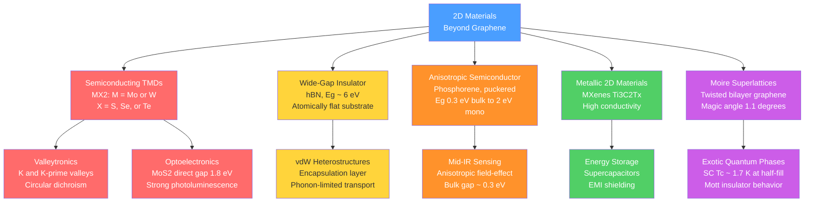

# Two-Dimensional Materials Beyond Graphene

> [!abstract] TL;DR
> Beyond graphene, a rich zoo of atomically thin crystals — semiconducting TMDs, insulating hBN, anisotropic phosphorene, metallic MXenes, and moiré superlattices — each exhibit properties inaccessible in the bulk, from tunable direct bandgaps and valley pseudospin to flat-band unconventional superconductivity, making them the building blocks of a new generation of quantum devices.

---

## Intuition

**Analogy:** 2D materials are the world's thinnest LEGO bricks. Each type of brick (MoS₂, hBN, graphene) has its own colour and snapping mechanism. Stack the same bricks in a tower and you get ordinary bulk behaviour. Pull one brick out alone and it transforms — a brick that was dull grey in the stack suddenly glows bright when isolated. Now rotate two identical bricks against each other by one degree before snapping them together: the subtle interference pattern between their atomic grids creates an entirely new super-structure with properties neither brick had alone — including, remarkably, superconductivity.

In technical terms: reducing a material to a single atomic layer removes translational symmetry in the out-of-plane direction, quantises the electronic states in that direction, and — when inversion symmetry is broken — unlocks topological, optical, and spin/valley degrees of freedom that are rigorously forbidden in the centrosymmetric bulk. Stacking two such layers at a twist angle $\theta$ creates a moiré superlattice whose emergent periodicity $L_m \gg a$ can host strongly correlated electron physics.

---

## How It Works

### Core Mechanics

**1. General principle — dimensional reduction.** In a bulk layered crystal, electron dispersion has a $k_z$ component; interlayer coupling hybridises the out-of-plane orbitals. Thinning to a monolayer eliminates $k_z$, collapsing a 3D band structure onto a strictly 2D one. This alone shifts band-edge positions and changes gap character (direct vs indirect).

**2. TMD crystal structure.** A transition metal dichalcogenide MX₂ (M = Mo, W; X = S, Se, Te) consists of one metal layer sandwiched between two chalcogen layers in trigonal prismatic (2H phase) or octahedral (1T phase) coordination, forming an X–M–X sandwich ~6–7 Å thick. Adjacent sandwiches are held together only by van der Waals forces (binding energy ~50–80 meV/Ų), enabling exfoliation.

**3. Indirect-to-direct bandgap crossover in MoS₂.** In bulk 2H-MoS₂ the conduction band minimum (CBM) sits midway between $\Gamma$ and K (at the $\Lambda$ point), giving an **indirect** gap of $E_g \approx 1.2$ eV. In the monolayer, $k_z$ hybridisation of the metal $d_{z^2}$ orbital with chalcogen $p_z$ states is removed; the $\Lambda$ minimum rises in energy and the direct-gap transition at the **K point** drops to $E_g \approx 1.8$ eV. The system switches from indirect to direct:

$$E_g^{\text{bulk}} \approx 1.2\ \text{eV (indirect, }\Lambda\text{-point)} \quad\longrightarrow\quad E_g^{\text{monolayer}} \approx 1.8\ \text{eV (direct, K-point)}$$

This switch causes the photoluminescence (PL) quantum yield to jump by 3–4 orders of magnitude going from bilayer to monolayer.

**4. Valley pseudospin.** Monolayer TMDs have broken spatial inversion symmetry (the two X sublayers are inequivalent) while preserving time-reversal symmetry. This combination gives the **K** and **K$'$** valleys opposite Berry curvatures:

$$\Omega_-(\mathbf{k})\big|_K = -\,\Omega_-(\mathbf{k})\big|_{K'}$$

where for a massive Dirac fermion with mass $\Delta/2$ and Fermi velocity $v_F$:

$$\Omega_-(\mathbf{k}) = -\frac{\Delta\,(\hbar v_F)^2}{2\bigl[(\hbar v_F k)^2 + (\Delta/2)^2\bigr]^{3/2}}$$

Right-circularly polarised light ($\sigma^+$) couples exclusively to the K valley; left-circular light ($\sigma^-$) to K$'$. This **optical valley selectivity** is the basis of valleytronics.

**5. Moiré superlattice and magic angle.** Two graphene sheets twisted by angle $\theta$ create a long-wavelength beating pattern — the moiré superlattice — with lattice constant:

$$\boxed{L_m = \frac{a}{2\sin(\theta/2)}}$$

where $a = 0.246$ nm is the graphene lattice constant. At small angles, $L_m \approx a/\theta$ (radians), diverging as $\theta \to 0$. Bistritzer and MacDonald (2011) predicted that at a "magic angle" $\theta_m \approx 1.1°$ the lowest moiré minibands become **flat** (bandwidth $\to 0$), making the kinetic energy negligible and correlation effects dominant. Cao et al. (2018) confirmed both a **Mott insulator** state at half-filling of the flat band and, slightly away from half-filling, **unconventional superconductivity** with $T_c \approx 1.7$ K.

**6. hBN.** Hexagonal boron nitride is isostructural to graphene (honeycomb, $a = 0.250$ nm) but with alternating B and N atoms and a wide bandgap $E_g \approx 5.9$ eV. It is atomically flat, has no dangling bonds, and its lattice mismatch with graphene (~1.8%) produces a weak moiré that, critically, does not break the graphene bands near the Dirac point. hBN is therefore the ideal substrate and encapsulant for other 2D materials.

**7. Phosphorene.** Black phosphorus exfoliates to a puckered (non-planar) monolayer. Each P atom forms three bonds in a corrugated structure, creating strong in-plane anisotropy: the effective mass along the zigzag direction is $m_x^* \approx 0.17\,m_e$ and along armchair $m_y^* \approx 1.12\,m_e$ — a ratio of ~6.6. The direct bandgap tunes from $\approx 0.3$ eV (bulk) to $\approx 2$ eV (monolayer), covering a spectral range (mid-IR to visible) inaccessible to TMDs.

**8. MXenes.** MXenes are 2D transition metal carbides/nitrides of the form $M_{n+1}X_nT_x$ (e.g., Ti₃C₂Tₓ), synthesised by selectively etching the A-layer from MAX phases (Ti₃AlC₂ + HF → Ti₃C₂Tₓ). The surface terminations $T_x$ (–OH, –F, –O) are tunable; the metallic basal plane delivers conductivity up to $\sim 10^4$ S/cm in films, rivalling copper thin films.

### Materials Landscape



---

## Key Concepts

### Secondary

**What makes 2D materials special?** In a thick crystal, billions of atomic layers stack on top of each other. Electrons experience an average of all those layers and behave as if they live in a 3D bulk. Pull a single layer off — by sticking sticky tape to a crystal and peeling — and suddenly electrons live in a world with only two spatial dimensions. Confinement in the third direction changes energy levels, can make dull materials bright (like MoS₂), and can make stable materials unstable (black phosphorus oxidises in air within hours because its unprotected surface is far more reactive than the bulk).

**The family of van der Waals materials.** Layered solids held together by weak van der Waals forces between layers — but covalent bonds within each layer — can be exfoliated. The three main classes accessible today are:

| Material | Type | Bandgap | Standout property |
|---|---|---|---|
| Graphene | Semimetal | 0 eV (Dirac) | Massless Dirac fermions, ballistic transport |
| MoS₂, WS₂, MoSe₂, WSe₂ | Semiconductor | 1–2 eV (direct, mono) | Photoluminescence, valleytronics |
| hBN | Insulator | ~6 eV | Flat dielectric, encapsulant |
| Black phosphorus | Semiconductor | 0.3–2 eV (tunable) | Mid-IR, anisotropy |
| Ti₃C₂Tₓ (MXene) | Metal | ~0 eV | High conductivity, large surface area |
| Cr₂Ge₂Te₆, CrI₃ | Ferromagnet | ~0.7 eV | 2D magnetism |

**Why does MoS₂ glow in monolayer form?** In the bulk, an electron that wants to recombine with a hole (releasing light) must also pass its momentum to a lattice vibration (phonon) to reach the indirect band edge — this is slow and inefficient. In the monolayer, the band edge is a direct K-to-K transition requiring no phonon mediator; recombination is fast and radiative, making the material an efficient emitter.

### Undergraduate

#### TMD Electronic Structure

The 2H-TMD unit cell has D₃ₕ symmetry in the monolayer. The relevant electronic states at the K point are dominated by the metal $d$ orbitals. The low-energy effective Hamiltonian for each valley $\tau = \pm 1$ is a **massive Dirac fermion**:

$$H_\tau = \hbar v_F\bigl(\tau k_x \hat{\sigma}_x + k_y \hat{\sigma}_y\bigr) + \frac{\Delta}{2}\hat{\sigma}_z + \lambda_{\text{SOC}}\,\tau\,\frac{\hat{\sigma}_z - \mathbb{1}}{2}\,s_z$$

where $\hat{\sigma}$ acts on the sublattice (metal/chalcogen) pseudo-spin, $s_z = \pm 1$ is real spin, $\Delta$ is the crystal field gap, and $\lambda_{\text{SOC}}$ is the spin-orbit coupling constant. Key consequences:
- The valence band splits by $2\lambda_{\text{SOC}}$ (in W compounds $\lambda \sim 400$ meV — enormous, easily observable at room temperature)
- At K valley, spin-up holes occupy the upper valence band; at K$'$, spin-down holes do (spin–valley locking)

#### Berry Curvature and Valley Hall Effect

In a periodic crystal, the Berry curvature of band $n$ is:

$$\Omega_n(\mathbf{k}) = -2\,\mathrm{Im}\sum_{n' \neq n} \frac{\langle n\mathbf{k}|\hat{v}_x|n'\mathbf{k}\rangle\langle n'\mathbf{k}|\hat{v}_y|n\mathbf{k}\rangle}{(\omega_{n'} - \omega_n)^2}$$

It acts as a fictitious magnetic field in $\mathbf{k}$-space. An applied electric field $\mathbf{E}$ gives each electron an anomalous transverse velocity:

$$\mathbf{v}_{\text{anom}} = -\frac{e}{\hbar}\mathbf{E} \times \boldsymbol{\Omega}(\mathbf{k})$$

Because $\Omega_K = -\Omega_{K'}$, K-valley electrons drift to the right while K$'$-valley electrons drift to the left — producing a **valley Hall effect** with no net charge current (but a net valley current). Circularly polarised optical pumping generates valley-polarised carriers; subsequent electrical detection of the valley Hall signal constitutes a valleytronic operation.

#### hBN as a Substrate

Placing graphene or a TMD directly on SiO₂ exposes carriers to charged impurities and surface phonons, limiting mobility to ~10,000 cm² V⁻¹ s⁻¹. hBN encapsulation pushes mobility to >100,000 cm² V⁻¹ s⁻¹ for graphene at room temperature (approaching the phonon-scattering limit). Three reasons: (1) hBN has no charged surface states; (2) its surface optical phonons lie at higher energy (~100 meV vs ~60 meV for SiO₂); (3) the atomically flat surface suppresses corrugation-induced scattering.

#### MXene Synthesis

MXenes are synthesised by selective etching of the aluminium layer from Ti₃AlC₂ (a MAX phase) in HF or HCl/LiF solutions:

$$\text{Ti}_3\text{AlC}_2 + 3\,\text{HF} \longrightarrow \text{Ti}_3\text{C}_2 + \text{AlF}_3 + \tfrac{3}{2}\text{H}_2$$

The resulting Ti₃C₂Tₓ flakes (Tₓ = –OH, –F, –O surface groups) can be delaminated into single 2D sheets by intercalation with dimethyl sulphoxide (DMSO) or similar molecules. The surface terminations govern both the work function (~1.6–2.3 eV range tunable by chemistry) and the electrochemical performance.

### Graduate

#### Bistritzer–MacDonald Model and Flat Bands

For twisted bilayer graphene (tBLG) at small angles, the moiré superlattice has three inequivalent interlayer tunnelling regions: AA (both layers aligned), AB, and BA. The continuum model Hamiltonian is:

$$H_{\text{tBLG}} = \begin{pmatrix} H_{\text{graphene}}(\mathbf{k} - \mathbf{K}_1) & T(\mathbf{r}) \\ T^\dagger(\mathbf{r}) & H_{\text{graphene}}(\mathbf{k} - \mathbf{K}_2) \end{pmatrix}$$

where $T(\mathbf{r})$ encodes the three tunnelling harmonics. The dimensionless parameter controlling the physics is:

$$\alpha = \frac{w}{v_F \Delta K}$$

where $w \approx 110$ meV is the interlayer tunnelling, $\Delta K = 2K\sin(\theta/2)$ is the wavevector difference, and $v_F$ is graphene's Fermi velocity. At the magic angle, $\alpha \approx 1$, and the Dirac cone velocity renormalises to zero: the bandwidth of the lowest two moiré bands collapses to near zero (~5 meV at $\theta = 1.1°$) while the gap to remote bands ($\sim 30$ meV) stays finite — true flat bands.

#### Mott Insulator and Unconventional Superconductivity (Cao et al. 2018)

At half-filling (one electron per moiré unit cell, or filling $\nu = \pm 2$ relative to the charge-neutrality point), the flat-band Coulomb energy $U \sim e^2/(L_m \varepsilon)$ is ~20 meV, vastly exceeding the kinetic energy bandwidth ~5 meV. The Hubbard ratio $U/t \gg 1$ drives a **Mott insulator** — electrons localise one per site even though the flat band nominally holds two spins.

Shifting the chemical potential slightly away from half-filling by electrostatic gating (tuning $\nu$ from $\pm 2$) induces **superconductivity** with $T_c \approx 1.7$ K. The phase diagram — Mott insulator flanked by superconducting domes as a function of carrier density — is strikingly similar to cuprate high-$T_c$ superconductors. The pairing mechanism is not phonon-mediated BCS but likely driven by strong magnetic fluctuations or an intrinsic flat-band instability. This discovery unified condensed matter physics around a single system: a carbon-only material with a tunable knob (twist angle) that controls the entire phase diagram.

#### Van der Waals Heterostructures and Artificial Crystals

Individual 2D sheets can be stacked in arbitrary sequences using dry-transfer techniques (PC/PDMS stamps), creating vdW heterostructures:

- **MoSe₂/WSe₂:** Type-II band alignment; electrons in one layer, holes in the other form interlayer excitons with nanosecond lifetimes (vs picoseconds for intralayer excitons) — candidates for excitonic BEC
- **Graphene/hBN/graphene:** Fowler-Nordheim tunnelling transistors with atomically thin dielectric
- **MoS₂/hBN/graphene:** Photovoltaic heterostructures with atomically thin p-n junctions (EQE > 1% demonstrated)
- **CrI₃/CrI₃:** Layer-number-controlled magnetism; intralayer FM, interlayer AFM coupling that reverses under electric field

The key design tool is band alignment engineering. Using the Anderson's rule generalized to 2D, one selects layers with appropriate electron affinity ($\chi$) and band gap to construct Type-I (straddling), Type-II (staggered), or Type-III (broken-gap) junctions at the atomic scale.

---

## Python Demo

```python
import numpy as np
import matplotlib.pyplot as plt
from matplotlib.patches import Patch

# ── Data: MoS₂ layer-dependent bandgap ─────────────────────────────────────
# Experimental / DFT values. Monolayer has DIRECT gap; bulk and few-layer INDIRECT.
layer_labels = ['N=1\n(mono)', 'N=2', 'N=3', 'N=4', 'Bulk']
E_g_values   = [1.8, 1.6, 1.4, 1.3, 1.2]   # eV
gap_types    = ['Direct', 'Indir', 'Indir', 'Indir', 'Indir']
bar_colors   = ['#ff6b6b', '#4a9eff', '#4a9eff', '#4a9eff', '#4a9eff']
x = np.arange(len(layer_labels))

fig, (ax1, ax2) = plt.subplots(1, 2, figsize=(13, 5))
fig.suptitle('2D Materials: Bandgap Tuning and Moire Superlattices',
             fontsize=13, fontweight='bold')

# ── Plot 1: MoS₂ bandgap bar chart ──────────────────────────────────────────
bars = ax1.bar(x, E_g_values, color=bar_colors, edgecolor='white', linewidth=0.8, width=0.6)
for bar, gtype, eg in zip(bars, gap_types, E_g_values):
    ax1.text(bar.get_x() + bar.get_width() / 2, eg + 0.03,
             f'{eg:.1f} eV\n({gtype})', ha='center', va='bottom', fontsize=8.5)
ax1.set_xticks(x)
ax1.set_xticklabels(layer_labels, fontsize=9)
ax1.set_ylabel('Bandgap $E_g$ (eV)', fontsize=11)
ax1.set_title('MoS$_2$ Layer-Dependent Bandgap', fontsize=10)
ax1.set_ylim(0, 2.3)
ax1.set_xlim(-0.5, 4.5)
legend_elements = [Patch(facecolor='#ff6b6b', label='Direct gap (N=1)'),
                   Patch(facecolor='#4a9eff', label='Indirect gap (N >= 2)')]
ax1.legend(handles=legend_elements, fontsize=9, loc='lower right')

# ── Plot 2: Moire lattice constant L_m vs twist angle θ ─────────────────────
# Formula: L_m = a / (2 * sin(theta/2)) for twisted bilayer graphene
a_graphene = 0.246       # nm — graphene in-plane lattice constant
theta_deg  = np.linspace(0.5, 10.0, 800)
L_m        = a_graphene / (2.0 * np.sin(np.deg2rad(theta_deg / 2.0)))   # nm

theta_magic = 1.1        # degrees (Cao et al. 2018)
L_magic     = a_graphene / (2.0 * np.sin(np.deg2rad(theta_magic / 2.0)))

ax2.plot(theta_deg, L_m, color='#4a9eff', linewidth=2.2,
         label='$L_m = a / (2\\sin(\\theta/2))$')
ax2.axvline(theta_magic, color='#ff6b6b', linestyle='--', linewidth=1.8,
            label=f'Magic angle $\\theta_m \\approx {theta_magic}^{{\\circ}}$')
ax2.scatter([theta_magic], [L_magic], color='#ff6b6b', s=90, zorder=5)
ax2.annotate(
    f'$L_m$ = {L_magic:.1f} nm\n$T_c$ ~ 1.7 K, Mott insulator',
    xy=(theta_magic, L_magic),
    xytext=(theta_magic + 1.8, L_magic + 2.5),
    fontsize=8.5, color='#ff6b6b',
    arrowprops=dict(arrowstyle='->', color='#ff6b6b', lw=1.5)
)
ax2.set_xlabel('Twist angle $\\theta$ (degrees)', fontsize=11)
ax2.set_ylabel('Moire lattice constant $L_m$ (nm)', fontsize=11)
ax2.set_title('tBLG Moire Lattice Constant vs Twist Angle', fontsize=10)
ax2.set_xlim(0.5, 10.0)
ax2.set_ylim(0, 16)
ax2.legend(fontsize=9)
ax2.grid(True, alpha=0.3)

plt.tight_layout()
plt.savefig('2d_materials_bandgap_moire.png', dpi=150, bbox_inches='tight')
plt.show()

print(f"At magic angle {theta_magic} deg: L_m = {L_magic:.2f} nm")
print(f"Moire unit cell contains ~{(L_magic / a_graphene)**2:.0f} graphene unit cells")
```

**What to observe:**
- The MoS₂ bar chart dramatically shows the monolayer (N=1, red) standing above the bulk trend at 1.8 eV with a direct gap — all other layers are indirect and converge to 1.2 eV.
- The moiré plot shows that $L_m$ diverges as $\theta \to 0$; even at 1.1° it is already ~12.8 nm, making the moiré unit cell contain ~2,700 graphene unit cells and explaining why flat-band correlation physics — which requires many electrons on the same site — becomes energetically accessible.

---

## Real-World Applications

> **Example 1 — MoS₂ transistors (TSMC / imec, sub-3 nm nodes):** Conventional silicon transistors face fundamental scaling limits below ~3 nm because gate-oxide-to-channel coupling degrades and leakage currents dominate. MoS₂ monolayers (thickness ~0.65 nm) offer a body that is already one atom thin — every carrier is maximally gated. Intel and TSMC have demonstrated MoS₂ FETs with $I_{on}/I_{off} > 10^8$ and subthreshold swing approaching the 60 mV/dec thermal limit. The first MoS₂ logic inverters and ring oscillators have been fabricated on hBN substrates at wafer scale using MOCVD growth.

> **Example 2 — MXene electromagnetic interference shielding (Drexel University / commercial):** Ti₃C₂Tₓ films 45 µm thick achieve EMI shielding effectiveness > 92 dB at 8–12 GHz (X-band), outperforming copper foils of the same thickness. The mechanism combines reflection from the metallic surface and absorption in the layered structure. MXene inks are printed directly onto textiles and flexible substrates for wearable EMI shielding in 5G devices, medical implants, and military electronics. Murata and Samsung have filed patents on MXene-based flexible antennas.

> **Example 3 — Magic-angle tBLG as a quantum simulator (MIT / Harvard, 2018–present):** Cao et al.'s discovery that a single material parameter (twist angle) can tune tBLG from a Mott insulator to an unconventional superconductor made it the most-cited condensed-matter result of 2018. Subsequent work found the system hosts a cascade of correlated states (half-metal, orbital ferromagnet, Chern insulator) depending on carrier density and displacement field. This has transformed tBLG into a programmable quantum simulator: researchers probe Hubbard-model physics — previously only accessible in cold-atom optical lattices — with well-controlled electrical gates at millikelvin temperatures.

---

## Common Pitfalls

- **Assuming ambient stability.** Black phosphorus degrades within hours in air via oxidation, becoming phosphoric acid. Even MoS₂ monolayers develop sulfur vacancies under electron-beam irradiation. Any experiment on an air-sensitive 2D material needs inert-atmosphere (N₂ or Ar glovebox) transfer and hBN encapsulation for reliable results.

- **Confusing twist angle precision with the magic angle.** The flat-band condition at $\theta_m \approx 1.1°$ is sharp: a $\pm 0.1°$ deviation from the magic angle changes the bandwidth by a factor of 2–3, either destroying the Mott state or shifting the superconducting $T_c$ significantly. Achieving sub-0.1° angular control requires "tear-and-stack" assembly with real-time Raman or electrical feedback during stacking.

- **Conflating MoS₂ bulk measurements with monolayer properties.** The 1.2 eV indirect gap (bulk) and 1.8 eV direct gap (monolayer) are routinely confused in literature. A PL measurement showing a single bright peak at ~680 nm confirms monolayer character; a peak at ~1000 nm indicates indirect-gap bulk or few-layer. Always report the exact PL spectrum and layer number, confirmed by atomic force microscopy (step height ~0.65 nm/layer).

- **Ignoring surface termination effects in MXenes.** The electronic properties of Ti₃C₂Tₓ depend critically on the $T_x$ termination. –F-terminated surfaces are electrochemically inert; –OH-terminated surfaces are pseudocapacitive. Post-synthesis annealing in vacuum at ~600°C reduces –F and –OH terminations to –O, increasing conductivity by 2–3×. Reporting MXene properties without specifying synthesis conditions (etchant type, delamination method, annealing) renders results irreproducible.

- **Neglecting disorder in CVD-grown TMDs.** Chemical vapour deposition (CVD) produces large-area MoS₂ but with grain boundaries, sulfur vacancies ($\sim 10^{13}$ cm$^{-2}$), and inadvertent n-doping from oxygen passivation of sulfur vacancies. Mobility values from CVD samples ($\sim 10$–50 cm² V⁻¹ s⁻¹) are 10–100× below defect-free exfoliated flakes on hBN. Comparing CVD devices to exfoliation devices without accounting for defect density is a common source of contradictions.

- **Applying bulk band alignment at 2D heterointerfaces.** The band offsets at a TMD/hBN or TMD/graphene interface are governed by both bulk electron affinity and interface-specific effects: charge transfer, lattice reconstruction, and interlayer coupling. Anderson's rule gives the correct sign of the offset but errors of 0.3–0.5 eV are common; DFT with van der Waals corrections or direct photoemission measurements are required for quantitative device design.

---

## Related Concepts

- [[Crystal_Structure_and_Band_Theory]] — Bloch's theorem and energy band formation underpin the indirect-to-direct gap crossover in TMDs; Berry curvature is a geometric property of Bloch bands
- [[Superconductivity]] — BCS theory provides the baseline against which magic-angle tBLG unconventional superconductivity is contrasted; Mott-insulator-adjacent SC parallels cuprate phenomenology
- [[Semiconductors_Intrinsic_and_Extrinsic]] — TMD monolayers are intrinsic 2D semiconductors; doping via electrostatic gating replaces chemical doping in the 2D limit
- [[Phonons_and_Lattice_Dynamics]] — Electron-phonon coupling in 2D TMDs sets the intrinsic mobility limit; MXene EMI shielding involves acoustic phonon scattering of electromagnetic radiation
- [[Chemical_Bonding_in_Solids]] — van der Waals interlayer forces enable exfoliation; covalent in-plane M–X bonds determine the crystal field splitting and bandgap
- [[Nano_Electronics_and_MEMS_NEMS]] — MoS₂ FETs and vdW heterostructure transistors are the nano-electronic application of monolayer semiconductors
- [[_MOC_Nanotechnology_and_Nanomaterials]] — Section map for nanotechnology and nanomaterials
- [[_MOC_Physics_Master]] — Broader physics context for condensed matter and quantum materials

---

## Review Questions

1. **(Conceptual — Secondary)** MoS₂ in bulk form is a poor light emitter, but in monolayer form it emits light ~10,000 times more efficiently. Without using any equations, explain the physical reason for this dramatic change. What specific structural change happens when you go from many layers to one layer, and how does that change the way an electron returns to its lowest-energy state?

2. **(Scenario — Undergraduate)** You have a device in which a monolayer MoSe₂ flake is illuminated by right-circularly polarised ($\sigma^+$) laser light. (a) Which valley — K or K$'$ — will be preferentially populated with electrons, and why? (b) If you then apply a small in-plane electric field, describe the direction of the anomalous transverse displacement of the K-valley electrons versus the K$'$-valley electrons. (c) What would you need to break time-reversal symmetry to generate a net charge Hall current from this valley-polarised state?

3. **(Trade-off — Graduate)** Two research groups are competing to build a 2D material transistor beyond silicon: Group A uses exfoliated MoS₂ on hBN (mobility ~200 cm² V⁻¹ s⁻¹, area ~10 × 10 µm², yield ~5%) and Group B uses MOCVD-grown WS₂ on SiO₂ (mobility ~20 cm² V⁻¹ s⁻¹, wafer-scale uniformity, yield ~90%). Discuss the performance vs scalability trade-off, identify the two most important technical barriers to closing the mobility gap in the CVD approach, and explain what a tBLG gate-defined quantum dot adds to the conversation about "beyond-silicon" that neither TMD approach can address.

---

## Sources

- [Novoselov, K. S. et al. (2016). 2D materials and van der Waals heterostructures. *Science*, 353(6298), aac9439.](https://www.science.org/doi/10.1126/science.aac9439) — Comprehensive review of the 2D materials family, stacking, and heterostructure properties by the Nobel laureates who pioneered the field
- [Cao, Y. et al. (2018). Unconventional superconductivity in magic-angle graphene superlattices. *Nature*, 556, 43–50.](https://www.nature.com/articles/nature26160) — Discovery paper for magic-angle tBLG superconductivity ($T_c \approx 1.7$ K) and the associated Mott insulator state
- [Cao, Y. et al. (2018). Correlated insulator behaviour at half-filling in magic-angle graphene superlattices. *Nature*, 556, 80–84.](https://www.nature.com/articles/nature26154) — Companion paper to the above reporting the Mott insulating phase at half-filling in the same system
- [Mak, K. F. et al. (2010). Atomically thin MoS₂: A new direct-gap semiconductor. *Physical Review Letters*, 105, 136805.](https://journals.aps.org/prl/abstract/10.1103/PhysRevLett.105.136805) — Experimental demonstration of the indirect-to-direct bandgap transition in MoS₂
- [Naguib, M. et al. (2011). Two-dimensional nanocrystals produced by exfoliation of Ti₃AlC₂. *Advanced Materials*, 23, 4248–4253.](https://onlinelibrary.wiley.com/doi/10.1002/adma.201102373) — First synthesis of MXenes (Ti₃C₂Tₓ) by HF etching of a MAX phase
- [Xiao, D. et al. (2012). Coupled spin and valley physics in monolayers of MoS₂ and other group-VI dichalcogenides. *Physical Review Letters*, 108, 196802.](https://journals.aps.org/prl/abstract/10.1103/PhysRevLett.108.196802) — Theoretical derivation of valley-selective circular dichroism and Berry curvature in TMD monolayers

---

#MaterialsScience #TwoDimensionalMaterials #TMD #MoS2 #Valleytronics #MoireSuperLattice #MXenes #Phosphorene #hBN #VanDerWaalsHeterostructures #Nanotechnology #CondensedMatter
