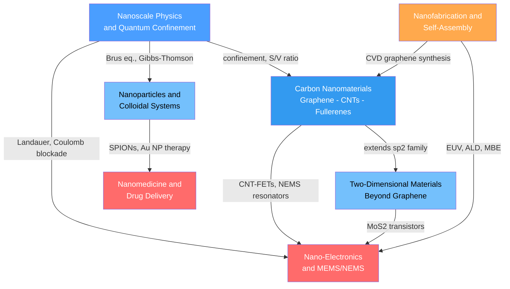

# Nanotechnology and Nanomaterials — Map of Content

> [!info] How to use this map
> Start with **Nanoscale Physics**, follow the arrows, and use the Learning Path below as your guide.
> Each node links to a full note. Come back to this map when you feel lost.

Nanotechnology is the science and engineering of materials and devices where at least one dimension lies in the 1–100 nm range — a regime where quantum mechanics, surface thermodynamics, and electromagnetic confinement rewrite the rules that govern bulk matter. This section builds from the physical principles that make the nanoscale special, through the canonical nanomaterial families, to the fabrication methods and end-use applications that translate nanoscience into technology.

---

## Concept Map

*(Blue = foundational physics, Orange = process/fabrication, Red = advanced device and biomedical applications, arrows = "enables" or "leads to")*

---

## Learning Path

*Recommended order for a first pass through this topic:*

1. [[Nanoscale_Physics_and_Quantum_Confinement]] — Start here to understand why size matters: particle-in-a-box energy quantization, the Brus equation for quantum dots, quantum tunneling, Gibbs-Thomson melting depression, and Coulomb blockade. Every other note in this section applies a concept introduced here.

2. [[Carbon_Nanomaterials_Graphene_Nanotubes_Fullerenes]] — The canonical sp² carbon family. Graphene's Dirac cone and massless fermions, CNT chirality and the metallic/semiconducting selection rule, and fullerene chemistry all flow directly from the physics of the previous note applied to a hexagonal lattice.

3. [[Two_Dimensional_Materials_Beyond_Graphene]] — Extend the 2D story beyond carbon: MoS₂ and the indirect-to-direct bandgap crossover, valley pseudospin and valleytronics, hBN as the ideal substrate, phosphorene anisotropy, MXene conductivity, and magic-angle twisted bilayer graphene superconductivity.

4. [[Nanoparticles_and_Colloidal_Systems]] — Shift from crystalline sheets to 0D particles: localized surface plasmon resonance and Mie theory for gold nanoparticles, superparamagnetism and the Neel relaxation in iron oxide, DLVO colloidal stability, and the principal synthesis routes from Turkevich to thermal decomposition.

5. [[Nanofabrication_and_Self_Assembly]] — How all of the above are actually made and patterned: top-down methods from EUV lithography and electron-beam lithography to FIB, and bottom-up methods from ALD and MBE to block copolymer DSA and DNA origami. The fabrication toolkit bridges materials science and device engineering.

6. [[Nano_Electronics_and_MEMS_NEMS]] — Device-level applications of the preceding physics and fabrication: FinFET and gate-all-around nanosheet transistors, single-electron transistors and Coulomb blockade spectroscopy, the Landauer ballistic transport formula, and MEMS/NEMS resonators from smartphone accelerometers to yoctogram mass sensors.

7. [[Nanomedicine_and_Drug_Delivery_Systems]] — The biomedical end of the section: the EPR effect and passive tumor targeting, liposomes, PLGA nanospheres, dendrimers, SPION MRI contrast agents, mRNA lipid nanoparticles, PEGylation, drug release kinetics, and the regulatory landscape from Doxil to COVID-19 vaccines.

---

## All Notes in This Topic

| Note | Key Concept | Level |
|------|-------------|-------|
| [[Nanoscale_Physics_and_Quantum_Confinement]] | Particle-in-a-box energy levels, Brus equation, STM tunneling, Gibbs-Thomson, Coulomb blockade, Landauer formula | Foundational |
| [[Carbon_Nanomaterials_Graphene_Nanotubes_Fullerenes]] | Dirac cone, CNT chirality and bandgap, C60 truncated icosahedron, graphene oxide chemistry | Intermediate |
| [[Two_Dimensional_Materials_Beyond_Graphene]] | MoS2 direct-gap crossover, valleytronics, magic-angle superconductivity, MXenes, phosphorene | Advanced |
| [[Nanoparticles_and_Colloidal_Systems]] | LSPR and Mie theory, superparamagnetism, Neel relaxation, DLVO theory, Turkevich and coprecipitation synthesis | Advanced |
| [[Nanofabrication_and_Self_Assembly]] | EUV lithography, ALD self-limiting growth, block copolymer DSA, DNA origami, FIB milling | Advanced |
| [[Nano_Electronics_and_MEMS_NEMS]] | FinFET/GAA transistors, ballistic transport, single-electron transistors, MEMS cantilever mechanics, DRIE Bosch process | Intermediate |
| [[Nanomedicine_and_Drug_Delivery_Systems]] | EPR effect, PEGylated liposomes, mRNA-LNPs, Higuchi release kinetics, SPION hyperthermia | Advanced |

---

## Key Questions This Topic Answers

- Why do materials at the 1–100 nm scale exhibit properties — color, magnetism, melting point, conductance — that are qualitatively different from their bulk counterparts?
- How does carbon's sp² hybridization give rise to three distinct nanostructure families, each with record-breaking mechanical, electronic, or optical properties?
- What physical transitions occur when a bulk semiconductor or magnet is thinned to a monolayer or shrunk to a nanoparticle?
- Which top-down and bottom-up fabrication methods can pattern features below 10 nm, and what are the fundamental limits of each?
- How are nanoparticles and nanocarriers engineered for targeted drug delivery, MRI imaging, photothermal therapy, and mRNA vaccine delivery?
- What quantum mechanical effects dominate transistor behavior below 5 nm gate length, and how do FinFET and gate-all-around architectures address them?

---

## Connections to Other Topics

- [[_MOC_Crystal_Structure_and_Bonding]] — The sp² bonding framework that underlies graphene and all carbon allotropes, the trigonal prismatic coordination of TMDs, and the crystal symmetry arguments that produce Dirac cones and valley physics are rooted in bonding and crystallography concepts developed in this section.
- [[_MOC_Electronic_Magnetic_and_Optical_Properties]] — Localized surface plasmon resonance, superparamagnetism, quantum confinement-tuned bandgaps, and the Landauer conductance quantization are the nanoscale manifestations of the bulk electronic, optical, and magnetic property frameworks covered in this companion section.
- [[_MOC_MaterialsScience_Master]] — Parent master index for the full Materials Science vault.
