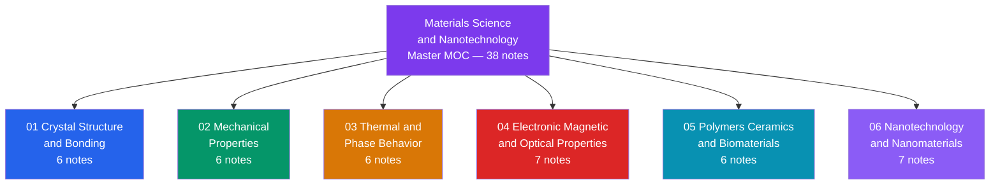

# Materials Science & Nanotechnology — Master Map of Content

> [!abstract] About This Vault
> This vault is a 38-note, 6-section deep dive into the structure-property-processing-performance paradigm of materials science and nanotechnology. It spans crystal structure and bonding, mechanical properties, thermal and phase behavior, electronic/magnetic/optical properties, polymers/ceramics/biomaterials, and nanotechnology — covering the full arc from atomic-scale crystallography through quantum transport in nanodevices. Content is pitched from senior-secondary level (crystal systems, stress-strain) through to graduate-level treatment (BCS superconductivity, valleytronics, magic-angle bilayer graphene), making it suitable both as a university companion and as a professional reference. Each section contains a dedicated MOC that maps its own internal concept graph, learning path, and cross-section connections.

---

## Vault Architecture

*(Purple = master index, Blue = atomic foundations, Green = mechanics, Orange = thermodynamics, Red = electronic/quantum, Teal = soft matter and bio, Violet = nanoscience)*

---

## Sections at a Glance

| # | Section | Notes | Entry Point | Level Range |
|---|---------|-------|-------------|-------------|
| 01 | Crystal Structure and Bonding | 6 | [[_MOC_Crystal_Structure_and_Bonding]] | Secondary → Graduate |
| 02 | Mechanical Properties | 6 | [[_MOC_Mechanical_Properties]] | Secondary → Graduate |
| 03 | Thermal and Phase Behavior | 6 | [[_MOC_Thermal_and_Phase_Behavior]] | Secondary → Graduate |
| 04 | Electronic, Magnetic, and Optical Properties | 7 | [[_MOC_Electronic_Magnetic_and_Optical_Properties]] | Undergraduate → Graduate |
| 05 | Polymers, Ceramics, and Biomaterials | 6 | [[_MOC_Polymers_Ceramics_and_Biomaterials]] | Secondary → Graduate |
| 06 | Nanotechnology and Nanomaterials | 7 | [[_MOC_Nanotechnology_and_Nanomaterials]] | Undergraduate → Graduate |

---

## Section Contents

### 01 — Crystal Structure and Bonding

- [[Crystal_Systems_and_Space_Groups]] — 7 crystal systems, 14 Bravais lattices, atomic packing factor, Miller indices
- [[Chemical_Bonding_in_Solids]] — ionic, covalent, metallic, van der Waals bonding; LCAO bridge to band theory
- [[Defects_and_Dislocations_in_Crystals]] — point defects, Frenkel/Schottky, dislocation types, Burgers vector, Hall-Petch
- [[X_Ray_Diffraction_and_Braggs_Law]] — Bragg's law, structure factors, Scherrer equation, phase identification
- [[Electronic_Band_Structure]] — Bloch theorem, nearly-free electron model, tight binding, Fermi energy, band gaps
- [[Phonons_and_Lattice_Dynamics]] — acoustic/optical branches, Debye T³ law, thermal conductivity, electron-phonon coupling

### 02 — Mechanical Properties

- [[Stress_Strain_and_Elastic_Moduli]] — Hooke's law, Young's/shear/bulk moduli, Poisson's ratio, tensile test anatomy
- [[Plastic_Deformation_and_Slip_Systems]] — dislocation glide, Schmid's law, Taylor factor, work hardening stages
- [[Strengthening_Mechanisms_in_Metals]] — Hall-Petch grain refinement, solid solution, precipitation/Orowan, work hardening
- [[Fracture_Mechanics_and_Toughness]] — Griffith criterion, stress intensity factor K_I, plane-strain K_Ic, DBTT
- [[Fatigue_Creep_and_High_Temperature_Failure]] — S-N curves, Paris law, Goodman criterion, Norton creep, Larson-Miller
- [[Composite_Materials_and_Fiber_Reinforcement]] — rule of mixtures, Halpin-Tsai, critical fiber length, lamination theory

### 03 — Thermal and Phase Behavior

- [[Thermal_Properties_and_Heat_Conduction]] — Fourier's law, thermal diffusivity, Wiedemann-Franz law, anisotropy
- [[Phase_Diagrams_and_the_Iron_Carbon_System]] — Gibbs phase rule, lever rule, Fe-C eutectoid at 727 C
- [[Diffusion_in_Solids_and_Ficks_Laws]] — Fick's first and second laws, Arrhenius diffusivity, carburizing case depth
- [[Nucleation_Growth_and_Solidification]] — classical nucleation theory, critical nucleus radius, constitutional undercooling, SDAS
- [[Heat_Treatment_and_Microstructure]] — TTT/CCT diagrams, martensite, bainite, pearlite, age hardening sequences
- [[Corrosion_and_Electrochemical_Degradation]] — Nernst equation, Pilling-Bedworth ratio, passivation, galvanic corrosion

### 04 — Electronic, Magnetic, and Optical Properties

- [[Semiconductors_Intrinsic_and_Extrinsic]] — band gap, doping, mass-action law, Hall effect, carrier mobility
- [[p_n_Junctions_and_Diodes]] — built-in potential, depletion region, Shockley equation, LEDs, solar cells
- [[Optical_Properties_and_Photonic_Materials]] — complex refractive index, Beer-Lambert law, Fresnel equations, photonic band gaps
- [[Dielectrics_Piezoelectrics_and_Ferroelectrics]] — polarization mechanisms, piezoelectric d_ij tensor, P-E hysteresis, soft phonon mode
- [[Magnetic_Materials_and_Magnetic_Domains]] — Curie-Weiss law, exchange interactions, domain wall energy, hysteresis, GMR
- [[Superconductivity_and_BCS_Theory]] — Cooper pairs, BCS gap equation, Meissner effect, Type I/II, Josephson junction
- [[Thermoelectric_and_Spintronic_Devices]] — Seebeck/Peltier effects, figure of merit ZT, GMR/TMR, STT-MRAM

### 05 — Polymers, Ceramics, and Biomaterials

- [[Polymer_Structure_and_Glass_Transition]] — chain architecture, PDI, tacticity, Tg, WLF equation, Flory-Huggins, Avrami
- [[Polymer_Mechanics_and_Viscoelasticity]] — rubber elasticity, Maxwell/Voigt/SLS models, DMA, time-temperature superposition
- [[Ceramics_and_Glasses]] — Griffith fracture, Weibull modulus, transformation toughening, sintering, glass-ceramics, perovskites
- [[Liquid_Crystals_and_Colloids]] — nematic order parameter, Frank elasticity, Freedericksz transition, DLVO theory, zeta potential
- [[Biomaterials_and_Biocompatibility]] — osseointegration, Vroman effect, bioresorbable PLGA degradation, ISO 10993, scaffolds
- [[Sustainable_Materials_and_Circular_Economy]] — LCA, embodied energy, PLA/PHA biopolymers, critical minerals, circular economy

### 06 — Nanotechnology and Nanomaterials

- [[Nanoscale_Physics_and_Quantum_Confinement]] — particle-in-a-box, Brus equation, Gibbs-Thomson, Coulomb blockade, Landauer formula
- [[Carbon_Nanomaterials_Graphene_Nanotubes_Fullerenes]] — Dirac cone, CNT chirality and bandgap rule, fullerene chemistry, graphene oxide
- [[Two_Dimensional_Materials_Beyond_Graphene]] — MoS2 direct-gap crossover, valleytronics, hBN, phosphorene, MXenes, magic-angle TBG
- [[Nanoparticles_and_Colloidal_Systems]] — LSPR and Mie theory, superparamagnetism, Neel relaxation, Turkevich synthesis
- [[Nanofabrication_and_Self_Assembly]] — EUV lithography, ALD, MBE, block copolymer DSA, DNA origami, FIB milling
- [[Nano_Electronics_and_MEMS_NEMS]] — FinFET/GAA transistors, ballistic transport, single-electron transistors, MEMS/NEMS resonators
- [[Nanomedicine_and_Drug_Delivery_Systems]] — EPR effect, PEGylated liposomes, mRNA-LNPs, Higuchi release kinetics, SPION hyperthermia

---

## Learning Paths

### Path 1 — Engineering Foundation
*Structure to properties to processing: the core materials engineering sequence.*

1. [[Crystal_Systems_and_Space_Groups]] — establish the geometric vocabulary of crystallography
2. [[Chemical_Bonding_in_Solids]] — understand why bonding type controls every bulk property
3. [[Stress_Strain_and_Elastic_Moduli]] — quantify elastic response and the tensile test
4. [[Plastic_Deformation_and_Slip_Systems]] — explain why real metals yield far below theoretical strength
5. [[Strengthening_Mechanisms_in_Metals]] — design microstructure to maximize yield strength
6. [[Heat_Treatment_and_Microstructure]] — use TTT/CCT diagrams to engineer microstructure via thermal cycles
7. [[Phase_Diagrams_and_the_Iron_Carbon_System]] — read equilibrium stability maps to predict phases at any composition

### Path 2 — Electronic Materials
*From band theory to functional semiconductor and photonic devices.*

1. [[Electronic_Band_Structure]] — build quantum-mechanical foundation: Bloch theorem, band gaps, Fermi energy
2. [[Semiconductors_Intrinsic_and_Extrinsic]] — apply band theory to doped materials and carrier physics
3. [[p_n_Junctions_and_Diodes]] — use doping gradients to create the workhorse device of electronics
4. [[Optical_Properties_and_Photonic_Materials]] — connect band structure to light absorption, emission, and waveguiding
5. [[Nano_Electronics_and_MEMS_NEMS]] — reach the nanoscale device limit: FinFETs, ballistic transport, single-electron transistors

### Path 3 — Soft Matter and Biomaterials
*From polymer chain physics to living systems and biomedical devices.*

1. [[Polymer_Structure_and_Glass_Transition]] — establish chain architecture, Tg, and WLF time-temperature equivalence
2. [[Polymer_Mechanics_and_Viscoelasticity]] — build viscoelastic constitutive models and DMA characterization
3. [[Liquid_Crystals_and_Colloids]] — extend to ordered soft matter and colloidal stability theory
4. [[Biomaterials_and_Biocompatibility]] — apply all material classes to implant and scaffold design
5. [[Nanomedicine_and_Drug_Delivery_Systems]] — translate nanoparticle science into drug carriers and mRNA vaccine platforms

### Path 4 — Nanotechnology and Nanoscience
*From the physics of confinement to fabrication and application.*

1. [[Nanoscale_Physics_and_Quantum_Confinement]] — understand why size rewrites the rules of matter below 100 nm
2. [[Carbon_Nanomaterials_Graphene_Nanotubes_Fullerenes]] — explore the canonical sp2 carbon nanostructure family
3. [[Two_Dimensional_Materials_Beyond_Graphene]] — extend 2D physics to TMDs, MXenes, and twisted bilayers
4. [[Nanoparticles_and_Colloidal_Systems]] — shift to 0D particles: plasmonic, magnetic, and colloidal systems
5. [[Nanofabrication_and_Self_Assembly]] — learn how these materials are made and patterned below 10 nm

### Path 5 — Sustainability and Future Materials
*From thermal and degradation fundamentals to circular economy and nanomedicine.*

1. [[Thermal_Properties_and_Heat_Conduction]] — quantify heat flow and thermal management constraints
2. [[Corrosion_and_Electrochemical_Degradation]] — understand long-term electrochemical degradation and prevention
3. [[Composite_Materials_and_Fiber_Reinforcement]] — design multi-phase systems for superior specific stiffness and strength
4. [[Sustainable_Materials_and_Circular_Economy]] — apply LCA and circular economy frameworks to material selection
5. [[Nanomedicine_and_Drug_Delivery_Systems]] — extend sustainability thinking to biomedical nanomaterials and next-generation therapies

---

## Cross-Vault Links

- [[_MOC_Physics_Master]] — condensed matter physics, quantum mechanics, thermodynamics, and electromagnetism underpin band structure, phonons, superconductivity, and magnetic ordering throughout this vault
- [[_MOC_Chemistry_Master]] — physical chemistry, inorganic chemistry, organic chemistry, and biochemistry connect to bonding theory, phase equilibria, polymer synthesis, and biomaterial surface chemistry
- [[_MOC_Earth_Science_Master]] — mineralogy, crystallography, and phase diagrams in geoscience share the same crystallographic and thermodynamic framework as this vault's first three sections
- [[_MOC_Meteorology_Master]] — climate change and atmospheric science provide the sustainability and critical-minerals demand context for the Circular Economy note
- [[_MOC_Oceanography_Master]] — marine corrosion mechanisms, ocean optics, and deep-sea materials challenges connect directly to the Corrosion and Optical Properties notes
- [[_MOC_SS_Master]] — Fourier analysis, signal processing, and system theory underlie nanofabrication metrology, phonon dispersion measurements, and impedance spectroscopy of dielectrics and electrochemical cells

---

## Section MOC Index

| Section MOC | Description |
|-------------|-------------|
| [[_MOC_Crystal_Structure_and_Bonding]] | Atomic geometry, bonding types, defects, X-ray diffraction, band structure, and phonons — the quantum foundation underlying all materials properties |
| [[_MOC_Mechanical_Properties]] | Elastic and plastic response, dislocation physics, four strengthening strategies, fracture mechanics, fatigue and creep, composite design |
| [[_MOC_Thermal_and_Phase_Behavior]] | Thermodynamics and kinetics of phase transformations: phase diagrams, diffusion, nucleation, heat treatment, and corrosion |
| [[_MOC_Electronic_Magnetic_and_Optical_Properties]] | Semiconductor carrier physics, p-n junctions, optical response, dielectrics, magnetism, superconductivity, and spintronic devices |
| [[_MOC_Polymers_Ceramics_and_Biomaterials]] | Chain physics and glass transition, viscoelasticity, ceramic fracture, liquid crystals, biomaterials biocompatibility, and sustainable design |
| [[_MOC_Nanotechnology_and_Nanomaterials]] | Quantum confinement, carbon nanostructures, 2D materials, nanoparticles, nanofabrication, nano-electronics, and nanomedicine |

---

#MOC #MaterialsScience #Nanotechnology #MasterMOC
