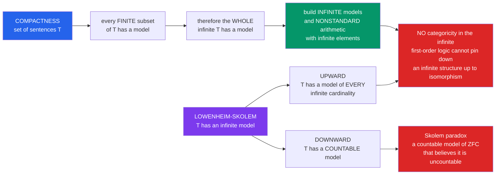

# 🎩 Compactness and Löwenheim-Skolem

> [!abstract] TL;DR
> Two metatheorems of first-order logic, both corollaries of Gödel's completeness theorem, that expose the limits of what axioms can pin down. **Compactness:** a set of sentences has a model iff *every finite subset* does — local (finite) consistency forces global (infinite) consistency. **Löwenheim-Skolem:** any theory with one infinite model has models of *every* infinite size — downward to a countable one (Skolem's paradox: a countable model of "uncountable" set theory) and upward to arbitrarily large ones. Together they prove first-order logic can never characterize an infinite structure up to isomorphism, which is exactly what makes infinitesimals and nonstandard arithmetic possible.

## Intuition

**Analogy.** Here are two of first-order logic's most shocking party tricks.

**Trick 1 — Compactness (locally consistent ⟹ globally consistent).** Imagine an infinite list of demands ("axioms"). Suppose that no matter which *finite* handful of demands you pick, some world satisfies all of them at once. Compactness guarantees a single world satisfies the *entire infinite list* simultaneously. It is as if a jigsaw puzzle whose every finite patch can be assembled must therefore have a complete assembled picture — even though "every finite patch works" seems far weaker than "the whole thing works."

**Trick 2 — Löwenheim-Skolem (logic cannot count).** Take any theory with an infinite model — say a full axiom system for the real numbers, or for set theory. Löwenheim-Skolem says it *also* has a **countable** model, and models of every larger infinite size. So there is a countable structure that satisfies every first-order axiom asserting "the reals are uncountable." From inside, it believes it is uncountable; from outside, we can list its elements $x_0, x_1, x_2, \dots$. That is **Skolem's paradox** — surprising, but not a contradiction.

Put together: first-order logic simply **cannot pin down an infinite structure uniquely.** It is a lens that can see every finite detail sharply yet is systematically blind to the exact size and shape of the infinite — a limitation with astonishing upside, including a rigorous theory of infinitesimals and nonstandard models of arithmetic.

---

## How It Works

### Core mechanics

- **Compactness Theorem.** A set $\Gamma$ of first-order sentences has a model iff every *finite* subset $\Gamma_0 \subseteq \Gamma$ has a model. Equivalently (contrapositive form): if $\Gamma \models \varphi$, then $\Gamma_0 \models \varphi$ for some *finite* $\Gamma_0 \subseteq \Gamma$. Proofs are finite objects, so "$\Gamma$ proves $\varphi$" can use only finitely many premises; completeness ($\vdash$ = $\models$) upgrades this proof-theoretic fact into the semantic statement.
- **Downward Löwenheim-Skolem.** If a countable-language theory has an infinite model, it has a model of cardinality $\aleph_0$ (countable). More generally, any structure has an elementary substructure of size $\max(\aleph_0, |\mathcal{L}|)$. The tool is **Skolem functions**: close a countable seed set under witnesses for every existential formula.
- **Upward Löwenheim-Skolem.** If a theory has an infinite model, it has models of *every* cardinality $\kappa \ge \max(\aleph_0, |\mathcal{L}|)$. The tool is **compactness**: add $\kappa$ new constants $c_i$ with axioms $c_i \ne c_j$; every finite subset is satisfiable in the original infinite model, so the whole extended theory is satisfiable — in a model with at least $\kappa$ elements.
- **The limitation.** Because a theory's infinite models come in all sizes, no first-order theory can force its infinite models to be isomorphic. First-order logic cannot express "finite," "countable," "well-ordered," or "the standard integers."

### Flow / architecture



---

## Key Concepts

### Secondary (intuitive)
- **Compactness in words:** if every finite chunk of an infinite set of rules can be obeyed, all the rules can be obeyed at once.
- **Löwenheim-Skolem in words:** first-order axioms can never lock in the size of an infinite structure — there is always a countable version and always a bigger version.
- **The moral:** logic sees finite detail perfectly but is blind to the exact "size of infinity." This is why you cannot write down axioms that force a structure to be *exactly* the whole numbers and nothing more.

### Undergraduate (formal statements)
- **Compactness Theorem.** $\Gamma$ is satisfiable $\iff$ every finite $\Gamma_0 \subseteq \Gamma$ is satisfiable. Dual form: $\Gamma \models \varphi \Rightarrow \exists$ finite $\Gamma_0 \subseteq \Gamma$ with $\Gamma_0 \models \varphi$.
- **Existence of infinite models (classic corollary).** If a theory has arbitrarily large *finite* models, it has an *infinite* model. Proof: add axioms $\lambda_n :=$ "there exist at least $n$ distinct elements" for all $n$; every finite subset is satisfied by a large-enough finite model, so by compactness the whole set has a model — necessarily infinite. Consequence: **finiteness is not first-order axiomatizable** as a single theory whose models are exactly the finite structures.
- **Nonstandard arithmetic.** Take true arithmetic $\mathrm{Th}(\mathbb{N})$, add a constant $c$ and axioms $c > 0, c > 1, c > 2, \dots$. Each finite fragment is satisfied in $\mathbb{N}$ (pick $c$ large). Compactness gives a model $\mathbb{N}^{*}$ containing an element $c$ larger than every standard $n$ — an **infinite natural number**. Doing the same to the ordered real field yields **infinitesimals** (hyperreals), the rigorous basis of nonstandard analysis.
- **Downward Löwenheim-Skolem.** A satisfiable countable-language theory with an infinite model has a countable model. **Skolem's paradox:** applied to ZFC, this yields a *countable* model $M$ of set theory, even though ZFC proves "$\mathbb{R}$ is uncountable." No contradiction — see Pitfalls.
- **Upward Löwenheim-Skolem.** An infinite model implies models of every cardinality $\ge \max(\aleph_0, |\mathcal{L}|)$ (add that many distinct constants; apply compactness).
- **De Bruijn-Erdős theorem (a compactness gem in combinatorics).** An infinite graph is $k$-colorable iff every finite subgraph is $k$-colorable. It is exactly compactness in disguise: encode "vertex $v$ has color $i$" as propositional variables and the coloring constraints as an infinite set of clauses; every finite subset is satisfiable iff the corresponding finite subgraph is colorable.

### Graduate (mechanisms and reach)
- **Two proofs of compactness.**
  - *Via completeness:* $\Gamma \models \varphi \Rightarrow \Gamma \vdash \varphi$; a derivation is finite, so uses finitely many premises. This makes compactness a corollary of Gödel's completeness theorem — the same source as Löwenheim-Skolem.
  - *Via ultraproducts (Łoś's theorem):* if each finite subset $\Gamma_i$ has a model $M_i$, take a nonprincipal ultrafilter $\mathcal{U}$ on the index set and form the ultraproduct $\prod M_i / \mathcal{U}$; Łoś's theorem says a sentence holds in the ultraproduct iff it holds in $\mathcal{U}$-almost-all factors, and every $\gamma \in \Gamma$ holds in cofinitely many factors, hence in the ultraproduct. This is the purely semantic (choice-based) route.
- **Topological origin of the name.** The *type space* $S_n(T)$ of complete $n$-types is a Stone space (compact, Hausdorff, totally disconnected). The logical Compactness Theorem is precisely the topological compactness of this space — closed sets with the finite intersection property have nonempty intersection.
- **Downward mechanics — Skolem hulls.** Skolemize: for each formula $\exists y\,\psi(\bar x, y)$ add a function symbol picking a witness. The closure of a countable seed under all Skolem functions is a countable **elementary substructure** (Tarski-Vaught test), giving the theorem with the *elementary* strengthening.
- **No categoricity in the infinite.** By Löwenheim-Skolem a first-order theory with an infinite model is never *categorical* (all models isomorphic) — its models occur in every infinite cardinality. The best one can hope for is **$\kappa$-categoricity** (all models of a fixed size $\kappa$ are isomorphic). The **Łoś-Vaught test**: a consistent theory with only infinite models that is $\kappa$-categorical for some $\kappa \ge |\mathcal{L}|$ is *complete*. **Morley's theorem** (1965) then reveals startling rigidity: a countable theory categorical in *one* uncountable cardinal is categorical in *all* uncountable cardinals — foreshadowing stability theory.
- **What first-order logic provably cannot express.** Finiteness, countability, well-foundedness/well-ordering, "the standard model of arithmetic," being a torsion group, connectedness of a graph, Archimedean ordering — each fails to be first-order definable, and the standard disproof is compactness plus Löwenheim-Skolem.
- **Second-order contrast.** Full second-order logic *is* categorical for $\mathbb{N}$ (Dedekind-Peano) and for $\mathbb{R}$ (Dedekind-complete ordered field) — it pins them down up to isomorphism. The price: second-order logic has **no** complete effective proof system and **fails** compactness and Löwenheim-Skolem. You cannot keep categoricity *and* compactness together; Lindström's theorem makes this a precise characterization of first-order logic.

---

## Python Demo

```python
# Two computational illustrations of compactness and its consequences:
#  (a) De Bruijn-Erdos: an infinite graph is 3-colorable because EVERY
#      finite subgraph is (we check the finite side by brute force, then
#      take the compactness leap to the infinite periodic coloring).
#  (b) Non-definability of "finite": arithmetic + c>0,c>1,... has every
#      finite fragment satisfiable in N, so by compactness the whole set
#      is satisfiable -- in a NONSTANDARD model with an infinite element.
import numpy as np
import matplotlib.pyplot as plt
from matplotlib.lines import Line2D

# ---- (a) infinite graph on Z: i ~ j iff |i-j| in {1,2} --------------
# Triangles {i,i+1,i+2} force chi >= 3; the periodic coloring i mod 3
# is proper, so chi = 3.  De Bruijn-Erdos ties the infinite chi to the
# 3-colorability of every finite subgraph, which we verify directly.
def neighbors(i):
    return (i - 2, i - 1, i + 1, i + 2)

def is_proper(coloring):
    for i, ci in coloring.items():
        for j in neighbors(i):
            if coloring.get(j, -1) == ci:      # monochromatic edge?
                return False
    return True

windows = [4, 8, 16, 32, 64, 128]
finite_ok = [is_proper({i: i % 3 for i in range(n)}) for n in windows]
print("every finite window 3-colorable:", finite_ok)   # all True
print("=> compactness leap: the WHOLE infinite graph is 3-colorable")

# ---- (b) 'finite' is not first-order: compactness -> nonstandard N ---
# Fragment {c>0,...,c>n} has least standard witness c = n+1; the witness
# grows without bound, so no single standard number satisfies all of them
# -> compactness supplies a model with an element above every standard n.
frag = np.arange(1, 40)
witness = frag + 1

# ------------------------------- plotting ----------------------------
fig, (axL, axR) = plt.subplots(1, 2, figsize=(13, 5))

# LEFT: a finite subgraph, colored by i mod 3, with |diff|=1 and 2 edges
n = 15
pal = np.array([[0.85, 0.30, 0.30], [0.25, 0.52, 0.85], [0.30, 0.72, 0.42]])
xs = np.arange(n)

def arc(ax, a, b, h):
    t = np.linspace(0.0, 1.0, 50)
    ax.plot(a + t * (b - a), h * 4 * t * (1 - t), color="0.45", lw=1.3,
            alpha=0.7, zorder=1)

for i in xs:
    for d, h in ((1, 0.9), (2, 1.7)):
        if i + d < n:
            arc(axL, i, i + d, h)
axL.scatter(xs, np.zeros(n), c=[pal[i % 3] for i in xs], s=280,
            edgecolors="k", linewidths=1.0, zorder=3)
for i in xs:
    axL.text(i, 0, str(i % 3), ha="center", va="center", color="white",
             fontsize=9, zorder=4)
axL.set_title("De Bruijn-Erdos: every finite window is 3-colorable\n"
              "coloring i mod 3  =>  infinite graph is 3-colorable")
axL.set_xlim(-1, n); axL.set_ylim(-0.6, 2.1); axL.set_yticks([])
axL.set_xlabel("vertex i   (label = color = i mod 3)")
axL.legend(handles=[Line2D([0], [0], marker="o", color="w", markersize=11,
           markerfacecolor=pal[k], markeredgecolor="k", label=f"color {k}")
           for k in range(3)], loc="upper right")

# RIGHT: the finite witnesses grow without bound -> nonstandard element
axR.plot(frag, witness, "o-", color="#1565c0", lw=2)
axR.fill_between(frag, witness, alpha=0.12, color="#1565c0")
axR.set_title("Compactness => nonstandard model\n"
              "each fragment {c>0,...,c>n} is satisfiable in N")
axR.set_xlabel("n  (size of finite fragment)")
axR.set_ylabel("smallest standard witness  c = n+1")
axR.annotate("no single standard number satisfies ALL fragments\n"
             "=> a nonstandard c above every standard n",
             xy=(frag[-1], witness[-1]), xytext=(5, witness[-1] * 0.5),
             arrowprops=dict(arrowstyle="->", color="crimson"),
             color="crimson", fontsize=9)
axR.grid(alpha=0.3)

plt.tight_layout()
plt.savefig("compactness_lowenheim_skolem.png", dpi=120)
plt.show()
```

The left panel shows the finite side we can *actually* check: every finite window of the graph $i \sim j \iff |i-j| \in \{1,2\}$ is 3-colored by $i \bmod 3$. Compactness (De Bruijn-Erdős) makes the leap to the infinite graph "for free." The right panel shows why "finite" escapes first-order logic: the least standard witness $c=n+1$ for each fragment marches to infinity, so no standard natural satisfies all fragments at once — compactness therefore forces a model with an element beyond all of them, a nonstandard natural.

---

## Real-World Applications

- **Nonstandard analysis (Robinson).** Compactness delivers the hyperreals $\mathbb{R}^{*}$ with genuine infinitesimals, letting derivatives and integrals be defined by $dx \ne 0$ but $dx \approx 0$; the **transfer principle** (every first-order statement true of $\mathbb{R}$ holds of $\mathbb{R}^{*}$) is a model-theoretic payoff of these theorems.
- **Combinatorics.** The De Bruijn-Erdős theorem reduces infinite coloring, tiling, and matching problems to their finite subcases; many "compactness arguments" in Ramsey theory and graph theory are literally the Compactness Theorem (or its König's-lemma cousin) applied to a first-order/propositional encoding.
- **Algebra.** "A statement provable for fields of every prime characteristic $p$ (with $p$ large) holds in characteristic $0$" is a compactness/transfer argument (via the Lefschetz principle and ultraproducts); the **Ax-Grothendieck theorem** (injective polynomial maps $\mathbb{C}^n \to \mathbb{C}^n$ are surjective) is proved this way by transferring from finite fields.
- **Verification and constraint solving.** Compactness underlies why an *unsatisfiable* infinite constraint set always has a *finite* unsatisfiable core — the semantic backbone of SAT/SMT-based reasoning about unbounded or parametric systems.
- **Foundations of set theory.** Skolem's paradox and countable transitive models are the starting point for **forcing** and independence proofs (see the companion note on ZFC and independence).

---

## Common Pitfalls

- **Compactness fails for second-order logic.** Full second-order logic can express finiteness and pin down $\mathbb{N}$, so the constant-growing trick that manufactures a nonstandard element is *blocked* — but the cost is loss of compactness, completeness, and any effective proof system. You cannot have both categoricity of $\mathbb{N}$ and compactness.
- **Skolem's paradox is not a contradiction.** A countable model $M$ of ZFC has, *externally*, only countably many elements, yet *internally* satisfies "$\mathbb{R}$ is uncountable." The resolution is the **relativity of cardinality**: "uncountable" means "no bijection with $\omega$ *inside $M$*"; the bijection witnessing countability lives *outside* $M$. Cardinality is model-relative, not absolute.
- **Confusing upward and downward.** *Downward* gives a *smaller* (countable) model; *upward* gives *larger* models of every bigger cardinality. Downward needs Skolem hulls; upward needs compactness. Together they yield the Löwenheim-Skolem-Tarski theorem covering all infinite cardinalities $\ge \max(\aleph_0, |\mathcal{L}|)$.
- **First-order logic cannot express "finite," "well-founded," or "standard."** Do not try to add "the model is finite" or "there are no infinite descending chains" as first-order axioms — compactness/Löwenheim-Skolem prove no first-order theory has exactly the finite (or exactly the well-founded) models. Well-ordering and Archimedean-ness are likewise non-first-order.
- **"Every finite subset is satisfiable" needs *arbitrarily large* or *shared* models, not one fixed model.** Compactness works because different finite fragments may be satisfied in different structures; the theorem still guarantees a *single* model of the whole set. Beginners sometimes demand one fixed model satisfy every fragment in advance — that is stronger than needed.
- **Compactness is not continuity of anything numeric.** The name comes from topological compactness of the type/Stone space, not from analysis; the finite-intersection-property intuition is the right mental model.

---

## Related Concepts

- [[Mathematics/14_Advanced_Topics/Mathematical_Logic_and_Set_Theory|Mathematical Logic and Set Theory]] — states these theorems in the ZFC/model-theory context; Skolem's paradox and independence proofs build directly on the countable-model phenomenon.
- [[Logic_and_Critical_Thinking/02_Deductive_Reasoning/Predicate_Logic_and_Quantifiers|Predicate Logic and Quantifiers]] — the first-order syntax and Tarskian semantics on which "model," "satisfiable," and "$\models$" are defined.
- [[Mathematics/04_Discrete_Mathematics/Logic_and_Proof_Techniques|Logic and Proof Techniques]] — proofs are finite objects, the fact that powers the completeness-based route to compactness.
- [[Mathematics/08_Real_Analysis/Real_Numbers_and_Completeness|Real Numbers and Completeness]] — Dedekind completeness is a *second-order* property; compactness is exactly why no *first-order* theory of $\mathbb{R}$ is categorical, opening the door to infinitesimals.
- [[Mathematics/04_Discrete_Mathematics/Graph_Theory|Graph Theory]] — the De Bruijn-Erdős coloring theorem is compactness applied to graphs.
- [[Combinatorics/03_Graph_and_Extremal_Combinatorics/Enumerative_Graph_Theory|Enumerative Graph Theory]] — chromatic numbers and colorings whose infinite versions are governed by the compactness argument in the demo.
- [[Mathematics/04_Discrete_Mathematics/Set_Theory_and_Relations|Set Theory and Relations]] — cardinality and bijections, the notions rendered *model-relative* by Skolem's paradox.
- [[Mathematics/11_Topology/Compactness_and_Connectedness|Topological Compactness and Connectedness]] — topological compactness of the Stone space of types is the literal origin of the theorem's name.

_Siblings within this vault (planned):_ Soundness_and_Completeness (the parent theorem both corollaries flow from), First_Order_Predicate_Logic, Ultraproducts_and_Nonstandard_Analysis, Categoricity_and_Morley_Theorem, and Second_Order_and_Higher_Order_Logic.

---

## Review Questions

**Secondary.** In one sentence each, state what the Compactness Theorem and the (downward) Löwenheim-Skolem theorem say, and give the everyday intuition for each.

**Undergraduate.** Using compactness, prove that a first-order theory with arbitrarily large finite models must have an infinite model. Then explain how the same construction (adding a constant $c$ with $c>0, c>1, \dots$) produces a nonstandard model of arithmetic. Why does this show "finite" is not first-order definable?

**Graduate (scenario / trade-off).** You want an axiom system whose *only* model is the standard natural numbers $\mathbb{N}$ (up to isomorphism). (a) Explain why no first-order theory can achieve this, citing both theorems. (b) Second-order Peano arithmetic *is* categorical for $\mathbb{N}$ — what three desirable properties (compactness, completeness, an effective proof system) must you surrender to get that categoricity, and how does Lindström's theorem frame this trade-off?

---

## Sources

- Löwenheim, L. (1915). "Über Möglichkeiten im Relativkalkül." *Mathematische Annalen* 76 — the original downward result.
- Skolem, T. (1920/1922). Papers introducing Skolem functions and the countable-model ("Skolem's paradox") argument.
- Malcev, A. I. (1936/1941). Early applications of the Compactness Theorem to group theory and algebra.
- Chang, C. C. & Keisler, H. J. *Model Theory* (3rd ed.), North-Holland — compactness, ultraproducts (Łoś), Löwenheim-Skolem-Tarski.
- Marker, D. *Model Theory: An Introduction*, Springer GTM 217 — modern treatment, categoricity, and Morley's theorem.

---

#mathematical-logic #compactness-theorem #lowenheim-skolem #model-theory #nonstandard-models
