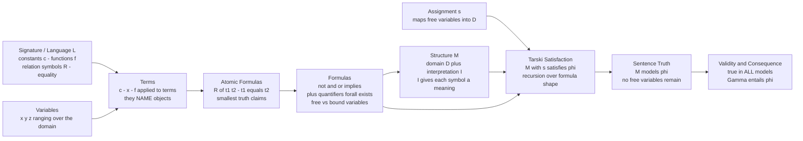

# 🧮 First-Order Predicate Logic

> [!abstract] TL;DR
> First-order logic (FOL) upgrades propositional logic with three ingredients — **variables** ranging over a universe of objects, **predicate and function symbols** that describe and combine those objects, and the **quantifiers** ∀ ("for all") and ∃ ("there exists"). A precise **syntax** builds terms and formulas; Tarski's **semantics** says exactly when a *structure* (a domain plus interpretations of the symbols) satisfies a formula. This single upgrade is expressive enough to write essentially all of mathematics — arithmetic, set theory, and algebra are all first-order axiomatizable — yet deciding whether a formula is *valid* is provably impossible by an algorithm (the Entscheidungsproblem).

---

## Intuition

**Analogy:** Propositional logic is a wall of labeled light switches — `P`, `Q`, `R` — each simply ON or OFF, with no internal parts. It can assert "Socrates is mortal" only by naming it a single switch `S`; it has no way to notice that `S` is *about an object* (Socrates) that *has a property* (mortality), and no way to say "**every** human is mortal." First-order logic tears the switch open. Now there is a **universe of objects** (all humans, all numbers, all nodes of a graph), **predicates** that report properties and relations of those objects (`Human(x)`, `Mortal(x)`, `Loves(x, y)`), variables that stand for "any object whatsoever," and two sweeping instructions — ∀ ("check this for **every** object") and ∃ ("find **at least one** object"). The switch panel becomes a query language over an entire world.

That one addition — the ability to talk about objects, their properties and relations, and to quantify across all of them — is powerful enough to serve as the working language of modern mathematics. Set theory (ZFC), Peano arithmetic, and the axioms of groups, rings, and fields are all just collections of first-order sentences.

---

## How It Works

### Core Mechanics

A first-order **language** (or *signature*) `L` fixes the non-logical vocabulary you are allowed to name:

1. **Constant symbols** (`0`, `c`, `alice`) — name specific objects.
2. **Function symbols** with arities (`succ` unary, `+` binary) — build new object-names from old ones.
3. **Relation / predicate symbols** with arities (`Even` unary, `<` binary, `Between` ternary) — make claims that are true or false of tuples of objects.
4. **Logical symbols** shared by every language: variables `x, y, z, …`, connectives `¬ ∧ ∨ → ↔`, quantifiers `∀ ∃`, and usually **equality** `=`.

From this vocabulary the grammar builds two layers:

- **Terms** name objects. A variable is a term; a constant is a term; and if `f` is an `n`-ary function symbol and `t₁,…,tₙ` are terms, then `f(t₁,…,tₙ)` is a term. Terms never have a truth value — `succ(succ(0))` just *denotes* an object.
- **Formulas** make claims. An **atomic formula** is `R(t₁,…,tₙ)` or `t₁ = t₂`. Compound formulas are built with connectives and, crucially, quantifiers: if `φ` is a formula and `x` a variable, then `∀x φ` and `∃x φ` are formulas.

**Free vs. bound variables.** A quantifier `∀x` / `∃x` *binds* every occurrence of `x` inside its **scope** (the formula it prefixes). An occurrence not bound by any quantifier is **free**. A formula with no free variables is a **sentence** — only sentences have a definite truth value in a structure; a formula with free variables expresses a *condition* whose truth depends on which objects the free variables name.

**Semantics — a structure.** A structure (model) `M = (D, I)` for language `L` supplies:
- a non-empty **domain** (universe) `D` of objects the variables range over;
- an **interpretation** `I` giving every constant an element of `D`, every `n`-ary function symbol a function `Dⁿ → D`, and every `n`-ary relation symbol a set of tuples `Rᴹ ⊆ Dⁿ` (its *extension*).

**Tarski's definition of satisfaction.** Given a structure `M` and a **variable assignment** `s` (mapping free variables to elements of `D`), truth is defined by recursion on the *structure of the formula*:
- `M, s ⊨ R(t₁,…,tₙ)` iff the tuple of denoted values is in `Rᴹ`;
- `M, s ⊨ t₁ = t₂` iff both terms denote the same element;
- `M, s ⊨ ¬φ` iff not `M, s ⊨ φ`; and the connectives distribute the obvious way;
- `M, s ⊨ ∀x φ` iff for **every** `d ∈ D`, `M, s[x↦d] ⊨ φ`;
- `M, s ⊨ ∃x φ` iff for **some** `d ∈ D`, `M, s[x↦d] ⊨ φ`.

Writing `M ⊨ φ` for a sentence means it is satisfied under every (equivalently, any) assignment. Three central notions follow:
- **Satisfiable:** some structure makes `φ` true.
- **Valid** (`⊨ φ`): *every* structure makes `φ` true — a logical law, independent of interpretation.
- **Logical consequence** (`Γ ⊨ φ`): every structure satisfying all of `Γ` also satisfies `φ`.

These are the semantic counterparts of the *proof-theoretic* notions (`⊢`) developed via **Formal_Systems_and_Proof_Calculi**; that the two coincide is the content of **Soundness_and_Completeness** (foreshadowed below), and Gödel's completeness theorem is what welds them together for FOL.

### Flow / Architecture



---

## Key Concepts

### Secondary Level

**Why propositional logic runs out.** Propositional logic (see the sibling note *Propositional_Logic_and_Boolean_Semantics*) treats "Socrates is mortal" as one indivisible atom. It cannot express "**All** humans are mortal" or "**Some** number is prime," because those require reaching *inside* the sentence to talk about objects and to range over a whole collection. FOL adds exactly the missing machinery: objects, properties/relations, and the two quantifiers.

**Objects, predicates, quantifiers.**
- A **predicate** like `Mortal(x)` has a slot `x`; fill it with a specific object and you get a true-or-false claim, `Mortal(socrates)`.
- **∀x φ** ("for all x") is true when `φ` holds of every object in the domain.
- **∃x φ** ("there exists x") is true when `φ` holds of at least one object.

**The classic syllogism, formalized.** "All humans are mortal; Socrates is human; therefore Socrates is mortal" becomes `∀x (Human(x) → Mortal(x))`, `Human(socrates)`, so `Mortal(socrates)`. Propositional logic literally cannot represent the first premise; FOL captures it in one line.

**Negating a quantifier flips it.** `¬∀x φ` is equivalent to `∃x ¬φ`, and `¬∃x φ` to `∀x ¬φ`. "Not everyone passed" = "someone failed."

### Undergraduate Level

**The two-layer grammar precisely.** *Terms* are generated from variables and constants by closing under function application; *formulas* are generated from atomic formulas `R(t̄)` and `t₁=t₂` by connectives and quantification. Substitution `φ[t/x]` replaces every free `x` by term `t`, subject to `t` being **free for `x` in `φ`** — no variable of `t` may become accidentally captured by a quantifier inside `φ`. Capture is the classic source of unsound reasoning.

**Nested quantifiers and order.** Reading strictly left to right:

| Formula | Reading | Relative strength |
|---------|---------|-------------------|
| `∀x ∀y R(x,y)` | `R` holds of every ordered pair | strongest |
| `∀x ∃y R(x,y)` | each `x` gets **some** `y` (may vary with `x`) | — |
| `∃y ∀x R(x,y)` | **one fixed** `y` works for all `x` | — |
| `∃x ∃y R(x,y)` | some pair satisfies `R` | weakest |

`∃y∀x` implies `∀x∃y` but never the reverse; this exact asymmetry separates *uniform* from *pointwise* convergence in analysis and *one shared resource* from *one-per-request* in systems.

**Equality is special.** With `=` in the language, structures must interpret it as genuine identity on `D`. Equality lets FOL count ("there are at least two things": `∃x∃y ¬(x=y)`) and express uniqueness (`∃!x φ` abbreviates `∃x(φ ∧ ∀y(φ[y/x] → y=x))`). *First-order logic with equality* is the standard default.

**Prenex normal form and Skolemization (preview).** Every formula is logically equivalent to a **prenex** form — a block of quantifiers (the *prefix*) in front of a quantifier-free *matrix*. **Skolemization** then removes existential quantifiers by replacing each `∃y` under universals `∀x̄` with a fresh **Skolem function** `f(x̄)` naming the witness. This is the gateway to clausal form and resolution-based theorem proving; it preserves satisfiability, which is all a refutation prover needs.

**Semantic dependence on the model.** Validity is truth in *all* structures, but most formulas are neither valid nor unsatisfiable — they are true in some structures and false in others. `∀x∃y R(x,y)` ("the relation is *serial*") holds in a 3-cycle graph but fails the moment one node has no outgoing edge. Truth is always *relative to a structure*; the Python demo makes this concrete.

### Graduate Level

**FOL is the language of mathematics.** Peano arithmetic, ZFC set theory (see *Model_Theory_Foundations* and [[Mathematical_Logic_and_Set_Theory]]), and the theories of groups/rings/fields/orders are all sets of first-order sentences. This universality is why the metatheory of FOL *is* the metatheory of formalized mathematics.

**The core metatheorems (foreshadowed, developed in sibling notes).**
- **Soundness & Completeness** (Gödel 1929–30): for FOL, `Γ ⊢ φ` iff `Γ ⊨ φ`. Provability and semantic consequence exactly coincide; nothing valid is unprovable and nothing provable is invalid. Developed in *Soundness_and_Completeness*.
- **Compactness:** a set of sentences has a model iff every finite subset does. Yields non-standard models of arithmetic (with "infinite" integers). Developed in *Compactness_and_Lowenheim_Skolem*.
- **Löwenheim–Skolem:** any theory with an infinite model has models of every infinite cardinality — so FOL *cannot* pin down `(ℕ, <)` or `ℝ` up to isomorphism. FOL is **non-categorical** for rich structures.

**The wall: undecidability of validity.** Church and Turing (1936) settled Hilbert's **Entscheidungsproblem** negatively: there is **no algorithm** that decides, for an arbitrary FOL sentence, whether it is valid. The proof encodes a Turing machine's halting behavior as a first-order sentence that is valid iff the machine halts — reducing the halting problem to FOL validity (see [[Turing_Machines_and_the_Church_Turing_Thesis]], [[The_Halting_Problem_and_Undecidability]], and [[Reductions_and_Undecidable_Problems]]). Because completeness guarantees a proof search will *eventually* find any real proof, validity is **semi-decidable** (recursively enumerable): if `φ` is valid you will confirm it, but if it is not, the search may run forever.

**First-order, not second-order.** FOL quantifies only over **individuals** of the domain. It *cannot* quantify over predicates, relations, or subsets of the domain — statements like "for **every property** P …" are **second-order**. Second-order logic *can* categorically axiomatize `ℕ` and `ℝ`, but it pays the full price: it has no sound-and-complete effective proof system and loses compactness and Löwenheim–Skolem. The expressiveness-versus-metatheory trade-off between first- and second-order logic is one of the deepest dividing lines in logic (see *Model_Theory_Foundations*).

**Decidable fragments.** Full FOL is undecidable, so tractable sublanguages matter: the **monadic** fragment (only unary predicates, no functions) is decidable; the **two-variable fragment** `FO²` is NEXPTIME-complete; **description logics** underpin OWL ontologies; the **Bernays–Schönfinkel** class `∃*∀*` (no functions) is decidable. Each buys decidability by giving up expressive power.

---

## Python Demo

```python
"""
A tiny FIRST-ORDER MODEL CHECKER over finite structures.

A structure (model) M = (D, I):
  - D: a finite universe (list of elements)
  - I: interprets the binary relation symbol R as a set of ordered pairs
       (the edges of a directed graph); constants map to elements.

Formulas are ASTs (nested tuples). We compute  M, s |= phi  by TARSKI-STYLE
recursion over the variable assignment s, handling atoms R(t1,t2), equality
t1=t2, the connectives, and the quantifiers forall x . phi and exists x . phi.

We show the SAME sentence  'forall x exists y R(x,y)'  is TRUE in a serial
graph (a 3-cycle) but FALSE in a graph with a sink -- truth depends on the
model -- and we expose quantifier-ORDER sensitivity (Ax Ey vs Ey Ax).
"""

import numpy as np
import matplotlib.pyplot as plt


# ---------------------------------------------------------------------------
# 1. Structures: universe D and interpretation of the binary relation R
# ---------------------------------------------------------------------------
class Structure:
    def __init__(self, domain, relations, constants=None):
        self.D = list(domain)
        self.R = {name: set(pairs) for name, pairs in relations.items()}
        self.C = dict(constants or {})

# Structure A: a 3-cycle  0 -> 1 -> 2 -> 0  (every node has an out-edge: SERIAL)
A = Structure(domain=[0, 1, 2], relations={"R": {(0, 1), (1, 2), (2, 0)}})

# Structure B: a path with a SINK  0 -> 1 -> 2  (node 2 has NO out-edge)
B = Structure(domain=[0, 1, 2], relations={"R": {(0, 1), (1, 2)}})


# ---------------------------------------------------------------------------
# 2. Term evaluation under an assignment s (s maps variable names -> elements)
# ---------------------------------------------------------------------------
def eval_term(t, M, s):
    if t in s:            # a variable currently bound by the assignment
        return s[t]
    if t in M.C:          # a constant symbol
        return M.C[t]
    return t              # a raw domain element


# ---------------------------------------------------------------------------
# 3. Tarski satisfaction:  M, s |= phi   (recursion over formula structure)
# ---------------------------------------------------------------------------
def satisfies(phi, M, s):
    op = phi[0]
    if op == "=":
        return eval_term(phi[1], M, s) == eval_term(phi[2], M, s)
    if op == "R":
        a, b = eval_term(phi[1], M, s), eval_term(phi[2], M, s)
        return (a, b) in M.R["R"]
    if op == "not":
        return not satisfies(phi[1], M, s)
    if op == "and":
        return satisfies(phi[1], M, s) and satisfies(phi[2], M, s)
    if op == "or":
        return satisfies(phi[1], M, s) or satisfies(phi[2], M, s)
    if op == "implies":
        return (not satisfies(phi[1], M, s)) or satisfies(phi[2], M, s)
    if op == "forall":                        # quantifier: extend s with x -> d
        x = phi[1]
        return all(satisfies(phi[2], M, {**s, x: d}) for d in M.D)
    if op == "exists":
        x = phi[1]
        return any(satisfies(phi[2], M, {**s, x: d}) for d in M.D)
    raise ValueError(f"unknown operator {op}")


def holds(phi, M):
    """A sentence (no free vars) is true in M iff satisfied under empty s."""
    return satisfies(phi, M, {})


# ---------------------------------------------------------------------------
# 4. Formulas (sentences) to test -- note the nested quantifiers and scope
# ---------------------------------------------------------------------------
serial      = ("forall", "x", ("exists", "y", ("R", "x", "y")))   # out-edge for each node
universal_y = ("exists", "y", ("forall", "x", ("R", "x", "y")))   # one node reached by ALL
complete    = ("forall", "x", ("forall", "y", ("R", "x", "y")))   # every ordered pair
some_edge   = ("exists", "x", ("exists", "y", ("R", "x", "y")))   # at least one edge
irreflexive = ("forall", "x", ("not", ("R", "x", "x")))           # no self-loops
symmetric   = ("forall", "x", ("forall", "y",
                ("implies", ("R", "x", "y"), ("R", "y", "x"))))    # edges go both ways
# scope demo: every node has an out-neighbour DIFFERENT from itself
out_diff    = ("forall", "x", ("exists", "y",
                ("and", ("R", "x", "y"), ("not", ("=", "x", "y")))))

FORMULAS = [
    ("forall x exists y R(x,y)   [serial]",      serial),
    ("exists y forall x R(x,y)   [common sink]", universal_y),
    ("forall x forall y R(x,y)   [complete]",    complete),
    ("exists x exists y R(x,y)   [some edge]",   some_edge),
    ("forall x not R(x,x)        [irreflexive]", irreflexive),
    ("forall x forall y sym      [symmetric]",   symmetric),
    ("forall x exists y (Rxy & x!=y)",           out_diff),
]

print("=== First-order satisfaction in two finite structures ===\n")
print(f"{'Sentence':<38}{'A (3-cycle)':<14}{'B (sink)':<10}")
print("-" * 62)
for label, phi in FORMULAS:
    print(f"{label:<38}{str(holds(phi, A)):<14}{str(holds(phi, B)):<10}")

print("\nKey point: 'forall x exists y R(x,y)' is",
      holds(serial, A), "in A but", holds(serial, B),
      "in B  ->  truth is RELATIVE to the model.")
print("Order matters: forall-x exists-y =", holds(serial, A),
      "but exists-y forall-x =", holds(universal_y, A),
      "in the SAME structure A.")


# ---------------------------------------------------------------------------
# 5. Visualization: draw both digraphs + a truth table
# ---------------------------------------------------------------------------
def draw_digraph(ax, M, title):
    n = len(M.D)
    ang = np.linspace(np.pi / 2, np.pi / 2 + 2 * np.pi, n, endpoint=False)
    pos = {d: (np.cos(a), np.sin(a)) for d, a in zip(M.D, ang)}
    for (u, v) in M.R["R"]:
        x0, y0 = pos[u]
        x1, y1 = pos[v]
        ax.annotate("", xy=(x1, y1), xytext=(x0, y0),
                    arrowprops=dict(arrowstyle="-|>", lw=2, color="#2563eb",
                                    shrinkA=18, shrinkB=18,
                                    connectionstyle="arc3,rad=0.12"))
    for d, (x, y) in pos.items():
        ax.scatter([x], [y], s=1200, c="#dbeafe",
                   edgecolors="#1e3a8a", linewidths=2, zorder=3)
        ax.text(x, y, str(d), ha="center", va="center",
                fontsize=15, fontweight="bold", color="#1e3a8a", zorder=4)
    ax.set_title(title, fontsize=11)
    ax.set_xlim(-1.6, 1.6)
    ax.set_ylim(-1.6, 1.6)
    ax.set_aspect("equal")
    ax.axis("off")


fig = plt.figure(figsize=(13, 6))
axA = fig.add_subplot(1, 3, 1)
axB = fig.add_subplot(1, 3, 2)
axT = fig.add_subplot(1, 3, 3)

draw_digraph(axA, A, "Structure A: 3-cycle\n0->1->2->0  (serial)")
draw_digraph(axB, B, "Structure B: path + sink\n0->1->2  (2 is a sink)")

axT.axis("off")
short = [
    ("Ax Ey Rxy", serial),
    ("Ey Ax Rxy", universal_y),
    ("Ax Ay Rxy", complete),
    ("Ex Ey Rxy", some_edge),
    ("Ax ~Rxx", irreflexive),
    ("Ax Ey Rxy & x!=y", out_diff),
]
table_rows = [["Sentence", "A", "B"]]
for label, phi in short:
    table_rows.append([label,
                       "T" if holds(phi, A) else "F",
                       "T" if holds(phi, B) else "F"])
tbl = axT.table(cellText=table_rows[1:], colLabels=table_rows[0],
                cellLoc="center", loc="center", colWidths=[0.6, 0.2, 0.2])
tbl.auto_set_font_size(False)
tbl.set_fontsize(9.5)
tbl.scale(1.0, 1.7)
for j in range(3):
    tbl[0, j].set_facecolor("#1d4ed8")
    tbl[0, j].set_text_props(color="white", fontweight="bold")
for i in range(1, len(table_rows)):
    for j in (1, 2):
        val = table_rows[i][j]
        tbl[i, j].set_facecolor("#dcfce7" if val == "T" else "#fee2e2")
axT.set_title("Same sentence, different models\n"
              "row 1: Ax Ey Rxy is T in A, F in B", fontsize=10)

plt.tight_layout(pad=1.5)
plt.savefig("first_order_model_checker.png", dpi=120, bbox_inches="tight")
plt.show()
```

**Expected output:**

```
Sentence                              A (3-cycle)   B (sink)
--------------------------------------------------------------
forall x exists y R(x,y)   [serial]   True          False
exists y forall x R(x,y)   [common sink] False       False
forall x forall y R(x,y)   [complete] False         False
exists x exists y R(x,y)   [some edge]True          True
forall x not R(x,x)        [irreflexive]True        True
forall x forall y sym      [symmetric]False         False
forall x exists y (Rxy & x!=y)        True          False
```

The recursion mirrors Tarski's definition line for line: a quantifier simply extends the assignment `s` with `x ↦ d` and asks `all` (for `∀`) or `any` (for `∃`) over the domain. The first row is the punchline — `∀x∃y R(x,y)` is **True** in the serial 3-cycle but **False** once a sink appears, so a formula's truth lives *in a structure*, not in the symbols alone. And within the single structure `A`, `∀x∃y` is True while `∃y∀x` is False: swapping quantifier order changes the claim.

---

## Real-World Applications

> **Relational databases and SQL.** Codd's relational model *is* first-order logic over finite domains. A query `SELECT * FROM Emp WHERE Salary > 100000` is the set-builder `{x | Emp(x) ∧ Salary(x) > 100000}`; a correlated `WHERE EXISTS (...)` is a literal existential quantifier and `WHERE NOT EXISTS (...) ` a universal via `¬∃`. The relational-calculus foundation guarantees queries are answerable and drives optimizer rewrites (join reordering, selection pushdown) that are just FOL equivalences (see [[Relational_Model]], [[SQL_Fundamentals]]).

> **Automated and interactive theorem proving.** Resolution provers (Vampire, E, SPASS) and SMT solvers (Z3, CVC5) operate on Skolemized, clausal FOL; proof assistants (Isabelle/HOL, Lean, Coq) build higher-order logics on top of a first-order core. Because validity is only semi-decidable, these tools search for a proof and may not terminate on non-theorems — the undecidability result made concrete in engineering.

> **Formal specification and verification.** TLA+, Alloy, Dafny, and Why3 encode system invariants and safety properties as (temporal extensions of) FOL sentences. Amazon Web Services uses TLA+ to model-check distributed protocols such as S3 and DynamoDB, catching design bugs that testing cannot reach.

> **Knowledge representation and the Semantic Web.** OWL ontologies (SNOMED CT for medicine, the Gene Ontology, Google's Knowledge Graph) are built on **description logics** — deliberately decidable fragments of FOL — so that reasoners (HermiT, ELK) can classify and check consistency at scale. The choice of fragment is exactly a bet on the FOL expressiveness-vs-decidability trade-off.

> **Logic programming.** Prolog and Datalog execute the **Horn-clause** fragment of FOL by unification and resolution; Datalog underpins static program analysis and modern policy engines. A rule `ancestor(X,Z) :- parent(X,Y), ancestor(Y,Z)` is the first-order axiom `∀x∀z((∃y (Parent(x,y) ∧ Ancestor(y,z))) → Ancestor(x,z))`.

---

## Common Pitfalls

- **Confusing `∀x∃y` with `∃y∀x`.** The single most common quantifier error. "Every student has an advisor" (`∀x∃y`) does **not** imply "one advisor advises every student" (`∃y∀x`). In `∀x∃y` the witness `y` may depend on `x`; in `∃y∀x` it may not. Always read left to right and ask whether the inner witness is allowed to vary with the outer variable.

- **Free vs. bound variable / scope errors.** `∃x P(x) ∧ Q(x)` is **not** `∃x (P(x) ∧ Q(x))`: in the first, the second `x` is *free* and refers to some outer context, so the whole thing may not even be a sentence. Parenthesize every quantifier's scope explicitly, and remember only sentences (no free variables) have a truth value in a structure.

- **Variable capture during substitution.** Substituting a term `t` for `x` in `φ` is only valid when `t` is *free for `x`* — no variable in `t` may fall under a quantifier of `φ`. Substituting `y` into `∃y (x ≠ y)` to "prove" `∃y (y ≠ y)` is the textbook capture bug; rename the bound variable first.

- **Trying to quantify over predicates or sets.** "P holds for **every property**" or "there is a **set** such that…" is **second-order**, not first-order. Full second-order induction and the least-upper-bound axiom are *not* first-order sentences; attempting to force them into FOL yields a strictly weaker theory (and, by Löwenheim–Skolem, unintended models). Recognizing when a claim ranges over subsets rather than individuals is essential.

- **Expecting an algorithm for validity.** FOL validity is **undecidable** (Church–Turing). Completeness guarantees a proof *exists* for every valid sentence, but no procedure always halts with a yes/no answer; validity is only *semi-decidable*. Practical tools work because their real workloads fall into *decidable fragments* (linear arithmetic, EPR, description logics), not because full FOL became tractable.

- **Vacuous universals.** `∀x (φ(x) → ψ(x))` is trivially true when nothing satisfies `φ` (empty restrictor). "All unicorns are purple" is vacuously true — a frequent source of silent bugs in queries and specifications where a filter matches no objects.

---

## Related Concepts

- [[Predicate_Logic_and_Quantifiers]] — the **informal / critical-thinking** treatment of the same quantifiers and predicates; this note is its formal, model-theoretic companion (signatures, Tarski satisfaction, metatheorems). Start there for intuition, return here for rigor.
- [[Propositional_Logic]] — the quantifier-free base logic that FOL extends by adding objects, predicates, and quantification; every FOL structure still evaluates connectives propositionally.
- [[Mathematical_Proof_Strategies]] — direct, contrapositive, contradiction, and induction proofs are carried out *inside* a first-order (or set-theoretic) language; quantifier structure dictates proof shape (`∀`-intro, `∃`-elim).
- [[Logic_and_Proof_Techniques]] — the discrete-math on-ramp to predicates, quantifiers, and proof methods, from the Mathematics vault.
- [[Set_Theory_and_Relations]] — the domain of a structure is a set and every predicate is interpreted as a relation on it; FOL and set theory are mutually foundational.
- [[Mathematical_Logic_and_Set_Theory]] — situates FOL within ZFC, Gödel's completeness/incompleteness, and model theory; the advanced-topics view of everything foreshadowed here.
- [[Turing_Machines_and_the_Church_Turing_Thesis]] — supplies the computability notions used to prove that FOL validity (the Entscheidungsproblem) is undecidable.
- [[The_Halting_Problem_and_Undecidability]] — the halting problem is *reduced to* FOL validity; its undecidability transfers directly to logic.
- [[Reductions_and_Undecidable_Problems]] — the reduction technique itself, the engine behind "FOL validity is undecidable."
- [[Relational_Model]] — relational algebra/calculus is FOL restricted to finite domains; the practical incarnation of predicate logic.
- [[SQL_Fundamentals]] — `SELECT/WHERE/EXISTS` implement projection and quantification; querying is applied first-order logic.

---

## Review Questions

### Secondary

1. Formalize in FOL using `Human(x)` and `Mortal(x)`: (a) "All humans are mortal," (b) "Some human is not mortal." Which one is the negation of the other, and how does the quantifier change under that negation?
2. Domain `D = {2, 3, 4, 5}`, predicate `Prime(x)`. Give the truth value of `∀x Prime(x)`, `∃x Prime(x)`, `¬∀x Prime(x)`, and `∀x ¬Prime(x)`, and explain why the last two differ.
3. "There is one master key that opens every door" versus "every door has some key that opens it." Write both as FOL sentences and describe a real scenario in which the first is false but the second is true.

### Undergraduate

1. On domain `D = {1,2,3,4}` with `R(x,y)` meaning `x ≤ y`, evaluate `∀x∃y R(x,y)`, `∃y∀x R(x,y)`, `∃x∀y R(x,y)`, and `∀x∀y (R(x,y) ∨ R(y,x))`. For each, give a witness or a counterexample.
2. Using only Tarski's recursive clauses for `¬` and `∀`, prove that for every structure `M` and assignment `s`, `M,s ⊨ ¬∀x φ` iff `M,s ⊨ ∃x ¬φ`.
3. Convert `∀x (P(x) → ∃y R(x,y))` to prenex normal form, then Skolemize it. What is the arity of the Skolem function introduced, and why does Skolemization preserve satisfiability but not logical equivalence?

### Graduate

1. Gödel's completeness theorem says every valid FOL sentence is provable, yet Church and Turing proved FOL validity is undecidable. Explain precisely how both hold at once, and why "a proof exists for every valid sentence" does **not** yield a decision algorithm. What does semi-decidability say about the invalid case?
2. A student proposes to categorically axiomatize `(ℕ, 0, succ, <)` in FOL. Using Löwenheim–Skolem and/or compactness, prove no first-order theory can have `ℕ` as its unique model up to isomorphism. What *does* second-order logic gain here, and what metatheoretic property does it forfeit in exchange?
3. Sketch the reduction of the halting problem to FOL validity: given a Turing machine `M` and input `w`, describe the shape of a first-order sentence `φ(M,w)` that is valid iff `M` halts on `w` (which symbols encode configurations and the transition relation), and explain why this establishes the undecidability of the Entscheidungsproblem.

---

## Sources

- [Enderton, H. B. (2001). *A Mathematical Introduction to Logic* (2nd ed.). Academic Press.](https://www.elsevier.com/books/a-mathematical-introduction-to-logic/enderton/978-0-12-238452-3) — the standard undergraduate development of FOL syntax, Tarski semantics, soundness/completeness, and compactness.
- [van Dalen, D. (2013). *Logic and Structure* (5th ed.). Springer.](https://link.springer.com/book/10.1007/978-1-4471-4558-5) — natural-deduction-based treatment of first- (and second-) order logic with completeness and model theory.
- [Mendelson, E. (2015). *Introduction to Mathematical Logic* (6th ed.). CRC Press.](https://www.routledge.com/Introduction-to-Mathematical-Logic/Mendelson/p/book/9781482237726) — classic axiomatic (Hilbert-style) presentation of the predicate calculus and its metatheory.
- [Hodges, W. (1997). *A Shorter Model Theory*. Cambridge University Press.](https://www.cambridge.org/9780521587136) — structures, satisfaction, and the model-theoretic view of first-order logic in depth.
- [Church, A. (1936). "A Note on the Entscheidungsproblem." *Journal of Symbolic Logic* 1(1), 40–41.](https://doi.org/10.2307/2269326) — the undecidability of first-order validity.

---

#mathematical-logic #first-order-logic #predicate-logic #quantifiers #tarski-semantics
