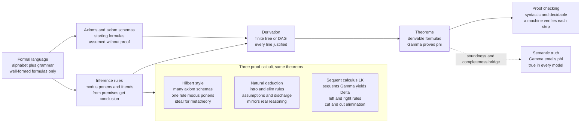

# ⚙️ Formal Systems and Proof Calculi

> [!abstract] TL;DR
> A **formal system** is a purely *syntactic* machine for generating truths: fix a **formal language** of well-formed formulas, declare some **axioms**, and give a handful of **inference rules**; a **proof** is then any finite sequence or tree of formulas in which every line is either an axiom or follows from earlier lines by a rule, and a **theorem** is anything reachable this way — written `Γ ⊢ φ`, "`φ` is *derivable* from `Γ`." Because a proof carries no meaning, checking one is a **mechanical, decidable** pattern-match a machine can perform, even though *finding* one is hard. The three great **proof calculi** — **Hilbert/axiomatic** systems (many axiom schemas, one rule, ideal for metatheory), **natural deduction** (introduction/elimination rules that mirror real reasoning), and Gentzen's **sequent calculus LK** (sequents `Γ ⊢ Δ`, left/right rules, and the **cut-elimination** *Hauptsatz*) — prove exactly the same theorems by very different means. The deep payoff of making "proof" a mathematical object is that we can now ask whether *provable* (`⊢`) and *true* (`⊨`) coincide — the question answered by **soundness and completeness**.

---

## Intuition

**Analogy — proof as a board game played with meaningless symbols.** Imagine a game whose pieces are strings of symbols. A few strings are handed to you at the start for free — the **axioms** (the opening position). A small rulebook says: "if you already have a string of shape *X* and a string of shape *X → Y*, you may write down *Y*" — that is an **inference rule** (a legal move). A **proof** is just a record of legal moves starting from the opening position; whatever string you can reach is a **theorem** (a winning position). Crucially, **you never need to know what the strings *mean* to play**: you match shapes and apply moves, exactly like checking that a chess game obeyed the rules without caring who "deserved" to win. A referee — or a computer — can verify the whole game by pattern-matching one move at a time.

That stripped-down, meaning-free view is the entire point. By defining "proof" as a **syntactic** object — a finite arrangement of symbols obeying mechanical rules, divorced from truth and intuition — logicians turned proof itself into something they could study *mathematically*: count proofs, transform one proof into another, bound their size, and, most importantly, ask the sharpest question in all of logic — **does every truth have a proof, and does every proof yield a truth?** A proof calculus is simply a precise rulebook for this game; the three we study differ only in *which* moves they make legal.

---

## How It Works

### Core mechanics: the four parts of a formal system

A formal system (equivalently a **deductive system** or **proof calculus**) is specified by four ingredients:

1. **A formal language.** An alphabet of symbols and a grammar that carves out the **well-formed formulas** (wffs). "Well-formed" is decidable — a parser accepts or rejects a string with no reference to meaning. Everything downstream operates only on wffs.
2. **Axioms (or axiom schemas).** Distinguished wffs assumed without proof. An **axiom schema** is a *template* with metavariables — e.g. `A → (B → A)` — standing for *infinitely many* concrete axioms, one per substitution of formulas for `A`, `B`. Recognizing "is this wff an *instance* of schema K?" is a decidable match.
3. **Inference rules.** Relations "from premises `P₁ … Pₙ`, conclude `Q`," written as premises over a line with the conclusion below. **Modus ponens** — from `A` and `A → B`, conclude `B` — is the archetype.
4. **The derivability relation `⊢`.** `Γ ⊢ φ` means there is a **derivation**: a finite sequence (or tree/DAG) of wffs ending in `φ`, each an axiom, a member of `Γ`, or the conclusion of a rule whose premises appear earlier. The set `{φ : ∅ ⊢ φ}` is the system's **theorems**.

Two structural facts about `⊢` make the whole enterprise tractable. **Proof-checking is decidable and mechanical**: given a candidate derivation, a machine verifies each line in linear passes — this is what the Python demo does. **Proof-finding is hard**: for first-order logic, `⊢` is only semi-decidable (recognizable but not decidable); for propositional logic it is decidable but search can blow up.

### The three proof calculi

- **Hilbert / axiomatic systems** load *all* the logic into **many axiom schemas** and keep **one rule** (modus ponens). Example (implicational fragment): schema **K** `A → (B → A)`, schema **S** `(A → (B → C)) → ((A → B) → (A → C))`, rule MP. They are minimal and perfect for **metatheory** (few rules to reason *about*), but proofs are humanly awful — deriving even `A → A` takes five lines. The **Deduction Theorem** (`Γ, A ⊢ B` iff `Γ ⊢ A → B`) is an *admissible* meta-result that restores usable reasoning on top.
- **Natural deduction** (Gentzen 1935, Prawitz 1965) gives each connective an **introduction** rule (how to prove it) and an **elimination** rule (how to use it), plus **assumptions** that are later **discharged**. It mirrors how mathematicians actually argue and is proof-*construction* friendly. (Deep-dived in `[[Natural_Deduction_and_Sequent_Calculus]]` and `[[Proof_Theory_and_Natural_Deduction]]`.)
- **Sequent calculus LK** (Gentzen) works with **sequents** `Γ ⊢ Δ` ("the assumptions in `Γ` jointly yield *some* conclusion in `Δ`") and splits each connective into a **left rule** and a **right rule**. Its crown jewel is the **cut rule** — from `Γ ⊢ A` and `A, Δ ⊢ C` derive `Γ, Δ ⊢ C`, i.e. "use a lemma" — together with **cut-elimination** (the *Hauptsatz*): every proof using cut converts to a **cut-free** one. Cut-free proofs enjoy the **subformula property**, bounding proof search and foreshadowing all of proof theory.

All three prove **exactly the same theorems** for classical propositional (and first-order) logic — they are *inter-translatable* — which is precisely why "same theorems, different calculi" is a theme, not a paradox.



---

## Key Concepts

### Secondary (intuition level)
- **Formal system** — a rulebook game: **axioms** are the free starting pieces, **inference rules** are the legal moves, a **proof** is a record of legal moves, a **theorem** is anything you can reach.
- **Syntax vs meaning** — proofs push symbols by shape alone. You can verify a proof without knowing what any symbol "means," the way you can confirm a chess game was legal without judging the strategy.
- **Modus ponens** — the workhorse move: from `A` and "`A` implies `B`," write `B`.
- **Checking is easy, finding is hard** — spotting whether a *given* proof is legal is a quick mechanical check; *discovering* a proof from scratch can take enormous search.
- **Provable is not the same as true** — `⊢` (there is a proof) and `⊨` (true in all situations) are different ideas; connecting them is the big story.

### Undergraduate (CS background)
- **Axiom schema vs axiom** — a schema like `A → (B → A)` is a *pattern* generating infinitely many concrete axioms; membership ("is this an instance?") is a decidable unification/match.
- **Derivability relation `⊢`** — `Γ ⊢ φ` asserts the *existence* of a finite derivation. Proof-checking is **decidable**; first-order proof-*finding* is only **semi-decidable** (recognizable, not decidable).
- **Hilbert vs natural deduction vs sequent calculus** — trade axioms for rules and back: Hilbert = many schemas + MP (metatheory-friendly, proof-hostile); natural deduction = intro/elim + discharge (construction-friendly); sequent calculus = left/right rules on `Γ ⊢ Δ` (search-friendly).
- **Deduction Theorem** — bridges "assume-and-derive" reasoning to Hilbert systems: `Γ, A ⊢ B` iff `Γ ⊢ A → B`. In natural deduction it is *built in* as implication-introduction.
- **Consistency** — a system is consistent iff it does **not** prove `⊥` (equivalently, does not prove some formula and its negation). Ex falso means inconsistency is catastrophic: an inconsistent system proves *everything*.
- **Derivations as trees/DAGs** — a Hilbert proof reusing a line is naturally a **DAG**; a natural-deduction proof is a **tree** with (possibly discharged) assumptions at the leaves.

### Graduate (metatheory level)
- **Admissible vs derivable rules** — a rule is **derivable** if its conclusion can be re-proved from its premises using existing rules (adding it changes nothing, even under new axioms); it is **admissible** if it never lets you prove anything *new* though it may not be internally reconstructible. Cut is admissible in cut-free LK; the Deduction Theorem is admissible in Hilbert systems. The distinction is fragile under language extensions.
- **Cut-elimination (Hauptsatz)** — every LK proof transforms to a cut-free one; consequences include the **subformula property**, decidability of propositional logic, and Gentzen's `ε₀`-induction **consistency proof of arithmetic**. Cut-elimination can blow proof size up **hyper-exponentially** — cut (lemmas/composition) is what keeps proofs short.
- **`⊢` vs `⊨` and the bridge** — **soundness** (`⊢ φ ⟹ ⊨ φ`, "no false theorems") is proved by induction on derivations; **completeness** (`⊨ φ ⟹ ⊢ φ`, "every truth is provable") is Gödel's 1929 theorem for first-order logic. Together they make syntax and semantics coextensive — *foreshadowed here, developed in the sibling note on soundness and completeness.*
- **Resolution and automated deduction** — a refutation-complete one-rule calculus on clauses: to show `⊨ φ`, refute `¬φ` by deriving the empty clause. It trades human readability for machine efficiency and underlies SAT/SMT and logic programming (`[[Logic_in_AI_and_Computation]]`).
- **Curry-Howard view** — under propositions-as-types, a natural-deduction proof *is* a program and normalization *is* evaluation, tying proof calculi to type theory and `[[Axiomatic_Semantics_and_Hoare_Logic]]` (see `[[The_Curry_Howard_Correspondence]]`).

---

## Python Demo

Two mechanical experiments in derivability. **Part (a)** is a **Hilbert-style proof checker** for the implicational fragment (axiom schemas **K** and **S**, rule **modus ponens**): given a candidate proof as a list of `(formula, justification)` lines, it verifies each line is a legal axiom instance or a valid MP step and that the proof reaches the target `A → A` — demonstrating that **proof-checking is a decidable, mechanical match** (and rejecting a deliberately broken proof). **Part (b)** runs a bounded **resolution search** that *derives* a tautology by refuting its negation down to the empty clause `□`, illustrating the derivability relation `⊢` as an automatic search. Both proofs are **visualized as DAGs** with matplotlib; numpy handles the node layout.

```python
"""
Formal systems in action: (a) a Hilbert-style PROOF CHECKER (modus ponens +
axiom schemas K, S) verifying the classic 5-line proof of A -> A, and
(b) a RESOLUTION derivation of a propositional tautology (contrapositive law)
by refuting its negation to the empty clause.  Both proofs are drawn as DAGs.
Pure standard library + numpy + matplotlib.
"""
import numpy as np
import matplotlib.pyplot as plt

# ============================================================================
# PART (a)  HILBERT-STYLE PROOF CHECKER  (implicational fragment)
# ============================================================================
# Formulas: an atom is a str ("A"); an implication is a tuple ("->", X, Y).
# Axiom schemas use METAVARIABLES written "?A", "?B", "?C".

def imp(x, y):
    return ("->", x, y)

def fmt(f):
    if isinstance(f, str):
        return f
    return f"({fmt(f[1])} -> {fmt(f[2])})"

def is_meta(x):
    return isinstance(x, str) and x.startswith("?")

def match(schema, formula, subst):
    """Try to match an axiom-schema pattern against a concrete formula.
    Returns an updated substitution dict, or None on failure."""
    if is_meta(schema):
        if schema in subst:                       # metavar already bound: must agree
            return subst if subst[schema] == formula else None
        s = dict(subst); s[schema] = formula
        return s
    if isinstance(schema, str):                   # a concrete atom in the schema
        return subst if schema == formula else None
    if isinstance(formula, str):                  # schema is compound, formula atomic
        return None
    s = match(schema[1], formula[1], subst)       # recurse on antecedent
    if s is None:
        return None
    return match(schema[2], formula[2], s)        # then consequent

# The two axiom schemas of the implicational Hilbert calculus.
K = imp("?A", imp("?B", "?A"))
S = imp(imp("?A", imp("?B", "?C")),
        imp(imp("?A", "?B"), imp("?A", "?C")))

def is_instance(schema, formula):
    return match(schema, formula, {}) is not None

def check_hilbert(proof):
    """proof: list of (formula, justification).
    justification is ('K',), ('S',) or ('MP', i, j) with 1-based line refs.
    Returns list of (ok, reason)."""
    results = []
    lines = [f for f, _ in proof]
    for n, (formula, just) in enumerate(proof, start=1):
        tag = just[0]
        if tag == "K":
            ok = is_instance(K, formula)
            results.append((ok, "instance of axiom K" if ok else "NOT an instance of K"))
        elif tag == "S":
            ok = is_instance(S, formula)
            results.append((ok, "instance of axiom S" if ok else "NOT an instance of S"))
        elif tag == "MP":
            i, j = just[1], just[2]
            if not (1 <= i < n and 1 <= j < n):
                results.append((False, "MP refers to a non-earlier line"))
                continue
            major, minor = lines[j - 1], lines[i - 1]     # expect major = minor -> formula
            ok = (isinstance(major, tuple) and major[0] == "->"
                  and major[1] == minor and major[2] == formula)
            results.append((ok, f"modus ponens on lines {i},{j}" if ok
                            else f"MP mismatch: line {j} is not (line {i} -> this)"))
        else:
            results.append((False, f"unknown justification {tag}"))
    return results

# The canonical 5-line Hilbert proof of  A -> A .
A = "A"
AA = imp(A, A)
hilbert_proof = [
    (imp(imp(A, imp(AA, A)), imp(imp(A, AA), AA)), ("S",)),   # 1  S[A, A->A, A]
    (imp(A, imp(AA, A)),                           ("K",)),   # 2  K[A, A->A]
    (imp(imp(A, AA), AA),                          ("MP", 2, 1)),  # 3  MP 2 into 1
    (imp(A, AA),                                   ("K",)),   # 4  K[A, A]
    (AA,                                           ("MP", 4, 3)),  # 5  MP 4 into 3 : A -> A
]

res_a = check_hilbert(hilbert_proof)
print("PART (a)  Hilbert proof of  A -> A")
for n, ((f, just), (ok, why)) in enumerate(zip(hilbert_proof, res_a), start=1):
    print(f"  {n}. {fmt(f):<40} [{just[0]:<2}]  {'OK  ' if ok else 'FAIL'}  {why}")
print(f"  target reached: {hilbert_proof[-1][0] == AA and all(o for o, _ in res_a)}")

# A DELIBERATELY BROKEN proof: line 1 claims to be axiom K but is not.
broken = [(imp(A, imp(A, "B")), ("K",))]      # A -> (A -> B) is NOT an instance of K
ok_broken, why_broken = check_hilbert(broken)[0]
print(f"  sanity check, bogus 'K' line rejected: {not ok_broken}  ({why_broken})\n")

# ============================================================================
# PART (b)  RESOLUTION: DERIVE A TAUTOLOGY BY REFUTING ITS NEGATION
# ============================================================================
# Target tautology:  (P -> Q) -> (~Q -> ~P)   (the contrapositive law).
# Negating it and pushing negations inward gives the conjunction
#     (P -> Q)  AND  ~Q  AND  P
# whose CNF clauses are the three seed clauses below.  A literal is (name, sign);
# sign True means the atom, False means its negation.  A clause is a frozenset.
def clause(*lits):
    return frozenset(lits)

seeds = {
    clause(("P", False), ("Q", True)):  "~P v Q   (from P -> Q)",
    clause(("Q", False)):               "~Q",
    clause(("P", True)):                "P",
}

def resolve(c1, c2):
    """If c1, c2 clash on exactly one complementary literal, return the resolvent."""
    for (name, sign) in c1:
        if (name, not sign) in c2:
            r = (c1 - {(name, sign)}) | (c2 - {(name, not sign)})
            return frozenset(r)
    return None

def clause_str(c):
    if not c:
        return "[]  (empty clause)"
    return " v ".join(("" if s else "~") + n for n, s in sorted(c))

def resolution(seed_clauses):
    """Saturating resolution search; records parent DAG edges. Stops at empty clause."""
    known = dict(seed_clauses)                 # clause -> label
    parents = {}                               # resolvent -> (c1, c2)
    order = list(seed_clauses.keys())
    frontier = list(order)
    while frontier:
        new = frontier.pop(0)
        for other in list(order):
            r = resolve(new, other)
            if r is not None and r not in known:
                known[r] = clause_str(r)
                parents[r] = (new, other)
                order.append(r)
                frontier.append(r)
                if len(r) == 0:                # derived [] : refutation complete
                    return known, parents, r
    return known, parents, None

known, parents, empty = resolution(seeds)
print("PART (b)  Resolution derivation of  (P -> Q) -> (~Q -> ~P)")
for c, (p1, p2) in parents.items():
    print(f"  resolve  [{clause_str(p1)}]  with  [{clause_str(p2)}]  =>  [{clause_str(c)}]")
print(f"  empty clause derived (tautology PROVED by refutation): {empty is not None}\n")

# ============================================================================
# VISUALIZE BOTH DERIVATIONS AS DAGs
# ============================================================================
def draw_dag(ax, nodes, labels, edges, title, levels):
    """nodes: list of ids; labels: id->str; edges: (src,dst); levels: id->row (0=top)."""
    per_row = {}
    for nid in nodes:
        per_row.setdefault(levels[nid], []).append(nid)
    pos = {}
    for row, ids in per_row.items():
        xs = np.linspace(0, 1, len(ids) + 2)[1:-1]   # numpy layout, evenly spaced
        for x, nid in zip(xs, ids):
            pos[nid] = (x, -row)
    for src, dst in edges:                            # edges (child points to parents)
        x1, y1 = pos[src]; x2, y2 = pos[dst]
        ax.annotate("", xy=(x2, y2), xytext=(x1, y1),
                    arrowprops=dict(arrowstyle="->", color="0.55", lw=1.3))
    for nid in nodes:
        x, y = pos[nid]
        ax.text(x, y, labels[nid], ha="center", va="center", fontsize=8, zorder=3,
                bbox=dict(boxstyle="round,pad=0.35", fc="#eef6ff", ec="#3388bb"))
    ax.set_title(title, fontsize=11)
    ax.set_xlim(-0.1, 1.1)
    ax.axis("off")

fig, (axL, axR) = plt.subplots(1, 2, figsize=(13, 6))

# Left: Hilbert proof DAG (lines 1..5; MP nodes point back to their premises).
hnodes = [1, 2, 3, 4, 5]
hlabels = {n: f"{n}. {fmt(f)}\n[{j[0]}]" for n, (f, j) in enumerate(hilbert_proof, 1)}
hedges = []
for n, (_, j) in enumerate(hilbert_proof, 1):
    if j[0] == "MP":
        hedges += [(n, j[1]), (n, j[2])]
hlevels = {1: 0, 2: 0, 4: 0, 3: 1, 5: 2}      # axioms on top, MP results below
draw_dag(axL, hnodes, hlabels, hedges,
         "Hilbert proof of A -> A\n(axioms K,S at top; modus ponens below)", hlevels)

# Right: resolution refutation DAG.
rnodes = list(known.keys())
rid = {c: i for i, c in enumerate(rnodes)}
rlabels = {rid[c]: clause_str(c) for c in rnodes}
redges = []
rlevels = {}
for c in rnodes:
    rlevels[rid[c]] = 0 if c in seeds else (2 if len(c) == 0 else 1)
    if c in parents:
        p1, p2 = parents[c]
        redges += [(rid[c], rid[p1]), (rid[c], rid[p2])]
draw_dag(axR, [rid[c] for c in rnodes], rlabels, redges,
         "Resolution: refute ~(target) to empty clause\n(seeds at top; [] proves the tautology)",
         {rid[c]: rlevels[rid[c]] for c in rnodes})

fig.suptitle("Derivability in action: proof-checking (Hilbert) and proof-finding (resolution)",
             fontsize=13)
fig.tight_layout()
fig.savefig("formal_systems_derivations.png", dpi=120)
print("saved plot -> formal_systems_derivations.png")
```

**Expected output (abridged):**

```
PART (a)  Hilbert proof of  A -> A
  1. ((A -> ((A -> A) -> A)) -> ((A -> (A -> A)) -> (A -> A))) [S ]  OK    instance of axiom S
  2. (A -> ((A -> A) -> A))                     [K ]  OK    instance of axiom K
  3. ((A -> (A -> A)) -> (A -> A))              [MP]  OK    modus ponens on lines 2,1
  4. (A -> (A -> A))                            [K ]  OK    instance of axiom K
  5. (A -> A)                                   [MP]  OK    modus ponens on lines 4,3
  target reached: True
  sanity check, bogus 'K' line rejected: True  (NOT an instance of K)

PART (b)  Resolution derivation of  (P -> Q) -> (~Q -> ~P)
  resolve  [~P v Q]  with  [~Q]  =>  [~P]
  resolve  [~P v Q]  with  [P]  =>  [Q]
  resolve  [~Q]  with  [Q]  =>  [[]  (empty clause)]
  empty clause derived (tautology PROVED by refutation): True
```

The checker confirms every step of the five-line Hilbert proof by a pure syntactic match and rejects a fake axiom line — proof-*checking* is decidable and mechanical. Resolution then *derives* a tautology by refuting its negation to the empty clause `□` — proof-*finding* as an automatic search. (The `~P` clause is generated en route but is a dead end; the refutation completes through `Q` and `~Q`.) The two DAGs make the shapes of the derivations explicit: axioms feeding modus ponens on the left, seed clauses collapsing to `□` on the right.

---

## Real-World Applications

- **Proof assistants (Coq, Lean, Isabelle/HOL, Agda).** Their trusted **kernels** are small formal-system proof *checkers*: a theorem is accepted only if a full derivation type-checks. Lean's Mathlib holds hundreds of thousands of machine-verified theorems whose validity rests entirely on the kernel's mechanical check — proof-checking made industrial.
- **SAT / SMT solvers (Z3, CVC5, MiniSat).** Backends for verification at Amazon, Microsoft, and Meta. They implement **resolution / CDCL** and sequent-style tableaux to *search* for proofs or refutations, and emit machine-checkable proof certificates (DRAT, LRAT) so a cheap checker can re-verify the expensive search.
- **Automated theorem provers (Vampire, E, Prover9).** First-order provers built directly on **resolution** and the subformula-bounded search that cut-elimination justifies; used in program verification and mathematics (e.g., the Robbins conjecture was settled by EQP).
- **Hardware and protocol verification.** Sequent-calculus and resolution engines drive model checkers and tools like ProVerif/Tamarin that certify cryptographic protocols; formal derivations have exposed flaws in real TLS handshakes.
- **Compilers and type checkers.** Every type checker walks a natural-deduction-style derivation (typing rules are inference rules); by Curry-Howard the derivation *is* the program's proof of type-correctness — see `[[The_Curry_Howard_Correspondence]]` and `[[Axiomatic_Semantics_and_Hoare_Logic]]`.

---

## Common Pitfalls

- **Confusing `⊢` (derivable) with `⊨` (true).** `Γ ⊢ φ` is a *syntactic* claim — "a proof exists"; `Γ ⊨ φ` is a *semantic* one — "true in every model." They are only guaranteed to coincide because of **soundness and completeness**, which are theorems that must be *proved*, not definitions. Assuming them for a new system is a classic error.
- **Thinking proof-checking and proof-finding are equally hard.** *Checking* a given derivation is fast and decidable; *finding* one is expensive (propositional: decidable but potentially exponential; first-order: only semi-decidable). The gap is exactly the P-vs-NP intuition and the reason certificates exist. See `[[Decidability_and_Recognizability]]`.
- **Treating an axiom schema as a single axiom.** `A → (B → A)` is not one formula but a *template* for infinitely many instances. Verifying "is this a schema instance?" requires a **match/unification**, not equality — the demo's `match` does exactly this.
- **Conflating admissible and derivable rules.** A **derivable** rule can be re-expanded from existing rules and stays valid when axioms are added; an **admissible** rule merely never proves anything new and can *break* under language extensions. Cut is admissible in cut-free LK, not derivable; the Deduction Theorem is admissible in Hilbert systems. Treating admissible as derivable corrupts metatheorems.
- **Assuming different calculi prove different theorems.** Hilbert, natural deduction, and sequent calculus for classical logic are *inter-translatable* — they have **the same theorems**. Their differences are ergonomic (metatheory vs construction vs search), not extensional.
- **Believing cut-elimination is a free simplification.** It always terminates, but cut-free proofs can be **hyper-exponentially larger**. Cut (lemmas, function composition) is what keeps real proofs and programs short; eliminating it is like inlining every call.
- **Ignoring consistency.** A formal system is only useful if it does **not** prove `⊥`. An inconsistent system proves *every* formula (ex falso), so "we derived φ" is worthless unless the system is known consistent.

---

## Related Concepts

- [[Proof_Theory_and_Natural_Deduction]] — the Logic-vault companion covering introduction/elimination rules, Fitch notation, and soundness/completeness of natural deduction in depth.
- [[Natural_Deduction_and_Sequent_Calculus]] — the PLT deep-dive on Gentzen's two calculi, harmony, normalization, and cut-elimination as running the program.
- [[The_Curry_Howard_Correspondence]] — proofs-as-programs: natural-deduction derivations *are* typed lambda terms, so proof calculi and type systems are one subject.
- [[Logic_and_Proof_Techniques]] — the informal mathematical proof methods (direct, contradiction, induction) that formal calculi make fully explicit and machine-checkable.
- [[Propositional_Logic]] — the object language of connectives whose derivability these calculi formalize; the semantics side against which `⊢` is measured.
- [[Predicate_Logic_and_Quantifiers]] — extends formal systems with quantifier rules, where `⊢` becomes only semi-decidable and Gödel's completeness theorem lives.
- [[Mathematical_Proof_Strategies]] — the human-facing strategy layer (choosing lemmas, contrapositive, induction) sitting atop these mechanical foundations.
- [[Intuitionistic_Logic_and_Constructive_Proofs]] — the constructive fragment obtained by dropping excluded middle; single-conclusion `NJ`/`LJ` versions of these calculi.
- [[Axiomatic_Semantics_and_Hoare_Logic]] — Hoare triples are a formal system for program correctness: axioms and inference rules whose derivations *are* proofs about code.
- [[Decidability_and_Recognizability]] — the computability backdrop explaining why proof-checking is decidable while first-order proof-finding is only recognizable.
- [[Logic_in_AI_and_Computation]] — resolution, unification, and automated deduction: proof calculi engineered for machine search rather than human reading.

> Sibling notes in this Mathematical Logic vault, referenced in prose and to be linked once written: *Propositional Logic and Boolean Semantics*, *First Order Predicate Logic*, *Soundness and Completeness* (the `⊢`/`⊨` bridge foreshadowed above), *Proof Theory and Ordinal Analysis* (cut-elimination and `ε₀`), and *Type Theory and the Foundations of Mathematics* (the Curry-Howard destination).

---

## Review Questions

### Secondary
1. In the "board game" picture, what plays the role of the opening position, the legal moves, and a winning position? Why can a referee check a game without understanding what the pieces mean?
2. State modus ponens in plain English and give a two-line example. Why is *checking* that someone applied it correctly easy, even if *finding* the right chain of moves is hard?
3. What does it mean to say a formal system is **inconsistent**, and why is that catastrophic for using its theorems?

### Undergraduate
1. The demo proves `A → A` in five Hilbert lines but natural deduction does it in one implication-introduction step. Explain the trade-off: what does the Hilbert system gain by having many axiom schemas and only modus ponens?
2. State the **Deduction Theorem** and explain why it is an *admissible* meta-result in a Hilbert system but *built in* to natural deduction. How does it let you reason "assume `A`, derive `B`" inside an axiomatic calculus?
3. Distinguish `Γ ⊢ φ` from `Γ ⊨ φ`. Which theorems must hold to guarantee they coincide, and which direction is Gödel's completeness theorem?

### Graduate
1. Precisely distinguish **admissible** from **derivable** inference rules. Give an example of each (e.g., cut in cut-free LK; the Deduction Theorem in a Hilbert calculus) and explain why admissibility can fail when the language is extended.
2. State Gentzen's cut-elimination theorem and the **subformula property** of cut-free proofs. Why does the subformula property make propositional proof search terminate, and what is the cost of eliminating cut on proof size?
3. All three calculi prove the same classical theorems, yet they are chosen for different tasks. Argue which calculus you would pick for (a) proving a *metatheorem about the logic itself*, (b) *interactively constructing* a proof, and (c) *automated proof search*, and justify each with a structural property (few rules / discharge / subformula property).

---

## Sources

- Gerhard Gentzen, *Untersuchungen über das logische Schließen* ("Investigations into Logical Deduction"), *Mathematische Zeitschrift* 39 (1935); English in M. E. Szabo (ed.), *The Collected Papers of Gerhard Gentzen*, North-Holland, 1969 — the founding paper of natural deduction, sequent calculus, and cut-elimination.
- Dag Prawitz, *Natural Deduction: A Proof-Theoretical Study*, Almqvist & Wiksell, 1965 (Dover reprint 2006) — normalization and the structure of proofs.
- A. S. Troelstra & Helmut Schwichtenberg, *Basic Proof Theory*, 2nd ed., Cambridge University Press, 2000 — comprehensive treatment of Hilbert systems, natural deduction, sequent calculus, and cut-elimination.
- Dirk van Dalen, *Logic and Structure*, 5th ed., Springer, 2013 — standard graduate text on formal systems, derivability, soundness, and completeness.
- Elliott Mendelson, *Introduction to Mathematical Logic*, 6th ed., CRC Press, 2015 — the canonical development of Hilbert-style axiomatic systems and the Deduction Theorem.

---

#mathematical-logic #proof-theory #natural-deduction #sequent-calculus #formal-systems
