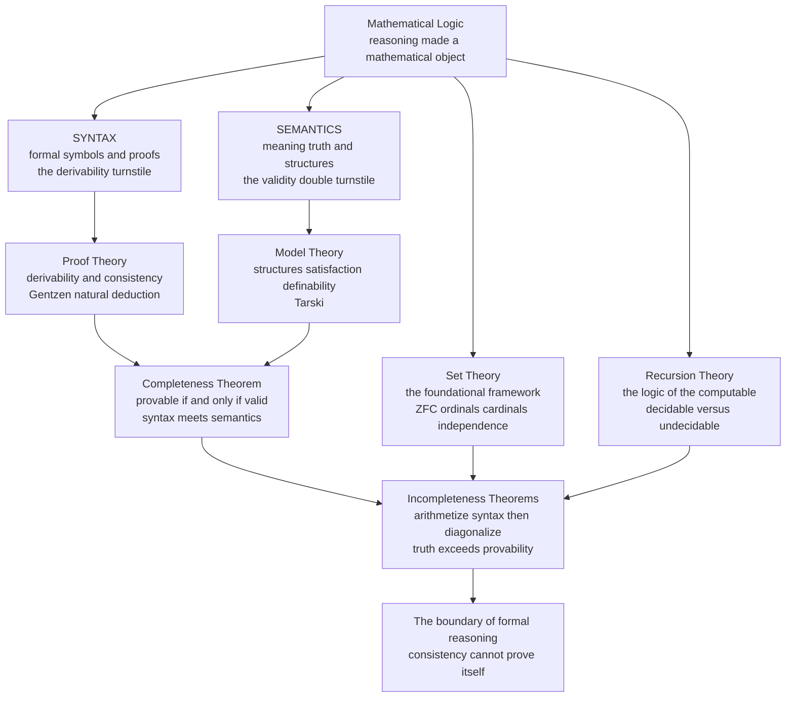

# 🧮 Mathematical Logic Overview

> [!abstract] TL;DR
> Mathematical logic is the **rigorous, mathematical study of reasoning itself** — of formal languages, truth, proof, and the foundations of mathematics. Its master move is to turn *reasoning into a mathematical object*: build precise formal systems, define "truth" (**semantics**) and "proof" (**syntax**) with the same exactness as any other branch of mathematics, and then prove theorems *about* those systems. This vault covers the four classical pillars — **model theory** (structures and truth), **proof theory** (formal derivation and consistency), **set theory** (the foundational framework), and **recursion/computability theory** (the logic of the computable) — bound together by **Gödel's completeness and incompleteness theorems**, and it looks outward to the intuitionistic, modal, type-theoretic, and categorical frontiers. This note is the entry point and maps the road ahead.

---

## Intuition

**Analogy — mathematics turns the microscope on itself.** For millennia, mathematics proved things *about* numbers, shapes, and quantities: that there are infinitely many primes, that the angles of a triangle sum to two right angles. The objects under the microscope were always *out there* — the integers, the plane. Then, in the late 19th and early 20th centuries, mathematicians did something vertiginous: they put **mathematics itself** under the microscope. They asked questions that sound almost philosophical but demanded mathematical answers:

- *What is a proof, exactly?* Not "an argument a professor finds convincing," but a precisely defined sequence of symbols manipulated by fixed rules.
- *What does it mean for a statement to be true?* Not intuition, but a precise relation between a sentence and a mathematical structure.
- *Can every true statement be proved?* Is the machinery of proof strong enough to reach every truth?
- *Is mathematics even consistent* — free of hidden contradiction?

To answer these you must make **reasoning a mathematical object** — write down formal languages, define truth and proof with total rigor, and then prove theorems about the reach and limits of proof. That reflexive turn is mathematical logic. And its most famous discovery, Gödel's, is genuinely astonishing: **any consistent formal system rich enough to describe arithmetic contains true statements it can never prove.** Mathematics, made self-aware, found a boundary it cannot cross — a wall built into the very idea of a formal proof.

---

## How It Works

### Core Mechanics

**1. The one distinction that organizes everything: syntax vs. semantics.** Every part of mathematical logic lives on one side or the other of a single divide.

- **Syntax** is the world of *symbols and rules* — formulas, axioms, and the purely mechanical shuffling of them into **proofs**. A proof-checker is a syntactic device: it never asks what the symbols *mean*, only whether each step obeys the rules. The syntactic verdict "there is a derivation of `φ`" is written `⊢ φ` (**derivable / provable**).
- **Semantics** is the world of *meaning and truth* — mathematical **structures** (a set with some operations and relations) and whether a formula comes out true in them. The semantic verdict "`φ` is true in every structure" is written `⊨ φ` (**valid**).

The deepest questions in the field are all about whether these two worlds line up. When they line up perfectly — every provable formula is valid (**soundness**) *and* every valid formula is provable (**completeness**) — the syntactic game of proof exactly captures the semantic notion of truth. When they *fail* to line up, you get Gödel's incompleteness: truths that no proof can reach.

**2. The four classical pillars.** The vault is organized around the four subfields that grew out of this program, each specializing in one aspect:

| Pillar | Side of the divide | Studies | Central objects |
|---|---|---|---|
| **Model theory** | semantics | truth and *satisfaction* — which structures make which sentences true | structures, models, definability, elementary equivalence |
| **Proof theory** | syntax | *derivability* — what can be proved, and whether a system is consistent | formal proofs, natural deduction, sequent calculus (Gentzen), cut-elimination |
| **Set theory** | foundations | the framework in which all other mathematics is encoded | ZFC axioms, ordinals, cardinals, the axiom of choice, independence |
| **Recursion / computability theory** | the computable | which questions can be settled by an *algorithm* at all | decidability, undecidability, Turing degrees, the arithmetical hierarchy |

**3. Gödel is the keystone that links them.** Two theorems tie the pillars together:

- **The Completeness Theorem (Gödel, 1929)** — for first-order logic, `⊢ φ` if and only if `⊨ φ`. Syntax and semantics coincide exactly: a sentence is provable precisely when it is true in every model. This is the bridge between proof theory and model theory, and it is *good* news — first-order logic is exactly as strong as it should be.
- **The Incompleteness Theorems (Gödel, 1931)** — any consistent, effectively axiomatized theory strong enough to encode arithmetic (a) cannot prove every arithmetical truth (**first theorem**), and (b) cannot prove its own consistency (**second theorem**). This is the *limit* result, and it is built on a recursion-theoretic trick: arithmetize syntax so that a sentence can talk about its own provability, then construct one that says "I am not provable." The pillars of syntax, semantics, and computability collide here.

**4. The foundational crisis that lit the fuse.** None of this was academic hair-splitting — it grew out of an emergency. In the 1890s **Frege** tried to reduce all of mathematics to logic; in 1901 **Russell** found a paradox (the set of all sets that do not contain themselves) that detonated Frege's system. **Hilbert** responded with a program: reduce all of mathematics to a single finite, provably consistent, complete formal system, closing every crack forever. In 1931 **Gödel** proved Hilbert's dream impossible in principle. Out of that wreckage — paradox, program, and demolition — the modern discipline was born, and with it the precise tools that would later define *computation* itself.

**5. Why computer science inherited all of it.** Mathematical logic is the direct ancestor of computer science. Turing invented his machine to settle a *logic* problem (Hilbert's Entscheidungsproblem — is validity decidable? No). The `⊢` / `⊨` distinction is exactly the "checkable vs. true" distinction that reappears in verification. First-order logic is the query language beneath relational databases; type theory (via the **Curry–Howard correspondence**, "proofs are programs") underlies proof assistants and functional languages; SAT/SMT solvers are industrial semantics engines. Logic is not a museum piece — it is running in the compiler and the query planner.

### Flow / Architecture



*The single vertical fault line is **syntax vs. semantics**. Proof theory works the syntax side, model theory the semantics side; set theory supplies the arena and recursion theory the notion of "effective." Gödel's **completeness** result welds syntax to semantics for first-order logic, and his **incompleteness** result — powered by set-theoretic coding and recursion-theoretic self-reference — shows where the weld finally fails.*

---

## Key Concepts

### Secondary (intuitive, no advanced background needed)

- **Formal language** — a fixed alphabet of symbols plus grammar rules that say which strings count as well-formed *formulas*. Meaning is added later; first you fix the shapes.
- **Truth value** — every proposition is either true or false (in classical logic). The whole edifice is built on this two-valued footing.
- **Axiom and theorem** — axioms are the accepted starting points; theorems are what you reach from them by the rules. A *proof* is the chain in between.
- **Consistency** — a system is consistent if it can never prove both a statement and its negation. An inconsistent system proves *everything* and is worthless.
- **Syntax vs. semantics** — the difference between *pushing symbols by the rules* (syntax) and *what the symbols mean and whether they are true* (semantics). Keep these apart and half of logic becomes clear.

### Undergraduate (a first course in logic)

- **Propositional logic** — atoms combined by `¬ ∧ ∨ → ↔`; validity decided finitely by **truth tables**. A formula true under every assignment is a **tautology** (see *Propositional_Logic_and_Boolean_Semantics* in this vault).
- **First-order (predicate) logic** — adds variables, predicates, functions, and the quantifiers `∀ ∃`, letting you talk about *objects and their relations*, not just whole propositions (*First_Order_Predicate_Logic*).
- **Structures, models, and satisfaction** — a structure interprets the symbols; `M ⊨ φ` says the structure `M` makes `φ` true. This is the semantic heart of *Model_Theory_Foundations*.
- **Soundness and completeness** — soundness: everything provable is true (`⊢ φ ⇒ ⊨ φ`); completeness: everything true is provable (`⊨ φ ⇒ ⊢ φ`). Together they justify doing semantics by syntax (*Soundness_and_Completeness*).
- **Natural deduction and sequent calculus** — the two standard proof systems; introduction/elimination rules that make formal proof feel like structured reasoning.
- **Set theory as foundation** — nearly all of mathematics is coded as sets; the **ZFC** axioms are the working foundation (*Axiomatic_Set_Theory_ZFC*).

### Graduate (advanced logic)

- **The Compactness and Löwenheim–Skolem theorems** — first-order logic cannot pin down infinite structures up to size; every satisfiable theory has models of every infinite cardinality. The engine behind non-standard models and much of model theory.
- **Gödel's incompleteness theorems** — arithmetization of syntax, the diagonal lemma, and the construction of a true-but-unprovable sentence; the second theorem's "a system cannot prove its own consistency" (*Godels_Incompleteness_Theorems*).
- **Independence and forcing** — Gödel and Cohen showed the Continuum Hypothesis and the Axiom of Choice are *independent* of ZFC; **forcing** builds models where each can go either way. Set theory studies the multiverse of possible mathematics.
- **Ordinal proof theory and cut-elimination** — Gentzen proved the consistency of arithmetic using transfinite induction up to `ε₀`; cut-elimination gives proofs a normal form and connects to computation.
- **Turing degrees and the arithmetical hierarchy** — a fine-grained map of *how* undecidable a problem is, layering the non-computable by quantifier complexity (`Σ⁰ₙ`, `Π⁰ₙ`).
- **Constructive, intuitionistic, modal, and categorical logic** — logics that reject excluded middle (Brouwer/Heyting), reason about necessity and possibility, or recast logic inside category theory (topoi); the living frontier surveyed in *The_Reach_and_Future_of_Mathematical_Logic*.

---

## Python Demo

```python
# Syntax vs. semantics in propositional logic -- the divide that runs through
# all of mathematical logic, made concrete and runnable.
#
# We build a tiny logic ENGINE: tokenize -> parse a formula into an AST ->
# evaluate it over every truth assignment (its MODELS = the SEMANTICS).
# We then CLASSIFY each formula as a TAUTOLOGY (true in ALL models = valid, |=),
# SATISFIABLE (true in some), or a CONTRADICTION (true in none).
#
# The punchline is the syntax<->semantics duality: a formula's SEMANTIC status
# (true in every model, |=) coincides EXACTLY with its SYNTACTIC status
# (derivable, |-) -- that coincidence IS the Completeness Theorem.
# numpy + matplotlib only.

import numpy as np
import matplotlib.pyplot as plt
from itertools import product

# --- Tokenizer -------------------------------------------------------------
# Operators:  ~ not   & and   | or   > implies   = iff
OPS = set("~&|>=()")

def tokenize(s):
    toks, i = [], 0
    while i < len(s):
        c = s[i]
        if c.isspace():
            i += 1
        elif c in OPS:
            toks.append(c); i += 1
        elif c.isalnum():
            j = i
            while j < len(s) and s[j].isalnum():
                j += 1
            toks.append(s[i:j]); i = j
        else:
            raise ValueError(f"bad character {c!r}")
    return toks

# --- Recursive-descent parser -> nested-tuple AST --------------------------
# Precedence, loosest to tightest:  iff , implies , or , and , not , atom
class Parser:
    def __init__(self, toks):
        self.t, self.i = toks, 0
    def peek(self):
        return self.t[self.i] if self.i < len(self.t) else None
    def eat(self):
        c = self.t[self.i]; self.i += 1; return c
    def parse(self):
        return self.iff()
    def iff(self):
        node = self.imp()
        while self.peek() == '=':
            self.eat(); node = ('iff', node, self.imp())
        return node
    def imp(self):                       # right-associative
        node = self.orr()
        if self.peek() == '>':
            self.eat(); return ('imp', node, self.imp())
        return node
    def orr(self):
        node = self.andd()
        while self.peek() == '|':
            self.eat(); node = ('or', node, self.andd())
        return node
    def andd(self):
        node = self.nott()
        while self.peek() == '&':
            self.eat(); node = ('and', node, self.nott())
        return node
    def nott(self):
        if self.peek() == '~':
            self.eat(); return ('not', self.nott())
        return self.atom()
    def atom(self):
        if self.peek() == '(':
            self.eat(); node = self.iff(); self.eat()   # consume ')'
            return node
        return ('var', self.eat())

def parse(s):
    return Parser(tokenize(s)).parse()

# --- Evaluator: AST + assignment -> bool (the SEMANTICS) -------------------
def evaluate(node, env):
    tag = node[0]
    if tag == 'var': return env[node[1]]
    if tag == 'not': return not evaluate(node[1], env)
    a, b = evaluate(node[1], env), evaluate(node[2], env)
    if tag == 'and': return a and b
    if tag == 'or':  return a or b
    if tag == 'imp': return (not a) or b
    if tag == 'iff': return a == b
    raise ValueError(tag)

def variables(node, acc=None):
    acc = set() if acc is None else acc
    if node[0] == 'var':
        acc.add(node[1])
    else:
        for child in node[1:]:
            variables(child, acc)
    return acc

# --- Truth table + classification -----------------------------------------
def truth_table(formula):
    ast = parse(formula)
    vs = sorted(variables(ast))
    rows, vals = [], []
    for bits in product([False, True], repeat=len(vs)):
        env = dict(zip(vs, bits))
        rows.append(bits); vals.append(evaluate(ast, env))
    return vs, np.array(rows, dtype=int), np.array(vals, dtype=bool)

def classify(formula):
    _, _, vals = truth_table(formula)
    if vals.all(): return "TAUTOLOGY    (valid, true in ALL models)"
    if vals.any(): return "SATISFIABLE  (contingent)"
    return "CONTRADICTION (unsatisfiable)"

# --- Run the engine over classic formulas ---------------------------------
formulas = [
    ("((P > Q) & P) > Q",              "modus ponens"),
    ("P | ~P",                         "excluded middle"),
    ("(P > Q) = (~Q > ~P)",            "contraposition"),
    ("P & ~P",                         "explicit contradiction"),
    ("P > Q",                          "material implication"),
    ("((P > Q) & (Q > R)) > (P > R)",  "hypothetical syllogism"),
]

print("SYNTAX (a formula)                          SEMANTIC VERDICT")
print("-" * 74)
for f, name in formulas:
    print(f"{f:<44}{classify(f)}")

# Show the MODELS (satisfying assignments) of one contingent formula
target = "P > Q"
vs, rows, vals = truth_table(target)
print(f"\nAll assignments for  '{target}'  (its MODELS are starred):")
for bits, v in zip(rows, vals):
    star = "   <-- MODEL" if v else ""
    print("   " + ", ".join(f"{n}={b}" for n, b in zip(vs, bits))
          + f"   =>  {int(v)}{star}")

# --- Visualization ---------------------------------------------------------
fig, (ax1, ax2) = plt.subplots(1, 2, figsize=(13, 5))

# (left) truth table of the hypothetical syllogism -- last column all 1 = tautology
demo = "((P > Q) & (Q > R)) > (P > R)"
vs, rows, vals = truth_table(demo)
grid = np.hstack([rows, vals.astype(int)[:, None]])
ax1.imshow(grid, cmap="RdYlGn", aspect="auto", vmin=0, vmax=1)
ax1.set_xticks(range(len(vs) + 1))
ax1.set_xticklabels(vs + ["FORMULA"], fontsize=9)
ax1.set_yticks(range(len(rows)))
ax1.set_yticklabels([f"assign {i}" for i in range(len(rows))], fontsize=8)
for r in range(grid.shape[0]):
    for c in range(grid.shape[1]):
        ax1.text(c, r, grid[r, c], ha="center", va="center", fontsize=10)
ax1.set_title("Truth table: hypothetical syllogism\n"
              "last column all 1  =>  TAUTOLOGY  =  valid", fontsize=10)

# (right) model count = the semantic content of each formula
labels, sat, total = [], [], []
for f, name in formulas:
    _, _, v = truth_table(f)
    labels.append(name); sat.append(int(v.sum())); total.append(len(v))
y = np.arange(len(labels))
ax2.barh(y, total, color="#dddddd", label="all assignments")
ax2.barh(y, sat,   color="#4c9be8", label="satisfying models")
ax2.set_yticks(y); ax2.set_yticklabels(labels, fontsize=9)
ax2.invert_yaxis()
ax2.set_xlabel("number of truth assignments")
ax2.set_title("Model count = SEMANTIC content\n"
              "full bar = tautology, empty bar = contradiction", fontsize=10)
ax2.legend(fontsize=8, loc="lower right")

plt.tight_layout()
plt.savefig("syntax_vs_semantics.png", dpi=130)
print("\nSaved truth-table / model-count figure to syntax_vs_semantics.png")
```

Running it prints the semantic verdict for each classic schema — modus ponens, excluded middle, contraposition, and the hypothetical syllogism come out as **tautologies** (valid), `P → Q` is **satisfiable/contingent**, and `P ∧ ¬P` is a **contradiction** — then lists the models of `P → Q`, and saves a figure with the syllogism's truth table (last column all `1`, so it is true in *every* model) next to a bar chart where each formula's satisfying-model count is its semantic content: a full bar is validity, an empty bar is unsatisfiability. By soundness and completeness, those semantic verdicts are exactly the ones a purely syntactic proof-checker would reach.

---

## Real-World Applications

> **Example — the `⊢` vs. `⊨` distinction is the "checked vs. true" distinction inside every verified system.** When a hardware team proves a chip design correct, or a compiler like **CompCert** ships a machine-checked correctness proof, they are exploiting soundness: a *syntactic* proof, mechanically checkable in seconds, guarantees a *semantic* property (the circuit meets its spec on all inputs) that would take longer than the age of the universe to test exhaustively. The proof assistant (**Coq**, **Lean**, **Isabelle**) is literally a proof-theory engine, and its trustworthiness rests on the soundness theorem — every derivation it accepts is valid.

Beyond formal verification:
- **Databases speak first-order logic.** SQL and the relational algebra are first-order predicate logic in disguise; a query is a formula and the answer set is its *satisfying assignments* over the database structure — model theory at industrial scale.
- **SAT and SMT solvers** decide propositional and first-order satisfiability for millions of variables, driving chip verification, program analysis, scheduling, and configuration. Every one is an applied semantics engine testing `⊨`.
- **Type systems are proofs.** The **Curry–Howard correspondence** identifies programs with proofs and types with propositions, so a well-typed program *is* a formal proof — the foundation of proof assistants and dependently typed languages ([[The_Curry_Howard_Correspondence]]).
- **Computability sets absolute limits on tooling.** Turing built his machine to answer a logic question (the Entscheidungsproblem), and the undecidability that resulted means no perfect static analyzer, loop detector, or optimizer can exist ([[The_Halting_Problem_and_Undecidability]]).
- **Foundations of AI reasoning.** Knowledge representation (description logics, Datalog, answer-set programming) and automated theorem proving descend directly from first-order logic and proof theory.

---

## Common Pitfalls

- **Collapsing syntax into semantics.** `⊢ φ` ("there is a proof") and `⊨ φ` ("true in all models") are *different* relations that merely happen to coincide for first-order logic — and that coincidence is a hard theorem (completeness), not a definition. Treating "provable" and "true" as synonyms erases the single most important idea in the field and makes Gödel's incompleteness sound impossible.
- **Misreading Gödel.** Incompleteness does **not** say "mathematics is broken," "nothing can be proved," or "truth is subjective." It says any *single* consistent, effectively axiomatized theory strong enough for arithmetic leaves *some* arithmetical truth unprovable *within that theory* — and cannot certify its own consistency. Stronger theories prove those truths (while acquiring new blind spots). It is a precise limit, not a license for relativism.
- **Confusing "undecidable" with "unprovable" with "hard."** Three different notions: a *problem* is **undecidable** if no algorithm decides it (halting); a *sentence* is **independent/unprovable** if a theory neither proves nor refutes it (the Continuum Hypothesis in ZFC); a problem is **intractable** if it is decidable but slow (NP-complete). They belong to computability, proof theory, and complexity respectively.
- **Expecting first-order logic to pin down infinite structures.** Compactness and Löwenheim–Skolem guarantee it *cannot*: any first-order theory with an infinite model has models of every infinite size, including "non-standard" ones full of unintended elements. Beginners assume the axioms of arithmetic uniquely describe the natural numbers — they do not.
- **Thinking classical two-valued logic is the only logic.** Intuitionistic logic drops excluded middle (`P ∨ ¬P` is not a theorem), and it is the *right* logic for constructive mathematics and for the proofs-as-programs view; modal, relevant, and paraconsistent logics change the rules further. "The" logic is a choice, not a given.
- **Assuming set theory is settled bedrock.** ZFC is a working foundation, but the axiom of choice and the continuum hypothesis are independent of it, and set theorists actively study *alternative* axioms. The foundation is a live research subject, not a closed book.

---

## Related Concepts

- [[Logic_and_Critical_Thinking_Overview]] — the **informal / applied** companion vault: arguments, fallacies, everyday reasoning. This vault is its rigorous formal counterpart; read them side by side to see the same ideas made mathematically exact.
- [[Propositional_Logic]] — the informal-logic treatment of connectives and truth tables; the semantic engine in this note's demo is the formalization of exactly that.
- [[Predicate_Logic_and_Quantifiers]] — quantifiers and predicates from the reasoning side; here they become *first-order logic* with a full model-theoretic semantics.
- [[Proof_Theory_and_Natural_Deduction]] — the syntactic side, introduction/elimination rules; deepened here into Gentzen systems, cut-elimination, and consistency proofs.
- [[Modal_Logic]] — necessity and possibility operators; a key frontier extension of classical logic covered in this vault's outlook.
- [[Truth_Theories_and_Metalogic]] — Tarski's definition of truth and metalogical results; the philosophical backdrop to model theory and the `⊨` relation.
- [[Mathematical_Logic_and_Set_Theory]] — the single-note survey in Mathematics/14; this vault is the *expanded, section-by-section* deep dive of that summary.
- [[Logic_and_Proof_Techniques]] — the discrete-math toolkit (induction, contradiction, diagonalization) that every incompleteness and undecidability proof relies on.
- [[Set_Theory_and_Relations]] — naive/discrete set theory; the foundations pillar here axiomatizes it as ZFC with ordinals, cardinals, and independence.
- [[Theory_of_Computation_Overview]] — the CS-facing sibling; recursion/computability theory is the shared border, and Turing machines were born to settle a logic problem.
- [[Turing_Machines_and_the_Church_Turing_Thesis]] — the formal model of "effective procedure" that makes "effectively axiomatized" and Gödel's theorems precise.
- [[The_Halting_Problem_and_Undecidability]] — the recursion-theoretic undecidability result that mirrors, and helped inspire, Gödel's incompleteness.
- [[The_Curry_Howard_Correspondence]] — "proofs are programs, propositions are types"; the bridge from proof theory to type theory and modern verification.
- [[Intuitionistic_Logic_and_Constructive_Proofs]] — the constructive logic that rejects excluded middle; the logical basis of the frontier this vault surveys.
- [[Category_Theory]] — categorical/topos logic, one of the modern reformulations of the foundations of logic and set theory.

---

## Vault Roadmap — the section this note opens

This is the entry point to the **Mathematical Logic** vault. The deep-dive notes that follow build out each pillar in prose and code:

1. **Foundations of Formal Logic** *(this section)* — *Propositional_Logic_and_Boolean_Semantics* (connectives, truth, tautology, functional completeness) and *First_Order_Predicate_Logic* (quantifiers, structures, the language of mathematics).
2. **Proof and Truth** — *Soundness_and_Completeness* (the `⊢`/`⊨` bridge, compactness, Löwenheim–Skolem) and the proof-theoretic machinery of natural deduction and the sequent calculus.
3. **Model Theory** — *Model_Theory_Foundations* (satisfaction, definability, elementary equivalence, non-standard models).
4. **Set-Theoretic Foundations** — *Axiomatic_Set_Theory_ZFC* (the axioms, ordinals and cardinals, choice, and independence via forcing).
5. **Limits of Formalization** — *Godels_Incompleteness_Theorems* (arithmetization, the diagonal lemma, the two theorems) and their recursion-theoretic cousins.
6. **Reach and Frontiers** — *The_Reach_and_Future_of_Mathematical_Logic* (intuitionistic/constructive, modal, type theory, categorical logic, and logic's grip on computer science).

---

## Review Questions

### Secondary

1. In your own words, what is the difference between a formula being *provable* and a formula being *true*? Give a plain-language example of a rule that shuffles symbols (syntax) versus a statement about what those symbols mean (semantics).
2. Why is *consistency* — never proving both a statement and its negation — the one property a formal system cannot do without? What goes wrong if a single contradiction sneaks in?
3. The demo classifies `P ∨ ¬P` as a tautology and `P ∧ ¬P` as a contradiction. Explain, without a truth table, why the first must be true under every assignment and the second false under every assignment.

### Undergraduate

1. State the soundness and completeness theorems for first-order logic using the `⊢` and `⊨` symbols. What would break in mathematical practice if completeness *failed* — that is, if some valid sentence had no proof?
2. Using the truth-table method from the demo, argue that "true in all models" is a *decidable* property for **propositional** logic but explain why the analogous validity problem for **first-order** logic is undecidable (name the theorem or result responsible).
3. Compactness says a set of first-order sentences is satisfiable if every finite subset is. Sketch how this forces the existence of a model of arithmetic containing an "infinite" natural number, and explain why that means the first-order axioms cannot uniquely characterize the natural numbers.

### Graduate

1. Gödel's second incompleteness theorem says a sufficiently strong consistent theory cannot prove its own consistency. Explain precisely why this demolished Hilbert's program, and why Gentzen's later consistency proof of arithmetic (using transfinite induction up to `ε₀`) does *not* contradict it.
2. Both the Continuum Hypothesis and the Halting Problem are famous "cannot be settled" results, yet they live in different pillars. Distinguish **independence** from ZFC (a proof-theoretic/set-theoretic phenomenon established by forcing) from **undecidability** (a recursion-theoretic phenomenon). What is the analogue, in each setting, of "we cannot decide this"?
3. The Curry–Howard correspondence identifies proofs with programs and cut-elimination with computation. Explain how this makes proof theory *constructive* and why it privileges intuitionistic over classical logic. What is gained, and what is lost, by dropping the law of excluded middle?

---

## Sources

- Enderton, H. B. *A Mathematical Introduction to Logic*, 2nd ed. Academic Press, 2001 — the standard first graduate text; first-order logic, completeness, compactness, and incompleteness.
- Mendelson, E. *Introduction to Mathematical Logic*, 6th ed. CRC Press, 2015 — comprehensive classic covering propositional and predicate calculus, set theory, and computability.
- Kleene, S. C. *Mathematical Logic*. Wiley, 1967 (Dover reprint) — foundational treatment by a founder of recursion theory, strong on the syntax/semantics interplay.
- van Dalen, D. *Logic and Structure*, 5th ed. Springer, 2013 — natural-deduction-centered introduction to proof theory, model theory, and intuitionistic logic.
- Boolos, G., Burgess, J., Jeffrey, R. *Computability and Logic*, 5th ed. Cambridge University Press, 2007 — the modern bridge between computability theory and Gödel's theorems.

---

#mathematical-logic #formal-logic #foundations-of-mathematics #proof-theory #model-theory
