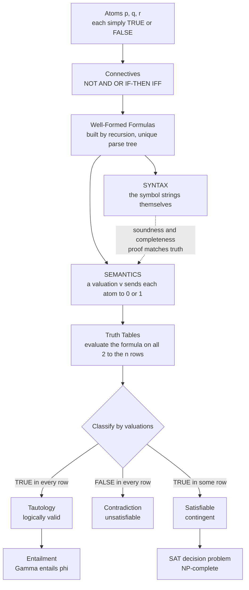

# ⚙️ Propositional Logic and Boolean Semantics

> [!abstract] TL;DR
> **Propositional logic** is the formal study of how truth values combine: it treats each statement as a single TRUE/FALSE switch and defines a precise **syntax** (atoms, the connectives ¬ ∧ ∨ → ↔, well-formed formulas built by recursion) together with a **truth-functional semantics** (Boolean *valuations* that fix a truth table for every formula). From this one gets the central semantic notions — **tautology**, **contradiction**, **satisfiability**, **logical equivalence**, and **entailment** (Γ ⊨ φ) — the **deduction theorem**, the **normal forms** CNF and DNF, functional completeness of {¬, ∧, ∨} (and of NAND alone), and the twin metatheorems **soundness** and **completeness** (⊢ iff ⊨). It is simultaneously the ground floor of all formal reasoning, the algebra of digital circuits, and the home of the first NP-complete problem, **SAT**.

---

## Intuition

**Analogy — the arithmetic of truth.** Before you can reason about anything complicated, you need the *atoms* of reasoning: statements that are simply TRUE or FALSE, and a small kit of connectives — AND, OR, NOT, IF-THEN — that glue them together. Propositional logic is the arithmetic of truth. Just as ordinary arithmetic treats "7" as a single number and studies how `+` and `×` propagate values, propositional logic treats "it is raining" as a single true/false switch and studies how flipping switches propagates through logical circuitry. You do not care *why* it is raining or *what* rain is — only that the switch is ON or OFF, and how that ON/OFF ripples through a wiring diagram of ANDs and ORs.

Push the analogy one step further and it becomes literal. Wire the switches into a panel, and a **valuation** is one setting of all the switches; a **truth table** is the exhaustive log of what the panel outputs for every setting. A formula that lights up under *every* setting is a **tautology**; one that lights up under *no* setting is a **contradiction**; one that lights up under *some* setting is **satisfiable**. Master this and you hold the foundation of every digital circuit, every SAT solver, and the first floor of the tower that rises through predicate logic and Gödel's theorems.

---

## How It Works

### Core mechanics

**1. Syntax — well-formed formulas by recursion.** Fix a countable set of **propositional variables** (atoms) `p, q, r, …`. The **well-formed formulas** (WFFs) are the smallest set such that:

1. every atom is a WFF (the *base* case);
2. if φ is a WFF then so is ¬φ;
3. if φ and ψ are WFFs then so are (φ ∧ ψ), (φ ∨ ψ), (φ → ψ), (φ ↔ ψ).

Because the definition is *inductive*, every formula has a unique **parse tree**, and any property can be proved by **structural induction** — the workhorse of propositional metatheory. A **literal** is an atom or its negation; a **clause** is a disjunction of literals.

**2. Semantics — Boolean valuations.** A **valuation** (or *model*, or *interpretation*) is a function `v` assigning each atom a value in {0, 1}. It extends *uniquely* to all formulas by the **truth tables of the connectives**:

| φ | ψ | ¬φ | φ ∧ ψ | φ ∨ ψ | φ → ψ | φ ↔ ψ |
|---|---|----|-------|-------|-------|-------|
| 1 | 1 | 0  | 1     | 1     | 1     | 1     |
| 1 | 0 | 0  | 0     | 1     | 0     | 0     |
| 0 | 1 | 1  | 0     | 1     | 1     | 0     |
| 0 | 0 | 1  | 0     | 0     | 1     | 1     |

The connectives are **truth-functional**: the value of a compound depends *only* on the values of its parts, never on meaning or context. Note the **material conditional** φ → ψ is false in exactly one case (φ true, ψ false); it is not causation, relevance, or everyday "if".

**3. The semantic vocabulary.** With `n` atoms there are exactly `2ⁿ` valuations, so every formula's behaviour is captured by a finite truth table. This finiteness is what makes propositional logic **decidable**. It gives us:

- **Tautology** (⊨ φ): true under *every* valuation. E.g. `p ∨ ¬p`.
- **Contradiction**: false under every valuation. E.g. `p ∧ ¬p`.
- **Satisfiable / contingent**: true under *at least one* valuation.
- **Logical equivalence** (φ ≡ ψ): identical truth-table columns; interchangeable everywhere.
- **Logical consequence / entailment** (Γ ⊨ φ): *every* valuation satisfying all of Γ also satisfies φ — equivalently, *no* model makes the premises true and φ false.

**4. The deduction theorem.** Semantically, Γ ∪ {φ} ⊨ ψ **iff** Γ ⊨ (φ → ψ). This is the bridge that turns "reasoning *from* an assumption" into "proving a conditional", and it is why → is the connective of argument.

**5. Normal forms and functional completeness.** Every truth function is expressible using only {¬, ∧, ∨} — the set is **functionally complete** — and in fact the single connective **NAND** (or **NOR**) suffices alone, which is why one gate type builds any chip. Reading the truth table off directly gives the two canonical forms: **DNF** (an OR of the "true rows", each a full conjunction of literals) and **CNF** (an AND of clauses, one per "false row"). CNF is the universal input format for SAT solvers.

**6. Proof systems and the twin metatheorems (foreshadow).** Alongside the *semantics* (⊨, about models) sit **proof calculi** — natural deduction, Hilbert systems, and **resolution** — that manipulate formulas *syntactically* (⊢, about derivations). The **soundness** theorem says ⊢ implies ⊨ (only valid things are provable); the **completeness** theorem (Post, 1921) says ⊨ implies ⊢ (every valid thing is provable). Together **⊢ φ iff ⊨ φ**: syntax and truth coincide exactly for propositional logic. **Compactness** follows: a set of formulas is satisfiable iff every finite subset is. These results are the propositional shadow of the deeper first-order versions treated in the sibling notes *Formal_Systems_and_Proof_Calculi* and *Soundness_and_Completeness*.

### Flow — syntax, valuations, and the semantic verdicts



---

## Key Concepts

### Secondary (foundations)

- **Atom / proposition** — an indivisible statement that is TRUE or FALSE; the "switch" of the system.
- **The five connectives** — NOT flips a value; AND needs both; OR needs either; IF-THEN fails only on true→false; IFF means "same value".
- **Truth table** — the exhaustive `2ⁿ`-row log of a formula's behaviour; the definitive semantic tool.
- **Tautology vs contradiction** — `p ∨ ¬p` (excluded middle) is always true; `p ∧ ¬p` (non-contradiction) is always false.

### Undergraduate (formal theory)

- **Valuation / model** — a function from atoms to {0, 1} that extends uniquely up the parse tree; "the formula holds *in* this model".
- **Equivalence vs biconditional** — `φ ≡ ψ` is a *metalevel* claim (identical columns); `φ ↔ ψ` is an *object-level* formula whose own truth varies by valuation.
- **Key equivalences** — De Morgan `¬(φ ∧ ψ) ≡ ¬φ ∨ ¬ψ`; implication elimination `φ → ψ ≡ ¬φ ∨ ψ`; contrapositive `φ → ψ ≡ ¬ψ → ¬φ`; distribution `φ ∧ (ψ ∨ χ) ≡ (φ ∧ ψ) ∨ (φ ∧ χ)`.
- **Entailment and the deduction theorem** — Γ ⊨ φ means no model of Γ falsifies φ; `Γ, φ ⊨ ψ ⇔ Γ ⊨ (φ → ψ)`.
- **CNF / DNF** — canonical forms readable straight off the truth table; DNF from true rows, CNF from false rows.
- **Functional completeness** — {¬, ∧, ∨} expresses every truth function; so does {NAND} alone or {NOR} alone.

### Graduate (metatheory and complexity)

- **Soundness and completeness** — for propositional logic `⊢ φ ⇔ ⊨ φ`; the proof system captures exactly the tautologies (Post 1921).
- **Compactness (propositional)** — Γ is satisfiable iff every finite subset is; a corollary of completeness (or provable directly via König's lemma / ultrafilters).
- **Resolution** — a single refutation-complete rule: from `(p ∨ C)` and `(¬p ∨ D)` derive `(C ∨ D)`; a formula is unsatisfiable iff resolution derives the empty clause `⊥`.
- **The SAT problem** — decide whether a CNF formula has a satisfying valuation. By the **Cook–Levin theorem** SAT is **NP-complete** — the first such problem — so it is the reference point for all of NP.
- **Proof complexity** — some tautologies (e.g. the pigeonhole principle) require *exponentially long* resolution refutations; the length of the shortest proof is itself a rich subject.
- **Boolean algebra correspondence** — propositional logic under ≡ is exactly the free Boolean algebra on the atoms; ∧/∨/¬ are meet/join/complement, tautologies are the top element `1`.

---

## Python Demo

```python
# Propositional-logic engine over Boolean valuations:
#   (a) evaluate formulas on all 2^n assignments, build truth tables, classify
#       (TAUTOLOGY / CONTRADICTION / SATISFIABLE-contingent), verify equivalences
#       (De Morgan, distribution) and argument VALIDITY via entailment;
#   (b) a brute-force SAT check plus canonical CNF / DNF read off the truth table;
#   (c) the deduction theorem and one resolution step.
# Plot: a truth-table heatmap and satisfying-assignment counts.
import numpy as np
import matplotlib.pyplot as plt
from itertools import product

# ── Formula AST — each node is callable on an environment dict {atom: bool} ──
class F:
    def __invert__(self):      return Not(self)
    def __and__(self, o):      return And(self, o)
    def __or__(self, o):       return Or(self, o)
    def imp(self, o):          return Imp(self, o)
    def iff(self, o):          return Iff(self, o)

class Var(F):
    def __init__(self, n): self.n = n
    def __call__(self, e): return e[self.n]
    def __repr__(self):    return self.n
class Not(F):
    def __init__(self, a): self.a = a
    def __call__(self, e): return not self.a(e)
    def __repr__(self):    return f"¬{self.a}"
class And(F):
    def __init__(self, a, b): self.a, self.b = a, b
    def __call__(self, e): return self.a(e) and self.b(e)
    def __repr__(self):    return f"({self.a} ∧ {self.b})"
class Or(F):
    def __init__(self, a, b): self.a, self.b = a, b
    def __call__(self, e): return self.a(e) or self.b(e)
    def __repr__(self):    return f"({self.a} ∨ {self.b})"
class Imp(F):
    def __init__(self, a, b): self.a, self.b = a, b
    def __call__(self, e): return (not self.a(e)) or self.b(e)
    def __repr__(self):    return f"({self.a} → {self.b})"
class Iff(F):
    def __init__(self, a, b): self.a, self.b = a, b
    def __call__(self, e): return self.a(e) == self.b(e)
    def __repr__(self):    return f"({self.a} ↔ {self.b})"

# ── Core semantic engine ────────────────────────────────────────────────────
def assignments(vs):
    """Yield every Boolean valuation of the variable names in `vs`."""
    for bits in product([False, True], repeat=len(vs)):
        yield dict(zip(vs, bits))

def column(f, vs):
    """Truth-table column of formula f over variables vs, as a 0/1 array."""
    return np.array([int(f(e)) for e in assignments(vs)], dtype=int)

def classify(f, vs):
    c = column(f, vs)
    if c.all():        return "TAUTOLOGY"
    if not c.any():    return "CONTRADICTION"
    return "SATISFIABLE-contingent"

def equivalent(f, g, vs):
    return np.array_equal(column(f, vs), column(g, vs))

def satisfiable(f, vs):
    return bool(column(f, vs).any())

def entails(premises, conclusion, vs):
    """Γ ⊨ φ : no valuation makes every premise true and the conclusion false."""
    for e in assignments(vs):
        if all(p(e) for p in premises) and not conclusion(e):
            return False   # counter-model found -> invalid
    return True

# ── (b) Canonical normal forms straight off the truth table ─────────────────
def to_dnf(f, vs):
    terms = []
    for e in assignments(vs):
        if f(e):
            terms.append("(" + " ∧ ".join(v if e[v] else "¬" + v for v in vs) + ")")
    return " ∨ ".join(terms) if terms else "⊥"

def to_cnf(f, vs):
    clauses = []
    for e in assignments(vs):
        if not f(e):                       # falsifying row -> a clause that forbids it
            clauses.append("(" + " ∨ ".join("¬" + v if e[v] else v for v in vs) + ")")
    return " ∧ ".join(clauses) if clauses else "⊤"

# ── (c) One resolution step on clauses represented as sets of literals ──────
def resolve(c1, c2):
    for lit in c1:
        neg = lit[1:] if lit.startswith("¬") else "¬" + lit
        if neg in c2:
            return (c1 - {lit}) | (c2 - {neg})   # the resolvent
    return None

# ── Build formulas ──────────────────────────────────────────────────────────
p, q, r = Var("p"), Var("q"), Var("r")
V3, V2 = ["p", "q", "r"], ["p", "q"]

print("── (a) classification ──")
for name, f in [("p ∨ ¬p", p | ~p), ("p ∧ ¬p", p & ~p), ("(p ∧ q) → r", (p & q).imp(r))]:
    print(f"  {name:>14} : {classify(f, V3)}")

print("\n── equivalences ──")
print("  De Morgan  ¬(p ∧ q) ≡ ¬p ∨ ¬q :", equivalent(~(p & q), ~p | ~q, V2))
print("  Distribute p ∧ (q ∨ r) ≡ (p∧q) ∨ (p∧r) :",
      equivalent(p & (q | r), (p & q) | (p & r), V3))

print("\n── argument validity (entailment) ──")
print("  modus ponens        {p, p→q} ⊨ q :", entails([p, p.imp(q)], q, V2))
print("  affirming consequent {q, p→q} ⊨ p :", entails([q, p.imp(q)], p, V2))

print("\n── (b) SAT + normal forms of XOR = ¬(p ↔ q) ──")
xor = ~p.iff(q)
print("  satisfiable :", satisfiable(xor, V2))
print("  DNF :", to_dnf(xor, V2))
print("  CNF :", to_cnf(xor, V2))

print("\n── (c) deduction theorem  Γ,φ ⊨ ψ  ⇔  Γ ⊨ (φ→ψ) ──")
G = [p.imp(q), q.imp(r)]
lhs = entails(G + [p], r, V3)
rhs = entails(G, p.imp(r), V3)
print(f"  Γ,p ⊨ r : {lhs}   Γ ⊨ (p→r) : {rhs}   theorem holds : {lhs == rhs}")

print("\n── resolution step ──")
print("  {p,q} , {¬p,r}  ⟹ ", resolve({"p", "q"}, {"¬p", "r"}))        # {q, r}
print("  {p}  , {¬p,q}   ⟹ ", resolve({"p"}, {"¬p", "q"}), "(modus ponens)")  # {q}

# ── Visualization ────────────────────────────────────────────────────────────
demo = (p & q).imp(r)                       # (p ∧ q) → r
rows = list(assignments(V3))
mat = np.array([[int(e["p"]), int(e["q"]), int(e["r"]), int(demo(e))] for e in rows])

fig, (ax1, ax2) = plt.subplots(1, 2, figsize=(13, 5))

# Panel A: truth-table heatmap
ax1.imshow(mat, cmap="RdYlGn", aspect="auto", vmin=0, vmax=1)
ax1.set_xticks(range(4)); ax1.set_xticklabels(["p", "q", "r", "(p AND q) -> r"])
ax1.set_yticks(range(len(rows))); ax1.set_yticklabels([f"v{i}" for i in range(len(rows))])
for i in range(mat.shape[0]):
    for j in range(mat.shape[1]):
        ax1.text(j, i, "T" if mat[i, j] else "F",
                 ha="center", va="center", fontweight="bold")
ax1.axvline(2.5, color="black", lw=2)
ax1.set_title("Truth table of (p AND q) -> r")

# Panel B: satisfying-assignment counts over 3 variables
labels = ["p OR NOT p", "(p AND q) -> r", "p AND q AND r", "p XOR q"]
forms  = [p | ~p, demo, p & q & r, ~p.iff(q)]
counts = [int(column(f, V3).sum()) for f in forms]
bars = ax2.bar(labels, counts, color=["#2ecc71", "#3498db", "#e67e22", "#9b59b6"])
ax2.axhline(8, ls="--", color="grey"); ax2.text(2.55, 8.05, "all 8 models = tautology", fontsize=8)
ax2.set_ylabel("satisfying valuations out of 2^3 = 8")
ax2.set_title("How many of the 8 valuations satisfy each formula")
for b, c in zip(bars, counts):
    ax2.text(b.get_x() + b.get_width() / 2, c + 0.1, str(c), ha="center", fontsize=9)
plt.setp(ax2.get_xticklabels(), rotation=20, ha="right")

plt.tight_layout()
plt.savefig("propositional_semantics.png", dpi=120, bbox_inches="tight")
plt.show()
print("\nSaved: propositional_semantics.png")
```

**Expected output:**

```
── (a) classification ──
          p ∨ ¬p : TAUTOLOGY
          p ∧ ¬p : CONTRADICTION
     (p ∧ q) → r : SATISFIABLE-contingent

── equivalences ──
  De Morgan  ¬(p ∧ q) ≡ ¬p ∨ ¬q : True
  Distribute p ∧ (q ∨ r) ≡ (p∧q) ∨ (p∧r) : True

── argument validity (entailment) ──
  modus ponens        {p, p→q} ⊨ q : True
  affirming consequent {q, p→q} ⊨ p : False

── (b) SAT + normal forms of XOR = ¬(p ↔ q) ──
  satisfiable : True
  DNF : (p ∧ ¬q) ∨ (¬p ∧ q)
  CNF : (p ∨ q) ∧ (¬p ∨ ¬q)

── (c) deduction theorem  Γ,φ ⊨ ψ  ⇔  Γ ⊨ (φ→ψ) ──
  Γ,p ⊨ r : True   Γ ⊨ (p→r) : True   theorem holds : True

── resolution step ──
  {p,q} , {¬p,r}  ⟹  {'q', 'r'}
  {p}  , {¬p,q}   ⟹  {'q'} (modus ponens)
```

The engine confirms the whole semantic circle: excluded-middle is a tautology, XOR's DNF and CNF are read straight off its true/false rows, "affirming the consequent" is *invalid* because a counter-model exists (p false, q true), the deduction theorem's two sides agree, and one resolution step reproduces modus ponens.

---

## Real-World Applications

> **1. Digital circuit design and verification (Intel, AMD, Synopsys).** Every combinational circuit *is* a propositional formula: gates realise ∧, ∨, ¬, and the whole chip a Boolean function. Logic synthesis minimises that formula (Karnaugh maps, Espresso); **equivalence checking** asks whether an optimised netlist computes the same function as its specification by testing whether their XOR is *unsatisfiable* — a SAT query run on billions of transistors.

> **2. SAT / SMT solvers (MiniSat, CaDiCaL, Z3).** Bounded model checking, symbolic execution, and constraint solving all compile down to CNF and hand it to a solver. Modern CDCL solvers dispatch formulas with millions of variables, turning the "worst-case NP-complete" SAT problem into an everyday industrial tool.

> **3. Software and protocol verification (CBMC, TLA+, seL4).** Program paths and safety properties are unrolled into propositional constraints; a satisfying assignment is a concrete bug trace, an unsatisfiable formula a machine-checkable proof of correctness. The seL4 microkernel's functional-correctness proof rests on exactly this metatheoretic foundation.

> **4. AI planning and configuration (SATPlan, product configurators).** "Can the goal be reached in k steps?" becomes a Boolean variable per action-per-timestep; a satisfying valuation *is* the plan. Automotive and enterprise product configurators encode "which options are compatible" as clauses and solve with the same machinery.

> **5. Knowledge representation and databases.** Integrity constraints, access-control policies, and type-checking of feature models are propositional consistency queries. Datalog and description-logic reasoners lean on the tautology/entailment vocabulary defined here.

---

## Common Pitfalls

- **The material conditional vs everyday "if".** `φ → ψ` is *false only* when φ is true and ψ false — so "if the moon is cheese then 2 + 2 = 4" is **true** (vacuously). There is no causation or relevance built in; expecting one produces the "paradoxes of material implication". Reason about the truth table, not the English.

- **Validity vs truth.** An *argument* is valid when the conclusion is true in *every* model of the premises — a property of *form*, independent of whether the premises are actually true. A valid argument with false premises can have a false conclusion; a *sound* argument is valid **and** has true premises. Do not judge validity by whether the conclusion happens to be true.

- **Satisfiability vs validity (and their duality).** φ is **valid** (a tautology) iff **¬φ is unsatisfiable**. Confusing "there exists a satisfying model" with "true in all models" collapses the two most important semantic notions. SAT and tautology-checking are dual sides of the same coin, related by negation.

- **Equivalence vs the biconditional.** `φ ≡ ψ` is a *metalanguage* statement (identical truth tables); `φ ↔ ψ` is an *object-language* formula. They coincide only in the sense that `φ ≡ ψ` holds exactly when `φ ↔ ψ` is a tautology — but one is a claim *about* formulas and the other is a formula.

- **CNF blow-up.** Naïvely distributing ∨ over ∧ to reach CNF can grow a formula *exponentially*. Real toolchains use the **Tseitin transformation**, which adds one fresh variable per gate to produce an *equisatisfiable* (not equivalent) CNF of linear size. Reaching for textbook distribution on a large formula is the classic performance trap.

- **Negating an implication.** `¬(p → q)` is **not** `¬p → ¬q`. Since `p → q ≡ ¬p ∨ q`, its negation is `p ∧ ¬q`. This is the single most common slip when negating conditionals inside proofs.

---

## Related Concepts

- [[Propositional_Logic]] — the informal/critical-thinking companion in the Logic vault; this note is the formal syntax-and-semantics, metatheory treatment of the same subject.
- [[Logical_Connectives_and_Boolean_Algebra]] — the connectives and their algebra introduced at an informal level; here they receive a recursive syntax and a truth-functional semantics.
- [[Boolean_Algebra_and_Logic_Gates]] — propositional logic realised in silicon; ∧, ∨, ¬ become gates and formulas become circuits.
- [[Combinational_Circuits]] — combinational circuit equivalence checking is the flagship industrial use of the tautology/SAT vocabulary defined here.
- [[Logic_and_Proof_Techniques]] — direct proof, contrapositive, and proof by contradiction are all propositional tautologies applied inside mathematics.
- [[Mathematical_Proof_Strategies]] — the argument-schema toolkit whose skeletons are the entailments and equivalences formalised above.
- [[Predicate_Logic_and_Quantifiers]] — the next tier up: add quantifiers and predicates to move from propositional to first-order logic.
- [[Proof_Theory_and_Natural_Deduction]] — the *syntactic* ⊢ side whose agreement with the *semantic* ⊨ side is the soundness/completeness theorem foreshadowed here.
- [[NP_Completeness_and_the_Cook_Levin_Theorem]] — SAT, the satisfiability problem for propositional CNF, is the first NP-complete problem.
- [[The_Class_NP_and_Verification]] — SAT is the canonical NP problem; a satisfying valuation is the verifiable certificate.
- [[Backtracking]] — the DPLL/CDCL SAT algorithms are backtracking search with propagation and clause learning.

---

## Review Questions

1. **(Secondary)** Using truth tables, show that `p → q` and `¬q → ¬p` are logically equivalent, and that neither is equivalent to `q → p`. In plain language, what everyday reasoning error corresponds to confusing `p → q` with `q → p`?

2. **(Undergraduate)** State the deduction theorem for propositional logic and explain why it lets a proof "from the assumption φ" be repackaged as a proof of the conditional `φ → ψ`. Then verify semantically that `{p → q, q → r} ⊨ p → r` and relate this to the transitivity of implication.

3. **(Graduate)** (a) Explain precisely why φ is a tautology **iff** ¬φ is unsatisfiable, and use this duality to argue that tautology-checking and SAT are complementary. (b) The Cook–Levin theorem makes SAT NP-complete, yet propositional logic is decidable — reconcile "decidable" with "NP-complete". (c) State the propositional soundness and completeness theorems (`⊢ φ iff ⊨ φ`) and explain what each direction guarantees about a proof calculus, and how compactness follows.

---

## Sources

- Enderton, H. B. (2001). *A Mathematical Introduction to Logic* (2nd ed.). Academic Press. — Rigorous treatment of propositional semantics, compactness, soundness and completeness.
- van Dalen, D. (2013). *Logic and Structure* (5th ed.). Springer. — Natural-deduction-first development of propositional and predicate logic with full metatheory.
- Mendelson, E. (2015). *Introduction to Mathematical Logic* (6th ed.). CRC Press. — Classic Hilbert-style treatment; propositional completeness and the deduction theorem.
- Boole, G. (1854). *An Investigation of the Laws of Thought*. Walton & Maberly. — The founding text linking logic to algebra of 0 and 1.
- Zalta, E. N. (Ed.). *Propositional Logic*. Stanford Encyclopedia of Philosophy. — Concise survey of syntax, semantics, and proof systems.

---

#mathematical-logic #propositional-logic #boolean-algebra #truth-tables #satisfiability
