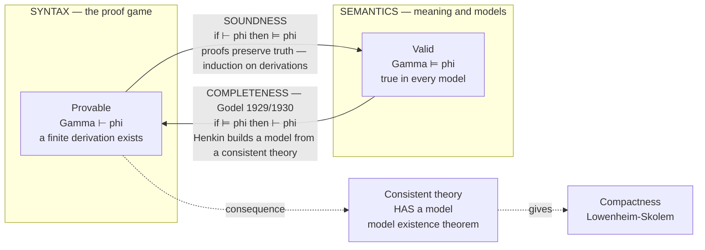

# 🪢 Soundness and Completeness

> [!abstract] TL;DR
> A logic lives a double life. On one side sits **provability** (`⊢`) — a mechanical game of pushing symbols around according to inference rules, with no notion of "meaning." On the other sits **validity** (`⊨`) — a formula being *true in every model*, a purely semantic notion. **Soundness** says the proof game never lies: *if `⊢ φ` then `⊨ φ`* (everything provable is true). **Completeness** says the proof game misses nothing: *if `⊨ φ` then `⊢ φ`* (everything true in all models is provable). **Gödel's Completeness Theorem (1929/1930)** proves the completeness direction for first-order logic, and together with the easy soundness half yields the astonishing equation **`⊢ = ⊨`** — for first-order logic, syntax *exactly* captures semantics. Its load-bearing corollary: **a first-order theory is consistent if and only if it has a model.**

---

## Intuition

**Analogy — two clerks who must agree.** Imagine a courthouse with two clerks who never talk to each other. The first clerk, *Prova*, only knows the **rulebook**: she stamps a statement "CERTIFIED" if and only if she can build a finite chain of rule-applications ending in it. She has no idea what any statement *means* — she just matches patterns and stacks rubber stamps. The second clerk, *Vera*, only knows **the world**: she surveys every conceivable situation (every model) and marks a statement "TRUE-EVERYWHERE" if it holds in all of them. She never touches the rulebook.

Now the deep question: **do the two piles match?**

- **Soundness** is the promise that Prova is *trustworthy*: every statement she stamps CERTIFIED is genuinely TRUE-EVERYWHERE. She never certifies a falsehood. If she could, the whole formal method would be worthless — you could "prove" nonsense.
- **Completeness** is the promise that Prova is *thorough*: every statement Vera marks TRUE-EVERYWHERE, Prova can eventually certify from the rulebook alone. Nothing that is universally true escapes the reach of formal proof.

Gödel's 1929/1930 theorem is the stunning discovery that for first-order logic **the two piles are identical**. The blind symbol-shuffling of the rulebook reaches *exactly* as far as the semantic notion of truth-in-all-models — no further (soundness), and no less (completeness). Formal proof is neither too weak nor too strong; it is a perfect proxy for logical truth.

---

## How It Works

### Core Mechanics

1. **Two arrows, two theorems.** Fix a first-order proof calculus (Hilbert-style, natural deduction, or sequent calculus — all equivalent). Write `Γ ⊢ φ` for "there is a finite derivation of `φ` from assumptions `Γ`" and `Γ ⊨ φ` for "every model of `Γ` also satisfies `φ`." The two theorems are the two directions of one equivalence.

2. **Soundness (`⊢ ⟹ ⊨`) — the easy direction.** Proved by **induction on the length of the derivation**. The axioms are checked to be valid; each inference rule (e.g. modus ponens, `∀`-introduction) is checked to *preserve* truth in any model. Since every step preserves truth and we start from truths, the conclusion is true in every model. Soundness is what makes proof *worth doing* — it guarantees you can never derive a falsehood.

3. **Completeness (`⊨ ⟹ ⊢`) — Gödel's theorem.** The hard direction. It is proved in **contrapositive, consistency-first form**: *every consistent theory has a model* (the **Model Existence Theorem**). Equivalently, if `Γ ⊬ φ` then `Γ ∪ {¬φ}` is consistent, so it has a model — a model of `Γ` where `φ` fails, i.e. `Γ ⊭ φ`. Contrapositive gives `Γ ⊨ φ ⟹ Γ ⊢ φ`.

4. **The modern Henkin construction (1949).** Leon Henkin's proof builds the required model *out of the syntax itself*:
   - Extend the consistent theory to a **maximal consistent set** `T*` (every sentence or its negation is in it) that additionally has **witnesses**: for each `∃x φ(x)` in `T*`, a fresh constant `c` with `φ(c) ∈ T*` (a "Henkin witness").
   - Build the **term model** whose domain is the closed terms (modulo provable equality). Interpret each predicate exactly as `T*` dictates.
   - Prove the **Truth Lemma**: a sentence is *true in this term model* iff it is *a member of `T*`*. Hence `T*` — and the original theory — has a model. Consistency has been turned into existence.

5. **The equation `⊢ = ⊨`.** Combining both directions: for first-order logic, *provable* and *valid* name the very same set of sentences. This is the sense in which first-order logic is **"complete"** — its proof system captures its entire semantics.

6. **Corollaries that fall out for free.** Because provability uses only **finite** derivations, `Γ ⊨ φ` implies `Γ₀ ⊨ φ` for some *finite* `Γ₀ ⊆ Γ` — that is **Compactness**. The Henkin term model is built from countably many terms, giving the **Löwenheim–Skolem** theorem (a satisfiable countable theory has a countable model). Both are downstream of completeness — the siblings *Compactness_and_Lowenheim_Skolem* develop them in full.

7. **Effective enumerability.** Proofs are finite objects over a finite alphabet, so they can be **mechanically enumerated**. Completeness therefore makes the set of first-order theorems **recursively enumerable / semi-decidable**: a machine can list all valid formulas, halting-and-accepting on any valid `φ`, but validity is *not decidable* in general (Church–Turing). You can always confirm a *yes*, never guarantee a *no*.

### Flow / Architecture



---

## Key Concepts

### Secondary (intuitive)
- **Provable vs true.** "Provable" = you can reach it by following the rules. "True" = it actually holds in every possible world. These *sound* like the same thing but are defined completely differently.
- **Soundness = the rules don't lie.** If you followed valid rules from valid starting points, your conclusion cannot be false.
- **Completeness = the rules don't run out.** Anything that is genuinely always-true can be reached by the rules; no universal truth is beyond formal proof.

### Undergraduate (formal)
- **`⊨` (semantic entailment).** `Γ ⊨ φ` iff every model (structure + variable assignment) satisfying all of `Γ` also satisfies `φ`. `⊨ φ` (with empty `Γ`) means `φ` is **valid** — a logical truth.
- **`⊢` (syntactic derivability).** `Γ ⊢ φ` iff there is a finite proof of `φ` from `Γ` in a fixed calculus. Choice of calculus (Hilbert / natural deduction / sequent) does not change the set of theorems.
- **Soundness Theorem.** `Γ ⊢ φ ⟹ Γ ⊨ φ`, proved by induction on derivation structure.
- **Gödel Completeness Theorem.** `Γ ⊨ φ ⟹ Γ ⊢ φ`. Equivalent form: **every consistent set of sentences has a model** (Model Existence).
- **Corollaries.** Compactness (finite subsets suffice) and Löwenheim–Skolem (countable models exist) are immediate consequences.

### Graduate (deep)
- **Henkin construction.** Maximal consistent extension with witnessing constants (a **Henkin theory**) → **term model** over closed terms modulo `≈` → **Truth Lemma** (`𝔐 ⊨ σ ⟺ σ ∈ T*`). Consistency is converted into existence syntactically, avoiding any appeal to the excluded middle over models.
- **Semi-decidability.** The theorem makes `{φ : ⊨ φ}` recursively enumerable; combined with Church's theorem, first-order validity is `Σ₁`-complete — semi-decidable but undecidable. Proof search is a real algorithm that need not terminate.
- **Completeness of the LOGIC vs completeness of a THEORY.** The theorem says the *logic* is complete (proof rules exhaust semantic consequence). It says **nothing** about any particular theory being able to decide every sentence in its own language — that is the province of Gödel's *Incompleteness* theorems (see *Godels_Incompleteness_Theorems*), an entirely different result.
- **First-order only.** Under standard (full) semantics, **second-order logic has no sound and complete effective proof system** (a corollary of incompleteness). The clean `⊢ = ⊨` equation is a special privilege of *first-order* logic — a central theme of the sibling *Second_Order_and_Higher_Order_Logic*.

---

## Python Demo

For **propositional logic** the whole picture is *fully checkable by machine*, so we can watch soundness and completeness happen. We build two genuinely independent worlds and confirm they coincide:

- **Semantics (`⊨`)** — a formula is **valid** (a tautology) iff its truth table is all-true. Pure model checking.
- **Syntax (`⊢`)** — a formula is **provable** iff the mechanical **resolution** rule refutes its negation (derives the empty clause). Resolution never consults a truth table; it only combines clauses.

Then we verify empirically that **provable ⟹ valid** (soundness) and **valid ⟹ provable** (completeness), i.e. the provable-set equals the valid-set.

```python
# Soundness & completeness for PROPOSITIONAL logic (the fully checkable case).
# Semantics (⊨): truth tables.   Syntax (⊢): resolution refutation of ¬φ.
# We confirm empirically that provable-set == valid-set, i.e. ⊢ = ⊨.
import numpy as np
import matplotlib.pyplot as plt
import itertools, random

# Formula = nested tuples:
# ('var',name) | ('not',f) | ('and',f,g) | ('or',f,g) | ('imp',f,g)

def variables(f):
    if f[0] == 'var': return {f[1]}
    if f[0] == 'not': return variables(f[1])
    return variables(f[1]) | variables(f[2])

# ---------- SEMANTIC world: ⊨  (truth tables) ----------
def evaluate(f, a):
    t = f[0]
    if t == 'var': return a[f[1]]
    if t == 'not': return not evaluate(f[1], a)
    if t == 'and': return evaluate(f[1], a) and evaluate(f[2], a)
    if t == 'or':  return evaluate(f[1], a) or  evaluate(f[2], a)
    if t == 'imp': return (not evaluate(f[1], a)) or evaluate(f[2], a)

def is_valid(f):
    "⊨ f : true under EVERY truth assignment (a tautology)."
    vs = sorted(variables(f))
    for bits in itertools.product([False, True], repeat=len(vs)):
        if not evaluate(f, dict(zip(vs, bits))):
            return False
    return True

# ---------- SYNTACTIC world: ⊢  (CNF + resolution, pure symbol pushing) ----------
def elim_imp(f):
    if f[0] == 'var': return f
    if f[0] == 'not': return ('not', elim_imp(f[1]))
    if f[0] == 'imp': return ('or', ('not', elim_imp(f[1])), elim_imp(f[2]))
    return (f[0], elim_imp(f[1]), elim_imp(f[2]))

def to_nnf(f):                                    # push negations inward (De Morgan)
    if f[0] == 'var': return f
    if f[0] in ('and', 'or'): return (f[0], to_nnf(f[1]), to_nnf(f[2]))
    g = f[1]                                       # f is ('not', g)
    if g[0] == 'var': return f
    if g[0] == 'not': return to_nnf(g[1])
    if g[0] == 'and': return ('or',  to_nnf(('not', g[1])), to_nnf(('not', g[2])))
    if g[0] == 'or':  return ('and', to_nnf(('not', g[1])), to_nnf(('not', g[2])))

def distribute(f):                                # distribute OR over AND -> CNF
    if f[0] in ('var', 'not'): return f
    if f[0] == 'and': return ('and', distribute(f[1]), distribute(f[2]))
    a, b = distribute(f[1]), distribute(f[2])      # f is ('or', ...)
    if a[0] == 'and': return ('and', distribute(('or', a[1], b)), distribute(('or', a[2], b)))
    if b[0] == 'and': return ('and', distribute(('or', a, b[1])), distribute(('or', a, b[2])))
    return ('or', a, b)

def to_clauses(f):                                 # CNF tree -> set of clauses
    def lits(g):
        if g[0] == 'or':  return lits(g[1]) | lits(g[2])
        if g[0] == 'not': return {(g[1][1], False)}
        return {(g[1], True)}
    def conj(g):
        if g[0] == 'and': return conj(g[1]) | conj(g[2])
        return {frozenset(lits(g))}
    return conj(distribute(to_nnf(elim_imp(f))))

def resolution_refutes(clauses):
    "Refutation-complete syntactic rule: derive empty clause => unsatisfiable."
    clauses = {c for c in clauses if not any((n, not s) in c for (n, s) in c)}
    while True:
        new = set()
        cl = list(clauses)
        for i in range(len(cl)):
            for j in range(i + 1, len(cl)):
                for (n, s) in cl[i]:
                    if (n, not s) in cl[j]:
                        r = (cl[i] - {(n, s)}) | (cl[j] - {(n, not s)})
                        if any((m, not b) in r for (m, b) in r):
                            continue                # tautological resolvent, skip
                        if len(r) == 0:
                            return True             # empty clause derived!
                        new.add(frozenset(r))
        if new <= clauses:
            return False
        clauses |= new

def is_provable(f):
    "⊢ f : resolution refutes ¬f (a purely syntactic derivation)."
    return resolution_refutes(to_clauses(('not', f)))

# ---------- generate a sample of formulas and compare the two worlds ----------
VARS = ['p', 'q', 'r']
def rand_formula(depth, rng):
    if depth == 0 or rng.random() < 0.30:
        return ('var', rng.choice(VARS))
    op = rng.choice(['not', 'and', 'or', 'imp'])
    if op == 'not':
        return ('not', rand_formula(depth - 1, rng))
    return (op, rand_formula(depth - 1, rng), rand_formula(depth - 1, rng))

rng = random.Random(7)
formulas = [rand_formula(4, rng) for _ in range(400)]
p, q = ('var', 'p'), ('var', 'q')
formulas += [
    ('or', p, ('not', p)),                          # excluded middle  -> valid
    ('imp', p, p),                                  # identity         -> valid
    ('imp', ('and', p, ('imp', p, q)), q),          # modus ponens     -> valid
    ('imp', p, q),                                  # material cond.   -> NOT valid
    ('and', p, ('not', p)),                         # contradiction    -> NOT valid
]

valid    = np.array([is_valid(f)    for f in formulas])
provable = np.array([is_provable(f) for f in formulas])

cm = np.zeros((2, 2), dtype=int)                    # rows=provable, cols=valid
for pv, vl in zip(provable, valid):
    cm[int(pv), int(vl)] += 1

sound_violations    = int(np.sum(provable & ~valid))   # provable but NOT valid
complete_violations = int(np.sum(valid & ~provable))   # valid but NOT provable
print("formulas tested        :", len(formulas))
print("valid    (⊨) count     :", int(valid.sum()))
print("provable (⊢) count     :", int(provable.sum()))
print("SOUNDNESS violations   :", sound_violations, "(provable & not valid)")
print("COMPLETENESS violations:", complete_violations, "(valid & not provable)")
print("⊢ == ⊨ on this sample  :", np.array_equal(valid, provable))

# ---------- visualize the syntax<->semantics correspondence ----------
fig, ax = plt.subplots(1, 2, figsize=(12, 5))

ax[0].imshow(cm, cmap='Greens')
ax[0].set_xticks([0, 1]); ax[0].set_xticklabels(['not valid', 'valid  ⊨'])
ax[0].set_yticks([0, 1]); ax[0].set_yticklabels(['not provable', 'provable  ⊢'])
ax[0].set_xlabel('SEMANTICS'); ax[0].set_ylabel('SYNTAX')
ax[0].set_title('⊢  vs  ⊨   correspondence\noff-diagonal = 0  =>  soundness + completeness')
for i in range(2):
    for j in range(2):
        ax[0].text(j, i, cm[i, j], ha='center', va='center',
                   fontsize=18, fontweight='bold',
                   color='black' if cm[i, j] < cm.max() * 0.6 else 'white')

labels = ['valid (⊨)', 'provable (⊢)', 'soundness\nviolations', 'completeness\nviolations']
vals   = [int(valid.sum()), int(provable.sum()), sound_violations, complete_violations]
ax[1].bar(labels, vals, color=['#2563eb', '#7c3aed', '#dc2626', '#dc2626'])
ax[1].set_title('Propositional logic:  provable-set  =  valid-set')
ax[1].set_ylabel('number of formulas')
for i, v in enumerate(vals):
    ax[1].text(i, v + max(vals) * 0.01 + 0.5, str(v), ha='center', fontweight='bold')

plt.tight_layout()
plt.savefig('soundness_completeness.png', dpi=120)
plt.show()
```

The two off-diagonal cells come out **zero**: no formula is provable-yet-invalid (soundness holds) and none is valid-yet-unprovable (completeness holds). The provable pile and the valid pile are literally the same pile — a hands-on view of `⊢ = ⊨`. (Resolution is a *syntactic* rule; that it matches the truth tables is exactly the soundness+completeness theorem for resolution.)

---

## Real-World Applications

> **Example — automated theorem provers and SAT/SMT solvers.** Provers such as **E**, **Vampire**, and **Z3** *are* the completeness theorem made executable. Because first-order theoremhood is recursively enumerable, these tools implement **resolution** and **superposition** search: they systematically enumerate derivations and are *refutation-complete* — if a formula is valid, the search is guaranteed to find a proof (given enough time), and *soundness* guarantees every proof they emit is genuinely valid. SMT solvers underpin program verification (Dafny, Boogie), symbolic execution, and constraint solving in industry.

- **Logic programming (Prolog).** SLD-resolution is a sound and (for the relevant fragment) complete strategy; Prolog's operational semantics is trustworthy precisely because of soundness, and answers-exist-iff-derivable rests on completeness.
- **Proof assistants (Coq, Isabelle, Lean).** Every trusted kernel implements a *sound* calculus, so a machine-checked proof cannot certify a false theorem — the guarantee that makes formal verification of compilers (CompCert) and crypto protocols credible.
- **Database query languages.** The relational calculus is a first-order language; `⊨` (a query's answer over all matching databases) is what a query optimizer must preserve when it rewrites a plan into a provably equivalent one.
- **Semantic web / knowledge representation.** Description logics are decidable fragments of FOL chosen precisely so that the semi-decidable `⊢ = ⊨` of full FOL becomes a *terminating* decision procedure.

---

## Common Pitfalls

- **Confusing Gödel's COMPLETENESS theorem with his INCOMPLETENESS theorems.** These are opposite-sounding results and are constantly conflated. *Completeness* (1929/1930) says the first-order **logic** is complete: proof captures all logical validity. *Incompleteness* (1931) says any sufficiently strong, consistent, effectively axiomatized **theory** (like Peano arithmetic) has *true* sentences it cannot prove. One is about the reach of the logic; the other about the limits of specific theories — see *Godels_Incompleteness_Theorems*. No contradiction: incompleteness is about `T ⊢`, completeness about `⊨ ⟹ ⊢` for the logic.
- **"Complete logic" vs "complete theory."** A *logic* is complete when `⊨ ⟹ ⊢`. A *theory* is (negation-)complete when it decides every sentence: for each `σ`, either `T ⊢ σ` or `T ⊢ ¬σ`. First-order logic is complete; arithmetic is *not* a complete theory. Same word, different subject.
- **Assuming completeness lifts to second-order logic.** It does not. Under standard semantics, **second-order logic has no sound and complete effective proof system** — the tidy `⊢ = ⊨` is a first-order privilege. Extending expressive power costs you completeness (*Second_Order_and_Higher_Order_Logic*).
- **Reading "enumerable" as "decidable."** Completeness makes validity *semi-decidable* (a proof-search machine halts and accepts on valid inputs), **not** decidable. By Church–Turing, no algorithm decides first-order validity in general — on invalid inputs the search may run forever (see *Decidability_and_Recognizability* and the halting phenomenon).
- **Thinking soundness is the "hard" theorem.** Soundness is a routine induction on derivations. *Completeness* is the deep, non-constructive-flavored result requiring the Henkin (or original Gödel) model construction.

---

## Related Concepts

- [[Predicate_Logic_and_Quantifiers]] — first-order logic is the object language whose `⊢` and `⊨` the completeness theorem equates; the natural home of the result.
- [[Propositional_Logic]] — the fully checkable case demonstrated in the Python section, where soundness and completeness can be verified exhaustively by truth tables.
- [[Proof_Theory_and_Natural_Deduction]] — supplies the `⊢` side: the concrete inference calculi whose derivations soundness reasons over by induction.
- [[Mathematical_Proof_Strategies]] — soundness is proved by induction on derivations; the Henkin argument uses contraposition (consistent ⟹ has a model) — proof techniques cataloged there.
- [[Truth_Theories_and_Metalogic]] — the metalogical vantage point; Tarskian truth-in-a-model is the semantics `⊨` that completeness shows syntax captures.
- [[Philosophy_of_Logic]] — the philosophical significance of syntax perfectly matching semantics, and why second-order logic's failure matters.
- [[Mathematical_Logic_and_Set_Theory]] — situates completeness within the broader foundations, and sharply contrasts it with the incompleteness theorems.
- [[Decidability_and_Recognizability]] — completeness makes first-order theoremhood recursively enumerable / semi-decidable; the recursive-vs-r.e. gap is exactly why validity is undecidable.
- [[Turing_Machines_and_the_Church_Turing_Thesis]] — the model of computation behind "effectively enumerable proofs" and the Church–Turing undecidability of first-order validity.
- [[The_Halting_Problem_and_Undecidability]] — the reason semi-decidable does not upgrade to decidable: proof search need not halt on invalid inputs.

---

## Review Questions

**Secondary.** In plain words, what does *soundness* promise and what does *completeness* promise? Why would a proof system that is sound but *not* complete still be useful, and why would one that is complete but *not* sound be dangerous?

**Undergraduate.** State the Soundness and Completeness theorems using `⊢` and `⊨`. Explain why soundness is proved by induction on derivations. Then explain the equivalent "model existence" phrasing of completeness: *every consistent theory has a model.* Show how, from this, `Γ ⊨ φ ⟹ Γ ⊢ φ` follows by contraposition.

**Graduate.** Sketch the Henkin construction: how do maximal consistent sets and Henkin witnesses give rise to a term model, and what does the Truth Lemma establish? Using finiteness of proofs, derive Compactness as a corollary. Finally, explain precisely why Gödel's *Completeness* theorem does not conflict with his *Incompleteness* theorems, and why second-order logic under standard semantics has no analogous completeness theorem.

---

## Sources

- Gödel, K. (1930). *Die Vollständigkeit der Axiome des logischen Funktionenkalküls* (The completeness of the axioms of the functional calculus of logic). Monatshefte für Mathematik und Physik 37. — the original completeness theorem, from Gödel's 1929 dissertation.
- Henkin, L. (1949). [*The completeness of the first-order functional calculus*](https://www.jstor.org/stable/2266953). Journal of Symbolic Logic 14(3), 159–166. — the modern maximal-consistent-set / term-model proof.
- Enderton, H. B. (2001). *A Mathematical Introduction to Logic* (2nd ed.), Ch. 2. Academic Press. — textbook development of soundness, completeness, compactness, and Löwenheim–Skolem.
- van Dalen, D. (2013). *Logic and Structure* (5th ed.), Ch. 3–4. Springer. — clean natural-deduction-based Henkin completeness proof.
- Zalta, E. N. (ed.). [*Kurt Gödel*](https://plato.stanford.edu/entries/goedel/), Stanford Encyclopedia of Philosophy. — historical and conceptual overview distinguishing completeness from incompleteness.

---

#mathematical-logic #completeness-theorem #soundness #godel #model-theory
