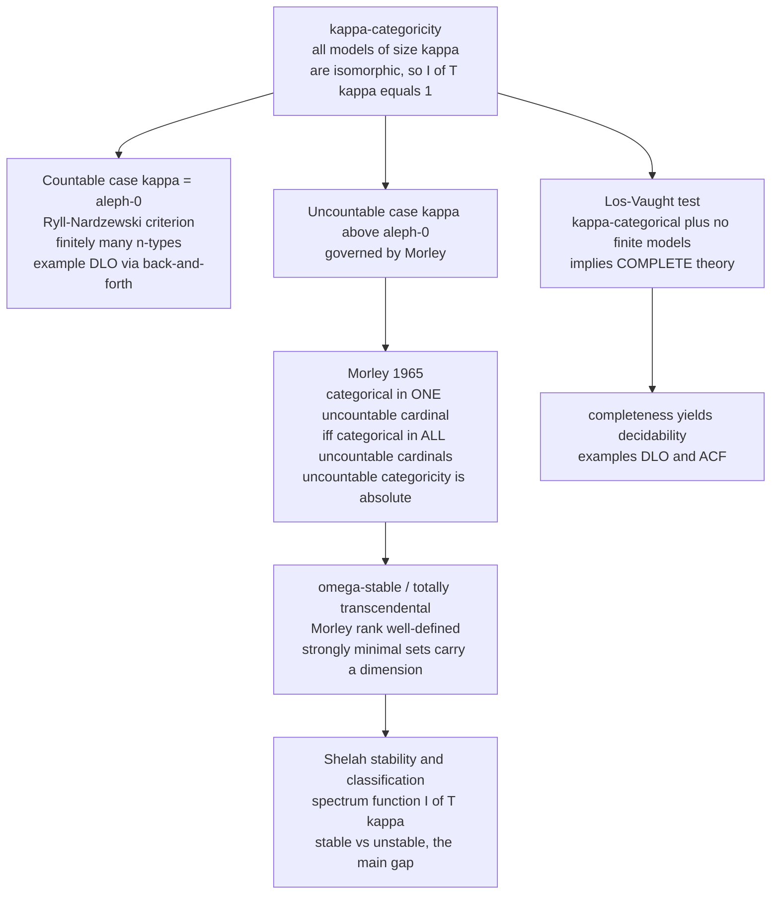

# 🎯 Categoricity and Morley's Theorem

> [!abstract] TL;DR
> A theory is **κ-categorical** if *all* its models of cardinality κ are isomorphic — uniqueness of structure at a fixed size. The countable case is tame and well-understood (Cantor: dense linear orders without endpoints are ℵ₀-categorical via **back-and-forth**; Ryll-Nardzewski: ℵ₀-categoricity means "finitely many types in each variable"). The uncountable case is governed by **Morley's Categoricity Theorem (1965)**: a countable theory categorical in *one* uncountable cardinal is categorical in *every* uncountable cardinal. That single rigidity result — "uncountable categoricity is absolute" — launched **stability theory** and Shelah's classification program, the deep structure theory of first-order theories.

---

## Intuition

**Analogy — the blueprint that fixes the building once you fix the footprint.** The Löwenheim–Skolem theorem already told us something humbling: a first-order theory can never pin down the *size* of its models — any infinite theory has models of every infinite cardinality (see *Compactness_and_Lowenheim_Skolem* in this vault). Size slips through the fingers of first-order logic. So we lower our ambition and ask a smaller question: *once we fix the size, does the theory at least pin down the structure uniquely?* Sometimes the answer is a resounding **yes** — every two models of that exact size turn out to be secretly the *same* structure wearing different labels. We call such a theory **categorical in that cardinality**. It is the difference between a blueprint that merely says "a house" (many houses fit) and one that says "the house, up to relabelling the bricks, once you fix the footprint."

Here is the twist that makes this a *theorem* and not just a definition. You might expect categoricity to be a fragile, size-by-size accident — categorical at some cardinals, not at others, with no pattern. **Morley proved the opposite for uncountable sizes: uniqueness is contagious.** If a countable theory is categorical in even *one* uncountable cardinal, it is *automatically* categorical in *all* of them at once. Rigidity at a single uncountable size forces rigidity everywhere above the countable. That astonishing "all or nothing" was the launchpad of modern model theory — the moment logicians realized that *how many models a theory has* is not chaos but a deep invariant you can classify.

---

## How It Works

### Core Mechanics

1. **The definition.** Let $T$ be a complete first-order theory in a countable language and let $\kappa$ be an infinite cardinal. $T$ is **$\kappa$-categorical** if any two models of $T$ of cardinality $\kappa$ are isomorphic. Write $I(T,\kappa)$ for the number of models of $T$ of size $\kappa$ up to isomorphism (the **spectrum function**); $\kappa$-categorical means $I(T,\kappa)=1$.

2. **The countable case is special and fully understood.** ℵ₀-categoricity has *two* clean characterizations:
   - **Cantor's back-and-forth (a sufficient example).** The theory **DLO** — dense linear orders without endpoints — is ℵ₀-categorical: *any* two countable dense linear orders without endpoints are isomorphic. The proof builds the isomorphism incrementally, alternately matching the next element of one order ("forth") and the next of the other ("back"), using density to always find room for the next witness. $(\mathbb{Q},<)$ is *the* countable dense order up to isomorphism.
   - **Ryll-Nardzewski theorem (the exact characterization).** A complete theory $T$ with infinite models is ℵ₀-categorical **iff** for every $n$ there are only *finitely many* complete $n$-types over the empty set (equivalently, the automorphism group of the countable model is *oligomorphic*). Finitely many "kinds of tuples" is the essence of countable uniqueness. (Types are developed in *Types_Omitting_and_Saturation*.)

3. **Categorical implies complete — the Łoś–Vaught test.** If a theory $T$ has no finite models and is $\kappa$-categorical for *some* $\kappa \ge$ the size of its language, then $T$ is **complete**. Reason: if $T$ were incomplete, two models would disagree on a sentence $\varphi$; by Löwenheim–Skolem pull both down (or up) to size $\kappa$, giving *non-isomorphic* models of size $\kappa$ (they disagree on $\varphi$), contradicting categoricity. This is a workhorse tool for proving completeness and hence **decidability** — it is how one shows DLO and the theory of **algebraically closed fields** are complete without exhibiting a proof procedure.

4. **The uncountable case — Morley's Categoricity Theorem (1965).** For a *countable* complete theory $T$:
$$T \text{ is } \kappa\text{-categorical for some uncountable } \kappa \iff T \text{ is } \kappa\text{-categorical for } \textbf{every} \text{ uncountable } \kappa.$$
   Uncountable categoricity is "absolute" — it cannot happen at one uncountable cardinal and fail at another. Crucially, this says **nothing** about ℵ₀: a theory can be uncountably categorical yet have many countable models (algebraically closed fields of characteristic 0 are the standard witness — one countable model per transcendence degree $0,1,2,\dots,\aleph_0$, so $I(\aleph_0)=\aleph_0$, yet $I(\kappa)=1$ for every uncountable $\kappa$).

5. **The machinery Morley invented — ω-stability and Morley rank.** To prove the theorem Morley showed uncountably categorical theories are **ω-stable** (a.k.a. *totally transcendental*): the space of types stays small over every parameter set. He defined **Morley rank**, an ordinal-valued dimension on definable sets generalizing Zariski dimension. Rank-1 irreducible ("**strongly minimal**") sets carry a *pregeometry* (a dimension theory like linear or algebraic independence), and models of an uncountably categorical theory are controlled by a single such dimension — which is exactly why fixing the cardinality fixes the model.

6. **The legacy — Shelah's stability and classification theory.** Morley's rank and the tameness it revealed grew into **stability theory**: the **stable/unstable dichotomy**, the classification of theories by their spectrum function $I(T,\kappa)$, and Shelah's **main gap** — a theorem that a theory's number of models is *either* as small as possible *or* as large as possible, with nothing in between. The model-theoretic "taming" of algebraic structures (ACF, differentially closed fields, groups of finite Morley rank) all descends from this line.

### Flow / Architecture



*The single fault line is countable vs uncountable. The countable side is characterized exactly by Ryll-Nardzewski; the uncountable side is governed by Morley's rigidity. The Łoś–Vaught test is the shortcut from categoricity to completeness, and Morley's rank machinery is the seed of the whole classification program.*

---

## Key Concepts

### Secondary (intuitive, no advanced background needed)

- **Isomorphic structures** — "the same shape, different labels." Two structures are isomorphic if you can relabel the elements of one to get exactly the other, preserving every relation and operation.
- **Categorical in a size** — a theory whose rulebook is so tight that once you fix how *many* elements a model has, there is only *one* possible model up to relabelling.
- **The rationals are "the" countable dense order** — any two number lines that are countable, have no biggest or smallest point, and always have a point between any two points, are secretly the same order.
- **Uniqueness is not automatic** — many theories have *several* genuinely different models of the same size (different "shapes" fitting the same rulebook and the same size).

### Undergraduate (a first course in logic / algebra)

- **$\kappa$-categoricity** — $I(T,\kappa)=1$: all models of $T$ of cardinality $\kappa$ are isomorphic.
- **DLO and back-and-forth** — the theory of dense linear orders without endpoints; **Cantor's theorem** proves ℵ₀-categoricity by constructing an isomorphism between two countable models one witness at a time, alternating "forth" (extend the domain) and "back" (extend the range).
- **Łoś–Vaught test** — $\kappa$-categorical + no finite models $\Rightarrow$ **complete** (and often decidable). The standard way to prove DLO and ACF complete.
- **Elementary equivalence vs isomorphism** — categoricity is about *isomorphism* at a fixed size; distinct-but-elementarily-equivalent models are the phenomenon it rules out (see *Elementary_Equivalence_and_Embeddings*).
- **Algebraically closed fields (ACF)** — the flagship uncountably categorical theory: a countable model per transcendence degree, but exactly one model of each uncountable size (dimension = transcendence degree fixes it).

### Graduate (model theory proper)

- **Ryll-Nardzewski theorem** — ℵ₀-categorical iff finitely many complete $n$-types over $\varnothing$ for every $n$ iff the automorphism group of the countable model is oligomorphic (finitely many orbits on $n$-tuples).
- **Morley's Categoricity Theorem** — for countable $T$, categorical in one uncountable cardinal iff in all; the birth of modern model theory.
- **ω-stability / total transcendence** — the type spaces $S_n(A)$ are countable over every countable $A$; equivalently every type has an ordinal **Morley rank**.
- **Morley rank and degree** — an ordinal-valued dimension on definable sets; **strongly minimal sets** (rank 1, degree 1) carry a modular or non-modular **pregeometry** (Zilber trichotomy) that coordinatizes uncountably categorical models.
- **Baldwin–Lachlan** — refined Morley: an uncountably categorical theory has either $1$ or $\aleph_0$ countable models (never strictly between), tightly linking $I(\aleph_0)$ to the uncountable behaviour.
- **Shelah's classification theory** — stability spectrum (stable / superstable / ω-stable), forking independence, and the **main gap**: $I(T,\aleph_\alpha)$ is either bounded by a polynomial-in-$\alpha$ tower or hits the maximum $2^{\aleph_\alpha}$.

---

## Python Demo

```python
# Categoricity, made concrete: the two faces of "how many models of a given size?"
#
# (a) BACK-AND-FORTH (Cantor):  DLO -- dense linear orders without endpoints --
#     is aleph-0-CATEGORICAL. We build an explicit order-isomorphism between two
#     DIFFERENT countable dense orders (dyadic rationals vs all rationals in (0,1)),
#     alternately extending the domain ("forth") and the range ("back"). The fact
#     that it always succeeds IS the proof that I(DLO, aleph-0) = 1.
#
# (b) NOT aleph-0-CATEGORICAL:  the theory Th(Z, S) of "a successor bijection with
#     no finite cycles". Its models are disjoint unions of Z-chains; the number of
#     chains is an ISO-INVARIANT the theory cannot pin down first-order. So there are
#     countably MANY non-isomorphic countable models (1, 2, 3, ... , aleph-0 chains),
#     i.e. I(aleph-0) = aleph-0 -- yet like ACF it is categorical in every UNCOUNTABLE
#     size (Morley). We count models and plot the contrasting "spectra".
#
# numpy + matplotlib only.

import math
from fractions import Fraction
import numpy as np
import matplotlib.pyplot as plt

# ======================================================================
# (a) BACK-AND-FORTH between two countable dense linear orders w/o endpoints
# ======================================================================
# A = dyadic rationals in (0,1); enumerated by dyadic level  -> drives "forth"
# B = all rationals    in (0,1); enumerated by denominator    -> drives "back"

def dyadic_enum(levels):
    out = []
    for n in range(1, levels + 1):
        for k in range(1, 2 ** n, 2):          # odd numerators = new dyadics
            out.append(Fraction(k, 2 ** n))
    return out

def rational_enum(maxden):
    out, seen = [], set()
    for q in range(2, maxden + 1):
        for p in range(1, q):
            f = Fraction(p, q)
            if f not in seen:
                seen.add(f); out.append(f)
    return out

def neighbours(M, key, value):
    """Nearest matched pair strictly below / above `value` in coordinate `key` (0=a,1=b)."""
    lows  = [pair for pair in M if pair[key] < value]
    highs = [pair for pair in M if pair[key] > value]
    lo = max(lows,  key=lambda t: t[key]) if lows  else None
    hi = min(highs, key=lambda t: t[key]) if highs else None
    return lo, hi

def rational_between(lo, hi):
    """A rational in the open interval (lo, hi), endpoints clamped to (0,1). Lives in B."""
    lo = Fraction(0) if lo is None else lo
    hi = Fraction(1) if hi is None else hi
    return (lo + hi) / 2                        # midpoint is rational -> in B, always fits

def dyadic_between(lo, hi):
    """A dyadic rational strictly inside (lo, hi), endpoints clamped to (0,1). Lives in A."""
    lo = Fraction(0) if lo is None else lo
    hi = Fraction(1) if hi is None else hi
    n = 1
    while True:                                 # density guarantees termination
        d = Fraction(1, 2 ** n)
        cand = (math.floor(lo / d) + 1) * d
        if lo < cand < hi:
            return cand
        n += 1

Aenum, Benum = dyadic_enum(8), rational_enum(40)
M = []                                          # matched pairs (a in A, b in B)
usedA, usedB = set(), set()
ai = bi = 0
STEPS = 8

for _ in range(STEPS):
    # ---- FORTH: take next a in A, find a matching b in B preserving order ----
    while ai < len(Aenum) and Aenum[ai] in usedA:
        ai += 1
    if ai < len(Aenum):
        a = Aenum[ai]; ai += 1
        lo, hi = neighbours(M, 0, a)
        b = rational_between(lo[1] if lo else None, hi[1] if hi else None)
        M.append((a, b)); usedA.add(a); usedB.add(b)
    # ---- BACK: take next b in B, find a matching a in A preserving order -----
    while bi < len(Benum) and Benum[bi] in usedB:
        bi += 1
    if bi < len(Benum):
        b = Benum[bi]; bi += 1
        lo, hi = neighbours(M, 1, b)
        a = dyadic_between(lo[0] if lo else None, hi[0] if hi else None)
        M.append((a, b)); usedA.add(a); usedB.add(b)

M.sort(key=lambda t: t[0])
print("BACK-AND-FORTH: partial order-isomorphism  A (dyadic) --> B (rational)")
print(f"{'a in A':>10}   {'b in B':>10}")
for a, b in M:
    print(f"{str(a):>10}   {str(b):>10}")

# Verify it really is order-preserving on the pairs built so far:
ok = all((M[i][0] < M[j][0]) == (M[i][1] < M[j][1])
         for i in range(len(M)) for j in range(len(M)))
print(f"\norder-preserving on all {len(M)} pairs? {ok}   "
      f"=> extends to a full isomorphism  =>  I(DLO, aleph-0) = 1")

# ======================================================================
# (b) A theory that is NOT aleph-0-categorical:  Th(Z, S)
# ======================================================================
# A countable model = a disjoint union of k copies of Z, k in {1,2,3,...,aleph_0}.
# The invariant that distinguishes them is the NUMBER OF CHAINS (components of the
# successor graph) -- something first-order logic cannot count, so all are
# elementarily equivalent yet pairwise non-isomorphic.

def z_model(num_chains, window=6):
    """Finite proxy for `num_chains` disjoint Z-chains; returns component labels."""
    return [c for c in range(num_chains) for _ in range(2 * window + 1)]

m1, m2 = z_model(1), z_model(2)
inv = lambda comps: len(set(comps))            # iso-invariant = number of Z-chains
print(f"\nTh(Z,S): model with {inv(m1)} chain vs model with {inv(m2)} chains "
      f"-> invariants {inv(m1)} != {inv(m2)} -> NON-isomorphic")
print("Ranging over 1,2,3,... chains gives countably many countable models: "
      "I(aleph-0) = aleph-0  (yet Morley: categorical in every UNCOUNTABLE size).")

# ---- Spectrum contrast: distinct countable models discoverable up to bound n ----
ns   = np.arange(1, 11)
dlo  = np.ones_like(ns)                         # DLO: always exactly one
zsucc = ns.copy()                              # Th(Z,S): 1,2,...,n chains -> grows

# ======================================================================
# Visualization
# ======================================================================
fig, (ax1, ax2) = plt.subplots(1, 2, figsize=(13, 5))

# (left) the back-and-forth isomorphism as a monotone staircase
xa = np.array([float(a) for a, _ in M])
yb = np.array([float(b) for _, b in M])
order = np.argsort(xa)
ax1.plot(xa[order], yb[order], "-", color="#c0c0c0", zorder=1)
ax1.scatter(xa, yb, c=np.arange(len(M)), cmap="viridis", s=90,
            edgecolor="k", zorder=2)
for idx, (a, b) in enumerate(M):
    ax1.annotate(str(idx), (float(a), float(b)), fontsize=7,
                 textcoords="offset points", xytext=(5, 4))
ax1.plot([0, 1], [0, 1], "k:", lw=0.8)
ax1.set_xlabel("A: dyadic rationals in (0,1)")
ax1.set_ylabel("B: rationals in (0,1)")
ax1.set_title("Back-and-forth isomorphism (Cantor)\n"
              "monotone => order-preserving => DLO is aleph-0-categorical",
              fontsize=10)
ax1.set_xlim(0, 1); ax1.set_ylim(0, 1)

# (right) spectrum contrast: aleph-0-categorical vs not
ax2.plot(ns, dlo,  "o-", color="#4c9be8", lw=2, label="DLO:  I = 1  (flat)")
ax2.plot(ns, zsucc, "s-", color="#e8734c", lw=2,
         label="Th(Z,S):  I grows -> aleph-0")
ax2.set_xlabel("bound n on number of Z-chains considered")
ax2.set_ylabel("distinct non-isomorphic countable models")
ax2.set_title("Model-counting / spectrum at aleph-0\n"
              "flat at 1 = categorical;  growing = NOT categorical",
              fontsize=10)
ax2.legend(fontsize=9, loc="upper left")
ax2.grid(alpha=0.3)

plt.tight_layout()
plt.savefig("categoricity_and_morley.png", dpi=130)
print("\nSaved figure to categoricity_and_morley.png")
```

Running it first prints the explicit back-and-forth table — a growing list of matched pairs `(a in the dyadics, b in the rationals)` — and verifies that the map is order-preserving on every pair built so far. Because density guarantees a witness at each "forth" and "back" step, the construction never gets stuck, and in the limit it is a genuine order-isomorphism: that is Cantor's proof that DLO is ℵ₀-categorical, so $I(\text{DLO},\aleph_0)=1$. The program then exhibits two countable models of $\mathrm{Th}(\mathbb{Z},S)$ with $1$ versus $2$ successor-chains, whose invariants differ, hence they are non-isomorphic — and ranging over $1,2,3,\dots$ chains gives *countably many* countable models, so $I(\aleph_0)=\aleph_0$. The left plot shows the isomorphism as a monotone staircase (order preserved); the right plot contrasts the two spectra: DLO stays flat at $1$ (ℵ₀-categorical) while $\mathrm{Th}(\mathbb{Z},S)$ climbs toward $\aleph_0$ (not ℵ₀-categorical) — even though, by Morley, *both* are categorical in every uncountable cardinal.

---

## Real-World Applications

> **Example — deciding the theory of algebraically closed fields.** The single most consequential application of the Łoś–Vaught test is proving that **ACF$_p$** (algebraically closed fields of fixed characteristic $p$) is **complete**, hence **decidable**. ACF$_p$ is uncountably categorical (transcendence degree is the only invariant, and it equals the cardinality for uncountable models), has no finite models, so Łoś–Vaught delivers completeness immediately — no proof search required. Completeness plus effective axiomatizability gives a *decision procedure*, and via **Tarski's** quantifier elimination it underpins real and complex **algebraic geometry** algorithms, computer-algebra systems, and constraint solvers over $\mathbb{C}$.

Beyond that flagship case:
- **The Ax–Grothendieck theorem** ("an injective polynomial map $\mathbb{C}^n \to \mathbb{C}^n$ is surjective") is proved by a *model-theoretic transfer*: verify it over finite fields, then use completeness/categoricity of ACF to lift the result to $\mathbb{C}$. Categoricity turns a combinatorial fact into a theorem of complex geometry.
- **Zilber's trichotomy and o-minimality** — the strongly-minimal-set dimension theory born from Morley rank matured into **o-minimality**, which Pila and Wilkie used in the proof of the **André–Oort conjecture** in arithmetic geometry. Tameness invented for categoricity became a tool in number theory.
- **Groups of finite Morley rank** — the **Cherlin–Zilber conjecture** (that simple such groups are algebraic groups over algebraically closed fields) is a direct research descendant, importing categoricity-era rank into pure group theory.
- **Database and query theory** — ℵ₀-categoricity and oligomorphic automorphism groups (Ryll-Nardzewski) are exactly the tameness behind **homogeneous structures** used in constraint-satisfaction-problem dichotomies and the theory of the random (Rado) graph.

---

## Common Pitfalls

- **Confusing ℵ₀-categorical with uncountably categorical.** They are *different* and largely independent phenomena. DLO is ℵ₀-categorical but *not* uncountably categorical (it is even unstable). ACF is uncountably categorical but *not* ℵ₀-categorical (many countable models by transcendence degree). **Morley's theorem is a statement about UNCOUNTABLE cardinals only** — it deliberately excludes ℵ₀, which is governed instead by Ryll-Nardzewski.
- **Thinking categoricity is decided cardinal-by-cardinal.** For uncountable cardinals it is *not*: Morley makes uncountable categoricity all-or-nothing. Never say "categorical in $\aleph_1$ but not $\aleph_2$" for a countable theory — that configuration is impossible.
- **Forgetting the "no finite models" clause in Łoś–Vaught.** The test infers completeness from $\kappa$-categoricity *only* when there are no finite models (otherwise a finite model and an infinite one of size $\kappa$ can disagree without contradicting categoricity, since the finite model is not of size $\kappa$). Categoricity in an *infinite* $\kappa$ says nothing about finite models.
- **Assuming categorical $\Rightarrow$ complete needs no hypothesis.** It does: you need $\kappa \ge |\mathcal{L}|$ *and* no finite models. It is the *Łoś–Vaught test* specifically, not a free consequence of the definition.
- **Reading Ryll-Nardzewski as a cardinality condition.** It is a *type-counting* condition — *finitely many complete $n$-types for each $n$* — not a condition on the size of the model. The countable model is fixed to be countable; the content is oligomorphicity of its automorphism group.
- **Mistaking the spectrum function for a curiosity.** $I(T,\kappa)$ is the central object of *classification theory*. Baldwin–Lachlan ($I(\aleph_0)\in\{1,\aleph_0\}$ for uncountably categorical theories) and Shelah's **main gap** show the spectrum is a deep, constrained invariant — the number of models is never arbitrary.

---

## Related Concepts

- [[Mathematical_Logic_Overview]] — the vault entry point; this note deepens its **Model Theory** pillar (structures, satisfaction, elementary equivalence).
- [[Mathematical_Logic_and_Set_Theory]] — supplies the Löwenheim–Skolem and compactness background that makes categoricity the *right* question (first-order logic cannot fix cardinality, so we fix it by hand and ask for uniqueness).
- [[Fields_and_Field_Extensions]] — **algebraically closed fields** are the canonical uncountably-categorical, not-ℵ₀-categorical theory; transcendence degree is the dimension that Morley rank abstracts, and completeness of ACF comes from the Łoś–Vaught test.
- [[Real_Numbers_and_Completeness]] — the density of $\mathbb{Q}$ in the reals is exactly the property the back-and-forth construction exploits; $(\mathbb{Q},<)$ is *the* countable dense order without endpoints.
- [[Set_Theory_and_Relations]] — cardinality, countable vs uncountable, and Cantor's arguments; the notion of "cardinality $\kappa$" and "isomorphism of structures" that categoricity is built on.
- [[Galois_Theory]] — field automorphisms and structure-preserving maps; the algebraic backdrop for ACF and the automorphism-group viewpoint (Ryll-Nardzewski's oligomorphic groups are the model-theoretic analogue).
- [[Propositional_Logic_and_Boolean_Semantics]] — the foundational sibling in this vault where the syntax/semantics and satisfaction machinery underlying "model" is first made precise.

*Siblings in this Model Theory section (in prose until written): Model_Theory_Foundations (satisfaction, definability), Types_Omitting_and_Saturation (the type spaces behind Ryll-Nardzewski and ω-stability), Elementary_Equivalence_and_Embeddings (the equivalence categoricity strengthens to isomorphism), and Compactness_and_Lowenheim_Skolem (why cardinality cannot be fixed by axioms).*

---

## Review Questions

### Secondary

1. Explain in plain language what it means for a theory to be "categorical in a given size." Why is $(\mathbb{Q},<)$ a good picture of "the one countable dense order"?
2. The back-and-forth demo builds a matching between two number lines one point at a time, alternating sides. Why does *density* (always a point between any two) guarantee you never get stuck?
3. Give an everyday example of two things that are "the same up to relabelling" (isomorphic) versus two things that are the same size but genuinely different in structure.

### Undergraduate

1. State the Łoś–Vaught test precisely, including *both* hypotheses. Use it to argue that DLO is complete, and explain where the "no finite models" clause is doing real work.
2. Algebraically closed fields of characteristic 0 have countably many non-isomorphic countable models. What invariant distinguishes them, and why does this *not* contradict Morley's theorem?
3. State the Ryll-Nardzewski theorem. Why is "finitely many $n$-types" a condition about *kinds of tuples* rather than about the size of the model?

### Graduate

1. Prove that an uncountably categorical countable theory is ω-stable is a key lemma in Morley's proof. Sketch why "too many types over some countable set" would let you build two non-isomorphic models of the same uncountable size, breaking categoricity.
2. Explain the role of **strongly minimal sets** and their pregeometry in coordinatizing models of an uncountably categorical theory. How does the dimension of that pregeometry play the role that transcendence degree plays for ACF?
3. Baldwin–Lachlan shows an uncountably categorical theory has $I(\aleph_0)\in\{1,\aleph_0\}$. Discuss how this result links the countable spectrum to the uncountable one, and where it sits relative to Shelah's main-gap dichotomy for the full spectrum function $I(T,\kappa)$.

---

## Sources

- Morley, M. "Categoricity in Power." *Transactions of the American Mathematical Society* 114 (1965): 514–538 — the original theorem that launched modern model theory.
- Vaught, R. L. "Denumerable Models of Complete Theories." In *Infinitistic Methods* (Warsaw, 1961): 303–321 — countable spectra and the Łoś–Vaught test.
- Marker, D. *Model Theory: An Introduction.* Graduate Texts in Mathematics 217, Springer, 2002 — modern textbook treatment of categoricity, Morley rank, and strongly minimal sets.
- Shelah, S. *Classification Theory and the Number of Non-Isomorphic Models*, 2nd ed. North-Holland, 1990 — the founding treatise of stability/classification theory and the main gap.
- Tent, K. and Ziegler, M. *A Course in Model Theory.* Cambridge University Press, 2012 — clean modern development of ω-stability, ranks, and the Baldwin–Lachlan theorem.

---

#mathematical-logic #categoricity #morley-theorem #model-theory #stability-theory
