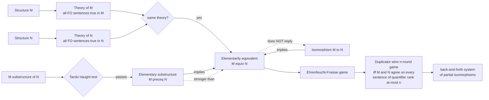

# 🎭 Elementary Equivalence and Embeddings

> [!abstract] TL;DR
> Two structures are **elementarily equivalent** ($M \equiv N$) when they satisfy *exactly the same first-order sentences* — they share a "logical fingerprint" even if they are wildly different sizes. Isomorphism forces equivalence, but **equivalence does not force isomorphism**: the rationals $(\mathbb{Q}, <)$ and the reals $(\mathbb{R}, <)$ obey the same first-order theory of dense linear orders despite one being countable and the other uncountable. The **Ehrenfeucht–Fraïssé game** turns "do they satisfy the same sentences?" into a concrete duel: Spoiler tries to expose a difference in $n$ moves, Duplicator tries to mirror every move as a **partial isomorphism**. Duplicator wins the $n$-round game **iff** the structures agree on every sentence of quantifier rank $\le n$ — a combinatorial handle on an infinite logical question, and the workhorse of inexpressibility proofs in finite model theory.

---

## Intuition

**Analogy — two orchestras that pass every "yes/no" test.** Imagine two orchestras hidden behind a curtain. You may ask any *structural* question phrased in a fixed grammar — "is there a player to the left of every other?", "between any two players is there a third?" — and each orchestra answers yes or no. If **every** question you can phrase gets the same answer from both, then, *as far as your language can tell*, the orchestras are identical — even if one has 40 musicians and the other has a thousand. Your questions simply cannot count high enough or reach far enough to separate them. That indistinguishability is **elementary equivalence**.

Now suppose a skeptic — call her **Spoiler** — insists the orchestras really are different and offers a challenge: she will point at a musician in *one* orchestra, and a defender — **Duplicator** — must instantly point at a "matching" musician in the *other* so that all the relationships pointed at so far line up perfectly (same left-of, same betweenness). They repeat this for $n$ rounds. If Duplicator can always keep the pointed-at musicians in perfect correspondence, the orchestras are indistinguishable by any question of nesting depth $n$. This duel is the **Ehrenfeucht–Fraïssé game**, and its punchline is exact: *Duplicator survives $n$ rounds if and only if no first-order sentence of quantifier rank $\le n$ can tell the two structures apart.* The game converts an infinite quantifier over all sentences into a finite, winnable-or-not board game.

---

## How It Works

### Core Mechanics

**1. Elementary equivalence.** Fix a first-order signature $\sigma$ (relation, function, constant symbols). For a $\sigma$-structure $M$, its **complete theory** is $\mathrm{Th}(M) = \{\varphi : \varphi \text{ a } \sigma\text{-sentence},\ M \models \varphi\}$. Two structures are **elementarily equivalent**, written $M \equiv N$, when $\mathrm{Th}(M) = \mathrm{Th}(N)$ — equivalently, $M \models \varphi \iff N \models \varphi$ for every sentence $\varphi$. Only **sentences** (no free variables) count: the shared fingerprint is about the structures as wholes, not about specific named elements.

**2. Isomorphism $\Rightarrow$ equivalence, but not conversely.** An isomorphism $f : M \to N$ preserves the truth of *every* formula (proof by induction on formula complexity), so $M \cong N \Rightarrow M \equiv N$. The converse fails spectacularly:
- $(\mathbb{Q}, <) \equiv (\mathbb{R}, <)$ — both are models of DLO (dense linear order without endpoints), a *complete* theory, so they satisfy identical first-order sentences. Yet $|\mathbb{Q}| = \aleph_0 \ne 2^{\aleph_0} = |\mathbb{R}|$, so they are **not** isomorphic. First-order logic cannot express "complete" or "uncountable."
- **Nonstandard models of arithmetic.** By the *Compactness theorem* there is a model $\mathbb{N}^* \equiv \mathbb{N}$ (true arithmetic in every first-order detail) that nonetheless contains "infinite" elements larger than every $0,1,2,\dots$. Same theory, radically different structure.
- Different cardinalities are the norm: *Löwenheim–Skolem* guarantees a complete theory with an infinite model has models of every infinite cardinality, all mutually elementarily equivalent.

**3. Embeddings and substructures.** An **embedding** $f : M \hookrightarrow N$ is an injection preserving and reflecting all atomic facts (relations, functions, constants). Its image is a **substructure**. But a substructure can *disagree* with the parent on quantified statements: $(\mathbb{N}, <)$ is a substructure of $(\mathbb{Z}, <)$, yet $\mathbb{N}$ has a least element and $\mathbb{Z}$ does not — the sentence $\exists x\,\forall y\,(x \le y)$ is true below, false above.

**4. Elementary substructure — the strong notion.** $M$ is an **elementary substructure** of $N$, written $M \preceq N$, when $M \subseteq N$ *and* for every formula $\varphi(\bar x)$ and every tuple $\bar a$ **from $M$**, $M \models \varphi(\bar a) \iff N \models \varphi(\bar a)$. This is far stronger than $M \equiv N$: it demands agreement on formulas *with parameters*, not just parameter-free sentences. The **Tarski–Vaught test** makes it checkable: $M \preceq N$ iff for every formula $\varphi(x, \bar a)$ with $\bar a$ from $M$, *whenever $N$ has a witness* ($N \models \exists x\,\varphi(x,\bar a)$) *then $M$ already has one inside $M$*. In slogan form: **no new existential witnesses appear outside $M$ that $M$ cannot already see.**

**5. Elementary embeddings and chains.** An **elementary embedding** $f : M \to N$ satisfies $M \models \varphi(\bar a) \iff N \models \varphi(f\bar a)$ for all formulas — it embeds $M$ as an elementary substructure of its image. Elementary embeddings compose, and the **elementary chain theorem** (Tarski–Vaught) says the union of an increasing chain $M_0 \preceq M_1 \preceq \cdots$ is an elementary extension of every link — the engine behind saturation and union-of-chain constructions.

**6. The Ehrenfeucht–Fraïssé game.** The $n$-round EF game on $(M, N)$: for $n$ rounds, **Spoiler** picks an element in either structure; **Duplicator** answers with an element in the *other* structure. After round $i$ the picks are $a_i \in M$ and $b_i \in N$. **Duplicator wins** iff the final map $a_i \mapsto b_i$ (together with the interpreted constants) is a **partial isomorphism** — it preserves and reflects every atomic relation among the chosen points. The central theorem (below) links a Duplicator win to **quantifier rank** $\mathrm{qr}(\varphi)$, the maximum nesting depth of quantifiers in $\varphi$.

**7. The Ehrenfeucht–Fraïssé theorem.** For relational signatures:
$$
\text{Duplicator has a winning strategy for the } n\text{-round game on } (M,N)
\iff
M \equiv_n N,
$$
where $M \equiv_n N$ means *$M$ and $N$ agree on every sentence of quantifier rank $\le n$* ("$n$-equivalence"). Taking $n \to \infty$: if Duplicator wins the $n$-round game **for every** $n$, then $M \equiv N$. Over a finite relational signature there are only finitely many inequivalent sentences of each quantifier rank, which is what makes the game a *finite* certificate for each rank.

**8. Fraïssé's theorem and back-and-forth.** A **back-and-forth system** is a nonempty family $I$ of partial isomorphisms $M \rightharpoonup N$ closed under extension in both directions: any $p \in I$ can be extended to cover any new element of $M$ (forth) or any new element of $N$ (back). **Fraïssé's theorem**: if such a system exists, then $M \equiv N$; if in addition $M, N$ are countable, then $M \cong N$. A back-and-forth system is exactly a *uniform* Duplicator winning strategy for the *unbounded* game, and it is the classic route to $(\mathbb{Q},<) \cong (\mathbb{R} \cap \text{countable dense}, <)$ and to $(\mathbb{Q},<) \equiv (\mathbb{R},<)$.

**9. The method of diagrams.** The **atomic diagram** $\mathrm{Diag}(M)$ is the set of all atomic and negated-atomic sentences true in $M$ once every element is named by a fresh constant; models of $\mathrm{Diag}(M)$ are exactly structures embedding $M$. The **elementary diagram** $\mathrm{Diag}_{\mathrm{el}}(M)$ adds *all* true formulas with the named constants; its models are exactly the elementary extensions of $M$. This is the bridge from *syntax* (theories) to *maps* (embeddings) and underlies compactness-style constructions.

**10. Why it matters — inexpressibility.** In **finite model theory** and descriptive complexity, EF games are *the* tool to prove that a property is **not first-order definable**. If for every $n$ you can produce a pair $A_n, B_n$ where $A_n$ has the property, $B_n$ does not, yet Duplicator wins the $n$-round game, then no fixed sentence (which has some fixed quantifier rank $n$) can define the property. Canonical result: **graph connectivity is not first-order definable** (play the game on a long cycle vs. two disjoint cycles); likewise **"even cardinality," reachability, and acyclicity** are not FO-definable — precisely the expressiveness gaps that motivate adding fixpoints or counting to query languages.

### Truth-Preservation and the Game



---

## Key Concepts

### Secondary
- **Same answers to every question = "the same" for logic.** Two structures can differ in size yet give identical yes/no answers to every question phrased in the fixed grammar. That is elementary equivalence.
- **A relabelling that never changes any relationship is an isomorphism**, and isomorphic structures always give the same answers — but the reverse can fail (the rationals vs. the reals as ordered lines).
- **The EF duel.** Spoiler points at an element; Duplicator must point at a matching one in the other structure. If Duplicator can survive $n$ rounds keeping every relationship aligned, no question of "depth $n$" can separate the two.

### Undergraduate
- **Definitions.** $M \equiv N$ iff $\mathrm{Th}(M) = \mathrm{Th}(N)$. $M \preceq N$ (elementary substructure) iff $M \subseteq N$ and truth of *every formula with parameters from $M$* agrees. Note $M \preceq N \Rightarrow M \equiv N$, never the converse.
- **Substructure vs. elementary substructure.** $(\mathbb{N},<) \subseteq (\mathbb{Z},<)$ is a substructure but **not** elementary: $\exists x \forall y (x \le y)$ separates them. Use the **Tarski–Vaught test** — $M \preceq N$ iff every existential witness in $N$ over parameters from $M$ can be found already inside $M$.
- **Quantifier rank** $\mathrm{qr}(\varphi)$ = max depth of nested quantifiers; $\mathrm{qr}(\exists x\,\forall y\,R(x,y)) = 2$. $M \equiv_n N$ = agreement on all sentences with $\mathrm{qr} \le n$.
- **EF theorem (the working statement).** Duplicator wins the $n$-round game on $(M,N)$ $\iff$ $M \equiv_n N$. To prove $M \equiv N$, give Duplicator a winning strategy for *every* $n$; to prove inexpressibility, exhibit a family of Duplicator wins between yes-instances and no-instances.
- **Canonical example.** DLO is complete, so all its models — $(\mathbb{Q},<)$, $(\mathbb{R},<)$, any dense endless order — are pairwise elementarily equivalent. The countable ones are isomorphic by back-and-forth (Cantor's theorem).

### Graduate
- **Fraïssé's theorem / back-and-forth systems.** A back-and-forth family of partial isomorphisms witnesses $M \equiv N$; for countable $M,N$ it upgrades to $M \cong N$. This is a *strategy-as-object* reformulation of the unbounded EF game and generalizes to $\omega$-categoricity (Ryll-Nardzewski) — treated in the sibling note *Categoricity_and_Morley_Theorem*.
- **Hanf and Gaifman locality.** Over finite structures of bounded degree, first-order logic is **local**: truth of a rank-$n$ formula depends only on $r$-neighborhoods for $r \le 2^n$. Locality theorems give *systematic* Duplicator strategies (match isomorphic neighborhoods), yielding clean inexpressibility proofs for connectivity, reachability, and parity.
- **Elementary chains and diagrams.** The elementary diagram $\mathrm{Diag}_{\mathrm{el}}(M)$ axiomatizes elementary extensions; combined with *Compactness* it builds elementary embeddings into saturated models — see the sibling *Types_Omitting_and_Saturation* and *Compactness_and_Lowenheim_Skolem*, and the foundations in *Model_Theory_Foundations*.
- **Descriptive complexity.** EF games (and their pebble/bijective variants for finite-variable and counting logics) are the standard lower-bound method: they prove separations such as $\mathrm{FO} \subsetneq \mathrm{FO}(\mathrm{LFP})$ on ordered structures and underlie the study of $\mathrm{FO}^k$, $C^k$, and the Weisfeiler–Leman graph-isomorphism heuristic.
- **Preservation theorems.** Which formula classes travel along which maps: existential formulas are preserved by embeddings (Łoś–Tarski), universal-existential by unions of chains (Chang–Łoś–Suszko). Elementary embeddings preserve *all* formulas by definition — the boundary cases sharpen "which syntax matches which morphism."

---

## Python Demo

We implement the **Ehrenfeucht–Fraïssé game** exactly (Spoiler picks, Duplicator responds, win = partial isomorphism), solve it by game-tree search with memoization, and then:

1. **Verify the EF theorem numerically** against Ehrenfeucht's classical closed form for linear orders — Duplicator wins the $k$-round game on orders of sizes $m,n$ **iff** $m=n$ or both $m,n \ge 2^k - 1$. Since a Duplicator win *is* $k$-equivalence, this is a machine check that "$k$-equivalence" behaves as the theory predicts.
2. **Exhibit the promised phenomenon**: linear orders of length $2^k$ and $2^k - 1$ are **$k$-equivalent** (indistinguishable by any sentence of quantifier rank $\le k$) yet **distinguishable at rank $k+1$**.
3. **Visualize** the game outcome across sizes and the quantifier-rank threshold.

```python
"""
Ehrenfeucht-Fraisse game on finite LINEAR ORDERS.

We compute, by exact game-tree search, whether Duplicator has a winning
strategy in the k-round EF game between orders L_m = {0<1<...<m-1} and L_n.
By the EF theorem, a Duplicator win == "m and n agree on every FO sentence
of quantifier rank <= k" (k-equivalence).  We check this against Ehrenfeucht's
closed form and show 2^k vs 2^k - 1 are k-equivalent but split at rank k+1.
"""

import numpy as np
import matplotlib.pyplot as plt

# ---------------------------------------------------------------------------
# A "position" is a set of chosen pairs (a, b): a in L_m matched to b in L_n.
# It is a PARTIAL ISOMORPHISM iff the order between a-picks mirrors the order
# between the matching b-picks (this also enforces injectivity: equal iff equal).
# ---------------------------------------------------------------------------
def is_partial_iso(pairs):
    pl = list(pairs)
    for i in range(len(pl)):
        ai, bi = pl[i]
        for j in range(len(pl)):
            aj, bj = pl[j]
            if (ai < aj) != (bi < bj):    # order not preserved/reflected
                return False
            if (ai == aj) != (bi == bj):  # equality not preserved/reflected
                return False
    return True


_memo = {}

def duplicator_wins(m, n, pairs, rounds):
    """True iff Duplicator can survive `rounds` more moves from this position."""
    if not is_partial_iso(pairs):
        return False                      # a broken match = Duplicator already lost
    if rounds == 0:
        return True                       # survived all rounds
    key = (m, n, pairs, rounds)
    if key in _memo:
        return _memo[key]

    ok = True
    # Spoiler may move in L_m: for EVERY such move, Duplicator needs SOME reply in L_n.
    for a in range(m):
        if not any(duplicator_wins(m, n, pairs | {(a, b)}, rounds - 1)
                   for b in range(n)):
            ok = False
            break
    # Spoiler may instead move in L_n: symmetric requirement.
    if ok:
        for b in range(n):
            if not any(duplicator_wins(m, n, pairs | {(a, b)}, rounds - 1)
                       for a in range(m)):
                ok = False
                break

    _memo[key] = ok
    return ok


def dup_wins(m, n, k):
    return duplicator_wins(m, n, frozenset(), k)


def ehrenfeucht_formula(m, n, k):
    """Closed form: Duplicator wins k-round game on linear orders m, n."""
    return (m == n) or (m >= 2**k - 1 and n >= 2**k - 1)


# ---------------------------------------------------------------------------
# 1) Machine-check the EF theorem against Ehrenfeucht's closed form.
# ---------------------------------------------------------------------------
mismatch = 0
for k in range(1, 5):
    for m in range(1, 9):
        for n in range(1, 9):
            if dup_wins(m, n, k) != ehrenfeucht_formula(m, n, k):
                mismatch += 1
print("EF game-tree search vs Ehrenfeucht's 2^k - 1 threshold")
print(f"  sizes m,n in 1..8, rounds k in 1..4:  mismatches = {mismatch}")
print("  -> the game solver reproduces k-equivalence exactly" if mismatch == 0
      else "  -> DISAGREEMENT (bug)")

# ---------------------------------------------------------------------------
# 2) The headline: L_{2^k} and L_{2^k - 1} are k-equivalent, split at rank k+1.
# ---------------------------------------------------------------------------
print("\nLinear orders of length 2^k vs 2^k - 1 (same sentences up to quant. rank k?)")
print(f"  {'k':>2} | {'sizes':>11} | wins k rounds | wins k+1 rounds")
for k in range(1, 4):
    big, small = 2**k, 2**k - 1
    wk  = dup_wins(big, small, k)      # k-equivalent
    wk1 = dup_wins(big, small, k + 1)  # distinguishable at rank k+1
    print(f"  {k:>2} | L_{big} vs L_{small:<4} |     {str(wk):^5}     |      {str(wk1):^5}")

# ---------------------------------------------------------------------------
# 3) One explicit game line on L_4 vs L_3 (Duplicator wins the 2-round game).
# ---------------------------------------------------------------------------
def duplicator_reply(m, n, pairs, rounds, side, x):
    """Given Spoiler's pick x on `side` ('M' or 'N'), return a surviving reply."""
    if side == 'M':
        for y in range(n):
            if duplicator_wins(m, n, pairs | {(x, y)}, rounds - 1):
                return y
    else:
        for y in range(m):
            if duplicator_wins(m, n, pairs | {(y, x)}, rounds - 1):
                return y
    return None

print("\nSample 2-round game on L_4 vs L_3 (Duplicator to survive):")
pairs, rounds = frozenset(), 2
for rnd, (side, x) in enumerate([('M', 2), ('M', 0)], start=1):  # Spoiler's line
    y = duplicator_reply(4, 3, pairs, rounds, side, x)
    if side == 'M':
        pairs |= {(x, y)}
        print(f"  round {rnd}: Spoiler picks {x} in L_4  ->  Duplicator picks {y} in L_3")
    else:
        pairs |= {(y, x)}
        print(f"  round {rnd}: Spoiler picks {x} in L_3  ->  Duplicator picks {y} in L_4")
    rounds -= 1
print(f"  final matching {sorted(pairs)} is a partial isomorphism: "
      f"{is_partial_iso(pairs)}  -> Duplicator wins")

# ---------------------------------------------------------------------------
# 4) Visualize.
# ---------------------------------------------------------------------------
fig, (axA, axB) = plt.subplots(1, 2, figsize=(13, 5.2))

# Panel A: who wins the k=2 game across sizes -> the 2^k - 1 = 3 threshold plateau.
K = 2
sizes = range(1, 9)
grid = np.array([[1 if dup_wins(m, n, K) else 0 for n in sizes] for m in sizes])
axA.imshow(grid, origin="lower", extent=[0.5, 8.5, 0.5, 8.5],
           cmap="RdYlGn", vmin=0, vmax=1, aspect="equal")
thr = 2**K - 1
axA.axhline(thr, color="#1e3a8a", ls="--", lw=1.4)
axA.axvline(thr, color="#1e3a8a", ls="--", lw=1.4)
axA.text(8.3, thr + 0.15, f"2^{K} - 1 = {thr}", color="#1e3a8a", ha="right", fontsize=9)
for m in sizes:
    for n in sizes:
        axA.text(n, m, "D" if grid[m-1, n-1] else "S", ha="center", va="center",
                 fontsize=8, color="black")
axA.set_xlabel("size n of order L_n")
axA.set_ylabel("size m of order L_m")
axA.set_title(f"k = {K} EF game outcome\nD = Duplicator wins (m-equiv-n),  S = Spoiler wins")
axA.set_xticks(list(sizes)); axA.set_yticks(list(sizes))

# Panel B: quantifier-rank threshold -- why L_7 vs L_8 split exactly at rank 4.
ks = np.arange(1, 7)
axB.plot(ks, 2.0**ks - 1, "o-", color="#1e3a8a", lw=2,
         label="threshold  2^k - 1  (min size to be k-indistinguishable)")
axB.axhline(7, color="#059669", ls="--", lw=1.4, label="our pair sizes 7 and 8")
axB.axhline(8, color="#059669", ls="--", lw=1.4)
axB.axvspan(0.5, 3.5, color="#86efac", alpha=0.35)
axB.axvspan(3.5, 6.5, color="#fca5a5", alpha=0.35)
axB.text(2.0, 40, "k <= 3\nDuplicator wins\nL_8 equiv_k L_7", ha="center",
         fontsize=9, color="#065f46")
axB.text(5.0, 40, "k >= 4\nSpoiler wins\nrank-4 sentence\nseparates them", ha="center",
         fontsize=9, color="#7f1d1d")
axB.set_yscale("log", base=2)
axB.set_xlabel("number of rounds k  =  quantifier rank")
axB.set_ylabel("linear-order size (log2 scale)")
axB.set_title("L_8 vs L_7: k-equivalent while both sizes clear the 2^k - 1 bar")
axB.set_xlim(0.5, 6.5); axB.legend(loc="lower right", fontsize=8)

fig.suptitle("Ehrenfeucht-Fraisse: a Duplicator win for k rounds "
             "== agreement on all sentences of quantifier rank <= k", fontsize=12)
fig.tight_layout(rect=[0, 0, 1, 0.94])
fig.savefig("ehrenfeucht_fraisse_game.png", dpi=120)
print("\nSaved figure to ehrenfeucht_fraisse_game.png")
```

Expected output:

```
EF game-tree search vs Ehrenfeucht's 2^k - 1 threshold
  sizes m,n in 1..8, rounds k in 1..4:  mismatches = 0
  -> the game solver reproduces k-equivalence exactly

Linear orders of length 2^k vs 2^k - 1 (same sentences up to quant. rank k?)
   k |       sizes | wins k rounds | wins k+1 rounds
   1 | L_2 vs L_1    |     True      |      False
   2 | L_4 vs L_3    |     True      |      False
   3 | L_8 vs L_7    |     True      |      False

Sample 2-round game on L_4 vs L_3 (Duplicator to survive):
  round 1: Spoiler picks 2 in L_4  ->  Duplicator picks 2 in L_3
  round 2: Spoiler picks 0 in L_4  ->  Duplicator picks 0 in L_3
  final matching [(0, 0), (2, 2)] is a partial isomorphism: True  -> Duplicator wins

Saved figure to ehrenfeucht_fraisse_game.png
```

The check `mismatches = 0` is the payoff: an *exact* game-tree search agrees, over the whole tested range, with the claim that a Duplicator win equals $k$-equivalence — and the table shows $L_{2^k}$ and $L_{2^k-1}$ sitting on opposite sides of the rank-$k$/rank-$(k{+}1)$ boundary exactly as Ehrenfeucht's threshold predicts.

---

## Real-World Applications

- **Database query inexpressibility.** Relational calculus is precisely **first-order logic** over the relational model. EF games prove that fundamental queries — *transitive closure* / graph reachability, "is the graph connected," "does the table have an even number of rows" — are **not expressible in plain SQL/relational algebra**, which is exactly why SQL added recursive CTEs (`WITH RECURSIVE`) and why Datalog/fixpoint logics exist. The game is the formal reason your query language needs recursion. See [[Relational_Model]].
- **Descriptive complexity and lower bounds.** In finite model theory, EF games (and pebble, bijective, and counting variants) are the primary tool for separating logics that capture complexity classes — establishing that certain properties are not in $\mathrm{FO}$, $\mathrm{FO}^k$, or $\mathrm{AC}^0$. This connects to circuit lower bounds and the study of $\mathrm{P}$ vs. $\mathrm{NP}$ over ordered structures.
- **Graph isomorphism heuristics.** The **Weisfeiler–Leman** color-refinement algorithm — the combinatorial core of modern graph neural networks — corresponds exactly to Duplicator strategies in the *bijective $k$-pebble* game for counting logic $C^k$. "Two graphs are WL-indistinguishable at dimension $k$" literally means "$C^k$-equivalent," a direct descendant of elementary equivalence bounding what message-passing GNNs can tell apart.
- **Model theory of classical structures.** Elementary equivalence classifies well-understood theories: all algebraically closed fields of a fixed characteristic are elementarily equivalent (they satisfy the same first-order sentences), as are all real-closed fields — the reason first-order statements transfer between $\mathbb{C}$ and other algebraically closed fields, and between $\mathbb{R}$ and the real algebraic numbers.
- **Verification and games.** The Spoiler/Duplicator framing recurs in **bisimulation** for concurrent systems and modal logic: two labelled transition systems satisfy the same modal formulas iff Duplicator wins the bisimulation game — the same "indistinguishability by a logic = a game" pattern that powers model checking.

---

## Common Pitfalls

- **Confusing elementary equivalence with isomorphism.** $M \equiv N$ says "same sentences"; $M \cong N$ says "same up to relabelling." Isomorphism *implies* equivalence, but $(\mathbb{Q},<) \equiv (\mathbb{R},<)$ with different cardinalities shows the converse is false. First-order logic simply cannot pin down a structure up to isomorphism once it is infinite (Löwenheim–Skolem forbids it).
- **Treating a substructure as an elementary substructure.** $(\mathbb{N},<) \subseteq (\mathbb{Z},<)$ preserves atomic order facts but is **not** elementary — quantified truths differ ($\mathbb{N}$ has a least element, $\mathbb{Z}$ does not). Always apply the **Tarski–Vaught test**: elementarity fails the moment an existential witness lives in $N$ but not in $M$.
- **Forgetting parameters in the definition of $\preceq$.** $M \preceq N$ requires agreement on formulas *with parameters drawn from $M$*, which is strictly stronger than $M \equiv N$ (parameter-free sentences only). Two elementarily equivalent structures need not be nested elementarily — indeed need not be nested at all.
- **Assuming embeddings preserve all truth.** A plain embedding preserves *atomic* and (by induction) *existential* formulas but can destroy universal or alternating ones. Only an **elementary embedding** preserves every formula. Confusing "preserves relations" with "preserves theory" is the classic error.
- **Misreading quantifier rank.** Quantifier rank is *nesting depth*, not the *count* of quantifiers: $\exists x\,\exists y\,\exists z\,\varphi$ (unnested block) and a deeply alternating $\exists\forall\exists$ formula can have very different ranks. Since the $n$-round EF game matches rank exactly, miscounting rank invalidates the whole strategy argument.
- **Believing a single Duplicator win proves equivalence.** Duplicator winning the $n$-round game only gives $\equiv_n$. Full elementary equivalence needs a winning strategy for **every** $n$ (or a back-and-forth system); one finite game is never enough.

---

## Related Concepts

- [[Mathematical_Logic_and_Set_Theory]] — the foundational home of first-order logic, models, the completeness/compactness theorems, and Löwenheim–Skolem, all of which supply the nonstandard and different-cardinality models that make $\equiv \ne \cong$.
- [[Set_Theory_and_Relations]] — partial isomorphisms and back-and-forth systems *are* families of relations closed under extension; the machinery of the game lives here.
- [[Graph_Theory]] — the arena where EF games prove connectivity, reachability, and acyclicity are not first-order definable; graphs are the canonical relational structures.
- [[Combinatorics]] — the EF game is a finite two-player combinatorial game, and the $2^k-1$ threshold is a combinatorial counting fact about linear orders.
- [[Logic_and_Proof_Techniques]] — quantifiers, sentences, and quantifier rank; the syntax whose *nesting depth* the game measures.
- [[Groups_and_Subgroups]] — substructure vs. subgroup, homomorphism vs. embedding: the algebraic prototype of "structure-preserving map," sharpened here into *elementary* embedding.
- [[Fields_and_Field_Extensions]] — algebraically closed and real-closed fields are the showcase elementary-equivalence classes, letting first-order statements transfer between fields.
- [[Relational_Model]] — relational calculus is first-order logic; EF games are the formal reason SQL needs recursive queries to express transitive closure.
- [[Non_Regular_Languages_and_the_Pumping_Lemma]] — the regular-language cousin: like the pumping lemma, EF games are an adversary game that certifies a property lies *beyond* a logic's expressive power.
- [[Isomorphisms_and_Special_Morphisms]] — isomorphism/monomorphism/embedding formalized categorically; the strong end of the spectrum whose relaxation is elementary equivalence.
- [[Equivalence_of_Categories]] — a parallel "relaxed sameness": as equivalence relaxes isomorphism of categories, elementary equivalence relaxes isomorphism of structures.

*Sibling notes in this Model Theory section (referenced in prose): Model_Theory_Foundations, Compactness_and_Lowenheim_Skolem, Types_Omitting_and_Saturation, and Categoricity_and_Morley_Theorem.*

---

## Review Questions

1. **(Secondary)** Explain, using the hidden-orchestra analogy, how two structures of different sizes can still be "the same" for first-order logic. What does Spoiler try to do in the EF game, and what does Duplicator need to maintain to win a round?
2. **(Undergraduate)** Show that $(\mathbb{N}, <)$ is a substructure but **not** an elementary substructure of $(\mathbb{Z}, <)$ by exhibiting a first-order sentence (or a formula with a parameter) that they disagree on. Then state the Tarski–Vaught test and use it to explain *why* elementarity fails.
3. **(Undergraduate/Graduate)** Using the $2^k - 1$ threshold from the demo, describe a Duplicator strategy that wins the $k$-round EF game between $(\mathbb{Q}, <)$ and $(\mathbb{R}, <)$ for every $k$, and conclude $(\mathbb{Q},<) \equiv (\mathbb{R},<)$. Why does this *not* yield $(\mathbb{Q},<) \cong (\mathbb{R},<)$ — and where would a back-and-forth argument for isomorphism actually break down?
4. **(Graduate)** Sketch, via EF games, why graph **connectivity** is not first-order definable: which pair of graphs $A_n$ (connected) and $B_n$ (disconnected) do you play on, and how does a locality/neighborhood argument give Duplicator a winning strategy for the $n$-round game? What does this imply about expressing reachability in plain relational algebra?

---

## Sources

- Ehrenfeucht, A. (1961). "An application of games to the completeness problem for formalized theories." *Fundamenta Mathematicae* 49, 129–141.
- Fraïssé, R. (1954). "Sur quelques classifications des systèmes de relations." *Publications Scientifiques de l'Université d'Alger*, Série A, 1, 35–182.
- Marker, D. (2002). *Model Theory: An Introduction*. Springer, GTM 217 — Ch. 2 (embeddings, elementary equivalence, Tarski–Vaught).
- Hodges, W. (1997). *A Shorter Model Theory*. Cambridge University Press — Ch. 3 (back-and-forth, EF games).
- Libkin, L. (2004). *Elements of Finite Model Theory*. Springer — Ch. 3 (Ehrenfeucht–Fraïssé games, locality, inexpressibility).

---

#mathematical-logic #elementary-equivalence #ehrenfeucht-fraisse #model-theory #embeddings
