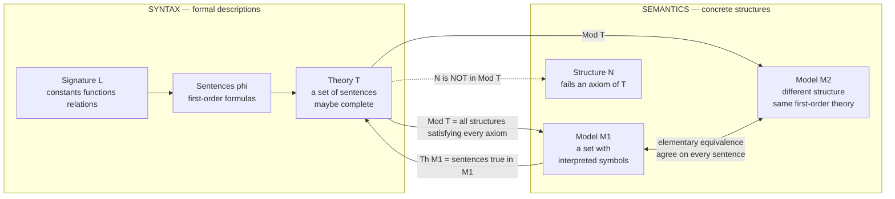

# 🏛️ Model Theory Foundations

> [!abstract] TL;DR
> **Model theory** studies the relationship between formal **theories** (sets of sentences) and the mathematical **structures** (models) that satisfy them. A structure is a set equipped with interpreted symbols; a theory is a set of first-order sentences; `Mod(T)` is the class of all structures satisfying every sentence of `T`. The central questions are: *how much can axioms pin down a structure?*, *which structures are first-order indistinguishable?*, and *what can a formula carve out inside a structure?* (definable sets). What makes model theory remarkable is that it became a **tool inside mainstream mathematics** — the Ax–Grothendieck theorem, Hrushovski's number-theoretic proofs, o-minimality in real geometry, and nonstandard analysis all fall out of model-theoretic "transfer."

---

## Intuition

**Analogy:** A set of axioms is like a **personality profile**, and model theory studies *all the actual people who fit it*. The axioms for a "group," a "field," or a "linear order" describe a **shape** — a checklist of properties. A **model** is any concrete mathematical structure that happens to have that shape: the integers under addition fit the group profile; so do the symmetries of a triangle, and so do infinitely many others. Model theory is the disciplined study of the gap between the **description** and the **structures that answer to it**.

Two questions drive everything. First, *how tightly does the profile pin down its members?* Sometimes loosely (the group axioms are satisfied by wildly different groups), sometimes almost perfectly (the axioms of an algebraically closed field of characteristic 0 with a fixed uncountable size pin the structure down to isomorphism). Second, *which structures are secretly indistinguishable?* — two structures can be genuinely different (non-isomorphic) yet agree on **every** first-order sentence, so no first-order description can ever tell them apart. That single insight — that syntax under-determines structure — is where model theory turns logic from a foundational curiosity into a **working instrument** for algebra, geometry, and number theory.

---

## How It Works

### The syntax–semantics bridge

Model theory lives on a two-way street between **descriptions** and **structures**:

1. **Signature (language) `L`** — a menu of symbols: constant symbols (`0`, `1`), function symbols (`+`, `·`), and relation symbols (`<`, `∈`). The signature says *what vocabulary* you are allowed to talk about, but assigns it no meaning yet.
2. **Structure `M`** — a non-empty set (the *domain* or *universe*) together with an **interpretation** of every symbol: each constant becomes an actual element, each `n`-ary function symbol becomes an actual function, each relation symbol becomes an actual set of tuples. The structure is the "concrete person."
3. **Sentence `φ`** — a first-order formula with no free variables. Because it has no loose ends, it evaluates to a definite `True`/`False` in each structure.
4. **Satisfaction `M ⊨ φ`** — read "`M` models `φ`" or "`φ` is true in `M`." This is Tarski's recursive definition (see [[Predicate_Logic_and_Quantifiers]]): atomic formulas are checked against the interpreted relations, connectives fold truth values, and `∀x`/`∃x` range over the domain.
5. **Theory `T`** — a set of sentences. Often we care about the **deductively closed** version (everything provable from `T`). A theory is **complete** if for every sentence `φ` it decides one of `φ` or `¬φ` — it leaves no question open.
6. **`Mod(T)`** — the class of all structures `M` with `M ⊨ φ` for every `φ ∈ T`. Dually, **`Th(M)`** = the set of all sentences true in `M`, which is always a complete theory.

The **definable set** is the central object of the whole subject: given a structure `M` and a formula `φ(x₁,…,xₙ)` with free variables, the set of tuples making `φ` true carves a subset out of `Mⁿ`. Model theory is, to a large extent, the study of *which subsets a language can carve* — and structures whose definable sets are "tame" (o-minimal, strongly minimal, stable) are exactly the ones with rich geometry.

### The map `T ↦ Mod(T)` and `M ↦ Th(M)`



The picture captures the two failures of pinning-down that generate the whole field. `Mod(T)` almost always contains **many** structures, and among them sit pairs like `M1` and `M2` that are **elementarily equivalent** — no first-order sentence separates them — even when they are not isomorphic. Sorting out exactly *when* a theory forces its models to look alike is the roadmap for the rest of this section.

### The roadmap of this section

This note is the opener. The follow-on notes develop the machinery it points at:

- `Elementary_Equivalence_and_Embeddings` — when do two structures satisfy the same sentences, and when does one sit inside another *elementarily* (preserving all formulas)?
- `Types_Omitting_and_Saturation` — the "local" data of an element: which formulas it satisfies; building rich (saturated) models and controlling which types appear.
- `Quantifier_Elimination_and_Decidability` — when every formula is equivalent to a quantifier-free one, making definable sets transparent and the theory decidable.
- `Categoricity_and_Morley_Theorem` — when a theory has, up to isomorphism, exactly one model of a given size; Morley's stunning result that uncountable categoricity in one uncountable cardinal gives it in all.
- `First_Order_Predicate_Logic` — the syntax/proof-theory substrate (satisfaction, completeness, compactness) that model theory takes as given.

---

## Key Concepts

### Secondary Level

**A theory is a description; a model is a thing that fits it.** "Being a group" is a checklist: an associative operation, an identity element, inverses. Anything passing the checklist — integers under `+`, clock arithmetic, shuffles of a deck of cards — is a **model** of the group axioms. The axioms do not name a single object; they name a whole *club* of objects, `Mod(T)`.

**Satisfaction is just careful truth-checking.** `M ⊨ φ` means "if you interpret the symbols the way `M` says, sentence `φ` comes out true." On the structure `(ℤ, <)`, the sentence "for every `x` there is a `y` with `x < y`" is true (there is always a bigger integer); on the structure "a finite line of dominoes" it would be false (the last domino has nothing after it).

**One description, many members.** The single most important beginner takeaway: a theory usually has **lots** of models. "Linear order" is satisfied by the whole numbers, the even numbers, the rationals, the reals, a three-element list — all different shapes obeying the same rules. Axioms *constrain* but rarely *determine*.

**Definable = describable by a formula.** Inside a structure, a **definable set** is any collection you can single out with a formula. In `(ℤ, +, ·, <)` the even numbers are definable ("`there exists y with x = y + y`") and so are the primes; whether a *specific* set is definable is often deep and surprising.

### Undergraduate Level

**Structures, formally.** An `L`-structure `M = (M, {c^M}, {f^M}, {R^M})` is a domain `M` with an interpretation for each symbol of the signature `L`. The rationals as an ordered field are the structure `(ℚ; 0, 1, +, ·, <)`; the same underlying set with only `<` is a *different* structure `(ℚ; <)` — the signature you choose changes what you can express.

**Theory vs. complete theory.** A **theory** is any set of sentences closed under logical consequence. It is **complete** when it decides every sentence. Crucial distinction: the *axiom set* you write down is usually **not** complete (the field axioms don't decide "`1 + 1 = 0`"), but the full theory of a *single* structure, `Th(M)`, always is — because in `M` each sentence is simply true or false. Completing a theory means committing to a specific class of models.

**Elementary equivalence vs. isomorphism.** `M ≡ N` (**elementarily equivalent**) means `M` and `N` satisfy exactly the same first-order sentences: `Th(M) = Th(N)`. `M ≅ N` (**isomorphic**) means there is a structure-preserving bijection. Isomorphic implies elementarily equivalent, but **not** conversely — the rationals and the reals as dense linear orders without endpoints are elementarily equivalent yet not isomorphic (different cardinality). First-order logic simply cannot "see" the difference.

**First-order theories of familiar structures.** Model theory's showcase examples:

| Structure / class | Theory | Flavor |
|---|---|---|
| `(ℚ, <)` | **DLO** — dense linear order without endpoints | complete, decidable, quantifier-eliminating |
| Algebraically closed fields | **ACF** (per characteristic) | complete after fixing characteristic; strongly minimal |
| `(ℝ; +, ·, <)` | **RCF** — real closed fields | complete, decidable (Tarski), o-minimal |
| `(ℕ; +, ·, 0, 1, <)` | **PA** / true arithmetic | incomplete, *undecidable* (Gödel, Church) |

The contrast in the last row is the whole drama of logic: rich enough to code computation, and therefore beyond any complete decidable axiomatization.

**Compactness and its consequences.** The **compactness theorem** — `T` has a model iff every finite subset does — is model theory's power tool. It instantly yields *non-standard models*: add to arithmetic a new constant `c` with axioms `c > 0`, `c > 1`, `c > 2`, … Every finite subset is satisfiable (pick `c` large), so the whole set is — producing a model of arithmetic with an "infinite" number. Likewise the **Löwenheim–Skolem theorems** force theories with an infinite model to have models of *every* infinite cardinality, guaranteeing non-isomorphic models and killing categoricity outright in mixed cardinalities.

### Graduate Level

**Definable sets as the geometry of a structure.** Fix `M`. The definable subsets of `Mⁿ` form a Boolean algebra closed under projection (that's what `∃` does). The *shape* of this family classifies structures:

- **Strongly minimal** (e.g. ACF): every definable subset of `M` is finite or cofinite — the line has no interesting definable subsets, giving a dimension theory (a pregeometry / matroid) that behaves like algebraic-geometric dimension.
- **o-minimal** (e.g. RCF, `ℝ` with exponentiation by Wilkie): every definable subset of `M` is a finite union of points and intervals — the source of "tame topology," where definable sets have finitely many connected components, admit cell decompositions, and cannot exhibit pathologies like space-filling curves.
- **Stable** (Shelah's classification): definable relations don't encode arbitrarily long orders; stability theory measures how "wild" `Th(M)` is and underlies the deepest applications.

**Types: the microscope.** A **type** over a set `A` in `M` is a maximal consistent set of formulas `p(x)` with parameters from `A` — the complete first-order "description" of a possible element. A model is **saturated** if it realizes every type over every small parameter set: a structure so rich that any consistent description of an element is actually instantiated. Saturation is the semantic engine behind categoricity transfer and back-and-forth arguments (developed in `Types_Omitting_and_Saturation`).

**Quantifier elimination (QE).** A theory has QE if every formula is `T`-equivalent to a quantifier-free one. QE makes definable sets *explicit* (in ACF, definable = constructible; in RCF, definable = semialgebraic — this is the Tarski–Seidenberg theorem), typically yields **completeness** and **decidability**, and is the technical heart of `Quantifier_Elimination_and_Decidability`. DLO, ACF, and RCF all admit QE; that is precisely why they are so tractable.

**The method and philosophy.** The model-theoretic move is to study a mathematical object *through its first-order theory and its definable sets*, then exploit structural theorems (categoricity, stability, o-minimality) as leverage. This turns logic into an *analytic instrument*:

- **Ax–Grothendieck theorem** — every injective polynomial map `ℂⁿ → ℂⁿ` is surjective. Proof by transfer: it is obvious over finite fields (an injection of a finite set onto itself is onto), the statement is first-order and holds in the algebraic closures of `𝔽ₚ`, and by the model theory of ACF (completeness + the Lefschetz principle) it transfers to `ℂ`. A theorem about complex geometry proved by counting on finite sets.
- **Hrushovski's work** — model-theoretic proofs of the Mordell–Lang conjecture in positive characteristic and of the Manin–Mumford conjecture, using stability theory and the geometry of definable groups; a landmark of logic acting inside number theory and arithmetic geometry.
- **o-minimality in Diophantine geometry** — the Pila–Wilkie counting theorem (definable sets in o-minimal structures have few rational points off their algebraic part) drove Pila's proof of André–Oort for products of modular curves.
- **Nonstandard analysis** — Robinson used compactness/ultrapowers to build a field `*ℝ` with genuine infinitesimals, elementarily equivalent to `ℝ`, making Leibniz-style infinitesimal arguments rigorous via the **transfer principle**.

The unifying slogan: *a first-order statement true in enough of `Mod(T)` is true in all of it.* Model theory turns that slogan into theorems.

---

## Python Demo

```python
"""
Theories and their models — a computational 'model zoo'.

Theory chosen: the axioms of an EQUIVALENCE RELATION on a finite domain.
  (E1) Reflexive:   for all x,  R(x,x)
  (E2) Symmetric:   for all x,y, R(x,y) -> R(y,x)
  (E3) Transitive:  for all x,y,z, R(x,y) & R(y,z) -> R(x,z)

We (a) enumerate ALL binary relations on a small domain and MODEL-CHECK the
axioms, exhibiting structures that satisfy the theory and structures that do
NOT; and (b) show the theory has MANY models — the number of labeled models is
the Bell number B(n), while the number of NON-ISOMORPHIC models is the
partition number p(n). One description, a whole population of structures.
"""

import numpy as np
import matplotlib.pyplot as plt
from itertools import product

# ---------------------------------------------------------------------------
# 1. Model checking: is an n x n relation matrix a model of the equiv. theory?
# ---------------------------------------------------------------------------
def is_reflexive(R):
    return all(R[i, i] == 1 for i in range(len(R)))

def is_symmetric(R):
    return np.array_equal(R, R.T)

def is_transitive(R):
    n = len(R)
    for i in range(n):
        for j in range(n):
            for k in range(n):
                if R[i, j] and R[j, k] and not R[i, k]:
                    return False
    return True

def is_equivalence(R):
    """M |= T  iff  R satisfies all three axioms."""
    return is_reflexive(R) and is_symmetric(R) and is_transitive(R)

def all_relations(n):
    """Every binary relation on {0,...,n-1} as an n x n 0/1 matrix."""
    for bits in product([0, 1], repeat=n * n):
        yield np.array(bits, dtype=int).reshape(n, n)

def partition_type(R):
    """Isomorphism invariant of an equivalence relation: sorted block sizes."""
    n = len(R)
    seen, blocks = set(), []
    for i in range(n):
        if i in seen:
            continue
        block = [j for j in range(n) if R[i, j] == 1]
        seen.update(block)
        blocks.append(len(block))
    return tuple(sorted(blocks, reverse=True))

# ---------------------------------------------------------------------------
# 2. Enumerate models by brute force for small n (verifies the counts)
# ---------------------------------------------------------------------------
def count_models(n):
    labeled, iso_types = 0, set()
    reps = {}
    for R in all_relations(n):
        if is_equivalence(R):
            labeled += 1
            t = partition_type(R)
            iso_types.add(t)
            reps.setdefault(t, R.copy())        # keep one representative per type
    return labeled, iso_types, reps

# ---------------------------------------------------------------------------
# 3. Closed-form counts for the plot (Bell numbers and partition numbers)
# ---------------------------------------------------------------------------
def bell_numbers(m):
    """Bell(0..m) via the Bell triangle = # labeled models of the theory."""
    row, bells = [1], [1]
    for _ in range(1, m + 1):
        new = [row[-1]]
        for x in row:
            new.append(new[-1] + x)
        row, _ = new, bells.append(new[0])
    return bells

def partition_numbers(m):
    """p(0..m) via a coin-change DP = # non-isomorphic models of the theory."""
    p = [0] * (m + 1)
    p[0] = 1
    for k in range(1, m + 1):
        for i in range(k, m + 1):
            p[i] += p[i - k]
    return p

# --- brute-force verification against the formulas -------------------------
for n in (3, 4):
    labeled, iso_types, _ = count_models(n)
    print(f"n = {n}:  labeled models |Mod(T)| = {labeled:>3}"
          f"   non-isomorphic = {len(iso_types)}"
          f"   partition types = {sorted(iso_types, reverse=True)}")

# A relation that is NOT a model (reflexive + symmetric but NOT transitive):
N = np.array([[1, 1, 0],
              [1, 1, 1],
              [0, 1, 1]])          # 0~1 and 1~2 but 0 !~ 2  => fails (E3)
print("\nNon-model N (reflexive & symmetric, transitivity broken):")
print(f"  reflexive={is_reflexive(N)}  symmetric={is_symmetric(N)}"
      f"  transitive={is_transitive(N)}  ->  N |= T ? {is_equivalence(N)}")

# ---------------------------------------------------------------------------
# 4. Build the 'model zoo' for n = 4 : one representative per isomorphism type
# ---------------------------------------------------------------------------
_, _, reps4 = count_models(4)
types4 = sorted(reps4.keys(), key=lambda t: (len(t), t))   # 4, 3+1, 2+2, 2+1+1, 1+1+1+1

# ---------------------------------------------------------------------------
# 5. Visualization
# ---------------------------------------------------------------------------
fig = plt.figure(figsize=(14, 8))
gs = fig.add_gridspec(2, len(types4) + 1, height_ratios=[1.0, 1.15], hspace=0.55,
                      wspace=0.35)

# --- Top row: the model zoo (green heatmaps) + one non-model (red) ---
for col, t in enumerate(types4):
    ax = fig.add_subplot(gs[0, col])
    ax.imshow(reps4[t], cmap="Greens", vmin=0, vmax=1)
    ax.set_xticks(range(4)); ax.set_yticks(range(4))
    ax.set_xticklabels(range(4), fontsize=7); ax.set_yticklabels(range(4), fontsize=7)
    ax.set_title("classes " + "+".join(map(str, t)), fontsize=9)
    for i in range(4):
        for j in range(4):
            ax.text(j, i, reps4[t][i, j], ha="center", va="center",
                    fontsize=8, color="white" if reps4[t][i, j] else "#555")

# non-model on the far right (pad to 4x4 for visual parity)
axN = fig.add_subplot(gs[0, len(types4)])
Npad = np.array([[1, 1, 0, 0],
                 [1, 1, 1, 0],
                 [0, 1, 1, 0],
                 [0, 0, 0, 1]])
axN.imshow(Npad, cmap="Reds", vmin=0, vmax=1)
axN.set_xticks(range(4)); axN.set_yticks(range(4))
axN.set_xticklabels(range(4), fontsize=7); axN.set_yticklabels(range(4), fontsize=7)
axN.set_title("NOT a model\n(0~1, 1~2, 0 !~ 2)", fontsize=9, color="#b91c1c")
for i in range(4):
    for j in range(4):
        axN.text(j, i, Npad[i, j], ha="center", va="center",
                 fontsize=8, color="white" if Npad[i, j] else "#555")

fig.text(0.5, 0.965, "Model Zoo of the Theory T = {reflexive, symmetric, transitive}"
         "   on a 4-element domain",
         ha="center", fontsize=12, fontweight="bold")

# --- Bottom row: how the model count grows (Bell vs partition numbers) ---
axb = fig.add_subplot(gs[1, :])
ns = np.arange(1, 8)
bell = np.array(bell_numbers(7)[1:])          # labeled models |Mod(T)|
part = np.array(partition_numbers(7)[1:])     # non-isomorphic models
w = 0.38
axb.bar(ns - w / 2, bell, width=w, color="#2563eb",
        label="labeled models |Mod(T)| = Bell(n)")
axb.bar(ns + w / 2, part, width=w, color="#16a34a",
        label="non-isomorphic models = p(n)")
for x, (b, p) in enumerate(zip(bell, part), start=1):
    axb.text(x - w / 2, b + 2, str(b), ha="center", fontsize=8, color="#2563eb")
    axb.text(x + w / 2, p + 2, str(p), ha="center", fontsize=8, color="#16a34a")
axb.set_xlabel("domain size n")
axb.set_ylabel("number of models")
axb.set_title("One theory, MANY models: the axioms UNDER-DETERMINE the structure",
              fontsize=11)
axb.set_xticks(ns)
axb.legend(loc="upper left", fontsize=9)
axb.spines[["top", "right"]].set_visible(False)

plt.savefig("model_theory_model_zoo.png", dpi=120, bbox_inches="tight")
plt.show()
```

**Expected output:**

```
n = 3:  labeled models |Mod(T)| =   5   non-isomorphic = 3   partition types = [(3,), (2, 1), (1, 1, 1)]
n = 4:  labeled models |Mod(T)| =  15   non-isomorphic = 5   partition types = [(4,), (3, 1), (2, 2), (2, 1, 1), (1, 1, 1, 1)]

Non-model N (reflexive & symmetric, transitivity broken):
  reflexive=True  symmetric=True  transitive=False  ->  N |= T ? False
```

The demo makes the section's thesis concrete. Model-checking cleanly separates the structures that **satisfy** the theory from a structure `N` that fails a single axiom (transitivity) and is therefore *not* in `Mod(T)`. And the counts show the theory is wildly under-determining: on a 4-element domain it has **15** labeled models falling into **5** non-isomorphic shapes (the partitions of 4). The "model zoo" heatmaps are literally those five non-isomorphic members — the personality profile "equivalence relation" fitted by a whole family of genuinely different structures.

---

## Real-World Applications

> **Database query optimization (relational model as finite model theory).** A relational database is a *finite structure*; a SQL query is (essentially) a first-order formula, and its result is the **definable set** it carves out. Query optimizers rewrite queries using logical equivalences that are valid across all models, and *finite model theory* — model theory restricted to finite structures — supplies the expressiveness bounds (e.g., why plain SQL cannot compute transitive closure without recursion). See [[Predicate_Logic_and_Quantifiers]] for the SQL-as-FOL correspondence.

> **Automated reasoning and SMT solvers.** Decision procedures inside Z3 and CVC5 are model theory in production: the theory of real closed fields is decidable (Tarski) because it eliminates quantifiers, so nonlinear real arithmetic constraints can be solved algorithmically; linear arithmetic, arrays, and bit-vectors are further decidable theories whose models the solver searches. Whether a verification condition is *satisfiable* is literally the question "does a model exist?"

> **Computer algebra and real geometry.** Cylindrical algebraic decomposition — the workhorse of `Reduce`, `Mathematica`, and robot motion planning — is the algorithmic incarnation of quantifier elimination for real closed fields. It decomposes definable (semialgebraic) sets into cells, exactly the o-minimal "tame topology" guarantee that such sets have finitely many components.

> **Nonstandard analysis in applied mathematics.** Robinson's `*ℝ`, built by compactness/ultrapowers, gives infinitesimals that satisfy the same first-order laws as `ℝ` (the transfer principle). This underlies rigorous "infinitesimal" treatments used in stochastic analysis (Loeb measures), mathematical economics, and hydrodynamics.

> **Number theory via logic.** Hrushovski's model-theoretic proofs of Mordell–Lang (positive characteristic) and the o-minimality-driven Pila–Wilkie/André–Oort results are not analogies — they are theorems in arithmetic geometry whose proofs *require* stability theory and definability. Model theory has become a permanent instrument in the number theorist's toolkit.

---

## Common Pitfalls

- **Confusing the theory with a model.** A theory is a *set of sentences*; a model is a *structure*. "Groups" is a theory; "the integers under addition" is one of its models. Saying "the model proves X" is a category error — models *satisfy* sentences; theories *prove* them. Keep `M ⊨ φ` (semantic, in a structure) distinct from `T ⊢ φ` (syntactic, from axioms). Completeness/soundness say these coincide for validity, but the *objects* are different kinds of thing.

- **Treating an axiom set as a complete theory.** The field axioms are a perfectly good theory but they are **not complete** — they do not decide "`1 + 1 = 0`" (true in characteristic 2, false in characteristic 0). Only after adding enough sentences to fix a class (e.g. ACF of a fixed characteristic) do you get completeness. "I wrote down axioms" does not mean "my theory decides every sentence."

- **Assuming elementary equivalence implies isomorphism.** `M ≡ N` (same first-order theory) is strictly weaker than `M ≅ N`. `(ℚ, <)` and `(ℝ, <)` are elementarily equivalent dense linear orders yet non-isomorphic; there are countable and uncountable models of arithmetic satisfying *exactly* the same sentences. First-order logic cannot detect cardinality or many structural features. The converse direction always holds (isomorphism ⇒ elementary equivalence), which is where the asymmetry hides.

- **Believing axioms pin down "the" structure.** By Löwenheim–Skolem, any first-order theory with an infinite model has models of every infinite cardinality — so no first-order theory can single out `ℕ` or `ℝ` up to isomorphism. Expecting your axioms to have a unique model (categoricity) is usually a mistake; when it *does* happen it is a deep, theorem-worthy event (Morley's theorem).

- **Mis-scoping definable sets.** "Definable" always means "definable **in a fixed structure with a fixed signature**, possibly with parameters." The primes are definable in `(ℕ; +, ·)` but *not* in `(ℕ; +)` (Presburger arithmetic), and the order on `ℝ` is definable from `+, ·` but must be added as primitive if you only have `+`. Changing the language or allowing/forbidding parameters changes what is definable — never quote definability without pinning down the ambient structure.

---

## Related Concepts

- [[Predicate_Logic_and_Quantifiers]] — the syntax and Tarski-style satisfaction (`M ⊨ φ`), completeness, and compactness that model theory takes as its substrate; the sibling note `First_Order_Predicate_Logic` will localize this material for this section
- [[Mathematical_Logic_and_Set_Theory]] — Löwenheim–Skolem, compactness, and the Gödel completeness/incompleteness results that bound what theories can pin down; also the set-theoretic universe in which structures and classes like `Mod(T)` live
- [[Set_Theory_and_Relations]] — a structure *is* a set carrying interpreted relations and functions; equivalence and order relations are the raw material of the smallest first-order theories (and of the Python demo)
- [[Logic_and_Proof_Techniques]] — the proof-theoretic side (`T ⊢ φ`) whose agreement with semantic truth (`T ⊨ φ`) is the completeness theorem underpinning model theory
- [[Groups_and_Subgroups]] — the archetypal example of a first-order theory with many non-isomorphic models; model theory of groups (stable groups, definable groups) drives the number-theoretic applications
- [[Fields_and_Field_Extensions]] — algebraically closed fields (ACF) and real closed fields (RCF) are the flagship well-behaved theories: complete, decidable, quantifier-eliminating, and the setting of the Ax–Grothendieck transfer
- [[Algebraic_Geometry]] — strongly minimal ACF makes definable sets = constructible sets; o-minimality gives "tame topology" over the reals; the Mordell–Lang and André–Oort applications live here
- [[Decidability_and_Recognizability]] — quantifier elimination yields decision procedures (RCF decidable, Tarski) while arithmetic is undecidable (Church) — the computability boundary that model theory maps onto its theories

---

## Review Questions

### Secondary

1. Explain in your own words the difference between a **theory** and a **model**, using "being a group" versus "the integers under addition" as your example. Why can one theory have many models?
2. The theory of equivalence relations was model-checked in the demo. Give a concrete 3-element relation that **fails** exactly one axiom (say transitivity), and one that satisfies all three. How does `M ⊨ T` decide membership in `Mod(T)`?
3. Someone claims "the axioms of a linear order describe exactly one structure." Give two different linear orders (structures) that both satisfy the axioms, and explain why axioms usually *constrain* rather than *determine*.

### Undergraduate

1. State precisely what it means for two structures to be **elementarily equivalent** versus **isomorphic**. Give an explicit pair that are elementarily equivalent but not isomorphic, and explain which structural feature first-order logic fails to detect.
2. Using the **compactness theorem**, construct a non-standard model of arithmetic containing an element larger than every standard natural number. Which finitely-satisfiable set of sentences did you use, and why does compactness force a model of the whole set?
3. An *axiom set* for fields is not a *complete theory*. Exhibit a sentence undecided by the field axioms, then describe what you must add to obtain a complete theory (name the resulting theory) and what its models look like.

### Graduate

1. Ax–Grothendieck: every injective polynomial map `ℂⁿ → ℂⁿ` is surjective. Outline the model-theoretic transfer proof — why the statement is first-order, why it is true in `\overline{𝔽_p}`, and how completeness of ACF (with the Lefschetz principle) moves it to `ℂ`. Where exactly does model theory do the work that algebra alone does not?
2. Compare **strong minimality** (ACF) and **o-minimality** (RCF) as constraints on definable sets. What does each say about definable subsets of the home sort in one variable, and how does each give rise to a usable notion of dimension? Name one theorem in geometry or number theory that each property powers.
3. Löwenheim–Skolem guarantees models of every infinite cardinality, so categoricity across all cardinals is impossible for infinite structures. State **Morley's categoricity theorem** and explain why "categorical in one uncountable cardinal ⇒ categorical in all uncountable cardinals" is a surprising *rigidity* result rather than a triviality. (Developed further in `Categoricity_and_Morley_Theorem`.)

---

## Sources

- [Marker, D. (2002). *Model Theory: An Introduction.* Springer GTM 217.](https://link.springer.com/book/10.1007/b98860) — the standard modern graduate introduction; structures, theories, definable sets, QE, ACF/RCF, and o-minimality
- [Chang, C. C., & Keisler, H. J. (1990). *Model Theory* (3rd ed.). North-Holland / Dover, 2012.](https://store.doverpublications.com/products/9780486488219) — the classic comprehensive reference on models, compactness, ultraproducts, and saturation
- [Hodges, W. (1997). *A Shorter Model Theory.* Cambridge University Press.](https://www.cambridge.org/9780521587136) — a leaner, rigorous treatment emphasizing structures, embeddings, and definability
- [Tent, K., & Ziegler, M. (2012). *A Course in Model Theory.* Cambridge University Press (ASL Lecture Notes in Logic 40).](https://www.cambridge.org/9780521763240) — modern coverage through stability and geometric model theory
- [Poizat, B. (2000). *A Course in Model Theory: An Introduction to Contemporary Mathematical Logic.* Springer.](https://link.springer.com/book/10.1007/978-1-4419-8622-1) — conceptual introduction linking model theory to mainstream mathematics

---

#mathematical-logic #model-theory #structures #theories #definability
