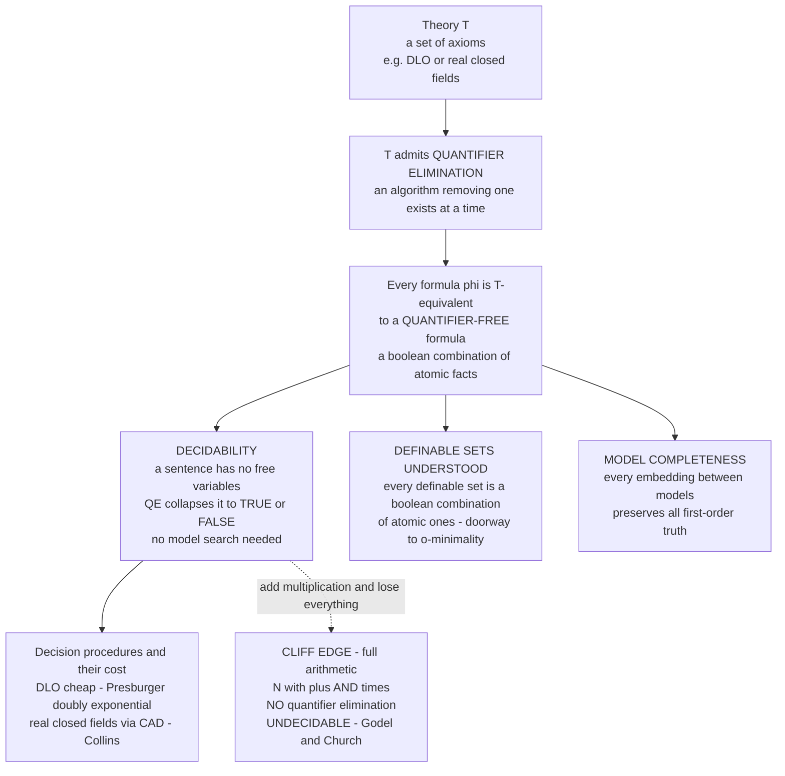

# 🧮 Quantifier Elimination and Decidability

> [!abstract] TL;DR
> A theory `T` **admits quantifier elimination (QE)** if every first-order formula is `T`-equivalent to a **quantifier-free** one — a plain boolean combination of atomic facts with no `∃` or `∀` left. This is a small miracle: an existential claim *seems* to demand searching infinitely many candidate witnesses, yet QE rewrites it as a finite check on the parameters. "**There exists `x` with `ax² + bx + c = 0`**" collapses to "**`b² − 4ac ≥ 0`**" — no search. When a theory has QE it usually inherits two prizes at once: **decidability** (an algorithm settles every sentence, because QE reduces it to a variable-free formula that is just TRUE or FALSE) and a **complete understanding of its definable sets** (they are boolean combinations of atomic ones — the doorway to o-minimality). The classical trophies are **dense linear orders**, **Presburger arithmetic** (`ℕ` with `+`), **algebraically closed fields**, and Tarski's landmark **real closed fields** `(ℝ, +, ·, <)`. The sharp cliff-edge: add multiplication to full arithmetic (`ℕ` with `+` *and* `×`) and QE and decidability both **vanish** — Gödel and Church prove it undecidable.

---

## Intuition

**Analogy — the difference between "prove a treasure exists somewhere on the island" and "read a note that already tells you."** Suppose I claim: *"There is a spot on this island where the ground is soft."* Naively you would have to walk the whole island, probing every point — an unbounded search — before you could confirm or deny it. That is what a quantifier `∃x` looks like: a promise that *somewhere* among infinitely many candidates a witness exists, apparently forcing you to check them all.

Now imagine the island came with a **magic surveyor's rule**: for *this particular terrain*, "there is a soft spot" is provably equivalent to a single readable fact printed on the map — say, *"the average rainfall exceeds 40 cm."* You no longer walk anywhere. You glance at one number already written down and you *know*. The infinite search has been **compiled away** into a finite check on data you already hold.

**Quantifier elimination is exactly this compilation.** For certain rich mathematical theories, every statement of the form "there exists an `x` such that …" is provably equivalent to a **quantifier-free** statement — a boolean combination of simple relations among the *parameters only*. The textbook example: over the reals, "**there exists `x` with `ax² + bx + c = 0`**" (with `a ≠ 0`) is equivalent to the discriminant condition "**`b² − 4ac ≥ 0`**." One says *search all real numbers*; the other says *compute three multiplications and a subtraction and compare to zero*. Same truth value, no search. When *every* formula of a theory can be flattened this way, deciding the theory becomes mechanical — and that mechanical decidability is what turns whole regions of mathematics (real algebraic geometry, geometric constraint solving, program verification) into things a computer can actually do.

---

## How It Works

### Core Mechanics

**1. The definition.** A theory `T` (a set of axioms) in a language `L` **admits quantifier elimination** if for every formula `φ(x̄)` there is a **quantifier-free** formula `ψ(x̄)`, using the same free variables, such that `T ⊢ ∀x̄ (φ ↔ ψ)`. Because `∀x φ` is `¬∃x ¬φ`, it suffices to eliminate a *single* `∃` from a quantifier-free matrix; peel them off one at a time, innermost first, and any formula is reduced.

**2. The atomic reduction (why "one `∃` over a conjunction" is enough).** Put the matrix in disjunctive normal form. Since `∃x (A ∨ B) ≡ (∃x A) ∨ (∃x B)`, the quantifier distributes over the disjunction, so the whole job reduces to eliminating `∃x` from a **conjunction of literals** (atomic formulas and their negations). Solve *that* case for your specific language and you have QE for the theory.

**3. Worked mechanism — dense linear orders (DLO).** The language is just `<`; the axioms say `<` is a strict linear order that is **dense** (between any two points lies a third) and has **no endpoints** (no least, no greatest). To eliminate `∃x` from a conjunction of literals about `x`:
   - Any literal `x = t` lets you **substitute** `x := t` and drop the quantifier entirely.
   - Otherwise sort the literals into **lower bounds** `aᵢ < x`, **upper bounds** `x < bⱼ`, and disequalities `x ≠ cₖ`. A witness `x` exists **iff** every lower bound sits below every upper bound: the result is `⋀ᵢⱼ (aᵢ < bⱼ)`. Density guarantees a point strictly between them, and no-endpoints handles the cases with no lower or no upper bound (then the existential is simply **true**). The disequalities `x ≠ cₖ` can always be dodged because density leaves infinitely many candidates, so they **vanish**.

   So `∃x (a < x ∧ x < b)` becomes the quantifier-free `a < b`. The infinite "does a point exist between `a` and `b`?" is now the finite "is `a < b`?"

**4. From QE to decidability.** A **sentence** has *no* free variables. Run QE on it: every quantifier disappears, leaving a boolean combination of **atomic sentences** among the constants of the language — and each of those is directly TRUE or FALSE. So the sentence reduces mechanically to a truth value, with **no model to search**. That is a decision procedure. QE is therefore a factory for decidability proofs.

**5. From QE to definable sets and model-completeness.** QE says every definable relation is a boolean combination of **atomic** ones — for real closed fields, every definable set is a finite boolean combination of polynomial sign-conditions (semialgebraic sets), the seed of **o-minimality** and *tame geometry*. QE also typically yields **model-completeness**: every embedding between models of `T` is *elementary* (preserves all first-order formulas), because a quantifier-free formula's truth is preserved by embeddings and QE reduces everything to the quantifier-free case.

**6. The trophy case and the cliff.** DLO, **Presburger arithmetic** (`ℕ` with `+`, `<`, `0`, `1` — no multiplication; Presburger 1929), **algebraically closed fields (ACF)**, and Tarski's **real closed fields (RCF)** `(ℝ, +, ·, <)` all admit QE and are decidable. But QE is **language-dependent and fragile**: add multiplication to Presburger — i.e. move to full first-order arithmetic `(ℕ, +, ×)` — and QE, completeness, and decidability all collapse. Gödel's incompleteness and Church's theorem make that theory **undecidable**. Same universe `ℕ`, one extra operation, and the miracle evaporates.

### Flow / Architecture



*QE is the hinge: it flattens every formula to quantifier-free, and from that single fact flow decidability, a full description of the definable sets, and model-completeness — right up to the edge where adding multiplication destroys all three.*

---

## Key Concepts

### Secondary (intuitive, no advanced background needed)

- **Quantifier** — the phrases "**there exists** `x` …" (`∃x`) and "**for all** `x` …" (`∀x`). They range over *all* objects, which is why they *feel* like they need an infinite search.
- **Quantifier-free formula** — a statement with *no* `∃`/`∀`: just concrete relations among named things, combined with **and / or / not**. You can check it by direct computation.
- **The magic move** — for some theories, "there exists an `x` with property `P`" is *provably the same* as a quantifier-free fact about the parameters. `∃x (a < x < b)` is just `a < b`.
- **Decidable theory** — one where an **algorithm** can take any sentence and correctly output "true" or "false," always halting. QE is one of the main ways to get this.
- **The contrast** — plain addition on the whole numbers is decidable; addition **plus** multiplication is not. A tiny change in the toolkit flips a solvable problem into an unsolvable one.

### Undergraduate (a first course in logic / algebra)

- **Admits QE (definition)** — `T` admits QE iff every `φ(x̄)` is `T`-equivalent to a quantifier-free `ψ(x̄)` with the same free variables. Reduces to eliminating one `∃` over a conjunction of literals.
- **Dense linear orders (DLO)** — `(ℚ, <)` axiomatized as a dense linear order with no endpoints; the cleanest QE example and a **complete**, decidable, `ℵ₀`-categorical theory.
- **Presburger arithmetic** — `(ℕ, +, <, 0, 1)` **without** multiplication. Admits QE once you add *divisibility-by-`n`* predicates to the language, hence **decidable** (Presburger 1929) — the first non-trivial decidability theorem.
- **Algebraically closed fields (ACF)** — `(ℂ, +, ·)` and friends; QE says every definable set is a **constructible set** (boolean combination of varieties), the algebraic-geometry payoff. ACF of a fixed characteristic is complete and decidable.
- **Real closed fields (RCF)** — Tarski's theorem: `(ℝ, +, ·, <)` admits QE, so its first-order theory is **decidable**, and every definable set is **semialgebraic** (the **Tarski–Seidenberg** theorem: projections of semialgebraic sets are semialgebraic).
- **Model-completeness** — a frequent companion of QE: every embedding between models is elementary. QE ⟹ model-complete, but *not* conversely.

### Graduate (advanced logic / model theory)

- **The QE test (Shoenfield / back-and-forth criterion)** — `T` has QE iff for all models `M, N ⊨ T` with a common substructure `A`, any quantifier-free-realized existential over `A` in `M` is realized in `N`; equivalently a **back-and-forth** system exists. This is how you *prove* QE without exhibiting the algorithm.
- **QE ⟹ decidable + model-complete, but neither implication reverses automatically** — you still need the base quantifier-free theory to be *decidable* (it usually is, being atomic), and QE is strictly stronger than model-completeness (`RCF` has QE; the theory of `(ℤ, +, <)` needs congruence predicates added before it does).
- **Complexity of the decision procedures** — Presburger arithmetic is decidable but **doubly exponential** (`2^{2^{cn}}` lower bound, Fischer–Rabin) and complete for **STA(∗, 2^{2^{O(n)}}, n)** (Berman); RCF decision via **Cylindrical Algebraic Decomposition (CAD, Collins 1975)** is doubly exponential in the number of variables, versus Tarski's original non-elementary procedure.
- **o-minimality** — a structure on a dense linear order is **o-minimal** if every definable subset of the line is a finite union of points and intervals; RCF is the prototype, and o-minimality is QE's geometric legacy — a *tame topology* where definable sets have finite, controlled complexity (Wilkie's theorem: `ℝ` with `exp` is o-minimal).
- **The undecidability cliff** — `Th(ℕ, +, ×)` interprets its own syntax (Gödel numbering), so it is **essentially undecidable** and admits **no** consistent complete decidable extension (Church, Tarski's undefinability of truth). Robinson's `Q` is already essentially undecidable; the boundary between Presburger and full arithmetic is exactly the addition of `×`.
- **SMT and the practical frontier** — decidable fragments (linear real/integer arithmetic, `Th(ℝ, +, ·)` via **NLSat / cylindrical algebraic coverings**, arrays, bit-vectors) are the theories SMT solvers implement; QE is the theoretical guarantee behind their completeness.

---

## Python Demo

```python
# Quantifier Elimination for DENSE LINEAR ORDERS (DLO) -- and the DECIDABILITY
# it buys -- made concrete and runnable.  numpy + matplotlib only.
#
# PART A: a real QE engine for DLO (language: only '<', plus '=' and '!=').
#   To eliminate  exists x . (conjunction of literals about x):
#     - a literal  x = t   -> substitute x := t, drop the quantifier
#     - else gather lower bounds (a < x) and upper bounds (x < b);
#       a witness exists  <=>  every lower bound < every upper bound
#       (density + no-endpoints);  x != c literals vanish (dodge finitely many).
#   So   exists x (a < x & x < b)   ==>   (a < b)     -- NO search.
#
# PART B: DECIDABILITY. Plug rational constants into the eliminated formula and
#   read off TRUE / FALSE mechanically -- no model is ever searched. Contrast:
#   full arithmetic (N with + AND *) admits NO such procedure (Godel/Church).

import numpy as np
import matplotlib.pyplot as plt

# ---- literals as tuples (op, left, right); op in {'<','=','!='} -------------
def involves(lit, x):
    return lit[1] == x or lit[2] == x

def is_num(t):
    try:
        float(t); return True
    except (TypeError, ValueError):
        return False

def eliminate_exists(clause, x, trace):
    """Return a quantifier-free literal list equivalent to  exists x . clause."""
    x_lits = [l for l in clause if involves(l, x)]
    rest   = [l for l in clause if not involves(l, x)]
    trace.append(f"  eliminate {x!r} from: {pretty(clause)}")

    # 1) equality  x = t  -> substitute
    for op, l, r in x_lits:
        if op == '=':
            t = r if l == x else l
            out = []
            for o2, a, b in clause:
                a2 = t if a == x else a
                b2 = t if b == x else b
                if a2 == b2 and o2 == '=':      # t = t  -> trivially true, drop
                    continue
                out.append((o2, a2, b2))
            trace.append(f"    found x = {t}; substitute -> {pretty(out)}")
            return out

    # 2) collect bounds; build the cross-product a < b
    lowers = [l for (op, l, r) in x_lits if op == '<' and r == x]   # a < x
    uppers = [r for (op, l, r) in x_lits if op == '<' and l == x]   # x < b
    new = list(rest)
    for a in lowers:
        for b in uppers:
            new.append(('<', a, b))
    if not lowers and not uppers:
        trace.append("    no bounds on x; no-endpoints => existential is TRUE")
    else:
        trace.append(f"    lowers={lowers} uppers={uppers}; density/no-endpoints"
                     f" -> {pretty([('<', a, b) for a in lowers for b in uppers])}"
                     f"  (x != c literals dropped)")
    return new

def pretty(lits):
    if not lits:
        return "TRUE"
    return " & ".join(f"{l}{op}{r}" for (op, l, r) in lits)

# ---- PART B: decide a ground (constant) quantifier-free formula -------------
def evaluate_ground(lits):
    """All-numeric literals -> bool. Non-numeric term left -> stays symbolic."""
    if not lits:
        return True                         # empty conjunction = TRUE
    if not all(is_num(l) and is_num(r) for (_, l, r) in lits):
        return None                         # parametric: can't decide numerically
    val = True
    for op, l, r in lits:
        a, b = float(l), float(r)
        val &= {'<': a < b, '=': a == b, '!=': a != b}[op]
    return bool(val)

# ---- run the engine --------------------------------------------------------
print("=" * 70)
print("PART A -- QUANTIFIER ELIMINATION for DLO")
print("=" * 70)

# Symbolic parameters: the classic 'a < x < b' collapses to 'a < b'
tr = []
res = eliminate_exists([('<', 'a', 'x'), ('<', 'x', 'b')], 'x', tr)
print("\n".join(tr))
print(f"  RESULT (quantifier-free):  exists x (a<x & x<b)  <=>  {pretty(res)}\n")

print("=" * 70)
print("PART B -- DECIDABILITY: QE reduces each SENTENCE to TRUE/FALSE")
print("=" * 70)
sentences = [
    ("exists x (1 < x < 2)",  [('<', '1', 'x'), ('<', 'x', '2')]),
    ("exists x (2 < x < 1)",  [('<', '2', 'x'), ('<', 'x', '1')]),
    ("exists x (5 < x)",      [('<', '5', 'x')]),                     # no upper bnd
    ("exists x (x = 3 & x < 4)", [('=', 'x', '3'), ('<', 'x', '4')]),
    ("exists x (x = 3 & x < 2)", [('=', 'x', '3'), ('<', 'x', '2')]),
]
rows = []
for name, clause in sentences:
    qf  = eliminate_exists(clause, 'x', [])   # silent trace
    ans = evaluate_ground(qf)
    rows.append((name, pretty(qf), ans))
    print(f"  {name:<28} --QE-->  {pretty(qf):<10} --DECIDE-->  {ans}")

print("\nEvery answer came from ARITHMETIC ON CONSTANTS -- no model was searched.")
print("For full arithmetic (N with + AND x) NO such procedure exists (Godel/Church).")

# ---- visualization ---------------------------------------------------------
fig, (ax1, ax2) = plt.subplots(1, 2, figsize=(13, 5))

# (left) the QE reduction ladder: quantifier depth drops to 0 = decided
steps  = ["forall y exists x\n(y < x)",
          "eliminate exists x\n-> TRUE  (no upper bound)",
          "forall y . TRUE",
          "eliminate forall y\n-> TRUE",
          "DECIDED: TRUE"]
depth  = [2, 1, 1, 0, 0]
xs = np.arange(len(steps))
ax1.step(xs, depth, where="mid", color="#c0392b", lw=2)
ax1.scatter(xs, depth, color="#c0392b", zorder=3)
for i, (s, d) in enumerate(zip(steps, depth)):
    ax1.annotate(s, (i, d), textcoords="offset points", xytext=(0, 12),
                 ha="center", fontsize=7.5)
ax1.set_yticks([0, 1, 2]); ax1.set_ylim(-0.6, 2.9)
ax1.set_ylabel("remaining quantifier depth")
ax1.set_xlabel("QE step")
ax1.set_title("QE peels quantifiers one at a time\n"
              "depth -> 0  means the sentence is DECIDED", fontsize=10)

# (right) decision-procedure COST vs formula size -- the doubly-exponential wall
n = np.arange(1, 9)
log10_dlo    = 3 * np.log10(n)            # DLO ~ polynomial  (n^3): log10 cost
log10_presb  = (2.0 ** n) * np.log10(2)   # Presburger 2^(2^n): log10 = 2^n*log10 2
log10_rcf    = (2.0 ** n) * np.log10(2) * 1.3   # RCF via CAD: doubly-exp in vars
ax2.plot(n, log10_dlo,   "o-", color="#27ae60", label="DLO  (polynomial)")
ax2.plot(n, log10_presb, "s-", color="#e67e22", label="Presburger  (2^2^n)")
ax2.plot(n, log10_rcf,   "^-", color="#8e44ad", label="Real closed fields (CAD)")
ax2.axhspan(ax2.get_ylim()[1]*0.82, ax2.get_ylim()[1], color="#c0392b", alpha=0.12)
ax2.text(1.1, ax2.get_ylim()[1]*0.9,
         "full arithmetic (N, +, x): UNDECIDABLE -- no curve exists",
         color="#c0392b", fontsize=8.5, va="center")
ax2.set_yscale("log")
ax2.set_xlabel("formula size  n")
ax2.set_ylabel("log10(worst-case decision cost)")
ax2.set_title("Decidable does NOT mean cheap\n"
              "Presburger & RCF are doubly exponential", fontsize=10)
ax2.legend(fontsize=8, loc="upper left")

plt.tight_layout()
plt.savefig("quantifier_elimination.png", dpi=130)
print("\nSaved QE reduction-ladder / decision-cost figure to quantifier_elimination.png")
```

Running it first traces the QE engine turning `∃x (a < x ∧ x < b)` into the quantifier-free `a < b` (a symbolic parameter result, no numbers needed), then **decides** five concrete DLO sentences purely by eliminating the quantifier and doing arithmetic on the constants — `∃x (1 < x < 2)` → `1 < 2` → **True**, `∃x (2 < x < 1)` → `2 < 1` → **False**, `∃x (5 < x)` → `TRUE` (no-endpoints), and the two `x = 3` cases substitute and evaluate — with **no model ever searched**. The left plot shows a nested sentence's quantifier depth dropping step-by-step to zero (the moment it is decided); the right plot drives home that **decidable is not the same as cheap**: DLO is polynomial, but Presburger and RCF are *doubly exponential*, and full arithmetic has **no curve at all** because it is undecidable.

---

## Real-World Applications

> **Example — SMT solvers are industrial quantifier-elimination / decision engines.** Tools like **Z3**, **CVC5**, and **MathSAT** ship decision procedures for exactly the theories that admit (or nearly admit) QE: **linear real arithmetic** (Fourier–Motzkin / simplex-based elimination), **linear integer arithmetic** (Presburger, via Omega-test / Cooper's algorithm — a direct QE method), and **nonlinear real arithmetic** (`Th(ℝ, +, ·)`, decided by CAD or the newer **NLSat / cylindrical algebraic coverings**). Because these theories are decidable, the solver can return a *guaranteed* SAT/UNSAT verdict, which is what makes it trustworthy inside a verifier.

Where this shows up in practice:
- **Program verification and model checking** — verifiers (Dafny, Frama-C, SPARK, seL4's proofs) discharge arithmetic side-conditions by handing them to a Presburger/linear-real decision procedure; QE is the theoretical reason the answer is complete, not just a heuristic (adjacent to [[Formal_Verification_TLA_Plus]]).
- **Real algebraic geometry and robotics** — Tarski–Seidenberg guarantees that projecting a semialgebraic set (e.g. the reachable configurations of a robot arm under polynomial constraints) stays semialgebraic; **CAD** computes it, powering motion planning, collision detection, and geometric theorem proving (Wu's method, GeoGebra's prover).
- **Optimization and control** — parametric linear/quadratic programming and reachability analysis of hybrid systems eliminate quantifiers over continuous state to produce controller conditions on the parameters.
- **Compilers and static analysis** — the **Omega test** (Presburger QE) decides loop-dependence and array-aliasing questions for automatic parallelization; polyhedral compilation rests on linear-arithmetic decision procedures.
- **Databases** — evaluating a first-order (relational-calculus) query over an ordered domain is a QE/decidability question; constraint databases store infinite relations *as* quantifier-free formulas and answer queries by eliminating quantifiers.

---

## Common Pitfalls

- **"QE is a property of the *theory*, but it depends on the *language*."** `(ℤ, +, <)` does **not** admit QE as stated — you cannot express "`x` is even" without a quantifier over the base symbols. Add the **congruence predicates** `≡ₙ` (divisibility by each `n`) and it *does*. Presburger's QE literally requires enriching the language; forget the extra primitives and the theorem is false. Always ask "QE *in which signature*?"
- **"QE gives decidability + model-completeness — but not for free, and not conversely."** QE only yields decidability if the *quantifier-free* fragment is itself decidable (true for atomic arithmetic/order literals, but a real hypothesis). And QE is *strictly stronger* than model-completeness: model-completeness does not imply QE. Do not treat the three properties as interchangeable.
- **"Decidable does not mean tractable."** Presburger arithmetic is decidable, yet its decision problem is **doubly exponential** (`2^{2^{Ω(n)}}`), and RCF via CAD is doubly exponential in the number of variables. A theorem that "there is an algorithm" can hide an algorithm that is astronomically slow — the practical bottleneck in real SMT/CAD use.
- **"Which theories actually have it is subtle."** DLO, ACF, RCF, and (enriched) Presburger do; but `Th(ℕ, +, ×)` does **not**, and the boundary is razor-thin — Presburger is decidable, but adding multiplication makes it undecidable (Gödel/Church). Even seemingly small extensions (e.g. adding a single fast-growing function) can destroy decidability, while others (adding `exp` to RCF) preserve *o-minimality* but decidability becomes open/conditional. There is no shortcut; each theory must be analyzed.
- **"Semialgebraic ≠ closed under everything."** Tarski–Seidenberg says semialgebraic sets are closed under *projection* (quantifier elimination), but people wrongly assume the same for arbitrary analytic operations. Adding `sin` to RCF breaks o-minimality (it defines `ℤ`) and thus decidability — the tameness is fragile.

---

## Related Concepts

- [[Mathematical_Logic_Overview]] — the vault entry point; QE lives in the **model-theory** pillar (semantics), and decidability ties it to the recursion-theory pillar.
- [[Mathematical_Logic_and_Set_Theory]] — the single-note survey in Mathematics/14; this note is the section-level deep dive of its "model theory / decidability" thread.
- [[Propositional_Logic_and_Boolean_Semantics]] — QE bottoms out in **boolean combinations** of atomic formulas; the propositional layer is exactly what a quantifier-free formula reduces to.
- [[Decidability_and_Recognizability]] — the computability-theory formalization of "an algorithm always halts with yes/no"; QE is a *constructive route* to placing a theory in the **decidable** class.
- [[The_Halting_Problem_and_Undecidability]] — the archetypal undecidable problem; full arithmetic's undecidability is proved by the same diagonal/self-reference machinery.
- [[Reductions_and_Undecidable_Problems]] — how undecidability *spreads*: `Th(ℕ, +, ×)` is undecidable because it *interprets* the halting problem; the mirror image of QE-based decidability.
- [[Fields_and_Field_Extensions]] — the algebraic setting for **ACF** and **real closed fields**; QE over these fields is the logical face of field theory.
- [[Galois_Theory]] — real closed fields are exactly the fixed points of the "no proper algebraic ordered extension" condition; deeply intertwined with the algebra of `ℝ` and `ℂ`.
- [[Algebraic_Geometry]] — the Tarski–Seidenberg theorem and semialgebraic/constructible sets are the geometric payoff of QE for RCF and ACF respectively.
- [[Logic_and_Proof_Techniques]] — induction on formula structure and case analysis are the workhorse techniques used to *prove* a QE algorithm correct.
- [[Formal_Verification_TLA_Plus]] — a formal-methods sibling; the decidable arithmetic theories QE certifies are precisely what verification back-ends (SMT) rely on.

*Prose-only siblings in this section (notes not yet in the vault): Model_Theory_Foundations (satisfaction and definability, the backdrop for "definable sets"), Elementary_Equivalence_and_Embeddings (where model-completeness lives), Undecidability_and_Reducibility, and Godels_Incompleteness_Theorems (the source of the undecidability cliff).*

---

## Review Questions

### Secondary

1. Explain in plain words why "there exists a number `x` such that …" *seems* to require checking infinitely many candidates, and what quantifier elimination does about it. Use the discriminant example (`∃x (ax² + bx + c = 0)` becoming `b² − 4ac ≥ 0`).
2. What does it mean for a theory to be **decidable**? Give the two-line description of how QE turns a sentence into a plain "true" or "false."
3. Whole-number **addition** is decidable but addition **with multiplication** is not. State this contrast in your own words — what changes when you add the multiplication symbol?

### Undergraduate

1. Carry out QE by hand for DLO on `∃x (a < x ∧ x < b ∧ x ≠ c)`. Show each step and explain precisely which axioms (density, no endpoints) justify dropping the `x ≠ c` conjunct and producing `a < b`.
2. Presburger arithmetic `(ℕ, +, <)` is decidable, but the theory as literally stated in the language `{+, <, 0, 1}` does **not** admit QE. What must you add to the language to obtain QE, and why is it needed? (Hint: express "`x` is even.")
3. State Tarski's theorem for real closed fields and the Tarski–Seidenberg theorem. Explain how QE for `(ℝ, +, ·, <)` implies that the *projection* of a semialgebraic set is semialgebraic.

### Graduate

1. Prove (or sketch via the back-and-forth / Shoenfield criterion) that DLO admits QE, and explain why QE here immediately gives **completeness** and **model-completeness**. Where does `ℵ₀`-categoricity enter?
2. Presburger arithmetic is decidable yet has a `2^{2^{Ω(n)}}` lower bound (Fischer–Rabin). Reconcile "decidable" with "doubly exponential," and contrast the *complexity* of the RCF decision procedure via CAD (Collins) against Tarski's original non-elementary algorithm.
3. `Th(ℕ, +, ×)` is undecidable while `Th(ℕ, +)` is decidable — the boundary is exactly multiplication. Explain, via *interpretation* / definability, why multiplication lets the theory encode its own syntax (Gödel numbering) and thereby the halting problem, and connect this to Tarski's undefinability of truth and o-minimality's fragility (why adding `sin` to RCF destroys decidability).

---

## Sources

- Marker, D. *Model Theory: An Introduction*. Springer GTM 217, 2002 — the standard graduate text; Chapter 3 develops quantifier elimination, DLO, ACF, and RCF in full.
- Tarski, A. *A Decision Method for Elementary Algebra and Geometry*, 2nd ed. RAND Corporation, 1951 — the landmark: QE and decidability for real closed fields.
- Presburger, M. "Über die Vollständigkeit eines gewissen Systems der Arithmetik ganzer Zahlen …" (1929), English translation in *History and Philosophy of Logic* 12 (1991) — the original decidability proof for `(ℕ, +)`.
- Collins, G. E. "Quantifier elimination for real closed fields by cylindrical algebraic decomposition." *Automata Theory and Formal Languages*, LNCS 33, 1975 — the CAD algorithm that made RCF decision procedures practical.
- Hodges, W. *A Shorter Model Theory*. Cambridge University Press, 1997 — thorough treatment of QE tests, model-completeness, and definability.

---

#mathematical-logic #quantifier-elimination #decidability #model-theory #tarski
