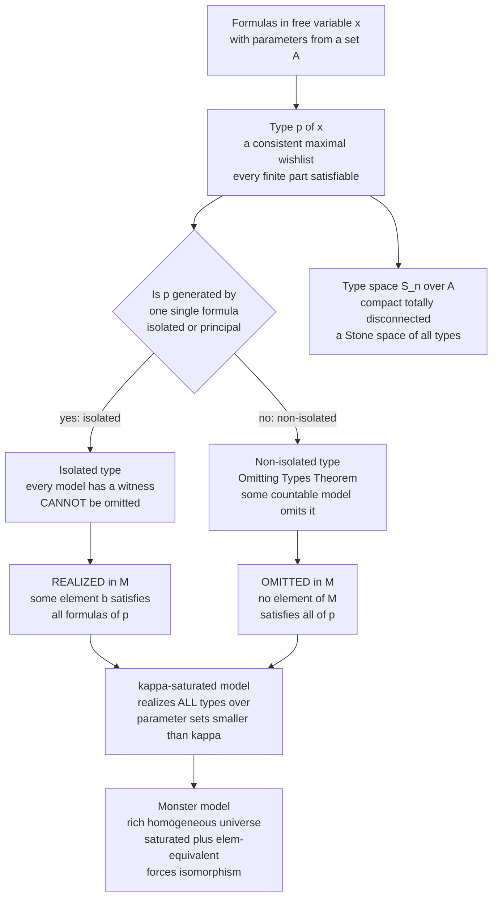

# 🧩 Types, Omitting, and Saturation

> [!abstract] TL;DR
> A **type** is a maximal consistent *wishlist* of first-order properties an element could have over a fixed set of parameters — a complete description of a "possible element." A type is **realized** if some element of the structure actually satisfies every formula in it, and **omitted** if none does. The **Omitting Types Theorem** says a *non-isolated* type can be dodged in a countable model, while a **saturated** model does the opposite — it realizes *every* type over every small parameter set, making it the maximally rich, homogeneous "monster" universe in which all of modern model theory (definability, stability, classification) is most cleanly carried out. The set of all types forms the **type space** `S_n(T)`, a compact totally disconnected **Stone space** — the topology that turns logic into geometry.

---

## Intuition

**Analogy — describing a person by an ever-growing list of properties.** Suppose you want to pin down a person you have never met by listing constraints: *taller than Alice, shorter than Bob, born in April, left-handed, older than Carol...* Each new property you add narrows the field. A **type** is such a list pushed to its logical extreme — a *maximal consistent wishlist* where, for **every** conceivable property, the list has already decided "yes, has it" or "no, lacks it." The list never contradicts itself, and any finite chunk of it describes somebody who really could exist.

Now the crucial twist. Some wishlists are **realized**: there genuinely is a person in the room who ticks every box. Other wishlists describe a **ghost** — every finite portion is satisfiable ("shorter than Bob and taller than Alice" is fine, "born in April" is fine), yet no single actual person in the room satisfies *all* of them at once. That ghost is a consistent type that the structure **omits**. The classic ghost is a *gap*: in the rational numbers, the wishlist "bigger than every rational whose square is below 2, smaller than every rational whose square is above 2" is perfectly consistent — but no rational fills it. That ghost is `√2`, and realizing it forces you into a larger universe.

A **saturated model** is the dream structure where *no ghost is missing*: every consistent wishlist over any small set of already-named parameters is actually realized by someone. It is the "complete cast" universe in which everything describable is present — and, being so rich, it is also maximally symmetric (homogeneous). Model theorists build one giant saturated **monster model** and do all their work inside it, because there nothing you can consistently describe is ever absent.

---

## How It Works

### Core Mechanics

1. **Fix a language and a theory.** Work in a complete first-order theory `T` (e.g. the theory `DLO` of dense linear orders without endpoints), and a model `M ⊨ T`. Pick a parameter set `A ⊆ M`.

2. **A type is a consistent bundle of formulas.** A *partial n-type over `A`* is a set `p(x₁,...,xₙ)` of formulas with parameters from `A` that is **finitely satisfiable**: every finite subset is realized by some tuple in some model. By **compactness**, finite satisfiability means the whole set is satisfiable — that is what makes a type *consistent*.

3. **Complete vs. partial.** A type is **complete** if for every formula `φ` (in those variables, over `A`) it contains either `φ` or `¬φ` — it *decides everything*, a maximal wishlist. A partial type only pins down some properties.

4. **Realized vs. omitted.** A type `p` is **realized** in `M` if some tuple `b ∈ Mⁿ` satisfies *every* formula of `p`; `b` is then a *realization*. If no tuple works, `M` **omits** `p`. Omission is only interesting for complete types that are not already satisfied — a "ghost" the model fails to instantiate.

5. **Isolated (principal) types can never be omitted.** A type `p` is **isolated** if a single formula `φ ∈ p` *generates* it: anything satisfying `φ` satisfies all of `p`. Since `T` proves `∃x φ`, *every* model contains a witness of `φ`, hence realizes `p`. Isolated types are unavoidable.

6. **The Omitting Types Theorem (Henkin–Orey).** Conversely, a **non-isolated** type over the empty set (or a countable set) *can* be dodged: there exists a **countable** model of `T` that **omits** it. This is the sharp counterpoint to realization — non-principal types are exactly the omittable ones.

7. **Saturation = realize everything small.** A model `M` is **κ-saturated** if it realizes *every* complete type over *every* parameter set `A ⊆ M` with `|A| < κ`. Being `ℵ₀`-saturated (`ω`-saturated) means realizing all types over **finite** parameter sets. A saturated model of its own cardinality realizes as much as possible and is **homogeneous** (any partial elementary map between small tuples extends to an automorphism).

8. **The payoff: monster models and rigidity.** Saturated models of the same cardinality that are **elementarily equivalent** are **isomorphic** (via a back-and-forth argument). This is why one fixes a huge saturated **monster model** `𝔐` and works inside it: every small type is realized, every definable set behaves uniformly, and automorphisms move realizations around freely.

9. **The type space is a Stone space.** Collect all complete `n`-types over `A` into `S_n(A)`. Give it the topology whose basic open sets are `[φ] = {p : φ ∈ p}`. The result is **compact** (compactness theorem), **Hausdorff**, and **totally disconnected** — a **Stone space**, dual to the Boolean algebra of formulas modulo `T`. Counting its points (how many types a theory has) is the seed of **stability theory** and the road to Morley's categoricity theorem.

### Flow / Architecture



---

## Key Concepts

### Secondary (intuitive, no advanced background needed)

- **Type = a complete wishlist of properties.** For every property, the list has already said "has it" or "lacks it," and no finite part of the list is contradictory.
- **Realized vs. omitted.** Realized = someone in the structure actually ticks every box. Omitted = every finite part of the list is satisfiable, yet no single element ticks them all — a "ghost."
- **The gap example.** In the rationals, "just below where `x² = 2` sits" is a consistent wishlist that no rational satisfies. The gap it names is `√2`, present only in a bigger number system.
- **Saturated model = the complete cast.** A universe so rich that every consistent wishlist over the elements you have already named is actually filled by somebody.

### Undergraduate (a first course in model theory / logic)

- **Complete n-type over `A`.** A maximal consistent set `p(x̄)` of `L(A)`-formulas; equivalently, `tp(b̄/A) = {φ : M ⊨ φ(b̄)}`, the set of all formulas a tuple `b̄` actually satisfies.
- **Consistency via compactness.** A set of formulas is a type iff it is finitely satisfiable; the **compactness theorem** upgrades "every finite piece has a model" to "the whole thing has a model."
- **Isolated / principal types.** Generated by one formula `φ`; because `T ⊢ ∃x φ`, they are realized in *every* model and therefore **never omittable**.
- **The Omitting Types Theorem.** For a countable language, any *non-isolated* type over `∅` is omitted by some **countable** model of `T`. The proof is a Henkin construction with an added "avoid `p`" requirement at each stage.
- **`ℵ₀`-saturation.** Realizing all types over **finite** parameter sets. `(ℚ, <)` is the countable saturated (`ω`-saturated) model of `DLO`.
- **Prime models.** The mirror image of saturated: a **prime model** elementarily embeds into every model and realizes *only* the isolated types — the *smallest* structure, existing exactly when the isolated types are dense in each `S_n(T)` (atomic model).

### Graduate (advanced model theory)

- **The type space `S_n(A)` as a Stone space.** Points are complete types; clopen basis `[φ] = {p : φ ∈ p}`. It is the **Stone dual** of the Lindenbaum–Tarski Boolean algebra of `L(A)`-formulas mod `T` — **compact**, **Hausdorff**, **totally disconnected**. Topology and logic become the same object; see [[Topological_Spaces]] and [[Compactness_and_Connectedness]].
- **Isolated point ⇔ isolated type.** A type is isolated in the model-theoretic sense iff it is a topologically isolated point of `S_n`. Omittable types are precisely the **non-isolated** points.
- **`κ`-saturation and existence.** A model of cardinality `κ` is saturated if it realizes all types over sets of size `< κ`. Saturated models of cardinality `κ` exist under mild set-theoretic hypotheses (e.g. `κ` regular with `κ = κ^{<κ}`, or `2^{<κ} = κ`); **stable** theories give them in more cardinals.
- **Uniqueness & the monster.** Any two elementarily equivalent saturated models of the same cardinality are **isomorphic** (back-and-forth). Practitioners fix one **monster model** `𝔐` — a `κ̄`-saturated, `κ̄`-homogeneous universe for `κ̄` larger than anything in sight — and treat all small models as elementary submodels.
- **Homogeneity.** In a saturated model, any partial elementary map between tuples of size `< κ` extends to an automorphism; realizations of a type form a single orbit of `Aut(𝔐/A)`.
- **Counting types → stability & categoricity.** The function `κ ↦ |S_n(A)|` for `|A| = κ` classifies theories: `ω`-**stable** theories have `≤ κ` types over every size-`κ` set. This is Shelah's engine and the route to **Morley's categoricity theorem** — a countable theory categorical in one uncountable cardinal is categorical in all.

---

## Python Demo

```python
# =====================================================================
# TYPES, OMITTING, and SATURATION in DLO (dense linear orders without
# endpoints), realized concretely in (Q, <).
#
# A 1-TYPE over a parameter set A is a maximal consistent set of formulas
# in one free variable x with parameters from A -- a complete "wishlist"
# saying where a hypothetical element x sits relative to every a in A.
# In a dense linear order a complete 1-type over a FINITE A={a1<...<an}
# is decided entirely by WHERE x falls:
#     x = a_i        (n equality types)
#     x in a gap     (n+1 open-interval types: below a1, between
#                     consecutive points, above an)
# => exactly 2n+1 complete types, ALL ISOLATED (principal): a single
# formula pins each gap/point. Isolated types CANNOT be omitted -- every
# model realizes them. So over FINITE parameters (Q,<) realizes
# everything: it is aleph_0-SATURATED.
#
# The interesting type lives over an INFINITE parameter set:
#     p(x) = { q < x : q in Q, q^2 < 2 } U { x < q : q in Q, q^2 > 2 }
# Every FINITE subset is satisfiable in Q (pick a rational near sqrt(2)),
# so p is a consistent type -- yet NO rational realizes it: p is OMITTED
# in Q. It is a NON-isolated type (a Dedekind cut). Realizing p forces a
# new element sqrt(2): a richer, more saturated model (R or a monster).
# numpy + matplotlib only.
# =====================================================================
import numpy as np
import matplotlib.pyplot as plt

# ---- (a) Complete 1-types over a FINITE parameter set A in (Q,<) -----
A = np.array([-2.0, -0.5, 1.0, 3.0])          # a1 < a2 < a3 < a4
n = len(A)

types = []                                    # (label, witness x, kind)
for i, a in enumerate(A):                     # equality types  x = a_i
    types.append((f"x = a{i+1}", a, "equality"))
types.append(("x < a1", A[0] - 1.0, "gap"))   # gap below the least point
for i in range(n - 1):                        # gaps between consecutive
    types.append((f"a{i+1} < x < a{i+2}", 0.5 * (A[i] + A[i + 1]), "gap"))
types.append((f"x > a{n}", A[-1] + 1.0, "gap"))  # gap above the greatest

print(f"Parameter set A has n = {n} points")
print(f"=> 2n+1 = {2*n+1} complete 1-types, all ISOLATED (finite S_1):")
for lab, rep, kind in types:
    print(f"   [{kind:8}] {lab:16}  realized by x = {rep:+.2f}")

# ---- (b) The OMITTED type: the Dedekind cut at sqrt(2) over Q --------
qs    = np.arange(1, 51) / 25.0               # rationals p/25 in (0, 2]
lower = qs[qs**2 < 2]                          # L: q^2 < 2   (need q < x)
upper = qs[qs**2 > 2]                          # U: q^2 > 2   (need x < q)
cut   = np.sqrt(2.0)                           # element realizing p (in R)

print(f"\nDedekind cut at sqrt(2) ~ {cut:.6f}")
print(f"   L = rationals with q^2 < 2 :  sup(L) = {lower.max():.4f}")
print(f"   U = rationals with q^2 > 2 :  inf(U) = {upper.min():.4f}")
print("   The gap between sup(L) and inf(U) holds NO rational")
print("   => the type p is consistent but OMITTED in (Q,<); R realizes it.")

# ---- Visualization --------------------------------------------------
fig, axes = plt.subplots(1, 3, figsize=(16, 5))

# Panel (a): the Dedekind cut = an omitted type in (Q,<)
ax = axes[0]
ax.axhline(0, color="black", lw=1)
ax.scatter(lower, np.zeros_like(lower), color="#2c7fb8", s=28, zorder=3,
           label="L: rationals q, q^2 < 2  (need q < x)")
ax.scatter(upper, np.zeros_like(upper), color="#d95f0e", s=28, zorder=3,
           label="U: rationals q, q^2 > 2  (need x < q)")
ax.axvline(cut, color="crimson", ls="--", lw=2,
           label="sqrt(2): no rational here -> type OMITTED")
ax.scatter([cut], [0], facecolor="white", edgecolor="crimson", s=150,
           lw=2, zorder=4, label="realization of p in a richer model (R)")
ax.set_xlim(0, 2.05); ax.set_ylim(-0.6, 0.6); ax.set_yticks([])
ax.set_xlabel("the rational line Q")
ax.set_title("(a) A type OMITTED in (Q,<):\nthe Dedekind cut at sqrt(2)")
ax.legend(loc="upper left", fontsize=7)

# Panel (b): the type space S_1 as a Stone space
ax = axes[1]
reps  = np.array([r for _, r, _ in types])
kinds = [k for _, _, k in types]
xs = np.interp(reps, (reps.min(), reps.max()), (0.05, 0.95))
for x, k in zip(xs, kinds):
    ax.scatter([x], [1.0], s=80, zorder=3,
               color="#31a354" if k == "equality" else "#756bb1")
ax.text(0.5, 1.30, "S_1 over FINITE A: 2n+1 ISOLATED points\n"
        "(finite + discrete -> nothing is omittable)",
        ha="center", fontsize=8)

xcut  = float(np.interp(cut, (0, 2), (0.05, 0.95)))
steps = 0.9 * 0.6 ** np.arange(1, 12)         # geometric accumulation
acc   = np.concatenate([xcut - steps, xcut + steps])
acc   = acc[(acc > 0.03) & (acc < 0.97)]
ax.scatter(acc, np.zeros_like(acc), color="#756bb1", s=26, zorder=3)
ax.scatter([xcut], [0], color="crimson", s=160, marker="*", zorder=4)
ax.text(0.5, -0.50, "S_1 over INFINITE Q: isolated gap-types (purple)\n"
        "ACCUMULATE at a non-isolated limit type: the cut (red star)",
        ha="center", fontsize=8)
ax.set_xlim(-0.02, 1.02); ax.set_ylim(-0.75, 1.65); ax.axis("off")
ax.set_title("(b) Type space S_1 as a Stone space\n"
             "(compact, totally disconnected)")

# Panel (c): saturated vs. not -- fraction of types realized
ax = axes[2]
labels     = ["types over\nFINITE A", "Dedekind-cut\ntype over Q"]
Q_realizes = [1.0, 0.0]                        # Q realizes finite, omits cut
saturated  = [1.0, 1.0]                        # richer model realizes both
x = np.arange(2); w = 0.35
ax.bar(x - w/2, Q_realizes, w, color="#2c7fb8",
       label="(Q,<): aleph_0-saturated")
ax.bar(x + w/2, saturated, w, color="#31a354",
       label="richer / saturated model")
for xi, v in zip(x - w/2, Q_realizes):
    ax.text(xi, v + 0.03, "realized" if v else "OMITTED", ha="center",
            fontsize=8, color="black" if v else "crimson")
ax.set_xticks(x); ax.set_xticklabels(labels, fontsize=8)
ax.set_ylabel("fraction of types realized"); ax.set_ylim(0, 1.25)
ax.set_title("(c) Saturation = realizing types.\n"
             "Q omits the cut; a saturated model realizes it")
ax.legend(fontsize=8, loc="upper center")

plt.tight_layout()
plt.savefig("types_omitting_saturation.png", dpi=130)
print("\nSaved figure to types_omitting_saturation.png")
```

Running it prints the `2n+1 = 9` complete 1-types over the finite parameter set (all isolated, hence realized by an explicit witness), then exhibits the Dedekind cut at `√2` as a **consistent but omitted** type in `(ℚ, <)` — the lower class `L` and upper class `U` sandwich a gap that no rational fills. The figure's three panels show: **(a)** the omitted cut on the rational line and its realization in `ℝ`; **(b)** the type space `S₁` as a **Stone space** — a *finite discrete* set of isolated points over a finite parameter set, versus infinitely many gap-types *accumulating* at a non-isolated limit (the cut) over the infinite set `ℚ`; and **(c)** the saturation contrast — `(ℚ, <)` realizes every type over finite parameters (`ℵ₀`-saturated) but omits the cut, while a richer, more saturated model realizes it.

---

## Real-World Applications

> **Example — nonstandard analysis is built on a saturated model.** Abraham Robinson's rigorous infinitesimals live in a **hyperreal field** `*ℝ` that is an `ℵ₁`-saturated (or larger) elementary extension of `ℝ`. Saturation is precisely what guarantees the *infinitesimals and infinite numbers exist*: the type "greater than `0`, less than `1`, less than `1/2`, less than `1/3`, ..." is finitely satisfiable, hence realized in a saturated extension — its realization *is* an infinitesimal. Every "ghost quantity" calculus ever gestured at becomes a genuine element because the model refuses to omit any consistent type.

Beyond the infinitesimal:

- **Ultraproducts and Łoś's theorem** manufacture saturated (or `ℵ₁`-saturated) models on demand; countably indexed ultrapowers are `ℵ₁`-saturated, which is *why* ultraproduct constructions realize so many types at once — the machinery behind nonstandard models of arithmetic and analysis.
- **Algebra of definable sets.** In stable theories (algebraically closed fields, modules, differentially closed fields), the monster model is where *forking independence*, generic points, and Zariski-style dimension theory are defined. Model-theoretic algebra (Hrushovski's proofs in Diophantine geometry, the Mordell–Lang conjecture) all runs inside a saturated universe.
- **Databases and constraint satisfaction.** A conjunctive query's answers over an "infinite generic" instance correspond to realized types; homogeneous/`ω`-saturated structures (Fraïssé limits like the random graph) model "the generic database," and type-counting bounds query complexity.
- **Automated reasoning and `SMT`.** Finite model finders and quantifier-instantiation heuristics implicitly search for realizations of types; recognizing when a type is *isolated* (finitely axiomatizable) tells a solver when a witness is guaranteed.

---

## Common Pitfalls

- **Confusing a type with a single formula.** A formula is *one* constraint; a type is a *maximal consistent bundle* of infinitely many. "Being pinned down by a single formula" is exactly the special case of an **isolated** type — and those are the least interesting, because they can never be omitted.
- **Forgetting that "complete type" means *maximal* consistent.** A partial type merely lists some properties; a **complete** type decides `φ` or `¬φ` for *every* formula. Realizing/omitting arguments and the Stone-space topology are about complete types (the *points* of `S_n`); partial types are the *closed subsets*.
- **Blurring realizing vs. omitting.** Realized = *some* tuple in the model satisfies *all* of `p` simultaneously; omitted = every finite piece is satisfiable somewhere, but *no single element of this model* satisfies the whole thing. Finite satisfiability (consistency) never by itself guarantees realization — that is the entire point of the gap example.
- **Thinking saturation means "realize every type, period."** `κ`-saturation only requires realizing types over parameter sets of size **`< κ`**. `(ℚ, <)` is `ℵ₀`-saturated yet omits the Dedekind cut — because that cut is a type over an *infinite* (`ℵ₀`-sized) parameter set, not a finite one. Saturation is always relative to *small* parameter sets.
- **Trying to omit an isolated type.** Isolated (principal) types are realized in **every** model — the Omitting Types Theorem applies *only* to **non-isolated** types. "Non-isolated" is not a technical footnote; it is the exact dividing line between omittable and unavoidable.
- **Over-reading countability in the Omitting Types Theorem.** It yields a *countable* model omitting the type and needs a *countable language*; it does not say the type is omitted in *all* models, nor does it omit uncountably many non-isolated types simultaneously without extra care (that needs the countable version applied to a countable family).

---

## Related Concepts

- [[Mathematical_Logic_Overview]] — the vault entry point; this note deepens the **model theory** pillar surveyed there, sharpening the `M ⊨ φ` satisfaction relation into types and saturation.
- [[Mathematical_Logic_and_Set_Theory]] — the single-note survey where **compactness** and **Löwenheim–Skolem** appear; those are exactly the theorems that make types consistent and give small/large models to realize or omit them.
- [[Topological_Spaces]] — the type space `S_n(T)` *is* a topological space; its clopen basis `[φ]` and the Stone-duality with Boolean algebras of formulas make model theory geometric.
- [[Compactness_and_Connectedness]] — the type space is **compact** (from the compactness theorem) and **totally disconnected**; "isolated point" here means exactly "isolated type," the ones that cannot be omitted.
- [[Real_Numbers_and_Completeness]] — the driving example: `√2` is the **Dedekind cut** type omitted by `(ℚ, <)` and realized by the complete field `ℝ`; completeness is realization of every cut-type.
- [[Set_Theory_and_Relations]] — types are sets of formulas and the existence of saturated models depends on **cardinal arithmetic** (`κ = κ^{<κ}`), tying model theory to set-theoretic assumptions.

*Sibling notes in this Model Theory section (planned):* **Model_Theory_Foundations** develops the satisfaction relation and definability that types refine; **Elementary_Equivalence_and_Embeddings** supplies the back-and-forth argument behind "saturated + elementarily equivalent ⟹ isomorphic"; **Categoricity_and_Morley_Theorem** turns type-counting into Shelah's stability program; and **Ultraproducts_and_Nonstandard_Analysis** is the standard machine for building the saturated models this note describes.

---

## Review Questions

### Secondary

1. In plain language, what is the difference between a wishlist of properties that is *realized* and one that is *omitted*? Give an everyday example of a consistent wishlist that no one in a particular room satisfies.
2. Why does the wishlist "bigger than every rational whose square is under 2, smaller than every rational whose square is over 2" describe a "ghost" in the rational numbers? What familiar number is that ghost, and where does it actually live?
3. What does it mean, intuitively, for a model to be *saturated* — the "complete cast" idea — and why would such a universe have no missing ghosts?

### Undergraduate

1. Define a **complete `n`-type over `A`** and explain why finite satisfiability (via the compactness theorem) is enough for a set of formulas to count as a genuine type. How is `tp(b̄/A)` a complete type?
2. Prove that an **isolated** (principal) type is realized in every model of `T`. Conclude why the Omitting Types Theorem must restrict to *non-isolated* types.
3. Show that `(ℚ, <)` realizes every complete 1-type over a **finite** parameter set (so it is `ℵ₀`-saturated), yet omits the Dedekind-cut type over the **infinite** set `ℚ`. Why is this not a contradiction with the definition of saturation?

### Graduate

1. Describe the topology on `S_n(T)` and prove it is **compact** and **totally disconnected** (a Stone space). Identify, in topological terms, which types are isolated and therefore not omittable, and state the Stone duality with the Lindenbaum–Tarski Boolean algebra of formulas.
2. State the theorem that two elementarily equivalent **saturated** models of the same cardinality are isomorphic, and sketch the **back-and-forth** argument, pointing out exactly where saturation and homogeneity are used.
3. Explain how the map `κ ↦ |S_n(A)|` (for `|A| = κ`) classifies theories as **stable** or **unstable**, and outline how bounding the number of types over models feeds into **Morley's categoricity theorem**. Where does the existence of large saturated ("monster") models enter the argument?

---

## Sources

- Marker, D. *Model Theory: An Introduction*. Graduate Texts in Mathematics 217, Springer, 2002 — Ch. 4 (types) and Ch. 4–6 (omitting types, saturation, prime and homogeneous models); the standard modern text.
- Chang, C. C. & Keisler, H. J. *Model Theory*, 3rd ed. North-Holland / Dover, 1990 — the classical reference; Ch. 2 (compactness), Ch. 5 (saturated and special models), including omitting types and the type-space topology.
- Hodges, W. *Model Theory*. Encyclopedia of Mathematics and its Applications 42, Cambridge University Press, 1993 (and the shorter *A Shorter Model Theory*, 1997) — thorough treatment of types, saturation, homogeneity, and the monster-model methodology.
- Tent, K. & Ziegler, M. *A Course in Model Theory*. Cambridge University Press, 2012 — clean modern development of types, the Stone space `S_n`, saturation, and the road into stability theory.
- Henkin, L. (1954) and Orey, S. (1956) — the original **Omitting Types Theorem**; see also the historical account in Chang & Keisler §2.2.

---

#mathematical-logic #types #saturation #model-theory #stone-space
