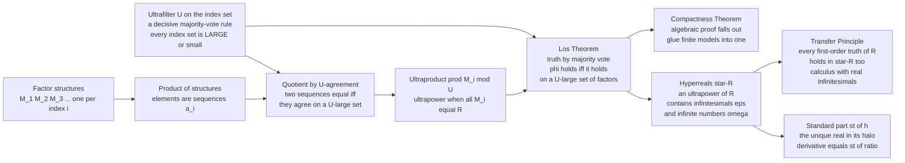

# 🔭 Ultraproducts and Nonstandard Analysis

> [!abstract] TL;DR
> An **ultraproduct** glues infinitely many first-order structures `M_i` into a single new structure by taking sequences and identifying two of them whenever they **agree on a "large" set of indices**, where "large" is decided by an **ultrafilter** `U` — a razor-sharp majority-vote rule that calls *every* set of indices either large or small. **Łoś's theorem** (the fundamental theorem of ultraproducts) says a first-order sentence is true in the ultraproduct exactly when it is true in *U-almost all* factors — truth is literally decided by majority vote, which also yields a purely algebraic proof of the **compactness theorem**. Applied to infinitely many copies of `ℝ` (an **ultrapower**), this builds the **hyperreals** `*ℝ`: a genuine ordered field that contains **infinitesimals** (numbers `ε` with `0 < ε < 1/n` for every `n`) and **infinite** numbers, yet in which — by the **transfer principle** — every first-order theorem about `ℝ` still holds. Abraham Robinson used exactly this to make Leibniz's infinitesimal calculus rigorous 300 years after the fact.

---

## Intuition

**Analogy — resurrecting a ghost that everyone used but no one believed in.** When Newton and Leibniz invented calculus in the 1600s, they computed derivatives by dividing by an **infinitesimal** `dx` — a quantity "smaller than any positive number but not zero" — and then blithely threw it away at the end. It worked spectacularly, and it was also, by the lights of rigorous mathematics, *nonsense*: no real number is both positive and smaller than every `1/n`. For three centuries mathematicians used infinitesimals in private and denied them in public, eventually replacing them entirely with the clumsy but airtight `ε`–`δ` limits of Weierstrass. The ghost was exorcised — calculus became rigorous by *banishing* the very idea that made it intuitive.

Then, in 1961, Abraham Robinson brought the ghost back — alive and licensed. The trick: don't try to find one infinitesimal inside `ℝ` (there is none). Instead **build a bigger number system out of infinitely many copies of `ℝ`**. Take the sequence `(1, 1/2, 1/3, 1/4, …)`. As a single real number it is nothing — it *converges* to 0. But as a brand-new *object*, compared to the constant sequences `(c, c, c, …)`, it is **eventually smaller than every positive real `c`** yet **always strictly positive**. If you agree to treat two sequences as "the same number" whenever they agree on a *large* set of indices — where an **ultrafilter** supplies a perfectly consistent, all-or-nothing notion of "large" — then `(1, 1/2, 1/3, …)` becomes a legitimate positive **infinitesimal**, and `(1, 2, 3, …)` becomes a legitimate **infinite** number. This extended field, the **hyperreals** `*ℝ`, is not a hack: by Łoś's theorem *every* first-order truth about `ℝ` transfers to it unchanged. Leibniz was right all along; he was just 300 years early to a rigor that model theory finally supplied.

---

## How It Works

### Core Mechanics

Fix an **index set** `I` (think `I = ℕ`) and a first-order structure `M_i` for each `i ∈ I`.

1. **Filters and ultrafilters — a calculus of "large" sets.** A **filter** `F` on `I` is a collection of subsets of `I` deemed "large," closed upward (a superset of a large set is large) and under finite intersection (two large sets overlap in a large set), with `∅` never large. An **ultrafilter** `U` is a *maximal* filter: it is **decisive** — for *every* subset `A ⊆ I`, exactly one of `A` and its complement `I ∖ A` is in `U`. That is the majority-vote rule. A **principal** ultrafilter is "all sets containing one fixed point `i₀`" (boring — it just reads off factor `i₀`); a **non-principal** (free) ultrafilter contains *all cofinite sets* (every finite set is small) and gives genuinely new behavior. Non-principal ultrafilters cannot be written down explicitly — their existence rests on the **ultrafilter lemma**, a weak form of the Axiom of Choice.

2. **The product and the quotient.** Form the Cartesian product `∏ M_i`: its elements are **sequences** `a = (a_i)` picking one element from each `M_i`. Now identify sequences that **agree on a U-large set**: define `a ~ b` iff `{ i : a_i = b_i } ∈ U`. Decisiveness makes `~` a genuine equivalence relation. The **ultraproduct** is the set of equivalence classes, written `∏ M_i / U`. When all factors are the same structure `M`, this is the **ultrapower** `M^I / U`.

3. **Interpreting the symbols by majority vote.** Functions act coordinatewise; a relation `R` holds of classes `[a], [b]` exactly when `{ i : R(a_i, b_i) } ∈ U`. The constant real `r` embeds as the class of the constant sequence `(r, r, r, …)` — this diagonal embedding makes `ℝ ⊆ *ℝ`.

4. **Łoś's theorem — truth is a majority vote.** For any first-order formula `φ` and elements `[a¹], …, [aⁿ]` of the ultraproduct,
   `∏ M_i / U ⊨ φ([a¹], …, [aⁿ])` **iff** `{ i : M_i ⊨ φ(a¹_i, …, aⁿ_i) } ∈ U`.
   A sentence is true in the ultraproduct precisely when it is true in *U-almost all* factors. This is the fundamental theorem of the whole subject.

5. **Compactness for free.** Łoś gives a slick algebraic proof of the **compactness theorem**: if every finite subset of a theory `T` has a model, index the finite subsets, build a model `M_i` for each, and take the ultraproduct over an ultrafilter concentrating on the sets "containing sentence `σ`." Each axiom is satisfied on a large set, so by Łoś it holds in the ultraproduct — one model of all of `T` at once (see the sibling note *Compactness_and_Lowenheim_Skolem*).

6. **The hyperreals and transfer.** Take `M_i = (ℝ, +, ·, <, …)` for all `i` and a non-principal `U`: the ultrapower is `*ℝ`, the **hyperreals**. Because `ℝ` and `*ℝ` satisfy exactly the same first-order sentences (Łoś with the constant embedding), the **transfer principle** holds — *every* first-order statement true of the reals is true of the hyperreals. Yet `*ℝ` is a **proper** extension: the class of `(1, 1/2, 1/3, …)` is a positive **infinitesimal** `ε` (smaller than every real `1/n`), and `(1, 2, 3, …)` is **infinite** (bigger than every real). Every finite hyperreal `h` sits infinitely close to a unique real `st(h)`, its **standard part** (the real at the center of its **halo/monad**), and you do calculus by computing with `ε` and then taking `st`.

### Flow / Architecture



---

## Key Concepts

### Secondary Level

**An infinitesimal is a number that never gives up.** Picture the shrinking sequence `1, 1/2, 1/3, 1/4, …`. Each term is a perfectly ordinary positive number, and the terms march toward zero without ever reaching it. Now *freeze that whole process into a single new number* `ε`. Compared to any fixed positive real you name — `0.1`, `0.001`, `0.0000001` — `ε` is eventually smaller, because the sequence eventually dips below it. But `ε` is never zero, because every term is positive. So `ε` is **positive and smaller than every ordinary positive number**: an **infinitesimal**. Flip it over and `1/ε` behaves like `1, 2, 3, …` — bigger than any number you can name: an **infinite** number.

**Why this was forbidden — and why it is now allowed.** No *real* number can be an infinitesimal; the real line has no room for one. The move is not to squeeze `ε` into the reals but to **build a wider number line** — the **hyperreals** — that has all the reals *plus* infinitesimals and infinite numbers packed around them. The everyday laws of arithmetic still work there, so you can finally compute the way Newton and Leibniz did — "slope = tiny rise over tiny run" — without cheating.

### Undergraduate Level

**Filters make "large" precise.** A filter answers "which sets of indices count as big?" with three rules: `I` is big; the intersection of two big sets is big; any superset of a big set is big; `∅` is never big. The **cofinite (Fréchet) filter** — "big = misses only finitely many indices" — captures "eventually," but it is *not* decisive: `{evens}` and `{odds}` are both co-infinite, so the filter refuses to rule on either. An **ultrafilter extends the Fréchet filter and forces a verdict on every set**, breaking every tie consistently. This decisiveness is exactly what makes coordinatewise definitions well-defined.

**The ultrapower construction, concretely.** Take `ℝ^ℕ / U`. A hyperreal is an equivalence class `[a_1, a_2, a_3, …]`. Arithmetic is coordinatewise; order is by majority: `[a] < [b]` iff `{ i : a_i < b_i } ∈ U`. Because `U` is decisive, exactly one of `[a] < [b]`, `[a] = [b]`, `[a] > [b]` holds — `*ℝ` is a **totally ordered field**. The reals embed as constant sequences. The class of `(1/n)` is a positive infinitesimal; the class of `(n)` is infinite; `(1, 0, 1, 0, …)` equals `1` or `0` depending on whether `U` votes "evens" or "odds" large.

**Standard part and the halo.** Every *finite* hyperreal `h` (bounded by some real) lies infinitely close to exactly one real number `st(h)` — the **standard part**. The set of hyperreals infinitely close to a real `r` is its **halo** (or **monad**); the reals are the "shadows" the halos cast. Continuity, limits, and derivatives all get one-line infinitesimal definitions: `f` is continuous at `a` iff `x ≈ a ⇒ f(x) ≈ f(a)`; the derivative is `st((f(a+ε) − f(a)) / ε)` for any nonzero infinitesimal `ε`.

**Transfer, stated carefully.** By Łoś, `ℝ` and `*ℝ` are **elementarily equivalent**: they satisfy the same **first-order** sentences over the language of ordered fields (with function/relation symbols for `sin`, `exp`, each real constant, etc.). So "for all `x`, `sin²x + cos²x = 1`" transfers verbatim to `*ℝ` — including hyperreal `x`. Transfer is a two-way bridge: prove a first-order fact in whichever field is easier and carry it across.

### Graduate Level

**Łoś's theorem as the engine.** The proof is an induction on formula complexity; the only subtle step is the existential quantifier, which needs the Axiom of Choice to pick witnesses coordinatewise. Łoś simultaneously yields: (i) **compactness** (glue finite models); (ii) a transparent source of **non-standard models of arithmetic** (ultrapowers of `(ℕ, +, ·, <)` contain infinite "hypernaturals"); and (iii) elementary equivalence `M ≡ M^I/U` for any structure and any ultrafilter.

**Saturation.** Countably-indexed ultrapowers over a non-principal `U` on `ℕ` are **ℵ₁-saturated**: every countable, finitely-satisfiable set of formulas with parameters is realized. Saturation is *why* infinitesimals and infinite numbers must exist — the type `{ 0 < x } ∪ { x < 1/n : n ∈ ℕ }` is finitely satisfiable, so it is realized by some `ε`. Saturation underlies many model-theoretic proofs (see the sibling note *Types_Omitting_and_Saturation*).

**Ultraproducts in algebra and combinatorics.** The **Ax–Kochen theorem** (1965) — for each degree `d` there is a bound `N` such that every homogeneous polynomial of degree `d` in more than `d²` variables over the `p`-adics `ℚ_p` has a nontrivial zero for all but finitely many primes `p` — is proved by showing `∏ ℚ_p / U ≡ ∏ 𝔽_p((t)) / U`, transferring a fact from formal power series to `p`-adics. In combinatorics, **ultralimits / nonstandard hulls** give clean proofs of density results in the spirit of **Szemerédi's theorem** and underpin the **Furstenberg correspondence** between combinatorics and ergodic theory.

**Loeb measures.** Peter Loeb turned the finitely-additive counting measure on a *hyperfinite* set into a genuine, countably-additive (standard) measure — the **Loeb measure** — giving nonstandard constructions of Lebesgue measure, Wiener measure, and Brownian motion, and clean existence proofs in probability, PDE, and stochastic analysis.

**Where transfer stops.** Transfer applies **only to first-order statements**. Second-order/external notions — "is a *standard* natural number," "the set of all infinitesimals," "the least upper bound of a *bounded* set" — are **not** first-order and do *not* transfer. Indeed the set of infinitesimals has no least upper bound in `*ℝ`, so `*ℝ` is **non-Archimedean and not order-complete** (Dedekind completeness is second-order). This is the precise fault line between what nonstandard analysis gives you for free and what it does not.

---

## Python Demo

```python
"""
BUILDING INFINITESIMALS AS AN ULTRAPOWER OF THE REALS.

We represent a HYPERREAL as a SEQUENCE of reals (indexed by n = 1, 2, 3, ...),
identified modulo an ultrafilter U on the naturals. We can't write down a real
non-principal U (its existence needs the Axiom of Choice), but for the MONOTONE
sequences below the FRECHET / cofinite filter -- the "eventually" rule, which any
non-principal U extends -- already decides every comparison we make. So we
implement '[a] < [b]'  as  'a_n < b_n for all sufficiently large n'  (a tail /
majority vote on indices).

We show:
  (a) eps = (1, 1/2, 1/3, ...)  is a POSITIVE INFINITESIMAL: 0 < eps < 1/k
      for every natural k;  omega = (1, 2, 3, ...) is INFINITE: omega > M for
      every real M;  and 1/omega = eps.
  (b) the TRANSFER PRINCIPLE / Los in action: the derivative of f(x)=x^2 as the
      STANDARD PART of (f(x+eps) - f(x)) / eps, which equals 2x exactly.
"""

import numpy as np
import matplotlib.pyplot as plt

# Truncate the index set to n = 1..N for numerics; "eventually" = the tail.
N = 5000
n = np.arange(1, N + 1, dtype=float)          # indices 1, 2, 3, ...


class Hyperreal:
    """A hyperreal as a real sequence (a_n) mod the 'eventually' ultrafilter."""
    def __init__(self, seq, name=""):
        self.seq = np.broadcast_to(np.asarray(seq, dtype=float), (N,)).copy()
        self.name = name

    # coordinatewise field operations
    def __add__(self, o):  return Hyperreal(self.seq + _s(o))
    def __sub__(self, o):  return Hyperreal(self.seq - _s(o))
    def __mul__(self, o):  return Hyperreal(self.seq * _s(o))
    def __truediv__(self, o): return Hyperreal(self.seq / _s(o))
    def __rsub__(self, o): return Hyperreal(_s(o) - self.seq)

    def eventually_less(self, o, tail=0.5):
        """[self] < [o] : true for all n beyond the halfway index (a majority vote)."""
        k = int(N * (1 - tail))
        return bool(np.all(self.seq[k:] < _s(o)[k:]))

    def eventually_greater(self, o, tail=0.5):
        k = int(N * (1 - tail))
        return bool(np.all(self.seq[k:] > _s(o)[k:]))

    def standard_part(self):
        """st(h): the unique real infinitely close to a FINITE hyperreal h
        = the limit of its representing sequence (estimated from the tail)."""
        return float(np.round(self.seq[-1], 6))


def _s(o):
    """Coerce a Python number or Hyperreal to its representing sequence."""
    return o.seq if isinstance(o, Hyperreal) else np.full(N, float(o))


def R(c):
    """Embed a real c as the constant hyperreal (c, c, c, ...)."""
    return Hyperreal(np.full(N, float(c)), name=f"{c}")


# ---------------------------------------------------------------------------
# (a) An infinitesimal and an infinite number
# ---------------------------------------------------------------------------
eps   = Hyperreal(1.0 / n, name="eps = (1, 1/2, 1/3, ...)")   # positive infinitesimal
omega = Hyperreal(n,       name="omega = (1, 2, 3, ...)")     # infinite number

print("=== (a) Infinitesimals and infinite numbers in *R ===\n")
print(f"eps  > 0 ?            {eps.eventually_greater(0)}")
print("0 < eps < 1/k  for k = 1..6 ?")
for k in range(1, 7):
    print(f"    eps < 1/{k} = {1/k:.4f} ?   {eps.eventually_less(1.0/k)}")
print(f"\nomega is INFINITE (omega > M) for M in 10, 1e3, 1e6 ?")
for M in (10.0, 1e3, 1e6):
    print(f"    omega > {M:>10.0f} ?   {omega.eventually_greater(M)}")

recip = R(1.0) / omega                         # 1 / omega
print(f"\n1/omega equals eps ? (same sequence)   "
      f"{np.allclose(recip.seq, eps.seq)}")
print("=> eps is a genuine positive infinitesimal; omega its infinite reciprocal.\n")

# ---------------------------------------------------------------------------
# (b) Transfer / Los: a derivative via an infinitesimal, then standard part
#     f(x) = x^2  =>  (f(x+eps) - f(x)) / eps = 2x + eps  =>  st(...) = 2x
# ---------------------------------------------------------------------------
def f(h):                                      # first-order term x^2 transfers to *R
    return h * h

x0 = 3.0
x  = R(x0)
diff_quotient = (f(x + eps) - f(x)) / eps      # hyperreal 2x + eps, still has a halo
derivative    = diff_quotient.standard_part()  # take the shadow -> exact real 2x

print("=== (b) Nonstandard derivative of f(x) = x^2 at x = 3 ===")
print(f"(f(x+eps) - f(x)) / eps  ~  2x + eps  (its tail -> {diff_quotient.seq[-1]:.6f})")
print(f"standard part  st(2x + eps) = {derivative}   (exact analytic value 2x = {2*x0})")

# ---------------------------------------------------------------------------
# Visualization
# ---------------------------------------------------------------------------
fig, (ax1, ax2, ax3) = plt.subplots(1, 3, figsize=(16, 5))
m = np.arange(1, 41)                            # plot the first 40 indices

# Panel 1: eps dips below every positive real threshold -> infinitesimal
ax1.plot(m, 1.0 / m, "o-", color="#2563eb", ms=4, lw=1.6,
         label="eps_n = 1/n")
for k, col in zip((1, 2, 4), ("#dc2626", "#ea580c", "#ca8a04")):
    ax1.axhline(1.0 / k, ls="--", color=col, lw=1.3,
                label=f"real threshold 1/{k}")
ax1.axhline(0, color="black", lw=1)
ax1.set_title("eps = (1, 1/2, 1/3, ...) is INFINITESIMAL\n"
              "positive, yet eventually below every 1/k", fontsize=10)
ax1.set_xlabel("index n"); ax1.set_ylabel("value")
ax1.legend(fontsize=8); ax1.grid(alpha=0.3)

# Panel 2: omega grows past every real bound -> infinite
ax2.plot(m, m, "s-", color="#7c3aed", ms=4, lw=1.6, label="omega_n = n")
for M, col in zip((10, 20, 30), ("#dc2626", "#ea580c", "#ca8a04")):
    ax2.axhline(M, ls="--", color=col, lw=1.3, label=f"real bound M = {M}")
ax2.set_title("omega = (1, 2, 3, ...) is INFINITE\n"
              "eventually above every real bound M", fontsize=10)
ax2.set_xlabel("index n"); ax2.set_ylabel("value")
ax2.legend(fontsize=8); ax2.grid(alpha=0.3)

# Panel 3: nonstandard derivative 2x + eps -> standard part 2x
dq = 2 * x0 + 1.0 / m                            # tail of the difference quotient
ax3.plot(m, dq, "o-", color="#059669", ms=4, lw=1.6,
         label="(f(x+eps)-f(x))/eps = 2x + eps")
ax3.axhline(2 * x0, ls="--", color="#dc2626", lw=1.6,
            label=f"standard part st(...) = 2x = {2*x0:.0f}")
ax3.set_title("Transfer at work: nonstandard derivative of x^2\n"
              "compute with eps, then take the standard part", fontsize=10)
ax3.set_xlabel("index n"); ax3.set_ylabel("difference quotient")
ax3.legend(fontsize=8); ax3.grid(alpha=0.3)

plt.tight_layout()
plt.savefig("ultraproduct_hyperreals.png", dpi=120, bbox_inches="tight")
plt.show()
```

**Expected output (abridged):**

```
=== (a) Infinitesimals and infinite numbers in *R ===

eps  > 0 ?            True
0 < eps < 1/k  for k = 1..6 ?
    eps < 1/1 = 1.0000 ?   True
    eps < 1/2 = 0.5000 ?   True
    ...
omega is INFINITE (omega > M) for M in 10, 1e3, 1e6 ?
    omega > 1000000 ?   True
1/omega equals eps ? (same sequence)   True

=== (b) Nonstandard derivative of f(x) = x^2 at x = 3 ===
(f(x+eps) - f(x)) / eps  ~  2x + eps  (its tail -> 6.000200)
standard part  st(2x + eps) = 6.0002   (exact analytic value 2x = 6.0)
```

The demo makes the construction tangible: a hyperreal *is* a sequence, comparison *is* an "eventually" vote on indices, and `eps = (1/n)` sits strictly between `0` and every real `1/k` — the defining property of an infinitesimal, impossible inside `ℝ` itself. Part (b) computes a derivative the Leibniz way — perturb by `ε`, divide, discard the halo via `standard_part` — and lands on the exact answer `2x`, because the first-order identity `(x+ε)² − x² = 2xε + ε²` **transfers** from `ℝ` to `*ℝ`. (With a larger `N` the printed tail `6.0002` tightens toward the true `6.0`; the *standard part* is exactly `2x`.)

---

## Real-World Applications

> **Rigorous infinitesimal calculus and teaching.** Robinson's nonstandard analysis, popularized in H. Jerome Keisler's textbook *Elementary Calculus: An Infinitesimal Approach*, lets students define derivatives and integrals directly with infinitesimals — `dy/dx` really is a ratio, and `∫ f dx` really is a hyperfinite sum — recovering Leibniz's intuition on a rigorous footing.

> **Nonstandard proofs in analysis, probability, and PDE.** Many theorems get shorter, more conceptual proofs: **Loeb measures** build Lebesgue and Wiener measure and Brownian motion from hyperfinite counting; nonstandard hulls give existence results for stochastic differential equations and for solutions of nonlinear PDE (Perkins' work on super-Brownian motion; Albeverio–Fenstad–Høegh-Krohn–Lindstrøm's monograph).

> **Ultraproducts in algebra and number theory.** The **Ax–Kochen theorem** on zeros of forms over the `p`-adics is proved by an ultraproduct that identifies `∏ ℚ_p / U` with `∏ 𝔽_p((t)) / U`, transferring a solvability fact across characteristic. Ultraproducts are now a standard tool across model-theoretic algebra (fields, valued fields, groups) and give a uniform "for almost all primes" language.

> **Additive combinatorics and ergodic theory.** **Ultralimits** and the nonstandard/**Furstenberg correspondence** convert density statements about finite sets into statements about a single measure-preserving system, giving clean routes to Szemerédi-type theorems and to results in Terence Tao's and others' work on arithmetic progressions.

> **Compactness as a proof tool.** Because Łoś yields the compactness theorem, ultraproducts are the standard "make an object with infinitely many prescribed properties" gadget — building non-standard models of arithmetic (with genuine infinite integers), saturated models, and objects satisfying any finitely-satisfiable wish list.

---

## Common Pitfalls

- **"Just write down a non-principal ultrafilter."** You cannot — their existence is **non-constructive**, following from the ultrafilter lemma / Axiom of Choice, and no explicit example exists in ZF alone. In demos the *cofinite / "eventually"* filter suffices only because the sequences chosen are monotone and so already decided; a general pair of sequences (like `(1,0,1,0,…)` vs `(0,1,0,1,…)`) needs the ultrafilter to actually break the tie, and *which* way it breaks is not something you can compute.

- **Confusing "eventually" with "for all indices."** The equality/order relations are about **U-large** sets of indices, *not* all of them. `(1, 0, 0, 0, …)` equals the real `0` in the ultrapower (they agree cofinitely), even though they differ at `n = 1`. Two hyperreals can disagree on any finite — indeed any U-small — set of coordinates and still be *the same number*.

- **Expecting *everything* to transfer.** Transfer is for **first-order** sentences only. "Is a standard integer," "the set of all infinitesimals," and "every bounded set has a least upper bound" (Dedekind completeness) are **external / second-order** and do **not** transfer. `*ℝ` is non-Archimedean and *not* order-complete — the infinitesimals have no least upper bound in `*ℝ`. Assuming a favorite real-analysis fact carries over without checking it is genuinely first-order is the classic error.

- **Forgetting to take the standard part (or taking it of an infinite number).** A nonstandard derivative like `2x + ε` is *infinitely close to* the answer but is not itself real; you must apply `st(·)` to land back in `ℝ`. And `st` is only defined for **finite** hyperreals — `st(ω)` is undefined (informally `±∞`), so dividing by an infinitesimal and forgetting you may have produced an infinite quantity is a real trap.

- **Mistaking hyperreals for the surreals (or other infinitesimal systems).** The hyperreals `*ℝ` are one specific ultrapower-based ordered field satisfying transfer; Conway's **surreal numbers**, the **Levi-Civita field**, and **dual numbers** (`ε² = 0`, used in automatic differentiation) are *different* systems with different properties. Dual numbers, e.g., are not even totally ordered and have nilpotents; only the hyperreals give the full first-order transfer principle.

---

## Related Concepts

- [[Mathematical_Logic/01_Foundations_of_Formal_Logic/Compactness_and_Lowenheim_Skolem|Compactness and Löwenheim-Skolem]] — Łoś's theorem gives a direct *algebraic* proof of compactness, and Löwenheim-Skolem is what makes non-standard models (with infinitesimals and infinite integers) unavoidable; this note is the model-theoretic sequel.
- [[Mathematical_Logic/01_Foundations_of_Formal_Logic/First_Order_Predicate_Logic|First-Order Predicate Logic]] — ultraproducts operate on first-order **structures** and Łoś quantifies over first-order **formulas**; transfer works *only* because the statements are first-order.
- [[Mathematical_Logic/01_Foundations_of_Formal_Logic/Mathematical_Logic_Overview|Mathematical Logic Overview]] — situates model theory (structures and truth) among the four pillars of logic; the map this note lives on.
- [[Mathematics/14_Advanced_Topics/Mathematical_Logic_and_Set_Theory|Mathematical Logic and Set Theory]] — the advanced-topics vantage on models, the Axiom of Choice, and cardinality that the ultrafilter lemma and saturation draw on.
- [[Mathematics/08_Real_Analysis/Real_Numbers_and_Completeness|Real Numbers and Completeness]] — the hyperreals are a *non-Archimedean, non-order-complete* extension of `ℝ`; contrasting them sharpens exactly what the completeness axiom (a second-order property) buys you.
- [[Mathematics/08_Real_Analysis/Sequences_and_Limits_in_Analysis|Sequences and Limits in Analysis]] — a hyperreal literally *is* a sequence of reals modulo an ultrafilter; a convergent sequence's limit is the standard part of the hyperreal it names.
- [[Mathematics/08_Real_Analysis/Continuity_and_Uniform_Continuity|Continuity and Uniform Continuity]] — nonstandard analysis restates continuity as `x ≈ a ⇒ f(x) ≈ f(a)` and *uniform* continuity as its transfer to all hyperreal `x`, making the ε–δ distinction a one-line halo statement.
- [[Mathematics/02_Calculus/Differentiation|Differentiation]] — the derivative becomes `st((f(a+ε) − f(a))/ε)`, Leibniz's ratio of infinitesimals made rigorous.
- [[Mathematics/02_Calculus/Limits_and_Continuity|Limits and Continuity]] — limits translate to standard parts and infinitesimal closeness, the intuition that `ε`–`δ` had replaced.
- [[Mathematics/02_Calculus/Sequences_and_Series|Sequences and Series]] — the raw material of the ultrapower; index sequences and their tail behavior are the "coordinates" of hyperreals.
- [[Mathematics/04_Discrete_Mathematics/Set_Theory_and_Relations|Set Theory and Relations]] — filters and ultrafilters are structured collections of *sets*, and the ultraproduct is a *quotient by an equivalence relation*; both are set-theoretic constructions.
- [[Mathematics/11_Topology/Topological_Spaces|Topological Spaces]] — ultrafilters are the topological notion of convergence (an ultrafilter converges to every point iff the space is compact); the Stone-Čech compactification *is* the space of ultrafilters.
- [[Mathematics/11_Topology/Compactness_and_Connectedness|Compactness and Connectedness]] — the logical compactness theorem and topological compactness are two faces of the same ultrafilter phenomenon (Tychonoff and Łoś are cousins).

---

## Review Questions

### Secondary

1. Explain in your own words why `ε = (1, 1/2, 1/3, …)`, treated as one new number, is "smaller than every positive real but still bigger than zero." Why can no *ordinary* real number have this property?
2. If `ε` is a positive infinitesimal, what kind of number is `1/ε`? Give the sequence that represents it and say why it beats every bound you could name.
3. Newton and Leibniz divided by an infinitesimal `dx` and then "threw it away." In the hyperreal picture, what operation corresponds to "throwing it away" at the end of a derivative calculation?

### Undergraduate

1. Let `U` be a non-principal ultrafilter on `ℕ`. In the ultrapower `ℝ^ℕ / U`, is the sequence `(1, 0, 1, 0, …)` equal to `1` or to `0`? Explain why the answer depends on `U` and why `U` must choose exactly one.
2. State the transfer principle precisely and use it to justify that `sin²(x) + cos²(x) = 1` holds for a hyperreal `x` that is infinite. Then give a true statement about `ℝ` that does **not** transfer, and explain why.
3. Using the definition `derivative = st((f(a+ε) − f(a))/ε)`, compute the derivative of `f(x) = x³` at a general point `a` with a nonzero infinitesimal `ε`, showing where the standard part discards the remaining infinitesimal terms.

### Graduate

1. Prove that a countably-indexed ultrapower `ℝ^ℕ / U` (with `U` non-principal) realizes the type `{0 < x} ∪ {x < 1/n : n ∈ ℕ}`, and explain how ℵ₁-saturation forces the existence of infinitesimals. Where does the argument use that `U` is non-principal?
2. Give the ultraproduct proof of the compactness theorem: from the hypothesis that every finite subset of a theory `T` has a model, construct the index set, the factor models, and the ultrafilter, and invoke Łoś to conclude `T` has a model. Which axioms of an ultrafilter are used, and where does the Axiom of Choice enter?
3. Outline how the Ax–Kochen theorem uses an ultraproduct to relate `∏_p ℚ_p / U` and `∏_p 𝔽_p((t)) / U`. What first-order fact is transferred, and why does the "for all but finitely many primes" conclusion follow from working over a non-principal ultrafilter on the set of primes?

---

## Sources

- [Łoś, J. (1955). "Quelques remarques, théorèmes et problèmes sur les classes définissables d'algèbres." In *Mathematical Interpretation of Formal Systems*, North-Holland.](https://www.sciencedirect.com/bookseries/studies-in-logic-and-the-foundations-of-mathematics) — the original paper proving the fundamental theorem of ultraproducts (Łoś's theorem).
- [Robinson, A. (1966). *Non-standard Analysis*. North-Holland (rev. ed. Princeton University Press, 1996).](https://press.princeton.edu/books/paperback/9780691044903/non-standard-analysis) — the founding monograph of nonstandard analysis, building the hyperreals and the transfer principle.
- [Goldblatt, R. (1998). *Lectures on the Hyperreals: An Introduction to Nonstandard Analysis*. Springer GTM 188.](https://link.springer.com/book/10.1007/978-1-4612-0615-6) — the clearest modern introduction to ultrapowers, transfer, and standard parts.
- [Chang, C. C., & Keisler, H. J. (1990). *Model Theory* (3rd ed.). North-Holland.](https://store.doverpublications.com/products/9780486488219) — the canonical reference on ultraproducts, Łoś's theorem, saturation, and applications.
- [Keisler, H. J. (1976, 2012). *Elementary Calculus: An Infinitesimal Approach*. Prindle, Weber & Schmidt (free online).](https://people.math.wisc.edu/~hkeisler/calc.html) — a full calculus course taught with hyperreal infinitesimals.

---

#mathematical-logic #ultraproducts #nonstandard-analysis #hyperreals #transfer-principle
