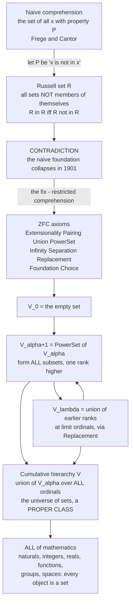

# 🧮 Axiomatic Set Theory (ZFC)

> [!abstract] TL;DR
> **ZFC** — Zermelo–Fraenkel set theory with the axiom of **Choice** — is the standard **foundation of mathematics**: a short list of first-order axioms about a single primitive relation, membership (`∈`), from which the *entire* mathematical universe is built. Numbers, ordered pairs, functions, the reals, groups, topological spaces — literally **everything is a set**. The axioms were engineered to keep the constructive power of Cantor and Frege's "naive" set theory while surgically forbidding the paradoxical monsters (above all **Russell's paradox**) that made naive set theory inconsistent. The picture that results is the **cumulative hierarchy** `V`: start from the empty set and iterate "take all subsets" along the ordinals; every set lives at some rank. ZFC is powerful enough to formalize essentially every theorem mathematicians prove — and, by Gödel, unable to prove its own consistency or to decide certain natural questions (the Continuum Hypothesis).

---

## Intuition

**Analogy:** Think of mathematics as an enormous building. You might expect its foundation to be a rich pile of raw materials — numbers here, functions there, geometry over in the corner. ZFC makes a radical claim: there is exactly **one** raw material, the **set** (a collection of things), and **one** structural relation, "is a member of." From this single ingredient you assemble *everything else*. The number 3 is a set, the pair `(x, y)` is a set, a function is a set, the real line is a set. It is as if the whole building — steel, glass, wiring, plumbing — were made by folding one kind of paper in different ways.

But there is a catch that nearly toppled the whole enterprise in 1901. If you allow yourself to form "the set of **all** things with property P" for *any* property P, you can form **R = the set of all sets that are not members of themselves**. Ask the fatal question: *is R a member of itself?* If it is, then by its own definition it must not be; if it isn't, then it qualifies for membership and must be. `R ∈ R ⇔ R ∉ R` — a flat contradiction. This is **Russell's paradox**, and it demolished Frege's naive foundation the moment it was published.

ZFC is the carefully engineered rulebook that keeps the paper-folding power while outlawing the impossible fold. It never says "collect everything with property P"; it only says "given a set you *already have*, you may carve out the sub-collection satisfying P" (the **Separation** axiom). You build the universe **bottom-up** from the empty set, one rank at a time, and the paradoxical "set of all non-self-membered sets" simply never gets built — it would have to contain itself before it exists. ZFC is, in effect, the **constitution of modern mathematics**: the agreed-upon foundation on which essentially every theorem ultimately rests, even though working mathematicians almost never cite it explicitly.

---

## How It Works

### Core Mechanics

ZFC is a **first-order theory** (see [[First_Order_Predicate_Logic]]) with a single non-logical symbol, the binary relation `∈` ("is a member of"). Everything is a set — there are no "atoms" or "urelements"; even the members of sets are themselves sets, all the way down to the empty set `∅`. The axioms do two jobs at once: they say **which sets exist** (construction rules) and they **tame the constructions** so no paradox arises.

The ten axioms (Choice is the tenth; Empty Set is often derived from Infinity + Separation):

1. **Extensionality** — two sets are equal iff they have the same members. *Identity is settled by content, not by name.* `∀x∀y (∀z(z∈x ↔ z∈y) → x=y)`.
2. **Pairing** — for any `a, b` there is a set `{a, b}`. *Lets you bundle two things.*
3. **Union** — for any set `x`, the union `⋃x` (all members of members of `x`) is a set. *Flattens one level.*
4. **Power Set** — for any set `x`, the set `P(x)` of **all subsets** of `x` is a set. *The engine of size — this is what makes uncountable sets.*
5. **Infinity** — there exists an infinite set (one containing `∅` and closed under the successor `y ↦ y ∪ {y}`). *Without it, only finite sets exist; this axiom hands you `ℕ`.*
6. **Separation / Aussonderung (schema)** — given a set `x` and a formula `φ`, the sub-collection `{z ∈ x : φ(z)}` is a set. *The paradox-proof replacement for naive comprehension: you may only carve subsets out of a set you already have.*
7. **Replacement (schema)** — the image of a set under a definable function is a set. *Lets you build sets "as big as" you can already index — essential for the transfinite ordinals beyond `ω·2`.*
8. **Foundation / Regularity** — every non-empty set has a member disjoint from it; equivalently, there is **no infinite descending `∈`-chain** and **no set is a member of itself**. *This is what makes the universe well-founded and directly rules out `x ∈ x`.*
9. **Choice (AC)** — every family of non-empty sets has a **choice function** selecting one member from each. *Non-constructive; equivalent to Zorn's Lemma and the Well-Ordering Theorem; foreshadowed below.*

Two of these — **Separation** and **Replacement** — are **axiom schemas**, not single axioms: they stand for *infinitely many* axioms, one for each formula `φ` in the language. First-order logic cannot quantify over formulas, so "for every property P" must be spelled out as an infinite template. This is a subtle and important structural fact about ZFC.

**The iterative conception.** The axioms are not an arbitrary list; they encode a single mental picture. Start with nothing — the empty set. At each stage, form **all** subsets of what you have so far (Power Set), and keep going through the **ordinals** (transfinitely, using Replacement to pass limit stages). Every set appears at some **rank** in this process. The paradoxical collections (Russell's `R`, "the set of all sets") never appear because they would need to be formed "all at once," never at any particular stage — they are **proper classes**, not sets.

### Flow / Architecture



---

## Key Concepts

### Secondary Level

**Why "the set of all X" is dangerous.** Naive set theory said: name any property, and there is a set of exactly the things having it. Russell's paradox shows this cannot be a rule of a consistent system — the property "is not a member of itself" leads straight to `R ∈ R ⇔ R ∉ R`. The lesson is not "sets are bad" but "**unrestricted set-building** is bad."

**The fix in one sentence.** ZFC never lets you collect everything with a property out of thin air. It only lets you (a) **build up** from `∅` using safe operations (pairing, union, power set), and (b) **carve out** a sub-collection from a set you *already possess* (Separation). Russell's `R` cannot be carved from anything, so it never exists.

**Everything is a set — even numbers.** The number 0 is defined as `∅` (the empty set). The number 1 is `{0} = {∅}`. The number 2 is `{0, 1} = {∅, {∅}}`. In general the next number is "everything so far, collected": `n+1 = n ∪ {n}`. A neat consequence: the set called `n` has **exactly `n` members**. These are the **von Neumann natural numbers** — the Python demo builds them as real nested sets.

**Membership is order.** With this encoding, `3 < 5` is literally the statement `3 ∈ 5`. Order, arithmetic, and counting all become facts about `∈`.

### Undergraduate Level

**Ordered pairs from unordered sets (Kuratowski).** A set has no built-in order — `{a, b} = {b, a}`. Yet mathematics needs ordered pairs `(a, b)` where order matters. Kuratowski's trick: define `(a, b) := {{a}, {a, b}}`. This asymmetric nesting lets you recover *which* component is first, and one can prove `(a,b) = (c,d) ⇔ a=c ∧ b=d`. Once you have ordered pairs, a **relation** is just a set of pairs, and a **function** `f: A → B` is a set of pairs that is single-valued. So functions and relations are sets too — the reduction is complete.

**The cumulative hierarchy `V`.** Define by transfinite recursion on the ordinals:
- `V₀ = ∅`
- `V_{α+1} = P(V_α)` (power set — all subsets)
- `V_λ = ⋃_{α<λ} V_α` for limit ordinals `λ`

Then `V = ⋃_{α ∈ Ord} V_α` is the class of **all** sets. Every set `x` has a **rank**: the least `α` with `x ∈ V_{α+1}`. Foundation is precisely the axiom guaranteeing every set sits somewhere in this hierarchy. The sizes tetrate: `|V₀|=0, |V₁|=1, |V₂|=2, |V₃|=4, |V₄|=16, |V₅|=65536, |V₆|=2^65536, …` — explosive growth that the demo visualizes.

**Sets vs proper classes.** A **class** is any collection defined by a formula, `{x : φ(x)}`. Some classes are sets (they appear at some rank of `V`); others — the **universe `V`** itself, the class **`Ord`** of all ordinals, "the set of all sets" — are **too big to be sets**. These are **proper classes**: legitimate to talk *about* (as abbreviations for formulas) but not themselves members of anything. Russell's `R` turns out to be (essentially) the proper class of all sets. The set/class distinction is exactly how ZFC dissolves the paradox: the paradoxical collections exist only as proper classes, and proper classes cannot be members, so `R ∈ R` never even arises.

**Building the number systems.** From `ω` (the naturals) you construct: integers `ℤ` as equivalence classes of pairs of naturals; rationals `ℚ` as equivalence classes of pairs of integers; reals `ℝ` as Dedekind cuts (or Cauchy sequences) of rationals — each a *set*. `|ℝ| = |P(ω)| = 2^{ℵ₀}`, which is why Power Set is the axiom responsible for the uncountable.

### Graduate Level

**Separation and Replacement are first-order schemas — and this matters.** Because you cannot quantify over "all properties" in first-order logic, Separation and Replacement are infinite families of axioms indexed by formulas. This is why **ZFC is not finitely axiomatizable** (a theorem of Montague), and it is the technical reason the theory interacts so intricately with model theory and reflection principles. **NBG** (von Neumann–Bernays–Gödel) class theory is a *conservative, finitely axiomatizable* extension that makes classes first-class citizens.

**Ordinals and cardinals (foreshadow).** An **ordinal** is a transitive set well-ordered by `∈`; ordinals measure *order type* and extend the naturals into the transfinite: `ω, ω+1, …, ω·2, …, ω², …, ε₀, …`. A **cardinal** measures *size*; under AC every set can be well-ordered, so every infinite cardinality is an **aleph** `ℵ_α`. Cantor's theorem `|A| < |P(A)|` guarantees an unbounded tower of infinities. This is developed in the sibling note *Ordinals_and_Cardinals*.

**The Axiom of Choice (foreshadow).** AC is independent of the other axioms (ZF): Gödel showed ZF cannot *disprove* it, Cohen that ZF cannot *prove* it. It is equivalent to **Zorn's Lemma**, the **Well-Ordering Theorem**, and Tychonoff's theorem, yet yields counterintuitive results like the **Banach–Tarski paradox**. The full story lives in *The_Axiom_of_Choice_and_Equivalents*.

**Consistency and independence (foreshadow).** By **Gödel's Second Incompleteness Theorem**, ZFC — if consistent — **cannot prove its own consistency** (`ZFC ⊬ Con(ZFC)`). And the **Continuum Hypothesis** `2^{ℵ₀} = ℵ₁` is **independent** of ZFC: Gödel's constructible universe `L` shows `Con(ZFC) → Con(ZFC + CH)`, and Cohen's method of **forcing** shows `Con(ZFC) → Con(ZFC + ¬CH)`. These are treated in *The_Continuum_Hypothesis*, *Forcing_and_Independence_Proofs*, and *Godels_Incompleteness_Theorems*. To *settle* such questions, set theorists study **large cardinal axioms** — strong axioms of infinity that extend ZFC and impose more structure on `V`.

**Alternative foundations.** ZFC is standard but not unique. **NBG** and **MK** handle classes explicitly; **type theory** (and its modern descendant **Homotopy Type Theory / univalent foundations**) stratifies objects by type to block paradoxes syntactically and underlies proof assistants like Lean and Coq; **category theory / topos theory** (see [[Category_Theory]]) offers a "structural" foundation where the primitive is the *morphism* rather than membership, and an elementary topos can serve as a universe of sets with an intuitionistic internal logic. Each dissolves Russell's paradox by a different discipline (rank, type, or structure).

**Philosophical status.** Is ZFC *true*, or merely *useful*? The **Platonist** holds that sets exist mind-independently and the axioms describe a real universe `V` (see [[Universals_and_Realism]] and [[Plato_and_the_Theory_of_Forms]]); the **formalist** holds mathematics is the manipulation of symbols under rules, and ZFC is simply the game we agreed to play; the **structuralist** cares only about relations up to isomorphism. Independence results (CH) sharpen the debate: to a Platonist, CH has a definite truth value we have not yet discovered; to a formalist, the question may simply be *underdetermined* by our axioms.

---

## Python Demo

```python
"""
EVERYTHING IS A SET: building mathematics from the empty set under ZFC.

(a) VON NEUMANN naturals as ACTUAL nested Python frozensets:
        0 = {}            (the empty set)
        n+1 = n u {n}     (the successor)
    We verify  |n| = n  and that the order  m < n  is exactly  vn(m) in vn(n).

(b) KURATOWSKI ordered pairs  (a,b) = {{a},{a,b}}  built as frozensets,
    then a FUNCTION as a set of such pairs -> relations/functions are sets too.

(c) The CUMULATIVE HIERARCHY  V_0 = {},  V_{n+1} = PowerSet(V_n).
    |V_n| = 2^|V_{n-1}|  tetrates: 0,1,2,4,16,65536,2^65536,...  -> explosive.

Two plots: the von Neumann naturals as nested sets, and the hierarchy's growth.
"""

import numpy as np
import matplotlib.pyplot as plt
from matplotlib.patches import Rectangle

# ---------------------------------------------------------------------------
# (a) Von Neumann naturals as REAL frozensets:  n+1 = n u {n}
# ---------------------------------------------------------------------------
def von_neumann(n):
    s = frozenset()                 # 0 = the empty set
    for _ in range(n):
        s = s | frozenset([s])      # successor: s u {s}
    return s

nats = [von_neumann(n) for n in range(6)]

print("=== (a) Von Neumann naturals: n encoded as a nested set, |n| = n ===")
for n, s in enumerate(nats):
    print(f"  {n}:  |set| = {len(s):>2}   (equals n? {len(s) == n})")

# order  m < n  <=>  vn(m) in vn(n)
print("\n  Membership IS order  (vn(m) in vn(n)  iff  m < n):")
for m in range(4):
    cells = "  ".join(f"{m} in {n}: {str(nats[m] in nats[n]):<5}" for n in range(4))
    print("   " + cells)

# ---------------------------------------------------------------------------
# (b) Kuratowski ordered pairs, then a FUNCTION as a set of pairs
# ---------------------------------------------------------------------------
def kpair(a, b):
    return frozenset([frozenset([a]), frozenset([a, b])])      # {{a},{a,b}}

def first(p):
    # a is the element common to BOTH members of the pair {{a},{a,b}}
    return next(iter(set.intersection(*[set(e) for e in p])))

# the "successor" function on {0,1,2}, i.e. {0->1, 1->2, 2->3}, as a pure set
succ_fn = frozenset(kpair(nats[i], nats[i + 1]) for i in range(3))
domain_vals = sorted(len(first(p)) for p in succ_fn)   # first components -> 0,1,2

print("\n=== (b) Everything is a set: 'successor' as a set of Kuratowski pairs ===")
print(f"  the function IS a set of {len(succ_fn)} ordered pairs")
print(f"  each pair (a,b) = {{{{a}},{{a,b}}}} is itself a set of sets")
print(f"  recovered domain via set intersection: {domain_vals}")

# ---------------------------------------------------------------------------
# (c) Cumulative hierarchy sizes  |V_n| = 2^|V_{n-1}|  (exact big-ints)
# ---------------------------------------------------------------------------
sizes = [0]
for _ in range(6):
    sizes.append(2 ** sizes[-1])

print("\n=== (c) Cumulative hierarchy  V_{n+1} = PowerSet(V_n) ===")
for n, v in enumerate(sizes):
    ndig = len(str(v))
    shown = str(v) if ndig <= 12 else f"a {ndig}-digit number (~2^65536)"
    print(f"  |V_{n}| = {shown}")

# ---------------------------------------------------------------------------
# Visualization: (left) naturals as nested sets, (right) hierarchy explosion
# ---------------------------------------------------------------------------
fig, (axL, axR) = plt.subplots(1, 2, figsize=(13, 5.5))

# LEFT: von Neumann naturals drawn as nested containers (vn0 subset vn1 subset ...)
N = 5
colors = plt.cm.viridis(np.linspace(0.15, 0.9, N))
for k in range(N - 1, -1, -1):                 # draw largest ring first
    size = 0.92 * (k + 1) / N
    corner = 0.5 - size / 2
    axL.add_patch(Rectangle((corner, corner), size, size,
                            facecolor=colors[k], edgecolor="white",
                            linewidth=2.5, zorder=k))
    label = "0 = null set" if k == 0 else f"{k}"
    axL.text(0.5, corner + size - 0.018, label, ha="center", va="top",
             fontsize=11, fontweight="bold", color="white", zorder=k + 0.5)
axL.set_title("Von Neumann naturals as NESTED sets\n"
              "0 = null set,   n+1 = n u {n},   so  |n| = n", fontsize=11)
axL.set_xlim(0, 1); axL.set_ylim(0, 1)
axL.set_aspect("equal"); axL.axis("off")

# RIGHT: explosive growth of |V_n| shown via its decimal-digit count (log axis)
ns = list(range(len(sizes)))
digits = [max(1, len(str(v))) for v in sizes]        # V_0 = 0 -> "0" -> 1 digit
axR.bar(ns, digits, color=plt.cm.magma(np.linspace(0.3, 0.85, len(ns))),
        edgecolor="black", linewidth=0.8)
axR.set_yscale("log")
value_labels = ["0", "1", "2", "4", "16", "65,536", "2^65536"]
for x, d, lab in zip(ns, digits, value_labels):
    axR.text(x, d * 1.3, lab, ha="center", va="bottom", fontsize=8.5)
axR.set_xlabel("rank  n")
axR.set_ylabel("number of decimal digits in |V_n|   (log scale)")
axR.set_title("Cumulative hierarchy EXPLODES\n"
              "|V_{n+1}| = 2^|V_n|   (tetration)", fontsize=11)
axR.set_ylim(0.7, max(digits) * 8)
axR.grid(axis="y", ls=":", alpha=0.5)

plt.tight_layout()
plt.savefig("zfc_everything_is_a_set.png", dpi=120, bbox_inches="tight")
plt.show()
```

**Expected output:**

```
=== (a) Von Neumann naturals: n encoded as a nested set, |n| = n ===
  0:  |set| =  0   (equals n? True)
  1:  |set| =  1   (equals n? True)
  2:  |set| =  2   (equals n? True)
  3:  |set| =  3   (equals n? True)
  4:  |set| =  4   (equals n? True)
  5:  |set| =  5   (equals n? True)

  Membership IS order  (vn(m) in vn(n)  iff  m < n):
   0 in 0: False  0 in 1: True   0 in 2: True   0 in 3: True
   ...
=== (b) Everything is a set: 'successor' as a set of Kuratowski pairs ===
  the function IS a set of 3 ordered pairs
  recovered domain via set intersection: [0, 1, 2]
=== (c) Cumulative hierarchy  V_{n+1} = PowerSet(V_n) ===
  |V_0| = 0
  |V_1| = 1
  |V_2| = 2
  |V_3| = 4
  |V_4| = 16
  |V_5| = 65536
  |V_6| = a 19729-digit number (~2^65536)
```

The point is that these are **not** simulations of numbers — `nats[3]` is an honest Python `frozenset` with three members, each of which is itself a set of sets, bottoming out at `frozenset()` (the empty set). The cardinality of the set literally *equals* the number it encodes, and `<` is nothing but `∈`. Part (b) shows a function is just a set of Kuratowski pairs, with the first component recoverable by pure set operations. Part (c) makes the **iterative conception** vivid: each rank is the *power set* of the last, so sizes tetrate — by `V₆` the universe already has more elements than there are atoms in the observable universe, raised to itself many times over.

---

## Real-World Applications

> **Proof assistants and verified software.** Formal-methods tools rest on an explicit foundation. **Isabelle/ZF** implements ZFC directly; **Metamath's `set.mm`** develops thousands of theorems from the ZFC axioms with fully machine-checked proofs; **Mizar** is built on Tarski–Grothendieck set theory (ZFC plus a large-cardinal-style universe axiom). When aerospace, cryptographic, or compiler code is *formally verified*, the trust ultimately bottoms out in axioms of this kind (see [[Mathematical_Logic_and_Set_Theory]]).

> **The database and query-language lineage.** Codd's relational model is set theory made practical: a *relation* is a set of tuples, and relational algebra (union, intersection, difference, projection, Cartesian product, selection) is exactly the algebra of sets and Kuratowski-style tuples. Every `SELECT ... WHERE` is a Separation-style carving of a sub-relation from an existing one — the same discipline that keeps ZFC paradox-free keeps queries well-defined.

> **Grothendieck universes in modern mathematics.** Working algebraic geometers and category theorists routinely quantify over "all groups" or "all schemes" — collections too big to be sets. To do this rigorously they assume a **Grothendieck universe** (equivalently, an inaccessible cardinal), a set large enough to model ZFC internally. This is a live, load-bearing use of large-cardinal strength *above* plain ZFC in mainstream mathematics.

> **Programming-language type systems.** The stratification that blocks Russell's paradox reappears as the **universe hierarchy** `Type₀ : Type₁ : Type₂ : …` in dependently typed languages (Lean, Coq, Agda). A single self-containing `Type : Type` would reproduce Russell's paradox (Girard's paradox) and make the whole logic inconsistent — so the type hierarchy is the ZFC rank discipline in programming clothing.

---

## Common Pitfalls

- **Thinking Russell's paradox is a curiosity rather than the whole point.** The paradox is *why* ZFC exists. Unrestricted comprehension — "for any property P, `{x : P(x)}` is a set" — is **inconsistent**, full stop. ZFC replaces it with **Separation** (carve subsets from existing sets) plus **Replacement** (map a set onto a new set). Neither ever lets you gather "all sets with property P" from nowhere, which is exactly the move that produces `R`. If you ever find yourself forming "the set of all sets that…", stop: you are probably building a **proper class**.

- **Confusing proper classes with sets.** `V` (the universe), `Ord` (all ordinals), and "the set of all sets" are **proper classes** — definable collections that are *not* sets and *cannot be members* of anything. Treating a proper class as a set (e.g., forming its power set, or asking whether it is a member of itself) reintroduces paradox. Classes are shorthand for formulas; sets are objects. Keep the line sharp.

- **Forgetting that Separation and Replacement are schemas, not single axioms.** Because first-order logic cannot quantify over formulas, "for every property P…" must be an **infinite family** of axioms, one per formula `φ`. This is why ZFC is *not finitely axiomatizable* and why some intuitive "second-order" reasoning about ZFC is subtler than it looks. Any argument that secretly quantifies over *all* properties inside the object language is suspect.

- **Expecting ZFC to prove its own consistency.** By **Gödel's Second Incompleteness Theorem**, if ZFC is consistent then `ZFC ⊬ Con(ZFC)`. This is *not* a defect and *not* a paradox — it is the expected fate of any sufficiently strong, effectively axiomatized, consistent system. "Is ZFC consistent?" cannot be settled from *within* ZFC; you either take it on faith, or prove `Con(ZFC)` in a *stronger* system (e.g., ZFC + an inaccessible), which then has its own unprovable consistency, ad infinitum.

- **Assuming CH (or AC) must be "really" true or false and ZFC just hasn't gotten there.** CH is **independent** of ZFC: both `ZFC + CH` and `ZFC + ¬CH` are consistent (Gödel via `L`, Cohen via forcing). No proof from the ZFC axioms will ever decide it. Whether it has a "real" answer is a *philosophical* question (Platonism vs formalism), not one ZFC alone can adjudicate. Likewise AC is independent of ZF.

- **Believing "everything is a set" is a metaphysical claim about the world.** It is a claim about **formalizability**: every mathematical object *can be coded* as a set, so a single foundation suffices. It does **not** assert that the number 3 "is really" `{∅, {∅}, {∅,{∅}}}` in any deep sense — the coding (von Neumann vs Zermelo `{{∅}}`) is a convention. Benacerraf's point: the *structure* is what matters, not the particular set chosen to represent it.

---

## Related Concepts

- [[Set_Theory_and_Relations]] — the **naive / working** treatment of sets, relations, and functions from the Mathematics vault; this note is its **axiomatic, foundational** counterpart (the same objects, but built rigorously to avoid paradox). Read that for computation, this for foundations.
- [[Mathematical_Logic_and_Set_Theory]] — the advanced-topics overview that carries the story forward into ordinals, cardinals, AC, CH, Gödel, and forcing; the natural next stop after this section-opener.
- [[First_Order_Predicate_Logic]] — ZFC *is* a first-order theory over the single relation `∈`; the meaning of its axioms, and why Separation/Replacement must be schemas, is exactly the syntax and semantics developed there.
- [[Paradoxes_and_Logical_Puzzles]] — Russell's paradox alongside the liar, Berry, and Grelling paradoxes; the informal home of the self-reference that ZFC was engineered to defeat.
- [[Mathematical_Logic_Overview]] — the section map for the Mathematical Logic vault; situates set theory next to proof theory, model theory, and computability.
- [[Formal_Systems_and_Proof_Calculi]] — ZFC is presented as a formal system (language, axioms, inference rules); this note supplies the general notion of "theory" that ZFC instantiates.
- [[Soundness_and_Completeness]] — Gödel's completeness theorem for first-order logic underwrites ZFC's proof theory; independence results (CH) exploit the gap between provability and truth-in-a-model.
- [[Compactness_and_Lowenheim_Skolem]] — Löwenheim–Skolem gives ZFC a *countable* model (Skolem's paradox), a striking consequence of ZFC being first-order that every foundations student must reconcile.
- [[Category_Theory]] — the leading **alternative foundation**: a structural, morphism-based universe (topos theory) that can replace membership-based ZFC, with its own way of blocking Russell's paradox.
- [[Universals_and_Realism]] — the metaphysics behind mathematical **Platonism**: do sets exist mind-independently? Directly relevant to whether CH has a determinate truth value.
- [[Plato_and_the_Theory_of_Forms]] — the ancient root of mathematical Platonism, the view that abstract objects like sets and numbers are real.
- [[The_Limits_of_Computation]] — Gödel's incompleteness and undecidability, which bound what ZFC (or any effective system) can prove, including its own consistency.

---

## Review Questions

### Secondary

1. State Russell's paradox in your own words. Which *single* rule of naive set theory does it refute, and how does ZFC's Separation axiom avoid it while still letting you build sets?
2. Using the von Neumann encoding (`0 = ∅`, `n+1 = n ∪ {n}`), write out the sets that *are* the numbers 0, 1, 2, and 3. How many members does the set called `3` have, and why is that not a coincidence?
3. Explain what it means to say "in ZFC, everything is a set — even functions and ordered pairs." Give one example of a mathematical object and sketch how it is coded as a set.

### Undergraduate

1. Prove that Kuratowski's definition `(a,b) := {{a},{a,b}}` satisfies the defining property of ordered pairs: `(a,b) = (c,d)` iff `a=c` and `b=d`. Where does your proof use Extensionality?
2. Describe the first six levels of the cumulative hierarchy `V₀, …, V₅` and compute `|V_n|` for each. Explain, using the definition `V_{α+1} = P(V_α)`, why the sizes grow by iterated exponentiation, and why *every* set must appear at some rank (which axiom guarantees this?).
3. Distinguish a **set** from a **proper class** with precise examples. Why is "the universe `V` of all sets" a proper class rather than a set, and what goes wrong if you assume it is a set?

### Graduate

1. Explain why **Separation** and **Replacement** must be stated as *axiom schemas* in first-order ZFC, and outline (at a high level) why this makes ZFC not finitely axiomatizable. How does **NBG** class theory recover finite axiomatizability, and in what sense is it conservative over ZFC?
2. Gödel's Second Incompleteness Theorem gives `ZFC ⊬ Con(ZFC)` (assuming ZFC is consistent). Carefully explain why this is *expected* rather than paradoxical, and what it would take to prove `Con(ZFC)` — including why doing so in a stronger theory does not fully resolve the regress.
3. The Continuum Hypothesis is independent of ZFC (Gödel's `L` for consistency of CH, Cohen's forcing for consistency of `¬CH`). Explain what "independent" means here in terms of *models* of ZFC, and argue how a **Platonist** and a **formalist** would each interpret this independence result differently. Does independence imply CH has *no* truth value?

---

## Sources

- [Jech, T. (2003). *Set Theory* (3rd Millennium ed.). Springer.](https://link.springer.com/book/10.1007/3-540-44761-X) — the comprehensive graduate reference on ZFC, ordinals, cardinals, forcing, and large cardinals.
- [Kunen, K. (2011). *Set Theory: An Introduction to Independence Proofs*. College Publications.](https://www.collegepublications.co.uk/logic/mlf/?00007) — the standard text on the ZFC axioms, the cumulative hierarchy, constructibility, and forcing.
- [Enderton, H. B. (1977). *Elements of Set Theory*. Academic Press.](https://www.elsevier.com/books/elements-of-set-theory/enderton/978-0-12-238440-0) — an accessible axiomatic development building the number systems from the axioms; ideal first course.
- [Halmos, P. R. (1960). *Naive Set Theory*. Van Nostrand.](https://link.springer.com/book/10.1007/978-1-4757-1645-0) — the classic short introduction to the working set theory that ZFC formalizes; the naive companion to this axiomatic note.
- [Russell, B. (1902). Letter to Frege / Frege's *Grundgesetze* appendix.](https://plato.stanford.edu/entries/russell-paradox/) — the historical statement of the paradox and the Stanford Encyclopedia's account of the foundational crisis it triggered.

---

#mathematical-logic #set-theory #zfc #foundations #cumulative-hierarchy
