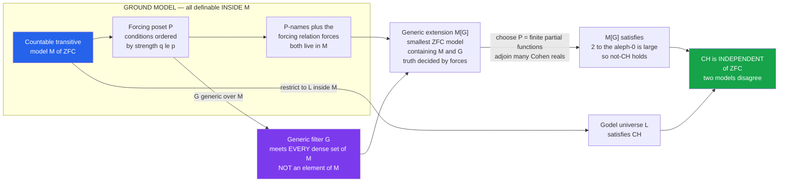

# 🌌 Forcing and Independence Proofs

> [!abstract] TL;DR
> **Forcing** is Paul Cohen's 1963 method for proving a statement **independent** of ZFC — neither provable nor refutable — by *building a new model of set theory to order*. Starting from a **ground model** `M` (a countable transitive model of ZFC), you pick a **forcing poset** `P` of "conditions," adjoin a carefully constructed **generic filter** `G` that meets every **dense** subset of `P`, and obtain the **generic extension** `M[G]` — the smallest model of ZFC containing `M` and `G`. By choosing `P` you steer what `M[G]` believes: Cohen forcing adds new reals and, iterated, makes `2^ℵ₀` large, so `M[G] ⊨ ¬CH`. Combined with Gödel's constructible universe `L` (where CH holds), this proves the **Continuum Hypothesis is independent of ZFC** — the deepest lesson being that set-theoretic truth is **model-relative**: ZFC vastly under-determines the universe of sets.

---

## Intuition

**Analogy:** How do you prove a statement *cannot be proved*? You cannot just fail to find a proof — absence of evidence is not evidence of absence. Instead you build a **parallel mathematical universe** where the statement is **false**, a universe that still obeys *every* standard axiom, just tuned differently. If such a universe exists, no proof from the axioms could ever have forced the statement to be true. **Cohen's forcing is the astonishing machine for constructing such universes on demand.** You start from a working model of set theory, then carefully **adjoin a new "generic" object** — engineered so that its arrival makes your target statement come out the way you want — *without breaking any axiom in the process*. It is mathematics' most powerful independence-proving device: the tool that settled the Continuum Hypothesis by proving that ZFC **settles nothing** about it.

Think of the ground model `M` as a finished house built to code, and the generic object `G` as a new room bolted on — but a room so "spread out" and free of hidden commitments that once installed, the whole house *still* passes every inspection (every ZFC axiom), yet now the resident measures the continuum differently. The genius is that you can plan the room's blueprint (the **forcing poset**) so precisely that you know in advance which questions the renovated house will answer — before you ever finish building it.

---

## How It Works

### Core Mechanics

Forcing manufactures a new model `M[G]` from four ingredients, each definable *inside* the ground model except the generic filter itself:

1. **Ground model `M`.** A **countable transitive model** (CTM) of ZFC — a set `M`, transitive (`x ∈ M` and `y ∈ x` imply `y ∈ M`), that satisfies all ZFC axioms. Countability is the crucial luxury: because `M` has only countably many subsets *from the outside*, it has only countably many dense sets, so a generic filter can actually be built (see the countable-model subtlety below).

2. **Forcing poset `P`.** A partially ordered set of **conditions** `p`, living in `M`, ordered by *strength*: `q ≤ p` means "`q` is **stronger** — it decides more, extends `p`." Two conditions are **compatible** if some third condition is stronger than both; a filter that gathers pairwise-compatible conditions represents "one coherent object being approximated." For adding a new real, conditions are **finite partial functions** `p : ℕ ⇀ {0,1}` ordered by extension.

3. **Generic filter `G`.** A filter `G ⊆ P` that is **`M`-generic**: it meets **every dense subset of `P` that lives in `M`**. ("Dense" `D`: every condition has a stronger condition inside `D` — no matter where you are, you can always descend into `D`.) `G` is *not* an element of `M` — it is defined **outside** `M`, in the surrounding universe. The union `⋃G` is the brand-new object (e.g., a new real).

4. **Generic extension `M[G]`.** The **smallest transitive model of ZFC** containing `M` and `G`. It is built from **`P`-names** — objects in `M` that act as *blueprints* for elements of `M[G]`, evaluated once `G` is known: `M[G] = { val(τ, G) : τ is a P-name in M }`.

The engine that ties it together is the **Forcing Theorem** and its **forcing relation `⊩`**:

- For each condition `p` and formula `φ`, "`p ⊩ φ`" (`p` **forces** `φ`) is a relation that is **definable inside `M`** — no oracle needed.
- **Truth Lemma:** `M[G] ⊨ φ` **iff some condition `p ∈ G` forces `φ`.** Everything true in the extension is *already decided* by a single condition sitting in the generic — the "**no clairvoyance**" principle: the ground model, reasoning about `⊩`, can plan the extension without ever seeing `G`.
- **Definability + Genericity Lemmas** together guarantee the extension is well-behaved. Genericity ensures `G` "avoids all traps": for any property expressible in `M`, the set of conditions deciding it is dense, so `G` meets it and the property gets settled.

From these, one proves the payoff theorem: **`M[G] ⊨ ZFC`.** Forcing *preserves* the axioms — this is not automatic, it is the technical heart of the method.

The classic results follow by choosing `P`:

- **Cohen forcing** (`P` = finite partial functions `ℕ ⇀ 2`) adds a **Cohen real** `g` differing from every ground-model real. Its product `Add(ω, ℵ₂)` — finite partial functions `ℵ₂ × ℕ ⇀ 2` — adjoins `ℵ₂`-many mutually distinct Cohen reals, so `M[G] ⊨ 2^ℵ₀ ≥ ℵ₂ > ℵ₁`, i.e. **`¬CH`**. Hence `Con(ZFC) ⇒ Con(ZFC + ¬CH)` (Cohen, 1963).
- **Gödel's `L`** (the constructible universe) satisfies `Con(ZFC) ⇒ Con(ZFC + GCH)`, so CH cannot be disproved.
- Together: **CH is independent of ZFC** — a genuine fork in the road, with legitimate universes on both sides.

### Flow / Architecture



---

## Key Concepts

### Secondary Level

**You prove "can't be proved" by building a counter-world.** If a rule could be *derived* from the axioms, it would have to hold in *every* world obeying those axioms. So to show the axioms don't decide a question, exhibit **two legal worlds that answer it differently** — one where the answer is yes, one where it's no. Forcing is the recipe for constructing the "no" world to order.

**A condition is a partial promise.** Imagine describing an infinite coin-flip sequence by writing down only *finitely* many flips so far: "flip 3 is heads, flip 7 is tails." That finite table is a **condition**. A **stronger** condition fills in more flips (and never contradicts the earlier ones). The infinite sequence is the *limit* of ever-stronger conditions.

**Generic = dodges every trap.** A **dense** set of conditions is a "trap you can always fall into no matter where you stand." The generic object is built to **land in every trap the ground model can describe**. Because it satisfies every describable requirement, it ends up **different from everything the old world already contained** — it is genuinely new.

**The Continuum Hypothesis is a coin that lands both ways.** CH asks whether there is a size strictly between the counting numbers and the real numbers. Gödel built a lean world where the answer is "no in-between size" (CH holds); Cohen built a roomy world, stuffed with new reals, where the answer is "yes, the reals are far bigger than the next size up" (CH fails). Same axioms, opposite verdicts — so the axioms don't decide it.

### Undergraduate Level

**The poset, precisely.** `(P, ≤)` is a partial order with a top element `1` (the empty promise). Read `q ≤ p` as "`q` **extends/refines** `p`." A **filter** `G` is upward-closed and downward-directed (any two members have a common lower bound *in* `G`). For **Cohen forcing** `P = Fn(ω, 2)` = finite partial functions `ω ⇀ {0,1}`, `q ≤ p` iff `q ⊇ p` (as functions), and two conditions are compatible iff they agree on their common domain.

**Dense sets and genericity.** `D ⊆ P` is **dense** if `∀p ∃q ≤ p` with `q ∈ D`. `G` is **`M`-generic** if `G ∩ D ≠ ∅` for every dense `D ∈ M`. Example dense sets for Cohen forcing:
- `Dₙ = { p : n ∈ dom(p) }` — meeting all of these makes `⋃G` a **total** function `g : ω → 2`, i.e. a real.
- `E_r = { p : p(k) ≠ r(k) for some k }` for each ground real `r` — meeting these forces `g ≠ r`. Since `M` has only countably many reals and each `E_r` is dense, **`g` differs from every ground-model real**: it is *new*. This is a **diagonalization** engineered by genericity.

**Why a generic can exist (Rasiowa–Sikorski).** Because `M` is countable, it has only countably many dense sets `D₀, D₁, D₂, …`. Build a descending chain `p₀ ≥ p₁ ≥ …` with `pₙ ∈ Dₙ` (possible by density), and let `G` = everything above some `pₙ`. This meets every `Dₙ`, so a generic filter **provably exists** — living outside `M`, in `V`.

**`P`-names and the forcing relation.** Elements of `M[G]` are named by **`P`-names**: hereditarily, a name `τ` is a set of pairs `(σ, p)` with `σ` a name and `p ∈ P`, and `val(τ, G) = { val(σ, G) : (σ, p) ∈ τ, p ∈ G }`. The **forcing relation** `p ⊩ φ` is defined *by recursion in `M`* so that the **Truth Lemma** holds: `M[G] ⊨ φ` iff `(∃p ∈ G)\, p ⊩ φ`. Two structural facts drive everything — if `p ⊩ φ` and `q ≤ p` then `q ⊩ φ` (stronger conditions keep their promises), and `{ p : p ⊩ φ \text{ or } p ⊩ ¬φ }` is dense (every question is *decidable* by descending far enough).

**Cohen's headline result.** Force with `Add(ω, ℵ₂^M)` = `Fn(ℵ₂ × ω, 2)`. The `ℵ₂`-many columns are distinct reals, and a **chain-condition** argument (the poset is *ccc* — has no uncountable antichain) shows forcing **preserves cardinals**, so `ℵ₂^M` stays `ℵ₂` in `M[G]`. Therefore `M[G] ⊨ 2^ℵ₀ ≥ ℵ₂`, i.e. `¬CH`. Pairing this with `L` yields the independence of CH.

### Graduate Level

**The ccc / preservation machinery.** Whether cardinals and cofinalities survive is controlled by the combinatorics of `P`. A **ccc** poset (countable chain condition) preserves all cardinals and cofinalities; **closure** properties (`< κ`-closed) preserve smaller cardinals and add no new small subsets. `Add(ω, κ)` is ccc via a Δ-system argument, which is exactly why Cohen forcing can inflate `2^ℵ₀` to any prescribed `κ` with `cf(κ) > ω` (**Easton's theorem** charts the full freedom of the continuum function on regular cardinals). The whole *industry* of independence lives here.

**Boolean-valued models — the alternative formulation.** Instead of a generic filter, complete the poset to a **complete Boolean algebra** `B = RO(P)` (regular open sets) and build `V^B`, where each statement gets a **truth value** `⟦φ⟧ ∈ B` rather than a bare true/false. `⟦CH⟧ ≠ 0, 1` in a suitable `B` *is* independence, phrased without ever mentioning a metamodel — Scott, Solovay, and Vopěnka's reformulation that dissolves the "where does `G` live?" worry and reveals forcing as **sheaf semantics over a poset** (a bridge to topos theory and intuitionistic logic).

**The independence explosion.** Forcing turned independence from a curiosity into a discipline. A partial map:
- **`¬CH` and the continuum function** (Cohen; Easton) — `2^ℵ₀` can be almost anything.
- **Suslin's Hypothesis** independent (Solovay–Tennenbaum via iterated ccc forcing; Jensen: `◊` in `L` refutes SH).
- **Martin's Axiom (`MA`)** — a *forcing axiom* asserting generics exist for ccc posets meeting `< 2^ℵ₀` dense sets; consistent with `¬CH`, it decides a swath of independent combinatorics.
- **Cardinal characteristics of the continuum** (`𝔟, 𝔡, 𝔞, 𝔰, cov(𝒩), …`) — the whole **Cichoń diagram** is a map of what forcing can separate.
- **The tree property, `◊`, `□`, gaps** — fine structure vs. forcing axioms.
- **`¬AC` over ZF** — the *symmetric submodel* / permutation-model variant of forcing yields models of `ZF + ¬AC` (Cohen's original also did this), showing Choice is independent of the other axioms.

**Iterated forcing and forcing axioms.** Single-step forcing is rarely enough; **finite- and countable-support iterations** (and **proper forcing**, Shelah) let you meet *densely many* requirements across `ℵ₂` stages while preserving `ℵ₁`. This machinery yields the strong forcing axioms — **`MA`**, **`PFA`** (Proper Forcing Axiom), and **Martin's Maximum (`MM`)** — maximal principles that *decide* CH negatively (`PFA ⊢ 2^ℵ₀ = ℵ₂`) and connect to **large cardinals** (a supercompact is needed for `PFA`/`MM`), pointing toward Woodin's program on whether a *canonical* extension of ZFC could settle CH after all.

**The methodological lesson.** Forcing proves that ZFC is **radically incomplete about infinite combinatorics** — set-theoretic truth is *model-relative*. This is Gödel's incompleteness made maximally concrete: not a contrived self-referential Gödel sentence, but the most natural question about size, `2^ℵ₀ = ℵ₁?`, left completely open. The universe of sets is not pinned down by our axioms; forcing is the compass that maps the space of alternatives.

---

## Python Demo

```python
"""
The combinatorial HEART of Cohen forcing: adding a NEW real by meeting dense sets.

A CONDITION is a finite partial function  p : N -> {0,1}  (a finite 0/1 table).
STRONGER = MORE defined:  q <= p  iff  q extends p as a function.
A GENERIC FILTER G meets EVERY dense set of conditions; its union is a total
function  g : N -> {0,1}  -- a REAL. Genericity forces g to DIFFER from every
real already in the ground model (a diagonalization), so g is genuinely NEW.

Part (a): build ONE Cohen real by meeting (i) 'totality' dense sets and
          (ii) 'differ from ground real r' dense sets  ->  a new real.
Part (b): add MANY mutually generic Cohen reals  ->  2^aleph0 large  ->  not-CH.
"""

import numpy as np
import matplotlib.pyplot as plt

rng = np.random.default_rng(1963)          # Cohen's year

N = 24                                      # coordinates we track for display

# --- the forcing poset P = finite partial functions, ordered by extension ---
def extends(q, p):                          # q <= p   (q stronger than p)
    return all(k in q and q[k] == v for k, v in p.items())

def compatible(p, q):                       # can both be extended together?
    return all(p[k] == q[k] for k in set(p) & set(q))

# --- DENSE SETS, given as 'meet' maps  p |-> (some q <= p) landing in the set -
def meet_totality(n, bit_source):
    """D_n = {p : n in dom p}. Deciding every n makes the generic a TOTAL real."""
    def meet(p):
        q = dict(p)
        if n not in q:
            q[n] = int(next(bit_source))    # a FREE choice = genericity
        return q
    return meet

def meet_differ(r):
    """E_r = {p : p(k) != r(k) for some k}. Forces  generic != r  (the diagonal)."""
    def meet(p):
        q = dict(p)
        if any(q[k] != r[k] for k in q):    # already differs -> p is in E_r
            return q
        k = 0                               # else diagonalize at a fresh coord
        while k in q:
            k += 1
        q[k] = 1 - int(r[k])                # opposite bit to r  <-- the diagonal
        return q
    return meet

# --- ground-model reals: the 'simple / already-constructed' reals inside M ---
ground = {
    "all zeros":   np.zeros(N, dtype=int),
    "all ones":    np.ones(N, dtype=int),
    "alternating": np.array([k % 2 for k in range(N)]),
    "period-4":    np.array([(k // 2) % 2 for k in range(N)]),
    "thue-morse":  np.array([bin(k).count("1") % 2 for k in range(N)]),
}

# --- build a GENERIC FILTER G by meeting a COUNTABLE sequence of dense sets ---
bit_source = iter(rng.integers(0, 2, size=4 * N))
p = {}                                       # weakest condition = empty function
log = []

# meet the DIAGONAL dense sets first: forces an explicit difference from each r
for name, r in ground.items():
    before = dict(p)
    p = meet_differ(r)(p)
    changed = [k for k in p if k not in before]
    log.append((f"E[{name}]", changed))

# then meet the TOTALITY dense sets to complete the real on [0, N)
for n in range(N):
    p = meet_totality(n, bit_source)(p)

generic = np.array([p[n] for n in range(N)], dtype=int)

# --- verify genericity: the new real differs from EVERY ground-model real ----
print("Building a Cohen generic real by meeting dense sets:")
for tag, changed in log:
    if changed:
        print(f"  met {tag:14s} -> forced coordinate {changed[0]} "
              f"(diagonalizing against that ground real)")
    else:
        print(f"  met {tag:14s} -> already satisfied (condition differed already)")

print("\nGeneric real g (first 24 bits):", "".join(map(str, generic)))
is_new = True
print("\nDoes g equal any ground-model real?")
for name, r in ground.items():
    idx = int(np.where(generic != r)[0][0])
    is_new = is_new and idx >= 0
    print(f"  vs {name:12s}: first differs at index {idx:>2}  ->  NOT equal")
print(f"\n  => g is NEW: it appears in NO row of the ground model.  new = {is_new}")

# --- Part (b): add MANY mutually generic Cohen reals  ->  2^aleph0 large ------
K = 16                                       # pretend these are aleph_2-many columns
cohen_block = rng.integers(0, 2, size=(K, N))    # K independent generic columns
distinct = len({tuple(row) for row in cohen_block}) == K
print(f"\nAdded {K} mutually generic Cohen reals; all pairwise distinct? {distinct}")
print(f"  => 2^aleph0 >= {K} in the extension M[G]  (the mechanism behind not-CH)")

# ===========================================================================
# Visualization: (1) tree of conditions + generic branch, (2) g vs ground reals,
#                (3) many Cohen reals filling up the continuum.
# ===========================================================================
fig = plt.figure(figsize=(14, 9))
gs = fig.add_gridspec(2, 2, height_ratios=[1.1, 1.0], hspace=0.33, wspace=0.24)

# --- (1) binary tree of conditions with the GENERIC BRANCH highlighted -------
axT = fig.add_subplot(gs[0, :])
DEPTH = 6
gpath = [int("".join(map(str, generic[:d])), 2) if d > 0 else 0
         for d in range(DEPTH + 1)]
for d in range(DEPTH + 1):
    for v in range(2 ** d):
        x = (v + 0.5) / (2 ** d)
        y = -d
        on_path = (v == gpath[d])
        if d < DEPTH:                        # draw edges to the two children
            for c in (2 * v, 2 * v + 1):
                xc = (c + 0.5) / (2 ** (d + 1))
                edge_gen = on_path and (c == gpath[d + 1])
                axT.plot([x, xc], [y, y - 1],
                         color="#dc2626" if edge_gen else "#cbd5e1",
                         lw=2.6 if edge_gen else 0.7,
                         zorder=3 if edge_gen else 1)
        axT.scatter([x], [y], s=95 if on_path else 20,
                    color="#dc2626" if on_path else "#94a3b8",
                    zorder=4, edgecolors="white", linewidths=0.6)
axT.set_title("Forcing poset as a TREE OF CONDITIONS   "
              "(red = the generic branch = the new real g)",
              fontsize=12, fontweight="bold")
axT.set_xlabel("stronger conditions (more bits decided) run downward")
axT.set_yticks([-d for d in range(DEPTH + 1)])
axT.set_yticklabels([f"len {d}" for d in range(DEPTH + 1)], fontsize=8)
axT.set_xticks([])
axT.spines[["top", "right", "bottom"]].set_visible(False)

# --- (2) generic real vs the ground-model reals (heatmap + first-diff star) ---
axG = fig.add_subplot(gs[1, 0])
rows = list(ground.items()) + [("GENERIC g", generic)]
mat = np.vstack([r for _, r in rows])
axG.imshow(mat, cmap="Blues", vmin=0, vmax=1, aspect="auto")
axG.set_yticks(range(len(rows)))
axG.set_yticklabels([nm for nm, _ in rows], fontsize=8)
axG.set_xticks(range(0, N, 4))
axG.set_xlabel("coordinate n")
for i, (nm, r) in enumerate(rows[:-1]):
    j = int(np.where(generic != r)[0][0])
    axG.scatter([j], [len(rows) - 1], marker="*", s=70, color="#f59e0b")
    axG.scatter([j], [i], marker="*", s=70, color="#f59e0b")
axG.axhline(len(rows) - 1.5, color="#dc2626", lw=1.5)
axG.set_title("g DIFFERS from every ground real\n(stars = first difference)",
              fontsize=10)

# --- (3) many Cohen reals: 2^aleph0 is large  ->  not-CH ---------------------
axC = fig.add_subplot(gs[1, 1])
axC.imshow(cohen_block, cmap="Purples", vmin=0, vmax=1, aspect="auto")
axC.set_yticks(range(K))
axC.set_yticklabels([f"c{j}" for j in range(K)], fontsize=7)
axC.set_xticks(range(0, N, 4))
axC.set_xlabel("coordinate n")
axC.set_title(f"{K} mutually generic Cohen reals (all distinct)\n"
              "adjoining aleph_2 of these forces 2^aleph0 >= aleph_2  =>  not-CH",
              fontsize=10)

fig.suptitle("Cohen Forcing: adjoining a generic real to a model of ZFC",
             fontsize=14, fontweight="bold", y=0.98)
plt.savefig("cohen_forcing_generic_real.png", dpi=120, bbox_inches="tight")
plt.show()
```

**Expected output** (bits from index 2 onward are seed-dependent; the *guarantees* — every difference is found, all Cohen reals distinct — are deterministic by construction):

```
Building a Cohen generic real by meeting dense sets:
  met E[all zeros]   -> forced coordinate 0 (diagonalizing against that ground real)
  met E[all ones]    -> forced coordinate 1 (diagonalizing against that ground real)
  met E[alternating] -> already satisfied (condition differed already)
  met E[period-4]    -> already satisfied (condition differed already)
  met E[thue-morse]  -> already satisfied (condition differed already)

Generic real g (first 24 bits): 100110100101110010001101

Does g equal any ground-model real?
  vs all zeros   : first differs at index  0  ->  NOT equal
  vs all ones    : first differs at index  1  ->  NOT equal
  vs alternating : first differs at index  0  ->  NOT equal
  vs period-4    : first differs at index  0  ->  NOT equal
  vs thue-morse  : first differs at index  0  ->  NOT equal

  => g is NEW: it appears in NO row of the ground model.  new = True

Added 16 mutually generic Cohen reals; all pairwise distinct? True
  => 2^aleph0 >= 16 in the extension M[G]  (the mechanism behind not-CH)
```

The demo isolates the *combinatorial engine* of forcing without any metamathematics. **Meeting the totality dense sets** turns the growing stack of finite conditions into a total function — a real. **Meeting the diagonal dense sets `E_r`** forces that real to disagree with each pre-listed ground real, so the generic is provably **new** — genericity *is* a diagonalization. The tree plot shows the whole poset (`2^d` conditions of length `d`) with the generic descending as a single red branch. Part (b) stacks `16` mutually generic Cohen reals, all distinct: adjoin `ℵ₂` such columns and `2^ℵ₀ ≥ ℵ₂`, which is exactly Cohen's route to `¬CH`.

---

## Real-World Applications

> **Independence results across mathematics.** Forcing is *the* tool that shows a conjecture is unprovable, not merely hard. **Whitehead's problem** in group theory (is every Whitehead group free?) was shown by Shelah to be independent of ZFC. The **Borel Conjecture**, the **Kaplansky conjecture on Banach algebra homomorphisms**, the existence of **outer automorphisms of the Calkin algebra** (Farah, via forcing axioms / OCA), and **Naimark's problem** in operator algebras (Akemann–Weaver) were all resolved as *independent* by forcing. When a problem resists for decades, forcing is how you prove it *has* to.

> **Oracle constructions in complexity theory.** Baker–Gill–Solovay built oracles `A` with `P^A = NP^A` and `B` with `P^B ≠ NP^B` by a **finite-extension / generic** construction that is forcing in miniature: build the oracle by meeting countably many "requirements," each a dense set of finite conditions. **Generic** and **random oracles**, and the whole theory of **algorithmic randomness** (a Cohen real is exactly a "1-generic" sequence, dual to a Martin-Löf random real), are direct descendants of forcing's dense-set methodology. See [[Decidability_and_Recognizability]] for the computability backdrop.

> **Sheaf, topos, and realizability semantics.** The **Boolean-valued** reformulation reveals forcing as **sheaf semantics over a poset**; Cohen forcing is a special case of Grothendieck-topos internal logic, and the same idea powers **realizability models** and **independence proofs in constructive mathematics**. Forcing thereby seeded techniques now used in programming-language semantics and categorical logic.

> **Calibrating the axioms mathematicians actually use.** Forcing shows exactly *how much* Choice, CH, or Martin's Axiom a given theorem needs, by exhibiting models where the theorem fails. This is the rigorous version of "which axioms are *really* required" — from the Banach–Tarski dependence on AC to the CH-sensitivity of results in measure theory, functional analysis, and general topology.

---

## Common Pitfalls

- **Genericity ≠ constructibility (they are opposite extremes).** A generic real is the *least* special real imaginable — it dodges every ground-definable trap, so it belongs to **no** definable set the ground model can name. Gödel's constructible universe `L` is the *minimal* model, built by cramming in only the reals you are *forced* to; a Cohen generic is deliberately **non-constructible** — it cannot lie in `L`, because "being in `L`" would be a describable property it is generic against. Confusing "carefully built" with "constructible" inverts the whole picture: forcing adds *maximally undetermined* objects, not canonical ones.

- **The countable-transitive-model / "meta" subtlety.** A generic filter exists **only because `M` is countable** (from the outside): countability gives *countably many* dense sets, which a descending chain can meet (Rasiowa–Sikorski). You cannot force over the *entire* universe `V` this way — there is no `V`-generic filter for a non-trivial poset. The honest formulations either (i) work over a countable transitive model `M` and build `M[G]` *externally in `V`*, or (ii) sidestep the metamodel entirely with **Boolean-valued models** `V^B`, where independence is `⟦φ⟧ ∉ {0,1}` and no actual generic is needed. Sloppily "adding `G` to `V`" is the classic beginner's error.

- **Forcing preserves ZFC — but that is a theorem, not a freebie.** It is not obvious that `M[G] ⊨ ZFC`; each axiom (Power Set, Replacement, Choice, Separation, …) must be *verified* using the forcing relation, the definability of `⊩` in `M`, and genericity. The generic is engineered precisely so that every axiom's required witnesses exist. Treating "`M[G]` is a model of ZFC" as automatic skips the entire substance of Cohen's proof.

- **Misreading the forcing relation `⊩`.** `p ⊩ φ` does **not** mean "`p` proves `φ`" in a syntactic sense, and it is **not** evaluated in `M[G]`. It is a relation **definable inside `M`** (no access to `G`), satisfying the Truth Lemma `M[G] ⊨ φ ⇔ (∃p ∈ G)\, p ⊩ φ`. The point — "**no clairvoyance**" — is that the ground model can reason about, and *plan*, the extension without ever seeing the generic. Forgetting that `⊩` lives in `M` (and is monotone: stronger conditions preserve forced statements) makes the method look circular when it is not.

- **You cannot "force CH to be false in `V`."** Forcing proves **consistency/independence**, not that CH is "really" false. It builds a **different** model `M[G]` where CH fails; your own universe `V` is untouched, and if you happen to live in a world where CH holds, forcing does nothing to that fact. The correct conclusion is `Con(ZFC) ⇒ Con(ZFC + ¬CH)`: *there exists a legitimate universe* answering "no." Independence is a statement about the *axioms'* reach, never a demonstration that a statement is objectively false.

---

## Related Concepts

- [[Mathematical_Logic_and_Set_Theory]] — the parent overview: ZFC axioms, ordinals/cardinals, Gödel's `L`, and the CH-independence headline that this note supplies the *machinery* for
- [[Set_Theory_and_Relations]] — partial orders, filters, and functions are the raw material of a forcing poset; conditions are literally finite partial functions ordered by extension
- [[Compactness_and_Lowenheim_Skolem]] — Löwenheim–Skolem delivers the **countable transitive model** that forcing runs over; the "Skolem paradox" (countable models believing in uncountable sets) is the same meta/internal gap forcing exploits
- [[Model_Theory_Foundations]] — forcing is model *construction*: `M[G]` is a new structure satisfying a chosen theory; the syntax/semantics split (`⊩` in `M` vs. truth in `M[G]`) is model theory in action
- [[Decidability_and_Recognizability]] — the dense-set / finite-extension method reappears as **oracle constructions** (Baker–Gill–Solovay) and algorithmic randomness, where a Cohen real is a `1`-generic sequence
- [[Topological_Spaces]] — dense subsets of the forcing poset carry an **order topology**; genericity is a Baire-category phenomenon (the generic filter avoids all "nowhere dense" obstructions), and completing the poset to `RO(P)` recasts forcing as sheaves over that space

Siblings developed elsewhere in this Set Theory section — *The Continuum Hypothesis*, *Axiomatic Set Theory (ZFC)*, *The Axiom of Choice and Equivalents*, *Large Cardinals and the Higher Infinite*, and *Gödel's Incompleteness Theorems* — are the natural companions: forcing settles CH, respects (or violates, over ZF) Choice, is calibrated against large cardinals, and is the constructive twin of the incompleteness phenomenon.

---

## Review Questions

### Secondary

1. Explain, using the "two counter-worlds" idea, how building a model where a statement is **false** can prove that statement can never be **proved** from the axioms. Why is *failing to find a proof* not enough on its own?
2. A **condition** is described as a "finite partial promise" about an infinite 0/1 sequence. Give an example of a condition, a *stronger* condition that extends it, and a condition that is *incompatible* with it. Why does the infinite sequence only appear "in the limit"?
3. In the demo, the generic real ends up **different from every ground-model real**. In plain words, what is a "dense set of conditions," and why does meeting all of them force this difference?

### Undergraduate

1. Define **`M`-generic filter** and **dense set** precisely for Cohen forcing `Fn(ω, 2)`. Then prove that if `G` is generic, the union `g = ⋃G` is a **total** function `ω → 2` and differs from every real of `M`. Which dense sets did you use for each part?
2. State the **Truth Lemma** (`M[G] ⊨ φ` iff some `p ∈ G` forces `φ`) and explain the "no clairvoyance" slogan: how can the ground model reason about `M[G]` without knowing `G`? Where does the *definability of `⊩` in `M`* enter?
3. Sketch why `Con(ZFC) ⇒ Con(ZFC + ¬CH)` via `Add(ω, ℵ₂)`. What role does the **ccc / cardinal-preservation** property play — and what would go wrong if the forcing *collapsed* `ℵ₂` to `ℵ₁`?

### Graduate

1. Compare the **generic-filter** and **Boolean-valued** presentations of forcing. State independence of CH in each language (`M[G] ⊨ ¬CH` versus `⟦CH⟧ ∉ {0,1}` in `V^B`), and explain how the Boolean-valued version dissolves the "where does the generic live?" objection.
2. Contrast a **Cohen generic real** with a real in Gödel's `L`. Prove that a Cohen real is non-constructible, and explain the sense in which genericity and constructibility are *opposite* construction principles. How does this dichotomy underlie the two directions of CH's independence?
3. Describe how **iterated / proper forcing** upgrades single-step forcing, and how it produces the forcing axioms **`MA`, `PFA`, `MM`**. Why does `PFA` *decide* CH (giving `2^ℵ₀ = ℵ₂`), and what is the connection to **large cardinals** and Woodin's program on canonically extending ZFC?

---

## Sources

- [Cohen, P. J. (1966). *Set Theory and the Continuum Hypothesis.* W. A. Benjamin (Dover reprint, 2008).](https://store.doverpublications.com/products/9780486469218) — the founder's own account; the original forcing method and the independence of CH and AC
- [Kunen, K. (2011). *Set Theory* (rev. ed.). College Publications.](https://www.collegepublications.co.uk/logic/mls/?00006) — the modern standard (successor to his 1980 *An Introduction to Independence Proofs*); the definitive rigorous development of forcing, `⊩`, ccc, and iteration
- [Jech, T. (2003). *Set Theory* (3rd millennium ed.). Springer.](https://link.springer.com/book/10.1007/3-540-44761-X) — the encyclopedic reference: forcing, Boolean-valued models, iterated forcing, and the full independence landscape
- [Chow, T. Y. (2009). "A beginner's guide to forcing." *Contemporary Mathematics* 479, 25–40. (arXiv:0712.1320)](https://arxiv.org/abs/0712.1320) — the best gentle, motivation-first introduction; demystifies the "open problem of forcing" for newcomers
- [Weaver, N. (2014). *Forcing for Mathematicians.* World Scientific.](https://www.worldscientific.com/worldscibooks/10.1142/8962) — a streamlined route to real independence results for non-specialists

---

#mathematical-logic #forcing #independence #cohen #set-theory
