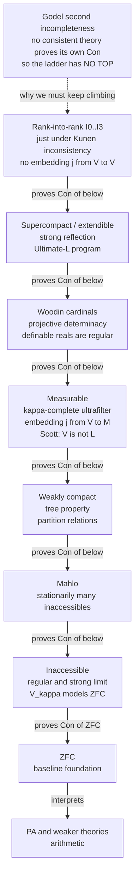

# 🗼 Large Cardinals and the Higher Infinite

> [!abstract] TL;DR
> A **large cardinal axiom** asserts the existence of an infinite cardinal `κ` so vast that ZFC cannot prove it exists — because its existence *implies* the consistency of ZFC, which by **Gödel's second incompleteness theorem** ZFC can never prove about itself. The known large cardinals (**inaccessible < Mahlo < weakly compact < measurable < Woodin < supercompact < …**, up to the near-inconsistent rank-into-rank axioms) line up in a single, empirically **linear ladder of consistency strength**: each proves the consistency of all below it, giving set theory a universal yardstick against which the strength of *any* mathematical statement can be measured. Astonishingly, this tower of the transfinite reaches back **downward** to settle concrete questions about ordinary real numbers — measurable and Woodin cardinals imply **projective determinacy**, fixing the regularity properties (Lebesgue measurability, the Baire property) of all definable sets of reals.

---

## Intuition

**Analogy:** Imagine you are trapped inside a fortress and asked to prove the fortress walls are sound. **Gödel** proved this is impossible from the inside: no consistent theory strong enough for arithmetic can prove its own consistency — mathematics can never fully secure its own foundations from within its own walls. But there is a way to reach **upward**. Postulate the existence of an infinity so enormous that everything ZFC can build fits *inside* it as a mere pebble. Such an infinity — a **large cardinal** — is like standing on a taller tower: from up there you can look *down* and see the entire fortress below is intact, proving its consistency. But now you are inside a *bigger* fortress whose walls you again cannot check from within. So you postulate a still-vaster infinity, and climb again. The result is a **towering ladder of ever-stronger axioms**, each one certifying the soundness of everything beneath it, with **no top rung** — because Gödel's argument applies at every level.

Technically, the "height" is literal: cardinals are stacked in the **cumulative hierarchy** `V₀ ⊆ V₁ ⊆ … ⊆ Vₐ ⊆ …`, where each level adds the power set of the one before. A **large** cardinal is one so *tall* in this hierarchy that the initial segment of the universe below it, `V_κ`, is already a complete model of set theory — a self-contained universe. And the most astonishing part is that these abstract heights are not idle: assuming they exist, the geometry of the **real line** snaps into order, and long-open questions about definable sets of reals get definitive answers.

---

## How It Works

### Core Mechanics

1. **The cumulative hierarchy `V`.** Build the set-theoretic universe in stages: `V₀ = ∅`, `V_{α+1} = 𝒫(V_α)` (the power set), and `V_λ = ⋃_{α<λ} V_α` at limits. Every set lives at some stage; the *rank* of a set is how high it first appears. "Large" always means **tall in `V`** — high up this ladder — never "many elements sideways."

2. **What ZFC can reach.** ZFC gives you exactly two engines for building bigger cardinals: **power set** (`λ ↦ 2^λ`) and **replacement/union** (take the supremum of a set-sized family of smaller cardinals). Every cardinal ZFC proves to exist is reachable by finitely iterating these from below.

3. **Inaccessibility = unreachability.** A cardinal `κ` is **(strongly) inaccessible** if it is uncountable, **regular** (not the supremum of fewer than `κ` smaller ordinals — replacement can't reach it), and a **strong limit** (`λ < κ ⟹ 2^λ < κ` — power set can't reach it). So `κ` cannot be built from below by either engine. `ℵ₀` satisfies both closure conditions but is countable; an inaccessible is precisely "an uncountable `ℵ₀`."

4. **Why inaccessibility escapes ZFC.** If `κ` is inaccessible, then `V_κ` is closed under all ZFC operations and satisfies every axiom: **`V_κ ⊨ ZFC`**. So the mere existence of an inaccessible produces a *model* of ZFC, which means **`Con(ZFC)`**. By Gödel's second theorem ZFC cannot prove `Con(ZFC)`, hence ZFC cannot prove an inaccessible exists. The axiom is genuinely *new* strength, not a theorem in disguise.

5. **Climbing higher.** **Mahlo** cardinals have stationarily many inaccessibles below them; **weakly compact** cardinals satisfy strong partition and tree properties; **measurable** cardinals carry a `κ`-complete nonprincipal ultrafilter — equivalently, admit a nontrivial **elementary embedding** `j : V → M` of the universe into an inner model `M`, with critical point `κ`. **Woodin** and **supercompact** cardinals sharpen the embeddings further, up to the **rank-into-rank** axioms that sit just under **Kunen's inconsistency** (there is *no* embedding `j : V → V`).

6. **The consistency-strength ladder.** Order axioms by: `A` is stronger than `B` if `ZFC + A ⊢ Con(ZFC + B)`. Remarkably, all known large cardinals fall into a **single linear order** under this relation — each proves the consistency of everything below. This ladder is the **universal ruler** of set theory: to measure the strength of *any* statement `φ`, find where on the ladder `Con(ZFC + φ)` sits.

7. **The reach downward.** Large cardinals are not only about the transfinite. A **measurable** cardinal implies **analytic determinacy**; infinitely many **Woodin** cardinals imply **projective determinacy (PD)** — every projective (definable) set of reals is Lebesgue measurable, has the Baire property, and the perfect set property. The infinite settles the concrete.

### Flow / Architecture



The vertical axis *is* consistency strength: every arrow reads "the higher axiom proves the consistency of the lower." The dashed Gödel node explains the shape — because no rung can certify itself, there can be no ceiling, and the ladder is forced to rise without end.

---

## Key Concepts

### Secondary Level

**"Large" means tall, not wide.** Infinities are stacked in a tower (the cumulative hierarchy), each floor adding all the subsets of the floor below. A large cardinal is a floor so **high up** that everything built so far is dwarfed. It is not about a set with "more elements in a row" — it is about *height* in the tower of the infinite.

**Some infinities are too big for the rules to build.** Starting from the counting numbers, ZFC's rules let you make bigger infinities two ways: take all subsets of a set (power set), or gather a collection of smaller infinities and take their limit. An **inaccessible** cardinal is one you can **never reach** by either move, no matter how long you keep going. It is "unreachable from below."

**Unreachable means unprovable.** Here is the twist that ties everything to **Gödel**. If such an unreachable infinity existed, the whole universe of set theory *below it* would form a perfect, self-contained model of mathematics — proving that ZFC is consistent. But Gödel showed no honest system can prove its own consistency. So ZFC **cannot prove** an inaccessible exists. Believing in one is an act of reaching beyond the rules you started with — a **new axiom**.

**A ladder with no top.** Each larger infinity certifies that all the smaller ones (and all the mathematics they support) are sound. But each new floor is itself a fortress you cannot check from inside — so you climb again. The list of large cardinals is this endless ladder, and mathematicians use it as a ruler: how strong is a hard theorem? Answer: *how high up the ladder you must climb to prove it is consistent.*

### Undergraduate Level

**Regular, singular, cofinality.** The **cofinality** `cf(κ)` is the shortest length of an increasing sequence with limit `κ`. `κ` is **regular** if `cf(κ) = κ` and **singular** otherwise. `ℵ₁` is regular; `ℵ_ω` is singular (`cf(ℵ_ω) = ω`, since `ℵ_ω = sup{ℵ_n}`). Regularity is exactly "replacement cannot sneak up on `κ` from below."

**Strong limit.** `κ` is a **strong limit** if `λ < κ ⟹ 2^λ < κ` — the power-set engine also cannot reach it. The **beth** cardinals `ℶ_α` measure iterated power sets; `ℶ_ω = sup{ℶ_n}` is a strong limit but singular.

**Inaccessible.** `κ` is **(strongly) inaccessible** iff it is uncountable, regular, **and** a strong limit — closed under *both* engines. The pay-off: **`V_κ ⊨ ZFC`** (it is a Grothendieck-universe-sized model), so `∃` inaccessible `⟹ Con(ZFC)`, so by Gödel the existence of an inaccessible is **independent of** and strictly **stronger than** ZFC. (See [[Mathematical_Logic_and_Set_Theory]] for the Gödel/consistency machinery.)

**Mahlo and weakly compact.** A **Mahlo** cardinal has a *stationary* set of inaccessibles below it (so inaccessibles are "typical" beneath it), giving another jump in strength. A **weakly compact** `κ` satisfies the partition relation `κ → (κ)²₂` and the tree property; it is the first cardinal where infinitary combinatorics and model-theoretic compactness (from [[Compactness_and_Lowenheim_Skolem]]) reappear at an uncountable scale.

**Measurable cardinals — the great divide.** `κ` is **measurable** if it carries a `κ`-complete nonprincipal **ultrafilter** `U` (a two-valued "measure" deciding every subset, closed under `< κ` intersections). Equivalently — the deep characterization — there is a nontrivial **elementary embedding** `j : V → M` into a transitive class `M`, with `κ` the least moved ordinal (the *critical point*). **Scott's theorem (1961):** if a measurable exists, then **`V ≠ L`** — the universe is not Gödel's constructible universe. Large cardinals and the "thin" constructible universe are incompatible; this is the first place large cardinals *refute* a competing foundational picture.

**The strength ladder.** Writing `A ≥_Con B` for "`ZFC + A ⊢ Con(ZFC + B)`," the axioms sort into
`ZFC < inaccessible < Mahlo < weakly compact < measurable < Woodin < supercompact < …`
Every level proves `Con` of all below. This linear yardstick is what lets set theorists say a combinatorial statement "has the consistency strength of a measurable" — a precise, transferable measurement.

### Graduate Level

**Elementary embeddings and ultrapowers.** The modern definition of a large cardinal is an **elementary embedding** `j : V → M` (with `M` transitive) whose critical point `crit(j) = κ` is the large cardinal. From a measure `U` one builds `M = Ult(V, U)` by **Łoś's theorem** (the model-theoretic engine of [[Model_Theory_Foundations]]); how *closed* `M` is under sequences calibrates strength:

- **Measurable:** `M^κ ⊆ M`? No — only `crit(j) = κ` with `⁠^{<κ}M ⊆ M` mildly; the embedding exists at all.
- **`λ`-strong / superstrong:** `V_λ ⊆ M` or `V_{j(κ)} ⊆ M`.
- **Woodin:** `κ` is Woodin iff for every `f : κ → κ` there is `α < κ` closed under `f` with an extender embedding `j` having `crit(j) = α` and `V_{j(f)(α)} ⊆ M`. Woodinness is a *reflection* of strongness.
- **Supercompact:** `κ` is `λ`-supercompact iff there is `j : V → M` with `crit(j) = κ`, `j(κ) > λ`, and **`M^λ ⊆ M`** (`M` closed under `λ`-sequences). Supercompact = `λ`-supercompact for all `λ`. These embeddings reflect virtually every property downward.

**The Kunen ceiling.** **Kunen (1971):** there is **no** nontrivial elementary embedding `j : V → V` — the ladder cannot be completed to "the universe embeds into itself." The strongest axioms studied (**I3, I2, I1, I0**, the *rank-into-rank* embeddings `j : V_λ → V_λ`) sit *just below* this inconsistency line and are where the theory grows most speculative.

**Determinacy — the reach downward.** For a set `A ⊆ ℝ`, the **game `G_A`** has two players alternately choosing digits; `A` is **determined** if one player has a winning strategy. **Determinacy of definable sets implies regularity:** determined sets are Lebesgue measurable, have the Baire property and the perfect set property. The **Martin–Steel–Woodin** theorems are the crown jewels:

- **Martin (1970):** a measurable cardinal ⟹ **analytic** (`Σ¹₁`) determinacy.
- **Martin–Steel (1985) + Woodin:** `n` Woodin cardinals (with a measurable above) ⟹ `Π¹_{n+1}` determinacy; infinitely many Woodins ⟹ **full projective determinacy (PD)**; a Woodin limit of Woodins ⟹ **`AD^{L(ℝ)}`** (the Axiom of Determinacy holds in `L(ℝ)`).

Under PD, the entire **projective hierarchy** of definable sets of reals behaves perfectly — the regularity questions left open for a century by classical descriptive set theory are *settled*, and settled by axioms about the transfinite.

**CH, `Ω`-logic, Ultimate-L.** Large cardinals are **generically invariant** for projective statements (forcing cannot change them once enough Woodins exist), which is why they *decide* projective theory. But they do **not** decide the **Continuum Hypothesis**: forcing over any large-cardinal universe still moves `2^{ℵ₀}` freely, because small forcing preserves large cardinals. Woodin's **`Ω`-logic** and the **Ultimate-L** program aim to find a canonical inner model absorbing all large cardinals and thereby argue for a definite value of the continuum — the frontier of the search for new axioms.

**Justifying the axioms.** Why believe them? Following **Maddy's** *naturalism*, justification is **intrinsic** (large cardinals flow from **reflection principles** — the universe is so rich that any property of `V` reflects to some `V_κ`, forcing the existence of tall `κ`) and **extrinsic** (they yield a *fruitful, unifying, empirically successful* theory — projective determinacy, calibrated consistency strengths, no known contradiction after decades). The linear order itself is treated as strong evidence of a coherent, real hierarchy of the higher infinite.

---

## Python Demo

```python
"""
The consistency-strength ladder and inaccessibility, visualized.

PART A. Plot the LARGE-CARDINAL HIERARCHY as a linearly-ordered ladder of
        increasing CONSISTENCY STRENGTH:
            ZFC < inaccessible < Mahlo < weakly compact
                < measurable < Woodin < supercompact < ...
        Each rung proves Con of (has a model of) every rung below it.
        Godel's 2nd incompleteness marks WHY the ladder is needed and has NO TOP.

PART B. Illustrate INACCESSIBILITY concretely. kappa is inaccessible iff it is
        uncountable + REGULAR + STRONG LIMIT. Only then is V_kappa a model of
        ZFC, so "there is an inaccessible" => Con(ZFC) -- beyond ZFC's reach.
        We run a toy "regular + strong limit" check on familiar cardinals.
"""

import numpy as np
import matplotlib.pyplot as plt

# ---------------------------------------------------------------------------
# PART A.  The consistency-strength ladder.
# ---------------------------------------------------------------------------
ladder = [
    ("PA (arithmetic)",         0),
    ("ZFC",                     1),
    ("Inaccessible",            2),
    ("Mahlo",                   3),
    ("Weakly compact",          4),
    ("Measurable",              5),
    ("Woodin",                  6),
    ("Supercompact",            7),
    ("Rank-into-rank I0-I3",    8),
]
names  = [t[0] for t in ladder]
levels = np.array([t[1] for t in ladder], dtype=float)

print("Consistency-strength ladder (each level proves Con of all below):")
for i in range(len(names) - 1, -1, -1):
    below = names[i - 1] if i > 0 else "-- nothing --"
    print(f"  strength {int(levels[i])}: {names[i]:<22} proves Con of: {below}")

# ---------------------------------------------------------------------------
# PART B.  Inaccessibility = uncountable + regular + strong limit.
# columns: (label, uncountable, regular, strong_limit)
# ---------------------------------------------------------------------------
cardinals = [
    ("aleph_0",        0, 1, 1),   # regular & strong limit, but COUNTABLE -> excluded
    ("aleph_1",        1, 1, 0),   # 2^aleph_0 >= aleph_1     -> not a strong limit
    ("aleph_omega",    1, 0, 0),   # cofinality omega          -> singular (not regular)
    ("beth_omega",     1, 0, 1),   # strong limit but cf = omega -> singular
    ("kappa (inacc)",  1, 1, 1),   # ALL THREE -> V_kappa |= ZFC => Con(ZFC)
]
labels = [c[0] for c in cardinals]
grid   = np.array([[c[1], c[2], c[3]] for c in cardinals], dtype=int)
conds  = ["uncountable", "regular", "strong limit"]

def is_inaccessible(row):
    return bool(row[0] and row[1] and row[2])

print("\nInaccessibility test (kappa inaccessible <=> all three hold):")
for lab, row in zip(labels, grid):
    verdict = ("INACCESSIBLE => V_kappa |= ZFC => Con(ZFC)"
               if is_inaccessible(row) else "not inaccessible")
    print(f"  {lab:<14} uncountable={row[0]} regular={row[1]} "
          f"strong_limit={row[2]}  ->  {verdict}")

# ---------------------------------------------------------------------------
# Visualization
# ---------------------------------------------------------------------------
fig, (axL, axR) = plt.subplots(1, 2, figsize=(15, 8),
                               gridspec_kw={"width_ratios": [1.15, 1.0]})

# ---- Left: the strength tower --------------------------------------------
colors = plt.cm.viridis(np.linspace(0.15, 0.9, len(names)))
axL.plot([0, 0], [levels.min() - 0.3, levels.max() + 0.3],
         color="#334155", lw=2, zorder=1)
for i, (nm, lv) in enumerate(zip(names, levels)):
    axL.plot([-0.9, 0.9], [lv, lv], color=colors[i], lw=9,
             solid_capstyle="round", zorder=2)
    axL.text(1.05, lv, nm, va="center", ha="left", fontsize=10, fontweight="bold")
    if i > 0:  # arrow: this rung proves Con of the one below
        axL.annotate("", xy=(0, lv), xytext=(0, lv - 1),
                     arrowprops=dict(arrowstyle="-|>", color="#64748b", lw=1.4))
axL.text(-1.55, 4.0, "each rung PROVES\nCon of every\nrung below it",
         rotation=90, va="center", ha="center", fontsize=9, color="#475569")
axL.annotate("Godel: no consistent theory proves\nits own Con  ->  NO TOP RUNG",
             xy=(0, levels.max() + 0.25), xytext=(-0.2, levels.max() + 1.2),
             fontsize=9.5, color="#b91c1c", ha="center",
             arrowprops=dict(arrowstyle="-|>", color="#b91c1c", lw=1.5))
axL.set_ylim(levels.min() - 0.6, levels.max() + 1.9)
axL.set_xlim(-2.3, 4.4)
axL.set_ylabel("increasing consistency strength  ->", fontsize=11)
axL.set_title("The Large-Cardinal Ladder\n(linearly ordered by consistency strength)",
              fontsize=12, fontweight="bold")
axL.set_xticks([])
axL.spines[["top", "right", "bottom"]].set_visible(False)

# ---- Right: the inaccessibility condition grid ---------------------------
axR.imshow(grid.astype(float), cmap="RdYlGn", vmin=0, vmax=1, aspect="auto")
axR.set_xticks(range(3)); axR.set_xticklabels(conds, fontsize=10)
axR.set_yticks(range(len(labels))); axR.set_yticklabels(labels, fontsize=10)
for i in range(len(labels)):
    for j in range(3):
        axR.text(j, i, "yes" if grid[i, j] else "no", ha="center", va="center",
                 fontsize=10, fontweight="bold",
                 color="#064e3b" if grid[i, j] else "white")
    if is_inaccessible(grid[i]):
        axR.add_patch(plt.Rectangle((-0.5, i - 0.5), 3, 1, fill=False,
                                    edgecolor="#1d4ed8", lw=3))
        axR.text(2.6, i, "  INACCESSIBLE\n  V_k |= ZFC => Con(ZFC)", va="center",
                 ha="left", fontsize=8.5, color="#1d4ed8", fontweight="bold")
axR.set_title("Inaccessible = uncountable + regular + strong limit\n"
              "(only such kappa gives a model of ZFC -> beyond ZFC)",
              fontsize=11, fontweight="bold")
axR.set_xlim(-0.5, 5.3)

plt.tight_layout()
plt.savefig("large_cardinal_ladder.png", dpi=120, bbox_inches="tight")
plt.show()
```

**Expected output:**

```
Consistency-strength ladder (each level proves Con of all below):
  strength 8: Rank-into-rank I0-I3  proves Con of: Supercompact
  strength 7: Supercompact          proves Con of: Woodin
  strength 6: Woodin                proves Con of: Measurable
  strength 5: Measurable            proves Con of: Weakly compact
  strength 4: Weakly compact        proves Con of: Mahlo
  strength 3: Mahlo                 proves Con of: Inaccessible
  strength 2: Inaccessible          proves Con of: ZFC
  strength 1: ZFC                   proves Con of: PA (arithmetic)
  strength 0: PA (arithmetic)       proves Con of: -- nothing --

Inaccessibility test (kappa inaccessible <=> all three hold):
  aleph_0        uncountable=0 regular=1 strong_limit=1  ->  not inaccessible
  aleph_1        uncountable=1 regular=1 strong_limit=0  ->  not inaccessible
  aleph_omega    uncountable=1 regular=0 strong_limit=0  ->  not inaccessible
  beth_omega     uncountable=1 regular=0 strong_limit=1  ->  not inaccessible
  kappa (inacc)  uncountable=1 regular=1 strong_limit=1  ->  INACCESSIBLE => V_kappa |= ZFC => Con(ZFC)
```

The left panel renders the ladder: rungs coloured by height, each arrow reading "proves `Con` of the rung below," and Gödel's incompleteness pinned to the top as the reason there can be **no ceiling**. The right panel makes inaccessibility tactile: `ℵ₀` passes *regular* and *strong limit* but fails *uncountable*; `ℵ₁` fails *strong limit* (`2^{ℵ₀} ≥ ℵ₁`); the singular `ℵ_ω` and `ℶ_ω` each fail *regular*. Only the boxed `κ` passes all three — and that lone survivor is exactly the cardinal whose `V_κ` models ZFC, placing its existence forever beyond ZFC's reach.

---

## Real-World Applications

> **Grothendieck universes in algebraic geometry.** The SGA foundations of étale cohomology and category theory use **Grothendieck universes** — sets closed under all set operations, needed to handle "the category of all sets/schemes" without paradox. A Grothendieck universe is precisely `V_κ` for an **inaccessible** `κ`. So the everyday machinery of derived categories and topos theory quietly assumes a large cardinal; removing it (or bounding the universe count) is a live foundational-hygiene question in modern geometry.

> **Descriptive set theory and analysis — regularity of definable sets.** Under **projective determinacy** (from infinitely many Woodin cardinals), *every* projective set of reals is **Lebesgue measurable**, has the **Baire property**, and the **perfect set property**. These are concrete statements about sets of real numbers — the kind analysts care about — that are *independent of ZFC* but *decided* by large cardinals. The century-old classical program of Luzin and Suslin on the projective hierarchy finds its natural completion here.

> **A universal ruler for independence.** When a combinatorial, algebraic, or topological statement turns out to be independent of ZFC, set theorists **calibrate its consistency strength** against the large-cardinal ladder: the failure of the Kurepa hypothesis, aspects of PCF theory and cardinal arithmetic, tree properties, and reflection principles are each pinned to an exact rung (inaccessible, weakly compact, measurable, supercompact…). The ladder turns "unprovable" into a *precise measurement*.

> **New arithmetic from the transfinite.** Large cardinals prove new `Π⁰₁` (universally quantified arithmetic) statements — most simply `Con(ZFC)` itself, and its iterates. **Harvey Friedman's** *Boolean Relation Theory* and finite combinatorial statements are natural mathematical assertions provably requiring large-cardinal strength, demonstrating that the higher infinite has genuine downward reach into finite mathematics.

> **Consistency benchmarking in verification and foundations.** When proof assistants and foundational systems (type theories, topos-based foundations) are compared for strength, the large-cardinal ladder is the reference scale — e.g., the strength of universes in dependent type theory maps onto inaccessible-cardinal strength, letting logicians rank the trust assumptions of competing foundations on one axis.

---

## Common Pitfalls

- **"You can prove there's an inaccessible."** No — large cardinals are **axioms**, not theorems. Existence of an inaccessible implies `Con(ZFC)`, which by **Gödel's second incompleteness theorem** ZFC cannot prove. Every large cardinal axiom is *strictly stronger* than ZFC and *independent* of it. You **adopt** them; you do not derive them. (See [[Mathematical_Logic_and_Set_Theory]].)

- **Treating the linear order as an obvious theorem.** That all known large cardinals line up in a *single* consistency-strength ladder is a **deep empirical regularity**, established piecewise by hard inner-model theory and core-model arguments — not a proven meta-theorem covering all conceivable axioms. It could, in principle, fail for some exotic pair; that it never has is treated as strong evidence for the coherence of the hierarchy, not as a triviality.

- **Expecting large cardinals to settle CH.** They **do not**. Small forcing preserves large cardinals, so you can force `2^{ℵ₀}` to almost any value while keeping every large cardinal intact — the **Continuum Hypothesis stays independent** no matter how high you climb. What large cardinals *do* settle is the **projective** theory of the reals (projective determinacy, regularity properties) and the calibration of consistency strength. Confusing "decides the reals' definable structure" with "decides the size of the continuum" is a classic error.

- **Reading "large" as "many elements."** "Large" means **tall in the cumulative hierarchy `V`** — high rank — not "a set with a huge number of members laid out sideways." An inaccessible is defined by *unreachability by the height-building operations* (power set and replacement), a structural/vertical notion. Every set below it is small *because it sits lower*, regardless of raw size.

- **Confusing `Con(ZFC)` with the existence of the cardinal.** "There is an inaccessible" is **strictly stronger** than "`ZFC` is consistent." Con(ZFC) only says a *model* exists somewhere; an inaccessible gives an actual *internal* `V_κ ⊨ ZFC` and much more (it implies `Con(ZFC + Con(ZFC))` and beyond). Do not collapse the cardinal into the bare consistency statement it implies.

- **Assuming large cardinals coexist with `V = L`.** By **Scott's theorem**, a measurable cardinal implies `V ≠ L` — large cardinals are *incompatible* with the minimalist constructible universe. If you have committed to `V = L` for its decisiveness (it settles CH and much else), you have thereby **ruled out** measurables and above.

---

## Related Concepts

- [[Mathematical_Logic_and_Set_Theory]] — the ZFC axioms, ordinals, cardinals, the constructible universe `L`, the Continuum Hypothesis, and the Gödel incompleteness/consistency machinery that makes large-cardinal axioms *independent* and strength-increasing
- [[Model_Theory_Foundations]] — elementary embeddings `j : V → M`, ultrapowers via Łoś's theorem, and satisfaction (`M ⊨ φ`) are the model-theoretic engine defining measurable and stronger cardinals and giving meaning to `V_κ ⊨ ZFC`
- [[Compactness_and_Lowenheim_Skolem]] — weakly compact cardinals are the uncountable revival of compactness and partition combinatorics; reflection and model-existence arguments underlie the whole hierarchy
- [[Soundness_and_Completeness]] — `Con(T)` is the semantic claim "a model of `T` exists," so an inaccessible producing `V_κ ⊨ ZFC` is the completeness-side reason `∃` inaccessible `⟹ Con(ZFC)`
- [[First_Order_Predicate_Logic]] — ZFC is a first-order theory; "`V_κ` satisfies every ZFC axiom" and the second incompleteness theorem are statements about first-order provability and satisfaction
- [[Set_Theory_and_Relations]] — Cantor's theorem (`|A| < |𝒫(A)|`) and the aleph/beth cardinals are the ground floor; large cardinals extend this ascent of infinities far beyond what those operations reach
- [[Real_Numbers_and_Completeness]] — the payoff of Woodin cardinals is projective **determinacy**, which fixes the regularity properties (Lebesgue measurability, Baire property) of definable **sets of real numbers**
- [[Mathematical_Logic_Overview]] — situates large cardinals as the active research frontier that extends ZFC to decide independence results, tying set theory to the incompleteness phenomena

*(Sibling notes in this section — `Ordinals_and_Cardinals`, `Axiomatic_Set_Theory_ZFC`, `Godels_Incompleteness_Theorems`, `The_Continuum_Hypothesis`, and `Forcing_and_Independence_Proofs` — develop the ordinal/cardinal groundwork, the ZFC axioms, the incompleteness theorems, the CH, and the forcing method that this note builds upon.)*

---

## Review Questions

### Secondary

1. Explain, without technical symbols, why an "unreachable" infinity being **assumed to exist** lets us prove ordinary set theory is consistent — and why Gödel's work means we can never *prove* such an infinity exists from the ordinary rules. Use the fortress-and-taller-tower picture.
2. What does it mean to say large cardinals form a "**ladder with no top**"? Why does each new floor certify all the floors below but still leave a fortress you cannot check from inside?
3. In the demo, `ℵ₀` passes the "regular" and "strong limit" tests but is **not** inaccessible. Which single condition does it fail, and why is an inaccessible fairly described as "an uncountable version of `ℵ₀`"?

### Undergraduate

1. Give the full definition of a **strongly inaccessible** cardinal (uncountable + regular + strong limit) and explain *precisely* why `κ` inaccessible implies `V_κ ⊨ ZFC`. From there, walk the chain `∃` inaccessible `⟹ Con(ZFC) ⟹` (by Gödel) unprovable in ZFC.
2. State **Scott's theorem** and explain what it means that "a measurable cardinal implies `V ≠ L`." Why does adopting the axiom `V = L` therefore *forbid* measurable cardinals, and what does one give up (decisiveness) versus gain (large-cardinal strength)?
3. Define the consistency-strength preorder `A ≥_Con B` and use it to place inaccessible, measurable, and Woodin cardinals on the ladder. Why is "each level proves `Con` of those below" the exact sense in which the hierarchy is **linearly ordered**?

### Graduate

1. Reconstruct the **elementary-embedding** definition of a measurable cardinal: from a `κ`-complete nonprincipal ultrafilter `U`, build `Ult(V, U)` and explain (via Łoś's theorem) why the embedding `j : V → M` is elementary with critical point `κ`. How does increasing the **closure** of `M` (from measurable to `λ`-supercompact) climb the ladder, and where does **Kunen's inconsistency** (`no j : V → V`) impose the ceiling?
2. State the **Martin–Steel–Woodin** connection between Woodin cardinals and **projective determinacy**, and explain the mechanism by which determinacy of a definable set of reals yields its **regularity properties** (Lebesgue measurability, Baire property, perfect set property). Why is this "the higher infinite reaching down to the real line"?
3. Large cardinals settle projective statements but **not** the Continuum Hypothesis. Explain *why* — appealing to the preservation of large cardinals under small forcing and to generic absoluteness for the projective hierarchy. How do **Woodin's `Ω`-logic** and the **Ultimate-L** program attempt to nonetheless argue toward a definite value of `2^{ℵ₀}`?

---

## Sources

- [Kanamori, A. (2009). *The Higher Infinite: Large Cardinals in Set Theory from Their Beginnings* (2nd ed.). Springer.](https://link.springer.com/book/10.1007/978-3-540-88867-3) — the definitive monograph on the large-cardinal hierarchy, embeddings, and consistency strength
- [Jech, T. (2003). *Set Theory: The Third Millennium Edition.* Springer.](https://link.springer.com/book/10.1007/3-540-44761-X) — comprehensive graduate text covering inaccessibles through measurables, ultrapowers, and determinacy
- [Woodin, W. H. (2001). "The Continuum Hypothesis, Part I." *Notices of the AMS* 48(6).](https://www.ams.org/notices/200106/fea-woodin.pdf) — determinacy, `Ω`-logic, and the program for deciding CH via large cardinals
- [Maddy, P. (1988). "Believing the Axioms, I." *Journal of Symbolic Logic* 53(2), 481–511.](https://www.jstor.org/stable/2274520) — the classic philosophical case (intrinsic vs. extrinsic justification, reflection, naturalism) for large-cardinal axioms
- [Koellner, P. "Large Cardinals and Determinacy." *Stanford Encyclopedia of Philosophy.*](https://plato.stanford.edu/entries/large-cardinals-determinacy/) — modern survey linking the consistency-strength ladder to the determinacy of definable sets of reals

---

#mathematical-logic #large-cardinals #consistency-strength #set-theory #higher-infinite
