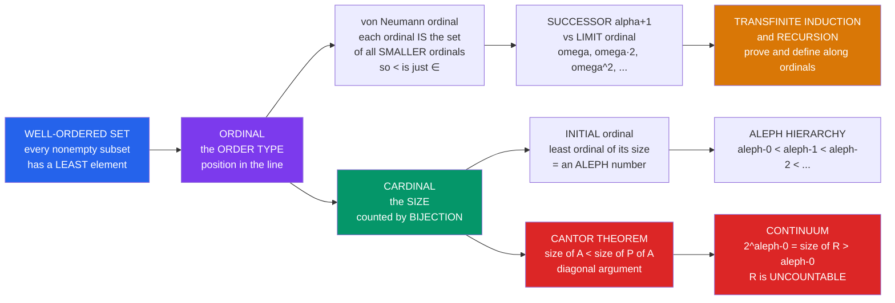

# 🔢 Ordinals and Cardinals

> [!abstract] TL;DR
> Cantor's theory of the **transfinite** splits "infinity" into two distinct notions. **Ordinals** measure *position* — the order type of a well-ordered line: after $0,1,2,\dots$ comes a first infinite number $\omega$, then $\omega+1, \omega+2, \dots, \omega\cdot 2, \dots, \omega^2, \dots, \omega^\omega, \dots, \varepsilon_0$. **Cardinals** measure *size* — how many elements, counted by bijection: $\aleph_0, \aleph_1, \aleph_2, \dots$. Ordinal arithmetic is **non-commutative** ($1+\omega=\omega \ne \omega+1$); cardinal arithmetic collapses ($\aleph_0+\aleph_0=\aleph_0\cdot\aleph_0=\aleph_0$). And **Cantor's theorem** ($|A|<|\mathcal{P}(A)|$), proved by the **diagonal argument**, shows some infinities are strictly bigger than others: $|\mathbb{R}|=2^{\aleph_0}>\aleph_0$. This is the "paradise" Hilbert refused to be expelled from.

## Intuition

**Analogy.** Counting doesn't stop at infinity — it just gets *started*. After you have run through every natural number $0, 1, 2, 3, \dots$ there is a first number *past* all of them, called $\omega$. Then counting resumes: $\omega+1, \omega+2, \dots$, then a second copy $\omega\cdot 2$, then $\omega\cdot 3, \dots$, then a whole new tower $\omega^2$, then $\omega^3, \dots, \omega^\omega, \dots$ — an endless **transfinite staircase**. Cantor's revolutionary discovery was that infinity comes in different **order-types** (how the staircase is arranged) *and* different **sizes** (how many steps there are). Ordinals answer "what position in the well-ordered line?"; cardinals answer "how many?". And — shockingly — some infinities are strictly **bigger** than others: there are provably *more* real numbers than whole numbers, and the proof is a single, devastating trick: the **diagonal argument**.

Two words to keep straight from the very first: **order** (ordinals — $\omega$, arrangement) versus **size** (cardinals — $\aleph_0$, count). Rearranging a line changes its ordinal but never its cardinal; that gap is the whole subject.

---

## How It Works

### Core mechanics

1. **Well-ordering.** A total order is a *well-order* if **every nonempty subset has a least element** — equivalently, there are no infinite descending chains. $\mathbb{N}$ is well-ordered; $\mathbb{Z}$ and $\mathbb{R}$ are not (no least element).
2. **Ordinals = order types of well-orders.** Two well-ordered sets have the same **ordinal** iff there is an order-isomorphism between them. The ordinal is the abstract "shape of the line."
3. **Von Neumann ordinals.** The genius encoding: each ordinal *is* the set of all smaller ordinals. $0=\emptyset$, $1=\{0\}$, $2=\{0,1\}$, $\dots$, $\omega=\{0,1,2,\dots\}=\mathbb{N}$, $\omega+1=\omega\cup\{\omega\}$. Then "$<$" is literally "$\in$", and every ordinal is well-ordered by membership.
4. **Successor vs limit.** A **successor** ordinal is $\alpha+1=\alpha\cup\{\alpha\}$ (has an immediate predecessor). A **limit** ordinal ($\omega$, $\omega\cdot 2$, $\omega^2$, $\varepsilon_0$) is the *supremum* of everything below it — no immediate predecessor.
5. **Transfinite induction / recursion.** To prove $P(\alpha)$ for *all* ordinals, prove it holds at $\alpha$ whenever it holds for all $\beta<\alpha$ (handling $0$, successors, and limits). Recursion likewise *defines* functions along the ordinals — this is how ordinal arithmetic itself is built.
6. **Cardinals = sizes via bijection.** $A$ and $B$ are **equinumerous** ($|A|=|B|$) iff a bijection exists. A **cardinal** is an equivalence class of this relation — or, concretely, the **initial ordinal**: the *least* ordinal of a given size. The infinite initial ordinals, listed in order, are the **aleph numbers** $\aleph_0<\aleph_1<\aleph_2<\dots$.
7. **Cantor's theorem.** For *every* set $A$, $|A|<|\mathcal{P}(A)|$ — the powerset is always strictly bigger. The **diagonal argument** proves it: no function $f:A\to\mathcal{P}(A)$ is onto, because $D=\{a\in A: a\notin f(a)\}$ is never in the image. Applied to $\mathbb{N}$: $|\mathbb{R}|=|\mathcal{P}(\mathbb{N})|=2^{\aleph_0}>\aleph_0$, so $\mathbb{R}$ is **uncountable**.

### Flow / architecture



---

## Key Concepts

### Secondary (intuitive)
- **Order vs size.** Ordinals count *positions* in a line that keeps going past infinity: $\omega, \omega+1, \omega\cdot 2, \omega^2, \dots$. Cardinals count *how many things* there are: $\aleph_0$ (as many as the whole numbers), then bigger.
- **The first infinite number** is $\omega$ — the position "just after all of $0,1,2,\dots$". You can keep adding: $\omega+1$ sits one step past $\omega$.
- **Some infinities are bigger.** There are *strictly more* real numbers than whole numbers. You cannot list the reals; any list you write down provably misses one (the diagonal number).
- **Countable vs uncountable.** If you can list a set as $a_0, a_1, a_2, \dots$ it is *countable* ($\aleph_0$): the integers $\mathbb{Z}$ and even the fractions $\mathbb{Q}$ qualify. The reals $\mathbb{R}$ do not — they are *uncountable*.

### Undergraduate (formal statements)
- **Ordinal (von Neumann).** A set $\alpha$ that is **transitive** (every element is a subset) and **well-ordered by $\in$**. Consequence: $\alpha=\{\beta:\beta<\alpha\}$, and the ordinals themselves are well-ordered.
- **Ordinal arithmetic** (defined by transfinite recursion, so **non-commutative**):
  - $\alpha+0=\alpha$; $\ \alpha+(\beta+1)=(\alpha+\beta)+1$; $\ \alpha+\lambda=\sup_{\beta<\lambda}(\alpha+\beta)$ for limit $\lambda$.
  - $1+\omega=\omega \ne \omega+1$ (prepending one step is invisible in the limit; appending one is not).
  - $2\cdot\omega=\omega \ne \omega\cdot 2$; $\ \omega\cdot(\omega+1)=\omega^2+\omega \ne (\omega+1)\cdot\omega=\omega^2$.
- **Cantor normal form.** Every ordinal $<\varepsilon_0$ has a unique base-$\omega$ expansion $\omega^{\beta_1}c_1+\dots+\omega^{\beta_k}c_k$ with $\beta_1>\dots>\beta_k\ge 0$ and finite $c_i\ge 1$. $\varepsilon_0$ is the least fixed point $\omega^\varepsilon=\varepsilon$ — the first ordinal its own tower cannot reach.
- **Cardinality & $\aleph$.** $|A|\le|B|$ iff an injection $A\hookrightarrow B$ exists. Under AC every set is well-orderable, so every infinite cardinal is an **aleph** $\aleph_\alpha$ (the $\alpha$-th initial ordinal, written $\omega_\alpha$ when viewed as an ordinal).
- **Cantor's theorem.** $|A|<|\mathcal{P}(A)|$ (diagonal set $D=\{a:a\notin f(a)\}$). Hence no largest cardinal; the aleph hierarchy never terminates.
- **Cantor-Schröder-Bernstein.** If injections $A\hookrightarrow B$ **and** $B\hookrightarrow A$ both exist, then $|A|=|B|$ — proved **without** the Axiom of Choice.
- **Cardinal arithmetic collapses.** For infinite $\kappa$: $\kappa+\kappa=\kappa\cdot\kappa=\kappa$; thus $\aleph_0+\aleph_0=\aleph_0\cdot\aleph_0=\aleph_0$ (why $\mathbb{Z}$, $\mathbb{Q}$, and $\mathbb{N}\times\mathbb{N}$ are all countable). Exponentiation is where the action lives: $2^{\aleph_0}=|\mathbb{R}|$, the **continuum**.

### Graduate (mechanisms and reach)
- **Ordinal vs cardinal exponentiation differ.** *Ordinal* $2^\omega=\omega$ (a limit of finite ordinals), but *cardinal* $2^{\aleph_0}>\aleph_0$. Same notation, different operations — a classic trap.
- **Aleph vs beth.** Alephs are defined by *successor cardinals*: $\aleph_{\alpha+1}$ is the next cardinal after $\aleph_\alpha$. **Beths** iterate the powerset: $\beth_0=\aleph_0$, $\beth_{\alpha+1}=2^{\beth_\alpha}$, $\beth_\lambda=\sup_{\alpha<\lambda}\beth_\alpha$. Always $\aleph_\alpha\le\beth_\alpha$; **CH is exactly $\beth_1=\aleph_1$** and **GCH is $\aleph_\alpha=\beth_\alpha$ for all $\alpha$**.
- **The continuum $2^{\aleph_0}=\beth_1$.** Its value is **not decided by ZFC** (foreshadowing the Continuum Hypothesis). Cohen's forcing can make it $\aleph_2, \aleph_{17}, \aleph_{\omega+1}, \dots$ — König's theorem is the *only* ZFC constraint of note: $\operatorname{cf}(2^{\aleph_0})>\aleph_0$, so $2^{\aleph_0}\ne\aleph_\omega$.
- **Cofinality; regular vs singular.** $\operatorname{cf}(\kappa)$ is the least length of a sequence converging up to $\kappa$. $\kappa$ is **regular** if $\operatorname{cf}(\kappa)=\kappa$ (e.g. $\aleph_0$, every successor $\aleph_{\alpha+1}$) and **singular** otherwise ($\aleph_\omega$ has cofinality $\aleph_0$). Singular Cardinal Hypothesis and pcf theory (Shelah) live here.
- **Transfinite recursion builds the universe.** The **cumulative hierarchy** $V_0=\emptyset$, $V_{\alpha+1}=\mathcal{P}(V_\alpha)$, $V_\lambda=\bigcup_{\alpha<\lambda}V_\alpha$ is defined by recursion on ordinals; $V=\bigcup_\alpha V_\alpha$ is the set-theoretic universe, with **rank** = the ordinal at which a set first appears.
- **Well-ordering $\Leftrightarrow$ AC.** "Every set can be well-ordered" (hence assigned a cardinal $\aleph_\alpha$) is *equivalent* to the Axiom of Choice — Zermelo's 1904 theorem. Without AC, cardinals need not be linearly ordered and some sets may have *no* aleph at all (foreshadowing the companion note on Choice).
- **Beyond the alephs.** Assuming inaccessibles, measurables, and stronger axioms extends the ladder into the *higher infinite* — the study of large cardinals, where new ordinals dwarf $\varepsilon_0$, $\Gamma_0$, and everything provably definable in weaker systems.

---

## Python Demo

```python
# Transfinite numbers made concrete: (a) ORDINAL arithmetic in Cantor
# normal form (CNF) up to but below omega^omega -- proving addition and
# multiplication are NON-commutative -- and a "compressed number line"
# picture of the order types omega, omega*2, omega^2; (b) CANTOR'S
# DIAGONAL argument building a real not on any given list (|R| > |N|),
# contrasted with the zig-zag bijection N <-> Q that makes Q countable.
import numpy as np
import matplotlib.pyplot as plt

# =====================================================================
# (a) ORDINAL ARITHMETIC in Cantor normal form, for ordinals < omega^omega
#     Represent an ordinal as {exponent: coefficient}, exponents natural
#     numbers.  e.g. omega+1 = {1:1, 0:1};  omega^2 = {2:1};  n = {0:n}.
# =====================================================================
def add(a, b):
    """Ordinal (natural) addition on CNF dicts -- NON-commutative."""
    if not b: return dict(a)
    lead = max(b)                      # largest exponent appearing in b
    r = {e: c for e, c in a.items() if e > lead}   # a's terms ABOVE lead
    if lead in a:                                   # combine at the seam
        r[lead] = a[lead]
    for e, c in b.items():             # b's terms absorb a's lower ones
        r[e] = r.get(e, 0) + c
    return r

def mul(a, b):
    """Ordinal multiplication on CNF dicts -- NON-commutative."""
    if not a or not b: return {}
    la, ca = max(a), a[max(a)]         # leading exponent / coefficient of a
    r = {}
    for be in sorted(b, reverse=True): # distribute a over each term of b
        bc = b[be]
        if be > 0:                     # infinite part: only a's LEAD survives
            r[la + be] = r.get(la + be, 0) + ca * bc
        else:                          # finite part: a repeated bc times
            term = dict(a); term[la] = ca * bc
            r = add(r, term)
    return r

def show(a):
    if not a: return "0"
    out = []
    for e in sorted(a, reverse=True):
        c = a[e]
        base = "1" if e == 0 else ("w" if e == 1 else f"w^{e}")
        out.append(base if (e == 0 or c == 1) else
                   (str(c) if e == 0 else f"{base}*{c}"))
    return " + ".join(out)

w   = {1: 1}          # omega
one = {0: 1}          # 1

print("ORDINAL ARITHMETIC (non-commutative):")
print(f"  1 + w   = {show(add(one, w)):8s}   w + 1   = {show(add(w, one))}")
print(f"  --> 1+w = w  != w+1        (addition non-commutative)")
print(f"  w*(w+1) = {show(mul(w, add(w, one))):8s}   (w+1)*w = {show(mul(add(w, one), w))}")
print(f"  --> multiplication non-commutative too")
# a climbing tower omega^1, omega^2, ... approaching (but never = ) omega^omega
tower = [{n: 1} for n in range(1, 6)]
print("  tower toward w^w:  " + ", ".join(show(t) for t in tower) + ", ...")

# =====================================================================
# (b) CANTOR'S DIAGONAL argument: any list of infinite binary sequences
#     misses the flipped-diagonal sequence -> reals are UNCOUNTABLE.
# =====================================================================
rng = np.random.default_rng(0)
N = 14
listing = rng.integers(0, 2, size=(N, N))     # a "purported enumeration"
diagonal = np.diag(listing)
antidiag = 1 - diagonal                        # differ from row i in bit i
# antidiag disagrees with EVERY listed row at its own index -> not in list
disagrees = [antidiag[i] != listing[i, i] for i in range(N)]
print(f"\nCANTOR DIAGONAL: constructed sequence differs from every row: "
      f"{all(disagrees)}  => |R| > |N|")

# =====================================================================
#     CONTRAST: Q is COUNTABLE via the zig-zag.  Enumerate reduced
#     positive fractions p/q along anti-diagonals p+q = 2,3,4,...
# =====================================================================
from math import gcd
enum, seen, s = [], set(), 2
while len(enum) < 40:
    for p in range(1, s):               # walk the anti-diagonal p+q = s
        q = s - p
        val = (p, q)
        if gcd(p, q) == 1 and val not in seen:
            seen.add(val); enum.append(val)
    s += 1
print("N <-> Q+ (zig-zag):  " +
      ", ".join(f"{p}/{q}" for p, q in enum[:10]) + ", ...  (aleph_0)")
print("cardinal collapse:   aleph_0 + aleph_0 = aleph_0 * aleph_0 = aleph_0")

# ----------------------------- plotting ------------------------------
fig, ax = plt.subplots(2, 2, figsize=(13, 10))

# TL: compressed number lines for order types omega, omega*2, omega^2
axo = ax[0, 0]
def omega_block(x0, width, k=9):        # k dots converging to x0+width
    xs = x0 + width * (1 - 1.0 / (np.arange(k) + 1))
    return xs
rows = [("w",     [omega_block(0.0, 1.0)],                        1),
        ("w*2",   [omega_block(0.0, 0.5), omega_block(0.5, 0.5)], 2),
        ("w^2",   [omega_block(1 - 1.0/(j+1), 1.0/(j+1) - 1.0/(j+2), 6)
                   for j in range(6)],                            6)]
for i, (lab, blocks, nb) in enumerate(rows):
    y = 2 - i
    for b in blocks:
        axo.scatter(b, np.full_like(b, y), s=16, color="#1565c0", zorder=3)
        axo.scatter([b[-1] + (b[-1] - b[-2])], [y], s=42, marker="|",
                    color="crimson", zorder=4)          # limit point
    axo.text(-0.16, y, f"${lab}$", ha="right", va="center", fontsize=13)
axo.set_title("Order types on a COMPRESSED number line\n"
              "dots = elements, red bars = limit ordinals")
axo.set_xlim(-0.3, 1.08); axo.set_ylim(-0.4, 2.6)
axo.set_yticks([]); axo.set_xticks([])

# TR: Cantor diagonal matrix, diagonal + flipped sequence highlighted
axd = ax[0, 1]
axd.imshow(listing, cmap="Blues", vmin=0, vmax=1)
for i in range(N):
    axd.add_patch(plt.Rectangle((i - .5, i - .5), 1, 1, fill=False,
                                edgecolor="crimson", lw=2))
axd.set_title("Cantor diagonal: flip the diagonal bits\n"
              "-> a sequence on NO row  =>  R is uncountable")
axd.set_xlabel("bit index j"); axd.set_ylabel("listed sequence i")
axd.set_xticks(range(0, N, 2)); axd.set_yticks(range(0, N, 2))

# BL: zig-zag enumeration of Q+  (bijection N <-> Q shows Q countable)
axq = ax[1, 0]
pts = np.array(enum)
axq.plot(pts[:, 0], pts[:, 1], "-o", color="#2e7d32", ms=4, lw=1.0,
         alpha=0.8)
for n, (p, q) in enumerate(enum[:12]):
    axq.annotate(str(n), (p, q), textcoords="offset points",
                 xytext=(3, 3), fontsize=7, color="black")
axq.set_title("Q is COUNTABLE: zig-zag bijection N <-> Q+\n"
              "reduced fractions along anti-diagonals p+q = const")
axq.set_xlabel("numerator p"); axq.set_ylabel("denominator q")
axq.set_xlim(0, 9); axq.set_ylim(0, 9); axq.grid(alpha=0.3)

# BR: the transfinite staircase 0,1,2,..,w,w+1,..,w*2,..,w^2,..,w^w
axs = ax[1, 1]
labels = ["0", "1", "2", "…", "w", "w+1", "…", "w*2", "…",
          "w^2", "…", "w^3", "…", "w^w"]
xs = 1 - 1.0 / (np.arange(len(labels)) + 1.4)      # compress to [0,1)
axs.scatter(xs, np.zeros_like(xs), s=30, color="#6a1b9a", zorder=3)
for x, lab in zip(xs, labels):
    axs.text(x, 0.06, lab, rotation=60, ha="left", va="bottom", fontsize=9)
axs.axvline(xs[-1] + 0.01, color="crimson", ls="--", lw=1)
axs.text(xs[-1] + 0.012, -0.12, "limit w^w", color="crimson", fontsize=9)
axs.set_title("The endless TRANSFINITE STAIRCASE (order type)\n"
              "each limit ordinal is the sup of all below it")
axs.set_xlim(0, 1.02); axs.set_ylim(-0.25, 0.6)
axs.set_yticks([]); axs.set_xticks([])

plt.tight_layout()
plt.savefig("ordinals_and_cardinals.png", dpi=120)
plt.show()
```

**What it shows.** Part (a) implements ordinal arithmetic in Cantor normal form and prints the two signature failures of commutativity: $1+\omega=\omega$ but $\omega+1\ne\omega$, and $\omega\cdot(\omega+1)=\omega^2+\omega$ but $(\omega+1)\cdot\omega=\omega^2$. The compressed-number-line panel renders the *order types* $\omega$ (one converging sequence), $\omega\cdot 2$ (two of them), and $\omega^2$ (a sequence of sequences), each red bar marking a limit ordinal. Part (b) runs Cantor's diagonal: the flipped diagonal of any listing disagrees with row $i$ at bit $i$, so it appears on *no* row — the reals are uncountable, $|\mathbb{R}|=2^{\aleph_0}>\aleph_0$. For contrast, the zig-zag panel exhibits an explicit bijection $\mathbb{N}\leftrightarrow\mathbb{Q}^{+}$ (reduced fractions along anti-diagonals), proving $\mathbb{Q}$ is merely *countable* — the same $\aleph_0$ as $\mathbb{N}$, illustrating the cardinal collapse $\aleph_0\cdot\aleph_0=\aleph_0$.

---

## Real-World Applications

- **Termination proofs (Goodstein, ordinal analysis).** Assign a decreasing ordinal to each step of a program or rewriting system; because the ordinals are well-ordered, no infinite descent is possible, so the process **must halt**. Goodstein's theorem uses ordinals below $\varepsilon_0$; the *proof-theoretic ordinal* $\varepsilon_0$ measures the exact strength of Peano Arithmetic (Gentzen).
- **Recursion and data structures.** Well-founded recursion — the computational shadow of transfinite recursion — justifies structural recursion over trees and inductive types, and underpins termination checkers in Coq, Lean, and Agda.
- **Countability arguments in analysis and CS.** "There are only $\aleph_0$ Turing machines but $2^{\aleph_0}$ languages, so **most languages are undecidable**" is a pure cardinality count. Likewise almost all reals are non-computable and non-definable — diagonalization is the engine behind the halting problem and Gödel's theorems.
- **Database and type theory.** Ranks in the cumulative hierarchy model well-founded (non-circular) data; Cantor-Schröder-Bernstein underlies "if each type embeds into the other, they are isomorphic" arguments.
- **Foundations.** Every consistency and independence result about the continuum ($2^{\aleph_0}$), and every large-cardinal hypothesis calibrating the strength of ZFC extensions, is stated in the language of ordinals and cardinals.

---

## Common Pitfalls

- **Ordinal $\ne$ cardinal: $\omega$ vs $\aleph_0$.** They label the *same* underlying set $\mathbb{N}$ but answer different questions — $\omega$ is its *order type*, $\aleph_0$ is its *size*. Crucially $\omega, \omega+1, \omega\cdot 2, \omega^2, \dots$ are all **distinct ordinals** yet all have the **same cardinality** $\aleph_0$. Rearranging a countable set changes its ordinal, never its cardinal.
- **Ordinal arithmetic is non-commutative.** $1+\omega=\omega\ne\omega+1$ and $2\cdot\omega=\omega\ne\omega\cdot 2$. Prepending before an infinite tail vanishes into the limit; appending after it does not. Never assume $\alpha+\beta=\beta+\alpha$ for ordinals.
- **Cardinal arithmetic collapses.** For infinite cardinals $\aleph_0+\aleph_0=\aleph_0$ and $\aleph_0\cdot\aleph_0=\aleph_0$ — addition and multiplication are *trivial*. All the content moved to **exponentiation**: $2^{\aleph_0}$ is genuinely larger. Do not carry finite arithmetic intuition ($n+n>n$) into the transfinite.
- **Ordinal vs cardinal exponentiation are different operations.** Ordinal $2^\omega=\omega$ (a countable limit), but cardinal $2^{\aleph_0}=|\mathbb{R}|>\aleph_0$. Identical notation, opposite conclusions — always know which arithmetic you are in.
- **Aleph vs beth.** $\aleph_{\alpha+1}$ is the *next cardinal*; $\beth_{\alpha+1}=2^{\beth_\alpha}$ is the *next powerset*. They coincide at $0$ ($\aleph_0=\beth_0$) but $\aleph_1=\beth_1$ is exactly the (undecidable) Continuum Hypothesis, **not** a theorem.
- **"Continuum $=2^{\aleph_0}$" does not pin down which aleph it is.** $|\mathbb{R}|=2^{\aleph_0}=\beth_1$ is a *definition*; whether that equals $\aleph_1$, $\aleph_2$, $\dots$ is independent of ZFC. Writing $2^{\aleph_0}=\aleph_1$ as if proven is the classic CH error.
- **Diagonal misuse.** The diagonal argument shows *no surjection* $\mathbb{N}\to\mathbb{R}$ exists; it does **not** work against $\mathbb{Q}$, because the diagonal-flip of a list of rationals need not be rational — which is exactly why $\mathbb{Q}$ *can* be enumerated.

---

## Related Concepts

- [[Mathematics/14_Advanced_Topics/Mathematical_Logic_and_Set_Theory|Mathematical Logic and Set Theory]] — situates ordinals, cardinals, the aleph hierarchy, and CH inside the full ZFC + Gödel picture.
- [[Mathematics/04_Discrete_Mathematics/Set_Theory_and_Relations|Set Theory and Relations]] — introduces cardinality, countable vs uncountable, and the diagonal argument at first-course level; this note is its transfinite deep-dive.
- [[Mathematics/08_Real_Analysis/Real_Numbers_and_Completeness|Real Numbers and Completeness]] — where $|\mathbb{R}|=2^{\aleph_0}$ and Cantor's uncountability of $\mathbb{R}$ do analytic work (Baire category, measure).
- [[Mathematical_Logic/01_Foundations_of_Formal_Logic/Compactness_and_Lowenheim_Skolem|Compactness and Löwenheim-Skolem]] — Skolem's paradox (a *countable* model of set theory) makes cardinality **model-relative**, sharpening what "$\aleph_1$" means from inside vs outside.
- [[Mathematical_Logic/01_Foundations_of_Formal_Logic/First_Order_Predicate_Logic|First-Order Predicate Logic]] — the language in which well-ordering, ordinals, and the ZFC axioms are formalized.
- [[Mathematical_Logic/01_Foundations_of_Formal_Logic/Mathematical_Logic_Overview|Mathematical Logic Overview]] — the map of the logic vault this Set Theory section extends.
- [[Mathematics/04_Discrete_Mathematics/Combinatorics|Combinatorics]] — finite counting whose infinite limit is cardinal arithmetic; the zig-zag pairing is a combinatorial bijection.
- [[Combinatorics/01_Foundations_of_Counting/Combinatorics_Overview|Combinatorics Overview]] — the counting principles that "how many" (cardinality) generalizes into the transfinite.

_Siblings within this Set Theory section (prose only, planned):_ **Axiomatic_Set_Theory_ZFC** (the axioms that guarantee ordinals, powersets, and replacement exist), **The_Axiom_of_Choice_and_Equivalents** (well-ordering ⟺ AC; every set gets an aleph), **The_Continuum_Hypothesis** ($2^{\aleph_0}=\aleph_1$? — independent of ZFC), and **Large_Cardinals_and_the_Higher_Infinite** (extending the aleph ladder past everything ZFC can reach).

---

## Review Questions

**Secondary.** Explain in your own words the difference between an *ordinal* and a *cardinal*, using $\omega$ and $\aleph_0$ as examples. Why do $\omega$, $\omega+1$, and $\omega\cdot 2$ all describe sets of the *same size* even though they are different ordinals?

**Undergraduate.** (a) Give Cantor's diagonal argument that $\mathbb{R}$ is uncountable, being explicit about how the constructed number differs from every listed number. (b) Then give the zig-zag bijection showing $\mathbb{Q}$ *is* countable, and explain precisely why the diagonal argument does **not** also apply to $\mathbb{Q}$.

**Graduate (scenario / trade-off).** You are told $2^{\aleph_0}=\aleph_2$ in some model of ZFC. (a) Is this consistent? What does König's theorem forbid, e.g. can $2^{\aleph_0}=\aleph_\omega$? (b) Distinguish the aleph and beth values of the continuum here, and state where the Continuum Hypothesis sits. (c) Compute $\omega^2\cdot\omega$ and $(\omega+1)\cdot\omega$ in Cantor normal form and explain, in terms of successor vs limit ordinals, why ordinal multiplication is non-commutative while cardinal multiplication is trivial.

---

## Sources

- Cantor, G. (1891). "Über eine elementare Frage der Mannigfaltigkeitslehre." *Jahresbericht der DMV* 1 — the original **diagonal argument** and $|A|<|\mathcal{P}(A)|$.
- Jech, T. *Set Theory* (3rd Millennium ed.), Springer — ordinals, cardinals, cofinality, cardinal arithmetic, the standard graduate reference.
- Enderton, H. B. *Elements of Set Theory*, Academic Press — clean undergraduate development of well-orderings, ordinals, and cardinals.
- Hrbacek, K. & Jech, T. *Introduction to Set Theory* (3rd ed.), CRC Press — accessible treatment of transfinite induction/recursion and the aleph hierarchy.
- Kunen, K. *Set Theory: An Introduction to Independence Proofs*, North-Holland — cardinal arithmetic, cofinality, and the continuum toward independence.

---

#mathematical-logic #ordinals #cardinals #cantor #transfinite
