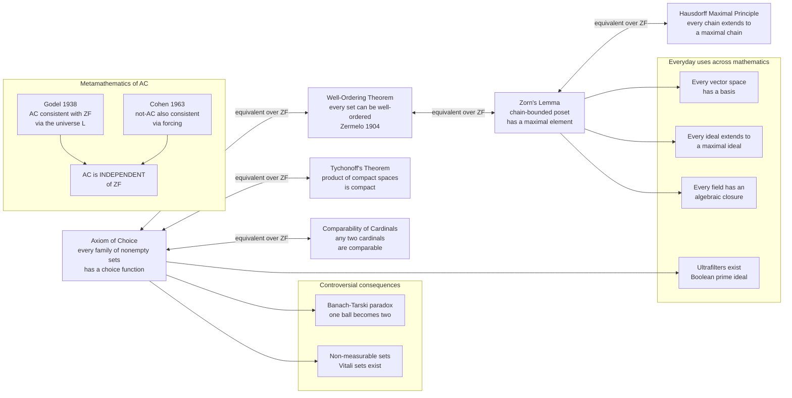

# 🧦 The Axiom of Choice and Equivalents

> [!abstract] TL;DR
> The **Axiom of Choice (AC)** says that for *any* collection of nonempty sets — even infinitely many — there is a **choice function** that simultaneously selects one element from each. It is provably equivalent, over the rest of set theory (ZF), to the **Well-Ordering Theorem** (every set can be well-ordered), **Zorn's Lemma** (every poset in which every chain has an upper bound has a maximal element), and **Tychonoff's theorem** (a product of compact spaces is compact). AC is the quiet engine behind "every vector space has a basis," "every field has an algebraic closure," and "every ideal extends to a maximal ideal" — yet it is **non-constructive** and yields shocks like the **Banach–Tarski paradox**. Gödel and Cohen proved AC is **independent** of ZF: assuming ZF is consistent, both AC and its negation are consistent with it.

---

## Intuition

**Analogy:** You own **infinitely many pairs of shoes** and **infinitely many pairs of socks**, and you must pick exactly one item from every pair. For the shoes this is easy — state a *rule*: "always take the left shoe." One sentence handles all infinitely many pairs at once. But the socks in each pair are **identical**: there is no describable rule that distinguishes one from the other. Intuitively you feel you can still "just choose one from each pair," but you cannot *write down* how. The **Axiom of Choice** is precisely the assertion that you *can* make infinitely many such **arbitrary, simultaneous choices** even when no rule exists to guide them. (Bertrand Russell's original image.)

This one modest-sounding assumption is used daily and unconsciously across mathematics — yet it is powerful enough to imply that a solid ball can be cut into finitely many pieces and reassembled into **two** balls identical to the original. That is why AC is the most debated axiom in all of mathematics: obvious to most, poisonous to constructivists, and logically **independent** of the axioms it sits beside.

---

## How It Works

### Core Mechanics

1. **The statement.** A **choice function** on a family `{A_i}` of nonempty sets is a function `f` with `f(i) ∈ A_i` for every `i`. AC asserts: *every* family of nonempty sets has such a function. The content is entirely in the **infinite, unstructured** case — for finitely many sets, or for sets carrying a definable selection rule (a well-order, a minimum, a canonical representative), a choice function is built by hand and **AC is not needed**.

2. **Why "arbitrary" is the crux.** If the sets come with structure — say each is a nonempty set of natural numbers — you pick the least element and are done, no axiom required (shoes). AC earns its keep exactly when the sets are *indistinguishable* and no formula selects a witness (socks). It postulates the *existence* of the selection **without exhibiting it**.

3. **The web of equivalents (all equivalent over ZF).**
   - **Well-Ordering Theorem** (Zermelo 1904): every set admits a *well-order* — a total order in which every nonempty subset has a least element. Given a well-order, "pick the least element of each `A_i`" is an explicit choice function, so Well-Ordering ⇒ AC; the converse is Zermelo's theorem.
   - **Zorn's Lemma**: if `(P, ≤)` is a nonempty poset in which every **chain** (totally ordered subset) has an **upper bound** in `P`, then `P` has a **maximal** element. This is the form working mathematicians actually invoke.
   - **Hausdorff Maximal Principle**: every chain in a poset extends to a *maximal* chain — a repackaging of Zorn.
   - **Tychonoff's Theorem**: an arbitrary product of compact topological spaces is compact. This is *equivalent* to full AC (Kelley); the version for Hausdorff spaces needs only the weaker Boolean-prime-ideal theorem.
   - **Comparability of cardinals**: for any two sets, one injects into the other — trichotomy of sizes — which fails without AC.

4. **How Zorn does the work.** To build a maximal object, order the *partial* objects by extension so that every chain's **union** is again a legal partial object (an upper bound). Zorn then hands you a maximal one. This single template proves: **every vector space has a basis** (maximal linearly independent set), **every ideal extends to a maximal ideal**, **every field has an algebraic closure**, and **ultrafilters exist**.

5. **The price.** The proofs are **non-constructive**: they certify that the object *exists* without producing it. Pushed hard, AC manufactures pathologies — **non-measurable sets** (Vitali) and the **Banach–Tarski paradox** — objects no explicit construction could ever name.

6. **Independence.** Gödel (1938) showed AC holds in the *constructible universe* `L`, so `Con(ZF) ⇒ Con(ZF + AC)`; Cohen (1963) used **forcing** to build a model of `ZF + ¬AC`, so `Con(ZF) ⇒ Con(ZF + ¬AC)`. Hence AC is **independent** of ZF — neither provable nor refutable from it.

### Flow / Architecture



---

## Key Concepts

### Secondary Level

**A choice function is a "one from each" selector.** Given a shelf of nonempty jars, a choice function reaches into every jar and pulls out exactly one item, all at once. For *finitely* many jars nobody blinks — you just do it. AC is the promise that this works even for **infinitely many** jars, and even when the items are so alike that no rule tells you which to grab.

**Shoes versus socks.** With infinitely many pairs of shoes you never need AC: "take every left shoe" is a rule covering all pairs simultaneously. With infinitely many pairs of *identical* socks there is no such rule — and yet AC says a selection still exists. The axiom is exactly the leap from "I can describe the choice" to "the choice exists even if I cannot describe it."

**Maximal is not the same as maximum.** Zorn's Lemma delivers a *maximal* element — one with nothing strictly above it — not a *greatest* element that sits above everything. A poset can have several maximal elements at once (think: several different "dead ends," none comparable to the others). This distinction is the heart of the Python demo below.

**One axiom, two faces.** AC feels utterly obvious, yet it forces conclusions that feel impossible (the Banach–Tarski "two balls from one"). Both reactions are correct — which is exactly why the axiom is famous.

### Undergraduate Level

**Formal statement.** For any index set `I` and family `{A_i : i ∈ I}` with every `A_i ≠ ∅`, there exists `f : I → ⋃_i A_i` with `f(i) ∈ A_i` for all `i`. Equivalently, a product of nonempty sets is nonempty: `∏_i A_i ≠ ∅`.

**Zorn's Lemma as the algebraist's tool.** *If every chain in a nonempty poset `P` has an upper bound in `P`, then `P` has a maximal element.* The standard applications share one recipe — order the partial solutions by inclusion, note that the union of a chain of partial solutions is another partial solution (the upper bound), and read off a maximal one:

| Object built | Poset ordered by inclusion | Maximal element is |
|---|---|---|
| Basis of a vector space | linearly independent subsets | a **Hamel basis** |
| Maximal ideal of a ring | proper ideals containing a given ideal | a **maximal ideal** |
| Algebraic closure of a field | algebraic field extensions | an **algebraic closure** |
| Ultrafilter on a set | filters extending a given filter | an **ultrafilter** |

**Well-ordering and transfinite recursion.** Zermelo's theorem lets you well-order *any* set, so you can run **transfinite recursion** over it — the backbone of many existence proofs (Hamel bases of `ℝ` over `ℚ`, constructions of Vitali and Bernstein sets). Well-ordering `ℝ` is possible under AC but *no explicit well-order of `ℝ` can be written down*.

**Weaker choice principles.** Most of everyday analysis does not need full AC:
- **Countable Choice (ACω)** — choose from countably many nonempty sets. Enough to prove a countable union of countable sets is countable, and that sequential and topological continuity agree on `ℝ`.
- **Dependent Choice (DC)** — build an infinite sequence where each step depends on the previous one. Enough for the Baire Category Theorem and most of "sequential" real analysis. Full AC ⇒ DC ⇒ ACω, and none of the reverse implications hold.

**What AC buys in topology.** Tychonoff's theorem (arbitrary products of compacts are compact) is *equivalent* to AC and underlies the existence of the Stone–Čech compactification and weak-* compactness (Banach–Alaoglu).

### Graduate Level

**Equivalence proofs (sketch of the cycle AC ⇒ Zorn ⇒ Well-Ordering ⇒ AC).**
- *AC ⇒ Zorn.* Suppose a poset `P` has upper bounds for all chains but no maximal element. Then every chain has a *strict* upper bound; use a choice function on the sets of strict upper bounds to define, by transfinite recursion, a strictly increasing `ω_1`-length (indeed Ord-length) sequence in `P` — impossible, since it would inject the class of ordinals into the set `P` (Hartogs). Contradiction.
- *Zorn ⇒ Well-Ordering.* On a set `X`, order the *partial well-orders* of subsets of `X` by end-extension. Chains have upper bounds (their union). A maximal one must well-order all of `X`, else a leftover element extends it.
- *Well-Ordering ⇒ AC.* Well-order `⋃_i A_i`; set `f(i) = min A_i`. Explicit choice function.

**Independence, precisely.** In `L`, Gödel's constructible universe, every set is definable by transfinite recursion, which yields a definable global well-order and hence **AC + GCH** — so `Con(ZF) ⇒ Con(ZFC + GCH)`. Cohen's **forcing** adjoins generic sets to a countable transitive model; the *symmetric submodel* over an infinite set of mutually generic "socks" (Cohen reals) contains an infinite family with **no** choice function, giving `Con(ZF) ⇒ Con(ZF + ¬AC)`. AC is therefore strictly independent of ZF, and independent even of `ZF + DC`.

**The measure-theoretic fault line.** Full AC produces a **Vitali set** — pick one representative from each coset of `ℚ` in `ℝ` — which is Lebesgue **non-measurable**. Solovay showed that, granting an inaccessible cardinal, there is a model of `ZF + DC` in which *every* set of reals is Lebesgue measurable; Shelah connected the strength of "all sets measurable" to inaccessibles. So the existence of non-measurable sets is a genuine consequence of AC beyond DC, not an artifact of ZF.

**Banach–Tarski in one breath.** The free group on two generators `F_2` embeds in the rotation group `SO(3)`; its paradoxical decomposition (a set equal to two disjoint copies of itself under the group action) transfers, via a choice of orbit representatives, to a **paradoxical decomposition of the unit ball**. It exploits AC twice: to pick orbit representatives and to handle the fixed points. The pieces are non-measurable, which is *why* volume is not preserved.

**Fragments and their reversals.** Reverse mathematics locates many theorems exactly: the Boolean-prime-ideal theorem (BPI, weaker than AC) already gives the compactness theorem of first-order logic, the ultrafilter lemma, and Hausdorff-Tychonoff; the Hahn–Banach theorem follows from BPI and is strictly weaker than full AC. Mapping a theorem to the *precise* choice principle it needs is a research program in its own right (Rubin & Rubin; Howard & Rubin catalogue hundreds of forms).

---

## Python Demo

```python
"""
The Axiom of Choice, made concrete where it CAN be made concrete.

(a) CHOICE FUNCTION on a FINITE collection of nonempty sets. For finitely many
    sets — or any sets carrying a selection RULE like 'take the minimum' — a
    choice function is built by hand and needs NO axiom. We then flag the LEAP
    to infinitely many ARBITRARY (rule-less) sets, where AC is what guarantees
    the selection exists.

(b) ZORN'S LEMMA in action on computable posets:
      (b1) a BASIS as a MAXIMAL linearly independent set  -> 'every vector
           space has a basis' and 'every ideal extends to a maximal ideal';
      (b2) MAXIMAL ELEMENTS and a MAXIMAL CHAIN in the divisibility poset,
           visualized as a Hasse diagram (maximal != maximum).
"""

import numpy as np
import matplotlib.pyplot as plt
from collections import defaultdict
from matplotlib.lines import Line2D

# =====================================================================
# PART (a) — a CHOICE FUNCTION for a FINITE collection of nonempty sets
# =====================================================================
collection = [{3, 8, 5}, {7}, {1, 9, 4, 2}, {6, 0}]

def choice_by_min(sets):
    """An EXPLICIT choice function: from each set take its least element."""
    return [min(S) for S in sets]

selected = choice_by_min(collection)
print("PART (a) - choice function on a FINITE collection")
for S, x in zip(collection, selected):
    print(f"  from {sorted(S)}  ->  chose {x}")
assert all(x in S for S, x in zip(collection, selected))
print("  every chosen element lies in its set  ->  a valid choice function")
print("  LEAP: for INFINITELY many identical, rule-less pairs (socks), no such")
print("        formula exists -- AC ASSERTS the choice function anyway.\n")

# =====================================================================
# PART (b1) — ZORN: a BASIS is a MAXIMAL linearly independent set
# =====================================================================
vectors = {
    "v1": np.array([1.0, 0.0, 0.0]),
    "v2": np.array([0.0, 1.0, 0.0]),
    "v3": np.array([1.0, 1.0, 0.0]),   # = v1 + v2  (dependent once v1,v2 chosen)
    "v4": np.array([0.0, 0.0, 1.0]),
}

def is_independent(cols):
    if not cols:
        return True
    M = np.column_stack(cols)
    return np.linalg.matrix_rank(M) == M.shape[1]

basis, basis_names = [], []
for name, v in vectors.items():             # greedily extend the chain of
    if is_independent(basis + [v]):         # independent subsets (Zorn's poset)
        basis.append(v)
        basis_names.append(name)

print("PART (b1) - Zorn: a basis = a MAXIMAL independent set")
print(f"  maximal independent set (a basis): {basis_names}")
print(f"  size {len(basis)} = dim of the span; adding any leftover breaks independence\n")

# =====================================================================
# PART (b2) — ZORN on the DIVISIBILITY poset of {1,...,12}
# =====================================================================
N = 12
S = list(range(1, N + 1))

def is_prime(p):
    return p > 1 and all(p % q for q in range(2, int(p ** 0.5) + 1))

# maximal element: no PROPER multiple inside S
maximal = [m for m in S if not any(k != m and k % m == 0 for k in S)]

# Hasse cover: m covers d  iff  d | m and m/d is prime (nothing strictly between)
covers = [(d, m) for d in S for m in S
          if m != d and m % d == 0 and is_prime(m // d)]

# a MAXIMAL CHAIN built greedily from 1 (every chain has an upper bound;
# Zorn promises a maximal one -- here we exhibit it explicitly)
chain = [1]
while True:
    ups = [m for (d, m) in covers if d == chain[-1]]
    if not ups:
        break
    chain.append(min(ups))

print("PART (b2) - divisibility poset on {1,...,12}")
print(f"  maximal elements (no proper multiple in S): {maximal}")
print(f"  a maximal chain from 1: {chain}  (top {chain[-1]} is maximal)")

# ---- layout: rank = number of prime factors counted with multiplicity ------
def bigomega(m):
    c, d = 0, 2
    while d * d <= m:
        while m % d == 0:
            m //= d
            c += 1
        d += 1
    if m > 1:
        c += 1
    return c

levels = defaultdict(list)
for m in S:
    levels[bigomega(m)].append(m)

pos = {}
for r, members in levels.items():
    members = sorted(members)
    xs = np.linspace(-(len(members) - 1) / 2, (len(members) - 1) / 2, len(members))
    for x, m in zip(xs, members):
        pos[m] = (x, r)

# ---- draw the Hasse diagram ------------------------------------------------
fig, ax = plt.subplots(figsize=(9, 7))
chain_edges = set(zip(chain[:-1], chain[1:]))

for (d, m) in covers:
    x1, y1 = pos[d]
    x2, y2 = pos[m]
    if (d, m) in chain_edges:
        ax.plot([x1, x2], [y1, y2], color="#f59e0b", lw=3.6, zorder=1)
    else:
        ax.plot([x1, x2], [y1, y2], color="#cbd5e1", lw=1.3, zorder=1)

for m in S:
    x, y = pos[m]
    face = "#dc2626" if m in maximal else "#2563eb"     # red = maximal
    edge = "#f59e0b" if m in chain else "white"          # orange ring = chain
    ax.scatter([x], [y], s=780, color=face, edgecolors=edge, linewidths=2.8, zorder=2)
    ax.text(x, y, str(m), ha="center", va="center",
            color="white", fontsize=11, fontweight="bold", zorder=3)

ax.set_title("Zorn's Lemma on the divisibility poset of {1,...,12}\n"
             "red = maximal elements    orange = a maximal chain  1 | 2 | 4 | 8",
             fontsize=12, fontweight="bold")
ax.set_ylabel("rank = number of prime factors (with multiplicity)")
ax.set_yticks(sorted(levels))
ax.set_xticks([])
ax.spines[["top", "right", "bottom"]].set_visible(False)
ax.margins(0.14)

legend = [
    Line2D([0], [0], marker="o", color="w", markerfacecolor="#dc2626",
           markersize=13, label="maximal element (no proper multiple in S)"),
    Line2D([0], [0], marker="o", color="w", markerfacecolor="#2563eb",
           markersize=13, label="non-maximal element"),
    Line2D([0], [0], color="#f59e0b", lw=3.6,
           label="a maximal chain (its top is the upper bound)"),
]
ax.legend(handles=legend, loc="upper center", bbox_to_anchor=(0.5, -0.06),
          ncol=1, frameon=False, fontsize=9)

plt.tight_layout()
plt.savefig("axiom_of_choice_zorn_poset.png", dpi=120, bbox_inches="tight")
plt.show()
```

**Expected output:**

```
PART (a) - choice function on a FINITE collection
  from [3, 5, 8]  ->  chose 3
  from [7]  ->  chose 7
  from [1, 2, 4, 9]  ->  chose 1
  from [0, 6]  ->  chose 0
  every chosen element lies in its set  ->  a valid choice function
  LEAP: for INFINITELY many identical, rule-less pairs (socks), no such
        formula exists -- AC ASSERTS the choice function anyway.

PART (b1) - Zorn: a basis = a MAXIMAL independent set
  maximal independent set (a basis): ['v1', 'v2', 'v4']
  size 3 = dim of the span; adding any leftover breaks independence

PART (b2) - divisibility poset on {1,...,12}
  maximal elements (no proper multiple in S): [7, 8, 9, 10, 11, 12]
  a maximal chain from 1: [1, 2, 4, 8]  (top 8 is maximal)
```

The demo makes the axiom's two moods tangible. Part (a) shows that the "hard" part of AC is *never* the finite case: a rule (`min`) discharges any finite family for free — the difficulty is purely the infinite, rule-less "socks" case. Part (b1) exhibits the exact mechanism behind "every vector space has a basis" and "every ideal extends to a maximal ideal": greedily grow along a chain of partial objects until nothing more can be added — a **maximal** element. Part (b2)'s Hasse diagram drives home the subtlety Zorn actually asserts: the divisibility poset of `{1,…,12}` has **six** maximal elements `{7,8,9,10,11,12}` — including the primes `7` and `11` sitting at low rank — so *maximal is emphatically not maximum*, and every chain (like `1|2|4|8`) is capped by an upper bound that is itself one of those maximal elements.

---

## Real-World Applications

> **Functional analysis — Hahn–Banach and Banach–Alaoglu.** The Hahn–Banach extension theorem (extend a bounded linear functional without increasing its norm) and the Banach–Alaoglu theorem (the closed unit ball of a dual space is weak-* compact, a Tychonoff-type result) are AC-powered existence theorems that underpin duality, optimization, and PDE theory. Without some choice, large swaths of analysis lose their existence guarantees.

> **Abstract algebra and computer algebra.** "Every field has an algebraic closure" and "every proper ideal sits inside a maximal ideal" are Zorn's-Lemma facts used implicitly whenever a system reasons about splitting fields, Galois groups, or the spectrum of a ring. See [[Fields_and_Field_Extensions]] and [[Rings_and_Ideals]].

> **Logic and automated reasoning.** The **compactness theorem** for first-order logic — a set of sentences is satisfiable iff every finite subset is — follows from the Boolean-prime-ideal theorem (a weak form of AC) and is the workhorse behind SMT solvers, non-standard models, and the ultraproduct construction. See [[Compactness_and_Lowenheim_Skolem]].

> **Probability on infinite sample spaces.** Building nontrivial measures and the machinery of independence on uncountable product spaces (e.g., an infinite sequence of coin flips as a product measure) leans on choice principles; conversely, the *impossibility* of a translation-invariant measure on all subsets of `ℝ` (a Vitali set) is exactly why measure theory restricts to σ-algebras. See [[Measure_Theory]].

> **Everyday "obvious" steps.** "Pick a representative from each equivalence class," "choose a coset representative," "select a point in each nonempty fiber," "well-order this set and induct" — these throwaway lines in proofs across mathematics are AC in disguise. Most working mathematicians accept it precisely because forbidding it cripples ordinary practice.

---

## Common Pitfalls

- **Thinking AC is needed for *finite* choices.** It is not. A choice from finitely many nonempty sets is provable in plain ZF by a finite sequence of "the set is nonempty, so pick a witness" steps. AC is *only* about **infinitely many arbitrary, simultaneous** choices — and even for infinite families with a *definable* selection rule (a well-order, a minimum, a canonical element) no axiom is required. Always ask: *is there a rule, or must I choose blindly?*

- **Expecting AC to hand you the object.** AC is **non-constructive**: it proves an object *exists* without producing it. There is *no* explicit well-order of `ℝ`, *no* written-down Hamel basis of `ℝ` over `ℚ`, *no* concrete Vitali set. Treating "a basis exists" as "here is the basis" is a category error — you get existence, not a construction.

- **Blaming ZF for Banach–Tarski.** The paradoxical duplication of a ball is a consequence of **AC**, not of ZF alone. It requires choosing representatives from uncountably many orbits, producing **non-measurable** pieces; volume is not violated because "volume" is undefined for those sets. It is a statement about non-measurable decompositions, not about physical matter.

- **Assuming AC is just "extra structure" you can always add safely.** AC is **independent** of ZF (Gödel: consistent to add it; Cohen: consistent to deny it). So whether AC holds is a genuine *choice of axioms*, not a theorem. In a model of `ZF + ¬AC` there can be an infinite set with no choice function, a vector space with no basis, or the reals as a countable union of countable sets.

- **Overusing full AC when a weaker form suffices.** Much of analysis needs only **Dependent Choice (DC)** or **Countable Choice (ACω)** — enough for the Baire Category Theorem, sequential compactness on `ℝ`, and countable additivity of countable unions — while avoiding non-measurable sets. Reaching for full AC when DC would do obscures *which* choice principle a theorem truly requires (the subject of "equivalents/consequences" catalogues).

---

## Related Concepts

- [[Mathematical_Logic_and_Set_Theory]] — situates AC as the ninth ZFC axiom alongside ordinals, cardinals, the Continuum Hypothesis, and the Gödel/Cohen independence results that also settle CH; the parent overview for this note
- [[Set_Theory_and_Relations]] — supplies the poset and partial-order machinery (chains, upper bounds, maximal elements) on which Zorn's Lemma operates
- [[Vectors_and_Vector_Spaces]] — "every vector space has a basis" is the canonical Zorn application; a Hamel basis is a maximal linearly independent set, exactly the demo's Part (b1)
- [[Rings_and_Ideals]] — "every proper ideal extends to a maximal ideal" is proved by Zorn's Lemma on the poset of proper ideals ordered by inclusion
- [[Fields_and_Field_Extensions]] — the existence of an algebraic closure of any field is another Zorn/AC existence theorem, invisible but essential to Galois theory
- [[Compactness_and_Connectedness]] — Tychonoff's theorem (a product of compact spaces is compact) is *equivalent* to full AC; the Hausdorff case needs only the Boolean-prime-ideal fragment
- [[Compactness_and_Lowenheim_Skolem]] — the first-order compactness theorem and ultraproduct/ultrafilter constructions ride on weak choice (the Boolean-prime-ideal theorem)
- [[Measure_Theory]] — AC manufactures non-measurable (Vitali) sets and thereby the Banach–Tarski paradox, which is precisely why measures live on σ-algebras rather than all subsets
- [[First_Order_Predicate_Logic]] — the ZF/ZFC axioms are first-order sentences; independence of AC is a statement about first-order models of ZF
- [[Logic_and_Proof_Techniques]] — AC-based proofs are the paradigm of *non-constructive existence*: contrast with constructive proofs that exhibit a witness

Sibling notes in this section (referenced in prose, to be written): `Axiomatic_Set_Theory_ZFC`, `Ordinals_and_Cardinals`, `The_Continuum_Hypothesis`, `Forcing_and_Independence_Proofs`, and `Ultraproducts_and_Nonstandard_Analysis`.

---

## Review Questions

### Secondary

1. Explain the shoes-versus-socks analogy in your own words. Why does choosing one shoe from infinitely many pairs *not* require the Axiom of Choice, while choosing one sock from infinitely many pairs does?
2. In the divisibility poset of `{1,…,12}`, the numbers `7` and `11` are **maximal** even though they are small. Explain what "maximal" means here and why it is *not* the same as being the largest number in the set.
3. State, in plain language, what a choice function does. For the finite collection `{ {2,5}, {9}, {1,3,7} }`, write down one valid choice function.

### Undergraduate

1. State Zorn's Lemma precisely. Use it to prove that every vector space has a basis: describe the poset, verify that every chain has an upper bound, and identify what the maximal element is.
2. Show that the Well-Ordering Theorem implies the Axiom of Choice. Where in the argument does the well-order let you write down an *explicit* choice function?
3. Give an example of a theorem in real analysis that needs only **Dependent Choice** (not full AC), and one consequence of **full AC** that fails under DC alone. Why does this distinction matter for the existence of non-measurable sets?

### Graduate

1. Outline the equivalence cycle AC ⇒ Zorn's Lemma ⇒ Well-Ordering Theorem ⇒ AC over ZF. At which step does Hartogs' theorem (the existence of a well-orderable set not injecting into `P`) block an unbounded increasing transfinite sequence?
2. Sketch how Gödel's constructible universe `L` and Cohen's forcing together establish that AC is *independent* of ZF. What role does a symmetric submodel over Cohen-generic "socks" play in producing a model of `ZF + ¬AC`?
3. Explain how the free group `F_2 ≤ SO(3)` and a paradoxical decomposition yield the Banach–Tarski paradox, and identify the two distinct places where AC is invoked. Why are the resulting pieces necessarily non-measurable, and how does Solovay's model show this is a feature of AC rather than of ZF?

---

## Sources

- [Zermelo, E. (1904). "Beweis, dass jede Menge wohlgeordnet werden kann." *Mathematische Annalen* 59, 514–516.](https://link.springer.com/article/10.1007/BF01445300) — the original proof of the Well-Ordering Theorem that first isolated the Axiom of Choice
- [Jech, T. (1973, repr. 2008). *The Axiom of Choice.* North-Holland / Dover.](https://store.doverpublications.com/products/9780486466248) — the standard monograph on AC, its equivalents, independence, and consequences
- [Herrlich, H. (2006). *Axiom of Choice.* Springer Lecture Notes in Mathematics 1876.](https://link.springer.com/book/10.1007/11601562) — a survey of what mathematics looks like with and without choice, including "disasters" in analysis and topology
- [Rubin, H., & Rubin, J. E. (1985). *Equivalents of the Axiom of Choice, II.* North-Holland.](https://www.elsevier.com/books/equivalents-of-the-axiom-of-choice-ii/rubin/978-0-444-87708-8) — the encyclopedic catalogue of statements provably equivalent to AC
- [Howard, P., & Rubin, J. E. (1998). *Consequences of the Axiom of Choice.* AMS Mathematical Surveys and Monographs 59.](https://bookstore.ams.org/surv-59) — reference database of the relative strength of hundreds of choice fragments and their consequences

---

#mathematical-logic #axiom-of-choice #zorns-lemma #well-ordering #set-theory
