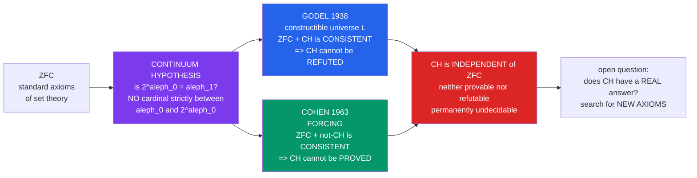

# ♾️ The Continuum Hypothesis

> [!abstract] TL;DR
> The **Continuum Hypothesis (CH)**, posed by Cantor in the 1870s, asserts there is **no cardinality strictly between** that of the whole numbers $\aleph_0$ and that of the real line $2^{\aleph_0}$ — equivalently $2^{\aleph_0} = \aleph_1$, so the continuum is the *smallest uncountable cardinal*. It headlined **Hilbert's 1900 list** as Problem #1. Its resolution is the most famous non-answer in mathematics: **Gödel (1938)** showed CH cannot be *disproved* from the ZFC axioms (it holds in the constructible universe $L$), and **Cohen (1963)** invented **forcing** to show CH cannot be *proved* either. CH is therefore **independent of ZFC** — genuinely, permanently undecidable by the standard axioms. It remains the flagship example of set-theoretic independence and the anchor of the debate over whether mathematical questions have determinate truth values.

---

## Intuition

**Analogy.** There are *more* real numbers than whole numbers — Cantor's diagonal argument proves the continuum is a strictly **bigger infinity** than the countable infinity of the integers. Now ask a deceptively simple question: **is there any infinity strictly *between* them?** Could there be a set too big to list off as $x_0, x_1, x_2, \dots$ yet still smaller than the full real line? Cantor bet **no** — that the reals are the *very next size up* after the integers, with nothing wedged in the gap. That bet is the **Continuum Hypothesis**.

Here is the astonishing part. This is not an open problem in the ordinary sense, where we simply have not found the proof yet. **Gödel and Cohen proved that the standard axioms of mathematics can neither prove CH nor disprove it.** You can add "CH is true" to set theory and get a perfectly consistent mathematics; you can add "CH is false" and get an equally consistent mathematics. The size of the continuum is not written into the axioms at all — it is a genuine, *permanent* fork in the road, and the axioms decline to tell you which branch is real. CH is the paradigm case of **independence**: a precise mathematical statement that our foundational rules leave forever unsettled.

---

## How It Works

### Core mechanics

1. **The two anchor cardinalities.** $\aleph_0 = |\mathbb{N}|$ is the size of any countably infinite set (integers, rationals, finite strings). The **continuum** $\mathfrak{c} = |\mathbb{R}| = 2^{\aleph_0}$ is the size of the reals, equivalently of the power set $\mathcal{P}(\mathbb{N})$ (every real corresponds to a subset of $\mathbb{N}$ via its binary expansion). Cantor's theorem gives the strict inequality $2^{\aleph_0} > \aleph_0$: **the continuum is strictly bigger** than the countable infinity.

2. **The aleph ladder.** By the well-ordering theorem (from the Axiom of Choice) every infinite cardinal is an $\aleph$: they line up as $\aleph_0 < \aleph_1 < \aleph_2 < \cdots$, where $\aleph_1$ is *by definition* the **smallest uncountable cardinal** — the immediate successor of $\aleph_0$, with nothing between them.

3. **The statement of CH.** Since $2^{\aleph_0}$ is uncountable, it sits *somewhere* on the ladder at or above $\aleph_1$. **CH is the assertion that it sits on the very first rung: $2^{\aleph_0} = \aleph_1$.** Equivalently: every uncountable set of reals is in bijection with all of $\mathbb{R}$ — there is no intermediate size.

4. **Gödel's half (1938) — consistency of CH.** Gödel built the **constructible universe** $L$, the minimal model obtained by only ever adding sets that are *explicitly definable* from earlier stages. Inside $L$, the axioms of ZFC hold *and* the **Generalized Continuum Hypothesis** holds. Hence "ZFC + CH" is consistent (if ZFC is), so ZFC **cannot refute** CH.

5. **Cohen's half (1963) — consistency of ¬CH.** Cohen invented **forcing**: a method to carefully *extend* a model of ZFC by adjoining new "generic" sets while keeping the axioms true. He forced in $\aleph_2$ new reals, producing a model where $2^{\aleph_0} = \aleph_2 > \aleph_1$. Hence "ZFC + ¬CH" is also consistent, so ZFC **cannot prove** CH. This work won him the **Fields Medal** (1966), the only one ever awarded for logic.

6. **Independence.** The two halves together say CH is **independent of ZFC** — neither provable nor refutable. The continuum's exact size is simply *not determined* by the standard axioms.

### Flow / architecture



---

## Key Concepts

### Secondary Level

**Two sizes of infinity, one question in between.** The whole numbers are the "smallest" infinity — you can list them $0, 1, 2, 3, \dots$. The real numbers are a *bigger* infinity: Cantor's diagonal trick shows any attempted list of all reals must miss one. CH asks the simplest follow-up: **is the reals' infinity the *next* size after the whole numbers, or is there a middle size in between?** Cantor guessed there is no middle.

**Why it is famous.** When David Hilbert drew up his celebrated list of 23 unsolved problems for the 20th century in 1900, he put CH **first**. It looked like a hard but ordinary problem waiting for a clever proof.

**The plot twist.** It turned out CH is not "hard" — it is *undecidable*. The rules of mathematics (the ZFC axioms) do not contain enough information to settle it. Two mathematicians, Gödel and Cohen, proved you can consistently assume CH is true *or* assume it is false. The axioms genuinely do not care.

### Undergraduate Level

**Precise statements.**
- **CH:** $2^{\aleph_0} = \aleph_1$. Equivalently, there is no set $A$ with $\aleph_0 < |A| < 2^{\aleph_0}$; equivalently, every uncountable subset of $\mathbb{R}$ has the same cardinality as $\mathbb{R}$.
- **GCH (Generalized CH):** for *every* infinite cardinal, $2^{\aleph_\alpha} = \aleph_{\alpha+1}$. GCH is strictly stronger than CH (CH is the $\alpha = 0$ case). GCH also holds in Gödel's $L$, and GCH implies the Axiom of Choice (Sierpiński).

**The beth ladder.** Define $\beth_0 = \aleph_0$ and $\beth_{k+1} = 2^{\beth_k}$. Then $\beth_1 = 2^{\aleph_0} = \mathfrak{c}$. CH is exactly the identity $\aleph_1 = \beth_1$; GCH is $\aleph_\alpha = \beth_\alpha$ for all $\alpha$. The aleph ladder counts *successive cardinals*; the beth ladder counts *successive power sets* — CH asks whether the two ladders coincide at the first rung.

**What "independent" means precisely.** A sentence $\varphi$ is **independent** of a theory $T$ if $T \nvdash \varphi$ *and* $T \nvdash \neg\varphi$. To prove independence you exhibit two models of $T$: one satisfying $\varphi$, one satisfying $\neg\varphi$. For CH: Gödel's $L$ satisfies ZFC + CH; Cohen's forcing extension satisfies ZFC + ¬CH. Both assume only that ZFC itself is consistent — which by Gödel's second incompleteness theorem cannot be proved *within* ZFC, so the independence results are stated as *relative consistency*: "if ZFC is consistent, then so is ZFC + CH (and ZFC + ¬CH)."

**Constraints that DO hold.** ZFC does not leave $2^{\aleph_0}$ completely free:
- **Cantor:** $2^{\aleph_0} > \aleph_0$ (the continuum is uncountable). So $2^{\aleph_0} \neq \aleph_0$.
- **König's theorem:** $\operatorname{cf}(2^{\aleph_0}) > \aleph_0$ — the continuum's *cofinality* is uncountable. Since $\operatorname{cf}(\aleph_\omega) = \aleph_0$, this rules out $2^{\aleph_0} = \aleph_\omega$ (and $\aleph_{\omega+\omega}$, etc.). So the continuum cannot be a cardinal of countable cofinality.

**Independence versus incompleteness.** CH's independence is *related to but distinct from* **Gödel's incompleteness theorems**. Incompleteness produces a self-referential sentence ("I am not provable") that is unprovable but *intuitively true* of the standard integers. CH is different: it is a natural, non-self-referential mathematical statement, and there is no obvious "intended" model that decides it — the situation is more radical.

### Graduate Level

**Gödel's constructible universe $L$.** Define the cumulative hierarchy of *definable* sets: $L_0 = \varnothing$, $L_{\alpha+1} = \operatorname{Def}(L_\alpha)$ (the sets first-order definable with parameters over $L_\alpha$), $L_\lambda = \bigcup_{\alpha<\lambda} L_\alpha$ at limits, and $L = \bigcup_\alpha L_\alpha$. The **Axiom of Constructibility** $V = L$ is consistent with ZF (it holds inside $L$) and implies AC and GCH. The GCH proof rests on the **condensation lemma**: any elementary submodel of $L_\alpha$ collapses back into some $L_\beta$, forcing every subset of $\aleph_\alpha$ to appear by stage $\aleph_{\alpha+1}$, so $2^{\aleph_\alpha} \le \aleph_{\alpha+1}$.

**Cohen forcing.** Start with a countable transitive model $M$ of ZFC. Choose a **poset** $\mathbb{P}$ of finite partial functions $p : \aleph_2^M \times \omega \to \{0,1\}$ (conditions approximating $\aleph_2$ new reals). A **generic filter** $G$ meeting every dense set (exists because $M$ is countable) yields the extension $M[G]$, again a model of ZFC. The forcing is *ccc* (countable chain condition), so it **preserves cardinals**; the $\aleph_2$ generic reals are distinct, giving $M[G] \models 2^{\aleph_0} \ge \aleph_2$, hence $\neg$CH. Forcing is now the universal engine for independence proofs across set theory.

**Easton's theorem (1970).** For **regular** cardinals, the continuum function $\kappa \mapsto 2^\kappa$ is almost *arbitrary*: any monotone function $E$ obeying only $\operatorname{cf}(2^\kappa) > \kappa$ (König) and $\kappa < \lambda \Rightarrow 2^\kappa \le 2^\lambda$ can be realized in a forcing extension. In particular $2^{\aleph_0}$ can be forced to equal $\aleph_1, \aleph_2, \aleph_3, \dots, \aleph_{17}, \dots$ — **any cardinal of uncountable cofinality**. The size of the continuum is essentially undetermined by ZFC. (Singular cardinals are far more constrained — Silver's theorem and the PCF theory of Shelah reveal deep ZFC-provable structure there.)

**Large cardinals do not settle CH.** A natural hope was that stronger *axioms of infinity* — inaccessibles, measurables, Woodin cardinals — might decide CH. **They do not:** Levy–Solovay showed that small forcing preserves large-cardinal properties, so CH can be flipped true or false *while keeping any given large cardinal*. Large cardinals decide many things (projective determinacy, the theory of $L(\mathbb{R})$) but are provably **neutral on CH**.

**The programs for new axioms.**
- **Gödel's Platonism.** Gödel held that CH has a determinate truth value in the "real" universe of sets, and that its independence merely signals our current axioms are incomplete — we should seek *new*, intuitively justified axioms to settle it.
- **Woodin's $\Omega$-logic and "Ultimate $L$."** Woodin developed $\Omega$-logic to formulate a generic-invariant notion of truth; earlier arguments pointed toward $2^{\aleph_0} = \aleph_2$ (¬CH), while the later **Ultimate-$L$** program seeks a canonical inner model for all large cardinals in which a CH-deciding, $V = \text{Ultimate-}L$-style axiom would hold (and would settle CH, arguably in its favor).
- **Forcing axioms.** Strong forcing axioms such as **Martin's Maximum (MM)** provably imply $2^{\aleph_0} = \aleph_2$, giving a principled route to a *specific* failure of CH.
- **Multiverse view (Hamkins).** A rival stance: there is no single "true" value — CH is simply true in some universes and false in others, and the set-theoretic *multiverse* is the proper object of study. On this view asking for CH's "real" answer is a category mistake.

---

## Python Demo

```python
"""
The Continuum Hypothesis, visualized in three panels.

(a) CANTOR DIAGONAL recap: from any enumeration of infinite binary strings we
    build a NEW string differing from the n-th in position n. So the reals
    (their binary expansions) are strictly MORE numerous than the naturals:
        |R| = 2^aleph_0 > aleph_0.

(b) THE TWO LADDERS. The aleph ladder  aleph_0 < aleph_1 < aleph_2 < ...  lists
    successive infinite CARDINALS. The beth ladder is
        beth_0 = aleph_0,   beth_{k+1} = 2^{beth_k},   so beth_1 = 2^aleph_0.
    CH is exactly the claim  aleph_1 = beth_1 (= 2^aleph_0): the continuum is
    the VERY NEXT cardinal after aleph_0, with NOTHING strictly between.

(c) INDEPENDENCE. ZFC does NOT fix the value of 2^aleph_0. Cohen forcing +
    Easton's theorem let it be aleph_1, aleph_2, aleph_3, ..., aleph_17, ...
    -- essentially any cardinal of UNCOUNTABLE COFINALITY. Two hard limits
    survive:
        Cantor:  2^aleph_0 > aleph_0        (so it is NOT aleph_0)
        Konig:   cf(2^aleph_0) > aleph_0    (so it is NOT aleph_omega)
"""
import numpy as np
import matplotlib.pyplot as plt

# -------------------------------------------------------------------------
# (a) Cantor diagonal: build a real (binary string) missing from a table
# -------------------------------------------------------------------------
rng = np.random.default_rng(0)
N = 12                                     # a 12 x 12 corner of an "enumeration"
table = rng.integers(0, 2, size=(N, N))    # row i = i-th listed real's digits
diagonal = np.array([table[i, i] for i in range(N)])
antidiag = 1 - diagonal                     # flip each diagonal bit -> new real
# antidiag differs from row i AT position i, so it equals no listed row:
missing = all(not np.array_equal(antidiag, table[i]) for i in range(N))
print("Cantor diagonal: the constructed real is absent from the list?", missing)
print("  => |R| = 2^aleph_0 > aleph_0  (the reals are uncountable)")

# -------------------------------------------------------------------------
# Figure with three panels
# -------------------------------------------------------------------------
fig = plt.figure(figsize=(15, 6))
gs = fig.add_gridspec(1, 3, width_ratios=[1.05, 1.0, 1.25], wspace=0.30)

# ---- Panel (a): the diagonal table -------------------------------------
axA = fig.add_subplot(gs[0, 0])
axA.imshow(table, cmap="Blues", vmin=0, vmax=1)
for i in range(N):
    axA.add_patch(plt.Rectangle((i - 0.5, i - 0.5), 1, 1, fill=False,
                                edgecolor="crimson", lw=2))
    axA.text(i, i, str(table[i, i]), ha="center", va="center",
             color="crimson", fontsize=8, fontweight="bold")
axA.set_title("Cantor diagonal\nflip the red diagonal -> a real not in the list\n"
              "|R| = 2^aleph_0 > aleph_0", fontsize=10)
axA.set_xlabel("digit position")
axA.set_ylabel("n-th real in the enumeration")
axA.set_xticks([]); axA.set_yticks([])

# ---- Panel (b): aleph ladder vs beth ladder + the CH gap ---------------
axB = fig.add_subplot(gs[0, 1])
axB.set_xlim(0, 3.4); axB.set_ylim(-0.6, 5.6)
rungs = np.arange(0, 6)                     # aleph_0 .. aleph_5 as ladder heights
for k in rungs:                            # aleph ladder (blue, left)
    axB.plot([0.7, 1.3], [k, k], color="#2563eb", lw=3)
    axB.text(0.6, k, f"aleph_{k}", ha="right", va="center",
             color="#2563eb", fontsize=10)
axB.plot([1.9, 2.5], [0, 0], color="#16a34a", lw=3)   # beth_0 = aleph_0
axB.text(2.6, 0, "beth_0 = aleph_0", ha="left", va="center",
         color="#16a34a", fontsize=9)
axB.plot([1.9, 2.5], [1, 1], color="#16a34a", lw=3)   # beth_1 = 2^aleph_0
axB.text(2.6, 1, "beth_1 = 2^aleph_0", ha="left", va="center",
         color="#16a34a", fontsize=9)
axB.annotate("", xy=(1.9, 1), xytext=(1.3, 1),        # CH: beth_1 on rung aleph_1
             arrowprops=dict(arrowstyle="<->", color="crimson", lw=1.6))
axB.text(1.6, 1.45, "CH:\naleph_1 = 2^aleph_0", ha="center", va="bottom",
         color="crimson", fontsize=9, fontweight="bold")
axB.annotate("any cardinal\nstrictly HERE?", xy=(1.0, 0.5), xytext=(0.15, 3.4),
             fontsize=8, color="#7c3aed",
             arrowprops=dict(arrowstyle="->", color="#7c3aed"))
axB.set_title("Two ladders: aleph vs beth\nCH says 2^aleph_0 is the NEXT cardinal",
              fontsize=10)
axB.axis("off")

# ---- Panel (c): which cardinals can 2^aleph_0 be? ----------------------
axC = fig.add_subplot(gs[0, 2])
labels = ["aleph_0", "aleph_1", "aleph_2", "aleph_3", "aleph_4",
          "aleph_5", "...", "aleph_omega"]
status = np.array([0, 1, 1, 1, 1, 1, 1, 0])  # 1 = consistent option, 0 = impossible
ypos = np.arange(len(labels))[::-1]
colors = np.where(status == 1, "#16a34a", "#dc2626")
axC.barh(ypos, np.ones(len(labels)), color=colors, alpha=0.85, height=0.72)
notes = {"aleph_0": "  FORBIDDEN by Cantor: 2^aleph_0 > aleph_0",
         "aleph_1": "  <- CH selects THIS rung",
         "aleph_omega": "  FORBIDDEN by Konig: cf(2^aleph_0) > aleph_0"}
for y, lab, st in zip(ypos, labels, status):
    axC.text(0.02, y, lab + notes.get(lab, ""), ha="left", va="center",
             color="white" if st == 0 else "black", fontsize=9,
             fontweight="bold" if lab in notes else "normal")
axC.set_title("Value of 2^aleph_0 is NOT fixed by ZFC\n"
              "green = a consistent option (Cohen / Easton),  red = provably impossible",
              fontsize=10)
axC.set_xlim(0, 1); axC.set_xticks([]); axC.set_yticks([])
for s in axC.spines.values():
    s.set_visible(False)

fig.suptitle("The Continuum Hypothesis:   2^aleph_0 = aleph_1 ?",
             fontsize=14, fontweight="bold")
plt.savefig("continuum_hypothesis.png", dpi=120, bbox_inches="tight")
plt.show()
```

**Expected output:**

```
Cantor diagonal: the constructed real is absent from the list? True
  => |R| = 2^aleph_0 > aleph_0  (the reals are uncountable)
```

Panel (a) re-derives Cantor's theorem concretely: flipping the red diagonal manufactures a binary real differing from every listed row, so no enumeration captures all reals — $2^{\aleph_0} > \aleph_0$. Panel (b) lays the **aleph ladder** (successive cardinals) beside the **beth ladder** (successive power sets) and marks CH as the single claim that $\beth_1 = 2^{\aleph_0}$ lands exactly on the $\aleph_1$ rung — the purple arrow is the "is anything strictly between?" gap. Panel (c) is the punchline of *independence*: green rungs are all the values ZFC permits for $2^{\aleph_0}$ (any uncountable-cofinality cardinal — Cohen and Easton can force each one), while red marks the only provable prohibitions, Cantor ($\neq \aleph_0$) and König ($\neq \aleph_\omega$). The continuum could consistently sit on almost any rung; ZFC simply does not choose.

---

## Real-World Applications

> **The template for every independence result.** CH is the *proof of concept* that natural mathematical statements can be formally undecidable. Cohen's **forcing** — invented for CH — is now the standard tool that has shown dozens of problems independent of ZFC: **Suslin's Hypothesis**, the **Whitehead problem** in group theory (Shelah), **Kaplansky's conjecture** on Banach-algebra homomorphisms, the existence of certain **measurable cardinals'** consequences, and much of infinite combinatorics. Any working set theorist reaches for forcing the way an analyst reaches for integration by parts.

> **Cardinal invariants of the continuum.** A whole industry — the study of $\mathfrak{b}, \mathfrak{d}, \mathfrak{p}, \mathfrak{a}, \operatorname{cov}(\mathcal{M}), \dots$ (bounding, dominating, pseudo-intersection numbers, etc.) — measures *how badly* CH can fail by pinning down cardinals provably between $\aleph_1$ and $2^{\aleph_0}$. The **Cichoń diagram** organizes these, and it directly informs which pathological objects (non-measurable sets, Sierpiński sets, mad families) can exist. This governs delicate results in **real analysis, measure theory, and topology**.

> **Independence in analysis and algebra proper.** The failure of CH controls concrete "everyday" mathematics: whether every function of two variables is a sum of separable pieces (Sierpiński), the automatic continuity of homomorphisms from $C(X)$, the structure of the **Stone–Čech remainder** $\beta\mathbb{N}\setminus\mathbb{N}$, and the existence of outer automorphisms of the **Calkin algebra** (Farah) — all hinge on CH-type hypotheses. Practitioners sometimes *assume* CH (or its negation, or $\Diamond$, or MA) as a working axiom to build or block exotic objects.

> **Computer-checked foundations.** Because CH's status is subtle, it is a benchmark for **proof assistants** (Isabelle/HOL, Lean/mathlib): formalizing the constructible universe $L$ and forcing tests whether a system faithfully captures ZFC-level metamathematics. Recent formalizations of forcing and the independence of CH are milestones in machine-verified set theory.

---

## Common Pitfalls

- **"CH is unknown / unsolved."** Wrong — CH is **not** an open problem awaiting a cleverer proof. It is **provably independent** of ZFC: Gödel and Cohen *settled its status* by showing no ZFC proof or refutation can exist. The remaining question is philosophical (does CH have a "real" truth value under stronger axioms?), not "can we prove it from ZFC?" — that door is closed.

- **Conflating CH with GCH.** CH is the single instance $2^{\aleph_0} = \aleph_1$. **GCH** ($2^{\aleph_\alpha} = \aleph_{\alpha+1}$ for *all* $\alpha$) is strictly stronger — it decides *every* power-set cardinality at once. GCH implies CH but not vice versa, and GCH implies the Axiom of Choice while CH does not. Both hold in $L$, but conflating them overstates what CH alone claims.

- **Thinking $2^{\aleph_0}$ can be *any* cardinal.** It cannot. **König's theorem** forces $\operatorname{cf}(2^{\aleph_0}) > \aleph_0$, so the continuum can never equal a cardinal of countable cofinality — famously *not* $\aleph_\omega$ (nor $\aleph_{\omega+\omega}$, $\aleph_{\omega_1\cdot\omega}$, ...). Combined with Cantor's $2^{\aleph_0} > \aleph_0$, ZFC *does* constrain the continuum; it just cannot pin it to a unique value. "Anything goes" is only true among cardinals of *uncountable* cofinality (Easton).

- **Assuming large cardinals decide CH.** Adding stronger axioms of infinity (inaccessibles, measurables, Woodins) resolves many independent questions — but **not CH**. By Levy–Solovay, forcing that changes CH preserves large cardinals, so no large cardinal decides it. Do not expect "just add a big cardinal" to work here.

- **Confusing independence with Gödelian incompleteness.** They are cousins, not twins. **Incompleteness** yields an artificially self-referential unprovable sentence with a clear intended truth value. CH is a *natural* statement with **no evident intended answer** — the reason the "does CH have a determinate truth value?" debate (Platonism vs. the multiverse view) is live in a way the Gödel sentence's truth never was.

- **Reading independence as "meaningless."** That CH is unprovable in ZFC does **not** make it a pseudo-question to everyone. Gödel and Woodin argue it has a determinate answer we simply lack the axioms to reach; Hamkins argues the multiverse makes it genuinely relative. The independence result frames the debate — it does not end it.

---

## Related Concepts

- [[Mathematics/14_Advanced_Topics/Mathematical_Logic_and_Set_Theory|Mathematical Logic and Set Theory]] — the ZFC axioms, cardinals, and the well-ordering/aleph machinery within which CH is even stated; the parent context for the constructible universe and forcing
- [[Mathematics/04_Discrete_Mathematics/Set_Theory_and_Relations|Set Theory and Relations]] — cardinality, bijections, and Cantor's theorem $2^{\aleph_0} > \aleph_0$: the finite-set intuition that CH pushes into the transfinite
- [[Mathematics/08_Real_Analysis/Real_Numbers_and_Completeness|Real Numbers and Completeness]] — why $|\mathbb{R}| = 2^{\aleph_0}$ (binary expansions ≙ subsets of $\mathbb{N}$) and the diagonal proof that the continuum is uncountable — the object CH is *about*
- [[Mathematical_Logic/01_Foundations_of_Formal_Logic/Compactness_and_Lowenheim_Skolem|Compactness and Löwenheim-Skolem]] — countable models of ZFC (Skolem's paradox) are the *starting point* for building forcing extensions; the same "logic cannot pin down the infinite" theme that CH takes to its extreme
- [[Mathematical_Logic/02_Model_Theory/Model_Theory_Foundations|Model Theory Foundations]] — independence is proved *model-theoretically*: exhibit one model of ZFC + CH ($L$) and one of ZFC + ¬CH (a forcing extension); definability drives Gödel's condensation argument
- [[Mathematics/04_Discrete_Mathematics/Logic_and_Proof_Techniques|Logic and Proof Techniques]] — the notion of "provable / refutable from axioms" and relative-consistency arguments that make "independent" a precise claim
- [[Philosophy/07_Metaphysics/Universals_and_Realism|Universals and Realism]] — Gödel's mathematical **Platonism** (sets exist objectively, so CH has a real truth value) versus anti-realist/multiverse readings; CH is the sharpest test case for realism about abstract objects
- [[Philosophy/12_Philosophy_of_Science/Scientific_Realism|Scientific Realism]] — the analogous realism-vs-instrumentalism debate: are new set-theoretic axioms *discovered truths* or useful conventions?

_Siblings within this section (planned):_ `Axiomatic_Set_Theory_ZFC` (the axioms CH is independent of), `Ordinals_and_Cardinals` (the aleph/beth ladders and König's theorem), `Forcing_and_Independence_Proofs` (Cohen's method in full), `Large_Cardinals_and_the_Higher_Infinite` (why they cannot settle CH), and `Godels_Incompleteness_Theorems` (the related-but-distinct undecidability phenomenon).

---

## Review Questions

### Secondary

1. In your own words, what does the Continuum Hypothesis claim about the "sizes of infinity" between the whole numbers and the real numbers? Why did Cantor believe there was nothing in between?
2. What is the difference between saying a problem is **unsolved** and saying it is **undecidable**? Which one is CH, and who proved it?
3. Hilbert put CH first on his 1900 list expecting a proof. Explain the "plot twist" that the 20th century actually delivered.

### Undergraduate

1. State CH both as an equation involving $\aleph_1$ and $2^{\aleph_0}$ *and* in terms of subsets of $\mathbb{R}$. Then define the **beth** numbers and rewrite CH as an identity between an aleph and a beth. How does GCH generalize this?
2. Explain what it means for CH to be **independent of ZFC**, and describe (at a high level) which model Gödel used to show CH cannot be *refuted* and which technique Cohen used to show it cannot be *proved*. Why must these be stated as *relative* consistency results?
3. König's theorem gives $\operatorname{cf}(2^{\aleph_0}) > \aleph_0$. Use it, together with Cantor's theorem, to name two specific cardinals that $2^{\aleph_0}$ can **never** equal, and explain why. Is $2^{\aleph_0} = \aleph_2$ possible?

### Graduate

1. Sketch how the **constructible universe** $L$ yields GCH: what is the definable hierarchy $L_\alpha$, and how does the **condensation lemma** bound $2^{\aleph_\alpha} \le \aleph_{\alpha+1}$? Why does $V = L$ also give the Axiom of Choice?
2. Outline Cohen's forcing argument for $\neg$CH: the poset of finite conditions, the role of a **generic filter** over a countable transitive model, and why the **countable chain condition** guarantees cardinals are preserved so that the added reals genuinely make $2^{\aleph_0} \ge \aleph_2$.
3. **Easton's theorem** says the continuum function on regular cardinals is almost arbitrary, and Levy–Solovay says large cardinals cannot decide CH. Given these, evaluate the prospects for *settling* CH via new axioms: contrast Woodin's Ultimate-$L$ / $\Omega$-logic program, forcing axioms like **Martin's Maximum** ($\Rightarrow 2^{\aleph_0} = \aleph_2$), and Hamkins's multiverse view. Does CH have a determinate truth value?

---

## Sources

- [Gödel, K. (1940). *The Consistency of the Axiom of Choice and of the Generalized Continuum-Hypothesis with the Axioms of Set Theory.* Annals of Mathematics Studies 3, Princeton.](https://press.princeton.edu/books/paperback/9780691079271/consistency-of-the-continuum-hypothesis) — the constructible universe $L$; consistency of CH and GCH with ZF.
- [Cohen, P. J. (1966). *Set Theory and the Continuum Hypothesis.* Benjamin (Dover reprint, 2008).](https://store.doverpublications.com/products/9780486469218) — the invention of forcing and the consistency of $\neg$CH; the Fields-Medal work.
- [Jech, T. (2003). *Set Theory* (3rd millennium ed.). Springer Monographs in Mathematics.](https://link.springer.com/book/10.1007/3-540-44761-X) — comprehensive modern treatment of $L$, forcing, cardinal arithmetic, König, and Easton.
- [Kunen, K. (2011). *Set Theory* (revised ed.). College Publications.](https://www.collegepublications.org/logic.php) — the standard graduate text on forcing and independence, with careful CH constructions.
- [Woodin, W. H. (2001). "The Continuum Hypothesis, Parts I & II." *Notices of the AMS* 48(6–7).](https://www.ams.org/notices/200106/fea-woodin.pdf) — accessible survey of the new-axioms program, $\Omega$-logic, and the case that CH may be false.

---

#mathematical-logic #continuum-hypothesis #independence #godel-cohen #set-theory
