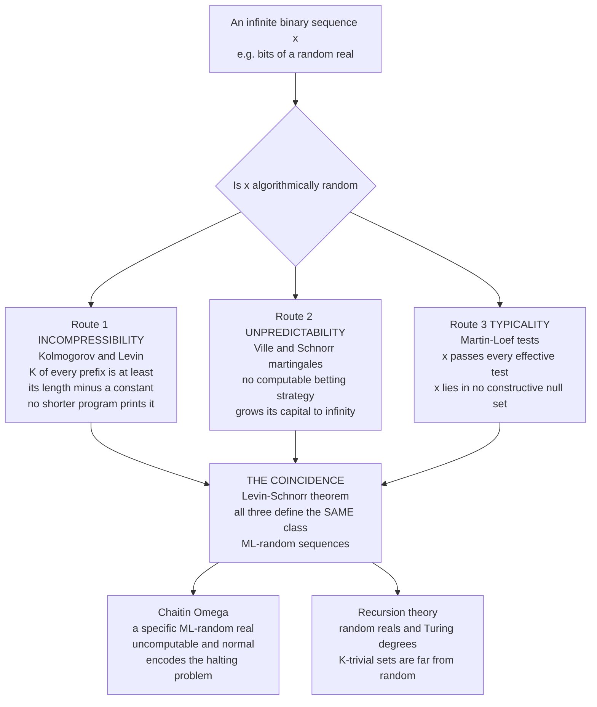

# 🎲 Algorithmic Randomness and Complexity

> [!abstract] TL;DR
> Ordinary probability can only tell you how *likely* a sequence is — and it declares $HHHHHHHHHH$ and $HTHHTTHTHT$ **equally probable**, even though the first screams "pattern." **Algorithmic randomness** repairs this by defining randomness for the **individual object** through **computability**, not probability. A string is random exactly when it is **incompressible**: its **Kolmogorov complexity** $K(x)$ — the length of the shortest *program* that outputs it — is essentially its own length, so there is no shorter description to exploit. Three independent routes reach the *same* class of random sequences: **incompressibility** (Kolmogorov, Levin), **unpredictability** (no computable betting strategy — martingale — can win; Ville, Schnorr), and **typicality** (passing every effective statistical test; Martin-Löf). Their coincidence is one of the deepest theorems in logic. The theory is haunted by **uncomputability** — $K$ cannot be computed (a cousin of the halting problem and the Berry paradox), and **Chaitin's** $\Omega$, the halting probability, is a specific, maximally random, uncomputable real that secretly encodes the entire halting problem.

---

## Intuition

**Analogy — which coin-flip run is "more random"?** Toss a fair coin ten times. Compare $HHHHHHHHHH$ against $HTHHTTHTHT$. Basic probability insists they are **equally probable** — each has chance $1/1024$. Yet everyone feels the first is *suspicious* and the second is *genuinely chaotic*. Where does that gut feeling come from, if the two have identical probability?

The answer is **description length**. You can dictate the first run in three words — *"ten heads"* — and your friend reconstructs it perfectly. The second run has **no shortcut**: to communicate it you must spell out every flip, $H\,T\,H\,H\,T\,T\dots$, because there is no rule generating it. A run is **random not when it is improbable, but when it is incompressible** — when the *shortest recipe for it is as long as the run itself*. Algorithmic randomness makes this intuition rigorous three ways at once: a random sequence **cannot be compressed** (no short program prints it), **cannot be predicted** (no computable gambler can grow rich betting on its bits), and **cannot fail a test** (it passes every effective statistical check for patterns). Randomness is redefined as the **impossibility of a shortcut**.

---

## How It Works

### Core mechanics

1. **Kolmogorov complexity $K(x)$.** Fix a universal Turing machine $U$. Then $K(x) = \min\{\,|p| : U(p) = x\,\}$ — the length in bits of the shortest program that prints $x$ and halts. A pattern-rich string ("a million zeros") has tiny $K \sim O(\log n)$; a patternless string forces the program to *contain* the data, so $K \approx |x|$. By the **invariance theorem**, changing the universal machine shifts $K$ by only an additive constant, so $K$ is an *objective* property of the object.

2. **Incompressibility = randomness.** Call $x$ **$c$-incompressible** when $K(x) \ge |x| - c$. A **counting argument** shows this is the generic case: there are $2^n$ strings of length $n$ but fewer than $2^{n-c}$ programs shorter than $n - c$ bits, so **at most a $2^{-c}$ fraction of strings can be compressed by $c$ bits**. Almost every string is incompressible — *structure is the rare exception, randomness the rule*.

3. **Prefix-free complexity $K$ vs plain complexity $C$.** To make $2^{-K(x)}$ behave like a probability we require programs to be **self-delimiting** (no program is a prefix of another). This prefix-free complexity $K$ satisfies the **Kraft inequality** $\sum_x 2^{-K(x)} \le 1$ and is the version used to define randomness of infinite sequences; plain complexity $C$ differs from it by an $O(\log |x|)$ term and is not sub-additive.

4. **Martin-Löf randomness (typicality).** An infinite binary sequence is **ML-random** if it passes **every effective (computably enumerable) statistical test**. A test is a uniformly c.e. sequence of open sets $U_1 \supseteq U_2 \supseteq \dots$ with measure $\mu(U_n) \le 2^{-n}$ — a **constructive null set** capturing "sequences with a detectable regularity." A sequence is ML-random iff it lies in **no** such null set, i.e. it is *typical* with respect to every computable notion of measure zero.

5. **Martingale / unpredictability characterization.** A **martingale** is a betting strategy $d$ on the bits with the fairness condition $d(w) = \tfrac{1}{2}\big(d(w0) + d(w1)\big)$ — your expected capital after a fair bet is unchanged. The sequence is random iff **no computable (lower semi-computable) martingale succeeds** on it, i.e. no gambler's capital grows to infinity. Ville's theorem and Schnorr's theorem tie this to measure: unpredictability equals typicality.

6. **The stunning coincidence.** **Schnorr's theorem** and the **Levin–Schnorr theorem** prove these three roads meet: a sequence is ML-random **iff** its prefixes are incompressible ($K(x_{1:n}) \ge n - O(1)$) **iff** no computable martingale succeeds on it. Incompressibility = typicality = unpredictability. Three definitions born in three different subjects define **one** class.

7. **Uncomputability and Chaitin's $\Omega$.** $K$ is **not computable** — if it were, a short program could search for "the first string with $K > k$" and print it, describing in $O(\log k)$ bits an object of complexity above $k$: the **Berry paradox** made formal, and a relative of the **halting problem**. **Chaitin's $\Omega = \sum_{U(p)\downarrow} 2^{-|p|}$**, the probability a random program halts, is a specific real that is **ML-random and uncomputable**; its first $n$ bits would settle the halting problem for all programs up to length $n$, making $\Omega$ "maximally unknowable."

### Flow / Architecture



---

## Key Concepts

### Secondary (intuitive)
- **Random means no shortcut.** A sequence is random when the shortest way to describe it is to write it out in full — there is no rule, formula, or compression that helps.
- **Equally probable is not equally random.** $HHHHHHHHHH$ and a messy run have the same probability, yet only the messy one is incompressible. Probability misses the difference; complexity captures it.
- **Zipping a file estimates its complexity.** A structured file shrinks a lot; a truly random file barely shrinks. The compressed size is a hands-on shadow of $K$.
- **Three faces of one idea.** Can't compress it, can't predict it, can't catch it failing a test — for a random sequence, all three are true at once.

### Undergraduate
- **Definition:** $K(x) = \min\{|p| : U(p) = x\}$; **incompressibility** is $K(x) \ge |x| - c$; the **counting argument** shows almost all strings are incompressible.
- **Prefix-free $K$:** self-delimiting programs give $\sum_x 2^{-K(x)} \le 1$ (Kraft), the foundation for treating $2^{-K}$ as a probability.
- **Martin-Löf test:** a uniformly c.e. sequence of open sets $U_n$ with $\mu(U_n) \le 2^{-n}$; a sequence is ML-random iff it escapes every such **constructive null set**.
- **Martingale:** a fair-betting function with $d(w) = \frac12(d(w0)+d(w1))$; ML-randomness $\iff$ no lower-semicomputable martingale succeeds (capital stays bounded).
- **Levin–Schnorr theorem:** ML-random $\iff$ $K(x_{1:n}) \ge n - O(1)$ for all $n$ — the bridge between typicality and incompressibility.
- **$\Omega$:** the halting probability is a concrete ML-random, uncomputable real; knowing its bits solves the halting problem.

### Graduate
- **Plain vs prefix complexity:** $C$ (plain) fails sub-additivity and cannot found randomness for sequences; $K$ (prefix-free) satisfies Kraft, and $C(x) \le K(x) \le C(x) + 2\log|x| + O(1)$. Only $K$ yields the clean Levin–Schnorr criterion.
- **Schnorr and computable randomness:** weakening the tests gives a hierarchy — **computable randomness** (only computable martingales, betting the whole capital) and **Schnorr randomness** (martingales with a computable rate of success) sit strictly *below* ML-randomness: $\text{ML-random} \subsetneq \text{computable random} \subsetneq \text{Schnorr random}$.
- **Relativization and $n$-randomness:** ML-randomness is **1-randomness**; relativizing tests to the halting set $\emptyset'$ gives **2-randomness**, and iterating up the jumps yields the **$n$-random** hierarchy, indexed by levels of the arithmetical hierarchy.
- **Randomness and Turing degrees (recursion theory):** by **Kučera–Gács**, every set is Turing-below some ML-random set; the **K-trivial** sets (those with $K(x_{1:n}) \le K(n) + O(1)$, as compressible as possible) form a natural, non-trivial ideal that is *anti-random*, closed downward, and lies strictly below $\emptyset'$ (Nies, Downey–Hirschfeldt).
- **Chaitin incompleteness:** a formal theory whose axioms carry $c$ bits of algorithmic information cannot prove "$K(x) > c + O(1)$" for any specific $x$ — an information-theoretic Gödel phenomenon: *you cannot certify more randomness than your axioms contain*.
- **Left-c.e. reals and $\Omega$:** $\Omega$ is **left-c.e.** (approximable from below) and **Solovay-complete** among such reals — every left-c.e. real is reducible to it; $\Omega$ is simultaneously the halting probability and a canonical 1-random.

---

## Python Demo

```python
# Two faces of algorithmic randomness, made visible:
#   (a) INCOMPRESSIBILITY  -- approximate Kolmogorov complexity K(x) with a REAL
#       compressor (zlib). K is uncomputable, but any lossless compressor gives a
#       computable UPPER BOUND: if "decompress this blob" reproduces x, then
#       K(x) <= |blob| + const. Structured strings crush down (low K); random-
#       looking ones do not (K ~ length, incompressible).
#   (b) UNPREDICTABILITY   -- a computable MARTINGALE (betting strategy) gets rich
#       on a predictable sequence but CANNOT win against a random one. We use a
#       simple order-1 Markov gambler with Laplace smoothing; capital multiplies
#       by 2*q(observed bit | previous bit) each step. On structure q -> 1 and
#       capital explodes; on true randomness q -> 1/2 and capital stays bounded.
#
# numpy + matplotlib for the plots; zlib (stdlib) as the K-proxy compressor.

import zlib
import numpy as np
import matplotlib.pyplot as plt

rng = np.random.default_rng(0)

# ----------------------------------------------------------------------------
# (a) INCOMPRESSIBILITY: compression ratio as a proxy for algorithmic complexity
# ----------------------------------------------------------------------------
N = 6000  # every source is exactly N bytes, so compressed sizes are comparable

def periodic_digits_of_sqrt2(count):
    """First `count` decimal digits of sqrt(2) via integer isqrt -- a COMPUTABLE
    number: its TRUE K is tiny, though a weak compressor cannot see that."""
    scaled = 2 * 10 ** (2 * count)          # sqrt(2 * 10^(2n)) ~ sqrt2 * 10^n
    digits = str(int(np.sqrt(scaled))) if count < 15 else None
    if digits is None:
        # exact integer sqrt for large count (no float error)
        x, y = scaled, (scaled + 1) // 2
        while y < x:
            x, y = y, (y + scaled // y) // 2
        digits = str(x)
    return [int(d) for d in digits[:count]]

sources = [
    ("constant\nAAAA...",        bytes([65]) * N),
    ("periodic\nABCDABCD...",    (b"ABCD" * (N // 4 + 1))[:N]),
    ("random block\ntiled 8x",   (rng.integers(0, 256, N // 8, dtype=np.uint8).tobytes() * 8)[:N]),
    ("sqrt2 digits\n(computable)", bytes(48 + d for d in periodic_digits_of_sqrt2(N))),
    ("random digits\n0-9 ASCII", bytes(48 + int(d) for d in rng.integers(0, 10, N))),
    ("true random\nbytes 0-255", rng.integers(0, 256, N, dtype=np.uint8).tobytes()),
]

names, ratios = [], []
for name, data in sources:
    comp = len(zlib.compress(data, 9))      # upper bound on K(x), in bytes
    names.append(name)
    ratios.append(N / comp)                  # high ratio = compressible = low K

# ----------------------------------------------------------------------------
# (b) UNPREDICTABILITY: a computable order-1 Markov martingale (betting game)
# ----------------------------------------------------------------------------
def markov_martingale_log2_capital(bits):
    """Return cumulative log2(capital) of a gambler who bets via the running
    order-1 conditional frequency (Laplace-smoothed). log2 is used so structured
    growth (~ +1 bit/step) stays numerically safe over long sequences."""
    # counts[prev][next]; start at 1 each (Laplace) so probabilities are defined
    counts = np.ones((2, 2))
    prev = 0
    log2_cap = [0.0]
    for b in bits:
        q = counts[prev, b] / counts[prev].sum()   # predicted prob of observed bit
        log2_cap.append(log2_cap[-1] + np.log2(2.0 * q))  # capital *= 2*q
        counts[prev, b] += 1                        # learn online
        prev = b
    return np.array(log2_cap)

M = 400
predictable = np.tile([0, 1], M // 2)                       # 0101... perfectly regular
truerandom  = rng.integers(0, 2, M)                         # genuine coin flips

cap_pred = markov_martingale_log2_capital(predictable)
cap_rand = markov_martingale_log2_capital(truerandom)

# ----------------------------------------------------------------------------
# Plots
# ----------------------------------------------------------------------------
fig, ax = plt.subplots(1, 2, figsize=(15, 5.4))

colors = plt.cm.viridis(np.linspace(0.15, 0.9, len(names)))
xpos = np.arange(len(names))
ax[0].bar(xpos, ratios, color=colors)
ax[0].axhline(1.0, ls=":", color="crimson", label="ratio = 1  (incompressible = random)")
ax[0].set_xticks(xpos); ax[0].set_xticklabels(names, fontsize=8)
ax[0].set_ylabel("compression ratio  (original / compressed)")
ax[0].set_title("Incompressibility: structure compresses, randomness does not")
ax[0].legend()

ax[1].plot(cap_pred, color="teal",   lw=2, label="predictable 0101...  (gambler wins)")
ax[1].plot(cap_rand, color="crimson", lw=2, label="true random  (capital stays bounded)")
ax[1].axhline(0.0, ls=":", color="gray")
ax[1].set_xlabel("bits observed")
ax[1].set_ylabel("log2(capital)")
ax[1].set_title("Unpredictability: no computable martingale beats randomness")
ax[1].legend()

plt.tight_layout()
plt.show()

# ----------------------------------------------------------------------------
# Console summary
# ----------------------------------------------------------------------------
print(f"(a) All sources are exactly {N} bytes.\n")
print(f"{'source':>22} | {'compression ratio':>18}")
print("-" * 45)
for name, r in zip(names, ratios):
    print(f"{name.replace(chr(10), ' '):>22} | {r:>18.2f}")

print("\n(b) Martingale final log2(capital):")
print(f"   predictable 0101... : {cap_pred[-1]:8.1f}   (capital ~ 2^{cap_pred[-1]:.0f}, unbounded growth)")
print(f"   true random         : {cap_rand[-1]:8.1f}   (stays near 0 -> capital bounded)")
print("\nNote: K is UNCOMPUTABLE; ratios are only UPPER bounds. Notice zlib treats")
print("sqrt(2)'s digits like noise even though their TRUE K is tiny -- weak")
print("compressors miss deep structure that a cleverer program would exploit.")
```

**What the demo shows.** *Panel (a)* orders six equal-length inputs from rigidly structured to fully random: the constant and periodic strings have huge compression ratios (tiny $K$), the tiled random block sits in between, and the true random bytes bottom out near ratio $1$ — **incompressible, hence random**. The $\sqrt{2}$ digits are the trap: to zlib they look as random as uniform digits, yet their *true* $K$ is tiny (a short program prints them), a vivid reminder that a real compressor is only an **upper bound** on $K$. *Panel (b)* runs the **martingale** view: a computable gambler betting on the running conditional frequency gets exponentially rich on the predictable $0101\dots$ sequence (log-capital climbs roughly one bit per step) but **cannot grow its capital on the truly random stream** — it hovers near zero. Incompressibility and unpredictability, the two experimentally visible faces of the *same* underlying randomness.

---

## Real-World Applications

> **Example (the incompressibility method in combinatorics and algorithm analysis):** Instead of averaging over all inputs, fix a *single* incompressible input and argue that any structure the algorithm could exploit would compress it — a contradiction. This replaces intricate counting with a one-line "a random object has no special structure" argument, yielding clean lower bounds (e.g. average-case running time of sorting, the number of comparisons, Turing-machine simulation slowdowns, and combinatorial existence proofs) that parallel and often sharpen [[Combinatorics/03_Graph_and_Extremal_Combinatorics/The_Probabilistic_Method|the probabilistic method]].

- **Foundations of probability and randomness testing:** algorithmic randomness gives a *per-sequence* definition of "random," grounding statistical practice and providing the theory behind PRNG test suites — output that any effective test can distinguish from random is, by definition, not random.
- **Cryptographic pseudorandomness:** the martingale view (no efficient predictor wins) is the computational-complexity cousin of algorithmic randomness; a secure stream cipher is one no polynomial-time gambler can beat, mirroring "no computable martingale succeeds."
- **Minimum Description Length and inductive inference:** [[Information_Theory/04_Information_Theory_and_Inference/Minimum_Description_Length_and_Model_Selection|MDL]] is the practical, computable descendant of "shortest program" — "prefer the model that compresses the data most" is Occam's razor with $K$ as its ruler.
- **Halting-problem encoding via $\Omega$:** Chaitin's constant packs the answers to *all* halting questions into the bits of one random real — a striking bridge from randomness to the [[Theory_of_Computation/03_Computability_and_Turing_Machines/The_Halting_Problem_and_Undecidability|halting problem]] and to information-theoretic incompleteness.
- **Data-similarity metrics:** normalized compression distance uses real compressors as $K$-proxies to cluster genomes, languages, and malware families without domain-specific features — direct engineering from "shared algorithmic information."

---

## Common Pitfalls

- **"A compressor gives me $K$."** No. $K$ is **uncomputable**; zlib, LZMA, or any tool returns only an *upper bound*. The $\sqrt{2}$-digits case is the canonical trap — a weak compressor calls a low-$K$ object "random." You can never certify a string is maximally compressed.
- **Confusing individual randomness with statistical randomness.** Classical probability rates *distributions*; algorithmic randomness rates *the single object*. It is meaningful to ask whether *this one* sequence is random even with no repeatable experiment — the whole point of the theory.
- **Ignoring plain vs prefix-free complexity.** Only **prefix-free** $K$ satisfies the Kraft inequality and lets $2^{-K}$ be a probability, so only $K$ founds randomness for infinite sequences. Using plain $C$ where self-delimiting programs are required breaks sub-additivity and the Levin–Schnorr criterion.
- **Reading "did not compress" as "is random."** Low compressibility only means *your* method found no structure. A weak compressor and a truly random source produce the same output; you can conclude "no structure detected," never "random."
- **Forgetting the additive constant / asymptotics.** $K$ is defined up to a machine-dependent constant, so complexities of *short* strings are not meaningful — a difference of a few bits can be pure choice of universal machine. All statements are asymptotic.
- **Mishandling $\Omega$.** $\Omega$ is a *specific* real, yet **uncomputable and random**; you cannot compute its bits, and its exact value depends on the chosen universal machine. Treating it as a knowable number, or as "the" halting probability independent of $U$, is a mistake.
- **Collapsing the randomness hierarchy.** ML-randomness, computable randomness, and Schnorr randomness are **not** the same — the tests differ in effectivity, and the classes are strictly nested. Assuming one notion of "random sequence" hides genuine recursion-theoretic structure.

---

## Related Concepts

- [[Information_Theory/06_Advanced_and_Applied_Information_Theory/Kolmogorov_Complexity_and_Algorithmic_Information|Kolmogorov Complexity and Algorithmic Information]] — the **information-theory** framing of the same $K(x)$; this note is the **recursion-theory / randomness** framing (martingales, ML-tests, Turing degrees).
- [[Theory_of_Computation/03_Computability_and_Turing_Machines/The_Halting_Problem_and_Undecidability|The Halting Problem and Undecidability]] — the uncomputability of $K$ is a cousin of the halting problem, and $\Omega$ literally encodes it.
- [[Information_Theory/04_Information_Theory_and_Inference/Minimum_Description_Length_and_Model_Selection|Minimum Description Length]] — the computable, practical shadow of "shortest program"; Occam's razor as compression.
- [[Information_Theory/01_Foundations_of_Information_Theory/Entropy_and_Information_Content|Entropy and Information Content]] — Shannon's average-over-a-distribution information versus $K$'s individual-object information; they meet as $\mathbb{E}[K]/n \to H$ for computable sources.
- [[Information_Theory/02_Source_Coding_and_Compression/Universal_Compression_and_Lempel_Ziv|Universal Compression and Lempel-Ziv]] — concrete, universal, computable compressors that bound $K$ from above without knowing the source.
- [[Combinatorics/03_Graph_and_Extremal_Combinatorics/The_Probabilistic_Method|The Probabilistic Method]] — the **incompressibility method** is its algorithmic twin: fix one random (incompressible) object and derive bounds from "it has no special structure."
- [[Mathematics/06_Probability_and_Statistics/Probability_Theory|Probability Theory]] — supplies the measure and null-set language that Martin-Löf tests make *effective*; algorithmic randomness is per-object measure theory.
- [[Mathematics/06_Probability_and_Statistics/Statistical_Inference|Statistical Inference]] — an effective statistical test is exactly a computable version of the hypothesis tests here; ML-randomness = passing all of them.
- [[Mathematical_Logic/03_Set_Theory/Axiomatic_Set_Theory_ZFC|Axiomatic Set Theory ZFC]] — Chaitin incompleteness bounds what a finite axiom system can prove about complexity: you cannot certify more randomness than your axioms contain.

---

## Review Questions

1. **(Secondary)** The runs $HHHHHHHHHH$ and $HTHHTTHTHT$ are equally probable, yet we call only the second "random." Using the idea of a *shortest description*, explain what makes one incompressible and the other not — and why "random" should mean "no shorter recipe" rather than "improbable."
2. **(Undergraduate)** State the three characterizations of algorithmic randomness — incompressibility, unpredictability (martingales), and typicality (Martin-Löf tests) — and explain intuitively why a sequence that *fails* one must fail the others. Then describe a concrete computable betting strategy that gets rich on a periodic sequence but cannot win against a genuinely random one.
3. **(Graduate)** Prove (sketch) via a counting argument that most length-$n$ strings are incompressible, and via the Berry-paradox argument that $K$ is uncomputable. Then explain how Chaitin's $\Omega$ is simultaneously ML-random, left-c.e., and Turing-equivalent to the halting problem, and state Chaitin's information-theoretic incompleteness theorem it implies. How do the K-trivial sets sit at the opposite pole from the random reals in the Turing degrees?

---

## Sources

- Downey, R., & Hirschfeldt, D. (2010). *Algorithmic Randomness and Complexity*. Springer. (The definitive recursion-theoretic treatment: ML-randomness, martingales, K-triviality, Turing degrees.)
- Li, M., & Vitányi, P. (2019). *An Introduction to Kolmogorov Complexity and Its Applications* (4th ed.). Springer. (Complexity, incompressibility method, invariance.)
- Nies, A. (2009). *Computability and Randomness*. Oxford University Press. (Randomness notions, K-triviality, lowness.)
- Kolmogorov, A. N. (1965). "Three Approaches to the Quantitative Definition of Information." *Problems of Information Transmission*, 1(1), 1–7.
- Martin-Löf, P. (1966). "The Definition of Random Sequences." *Information and Control*, 9(6), 602–619. (The typicality / effective-tests definition.)

---

#mathematical-logic #algorithmic-randomness #kolmogorov-complexity #martin-lof #incompressibility
