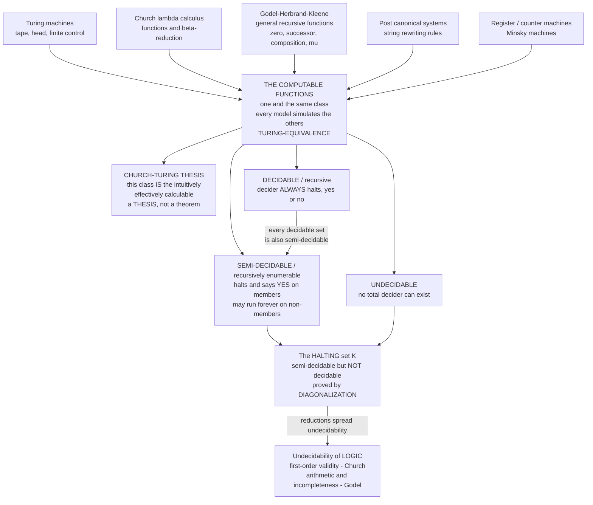

# 🧮 Computability and Recursion Theory

> [!abstract] TL;DR
> **Recursion theory** (the logician's name for **computability theory**) is the mathematics of *what a mechanical procedure can and cannot do*. Long before physical computers existed, logicians tried to pin down the vague idea "**effectively calculable**" with airtight mathematics — and something astonishing happened: **every serious attempt defined exactly the same class of functions**. Turing's machines, Church's **lambda calculus**, the Gödel–Herbrand–Kleene **general recursive functions**, Post's rewriting systems, and Minsky's **register machines** all carve out one and the same set — the **computable functions**. This robust convergence is the evidence for the **Church–Turing thesis**: *this class IS the intuitively computable* (a **thesis**, not a provable theorem). Once "computable" is fixed, mathematics can prove hard *limits*. Problems split into a strict trichotomy — **decidable** (a decider always halts yes/no), **semi-decidable / recursively enumerable** (halts on the yes-cases, may run forever on the no-cases), and **undecidable** (no total decider can exist). The seminal undecidable set is the **halting problem**; a one-line **diagonal argument** proves no program can decide, for all programs, whether they halt. From this flow the undecidability of **first-order validity** (Church) and of **arithmetic** (Gödel), plus a rich structure theory — the **universal machine**, the **s-m-n** and **recursion (fixed-point) theorems**, **reductions**, and **Turing degrees**.

---

## Intuition

**Analogy — the difference between a *recipe* and a *wish*.** A recipe is a finite list of unambiguous steps that any cook — or any obedient machine with no cleverness at all — can follow to a definite end: chop, stir, bake twenty minutes, done. A *wish* ("make the tastiest possible cake") gives no procedure. Computability theory is the attempt to say, with mathematical precision, **exactly which tasks have a recipe** — a finite, mechanical, no-insight-required procedure that a mindless follower is guaranteed to execute — and, more startlingly, **which tasks provably have no recipe at all, ever, no matter how clever you are.**

Here is the deep part. Suppose several careful people, working separately, each try to write down what "having a recipe" formally means. One describes an idealized machine crawling along an infinite paper tape. Another writes a pure algebra of functions substituting into functions. A third builds functions up from zero and successor by composition and a search operator. A fourth invents rules for rewriting strings of symbols. **They compare notes and discover they have all fenced off precisely the same collection of tasks.** When four completely different formalizations of a fuzzy intuition land on the identical class, you begin to believe the fuzzy intuition was pointing at something real. That agreement — the **Church–Turing thesis** — is the moment "effectively calculable" stopped being a hand-wave and became a mathematical object you can *prove theorems about*.

And the first great theorem is a limitation. Consider the honest-sounding request: *write one master recipe that reads any recipe plus its ingredients and tells you in advance whether that recipe ever finishes.* This is the **halting problem**, and a short self-referential argument — feed the master checker a recipe built to do the opposite of whatever the checker predicts about itself — shows **no such master recipe can exist**. Not "we haven't found it," not "it would be slow": it is *absolutely, provably impossible*. Recursion theory is the discipline that makes both halves of that sentence — the vast reach of the computable and the hard wall of the uncomputable — into exact mathematics.

---

## How It Works

### Core Mechanics

**1. The target: "effectively calculable."** Before 1936, "algorithm" meant an informal notion — a finite procedure a clerk could follow with pencil and paper, using no ingenuity, guaranteed to proceed deterministically. The project was to *replace this intuition with a precise mathematical definition* so that statements like "no algorithm solves problem `P`" could be **proved**, not merely asserted.

**2. The models — five roads, one destination.** Independently, several definitions of "computable function `ℕ → ℕ`" appeared:
   - **Turing machines** (Turing 1936): a finite control moving a head over an unbounded tape, reading/writing symbols. Computation as *symbol manipulation in space*.
   - **λ-calculus** (Church 1936): everything is a function; compute by β-reduction (substitution). Computation as *pure function application* (see [[The_Lambda_Calculus]], [[Church_Encodings_and_Computability]]).
   - **General recursive functions** (Gödel–Herbrand, refined by Kleene): build functions from **zero, successor, projections** via **composition**, **primitive recursion**, and the **unbounded search / minimization operator `μ`**. Computation as *function-building*.
   - **Post canonical / rewriting systems** (Post 1943): computation as *string rewriting* by production rules.
   - **Register / counter (Minsky) machines**: a few integer registers with increment and decrement-or-jump-if-zero. Computation as *bookkeeping*.

**3. Turing-equivalence — the great convergence.** Each model can *simulate* every other (there is a Turing machine that runs any λ-term, a λ-term computing any recursive function, a register machine emulating any Turing machine, and so on). Therefore all five define **exactly the same class**: the **partial computable (= partial recursive) functions**, whose everywhere-defined members are the **total computable (= total recursive) functions**. This coincidence is the empirical backbone of the field.

**4. The Church–Turing thesis (a thesis, not a theorem).** The claim *"a function is intuitively/effectively calculable **if and only if** it is Turing-computable"* cannot be *proved*, because one side ("intuitively calculable") is informal. It is a **thesis** — accepted on overwhelming evidence: the model convergence, the failure of anyone to exhibit an intuitively-computable-but-not-Turing-computable function, and the closure of the class under every natural operation. Do not call it a theorem.

**5. Sets and the decidability trichotomy.** Identify a *decision problem* with the **set** of yes-instances (coded as numbers via Gödel numbering). Then:
   - **Decidable / recursive set** — its characteristic function is total computable: a machine **always halts** and answers **yes or no** correctly.
   - **Semi-decidable / recursively enumerable (r.e.) / computably enumerable set** — a machine **halts and says yes** exactly on the members, but **may run forever** on non-members. Equivalently, the set is the *range* of a computable function (it can be *listed*), or the *domain* of a partial computable function.
   - **Undecidable set** — **no** total decider exists. A set is decidable **iff** both it *and its complement* are semi-decidable (**Post's theorem**).

**6. The universal machine and s-m-n.** There is a single **universal Turing machine `U`**: a fixed program that, given the code `⟨p⟩` of any program `p` and an input `x`, simulates `p` on `x` — `U(⟨p⟩, x) = p(x)`. This is *the* theoretical stored-program computer (interpreters, VMs, `eval`). The **s-m-n theorem** says you can *partially evaluate* programs computably: from code for a two-argument function and a fixed first argument, you can *compute* code for the resulting one-argument function (currying, as an effective operation).

**7. The halting problem and diagonalization.** The **halting set** `K = { ⟨p⟩ : program p halts on input ⟨p⟩ }` is **semi-decidable** (simulate `p` — if it halts you find out) but **not decidable**. Proof by **diagonal argument**: if a total decider `H(p, x)` existed, build `D(p)` = "if `H(p, p)` says *halts*, loop forever; else halt." Then `D(⟨D⟩)` halts **iff** it does not — contradiction. So `H` cannot exist. This is the seminal undecidable set; see [[The_Halting_Problem_and_Undecidability]].

**8. The recursion (fixed-point) theorem.** **Kleene's recursion theorem** guarantees every computable transformation of programs has a **fixed point**: for any computable `f` you can find a program `e` with `φ_e = φ_{f(e)}` — a program that, in effect, has **access to its own source code**. This legitimizes recursion, self-reference, quines, and self-replication as fully computable phenomena (kin to fixed-point combinators, [[Combinatory_Logic_and_Fixed_Points]]).

**9. Reductions and degrees (the section's road ahead).** To prove a new problem `B` undecidable, **reduce** a known-undecidable `A` to it: give a computable map turning `A`-questions into `B`-questions (many-one `≤_m`, or the more powerful Turing `≤_T` using `B` as an oracle). Reductions induce a hierarchy of **degrees of unsolvability** (**Turing degrees**), the deep structure explored by the **priority method**.

**10. The bridge back to logic.** Recursion theory is not off to the side of logic — it *powers logic's deepest limitative results*. **Church's theorem**: first-order **validity** is undecidable (the *Entscheidungsproblem* has no solution). **Gödel's first incompleteness theorem**: any consistent, effectively axiomatized theory strong enough for arithmetic has true-but-unprovable sentences — because provability is only *semi-decidable* while truth is not even that. The set of provable sentences is r.e.; the set of *true* arithmetic sentences is not — the gap **is** incompleteness.

### Flow / Architecture



*Five wildly different models of computation all define the identical class of computable functions (Turing-equivalence). The Church–Turing thesis interprets that class as the true meaning of "computable." Within it, problems split into decidable / semi-decidable / undecidable, with the halting set the archetypal member that is semi-decidable yet undecidable — and reductions carry that undecidability straight into the foundations of logic.*

---

## Key Concepts

### Secondary (intuitive, no advanced background needed)

- **Algorithm / effective procedure** — a finite list of unambiguous steps a mindless follower can carry out with guaranteed, deterministic behavior. A *recipe*, not a *wish*.
- **Computable function** — a function for which such a recipe exists. Recursion theory's central object.
- **The convergence** — several very different ways of defining "computable" (idealized machines, pure functions, function-building, string rewriting) all describe *the same* functions. Strong evidence they captured the real notion.
- **Church–Turing thesis** — the belief that "computable by *any* mechanical means" equals "computable by a Turing machine." It is a **thesis** (accepted on evidence), not something you can prove.
- **Decidable vs undecidable** — some yes/no questions have a recipe that always finishes with the right answer (**decidable**); some provably have **no** such recipe ever (**undecidable**).
- **The halting problem** — you *cannot* write one universal checker that reads any program and reliably says whether it will eventually stop. Provably impossible, not just hard.

### Undergraduate (a first course in logic / computability)

- **Turing machine / partial computable function** — the standard model; a program computes a **partial** function (it may fail to halt on some inputs, leaving the value undefined).
- **Recursive functions** — the class built from **zero, successor, projections** by **composition, primitive recursion, and minimization `μ`**. **Primitive recursive** = the μ-free part (always total, but *not* all total computables — e.g. Ackermann's function). Adding `μ` gives all **partial recursive** functions. See [[Recursive_Functions_and_Lambda_Calculus]].
- **Recursive vs recursively enumerable (r.e.)** — **recursive/decidable** = decider always halts; **r.e./semi-decidable** = a machine halts-yes on members but may loop on non-members; equivalently the set can be *effectively listed*. See [[Decidability_and_Recognizability]].
- **Post's theorem** — a set is **decidable iff both it and its complement are r.e.** The halting set is r.e. but its complement is not, so it is undecidable.
- **Universal machine** — one fixed program `U` simulates every program: `U(⟨p⟩, x) = p(x)`. The theoretical justification for stored-program computers and interpreters.
- **Diagonalization** — the self-reference trick (a program built to contradict any purported halting-decider) that proves the halting problem undecidable and underlies Cantor's, Gödel's, and Turing's theorems alike.
- **Reduction** — solve `A` *using* a solver for `B`. If `A` is undecidable and `A ≤ B`, then `B` is undecidable too. The engine that spreads undecidability. See [[Reductions_and_Undecidable_Problems]].

### Graduate (advanced recursion theory)

- **The s-m-n theorem** — `φ_{s(m,n)}(...)` : program transformations by **effective partial evaluation** (Currying is computable). With the **enumeration theorem** (`φ_e(x) = U(e, x)`) it axiomatizes an *acceptable numbering* of the partial computable functions.
- **Kleene's recursion (fixed-point) theorem** — for every computable `f` there is `e` with `φ_e = φ_{f(e)}`: programs may **use their own index**. Yields quines, self-reproducing programs, and slick proofs (e.g. Rice's theorem).
- **Rice's theorem** — **every** non-trivial *semantic* property of programs (a property of the computed function, not the code) is **undecidable**. Universal undecidability of program analysis.
- **Many-one vs Turing reducibility** — `≤_m` (map instances) versus `≤_T` (use `B` as an **oracle**, possibly many adaptive queries). Turing reducibility defines **Turing degrees**; `K` is **`m`-complete** among r.e. sets.
- **The arithmetical hierarchy** — classify sets by quantifier alternation over computable predicates: **Σ⁰₁** (r.e.), **Π⁰₁** (co-r.e.), **Σ⁰ₙ / Π⁰ₙ** above; the halting problem is **Σ⁰₁-complete**, "totality" is **Π⁰₂-complete**. The logical measure of undecidability.
- **Turing degrees and the priority method** — the poset of degrees of unsolvability; the **Friedberg–Muchnik** finite-injury priority construction builds incomparable r.e. degrees, settling **Post's problem** (there exist r.e. sets strictly between decidable and `K`).
- **Relative computability and the jump** — the **Turing jump** `A'` (the halting problem *relative to oracle `A`*) climbs the hierarchy; `∅' ≡_T K`, `∅''`, `∅'''`, … stratify Σ⁰ₙ.
- **Algorithmic randomness** — Kolmogorov complexity and Martin-Löf randomness use computability to define what it means for an *individual* infinite sequence to be "random" (incompressible), the field's modern frontier.

---

## Python Demo

```python
# ============================================================================
# COMPUTABILITY & THE HALTING BARRIER -- made concrete and runnable.
# numpy + matplotlib only.
#
# PART A: a tiny UNIVERSAL interpreter for a minimal Turing-complete model --
#         the MINSKY / register machine (a few counters; INC and JZDEC). We run
#         real programs (addition, doubling) and SHOW it computes.
#
# PART B: the DECIDABLE vs SEMI-DECIDABLE vs UNDECIDABLE trichotomy.
#   * DECIDABLE : "n is even" -- a decider that ALWAYS halts yes/no.
#   * SEMI-DECIDABLE : "does program P halt on input x" -- we SIMULATE. On the
#     yes-cases it halts and confirms; on the no-cases it runs forever (we cap
#     with a step budget and report UNKNOWN -- a true semi-decider has no cap).
#   * UNDECIDABLE : the HALTING set is not decidable -- the diagonal argument
#     shows a general halting-decider is impossible.
# ============================================================================

import numpy as np
import matplotlib.pyplot as plt

# ----------------------------------------------------------------------------
# PART A -- a UNIVERSAL interpreter for Minsky (counter) machines.
# Instructions over registers R[0..k]:
#   ('inc',   r, j)       : R[r] += 1 ; goto j
#   ('jzdec', r, j, k)    : if R[r]==0 goto j  else R[r]-=1 ; goto k
#   ('halt',)             : stop
# Two counters + these instructions are already TURING-COMPLETE.
# ----------------------------------------------------------------------------
def run(program, regs, max_steps=100_000):
    """Universal step-by-step interpreter. Returns (halted, steps, final_regs)."""
    R, pc = list(regs), 0
    for step in range(max_steps):
        op = program[pc]
        if op[0] == 'halt':
            return True, step, R
        elif op[0] == 'inc':
            _, r, j = op
            R[r] += 1
            pc = j
        else:  # 'jzdec'
            _, r, j, k = op
            if R[r] == 0:
                pc = j
            else:
                R[r] -= 1
                pc = k
    return False, max_steps, R          # did NOT halt within the budget

# --- program ADD:  R0 <- R0 + R1  (drain R1 into R0), then halt --------------
ADD = [
    ('jzdec', 1, 2, 1),   # 0: if R1==0 -> halt(2) else R1-- -> 1
    ('inc',   0, 0),      # 1: R0++ ; goto 0
    ('halt',),            # 2
]
# --- program DOUBLE: R1 <- 2*R0 (R0 consumed), then halt --------------------
DOUBLE = [
    ('jzdec', 0, 3, 1),   # 0: if R0==0 -> halt(3) else R0-- -> 1
    ('inc',   1, 2),      # 1: R1++
    ('inc',   1, 0),      # 2: R1++ ; goto 0   (two R1++ per R0)
    ('halt',),            # 3
]
# --- program LOOP: increment R0 forever -- NEVER halts -----------------------
LOOP = [
    ('inc', 0, 0),        # 0: R0++ ; goto 0  (no halt is reachable)
]
# --- program EVEN_HALT: halts IFF R0 is EVEN (else loops forever) ------------
#     This is our witness whose HALTING depends on the input.
EVEN_HALT = [
    ('jzdec', 0, 2, 1),   # 0: if R0==0 -> halt(2) else R0-- -> 1
    ('jzdec', 0, 3, 0),   # 1: if R0==0 -> loop(3) else R0-- -> 0
    ('halt',),            # 2  (reached when R0 was even)
    ('inc', 2, 3),        # 3  infinite loop (reached when R0 was odd)
]

print("=" * 72)
print("PART A -- the universal interpreter actually COMPUTES")
print("=" * 72)
h, s, R = run(ADD, [3, 4]);      print(f"ADD    on (3,4):   halted={h} in {s:>3} steps -> R0 = {R[0]}  (expect 7)")
h, s, R = run(ADD, [10, 25]);    print(f"ADD    on (10,25): halted={h} in {s:>3} steps -> R0 = {R[0]}  (expect 35)")
h, s, R = run(DOUBLE, [6, 0]);   print(f"DOUBLE on (6):     halted={h} in {s:>3} steps -> R1 = {R[1]}  (expect 12)")

# ----------------------------------------------------------------------------
# PART B -- the TRICHOTOMY
# ----------------------------------------------------------------------------
print("\n" + "=" * 72)
print("PART B -- DECIDABLE vs SEMI-DECIDABLE vs UNDECIDABLE")
print("=" * 72)

# (1) DECIDABLE set: "n is even" -- a decider that ALWAYS halts yes/no.
def decide_even(n):
    return n % 2 == 0                      # total: terminates on every input

# (2) SEMI-DECIDABLE predicate: "does EVEN_HALT halt on input x?"  We SIMULATE.
#     True  -> confirmed halts.   None -> hit the budget (a true semi-decider
#     would run forever here; we cap only to keep the demo finite).
def semidecide_halts(x, budget=2000):
    halted, steps, _ = run(EVEN_HALT, [x, 0, 0], max_steps=budget)
    return (True, steps) if halted else (None, budget)

# Run the halting simulation across inputs: even -> halts, odd -> runs forever.
inputs = np.arange(0, 12)
steps_arr, halted_mask = [], []
for x in inputs:
    verdict, steps = semidecide_halts(int(x))
    halted_mask.append(verdict is True)
    steps_arr.append(steps)
steps_arr = np.array(steps_arr); halted_mask = np.array(halted_mask)

for x, hm, st in zip(inputs, halted_mask, steps_arr):
    tag = f"HALTS in {st} steps" if hm else f"no halt within {st} (UNKNOWN)"
    print(f"  EVEN_HALT on x={x:>2}:  semi-decider -> {tag}")

# (3) UNDECIDABLE: the halting set has NO total decider. Diagonal argument
#     (proof by contradiction -- documented, not executed to a real paradox):
print("""
  DIAGONAL ARGUMENT (why a general halting-decider H is impossible):
    Suppose a TOTAL decider  H(p, x)  returns True iff program p halts on x.
    Build  D(p):  if H(p, p) == True:  loop forever
                  else:                 halt
    Ask what D does on its own code <D>:
        D(<D>) halts  <=>  H(<D>,<D>) == False  <=>  D(<D>) does NOT halt.
    Contradiction. Therefore no such total H exists -- HALTING is UNDECIDABLE.
""")

# ----------------------------------------------------------------------------
# VISUALIZATION
# ----------------------------------------------------------------------------
fig, (ax1, ax2) = plt.subplots(1, 2, figsize=(13.5, 5.2))

# (left) halting behavior of EVEN_HALT: even inputs halt (finite bars),
#        odd inputs hit the budget ceiling = non-halting.
colors = ["#27ae60" if hm else "#c0392b" for hm in halted_mask]
bars = ax1.bar(inputs, steps_arr, color=colors, edgecolor="black", linewidth=0.5)
for x, hm in zip(inputs, halted_mask):
    if not hm:
        bars[x].set_hatch("////")
ax1.axhline(2000, ls="--", color="#c0392b", lw=1)
ax1.text(0.2, 2050, "step budget = non-halting ceiling", color="#c0392b", fontsize=8)
ax1.set_xlabel("input  x  to program EVEN_HALT")
ax1.set_ylabel("steps until halt")
ax1.set_title("Some runs HALT (green, even x),\nsome run FOREVER (red hatched, odd x)", fontsize=10)
ax1.set_xticks(inputs)
from matplotlib.patches import Patch
ax1.legend(handles=[Patch(facecolor="#27ae60", edgecolor="black", label="halts (finite)"),
                    Patch(facecolor="#c0392b", edgecolor="black", hatch="////", label="never halts")],
           fontsize=8, loc="upper right")

# (right) the TRICHOTOMY as a decision-outcome heatmap over inputs 0..11.
#   row 0 DECIDABLE      : is n even  -> every cell YES(1)/NO(0), always halts.
#   row 1 SEMI-DECIDABLE : does EVEN_HALT halt -> YES(1) on members,
#                          UNKNOWN(0.5) on non-members (never returns).
grid = np.zeros((2, len(inputs)))
grid[0, :] = [1.0 if decide_even(int(x)) else 0.0 for x in inputs]     # decidable
grid[1, :] = [1.0 if hm else 0.5 for hm in halted_mask]                # semi-decidable
cmap = plt.matplotlib.colors.ListedColormap(["#c0392b", "#bdc3c7", "#27ae60"])
bounds = [-0.1, 0.25, 0.75, 1.1]
norm = plt.matplotlib.colors.BoundaryNorm(bounds, cmap.N)
ax2.imshow(grid, cmap=cmap, norm=norm, aspect="auto")
ax2.set_xticks(range(len(inputs))); ax2.set_xticklabels(inputs)
ax2.set_yticks([0, 1])
ax2.set_yticklabels(["DECIDABLE\n(is n even)", "SEMI-DECIDABLE\n(does it halt)"])
ax2.set_xlabel("input  n")
for j in range(len(inputs)):
    ax2.text(j, 0, "Y" if grid[0, j] == 1 else "N", ha="center", va="center", fontsize=8)
    ax2.text(j, 1, "Y" if grid[1, j] == 1 else "?", ha="center", va="center", fontsize=8)
ax2.set_title("Trichotomy: a decider ALWAYS answers (Y/N);\n"
              "a semi-decider only ever confirms YES ('?' = never returns)", fontsize=10)

plt.tight_layout()
plt.savefig("computability_recursion_theory.png", dpi=130)
print("Saved figure -> computability_recursion_theory.png")
```

Running it first proves the interpreter genuinely **computes** — `ADD(3,4)=7`, `ADD(10,25)=35`, `DOUBLE(6)=12` — establishing that this three-instruction register model is a real (Turing-complete) computer. Then it exhibits the trichotomy on concrete data: the decider `decide_even` returns yes/no on **every** input and always halts (a **decidable** set); the semi-decider for "does `EVEN_HALT` halt on `x`?" **confirms** halting on even inputs but only ever hits the budget ceiling on odd inputs, which loop forever (a **semi-decidable** set — a true semi-decider would simply never return there, marked `?`); and the documented **diagonal argument** shows a general halting-decider is *logically impossible* (**undecidable**). The left plot contrasts halting (finite green bars) with non-halting runs (red hatched bars pinned at the budget ceiling); the right heatmap makes the asymmetry visceral — the decidable row is all definite `Y`/`N`, while the semi-decidable row can only ever say `Y`, never a confirmed `N`.

---

## Real-World Applications

> **Example — the halting problem is why perfect static analysis is impossible, and why real tools are conservative.** Every compiler, linter, type checker, and verifier lives under **Rice's theorem**: any non-trivial semantic question about a program ("does this ever throw a null-pointer exception?", "is this dead code?", "does this loop terminate?") is *undecidable in general*. So practical tools never claim perfection — they **approximate soundly**: a terminating termination-checker (like the one inside Coq/Agda, or Microsoft's **T2 / Terminator**) *proves* termination for the programs it can and gives up (or forces a restriction) on the rest, deliberately trading completeness for a guaranteed-halting analysis.

Where computability theory shows up in engineering and science:
- **Compilers and static analysis** — because "does this program have property P?" is undecidable, analyses are conservative (over-approximate) and rest on decidable abstractions; the theory tells you *which* guarantees are even possible in principle.
- **Formal verification and theorem provers** — provability is only **semi-decidable**, so proof search may run forever; this is exactly why interactive provers need human guidance and why `total`/termination checkers restrict you to a decidable-by-construction fragment. Ties to [[Formal_Systems_and_Proof_Calculi]] and [[Soundness_and_Completeness]].
- **Programming-language design** — Turing-completeness is a *feature and a curse*: it maximizes expressive power but makes analysis undecidable, which is why config/query languages (regular expressions, SQL fragments, smart-contract sub-languages, `eBPF`) are often *deliberately not* Turing-complete so that termination and resource use become **decidable**.
- **Interpreters, VMs, and `eval`** — the **universal machine** is the mathematical ancestor of every interpreter, bytecode VM, and self-hosting compiler; the **recursion theorem** is why quines and self-modifying/self-replicating code (and computer viruses) are possible.
- **Decidable islands in a sea of undecidability** — model checkers, SMT solvers, and dependence analyzers work precisely by staying inside *decidable* theories; recursion theory draws the coastline (Presburger arithmetic decidable, full arithmetic not).
- **Undecidability across mathematics** — Hilbert's 10th problem (integer solutions to Diophantine equations), the word problem for groups, tiling/domino problems, and Post's correspondence problem are all *provably* algorithmically unsolvable — results obtained by **reducing** the halting problem to them.

---

## Common Pitfalls

- **"The Church–Turing thesis is a theorem."** It is **not**. One side of the equivalence — "intuitively/effectively calculable" — is *informal*, so the statement cannot be proved; it is a **thesis** supported by the convergence of all known models and by never finding a counterexample. Turing-*equivalence* of specific formal models (TMs = λ = recursive functions) **is** a theorem; the *thesis* interpreting that class as "all mechanical computation" is not.
- **"Computable means efficient / feasible."** Computability is about *whether an algorithm exists at all* — with **no** time or space bound. A computable function can require astronomically many steps (Ackermann, busy-beaver-adjacent). *Complexity theory* (P, NP, PSPACE) studies *how much* resource; recursion theory studies *whether it can be done, ever*. Do not conflate "decidable" with "tractable."
- **"Semi-decidable is a separate thing from recursively enumerable."** They are **the same class**, viewed three ways: (a) a machine that halts-yes on members and may loop on non-members, (b) the *range* of a computable function (it can be effectively *listed/enumerated*), (c) the *domain* of a partial computable function. "r.e.", "c.e.", "semi-decidable", and "recognizable" are synonyms.
- **"Total vs partial recursive is a technicality."** It is central. A **partial** computable function may be *undefined* (loop forever) on some inputs; a **total** one halts on all. The **primitive recursive** functions are all total but *miss* some total computables (Ackermann). Adding the **`μ` (unbounded search)** operator captures all partial computables — and unbounded search is exactly *what can loop forever*. Whether a given partial recursive function is total is itself **undecidable** (Π⁰₂).
- **"Undecidable means we just haven't found the algorithm."** No — undecidable means *provably no algorithm exists*, ever, for anyone. This is a mathematical impossibility (proved by diagonalization/reduction), categorically different from an open problem or a merely hard one.
- **"Diagonalization only proves the halting problem."** The same self-reference schema drives Cantor's uncountability of the reals, Gödel's incompleteness, Turing's halting theorem, Tarski's undefinability of truth, and Russell's paradox — one argument, many faces.

---

## Related Concepts

- [[Mathematical_Logic_Overview]] — the vault entry point; recursion theory is one of logic's four pillars (alongside proof theory, model theory, set theory) and supplies the *limitative* results.
- [[Turing_Machines_and_the_Church_Turing_Thesis]] — the ToC-side deep dive on the machine model and the thesis; **this note is its mathematical-logic / recursion-theory framing** (the two are complementary views of one subject).
- [[The_Halting_Problem_and_Undecidability]] — the seminal undecidable set and its diagonal proof, developed in full on the ToC side.
- [[Recursive_Functions_and_Lambda_Calculus]] — the function-building and λ-calculus roads to the same computable class; primitive vs μ-recursive functions in detail.
- [[Decidability_and_Recognizability]] — the recursive vs recursively-enumerable distinction (decidable vs semi-decidable) at the heart of the trichotomy.
- [[Reductions_and_Undecidable_Problems]] — how undecidability *spreads* from the halting problem to Diophantine equations, word problems, and tilings via computable reductions.
- [[The_Limits_of_Computation]] — the ToC capstone on what machines fundamentally cannot do; the barrier this note formalizes.
- [[The_Lambda_Calculus]] — Church's model of computation as pure function application; one of the five Turing-equivalent formalisms.
- [[Church_Encodings_and_Computability]] — how numbers, booleans, and recursion are *encoded* as λ-terms, showing λ-calculus is Turing-complete.
- [[Combinatory_Logic_and_Fixed_Points]] — fixed-point combinators (`Y`) are the operational sibling of **Kleene's recursion theorem** — computable self-reference.
- [[First_Order_Predicate_Logic]] — Church's theorem makes first-order *validity* undecidable; the *Entscheidungsproblem* is a recursion-theoretic result about logic.
- [[Formal_Systems_and_Proof_Calculi]] — provability in an effective calculus is *semi-decidable* (proofs can be enumerated), the fact that powers Gödel's incompleteness.
- [[Soundness_and_Completeness]] — the r.e.-ness of provability vs the non-r.e.-ness of arithmetic truth is exactly the completeness/incompleteness watershed.
- [[Mathematical_Logic_and_Set_Theory]] — the single-note survey in Mathematics/14; this section is the deep dive of its "computability / undecidability" thread.
- [[Recursion_Fundamentals]] — the DSA/programming notion of recursion; the recursion theorem is its logical foundation (why self-reference is legitimate and computable).

*Prose-only siblings in this section (notes not yet in the vault): **Primitive_Recursive_and_Mu_Recursive_Functions** (building the computable functions), **Undecidability_and_Reducibility** (proving problems unsolvable), **Turing_Degrees_and_the_Priority_Method** (the structure of unsolvability), **The_Arithmetical_Hierarchy** (measuring undecidability by quantifier alternation), and **Godels_Incompleteness_Theorems** (the logic payoff — provability is r.e., truth is not).*

---

## Review Questions

### Secondary

1. Explain the difference between a "recipe" and a "wish" in your own words, and use it to say what it means for a problem to be **computable**. Why is the halting problem more like a wish than a recipe?
2. Four separate people define "computable" in four completely different ways and discover they defined the *same* thing. Why does this coincidence make us confident, and what is this belief called? Is it something you can *prove*?
3. What is the difference between a question that is **decidable** and one that is **undecidable**? Give the everyday meaning of "no algorithm can ever exist for this," as opposed to "this is just hard."

### Undergraduate

1. State the **decidable / semi-decidable (r.e.) / undecidable** trichotomy precisely. Prove (or explain) **Post's theorem**: a set is decidable iff both it and its complement are r.e. Where does the halting set sit, and why is that consistent with Post's theorem?
2. Give the **diagonal argument** for the undecidability of the halting problem in full: assume a total decider `H(p,x)`, construct the contradicting program `D`, and derive the contradiction on `D(⟨D⟩)`. Which step secretly uses the **universal machine** and the ability of a program to access its own code?
3. Define **primitive recursive** and **partial recursive** functions. Why are all primitive recursive functions total, yet they fail to capture all total computable functions (name the standard witness)? What does the **`μ` operator** add, and how does it relate to non-halting?

### Graduate

1. State the **s-m-n theorem** and **Kleene's recursion theorem**, and use the recursion theorem to prove **Rice's theorem** (every non-trivial semantic property of programs is undecidable). Explain the role of the fixed point.
2. Distinguish **many-one (`≤_m`)** from **Turing (`≤_T`)** reducibility. Sketch how the **arithmetical hierarchy** classifies `K` as **Σ⁰₁-complete** and "totality" as **Π⁰₂-complete**, and explain what the **Turing jump** `∅' ≡_T K` contributes to this stratification.
3. **Post's problem** asks whether there is an r.e. degree strictly between `0` (decidable) and `0'` (the degree of `K`). Explain what the **Friedberg–Muchnik priority method** constructs and why a naive diagonalization fails, then connect the recursion-theoretic picture back to **logic**: why is the set of theorems of arithmetic r.e. while the set of true arithmetic sentences is not even arithmetical — and how is that Gödel's incompleteness?

---

## Sources

- Turing, A. M. "On Computable Numbers, with an Application to the Entscheidungsproblem." *Proceedings of the London Mathematical Society*, s2-42 (1936), 230–265 — the founding paper: the machine, the universal machine, and undecidability of the halting/decision problem.
- Soare, R. I. *Turing Computability: Theory and Applications*. Springer, 2016 — the modern graduate standard for computability and Turing degrees; excellent on the priority method.
- Cutland, N. *Computability: An Introduction to Recursive Function Theory*. Cambridge University Press, 1980 — the classic, accessible undergraduate treatment of recursive functions, r.e. sets, and the recursion theorem.
- Rogers, H. *Theory of Recursive Functions and Effective Computability*. MIT Press, 1987 (reprint) — the encyclopedic reference on reducibilities, degrees, and the arithmetical hierarchy.
- Sipser, M. *Introduction to the Theory of Computation*, 3rd ed. Cengage, 2013 — clean, careful presentation of decidability, reducibility, and the Church–Turing thesis (the ToC-side companion).

---

#mathematical-logic #computability #recursion-theory #church-turing #decidability
