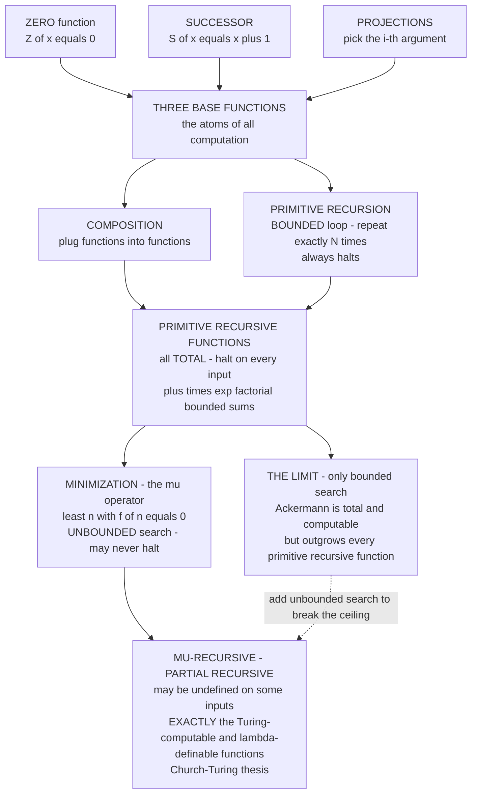

# 🧮 Primitive Recursive and Mu-Recursive Functions

> [!abstract] TL;DR
> Before Turing machines existed, logicians defined **what it means to be computable** using nothing but arithmetic. Start with three trivial **base functions** — **zero** `Z(x) = 0`, **successor** `S(x) = x + 1`, and the **projections** `Pᵢ(x₁,…,xₙ) = xᵢ` — and allow just two ways to build new functions: **composition** (plug functions into functions) and **primitive recursion** (a bounded loop: "do this exactly `n` times"). Everything you get is a **primitive recursive** function, and astonishingly this already captures almost every "everyday" computation — addition, multiplication, exponentiation, factorial, primality, bounded sums and products — and every one of them is **total** (halts on every input). Yet it is *not enough*: the **Ackermann function** is total and computable but grows faster than any primitive recursive function, so bounded looping alone cannot reach it. Add one final ingredient — **minimization**, the **μ-operator** `μn[f(x,n)=0]` that searches unboundedly for the least `n` making `f` zero and **may run forever** — and you obtain the **μ-recursive (partial recursive)** functions, which are **exactly** the Turing-computable and λ-definable functions. That triple coincidence is the **Church–Turing thesis** viewed from the arithmetic side, and the machinery of coding functions as numbers (**Gödel numbering**) is precisely what lets arithmetic talk about its own computations — the engine behind Gödel's incompleteness theorems.

---

## Intuition

**Analogy — a programming language with only counting loops.** Imagine a toy language with exactly one kind of loop: `repeat exactly N times`. You are handed the loop bound `N` up front, before the loop starts; there is **no** `while`, no `goto`, no way to loop "until something happens." Every loop is guaranteed to finish because its length is decided in advance. In this cramped language you might expect to build almost nothing — yet you can build a shocking amount. Addition is "repeat `+1` exactly `y` times." Multiplication is "repeat *add-x* exactly `y` times." Exponentiation is "repeat *multiply-by-x* exactly `y` times." Factorials, primality tests, digit extraction, sorting a fixed-length list — all of it falls out of stacking counting loops inside counting loops. This is **primitive recursion**: powerful enough for essentially every computation you meet in daily programming, and **guaranteed to always halt** precisely because it can never search forever.

But that guarantee is also its cage. Because every loop bound must be fixed in advance, the *fastest-growing* function you can build is bounded by how deeply you are willing to nest loops — and there is a function, **Ackermann's**, that outgrows *any* fixed nesting depth. It is perfectly computable (a short recursive program prints its values), it always terminates, yet no counting-loop program can keep up with it. Primitive recursion is powerful yet **fundamentally limited**: it can compute a great deal, but it can never search *unboundedly*.

Now add **one** ingredient: a single `while` loop — "**keep searching `n = 0, 1, 2, …` until you find one that works**" — with the honest catch that it **might never stop**. This is the **μ-operator**, minimization. The moment you allow this unbounded search, the ceiling vanishes: you can now compute *anything computable at all*. The price is that your functions can become **partial** — undefined on some inputs, because the search runs forever. That is the deep trade in the theory of computation, discovered by logicians building the notion of "computable" out of arithmetic first principles, years before anyone drew a Turing machine tape.

---

## How It Works

### Core Mechanics

**1. The three base functions (the atoms).** Every primitive recursive function is built from just three primitives over the natural numbers `ℕ = {0, 1, 2, …}`:
   - **Zero** — the constant function `Z(x) = 0` (some presentations use a nullary `0`).
   - **Successor** — `S(x) = x + 1`. This is the *only* way "new" numbers ever enter; every natural number is `S(S(…S(0)…))`.
   - **Projections** — for each `n` and each `1 ≤ i ≤ n`, the function `Pᵢⁿ(x₁,…,xₙ) = xᵢ` that throws away all arguments but the `i`-th. These are the "identity / argument-selection" glue.

**2. Composition (generalized substitution).** Given an `m`-ary function `f` and `m` functions `g₁,…,gₘ` each of arity `n`, composition builds the `n`-ary function

&nbsp;&nbsp;&nbsp;&nbsp;`h(x̄) = f(g₁(x̄), …, gₘ(x̄))`.

This is just "call functions and feed their outputs into another function" — plumbing.

**3. Primitive recursion (the bounded loop).** This is the one genuinely recursive scheme. Given a `k`-ary **base** function `g` and a `(k+2)`-ary **step** function `h`, define the `(k+1)`-ary function `f` by

&nbsp;&nbsp;&nbsp;&nbsp;`f(x̄, 0) = g(x̄)`
&nbsp;&nbsp;&nbsp;&nbsp;`f(x̄, y+1) = h(x̄, y, f(x̄, y))`.

Read operationally: to compute `f(x̄, y)`, start from `g(x̄)` and apply the step `h` exactly `y` times, threading the running result. The recursion variable `y` **decreases by one each call and the number of iterations is fixed by `y` in advance** — this is exactly the "repeat `N` times" loop. Because the count is bounded, **primitive recursion can never diverge**, which is why *every primitive recursive function is total*.

**4. Arithmetic emerges.** From these rules the standard operations appear as short definitions (the Python demo builds each one explicitly):
   - `add(x, 0) = x`, `add(x, y+1) = S(add(x, y))` — successor, iterated.
   - `mult(x, 0) = 0`, `mult(x, y+1) = add(mult(x, y), x)` — addition, iterated.
   - `exp(x, 0) = 1`, `exp(x, y+1) = mult(exp(x, y), x)` — multiplication, iterated.
   - `pred(0) = 0`, `pred(y+1) = y` — the (truncated) predecessor, from which **truncated subtraction** `x ∸ y`, `sign`, comparisons, and thus **bounded quantifiers**, **bounded sums** `Σ`, and **bounded products** `Π` all follow. Definition by cases, `if/then/else` on decidable predicates, and coding of pairs and finite sequences are all primitive recursive.

**5. The wall — Ackermann's function.** Define
   - `A(0, n) = n + 1`
   - `A(m+1, 0) = A(m, 1)`
   - `A(m+1, n+1) = A(m, A(m+1, n))`.

`A` is **total** (each recursive call strictly decreases the pair `(m, n)` in lexicographic order, so it always bottoms out) and obviously **computable** (the three lines *are* a program). But `A` uses **double** recursion — the recursion on `m` calls itself with an argument that is itself an Ackermann value — which cannot be flattened into the single bounded loop of primitive recursion. The proof is a **diagonalization**: one shows every primitive recursive function `f` is *dominated* by some fixed section `A(k, ·)`, i.e. `f(n) < A(k, n)` for large `n`; then the diagonal `n ↦ A(n, n)` eventually **overtakes every** primitive recursive function, so it cannot itself be primitive recursive. `A(m, ·)` climbs the hierarchy of operations: `A(1,·)` is essentially `+2`, `A(2,·)` roughly `2n+3`, `A(3,·)` is exponential, `A(4,·)` is a **tower** of powers of two, and `A(4,2)` already dwarfs the number of atoms in the observable universe.

**6. Minimization — the μ-operator (unbounded search).** Given a function `f(x̄, n)`, define

&nbsp;&nbsp;&nbsp;&nbsp;`μn[f(x̄, n) = 0]` = the **least** `n` such that `f(x̄, n) = 0` **and** `f(x̄, m)` is defined and nonzero for all `m < n`.

This is a `while` loop: try `n = 0, 1, 2, …` until `f` returns `0`. If no such `n` exists (or an earlier value is undefined), the search **never halts** and the result is **undefined** — the function becomes **partial**. Unbounded search is the exact power that primitive recursion lacked.

**7. μ-recursive = general recursive = partial recursive = computable.** Close the base functions under composition, primitive recursion, **and** minimization, and you get the **μ-recursive** (equivalently **partial recursive**, and when total, **general recursive**) functions. The **Kleene Normal Form Theorem** shows only *one* μ is ever needed: every partial recursive function can be written `f(x̄) = U(μz[T(e, x̄, z) = 0])` where `T` (Kleene's primitive-recursive **T-predicate**) checks "`z` codes a halting computation of program `e` on input `x̄`" and `U` (primitive recursive) extracts the output. The headline theorem — proved by Gödel, Herbrand, Kleene, Church, and Turing between 1931 and 1936 — is that this class is **identical** to the Turing-computable functions and to the λ-definable functions. Three utterly different definitions, one class: the mathematical content of the **Church–Turing thesis**.

**8. The hierarchy of function classes.**

&nbsp;&nbsp;&nbsp;&nbsp;**primitive recursive** `⊊` **total recursive** `⊊` **partial recursive**.

Ackermann witnesses the first strict inclusion (total, computable, not primitive recursive). The second strict inclusion is even sharper: the set of *total* recursive functions is not itself computably enumerable (you cannot list all always-halting programs), and any universal partial recursive function is genuinely partial — the halting problem lives in the gap.

**9. Gödel numbering and the tie to incompleteness.** To let arithmetic reason about *its own* functions, finite sequences must be coded as single numbers. Gödel's **β-function** — `β(a, b, i) = a mod (1 + (i+1)·b)`, definable using only `+`, `×`, and the Chinese Remainder Theorem — extracts the `i`-th element of a sequence coded by `(a, b)` **without** needing exponentiation as a primitive, so it is expressible in the language of first-order arithmetic. This **arithmetization** is what makes the recursive functions **representable** inside Peano Arithmetic, which is the load-bearing lemma of Gödel's incompleteness theorems: a theory strong enough to represent all recursive functions can encode "this sentence is unprovable," and thus cannot be both complete and consistent.

### Flow / Architecture



*Reading the diagram: the three base functions plus composition and primitive recursion generate the **total** primitive recursive functions; Ackermann proves this class is a strict subset of the computable ones; adding minimization (μ) breaks the bounded-search ceiling and lands exactly on the Turing-computable functions — at the cost of partiality.*

---

## Key Concepts

### Secondary (intuitive, no advanced background)

- **Base functions** — three trivial starting blocks: always-return-zero, add-one, and pick-one-of-your-inputs. Everything is built from these.
- **Composition** — feed the outputs of some functions into another function. Just wiring.
- **Primitive recursion = a counting loop** — "start here, then repeat this step exactly `N` times." Because `N` is fixed in advance, the loop **always finishes**.
- **Total function** — one that gives an answer for *every* input (never runs forever). All primitive recursive functions are total.
- **The surprise** — with only counting loops you can build `+`, `×`, powers, factorials, and almost every everyday computation — but **not** absolutely everything.
- **Ackermann's function** — a simple recursive program whose values **explode** so fast that no counting-loop program can keep up, even though it always halts.
- **The μ-operator = a `while` loop** — "keep trying `0, 1, 2, …` until it works." It might search forever, but it is the missing ingredient that lets you compute *anything computable*.

### Undergraduate (a first course in logic / theory of computation)

- **Base functions, formally** — zero `Z`, successor `S`, projections `Pᵢⁿ`.
- **Primitive recursion scheme** — `f(x̄,0)=g(x̄)`, `f(x̄,y+1)=h(x̄,y,f(x̄,y))`. Closure under composition + this scheme defines the **primitive recursive (PR)** functions; all are total.
- **What PR captures** — `+`, `×`, `exp`, `pred`, truncated subtraction `x ∸ y`, `sign`, `max`/`min`, definition by cases, bounded `Σ`/`Π`, **bounded quantifiers** `(∃y ≤ n)` / `(∀y ≤ n)`, pairing and sequence coding, primality, `n`-th prime, GCD — the whole toolkit of "obviously computable" total functions.
- **Ackermann function** — total, computable, and **provably not** primitive recursive; the canonical separation `PR ⊊ total-recursive`. The proof is by domination/diagonalization.
- **Minimization / the μ-operator** — `μn[f(x̄,n)=0]`; unbounded search; introduces **partiality**. The **regular/total** case (a witness always exists) keeps the result total.
- **μ-recursive = partial recursive functions** — PR closed under composition, primitive recursion, and μ. **Theorem:** this equals the **Turing-computable** functions and the **λ-definable** functions (Kleene, Church, Turing, 1936).
- **The class hierarchy** — `PR ⊊ total recursive ⊊ partial recursive`; the set of total recursive functions is **not** computably enumerable.

### Graduate (advanced recursion theory / metamathematics)

- **Kleene Normal Form Theorem** — every partial recursive `φ` has the form `U(μz.\,T(e,x̄,z))` with `T` a *single* primitive-recursive predicate and `U` primitive recursive; **one** application of μ suffices, and `e` is a **Gödel index** of the program. This yields the **Enumeration Theorem** (a universal partial recursive function) and the **s-m-n Theorem** (effective currying).
- **Domination and fast-growing hierarchies** — the **Grzegorczyk hierarchy** `ℰ⁰ ⊆ ℰ¹ ⊆ ⋯` stratifies PR by growth rate; `⋃ₙ ℰⁿ =` PR, while `A(n,·)` sits *cofinally above* every `ℰⁿ`. This connects to the **Hardy** and **fast-growing (`fα`)** hierarchies indexed by ordinals up to `ε₀`, and to proof-theoretic strength (Ackermann-type functions bound provably-total functions of `PA`).
- **The β-function and arithmetization** — Gödel's `β(a,b,i) = a mod (1+(i+1)b)` codes finite sequences using only `+`, `×` (via CRT), so **primitive recursion is definable in the language of arithmetic**; hence every recursive function is **representable** in `Q`/`PA` (`Σ₁`-representability), the pivotal lemma for the incompleteness theorems and Tarski's undefinability of truth.
- **Partiality is essential** — by a diagonal argument there is **no** effective enumeration of the *total* recursive functions; therefore any programming formalism computing exactly the total computable functions cannot be recursively presented. Unbounded μ (and the partiality it brings) is not an accident but a necessity — the price of universality.
- **Reflections of the hierarchy** — `PR` corresponds to `LOOP` programs, `partial recursive` to `WHILE`/`GOTO` programs; the μ-operator mirrors the `while` construct exactly, and the **Kleene T-predicate** is the arithmetic shadow of a Turing machine's step relation.
- **Ordinal analysis** — the least ordinal not "reachable" by PR-provable recursion is a recurring theme; the provably-total functions of first-order arithmetic are exactly those `fα` for `α < ε₀`, linking recursion theory to proof theory.

---

## Python Demo

```python
# ==========================================================================
# BUILDING COMPUTATION FROM ARITHMETIC FIRST PRINCIPLES
#
# PART A -- the PRIMITIVE RECURSIVE scheme.  We implement ONLY:
#     base functions  : zero Z, successor S, projections proj(i)
#     combinator 1     : composition
#     combinator 2     : primitive recursion  (a BOUNDED loop)
#   ...and then BUILD addition, multiplication, exponentiation, predecessor,
#   and factorial PURELY from those primitives.  Arithmetic *emerges* from
#   the recursion scheme -- nothing is assumed, everything is derived.
#
# PART B -- MINIMIZATION (the mu-operator: least n with f(n)=0), an UNBOUNDED
#   search that may not halt, and the ACKERMANN function -- the classic TOTAL
#   computable function that is NOT primitive recursive because it grows too
#   fast.  We compute small Ackermann values and watch the growth explode.
#
# numpy + matplotlib only.
# ==========================================================================
import sys
import numpy as np
import matplotlib.pyplot as plt
from math import factorial as _true_factorial

sys.setrecursionlimit(100000)

# --------------------------------------------------------------------------
# PART A.1 -- the three BASE functions
# --------------------------------------------------------------------------
def Z(*args):            # ZERO: ignores its arguments, returns 0
    return 0

def S(x):                # SUCCESSOR: the only way new numbers enter
    return x + 1

def proj(i):             # PROJECTION: return the i-th argument (0-indexed)
    def p(*args):
        return args[i]
    return p

# --------------------------------------------------------------------------
# PART A.2 -- the two COMBINATORS
# --------------------------------------------------------------------------
def compose(f, *gs):     # COMPOSITION: h(x) = f(g1(x), ..., gm(x))
    def h(*args):
        return f(*[g(*args) for g in gs])
    return h

def prim_rec(g, h):      # PRIMITIVE RECURSION -- a BOUNDED loop.
    #   f(x, 0)   = g(x)
    #   f(x, y+1) = h(x, y, f(x, y))
    # Implemented iteratively: the loop length y is FIXED in advance,
    # so this can NEVER diverge -> every PR function is TOTAL.
    def f(*args):
        *x, y = args
        acc = g(*x)
        for k in range(y):
            acc = h(*x, k, acc)
        return acc
    return f

# --------------------------------------------------------------------------
# PART A.3 -- BUILD arithmetic from the primitives ONLY
# --------------------------------------------------------------------------
# add(x, 0) = x ;  add(x, y+1) = S(add(x, y))
add  = prim_rec(proj(0), compose(S, proj(2)))

# mult(x, 0) = 0 ;  mult(x, y+1) = add(mult(x, y), x)
mult = prim_rec(Z, compose(add, proj(2), proj(0)))

# exp(x, 0) = 1 ;  exp(x, y+1) = mult(exp(x, y), x)
exp  = prim_rec(compose(S, Z), compose(mult, proj(2), proj(0)))

# pred(0) = 0 ;  pred(y+1) = y        (unary; no extra parameters)
pred = prim_rec(Z, proj(0))

# fact(0) = 1 ;  fact(y+1) = mult(S(y), fact(y))
fact = prim_rec(compose(S, Z),
                compose(mult, compose(S, proj(0)), proj(1)))

print("=" * 70)
print("PART A -- arithmetic BUILT from zero, successor, projection alone")
print("=" * 70)
print(f"  add(7, 5)   = {add(7, 5)}     (expect 12)")
print(f"  mult(6, 7)  = {mult(6, 7)}     (expect 42)")
print(f"  exp(2, 10)  = {exp(2, 10)}   (expect 1024)")
print(f"  pred(9)     = {pred(9)}      (expect 8)")
print(f"  fact(6)     = {fact(6)}     (expect 720)")
# sanity: our factorial must match Python's real one
assert all(fact(n) == _true_factorial(n) for n in range(9))
print("  All built-up functions verified against ground truth. Arithmetic")
print("  emerges from the recursion scheme -- no operator was assumed.\n")

# --------------------------------------------------------------------------
# PART B.1 -- MINIMIZATION: the mu-operator (unbounded search, may not halt)
# --------------------------------------------------------------------------
def minimize(f, guard=10**7):
    """mu n [ f(x, n) == 0 ] : least n making f zero. The 'guard' stands in
    for the fact that a real mu-search may run FOREVER (partial function)."""
    def g(*x):
        n = 0
        while n < guard:                 # <-- the single WHILE that PR lacks
            if f(*x, n) == 0:
                return n
            n += 1
        raise RuntimeError("mu-search did not halt: this input is UNDEFINED")
    return g

# Use mu to compute integer ceil-sqrt:  least n with n*n >= x
#   f(x, n) = 0  exactly when  n*n >= x   (else 1)
ceil_sqrt = minimize(lambda x, n: 0 if n * n >= x else 1)
print("=" * 70)
print("PART B -- minimization (mu) and the Ackermann wall")
print("=" * 70)
print("  mu-search  ceil_sqrt(x) = mu n[ n*n >= x ]:")
print("   ", {x: ceil_sqrt(x) for x in [0, 1, 2, 4, 5, 9, 10, 16, 17, 26]})

# A DIVERGENT search -> partiality made concrete (f never returns 0):
try:
    minimize(lambda n: n + 1, guard=1000)()   # n+1 is never 0
except RuntimeError as e:
    print(f"  mu n[ n+1 == 0 ]  ->  {e}")
print("  Unbounded search buys universality but risks NON-TERMINATION.\n")

# --------------------------------------------------------------------------
# PART B.2 -- ACKERMANN: total & computable, but NOT primitive recursive
# --------------------------------------------------------------------------
from functools import lru_cache

@lru_cache(maxsize=None)
def ackermann(m, n):
    if m == 0:                       # A(0, n)   = n + 1
        return n + 1
    if n == 0:                       # A(m+1, 0) = A(m, 1)
        return ackermann(m - 1, 1)
    return ackermann(m - 1, ackermann(m, n - 1))   # double recursion!

print("  Ackermann values A(m, n):")
for m in range(4):
    row = [ackermann(m, n) for n in range(6)]
    print(f"    A({m}, .) = {row}")
print(f"    A(3, 8)  = {ackermann(3, 8)}   (= 2^11 - 3)")
# A(4, .) is STATED, not computed live: A(4,1) alone recurses ~65000 frames
# deep and would overflow the interpreter stack -- the growth IS the point.
print("    A(4, 0)  = 13,   A(4, 1) = 65533 (= 2^16 - 3)")
print("      [not computed live: A(4,1) would recurse ~65000 frames deep]")
print("    A(4, 2) has 19729 decimal digits; A(4,3) exceeds the atoms in")
print("    the universe. No primitive-recursive function grows this fast.")

# --------------------------------------------------------------------------
# VISUALIZATION
# --------------------------------------------------------------------------
fig, (ax1, ax2) = plt.subplots(1, 2, figsize=(13.5, 5.4))

# (left) arithmetic BUILT purely from the primitives -- the PR growth tower
ns = np.arange(0, 9)
ax1.plot(ns, [add(n, n)  for n in ns], "o-", color="#3498db", label="add(n,n) = 2n")
ax1.plot(ns, [mult(n, n) for n in ns], "s-", color="#27ae60", label="mult(n,n) = n^2")
ax1.plot(ns, [exp(2, n)  for n in ns], "^-", color="#e67e22", label="exp(2,n) = 2^n")
ax1.plot(ns, [fact(n)    for n in ns], "d-", color="#8e44ad", label="fact(n) = n!")
ax1.set_yscale("log")
ax1.set_xlabel("n")
ax1.set_ylabel("value (log scale)")
ax1.set_title("PART A: arithmetic built from\nzero + successor + projection", fontsize=10)
ax1.legend(fontsize=8, loc="upper left")
ax1.grid(True, alpha=0.3)

# (right) Ackermann sections EXPLODE past every primitive-recursive function
ns2 = np.arange(0, 9)
ax2.plot(ns2, [fact(n) for n in ns2], "d--", color="#8e44ad",
         label="factorial (primitive recursive)")
ax2.plot(ns2, [exp(2, n) for n in ns2], "^--", color="#e67e22",
         label="2^n (primitive recursive)")
ax2.plot(ns2, [ackermann(1, n) for n in ns2], "o-", color="#95a5a6", label="A(1,n)")
ax2.plot(ns2, [ackermann(2, n) for n in ns2], "s-", color="#2980b9", label="A(2,n)")
ax2.plot(ns2, [ackermann(3, n) for n in ns2], "*-", color="#c0392b", lw=2, label="A(3,n)")
# the DIAGONAL A(n,n) -- the function used in the diagonalization proof
diag_x = np.arange(0, 4)
ax2.plot(diag_x, [ackermann(n, n) for n in diag_x], "P-", color="#000000",
         lw=2.2, ms=11, label="diagonal A(n,n)")
ax2.set_yscale("log")
ax2.set_xlabel("n")
ax2.set_ylabel("value (log scale)")
ax2.set_title("PART B: Ackermann outgrows EVERY\nprimitive-recursive function",
              fontsize=10)
ax2.annotate("A(4,1) = 65533\nA(4,2) has 19729 digits",
             xy=(3, ackermann(3, 5)), xytext=(0.2, 1e4),
             fontsize=8, color="#c0392b",
             arrowprops=dict(arrowstyle="->", color="#c0392b"))
ax2.legend(fontsize=7.5, loc="upper left")
ax2.grid(True, alpha=0.3)

plt.tight_layout()
plt.savefig("primitive_and_mu_recursive.png", dpi=130)
print("\nSaved growth figure to primitive_and_mu_recursive.png")
```

Running it, **Part A** prints `add`, `mult`, `exp`, `pred`, and `fact` computing correct values while being defined *only* from `Z`, `S`, `proj`, `compose`, and `prim_rec` — an `assert` even checks the home-built factorial against Python's, making concrete that arithmetic *emerges* from the pure recursion scheme with no operators assumed. **Part B** uses the μ-operator to compute `ceil_sqrt` by unbounded search, then deliberately triggers a **non-terminating** search (`μn[n+1=0]`) to show μ can yield **partial** functions — the price of universality. Finally it tabulates the **Ackermann** function: `A(3,·)` is already exponential, and `A(4,1)=65533` while `A(4,2)` has 19729 digits (stated rather than computed, since `A(4,1)` alone would recurse tens of thousands of frames deep — the growth is the whole point). The left plot shows the tidy primitive-recursive growth tower (`2n`, `n²`, `2ⁿ`, `n!`); the right plot, on a log axis, shows the Ackermann sections and especially the **diagonal `A(n,n)`** rocketing past factorial and every other primitive-recursive curve — the visual heart of the diagonalization proof that Ackermann is total, computable, yet **not primitive recursive**.

---

## Real-World Applications

> **Example — the `LOOP` / `WHILE` split in programming-language theory is literally the PR / μ-recursive boundary.** A classic result (Meyer & Ritchie, 1967) shows that a minimal language with only bounded `for`/`LOOP` loops computes **exactly** the primitive recursive functions, and that adding a single unbounded `while` loop lifts it to **exactly** the μ-recursive (Turing-complete) functions. Every time a language designer distinguishes "structured bounded iteration" from "general recursion / unbounded loops," they are re-deriving Gödel and Kleene's dividing line — the μ-operator *is* the `while`.

Where this theory shows up in practice:
- **Total functional languages and proof assistants** — **Coq**, **Agda**, **Lean**, and **Idris** restrict recursion to guaranteed-terminating forms (structural / well-founded recursion) so that every function is **total**, keeping the logic consistent under Curry–Howard. This is primitive-recursion-in-spirit: you trade Turing-completeness for the guarantee that programs-as-proofs never "diverge." Ackermann is the standard exercise showing you still need recursion *more general* than simple structural recursion (well-founded on `(m,n)`).
- **Termination checkers and complexity classes** — the **Grzegorczyk hierarchy** and **fast-growing hierarchy** classify algorithms by growth rate; Ackermann appears as the tight bound on **union-find with path compression** (the near-constant inverse-Ackermann `α(n)` factor in Tarjan's analysis), and Ackermannian bounds show up in the termination of rewriting systems and Petri-net reachability.
- **Foundations of arithmetic and incompleteness** — the **representability of recursive functions** in Peano Arithmetic, powered by Gödel's β-function, is exactly what lets `PA` encode statements about its own proofs, driving **Gödel's incompleteness theorems** and the undecidability of first-order arithmetic.
- **Definitions of "computable" in mathematics** — when a theorem says "there is *no algorithm* for `X`" (Hilbert's tenth problem, the word problem for groups, the halting problem), "algorithm" is made precise as **μ-recursive / Turing-computable**; the equivalence of the recursive, Turing, and λ definitions is what makes such impossibility results robust and definition-independent.
- **Proof mining and reverse mathematics** — the provably-total functions of a formal theory are characterized by fast-growing hierarchies (e.g. `PA`'s provably-total functions are exactly those `fα` for `α < ε₀`), turning "how strong is this theory?" into "how fast can it prove functions total?"

---

## Common Pitfalls

- **"Primitive recursive = every total computable function." FALSE.** PR functions are all total, but *not all* total computable functions are PR — **Ackermann** is the eternal counterexample: total, computable, yet outgrows every PR function. The correct chain is `PR ⊊ total recursive ⊊ partial recursive`. Confusing "total" with "primitive recursive" is the single most common error.
- **"The μ-operator always returns a value." FALSE — μ can be partial.** `μn[f(x,n)=0]` is **undefined** when no `n` makes `f` zero (or when an earlier `f(x,m)` is itself undefined). This partiality is not a bug; it is *required* for universality, because the class of total computable functions is not computably enumerable, so no formalism computing only total functions can be Turing-complete.
- **Bounded vs unbounded search — the whole ballgame.** PR gives you **bounded** search: `(∃y ≤ n)` and `(∀y ≤ n)` are PR because the range is capped by an input. The μ-operator gives **unbounded** search: "least `n`" with no ceiling. Swapping a bounded quantifier for an unbounded one is precisely what jumps from "always halts" to "might loop forever" — do not treat them as interchangeable.
- **"Ackermann isn't computable because it's not primitive recursive." FALSE.** Ackermann is perfectly computable — the three-line recursion *is* an algorithm and it always halts (lexicographic descent on `(m,n)`). "Not primitive recursive" means "cannot be expressed with bounded loops," **not** "uncomputable." It is total recursive; it simply requires recursion more general than the single PR scheme.
- **"Primitive recursion is just structural recursion." Mostly, but watch the schema.** PR recurses on **one** argument with the *other* arguments carried as parameters; **nested/double** recursion (recursing with an argument that is itself a recursive result, as Ackermann does) is *not* an instance of the PR scheme even though it is structurally decreasing in a well-founded order. Proof assistants accept Ackermann via **well-founded** recursion, which is strictly more than primitive recursion.
- **Coding matters — sequence coding is doing real work.** Treating pairs/sequences of numbers as single numbers (via pairing functions or Gödel's β-function) is what makes bounded quantifiers, definition-by-cases, and eventually *arithmetization* possible. Skipping over "and of course you can code sequences" hides the CRT-based β-function that is the crux of representability and incompleteness.

---

## Related Concepts

- [[Mathematical_Logic_Overview]] — the vault entry point; recursive-function theory is the **computability/recursion pillar** of the four classical pillars of logic.
- [[Recursive_Functions_and_Lambda_Calculus]] — the Theory-of-Computation companion; establishes that μ-recursive, Turing-computable, and λ-definable functions coincide (Church–Turing), the theorem this note builds toward.
- [[Turing_Machines_and_the_Church_Turing_Thesis]] — the machine model whose computable functions are *exactly* the μ-recursive ones; the μ-operator mirrors the machine's unbounded run, and Kleene's T-predicate is the arithmetic shadow of its step relation.
- [[Church_Encodings_and_Computability]] — the **λ-calculus** side of the triple coincidence; Church numerals build the same arithmetic (successor, `add`, `mult`, `exp`) that primitive recursion builds here, from a different primitive.
- [[The_Lambda_Calculus]] — the third equivalent definition of computability; its fixed-point combinators supply the unbounded recursion that plays the role of μ.
- [[Recursion_Fundamentals]] — the practical/DSA face of recursion (base case + recursive case, the call stack); primitive recursion is the *disciplined, always-terminating* version, and Ackermann is the standard "deep recursion" cautionary tale.
- [[Number_Theory_Elementary]] — supplies the Chinese Remainder Theorem behind Gödel's β-function and the divisibility/primality facts that many primitive recursive predicates rest on.
- [[Logic_and_Proof_Techniques]] — induction (on the structure of PR definitions and on `(m,n)` for Ackermann) and diagonalization are the proof engines used throughout this note.
- [[First_Order_Predicate_Logic]] — the language into which recursive functions are **represented** via the β-function, the bridge from computation to provability.
- [[Formal_Systems_and_Proof_Calculi]] — representability inside a formal system is what connects recursive functions to derivability and, ultimately, to incompleteness.
- [[Decidability_and_Recognizability]] — decidable sets are those with a *total* recursive characteristic function; recognizable (c.e.) sets are the domains of *partial* recursive functions — the hierarchy of this note reappears as the arithmetical structure of sets.
- [[The_Halting_Problem_and_Undecidability]] — the halting problem lives exactly in the gap `total recursive ⊊ partial recursive`; the essential partiality of μ is why it exists.

*Prose-only siblings in this section (notes planned for this vault, linked here in text only): **Computability_and_Recursion_Theory** (the section overview), **Undecidability_and_Reducibility** (how non-computability spreads), **The_Arithmetical_Hierarchy** (`Σₙ/Πₙ` refining the c.e. sets above the recursive ones), **Godels_Incompleteness_Theorems** (the payoff of representability), and **Arithmetization_of_Syntax_and_Diagonalization** (the β-function coding of proofs).*

---

## Review Questions

### Secondary

1. Explain the "counting-loop language" analogy: what can you build with only `repeat exactly N times`, and what is the one thing you fundamentally cannot do? What single new kind of loop removes that limitation?
2. What does it mean for a function to be **total**? Why is *every* primitive recursive function total, and how does that follow from the "loop length is fixed in advance" property?
3. The Ackermann function always halts and a short program computes it — yet we say it is "beyond" primitive recursion. In plain words, what does "grows too fast to be primitive recursive" mean, and why does that not make it uncomputable?

### Undergraduate

1. Using only the base functions, composition, and the primitive recursion scheme, write the defining equations for `add`, `mult`, and `exp`, and show how each is "the previous operation, iterated." Then define `pred` and explain how truncated subtraction `x ∸ y` follows.
2. State the primitive recursion scheme and the minimization (μ) scheme precisely. Explain exactly where **partiality** can enter, and why bounded quantifiers `(∃y ≤ n)` stay primitive recursive while unbounded search does not.
3. Sketch why the Ackermann function is **not** primitive recursive using the domination idea: what does it mean for `A(k,·)` to dominate a primitive recursive function, and how does the diagonal `A(n,n)` produce a contradiction with the assumption that `A` is primitive recursive?

### Graduate

1. State the **Kleene Normal Form Theorem** and explain why it implies that a *single* application of μ suffices for every partial recursive function. What are the roles of the T-predicate `T(e,x̄,z)` and the output function `U`, and how does this yield a universal partial recursive function?
2. Describe Gödel's **β-function** `β(a,b,i) = a mod (1+(i+1)b)` and prove (via the Chinese Remainder Theorem) that it can encode arbitrary finite sequences using only `+` and `×`. Why is this the crucial step that makes every recursive function **representable** in `PA`, and how does representability feed into Gödel's first incompleteness theorem?
3. Explain, with a diagonal argument, why the set of **total** recursive functions is not computably enumerable, and why this forces any Turing-complete formalism to contain **partial** functions. Relate this to the strict inclusions `PR ⊊ total recursive ⊊ partial recursive` and to the placement of the halting problem within the arithmetical hierarchy.

---

## Sources

- Gödel, K. "Über formal unentscheidbare Sätze der Principia Mathematica und verwandter Systeme I" (*On Formally Undecidable Propositions…*), *Monatshefte für Mathematik und Physik* 38 (1931) — introduces primitive recursive functions and the β-function coding used for arithmetization.
- Kleene, S. C. *Introduction to Metamathematics*. North-Holland, 1952 — the canonical development of primitive recursive and general recursive functions, the μ-operator, the Normal Form Theorem, and the T-predicate.
- Cutland, N. J. *Computability: An Introduction to Recursive Function Theory*. Cambridge University Press, 1980 — a clean modern textbook treatment of PR functions, minimization, μ-recursion, and the Church–Turing thesis.
- Péter, R. *Recursive Functions*. Academic Press, 1967 (orig. *Rekursive Funktionen*, 1951) — the definitive monograph on the recursion schemes and the classic detailed analysis of the Ackermann function's non-primitive-recursiveness.
- Soare, R. I. *Turing Computability: Theory and Applications*. Springer, 2016 — modern account linking recursive functions, Turing machines, the hierarchy of classes, and the fast-growing/Grzegorczyk hierarchies.

---

#mathematical-logic #recursive-functions #primitive-recursion #ackermann #computability
