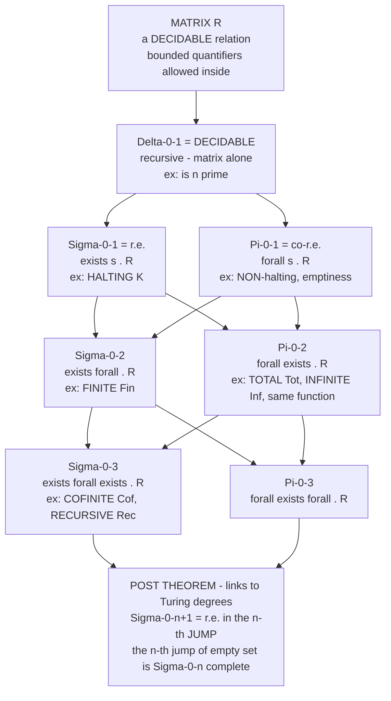

# 🧮 The Arithmetical Hierarchy

> [!abstract] TL;DR
> The **arithmetical hierarchy** classifies every set or relation on the natural numbers by the **quantifier complexity** of the first-order arithmetic formula that defines it. Take a **decidable matrix** `R` (a relation a computer can just check) and count the **alternating blocks of `∃` and `∀`** you must stack in front of it. Zero unbounded quantifiers is **`Δ⁰₁`** = **decidable**. One `∃` is **`Σ⁰₁`** = **recursively enumerable** — the archetype is **HALTING** (`∃s`: "there is a step at which the program stops"). One `∀` is **`Π⁰₁`** = **co-r.e.** Then the alternations climb: **`Σ⁰₂ = ∃∀`** (**FINITENESS** of an r.e. set), **`Π⁰₂ = ∀∃`** (**TOTALITY**, "the program halts on *every* input"), **`Σ⁰₃ = ∃∀∃`** (**COFINITENESS**), and so on. The **hierarchy theorem** proves each rung is **strictly harder** than the last (`Σ⁰ₙ ⊊ Σ⁰ₙ₊₁`), and **Post's theorem** pins the whole ladder to the **Turing jump**: a set is `Σ⁰ₙ₊₁` exactly when it is r.e. relative to the `n`-th jump `∅⁽ⁿ⁾`, and `∅⁽ⁿ⁾` is `Σ⁰ₙ`-complete. It is a precise ruler for the **logical difficulty of every yes/no question about numbers**.

---

## Intuition

**Analogy — how many nested "search" and "audit" steps does the question need?** Some questions you settle by *waiting and watching*. "**Does this program halt on this input?**" — you just run it; if it stops, the answer is *yes*, and the moment it stops is your **witness**. You never need more than a single search: "**is there a step `s` at which it has halted?**" That is one existential quantifier, `∃s`. If the true answer is *yes* you will eventually see it; if it is *no* you might wait forever, but the *form* of the question is a single unbounded search.

Now ask a harder one: "**Does this program halt on *every* input?**" No single observation settles this — you would have to certify a search *for all* inputs. That is a "**for all `x`, is there a step `s`?**" — a **universal** quantifier wrapping an **existential** one: `∀x ∃s`. And harder still: "**Does the program halt on all but finitely many inputs?**" now reads "**there is a cutoff `n` such that for all `x ≥ n` there is a halting step**" — `∃n ∀x ∃s`, three alternating layers deep.

The **arithmetical hierarchy** is exactly this bookkeeping. Fix a base question a machine can answer outright (the **matrix**), then count **how many times you must switch between "there exists" and "for all"** to phrase your real question on top of it. Each switch — each **alternation** — is a genuine jump in difficulty that no amount of cleverness can flatten. The result is an infinite ladder, `Σ⁰₁ / Π⁰₁ / Σ⁰₂ / Π⁰₂ / …`, that measures the logical complexity of *any* question about numbers, with the number of alternations as the rung.

---

## How It Works

### Core Mechanics

**1. The matrix must be decidable.** Everything is built on a **computable (recursive) base relation** `R(x̄, ȳ)` — one an algorithm decides with a guaranteed yes/no. Inside the matrix you are also allowed **bounded quantifiers** (`∀y < t`, `∃y < t`), because a bounded search is still a finite, decidable computation. Only the *unbounded* `∃`/`∀` out front count toward the hierarchy level.

**2. Count the alternating blocks, starting with the leading quantifier.** A set `A ⊆ ℕ` is:
- **`Σ⁰ₙ`** if `x ∈ A ⇔ ∃y₁ ∀y₂ ∃y₃ … Q yₙ R(x, y₁,…,yₙ)` — `n` alternating quantifier **blocks**, the outermost `∃`, over a decidable `R`.
- **`Π⁰ₙ`** if it starts with `∀` instead: `∀y₁ ∃y₂ ∀y₃ …`.
- **`Δ⁰ₙ = Σ⁰ₙ ∩ Π⁰ₙ`** — expressible *both* ways.

What matters is the number of **alternations**, not the raw quantifier count: `∃y₁ ∃y₂ ∃y₃ R` is still `Σ⁰₁`, because a block of same-type quantifiers **contracts** into one (pair them up via a computable pairing function `⟨y₁,y₂⟩`). Adjacent bounded quantifiers get absorbed into the matrix.

**3. The base of the ladder is computability itself.**
- **`Δ⁰₁` = DECIDABLE (recursive):** no unbounded quantifier needed — the matrix alone decides membership. Example: "is `n` prime?"
- **`Σ⁰₁` = recursively ENUMERABLE (r.e.):** `∃y R(x, y)` — you can *list* the members but maybe never certify a non-member. The **HALTING** set `K = {e : φₑ(e)↓}` is the canonical `Σ⁰₁` (and `Σ⁰₁`-**complete**) set: `e ∈ K ⇔ ∃s [φₑ(e) halts within s steps]`.
- **`Π⁰₁` = co-r.e.:** `∀y R(x, y)` — the complements of r.e. sets. "Program `e` never halts on input `x`" is `Π⁰₁`.

**4. Climbing: each alternation is a new rung.**
- **`Σ⁰₂ = ∃∀`.** **FINITENESS** `Fin = {e : Wₑ is finite}` is `Σ⁰₂`: "there is a bound `n` such that everything in `Wₑ` is below `n`" = `∃n ∀x [x ∈ Wₑ → x < n]`. (The inner `x ∈ Wₑ` is `Σ⁰₁`, so `x∈Wₑ → x<n` is `Π⁰₁`; `∀x` of a `Π⁰₁` stays `Π⁰₁`; the leading `∃n` makes it `Σ⁰₂`.) `Fin` is `Σ⁰₂`-**complete**.
- **`Π⁰₂ = ∀∃`.** **TOTALITY** `Tot = {e : φₑ total} = ∀x ∃s [φₑ(x)↓ in s steps]` is `Π⁰₂`-**complete**. So is **INFINITENESS** `Inf = ∀n ∃x [x ∈ Wₑ ∧ x > n]`, and "program `e` computes a **total** function" and "`φₐ = φᵦ` compute the **same** function" (`∀x [φₐ(x) = φᵦ(x)]`, both sides halting).
- **`Σ⁰₃ = ∃∀∃`.** **COFINITENESS** `Cof = {e : Wₑ is cofinite} = ∃n ∀x>n ∃s [φₑ(x)↓ in s]` is `Σ⁰₃`-**complete**; so is **RECURSIVENESS** `Rec = {e : Wₑ is a decidable set}`.

**5. The hierarchy theorem — the rungs are strict.** For every `n ≥ 1`:
`Σ⁰ₙ ⊊ Σ⁰ₙ₊₁`, `Π⁰ₙ ⊊ Π⁰ₙ₊₁`, `Σ⁰ₙ ≠ Π⁰ₙ` (existential-outermost is genuinely different from universal-outermost), and `Σ⁰ₙ ∪ Π⁰ₙ ⊊ Δ⁰ₙ₊₁`. The ladder **never collapses**. This is proved by **diagonalization** against a universal `Σ⁰ₙ` predicate (relativized halting) — the same self-reference that makes `K` undecidable, applied one level up at a time.

**6. Post's theorem — the ladder *is* the sequence of Turing jumps.** The **jump** `A'` of a set `A` is the halting problem *relativized* to `A` (an oracle for `A`). Writing `∅⁽ⁿ⁾` for the empty set jumped `n` times:
- `A` is `Σ⁰ₙ₊₁` **iff** `A` is **r.e. in `∅⁽ⁿ⁾`**.
- `A` is `Δ⁰ₙ₊₁` **iff** `A ≤_T ∅⁽ⁿ⁾` (Turing-reducible to the `n`-th jump).
- `∅⁽ⁿ⁾` is `Σ⁰ₙ`-**complete** (its complement is `Π⁰ₙ`-complete): `∅' = K` is `Σ⁰₁`-complete, `∅''` is `Σ⁰₂`-complete, and so on.

So the arithmetical hierarchy and the tower of Turing jumps are **two views of the same object**: each alternation of quantifiers costs exactly one jump in oracle power. This is the bridge from *definability* (logic) to *degrees of unsolvability* (computability).

**7. Beyond: the analytical hierarchy.** Allow quantifiers over **functions/sets of numbers** (second-order), not just numbers, and you get the **analytical hierarchy** `Σ¹ₙ / Π¹ₙ` sitting *above* the entire arithmetical hierarchy — the recursion-theoretic mirror of the **projective hierarchy** in descriptive set theory (Borel ↔ arithmetical, projective ↔ analytical).

### Flow / Architecture



*Each downward step adds exactly one quantifier ALTERNATION, and the hierarchy theorem guarantees the step is strict — no rung collapses into the one below it.*

---

## Key Concepts

### Secondary (intuitive, no advanced background)

- **Decidable question** — one a machine answers with a guaranteed yes/no, always halting. This is the *floor* of the hierarchy (`Δ⁰₁`).
- **"There exists" vs "for all"** — the two ways a question can range over *all* numbers. "Is there a step where it halts?" (`∃`) vs "does it halt for all inputs?" (`∀`).
- **Alternation = difficulty** — every time the question switches between "there exists" and "for all," it gets **strictly harder** to answer. The hierarchy counts these switches.
- **Halting is one search** — "does this program stop?" needs only a single `∃` (wait and see). That is the easiest *undecidable* level, `Σ⁰₁`.
- **Totality is a search inside an audit** — "does it stop on *every* input?" is `∀x ∃s`, one rung harder (`Π⁰₂`).

### Undergraduate (a first course in computability / logic)

- **`Σ⁰ₙ`, `Π⁰ₙ`, `Δ⁰ₙ`** — sets defined by `n` alternating quantifier blocks (over a decidable matrix) starting with `∃`, with `∀`, or expressible both ways.
- **`Δ⁰₁` = recursive, `Σ⁰₁` = r.e., `Π⁰₁` = co-r.e.** — the base three, with `HALTING` as the `Σ⁰₁` archetype and the **Post correspondence**: a set is decidable iff both it and its complement are r.e. (`Δ⁰₁ = Σ⁰₁ ∩ Π⁰₁`).
- **Quantifier-contraction** — same-type adjacent quantifiers merge via a **pairing function**, so only *alternations* count; bounded quantifiers fold into the matrix.
- **Canonical examples by level** — `Fin` (`Σ⁰₂`), `Inf` and `Tot` (`Π⁰₂`), `Cof` and `Rec` (`Σ⁰₃`). Learn to read a problem's English and count its alternations.
- **`Σ⁰ₙ`-completeness** — via **many-one (`≤ₘ`) reductions**: a `Σ⁰ₙ`-complete set is the hardest at its level; every `Σ⁰ₙ` set reduces to it. `K`, `Fin`, `Tot`, `Cof` are the standard complete sets for `Σ⁰₁, Σ⁰₂, Π⁰₂, Σ⁰₃`.

### Graduate (recursion theory)

- **Post's theorem (full form)** — `A ∈ Σ⁰ₙ₊₁ ⇔ A` is r.e. in `∅⁽ⁿ⁾`; `A ∈ Δ⁰ₙ₊₁ ⇔ A ≤_T ∅⁽ⁿ⁾`; `∅⁽ⁿ⁾` is `Σ⁰ₙ`-complete. The **Kleene–Mostowski** classification and the **Turing-jump** tower are the same structure.
- **The hierarchy theorem via the jump** — `∅⁽ⁿ⁺¹⁾ ∈ Σ⁰ₙ₊₁ ∖ Σ⁰ₙ`, because `∅⁽ⁿ⁾ <_T ∅⁽ⁿ⁺¹⁾` strictly (the jump strictly increases Turing degree) while every `Σ⁰ₙ` set is `≤_T ∅⁽ⁿ⁾`. Strictness of the ladder = strictness of the jump.
- **Index sets and their exact level** — by the **Rice–Shapiro** and completeness theory: `Fin` is `Σ⁰₂`-complete, `Tot`/`Inf`/`Cof(=)` are `Π⁰₂`-complete, `Cof` and `Rec` are `Σ⁰₃`-complete, and "`Wₑ` is Turing-**complete**" is `Σ⁰₄`-complete — the level tracks the logical form of the property.
- **Relativization** — the whole hierarchy relativizes: `Σ⁰ₙ(X)` over an oracle `X` reproduces the ladder above `X`, and `∅⁽ⁿ⁾(X) = X⁽ⁿ⁾`. This is the tie to **Turing degrees** and priority arguments.
- **Normal-form / prenex theorems** — every arithmetical formula is equivalent to one in prenex form; **Kleene's normal form** gives a *single* decidable predicate `T` (the T-predicate) so that every `Σ⁰₁` set is `∃s T(e, x, s)`, seeding the whole tower.
- **Analytical hierarchy above** — `Σ¹ₙ / Π¹ₙ` with function quantifiers; `Π¹₁` = the recursive analog of coanalytic sets. The arithmetical sets are exactly `Δ¹₁`-in-the-limit's countable floor; descriptive set theory's **Borel ↔ projective** split mirrors **arithmetical ↔ analytical**.

---

## Python Demo

```python
# THE ARITHMETICAL HIERARCHY, made concrete.  numpy + matplotlib only.
#
# PART A -- classify decision problems by the QUANTIFIER PREFIX of the formula
#           that DEFINES them, over a single DECIDABLE matrix R(e, x, s):
#               R(e,x,s)  ==  "program e halts on input x within s steps"   (decidable)
#           HALTING   H(e,x)  = exists s . R                      -> Sigma-0-1 (r.e.)
#           TOTALITY  Tot(e)  = forall x . exists s . R           -> Pi-0-2
#           FINITE    Fin(e)  = exists n . forall x>=n . not H    -> Sigma-0-2
#           INFINITE  Inf(e)  = forall n . exists x>=n . H        -> Pi-0-2
#           COFINITE  Cof(e)  = exists n . forall x>=n . H        -> Sigma-0-3
#           We implement the DECIDABLE, BOUNDED approximations of these
#           (undecidable) predicates and read the ladder off the quantifier prefix.
#
# PART B -- the HIERARCHY THEOREM + POST'S THEOREM: each level is STRICTLY harder,
#           and Sigma-0-(n+1) = r.e. in the n-th Turing JUMP 0^(n), which is
#           Sigma-0-n complete.  Plot the ladder + the jump correspondence.

import numpy as np
import matplotlib.pyplot as plt

INF = float("inf")

# ---- toy "programs": each defined by its steps-to-halt on input x (INF = never) ----
def steps(prog, x):
    if prog == "P_total":    return 1                             # W_e = all of N
    if prog == "P_even":     return 2 if x % 2 == 0 else INF      # W_e = evens
    if prog == "P_loop":     return INF                           # W_e = empty
    if prog == "P_finite":   return 1 if x < 3 else INF           # W_e = {0,1,2}
    if prog == "P_cofinite": return 1 if x >= 2 else INF          # W_e = {2,3,4,...}
    raise ValueError(prog)

PROGS = ["P_total", "P_even", "P_loop", "P_finite", "P_cofinite"]

# ---- the ONE decidable primitive: the matrix R(e,x,s) ----
def R(prog, x, s):                      # DECIDABLE, and bounded in s
    return steps(prog, x) <= s

# bounds for the decidable APPROXIMATIONS of the (real, undecidable) predicates
S_MAX, X_MAX, N_MAX = 60, 40, 20

def H(prog, x):                                   # Sigma-0-1 : exists s . R
    return any(R(prog, x, s) for s in range(S_MAX))

def Tot(prog):                                    # Pi-0-2 : forall x . exists s . R
    return all(H(prog, x) for x in range(X_MAX))

def Fin(prog):                                    # Sigma-0-2 : exists n . forall x>=n . not H
    return any(all(not H(prog, x) for x in range(n, X_MAX)) for n in range(N_MAX))

def Inf(prog):                                    # Pi-0-2 : forall n . exists x>=n . H
    return all(any(H(prog, x) for x in range(n, X_MAX)) for n in range(N_MAX))

def Cof(prog):                                    # Sigma-0-3 : exists n . forall x>=n . H
    return any(all(H(prog, x) for x in range(n, X_MAX)) for n in range(N_MAX))

# ---- PART A: print the classification table ----
print("=" * 74)
print("PART A -- classify each program by the QUANTIFIER PREFIX of its formula")
print("          (decidable BOUNDED approximations of undecidable predicates)")
print("=" * 74)
hdr = f"{'program':<12}{'H(.,1) S1':>11}{'Tot P2':>9}{'Fin S2':>9}{'Inf P2':>9}{'Cof S3':>9}"
print(hdr); print("-" * len(hdr))
for p in PROGS:
    print(f"{p:<12}{str(H(p,1)):>11}{str(Tot(p)):>9}{str(Fin(p)):>9}"
          f"{str(Inf(p)):>9}{str(Cof(p)):>9}")
print("\nS1=Sigma-0-1  P2=Pi-0-2  S2=Sigma-0-2  S3=Sigma-0-3")
print("Read left to right: MORE quantifier alternations = a STRICTLY harder rung.")

# ---- PART B: the ladder + the jump correspondence ----
fig, (axL, axR) = plt.subplots(1, 2, figsize=(14.5, 6.8))

# LEFT: the arithmetical-hierarchy ladder (Sigma on left, Pi on right, Delta centred)
axL.set_xlim(0, 10); axL.set_ylim(0, 8.2); axL.axis("off")
axL.set_title("The Arithmetical Hierarchy\n"
              "each step = one more quantifier ALTERNATION (strictly harder)",
              fontsize=11)

def box(x, y, text, color):
    axL.text(x, y, text, ha="center", va="center", fontsize=7.6,
             bbox=dict(boxstyle="round,pad=0.35", fc=color, ec="black", lw=1))

SIG, PIC, DEL = "#fdebd0", "#d6eaf8", "#eaeded"
box(5.2, 0.6, "Delta-0-1 = DECIDABLE (recursive)\nmatrix alone -- ex: is n prime", "#d5f5e3")
box(2.7, 2.1, "Sigma-0-1 = r.e.\nexists s . R\nex: HALTING K", SIG)
box(7.7, 2.1, "Pi-0-1 = co-r.e.\nforall s . R\nex: NON-halting", PIC)
box(5.2, 3.3, "Delta-0-2 = decidable in K", DEL)
box(2.7, 4.5, "Sigma-0-2\nexists forall . R\nex: FINITE  Fin", SIG)
box(7.7, 4.5, "Pi-0-2\nforall exists . R\nex: TOTAL Tot, INFINITE Inf", PIC)
box(5.2, 5.7, "Delta-0-3", DEL)
box(2.7, 6.9, "Sigma-0-3\nexists forall exists . R\nex: COFINITE Cof, RECURSIVE Rec", SIG)
box(7.7, 6.9, "Pi-0-3\nforall exists forall . R", PIC)
axL.annotate("", xy=(0.55, 7.7), xytext=(0.55, 0.4),
             arrowprops=dict(arrowstyle="->", lw=2.2, color="#7f8c8d"))
axL.text(0.2, 4.0, "more alternations  ->  strictly harder",
         rotation=90, ha="center", va="center", fontsize=8.4, color="#7f8c8d")

# RIGHT: Post's theorem -- the ladder tracks the Turing JUMPS
n = np.arange(0, 5)
axR.plot(n, n, "o-", color="#8e44ad", lw=2.2, ms=10)
labels = ["0^(0) = empty set\nDECIDABLE (Delta-0-1)",
          "0' = K = HALTING\nSigma-0-1 complete",
          "0''\nSigma-0-2 complete",
          "0'''\nSigma-0-3 complete",
          "0''''\nSigma-0-4 complete"]
for xi, lab in zip(n, labels):
    axR.annotate(lab, (xi, xi), textcoords="offset points", xytext=(12, -4),
                 fontsize=8, va="top")
axR.set_xlabel("number of Turing JUMPS applied to the empty set  (n)")
axR.set_ylabel("Turing-degree height (strictly increasing)")
axR.set_title("Post's theorem: the hierarchy tracks the JUMP\n"
              "Sigma-0-(n+1) = r.e. in 0^(n);  0^(n) is Sigma-0-n complete",
              fontsize=11)
axR.set_xticks(n); axR.set_yticks(n)
axR.set_xlim(-0.4, 5.4); axR.set_ylim(-0.4, 5.2)
axR.grid(alpha=0.3)

plt.tight_layout()
plt.savefig("arithmetical_hierarchy.png", dpi=130)
print("\nSaved ladder + jump-correspondence figure to arithmetical_hierarchy.png")
```

Running it prints a classification table: `P_total` is total (`Π⁰₂` holds) and its domain is cofinite (`Σ⁰₃` holds); `P_loop` and `P_finite` have **finite** domains (`Σ⁰₂` holds) but are not total; `P_even` has an **infinite** but not cofinite domain; `P_cofinite` is cofinite but not total. Every verdict was computed from the **same decidable matrix** `R(e,x,s)` — only the **quantifier prefix wrapped around it changed**, and that prefix *is* the hierarchy level. The left plot draws the ladder (`Σ` left, `Π` right, `Δ` between, each rung a fresh alternation); the right plot shows **Post's theorem** — the strictly increasing tower of Turing jumps `∅ <_T ∅' <_T ∅'' <_T …` with `∅⁽ⁿ⁾` sitting `Σ⁰ₙ`-complete, which is *why* the ladder never collapses.

---

## Real-World Applications

> **Example — the classification of program properties (extended Rice's theorem).** Rice's theorem says every non-trivial semantic property of programs is *undecidable*; the arithmetical hierarchy says **exactly how undecidable**. "Does this program **terminate on all inputs**?" (totality) is `Π⁰₂`-complete — strictly harder than "does it terminate on *this* input?" (`Σ⁰₁`). A static analyzer or termination prover is therefore not merely "sometimes wrong"; it is attacking a `Π⁰₂`-complete problem, which tells you precisely what oracle power (a double halting oracle `∅''`) would be needed to solve it exactly.

Where the hierarchy shows up in practice and in theory:

- **Termination and liveness in verification** — "the program halts on every input" (`Π⁰₂`) and "this reactive system satisfies its liveness spec infinitely often" (`Π⁰₂`-flavored) are why termination checkers and model checkers for infinite-state systems are inherently incomplete; the level tells you *how* incomplete.
- **The resource-bounded analog** — the **[[The_Polynomial_Hierarchy]]** (`Σᵖₙ / Πᵖₙ`, with `NP = Σᵖ₁`) is the arithmetical hierarchy's polynomial-time shadow: swap "computable matrix + unbounded quantifier" for "poly-time matrix + polynomially-bounded quantifier." The alternation-counting intuition transfers directly.
- **Descriptive set theory** — the **Borel hierarchy** and **projective hierarchy** on Polish spaces are the topological mirror; arithmetical sets are the *lightface* (effective) analog of Borel sets, and the analytical hierarchy mirrors the projective one, unifying logic, topology, and computability.
- **Reverse mathematics and proof theory** — the strength of a theorem is often measured by the arithmetical complexity of the sentences it proves (`Π⁰₁`, `Π⁰₂`, …); `Π⁰₂`-conservativity and the `Π⁰₁`-form of consistency statements are central tools.
- **Learning theory and the limits of inference** — "identifiability in the limit" and many inductive-inference successes live at specific arithmetical levels, quantifying which classes of functions are learnable and which are provably beyond any learner.

---

## Common Pitfalls

- **"`Σ` vs `Π` is decided by the *outermost* quantifier."** `Σ⁰ₙ` starts with `∃`, `Π⁰ₙ` with `∀`. `HALTING` (`∃s`) is `Σ⁰₁`; its complement `NON-halting` (`∀s`) is `Π⁰₁`. People flip these constantly. A quick check: r.e. sets you can *list* (`Σ`); co-r.e. sets you can *refute a member of but not confirm* (`Π`).
- **"The matrix must be computable — and bounded quantifiers are free."** The classification is meaningless unless the innermost relation `R` is **decidable**. Bounded quantifiers (`∀y<t`, `∃y<t`) stay inside the matrix and cost *nothing*; only **unbounded** quantifiers raise the level. Sneaking an undecidable predicate into the "matrix" invalidates the whole count.
- **"It's the number of ALTERNATIONS, not the number of quantifiers."** `∃a ∃b ∃c R` is still `Σ⁰₁` — three existentials **contract** to one via pairing. `∀x ∀y ∃z ∃w R` is `Π⁰₂`, not `Π⁰₄`: two universal blocks, one existential block, one alternation. Always prenex-normalize and *collapse same-type runs* before counting.
- **"Getting the level wrong by mis-reading the English."** "Halts on **some** input" (`∃x ∃s`, `Σ⁰₁`) vs "halts on **all** inputs" (`∀x ∃s`, `Π⁰₂`) vs "halts on **all but finitely many**" (`∃n ∀x>n ∃s`, `Σ⁰₃`). One word — some / all / cofinitely — changes the rung. Translate to a formula before classifying.
- **"Forgetting the tie to the jump."** `Σ⁰ₙ₊₁` is *not* a fresh abstraction — by **Post's theorem** it is precisely "r.e. relative to `∅⁽ⁿ⁾`," and `∅⁽ⁿ⁾` is the complete `Σ⁰ₙ` set. If you can't relate your level to a jump, you've likely miscounted; the hierarchy and the tower of jumps are the same ladder.
- **"Assuming `Σ⁰ₙ = Π⁰ₙ`."** For `n ≥ 1` they are **provably different** (hierarchy theorem). Only their **intersection** `Δ⁰ₙ` is symmetric, and `Δ⁰₁` = decidable is the sole level where "list it" and "refute it" coincide.

---

## Related Concepts

- [[Mathematical_Logic_Overview]] — the vault entry point; the arithmetical hierarchy is the **recursion-theory** pillar's measuring stick for the logical complexity of number-theoretic statements.
- [[The_Halting_Problem_and_Undecidability]] — `HALTING` is the `Σ⁰₁`-complete set at the base of the ladder; the diagonal argument that makes it undecidable is what proves every rung strict.
- [[Decidability_and_Recognizability]] — "decidable" (`Δ⁰₁`) vs "recognizable / r.e." (`Σ⁰₁`) vs "co-recognizable" (`Π⁰₁`) *are* the bottom three levels; this note is their generalization to the whole tower.
- [[Reductions_and_Undecidable_Problems]] — many-one (`≤ₘ`) and Turing (`≤_T`) reductions are how `Σ⁰ₙ`-**completeness** is proved; the hierarchy is stratified by reducibility.
- [[The_Polynomial_Hierarchy]] — the resource-bounded analog: `Σᵖₙ / Πᵖₙ` mirror `Σ⁰ₙ / Π⁰ₙ` with poly-time matrices and bounded quantifiers; `P = Δᵖ₁`, `NP = Σᵖ₁` echo `recursive = Δ⁰₁`, `r.e. = Σ⁰₁`.
- [[Complexity_Hierarchies_and_Diagonalization]] — the diagonalization/hierarchy-theorem machinery that proves the levels strict is the same tool used for time/space hierarchy theorems.
- [[First_Order_Predicate_Logic]] — the hierarchy is literally the classification of arithmetic **first-order formulas** by quantifier alternation; Tarski's satisfaction gives the semantics of the matrix and prefix.
- [[Quantifier_Elimination_and_Decidability]] — the opposite move: QE *removes* quantifiers to collapse a theory to `Δ⁰₁`; the arithmetical hierarchy exists precisely because full arithmetic **admits no** such elimination.
- [[Predicate_Logic_and_Quantifiers]] — the `∃`/`∀` alternation intuition, from the informal-logic side.
- [[Mathematical_Logic_and_Set_Theory]] — the single-note survey; this note is the section-level deep dive of its computability/definability thread.

*Prose-only siblings (section 04 notes not yet in the vault): **Turing_Degrees_and_the_Priority_Method** (the degree-theoretic home of the jump `∅⁽ⁿ⁾` that Post's theorem invokes), **Undecidability_and_Reducibility** (the `≤ₘ`/`≤_T` scaffolding for completeness), **Computability_and_Recursion_Theory** (the section overview), **Godels_Incompleteness_Theorems** (whose provability predicate is `Σ⁰₁` and whose consistency statement is `Π⁰₁`), and **Second_Order_and_Higher_Order_Logic** (the gateway to the analytical hierarchy `Σ¹ₙ` above).*

---

## Review Questions

### Secondary

1. Explain, without symbols, why "does this program halt on this input?" needs only *one* search step, but "does it halt on *every* input?" needs a search *inside* a for-all check. Which one is harder, and why?
2. What does it mean to say a question is **decidable**? Why is that the "easiest" rung of the ladder?
3. The hierarchy counts how many times a question switches between "there exists" and "for all." Why should each extra switch make a question strictly harder rather than just longer?

### Undergraduate

1. Classify each of these and justify by writing the defining formula and counting alternations: (a) "`Wₑ` is empty," (b) "`e` halts on at least one input," (c) "`Wₑ` is finite," (d) "`φₑ` is total." Which are `Σ⁰₁`, `Π⁰₁`, `Σ⁰₂`, `Π⁰₂`?
2. Show that `∃a ∃b ∀c R(x,a,b,c)` is `Σ⁰₂`, not `Σ⁰₃`. What role does the **pairing function** play, and why are bounded quantifiers ignored in the count?
3. State the base correspondence `Δ⁰₁ = Σ⁰₁ ∩ Π⁰₁` in words, and explain why `HALTING` being `Σ⁰₁` but **not** `Π⁰₁` shows `Σ⁰₁ ≠ Π⁰₁`.

### Graduate

1. State **Post's theorem** in full (`Σ⁰ₙ₊₁` ↔ r.e. in `∅⁽ⁿ⁾`; `Δ⁰ₙ₊₁` ↔ `≤_T ∅⁽ⁿ⁾`; `∅⁽ⁿ⁾` is `Σ⁰ₙ`-complete). Using it, prove the hierarchy theorem `Σ⁰ₙ ⊊ Σ⁰ₙ₊₁` by exhibiting `∅⁽ⁿ⁺¹⁾` as a witness, and identify exactly where the *strictness of the Turing jump* is used.
2. Prove that `Tot = {e : φₑ total}` is `Π⁰₂`-complete: give the `Π⁰₂` definition, and reduce a known `Π⁰₂`-complete set (or `Tot` itself, via a universal construction) to it. Contrast with `Fin` being `Σ⁰₂`-complete and `Cof` being `Σ⁰₃`-complete.
3. Sketch the passage from the arithmetical to the **analytical** hierarchy: how does allowing one function quantifier (`∃f`, `∀f`) produce `Σ¹₁ / Π¹₁`, why does the entire arithmetical hierarchy sit inside `Δ¹₁`, and how does this parallel the **Borel ↔ projective** distinction in descriptive set theory?

---

## Sources

- Kleene, S. C. "Recursive predicates and quantifiers." *Transactions of the AMS* 53 (1943), 41–73 — the founding paper introducing the arithmetical hierarchy and the `Σ`/`Π` normal forms.
- Mostowski, A. "On definable sets of positive integers." *Fundamenta Mathematicae* 34 (1947), 81–112 — the independent development giving the "Kleene–Mostowski hierarchy" its name.
- Soare, R. I. *Turing Computability: Theory and Applications*. Springer, 2016 — modern graduate treatment of the hierarchy, the jump, and Post's theorem.
- Rogers, H. *Theory of Recursive Functions and Effective Computability*. MIT Press, 1987 — the classic reference; Chapters 14–15 develop the arithmetical hierarchy and index-set completeness.
- Post, E. L. "Recursively enumerable sets of positive integers and their decision problems." *Bulletin of the AMS* 50 (1944), 284–316 — the source of Post's theorem linking the hierarchy to the Turing jump.

---

#mathematical-logic #arithmetical-hierarchy #quantifier-complexity #recursion-theory #turing-jump
