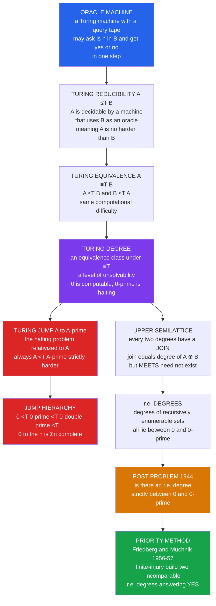

# 🪜 Turing Degrees and the Priority Method

> [!abstract] TL;DR
> Not all unsolvable problems are unsolvable in the **same way** — some are strictly "more unsolvable" than others. **Turing degrees** classify problems by *relative* difficulty: $A \le_T B$ ("$A$ is Turing-reducible to $B$") means a machine equipped with an **oracle** that answers membership in $B$ could decide $A$. Sets that reduce to each other ($\equiv_T$) share a **degree** — a level of unsolvability. The computable sets form the bottom degree $\mathbf{0}$; the halting problem sits at $\mathbf{0}'$. The **Turing jump** $A \mapsto A'$ (the halting problem *relativized* to $A$) is always strictly harder, $A <_T A'$, generating the tower $\mathbf{0} <_T \mathbf{0}' <_T \mathbf{0}'' <_T \dots$. The degrees form an **upper semilattice** (every pair has a least upper bound, the join). **Post's problem** (1944) asked whether any *recursively enumerable* degree sits **strictly between** $\mathbf{0}$ and $\mathbf{0}'$ — and it stood open for twelve years until Friedberg and Muchnik independently answered **YES** in 1956–57 by inventing the **priority method**: a delicate finite-injury construction, one of the signature techniques of modern mathematics.

---

## Intuition

**Analogy — a ladder of impossibilities, and a magic phone.** Imagine every problem you might want to solve is a task, and some tasks are literally impossible for any computer (the halting problem is the famous one). It is tempting to lump all impossible tasks together into a single bin marked "uncomputable." But that bin has hidden structure. Give a programmer a **magic phone** that can call an oracle and instantly get the yes/no answer to *one specific* impossible problem $B$. With that phone in hand, some *other* impossible problems suddenly become solvable — and some remain impossible even *with* the phone. That is the whole idea: problem $A$ is **no harder than** $B$ ($A \le_T B$) exactly when a programmer holding a $B$-answering phone can now solve $A$.

This single relation carves the "uncomputable universe" into an intricate **hierarchy of difficulty levels** — the Turing degrees. And there is always a way to climb: given any problem $A$, its **jump** $A'$ — "does an $A$-phone-using program halt?" — is *strictly harder* than $A$ itself, so the ladder never ends: $\mathbf{0} <_T \mathbf{0}' <_T \mathbf{0}'' <_T \dots$.

The most famous question in the young theory was deceptively simple. Between the *easiest* uncomputable level ($\mathbf{0}$, the merely computable — no phone needed) and the halting problem ($\mathbf{0}'$), is there anything **in between** among the "listable" (recursively enumerable) problems? Emil Post asked this in 1944 and could not answer it. The **YES** came only in 1956–57, through an astonishingly intricate construction called the **priority method**, in which infinitely many competing *requirements* are ranked by priority and allowed to "injure" one another finitely often until, in the limit, every one is satisfied. It remains one of the most delicate arguments in all of mathematics — and the workhorse of recursion theory ever since.

---

## How It Works

### Core mechanics

1. **Oracle machine.** A Turing machine augmented with a special **query tape** and a set $B$ as **oracle**. It computes normally, but at any step it may write $n$ on the query tape and ask "is $n \in B$?"; the oracle answers in one step. Notation: $\Phi_e^{B}$ is the $e$-th oracle machine running with oracle $B$; $\Phi_e^{B}(n){\downarrow}$ means it halts on input $n$.
2. **Turing reducibility $\le_T$.** $A \le_T B$ iff there is an oracle machine that decides $A$ using $B$ as its oracle — i.e. the characteristic function $\chi_A$ is computable relative to $B$. This is **relative computability**: "$A$ is no harder than $B$." It is *reflexive* and *transitive* (a preorder).
3. **Turing equivalence and degrees.** $A \equiv_T B$ iff $A \le_T B$ **and** $B \le_T A$. This is an equivalence relation; its classes are the **Turing degrees**, written $\deg(A)$. A degree is a "level of unsolvability." $\mathbf{0} = \deg(\emptyset)$ is the degree of all **computable** sets; $\mathbf{0}' = \deg(\emptyset')$ is the degree of the **halting problem**.
4. **The order on degrees.** Define $\deg(A) \le \deg(B)$ iff $A \le_T B$; this is well-defined and a **partial order**. $\mathbf{0}$ is the least element. Most pairs of degrees are **incomparable** — the order is wildly non-linear.
5. **Join (least upper bound).** Any two degrees $\mathbf{a}, \mathbf{b}$ have a **join** $\mathbf{a} \vee \mathbf{b} = \deg(A \oplus B)$, where $A \oplus B = \{2n : n \in A\} \cup \{2n+1 : n \in B\}$ interleaves the two sets. An oracle for $A \oplus B$ answers both. So the degrees form an **upper semilattice**. (They are *not* a lattice: some pairs have **no** greatest lower bound.)
6. **The Turing jump.** For any set $A$, the **jump** $A' = \{e : \Phi_e^{A}(e){\downarrow}\}$ is the halting problem *relativized to $A$*. Two facts hold for **every** $A$: (i) $A \le_T A'$ (the jump codes $A$), and (ii) $A' \not\le_T A$ (a *relativized* diagonal argument — an $A$-machine cannot decide its own halting). Hence $A <_T A'$ **strictly**. Iterating gives the **jump hierarchy** $\emptyset <_T \emptyset' <_T \emptyset'' <_T \dots$, and $\emptyset^{(n)}$ is $\Sigma_n$-complete, tying the jump to the **arithmetical hierarchy**.
7. **Recursively enumerable (r.e.) sets and Post's problem.** An r.e. set is one a machine can *list* (semi-decide). Every r.e. set has degree $\le \mathbf{0}'$, and $\mathbf{0}'$ itself is r.e. (the halting problem is listable). **Post's problem (1944):** is there an r.e. degree $\mathbf{d}$ with $\mathbf{0} <_T \mathbf{d} <_T \mathbf{0}'$ — strictly between computable and halting?
8. **The priority method (Friedberg–Muchnik, 1956–57).** Build two r.e. sets $A$ and $B$ so that $A \not\le_T B$ and $B \not\le_T A$ (their degrees are **incomparable**, hence both strictly between $\mathbf{0}$ and $\mathbf{0}'$). Break the goal into infinitely many **requirements** $R_e$; rank them by **priority**. Each requirement acts by enumerating a **witness** to diagonalize against a potential reduction. A higher-priority action may **injure** a lower one (spoil its witness), forcing it to start over with a fresh witness. The magic: each requirement is injured only by the *finitely many* higher-priority ones, so it is injured **finitely often** and eventually satisfied *permanently* — a **finite-injury** argument.

### Flow / architecture



---

## Key Concepts

### Secondary (intuition, no formalism)
- **Some impossible problems are harder than others.** "Uncomputable" is not one bin — it is a whole ladder of difficulty levels.
- **The magic phone.** If a phone that answers problem $B$ lets you solve problem $A$, then $A$ is *no harder than* $B$. Problems that let you solve each other are equally hard — one "level."
- **You can always go higher.** From any problem, the "does *this kind of* program halt?" question is a strictly harder problem. So the ladder $\mathbf{0}, \mathbf{0}', \mathbf{0}'', \dots$ never stops.
- **The famous gap.** Between "solvable by a computer" and "the halting problem," is there a *listable* problem in between? For twelve years nobody knew. The answer is **yes**, proved by a fiendishly clever bookkeeping trick (the priority method).

### Undergraduate (formal statements)
- **Relative computability.** $A \le_T B$ iff $\chi_A$ is computable by an oracle Turing machine with oracle $B$. Equivalently, $A \le_T B$ iff $A$ and its complement are both **$B$-recursively enumerable**.
- **Many-one vs Turing.** $A \le_m B$ (many-one) iff there is a *computable* $f$ with $x \in A \iff f(x) \in B$ — a single non-adaptive query, answer used verbatim. $A \le_T B$ allows **many adaptive** queries and arbitrary post-processing (including negation). So $\le_m$ is strictly stronger: $A \le_m B \Rightarrow A \le_T B$, but not conversely (e.g. $\overline{K} \le_T K$ yet $\overline{K} \not\le_m K$).
- **Degrees.** $\mathcal{D} = \{$ Turing degrees $\}$ under $\le$ is an **upper semilattice** with least element $\mathbf{0}$, join $\mathbf{a}\vee\mathbf{b}=\deg(A\oplus B)$, and cardinality $2^{\aleph_0}$; each degree contains only $\aleph_0$ sets, so there are $2^{\aleph_0}$ degrees.
- **The jump.** $A' = \{e : \Phi_e^A(e){\downarrow}\}$. Key properties: **(monotone)** $A \le_T B \Rightarrow A' \le_T B'$; **(strictly increasing)** $A <_T A'$; **(jump theorem)** $A' \equiv_T$ the $\Sigma_1^A$-complete set. $\emptyset^{(n)}$ is $\Sigma_n^0$-complete (arithmetical hierarchy).
- **r.e. degrees.** A degree is r.e. if it contains an r.e. set. The r.e. degrees form a substructure with least $\mathbf{0}$ and greatest $\mathbf{0}'$. **Post's problem:** does $\mathbf{0} <_T \mathbf{d} <_T \mathbf{0}'$ hold for some r.e. $\mathbf{d}$? **Friedberg–Muchnik:** yes — construct r.e. $A, B$ with incomparable degrees.
- **The requirements.** For incomparability, satisfy for all $e$: $R_{2e}: A \ne \Phi_e^{B}$ and $R_{2e+1}: B \ne \Phi_e^{A}$. Meeting every $R_e$ makes neither set reducible to the other.

### Graduate (mechanisms and reach)
- **Finite-injury priority.** Order requirements $R_0, R_1, \dots$ by priority. $R_e$ acts by choosing a fresh **witness** $x$ (larger than all restraints of higher requirements), waiting for $\Phi_e^{B}(x){\downarrow}=0$ at some stage, then enumerating $x$ into $A$ (so $A(x)=1\ne 0=\Phi_e^B(x)$), and imposing a **restraint** to protect the use of that computation. When a higher requirement later changes $B$ below the use, it **injures** $R_e$, which picks a new witness. Since $R_e$ is injured only by the finitely many $R_{e'}$ with $e' < e$, it is injured finitely often and eventually reaches a permanent witness — the **injury count is finite**.
- **Post's programs and the failure of simple invariants.** Post first tried to solve his own problem via structural properties of r.e. sets — **simple**, **hypersimple**, **hyperhypersimple** sets — hoping a "thin complement" forced intermediate degree. All such attempts fail (these sets can still be complete). The priority method was the necessary new idea, not a structural shortcut.
- **The structure of the r.e. degrees is rich.** **Sacks Density Theorem (1964):** between any two r.e. degrees $\mathbf{a} <_T \mathbf{b}$ there is a third r.e. $\mathbf{c}$ with $\mathbf{a} <_T \mathbf{c} <_T \mathbf{b}$ — the r.e. degrees are **dense**. **Sacks Splitting**, the **Thickness Lemma**, and non-distributivity results all come from priority arguments.
- **Higher priority machinery.** **Infinite-injury** (tree/$0'''$-priority) methods build objects where each requirement is injured infinitely often but only finitely often *along the true path* (e.g. the Sacks constructions, the minimal-pair theorem). **Minimal degrees** ($\mathbf{a} > \mathbf{0}$ with nothing strictly between $\mathbf{0}$ and $\mathbf{a}$) are built by forcing with perfect trees (Spector) — these are **not** r.e.
- **The jump operator and definability.** The jump is definable in $(\mathcal{D}, \le)$ (Shore–Slaman, 1999). The theory of $\mathcal{D}$ is as complicated as second-order arithmetic. **Post's theorem** links the arithmetical hierarchy to the jump: $A$ is $\Sigma_{n+1}^0$ iff $A$ is $\emptyset^{(n)}$-r.e.
- **Reverse-mathematics and randomness echoes.** The $\emptyset^{(n)}$ hierarchy calibrates the logical strength of theorems in **reverse mathematics** (which subsystem of second-order arithmetic proves a given theorem). Relative computability also underlies **algorithmic randomness**: a real is $n$-random relative to the degree of $\emptyset^{(n-1)}$, and the degrees of random reals interact intricately with the r.e. degrees.

---

## Python Demo

```python
# Turing degrees & the priority method, made concrete (numpy + matplotlib).
#
# (a) ORACLE MACHINES and the TURING JUMP
#     - an oracle machine = a program that may query a black-box membership
#       oracle for a set A.  With a halting oracle it DECIDES sets it cannot
#       decide unaided (a bounded simulator makes mistakes).
#     - the JUMP A' = the A-relative halting set.  A relativized diagonal
#       argument shows A <_T A' ALWAYS -> the strictly increasing chain
#       0 <_T 0' <_T 0'' <_T ...  (climbing the arithmetical hierarchy).
#       NOTE: no terminating program can *prove* uncomputability -- that is the
#       whole point -- so we demonstrate the STRUCTURE and the diagonal logic.
#
# (b) DEGREE STRUCTURE + a Friedberg-Muchnik-flavored FINITE-INJURY priority
#     construction: build two r.e. sets whose degrees are INCOMPARABLE by
#     satisfying requirements R_e via injury/priority.  We plot the jump chain,
#     the upper-semilattice of degrees, and the requirement/injury table.

import numpy as np
import matplotlib.pyplot as plt

rng = np.random.default_rng(1957)   # Friedberg 1957 / Muchnik 1956

# =====================================================================
# (a) ORACLE MACHINES: with an oracle you decide what you otherwise cannot
# =====================================================================
GROUND_BUDGET = 20_000

def run_program(e, n, budget):
    """Toy program family P_e(n).  The %7 branch diverges (loops forever);
    otherwise a Collatz walk that always reaches 1 (halts) but sometimes only
    after many steps -- so a SMALL step budget cannot tell 'slow-halting' from
    'looping'."""
    if (3 * e + n) % 7 == 0:
        return False                       # this member never halts
    x = (131 * e + 977 * n) % 8000 + 27
    steps = 0
    while steps < budget:
        if x == 1:
            return True
        x = x // 2 if x % 2 == 0 else 3 * x + 1
        steps += 1
    return False                           # budget exhausted -> "don't know"

# The toy 'halting set' K over a finite window (ground truth via a huge budget).
window = [(e, n) for e in range(12) for n in range(12)]
K = {(e, n) for (e, n) in window if run_program(e, n, GROUND_BUDGET)}

def decide_without_oracle(e, n, budget=12):
    """No oracle: simulate with a SMALL budget, guess False if not yet halted."""
    return run_program(e, n, budget)

def decide_with_oracle(e, n, oracle):
    """Oracle machine: one membership query to the K-oracle -> always correct."""
    return (e, n) in oracle

truth       = np.array([(e, n) in K for (e, n) in window])
no_oracle   = np.array([decide_without_oracle(e, n) for (e, n) in window])
with_oracle = np.array([decide_with_oracle(e, n, K) for (e, n) in window])
acc_no  = np.mean(no_oracle  == truth) * 100
acc_yes = np.mean(with_oracle == truth) * 100

print("(a) ORACLE MACHINE vs bounded simulator")
print(f"    deciding membership in the toy halting set K over {len(window)} inputs")
print(f"    WITHOUT oracle (budget 12):  {acc_no:5.1f}% correct  (misses slow halts)")
print(f"    WITH K-oracle  (one query):  {acc_yes:5.1f}% correct  (relative computation)")

# --- the TURING JUMP is STRICTLY harder: relativized diagonal contradiction ---
# Suppose A' (the A-relative halting problem) were computable FROM A, i.e. A'<=_T A.
# Build D^A(e): if the A-machine says 'phi_e^A(e) halts' then D LOOPS, else HALTS.
# Running D^A on its own index contradicts the verdict -> A' is NOT <=_T A.
# Combined with the trivial A <=_T A', this gives  A <_T A'  for EVERY set A.
print("\n    Turing JUMP  A -> A'  (the A-relative halting problem):")
for claim in ("halts", "loops"):
    actual = "loops" if claim == "halts" else "halts"
    print(f"      A-oracle claims D(D) {claim:>5}  ->  D(D) actually {actual:>5}  : contradiction")
print("    => A <_T A' ALWAYS  =>  chain  0 <_T 0' <_T 0'' <_T 0''' <_T ...")

# =====================================================================
# (b) FRIEDBERG-MUCHNIK finite-injury priority construction (stylized)
#     Requirements (priority = index, R_0 highest):
#       R_{2e}   :  A != Phi_e^B   (diagonalize A against e-th B-oracle machine)
#       R_{2e+1} :  B != Phi_e^A   (diagonalize B against e-th A-oracle machine)
#     A higher-priority action can INJURE lower requirements, forcing a fresh
#     witness.  Each R is injured only by the finitely many HIGHER R's -> acts
#     finitely often -> is eventually PERMANENTLY satisfied (finite injury).
# =====================================================================
k = 6
# lower-priority (higher index) requirements become "ready" first, so that when
# the higher-priority ones later act they INJURE the already-satisfied lower ones.
convergence = np.array([(k - e) * 3 for e in range(k)], dtype=int)
satisfied   = np.zeros(k, dtype=bool)
acts        = np.zeros(k, dtype=int)
injuries    = np.zeros(k, dtype=int)
events      = []            # (requirement, stage, kind)   kind in {'A','I'}
MAX_STAGE   = 300
stage = 0
while stage <= MAX_STAGE:
    acted = False
    for e in range(k):                        # scan by priority, R_0 first
        if (not satisfied[e]) and stage >= convergence[e]:
            satisfied[e] = True               # R_e ACTS: enumerate its witness
            acts[e] += 1
            events.append((e, stage, 'A'))
            for i in range(e + 1, k):         # injure lower-priority satisfied R's
                if satisfied[i]:
                    satisfied[i] = False
                    injuries[i] += 1
                    convergence[i] = stage + 1 + (i - e)   # must re-converge later
                    events.append((i, stage, 'I'))
            acted = True
            break
    if not acted and satisfied.all():
        break
    stage += 1

assert satisfied.all(), "priority construction should satisfy every requirement"
last_stage = max(s for (_, s, _) in events)
print("\n(b) PRIORITY CONSTRUCTION (finite injury)")
for e in range(k):
    kind = "A != Phi^B" if e % 2 == 0 else "B != Phi^A"
    print(f"    R_{e} [{kind}]  acted {acts[e]}x, injured {injuries[e]}x -> permanently satisfied")
print(f"    total injuries = {injuries.sum()} (FINITE)  =>  A, B r.e. and Turing-INCOMPARABLE")
print("    => an r.e. degree strictly between 0 and 0'  =>  Post's problem: YES")

# ============================= PLOTTING ==============================
fig, ax = plt.subplots(2, 2, figsize=(14, 11))

# (0,0) the JUMP HIERARCHY chain with arithmetical-hierarchy labels
axj = ax[0, 0]
levels = ["0\ncomputable", "0'\nhalting", "0''", "0'''", "0''''"]
sigma  = [r"$\Delta_1$", r"$\Sigma_1$ (r.e.)", r"$\Sigma_2$", r"$\Sigma_3$", r"$\Sigma_4$"]
ys = np.arange(len(levels))
axj.plot(np.zeros_like(ys), ys, "-", color="#bbb", lw=1, zorder=1)
axj.scatter(np.zeros_like(ys), ys, s=430, color="#dc2626", zorder=3)
for y, lab, sg in zip(ys, levels, sigma):
    axj.text(0.16, y, lab, va="center", fontsize=11, fontweight="bold")
    axj.text(-0.16, y, sg, va="center", ha="right", fontsize=10, color="#2563eb")
for y in ys[:-1]:
    axj.annotate("", xy=(0, y + 1), xytext=(0, y),
                 arrowprops=dict(arrowstyle="-|>", color="#dc2626", lw=2))
axj.set_title("The TURING JUMP hierarchy\n"
              r"$0 <_T 0' <_T 0'' <_T \ldots$  (each jump strictly harder)")
axj.set_xlim(-0.8, 0.8); axj.set_ylim(-0.6, len(levels) - 0.3)
axj.axis("off")

# (0,1) the degrees as an UPPER SEMILATTICE (Friedberg-Muchnik diamond)
axd = ax[0, 1]
nodes = {"0": (0.5, 0.0), "a": (0.13, 0.55), "b": (0.87, 0.55), "0'": (0.5, 1.05)}
edges = [("0", "a"), ("0", "b"), ("a", "0'"), ("b", "0'")]
for u, v in edges:
    axd.plot([nodes[u][0], nodes[v][0]], [nodes[u][1], nodes[v][1]],
             "-", color="#555", lw=1.6, zorder=1)
cols = {"0": "#16a34a", "a": "#7c3aed", "b": "#7c3aed", "0'": "#dc2626"}
for name, (x, y) in nodes.items():
    axd.scatter([x], [y], s=1000, color=cols[name], zorder=3)
    axd.text(x, y, name, ha="center", va="center", color="white",
             fontweight="bold", fontsize=12, zorder=4)
axd.text(0.5, -0.18, "0 = computable degree", ha="center", fontsize=9)
axd.text(0.5, 1.22, r"0' = halting degree  (= a $\vee$ b, the JOIN)",
         ha="center", fontsize=9, color="#dc2626")
axd.text(0.5, 0.55, "a, b : incomparable r.e. degrees\n(Friedberg-Muchnik)",
         ha="center", fontsize=9, color="#7c3aed")
axd.set_title("Turing degrees form an UPPER SEMILATTICE\njoins always exist; meets need not")
axd.set_xlim(-0.05, 1.05); axd.set_ylim(-0.32, 1.38); axd.axis("off")

# (1,0) the PRIORITY / INJURY table: requirements x stages
axp = ax[1, 0]
S = last_stage + 1
grid = np.zeros((k, S))
for (e, s, kind) in events:
    grid[e, s] = 1 if kind == 'A' else -1
axp.imshow(grid, cmap="RdYlGn", vmin=-1, vmax=1, aspect="auto")
for (e, s, kind) in events:
    axp.text(s, e, kind, ha="center", va="center", fontsize=8,
             fontweight="bold", color="black")
axp.set_yticks(range(k))
axp.set_yticklabels([f"$R_{e}$" for e in range(k)])
axp.set_xlabel("construction stage  s")
axp.set_title("Priority construction:  A = acts (green),  I = injured (red)\n"
              "each row injured only FINITELY often -> stabilizes")

# (1,1) injuries + acts per requirement (finite injury)
axb = ax[1, 1]
axb.bar(range(k), injuries, color="#dc2626", alpha=0.85, label="times injured")
axb.bar(range(k), acts, bottom=injuries, color="#16a34a", alpha=0.7,
        label="times acted")
axb.set_xticks(range(k))
axb.set_xticklabels([f"$R_{e}$" for e in range(k)])
axb.set_ylabel("count")
axb.set_title("Finite injury: every requirement is injured\nonly finitely many times")
axb.legend(fontsize=9)
axb.grid(axis="y", alpha=0.3)

plt.tight_layout()
plt.savefig("turing_degrees_priority_method.png", dpi=120)
plt.show()
```

**What it shows.** Part (a) makes **relative computation** tangible: a bounded simulator (no oracle) misclassifies the slow-halting programs it hasn't finished simulating, while an **oracle machine** that makes a single membership query to the halting-set oracle $K$ is always correct — with the right phone, the impossible becomes routine. It then prints the **relativized diagonal contradiction** showing that the jump $A'$ can never be decided from $A$, so $A <_T A'$ for *every* $A$ and the chain $\mathbf{0} <_T \mathbf{0}' <_T \mathbf{0}'' <_T \dots$ never collapses. Part (b) runs a stylized **finite-injury** construction: lower-priority requirements act first, higher-priority ones later **injure** them, and each requirement re-picks a fresh witness — yet, crucially, each is injured only **finitely often** (the bar chart) and ends **permanently satisfied**, so the two sets $A, B$ are r.e. with **incomparable** degrees, answering Post's problem YES. The four panels visualize the jump chain (with its arithmetical-hierarchy $\Sigma_n$ labels), the degree **upper semilattice** (the Friedberg–Muchnik diamond with join $\mathbf{a}\vee\mathbf{b}=\mathbf{0}'$), the requirement-by-stage **injury table**, and the finite-injury counts.

---

## Real-World Applications

- **Classifying the difficulty of open problems.** Whole families of decision problems (word problems for groups, Diophantine solvability, provability in theories, matrix reachability) are shown *exactly* how uncomputable they are by locating their **degree** — usually $\mathbf{0}'$-complete, but the machinery distinguishes genuinely intermediate cases.
- **Reverse mathematics.** The strength of ordinary theorems (König's lemma, Ramsey's theorem, the Bolzano–Weierstrass theorem) is calibrated by *which* jumps $\emptyset^{(n)}$ are needed to compute the objects they assert — degree theory is the measuring stick beneath subsystems of second-order arithmetic.
- **Algorithmic randomness.** Defining "$n$-randomness" and comparing the power of random reals uses relative computability against $\emptyset^{(n-1)}$; results like "$2$-random reals compute no r.e. non-computable set" are pure degree theory.
- **The relativization barrier in complexity.** Oracle machines and the **Baker–Gill–Solovay theorem** (there are oracles $A, B$ with $\mathrm{P}^A=\mathrm{NP}^A$ but $\mathrm{P}^B\ne\mathrm{NP}^B$) are the polynomial-time descendants of degree theory — they explain why diagonalization *alone* cannot settle P vs NP.
- **Proof theory and ordinal analysis.** The jump hierarchy indexed by ordinals ($\emptyset^{(\alpha)}$ for transfinite $\alpha$) measures the proof-theoretic reach of formal systems, connecting recursion theory to the strength of arithmetic.
- **Method transfer.** The **priority method** itself became a general technique: variants (finite-injury, infinite-injury, workers, tree arguments) are the standard toolkit for constructing computable structures with prescribed properties across computable model theory and computable algebra.

---

## Common Pitfalls

- **Turing $\le_T$ vs many-one $\le_m$.** $\le_m$ is a *single, non-adaptive* query used verbatim; $\le_T$ allows *many adaptive* queries and arbitrary post-processing (crucially, **negation**). So $\overline{K} \le_T K$ (just flip the answer) but $\overline{K} \not\le_m K$. Degrees are built from $\le_T$; the coarser $\le_m$ (or $1$-degrees) gives a *different, finer* structure. Never conflate them.
- **The jump is strictly increasing — always.** A common error is to imagine $A' \equiv_T A$ for "simple enough" $A$. Never: $A <_T A'$ holds for *every* set, by a relativized diagonal argument. The tower $\mathbf{0} <_T \mathbf{0}' <_T \mathbf{0}'' <_T \dots$ has no collapse.
- **Degrees are an upper semilattice, not a lattice.** Every pair has a **join** ($\deg(A\oplus B)$), so upper bounds always exist. But some pairs have **no greatest lower bound** — the meet can fail — so the full degree structure is *not* a lattice. Do not assume infima exist.
- **Incomparability is the norm.** Most pairs of degrees are **$\le_T$-incomparable**; the order is highly non-linear (it has antichains of size $2^{\aleph_0}$). Picturing the degrees as a simple line $\mathbf{0}, \mathbf{0}', \dots$ hides almost all of the structure.
- **Injury/priority subtleties.** The finite-injury argument works *only* because each requirement is injured by the **finitely many higher-priority** ones. If injuries could come from *lower* priority (or infinitely many higher) requirements, no witness would stabilize. The whole proof hinges on this ranking — and on choosing witnesses **fresh and large** so higher restraints never trap them.
- **Post's problem history.** Post's *own* program — using structural thinness of r.e. sets (simple, hypersimple, hyperhypersimple) — **failed**: those sets can still be Turing-complete ($\equiv_T \mathbf{0}'$). The solution required the *new* priority method, not a structural invariant. Attributing the solution to "simple sets" is a classic misreading.
- **r.e. degrees $\ne$ all degrees below $\mathbf{0}'$.** Not every degree $\le \mathbf{0}'$ is r.e.; being r.e. is a special property (a set must be *listable*, not merely $\le_T$ the halting problem). The Friedberg–Muchnik degrees are r.e.; minimal degrees below $\mathbf{0}'$ are typically not.

---

## Related Concepts

- [[Theory_of_Computation/03_Computability_and_Turing_Machines/The_Halting_Problem_and_Undecidability|The Halting Problem and Undecidability]] — the halting problem *is* the degree $\mathbf{0}'$; its diagonalization proof **relativizes** to give $A <_T A'$ for every $A$, driving the jump hierarchy.
- [[Theory_of_Computation/03_Computability_and_Turing_Machines/Reductions_and_Undecidable_Problems|Reductions and Undecidable Problems]] — introduces many-one $\le_m$ reductions; Turing $\le_T$ is the strictly weaker, oracle-based reducibility that defines degrees.
- [[Theory_of_Computation/03_Computability_and_Turing_Machines/Turing_Machines_and_the_Church_Turing_Thesis|Turing Machines and the Church-Turing Thesis]] — the oracle machine is exactly a Turing machine augmented with a query tape; relative computability is the Church–Turing thesis "with a phone."
- [[Theory_of_Computation/05_Advanced_Complexity/Complexity_Hierarchies_and_Diagonalization|Complexity Hierarchies and Diagonalization]] — the complexity-theoretic shadow: oracle machines, **relativization**, and the Baker–Gill–Solovay barrier mirror degree theory one resource bound down.
- [[Theory_of_Computation/05_Advanced_Complexity/The_Polynomial_Hierarchy|The Polynomial Hierarchy]] — PH is the polynomial-time analogue of the **arithmetical hierarchy**; its oracle levels $\Sigma_k^p$ parallel $\mathbf{0}, \mathbf{0}', \mathbf{0}''$ and the jumps $\emptyset^{(n)}$.
- [[Mathematical_Logic/03_Set_Theory/Ordinals_and_Cardinals|Ordinals and Cardinals]] — transfinite jump iterations $\emptyset^{(\alpha)}$ are indexed by **ordinals**, and the well-foundedness of the priority ranking is what makes finite injury terminate.
- [[Mathematics/14_Advanced_Topics/Mathematical_Logic_and_Set_Theory|Mathematical Logic and Set Theory]] — situates recursion/computability theory among the four pillars of logic alongside Gödel's theorems.
- [[Mathematics/04_Discrete_Mathematics/Set_Theory_and_Relations|Set Theory and Relations]] — partial orders, equivalence classes, and upper semilattices — the order-theoretic scaffolding of the degree structure.
- [[Mathematical_Logic/01_Foundations_of_Formal_Logic/Mathematical_Logic_Overview|Mathematical Logic Overview]] — the vault map; this note opens the Computability and Recursion Theory section.

_Siblings within this Computability and Recursion Theory section (prose only, planned):_ **Computability_and_Recursion_Theory** (the recursive/r.e. sets and the Church–Turing thesis this note builds on), **Undecidability_and_Reducibility** (many-one reductions and the undecidability zoo that $\le_T$ generalizes), **The_Arithmetical_Hierarchy** ($\Sigma_n/\Pi_n$ and Post's theorem tying $\emptyset^{(n)}$ to definability), and **Algorithmic_Randomness_and_Complexity** (Kolmogorov complexity and $n$-randomness relative to the jump hierarchy).

---

## Review Questions

**Secondary.** Explain, using the "magic phone" analogy, what it means for one impossible problem to be "no harder than" another. Why does the ladder of difficulty levels $\mathbf{0}, \mathbf{0}', \mathbf{0}'', \dots$ never stop — what can you always do to build a strictly harder problem?

**Undergraduate.**
1. Define $A \le_T B$ via oracle machines, and prove $\overline{K} \le_T K$ but that this does **not** show $\overline{K} \le_m K$. What does the difference reveal about many-one vs Turing reducibility?
2. Define the Turing jump $A'$ and prove $A <_T A'$: give the relativized diagonal argument that $A' \not\le_T A$, and explain why $A \le_T A'$ is automatic.
3. State Post's problem precisely. Why does an r.e. set with a "thin" complement (simple/hypersimple) *not* automatically have intermediate degree?

**Graduate (scenario / trade-off).** You must build two r.e. sets $A, B$ with incomparable Turing degrees.
1. Write the requirement list $\{R_{2e}, R_{2e+1}\}$ and describe the strategy each requirement uses (witness selection, waiting for convergence, enumeration, restraint).
2. Explain the **injury** mechanism and prove that each $R_e$ is injured only finitely often. Precisely where does the *priority ordering* and the "fresh, large witness" choice enter the finiteness argument?
3. Contrast **finite-injury** with **infinite-injury** ($0'''$/tree) constructions: give one theorem provable by finite injury (Friedberg–Muchnik) and one requiring infinite injury (e.g. Sacks density or the minimal-pair theorem), and explain what makes the latter need the stronger method.

---

## Sources

- Post, E. L. (1944). "Recursively enumerable sets of positive integers and their decision problems." *Bulletin of the American Mathematical Society*, 50(5), 284–316 — poses **Post's problem** and the program of simple/hypersimple sets.
- Friedberg, R. M. (1957). "Two recursively enumerable sets of incomparable degrees of unsolvability (solution of Post's problem, 1944)." *Proceedings of the National Academy of Sciences*, 43(2), 236–238.
- Muchnik, A. A. (1956). "On the unsolvability of the problem of reducibility in the theory of algorithms." *Doklady Akademii Nauk SSSR*, 108, 194–197 — the independent Soviet solution; together with Friedberg, the **priority method**.
- Soare, R. I. (2016). *Turing Computability: Theory and Applications*. Springer — the modern standard reference on degrees, the jump, and priority arguments (successor to his 1987 *Recursively Enumerable Sets and Degrees*).
- Rogers, H. (1967). *Theory of Recursive Functions and Effective Computability*. McGraw-Hill — the classic text on relative computability, degrees, and the arithmetical hierarchy.
- Sacks, G. E. (1963). *Degrees of Unsolvability*. Annals of Mathematics Studies, Princeton — the density theorem and the fine structure of the r.e. degrees.

---

#mathematical-logic #turing-degrees #priority-method #oracle-machines #recursion-theory
