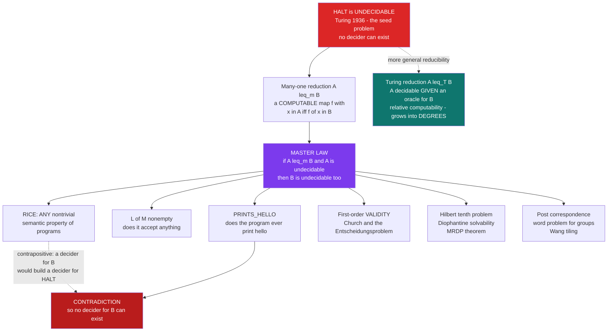

# 🕳️ Undecidability and Reducibility

> [!abstract] TL;DR
> Once you know that **one** problem is unsolvable — Turing's **halting problem** — you get an entire *zoo* of unsolvable problems almost for free. The universal tool is **reduction**: to show a new problem `B` has no algorithm, you show that *if* you could solve `B`, you could rig that solution to solve halting too. Since halting is provably unsolvable, `B` must be as well. Formally, **many-one reducibility** `A ≤_m B` is a *computable* map `f` with `x ∈ A` iff `f(x) ∈ B`; the master law is **if `A ≤_m B` and `A` is undecidable, then `B` is undecidable**. **Turing reducibility** `A ≤_T B` is the more general "`A` is decidable *given an oracle* for `B`," the notion that grows into the theory of **degrees**. The sweeping payoff is **Rice's theorem**: *every* non-trivial **semantic** property of programs — any question about the *function* or *language* a program computes, not about its syntax — is undecidable. Undecidability turns out not to be a rare pathology but the default: it reaches into arithmetic (Hilbert's 10th), group theory (the word problem), tiling, and — via Church and Gödel — into logic itself, where **no algorithm decides first-order validity or arithmetic truth**.

---

## Intuition

**Analogy — the one master key that opens every "impossible" lock.** Suppose a locksmith proves that a particular vault (call it `HALT`) can *never* be opened by any tool, present or future — it is a mathematical impossibility, not a matter of effort. Now someone hands you a different, mysterious lock `B` and asks whether *it* can be opened. You do not attack `B` directly. Instead you build a clever **adapter**: a jig that takes any dial-setting of the impossible vault, mechanically converts it into a dial-setting of `B`, in such a way that **the adapter's output opens `B` exactly when the original setting would have opened `HALT`.** If a magic key for `B` existed, you would run any `HALT` setting through the adapter, apply the magic key, and thereby open the impossible vault — which cannot happen. So the magic key for `B` cannot exist either. **The adapter is a reduction, and it launders the impossibility of `HALT` onto `B`.**

That is the whole game. Reducibility is proof by *"if you could do this ordinary-looking thing, you could do THE impossible thing."* Every new "you can't algorithmically decide this" theorem is really a construction: a computable translation `f` that carries membership questions about the halting problem into membership questions about your target. Because the halting problem sits underneath, the moment your translation is faithful, unsolvability floods in. **Rice's theorem** is the shocking discovery that this flood is almost total — pick *any* honest question about *what a program actually computes* (does it ever return `0`? does it compute a constant? does it halt on every input?), and it is undecidable. Unsolvability is not the exception hiding in a corner of computing; it is everywhere, including in the most basic questions you might ask about your own code.

---

## How It Works

### Core Mechanics

**1. The seed: halting is undecidable.** Turing's theorem (see [[The_Halting_Problem_and_Undecidability]]) fixes one hard fact: the set `HALT = { ⟨M, w⟩ : machine M halts on input w }` has **no decider** — no always-terminating algorithm answers "yes/no" correctly for every pair. Every other undecidability result in this note ultimately borrows *this* impossibility.

**2. Many-one reducibility `A ≤_m B`.** We say `A` **many-one reduces** to `B` if there is a **total computable** function `f` such that for *all* `x`,
`x ∈ A ⟺ f(x) ∈ B`.
The map `f` translates *membership questions* about `A` into membership questions about `B`, faithfully in both directions. It does **not** decide anything by itself — it only *routes* the question.

**3. The master law (why reduction spreads unsolvability).** Suppose `A ≤_m B` via `f`.
   - **Decidability flows backward.** If `B` were decidable by algorithm `D_B`, then `x ↦ D_B(f(x))` decides `A` (compute `f(x)`, ask `D_B`). So **`A ≤_m B` and `B` decidable ⟹ `A` decidable.**
   - **Undecidability flows forward.** Contrapositive: **`A ≤_m B` and `A` undecidable ⟹ `B` undecidable.**
   This is the engine. To prove a target `B` undecidable you **reduce a known-undecidable `A` (usually `HALT`) *to* `B`** — i.e. you build `HALT ≤_m B`. The direction is the classic trap: you translate the *hard* problem *into* the target, never the reverse.

**4. The reduction recipe, concretely.** Given `⟨M, w⟩`, build (by an algorithm) a new machine `M'` whose *behaviour* encodes "`M` halts on `w`." Example — `B =` "does the program ever print `hello`?": let `M'` first simulate `M` on `w`, and *only if that simulation halts* print `hello`. Then `M'` ever prints `hello` **iff** `M` halts on `w`. The map `⟨M, w⟩ ↦ M'` is computable (you are just editing source code), so `HALT ≤_m` PRINTS-HELLO, and PRINTS-HELLO is undecidable.

**5. Rice's theorem — the sledgehammer.** A property `P` of programs is **semantic** if it depends only on the *function* (or *language*) the program computes, not on its syntax — formally, `P` is an **index set**: if `M₁` and `M₂` compute the same function, they agree on `P`. `P` is **non-trivial** if *some* program has it and *some* does not. **Rice's theorem (1953): every non-trivial semantic property is undecidable.** The proof is a *single uniform reduction* from `HALT` (sketched in the Key Concepts). So "does it halt on `0`?", "does it compute a constant?", "is it total?", "does it compute the same function as this reference program?" — all undecidable, at one stroke.

**6. Turing reducibility `A ≤_T B` — the more general notion.** `A ≤_T B` means `A` is decidable by an algorithm equipped with an **oracle** for `B`: a black box that answers "is `y ∈ B`?" in one step, callable any number of times, *adaptively*. This is **relative computability**. Every `≤_m` reduction is a (very restricted) `≤_T` reduction, but `≤_T` is strictly more powerful — it may query the oracle many times and negate answers, so e.g. `B` and its complement have the *same* Turing degree even when they differ under `≤_m`. The oracle for `HALT`, written `0′` ("zero-jump"), sits strictly above the computable sets `0`, and iterating the construction builds the **Turing degrees** — a rich lattice of "levels of unsolvability."

**7. The landscape it reveals.** `HALT` is not just undecidable; it is **`≤_m`-complete for the recursively enumerable (r.e.) sets** — *every* r.e. set reduces to it, so it is the hardest problem you can still *semi-*decide. Above it stretches the **arithmetical hierarchy** (`Σ⁰₁`, `Π⁰₁`, `Σ⁰₂`, …), each level a strictly harder tier of undecidability, and reductions are exactly the maps that place problems within it.

### Flow / Architecture



*Reduction is a one-way valve for unsolvability: build a computable `f` sending `HALT` into `B`, and `B` inherits `HALT`'s impossibility. Rice's theorem shows this valve is open for **every** non-trivial semantic property. Turing reducibility generalises the valve to oracle machines, opening the door to the theory of degrees.*

---

## Key Concepts

### Secondary (intuition, no formalism)

- **The seed of impossibility** — there is one problem, the **halting problem**, that provably no algorithm can solve. Everything here builds on that single fact.
- **Reduction = the adapter trick** — to show a new problem is unsolvable, show that solving it would let you solve the halting problem. Since you can't, you can't solve the new one either.
- **Direction matters** — you translate the *known-impossible* problem *into* the new one, not the other way around. ("If I could do `B`, I could do the impossible.")
- **Rice's one-liner** — *any* honest question about *what a program computes* (not how its text looks) is unanswerable by a general algorithm. Bug-finders, loop-detectors, and equivalence-checkers can never be perfect.
- **Undecidable is not the same as merely hard** — undecidable means *no* algorithm works for all cases, ever; it is a different beast from "slow but possible."

### Undergraduate (formal computability)

- **Many-one reduction `A ≤_m B`** — a *total computable* `f` with `x ∈ A ⟺ f(x) ∈ B`. Reduces the *membership* question of `A` to that of `B`.
- **The two directions of the master law** — (i) `A ≤_m B` and `B` **decidable** ⟹ `A` decidable; equivalently (ii) `A ≤_m B` and `A` **undecidable** ⟹ `B` undecidable. Undecidability *propagates forward along the reduction*.
- **The method** — to prove `B` undecidable, exhibit `HALT ≤_m B` (or `A_TM ≤_m B` for any known-undecidable `A`). Design a computable `⟨M,w⟩ ↦ M'` so that `M' ∈ B` iff `M` halts on `w`.
- **Recognizable / r.e. / co-r.e.** — a set is **decidable** iff it and its complement are both recognizable; `HALT` is recognizable (just simulate) but its complement is not, so `HALT` is undecidable — the fingerprint pattern (see [[Decidability_and_Recognizability]]).
- **Rice's theorem (statement)** — every **non-trivial** property of the **language recognized** (equivalently, the partial function computed) by a Turing machine is undecidable. *Non-trivial* = held by some machines, not all; *semantic* = an **index set** (invariant under computing the same function).
- **Rice proof sketch** — WLOG `∅ ∉ P` (else use the complement). Fix `M_P` with `L(M_P) ∈ P`. Given `⟨M,w⟩`, build `N`: on input `y`, first run `M` on `w`; if that halts, run `M_P` on `y`. Then `L(N) = L(M_P) ∈ P` if `M` halts on `w`, else `L(N) = ∅ ∉ P`. So `⟨M,w⟩ ↦ N` is a reduction `HALT ≤_m {machines whose language has P}`.
- **Classic undecidables (all via reduction)** — the **Post Correspondence Problem**, **first-order validity** (the *Entscheidungsproblem*, Church–Turing 1936), the **word problem for groups** (Novikov–Boone), **Wang tilings** of the plane, and program-equivalence.

### Graduate (structure of the undecidable)

- **`≤_m` versus `≤_T`** — `≤_m` uses **one** oracle call and *cannot negate the answer* (`x ∈ A ⟺ f(x) ∈ B`). `≤_T` allows *adaptive, repeated* oracle queries and arbitrary post-processing. Consequences: `A ≤_T A^c` always, but `A ≤_m A^c` can fail (e.g. `HALT`). `≤_m`-degrees refine `≤_T`-**degrees**; the halting oracle `0′` is the least degree above `0`.
- **`m`-completeness, creative sets, Myhill** — `HALT` (and `A_TM`) is **`≤_m`-complete for r.e. sets**: every r.e. set `≤_m`-reduces to it. Such sets are **creative** (Post), and **Myhill's theorem** says any two `m`-complete sets are *computably isomorphic* — there is essentially **one** `m`-complete r.e. set up to renaming.
- **Index sets and Rice–Shapiro** — `P` is decidable iff it is trivial (Rice). The **Rice–Shapiro theorem** sharpens this for *recognizability*: an index set is r.e. iff membership is determined by *finite* fragments of the function's graph (a compactness/continuity condition), explaining *why* even "the machine halts on some input" is only r.e., not decidable.
- **MRDP / Hilbert's 10th** — **Matiyasevich (1970)**, building on Davis–Putnam–Robinson, proved **Diophantine = r.e.**: a set of naturals is r.e. iff it is the solution set of a polynomial equation with integer coefficients. Hence Hilbert's tenth problem — decide whether an arbitrary Diophantine equation has an integer solution — is **undecidable**, because `HALT` is r.e. and therefore Diophantine.
- **The logical wall — Church, Turing, Gödel** — first-order **validity** is undecidable (Church 1936; the negative answer to the *Entscheidungsproblem*), and **true arithmetic** `Th(ℕ, +, ×)` is not even arithmetically definable within itself (Tarski's undefinability of truth). These are the recursion-theory face of **Gödel's incompleteness**: a consistent, effectively axiomatized, sufficiently strong theory cannot be *complete*, precisely because completeness would let you *decide* `HALT` by searching proofs.
- **Turing degrees and the jump** — the **jump operator** `A ↦ A′` (the halting problem *relativized* to oracle `A`) is strictly increasing in `≤_T`; iterating yields `0, 0′, 0″, …`, aligning with the levels `Σ⁰_n` of the **arithmetical hierarchy**. **Post's problem** — is there an r.e. degree strictly between `0` and `0′`? — was answered *yes* by the **Friedberg–Muchnik priority method**, revealing an intricate degree structure.

---

## Python Demo

```python
"""
Undecidability & Reducibility: how ONE unsolvable problem (halting) infects a
whole zoo of problems via REDUCTIONS -- plus Rice's theorem, which says EVERY
nontrivial SEMANTIC property of programs is undecidable.  numpy + matplotlib.

  PART A -- a real MANY-ONE REDUCTION   HALT  <=_m  PRINTS_HELLO.
            Given <M, w>, build a program M' that simulates M on w and, the
            instant M halts, prints "hello".  Then:
                 M' ever prints "hello"   <=>   M halts on w.
            A "does-it-print-hello?" decider would therefore decide HALTING,
            which is impossible => PRINTS_HELLO is undecidable.  We VERIFY the
            biconditional on toy machines with a step-bounded interpreter.

  PART B -- RICE'S THEOREM.  We tabulate several SEMANTIC properties over sample
            programs and classify each: TRIVIAL (all-yes / all-no => decidable)
            vs NONTRIVIAL (=> undecidable by a uniform reduction from HALT).
            Then we draw (1) the reduction-spreading diagram and (2) the Rice
            "everything nontrivial is undecidable" map.
"""

import numpy as np
import matplotlib.pyplot as plt
from matplotlib.patches import FancyArrowPatch, Rectangle

# ===========================================================================
# PART A -- a genuine many-one reduction, verified on toy "machines".
# A toy machine is a generator emitting ('step',), ('print', s) or ('halt',).
# ===========================================================================
def simulate(machine, w, k):
    """Run `machine` on input w for <= k steps. Return (halted, printed_hello)."""
    printed = halted = False
    stream = machine(w)
    for _ in range(k):
        try:
            ev = next(stream)
        except StopIteration:
            halted = True
            break
        if ev[0] == 'print' and ev[1] == 'hello':
            printed = True
        if ev[0] == 'halt':
            halted = True
            break
    return halted, printed

# --- sample machines (each a generator over its computation) ----------------
def halts_fast(w):
    yield ('step',); yield ('halt',)

def loops_forever(w):
    while True:
        yield ('step',)

def halts_after(n):
    def m(w):
        for _ in range(n):
            yield ('step',)
        yield ('halt',)
    return m

# --- THE REDUCTION  f : <M,w>  ->  M'   (M' prints hello iff M halts on w) ---
def reduce_to_prints_hello(M, w):
    """Build M': replay M on w; only if M HALTS does M' print 'hello'."""
    def Mprime(_ignored):
        for ev in M(w):
            if ev[0] == 'halt':
                yield ('print', 'hello')   # reachable ONLY when M halts
                yield ('halt',)
                return
            yield ev                        # forward M's steps (honest counting)
        # if M never halts, this generator never prints 'hello'
    return Mprime

print("=" * 74)
print("PART A -- many-one reduction   HALT  <=_m  PRINTS_HELLO")
print("=" * 74)
K = 2000
cases = [("halts_fast",       halts_fast),
         ("loops_forever",    loops_forever),
         ("halts_after(50)",  halts_after(50)),
         ("halts_after(900)", halts_after(900))]
print(f"{'machine M':>18} | M halts on w? | M'=f(M,w) prints hello? | faithful?")
all_ok = True
for name, M in cases:
    m_halts, _  = simulate(M, "w", K)
    Mp = reduce_to_prints_hello(M, "w")
    _, mp_prints = simulate(Mp, "anything", K)
    ok = (m_halts == mp_prints); all_ok &= ok
    print(f"{name:>18} |     {str(m_halts):5}     |        {str(mp_prints):5}          |"
          f"   {'YES' if ok else 'NO'}")
print(f"\nBiconditional  (M' prints hello) <=> (M halts on w)  held in all cases: {all_ok}")
print("A decider for PRINTS_HELLO would thus decide HALTING -- impossible.")
print("=> PRINTS_HELLO is UNDECIDABLE.\n")

# ===========================================================================
# PART B -- Rice's theorem: nontrivial SEMANTIC properties are undecidable.
# Represent each program by the partial function it computes on inputs 0..4
# (a value, or None for 'diverges').  Properties are of the FUNCTION, not text.
# ===========================================================================
progs = {
    "const_0 (total)":    [0, 0, 0, 0, 0],
    "identity (total)":   [0, 1, 2, 3, 4],
    "halts only on 0":    [7, None, None, None, None],
    "nowhere-defined":    [None, None, None, None, None],
    "const_5 (partial)":  [5, 5, None, 5, None],
    "even->0 else loop":  [0, None, 0, None, 0],
}

def p_halts_on_0(f):  return f[0] is not None
def p_total(f):       return all(v is not None for v in f)
def p_constant(f):    d = [v for v in f if v is not None];  return len(d) > 0 and len(set(d)) == 1
def p_zero_fn(f):     return all(v == 0 for v in f)          # total zero function
def p_nonempty(f):    return any(v is not None for v in f)   # language nonempty
def p_trivial_T(f):   return True     # "computes a partial-computable fn" (all yes)
def p_trivial_F(f):   return False    # "computes a NON-computable fn"     (all no)

props = [
    ("halts on 0",            p_halts_on_0),
    ("is total",              p_total),
    ("computes a constant",   p_constant),
    ("computes zero fn",      p_zero_fn),
    ("language nonempty",     p_nonempty),
    ("partial-computable [T]", p_trivial_T),
    ("non-computable [F]",     p_trivial_F),
]

prog_names = list(progs.keys())
M = np.array([[1.0 if fn(progs[p]) else 0.0 for p in prog_names] for _, fn in props])
# a property is TRIVIAL (hence DECIDABLE) iff it is constant across programs
trivial = np.array([row.min() == row.max() for row in M])   # True => decidable

print("=" * 74)
print("PART B -- Rice's theorem map (does program satisfy property?)")
print("=" * 74)
print("property".ljust(24) + "| " + " ".join(f"{p[:6]:>6}" for p in prog_names) + " | verdict")
for i, (pname, _) in enumerate(props):
    row = " ".join(f"{'  yes' if v else '   no':>6}" for v in M[i])
    verdict = "DECIDABLE (trivial)" if trivial[i] else "UNDECIDABLE (Rice)"
    print(f"{pname.ljust(24)}| {row} | {verdict}")
print("\nEvery NONTRIVIAL semantic property above is undecidable -- one uniform")
print("reduction from HALT proves them ALL at once (Rice 1953).\n")

# ===========================================================================
# Visualisation: (1) reduction-spreading diagram, (2) Rice undecidability map.
# ===========================================================================
fig, (ax1, ax2) = plt.subplots(1, 2, figsize=(15.5, 6.8))

# ---- (1) undecidability spreads OUTWARD from HALT via <=_m -----------------
targets = ["PRINTS_HELLO", "L(M) nonempty", 'Rice: "is total?"',
           "Post Corr.\n(PCP)", "Hilbert's 10th\n(Diophantine)",
           "FO validity\n(Entscheid.)", "Word problem\n(groups)", "Tiling\n(Wang)"]
ang = np.linspace(0, 2 * np.pi, len(targets), endpoint=False) + np.pi / 2
xs, ys = np.cos(ang), np.sin(ang)
for x, y in zip(xs, ys):
    ax1.add_patch(FancyArrowPatch((0, 0), (0.72 * x, 0.72 * y), arrowstyle="-|>",
                                  mutation_scale=15, color="#334155", lw=1.5, zorder=2))
ax1.scatter([0], [0], s=5200, color="#dc2626", zorder=3)
ax1.annotate("HALT\nundecidable\nSEED", (0, 0), ha="center", va="center",
             color="white", fontsize=9.5, fontweight="bold", zorder=4)
ax1.scatter(xs, ys, s=2600, color="#1d4ed8", zorder=3, alpha=0.92)
for x, y, t in zip(xs, ys, targets):
    ax1.annotate(t, (x, y), ha="center", va="center", color="white",
                 fontsize=7.2, zorder=4)
ax1.annotate(r"$\leq_m$", (0.40 * xs[0], 0.40 * ys[0] + 0.06),
             fontsize=13, color="#111827", zorder=5)
ax1.set_xlim(-1.7, 1.7); ax1.set_ylim(-1.7, 1.7); ax1.axis("off")
ax1.set_title("Undecidability spreads by reduction FROM halting\n"
              r"$\mathrm{HALT}\ \leq_m\ X \;\Rightarrow\; X$ is undecidable", fontsize=11)

# ---- (2) Rice map: nontrivial rows = undecidable --------------------------
im = ax2.imshow(M, cmap="Greys", vmin=0, vmax=1, aspect="auto")
ax2.set_xticks(range(len(prog_names)))
ax2.set_xticklabels(prog_names, rotation=32, ha="right", fontsize=7)
ax2.set_yticks(range(len(props)))
ax2.set_yticklabels([p[0] for p in props], fontsize=8)
ax2.set_xlim(-2.4, len(prog_names) - 0.5)
for i, triv in enumerate(trivial):
    ax2.add_patch(Rectangle((-2.2, i - 0.5), 0.7, 1.0,
                            color="#16a34a" if triv else "#dc2626", clip_on=False))
ax2.annotate("green = DECIDABLE (trivial)\nred = UNDECIDABLE (nontrivial, Rice)",
             (-2.2, len(props) - 0.15), fontsize=7.5, va="top")
ax2.set_title("Rice's theorem: EVERY nontrivial semantic property is undecidable\n"
              "(black cell = program has the property)", fontsize=10)

plt.tight_layout()
plt.savefig("undecidability_and_reducibility.png", dpi=130)
print("Saved reduction-diagram / Rice-map figure to undecidability_and_reducibility.png")
```

Part A builds an actual reduction: `reduce_to_prints_hello` edits any machine `M` into `M'` that prints `hello` *only* upon `M`'s halting, and the printout verifies the biconditional "`M'` prints `hello` ⟺ `M` halts" on every toy machine (halting and looping alike) — so a `PRINTS-HELLO` decider would decide halting, which is impossible. Part B evaluates seven properties of the *function computed* over six sample programs, mechanically detecting which are **trivial** (constant across all programs → decidable) versus **non-trivial** (→ undecidable by Rice): all five genuine semantic properties land in the undecidable class. The left plot shows unsolvability radiating out of `HALT` along `≤_m` arrows to the classic zoo (PCP, Hilbert's 10th, first-order validity, the word problem, tiling); the right plot is the Rice "undecidability map," a property-by-program grid with each property tagged decidable (green) or undecidable (red).

---

## Real-World Applications

> **Example — static analysers and linters are Rice's theorem made industrial.** A tool that could decide "does this program ever dereference null / divide by zero / reach this dead branch / leak this secret?" would be deciding a **non-trivial semantic property**, which Rice's theorem forbids. That is *why* Coverity, the Clang static analyzer, Infer, SonarQube, and ESLint are all **sound-but-incomplete or unsound-but-useful**: they over- or under-approximate via abstract interpretation and dataflow, deliberately accepting false positives or false negatives because a perfect, always-terminating verdict is provably unattainable (see [[Control_Flow_and_Data_Flow_Analysis]] and [[SAST_Static_Analysis]]).

Where reduction-based undecidability bites in practice:
- **Program verification and termination proving** — proving arbitrary code terminates is `HALT` in disguise, so provers restrict the input: totality checkers in **Coq**, **Agda**, **Lean**, and Microsoft's **Terminator** only accept recursion they can *prove* well-founded, rejecting some perfectly-terminating programs to stay sound (adjacent to [[Formal_Verification_TLA_Plus]]).
- **Compiler optimization** — "is this branch dead?", "do these two expressions always compute the same value?", "is this pointer aliased?" are undecidable in general (Rice), so compilers use *conservative* dataflow rather than exact answers; the trade is precision for guaranteed termination.
- **Malware and vulnerability detection** — "will this binary ever behave maliciously?" is undecidable, which is precisely *why* antivirus relies on signatures, heuristics, and sandboxed behavioural monitoring rather than a provably complete analyzer.
- **Type systems and language design** — type inference/checking in sufficiently expressive systems (certain dependent or higher-rank features) is undecidable, so designers either restrict to a **decidable fragment** or demand annotations. Choosing decidability is a deliberate reduction-avoidance strategy.
- **The decidable-fragment strategy** — model checkers, SMT solvers, and database query engines succeed by staying inside carefully chosen **decidable** theories (finite-state systems, Presburger/linear arithmetic, real-closed fields), trading Turing-completeness for the ability to answer at all — the mirror image of this note (see [[Quantifier_Elimination_and_Decidability]]).

---

## Common Pitfalls

- **Confusing many-one `≤_m` with Turing `≤_T`.** `≤_m` makes **one** oracle call and reports its answer *unmodified* (`x ∈ A ⟺ f(x) ∈ B`); `≤_T` may query the oracle **many times, adaptively, and negate** the results. Consequence: a set and its complement always have the same *Turing* degree, but need not be `≤_m`-interreducible (`HALT` is the standard counterexample). Using `≤_m` where the argument really needs `≤_T` (or vice versa) breaks proofs — complementation, in particular, is *not* available under `≤_m`.
- **Thinking Rice's theorem covers *syntactic* properties.** Rice applies only to **semantic** properties — index sets invariant under "computes the same function." Syntactic questions ("does the source contain a `while` loop?", "does the program have fewer than 100 lines?", "does it use `goto`?") are perfectly **decidable**: you just read the text. Rice says nothing about them. The property must depend on *behaviour*, not *form*.
- **Reducing in the wrong direction.** To prove `B` undecidable you must show **`HALT ≤_m B`** (translate the *known-hard* problem *into* `B`). Building `B ≤_m HALT` proves the *opposite* useless thing (that `B` is *no harder* than `HALT`). The slogan is *"reduce FROM the hard problem TO your target"*; getting the arrow backwards is the single most common reduction error.
- **Equating "undecidable" with "hard in practice."** Undecidability is orthogonal to complexity. Undecidable problems have **no** algorithm for the general case, yet countless *specific* instances are trivial (we prove particular programs halt all day). Conversely, **NP-hard** problems *have* algorithms — just slow ones. `SAT` is decidable-but-hard; `HALT` is not decidable at all. Never say "undecidable, therefore intractable" or "intractable, therefore undecidable."
- **Assuming undecidability means *no* partial information.** Many undecidable sets are still **recognizable (r.e.)** — `HALT` itself is semi-decidable by simulation; you just can never certify the "no" side. Tools exploit exactly this one-sided information (run longer, catch more halts) without ever achieving a total decider.
- **Forgetting the model.** Undecidability assumes a **Turing-complete** model. Genuinely finite-state systems and total (non-Turing-complete) DSLs have a *decidable* halting/analysis problem — which is why bounded model checking and terminating configuration languages work.

---

## Related Concepts

- [[The_Halting_Problem_and_Undecidability]] — the **seed**: the one undecidability result every reduction in this note ultimately borrows from.
- [[Reductions_and_Undecidable_Problems]] — the Theory-of-Computation companion to this note; same mapping/reduction machinery, framed for the `A_TM`/`HALT_TM` languages rather than recursion-theoretic degrees.
- [[Decidability_and_Recognizability]] — the decidable / recognizable (r.e.) / co-r.e. classes that reductions move problems *between*; `HALT` is the canonical recognizable-but-not-decidable set.
- [[Turing_Machines_and_the_Church_Turing_Thesis]] — the machine model whose *programs* Rice's theorem quantifies over, and the thesis that makes "undecidable" model-independent.
- [[Quantifier_Elimination_and_Decidability]] — the **mirror image**: constructive routes to *decidability*; the boundary where adding multiplication to Presburger arithmetic flips a decidable theory into an undecidable one is exactly a reduction from `HALT`.
- [[First_Order_Predicate_Logic]] — the language whose **validity** problem Church proved undecidable (the *Entscheidungsproblem*), the logical face of reduction.
- [[Number_Theory_Elementary]] — Diophantine equations, whose general solvability (Hilbert's 10th) is undecidable by the **MRDP theorem** ("Diophantine = r.e.").
- [[Reductions_and_NP_Complete_Problems]] — the **complexity-theoretic** analogue: polynomial-time many-one reductions and `NP`-completeness reuse the *exact* reduction template one resource-bound lower.
- [[NP_Completeness_and_the_Cook_Levin_Theorem]] — `SAT` is `≤_p`-complete for `NP` just as `HALT` is `≤_m`-complete for r.e. sets; same "hardest problem in a class" idea, decidable version.
- [[Control_Flow_and_Data_Flow_Analysis]] — where Rice's theorem forces compilers into *conservative* rather than *exact* analysis.
- [[SAST_Static_Analysis]] — security static analysis as a real-world sound-but-incomplete approximation to undecidable semantic questions.
- [[Formal_Verification_TLA_Plus]] — verification working inside decidable fragments precisely to dodge the undecidability wall.
- [[Logic_and_Proof_Techniques]] — proof by contradiction and reduction, the deductive shape of every argument here.
- [[Mathematical_Logic_Overview]] — the vault entry point; this note is the **recursion-theory** pillar, dual to the model-theory (decidability) pillar.

*Prose-only siblings not yet in the vault: **Computability_and_Recursion_Theory** (the section overview — defining r.e./recursive sets and the Kleene normal form beneath these reductions), **The_Arithmetical_Hierarchy** (`Σ⁰_n`/`Π⁰_n`, the tiers of undecidability that reductions place problems within), **Turing_Degrees_and_the_Priority_Method** (where `≤_T`, the jump, and Post's problem live), and **Godels_Incompleteness_Theorems** (the provability-side twin of undecidability, obtained by reducing `HALT` to proof-search).*

---

## Review Questions

### Secondary

1. Explain the "adapter" idea in your own words: if opening one vault is proven impossible, how does building an adapter show that a *second* lock is also impossible to open? Which real problem plays the role of the impossible vault?
2. Rice's theorem says any honest question about *what a program computes* is unanswerable by a general algorithm. Give three such questions about your own code, and one question that is *not* covered by Rice because it is about the *text* rather than the behaviour.
3. Why does "undecidable" **not** mean "we just haven't found the algorithm yet," and why does it **not** mean "impossible to solve for any individual case"?

### Undergraduate

1. Define many-one reducibility `A ≤_m B` precisely. State and prove both directions of the master law (decidability flows backward, undecidability flows forward). Which direction do you use to prove a *new* problem undecidable, and in which direction must the reduction point?
2. Give an explicit reduction `HALT ≤_m` PRINTS-HELLO by describing the computable map `⟨M,w⟩ ↦ M'`. Prove `M' ∈` PRINTS-HELLO iff `⟨M,w⟩ ∈ HALT`, and explain why that makes PRINTS-HELLO undecidable.
3. State Rice's theorem, defining *non-trivial* and *semantic* (index set). Use the uniform reduction (fix `M_P` with `L(M_P) ∈ P`; on input `y`, run `M` on `w` then `M_P` on `y`) to show "the machine's language has property `P`" is undecidable. Where is non-triviality used?

### Graduate

1. Contrast `≤_m` and `≤_T`. Show `A ≤_T A^c` for every `A`, and explain why `HALT ≤_m HALT^c` fails (consider recognizability). What does this reveal about the difference between `m`-degrees and Turing degrees, and where does the jump `0′` sit?
2. State the **MRDP theorem** and derive the undecidability of Hilbert's tenth problem from it, using the fact that `HALT` is r.e. Then explain how first-order **validity** being undecidable (Church) and **Gödel's first incompleteness theorem** are two faces of the same reduction from `HALT` to proof-search.
3. A colleague claims their new analyzer detects *all* infinite loops with zero false positives and always terminates. Using Rice's theorem, prove that at most two of {sound, complete, always-terminating} can hold, and identify which property they are secretly abandoning. Then connect this to why `HALT` is `≤_m`-complete for r.e. sets (Myhill) — is their problem *strictly easier* than halting?

---

## Sources

- Rice, H. G. (1953). "Classes of Recursively Enumerable Sets and Their Decision Problems." *Transactions of the American Mathematical Society*, 74(2), 358–366. — the original Rice's theorem.
- Rogers, H. (1967). *Theory of Recursive Functions and Effective Computability*. McGraw-Hill. — the classic recursion-theory reference for `≤_m`, `≤_T`, index sets, creative sets, and Myhill's theorem.
- Sipser, M. (2013). *Introduction to the Theory of Computation* (3rd ed.), Chapter 5 ("Reducibility"). Cengage. — the standard undergraduate treatment of mapping reductions and Rice's theorem.
- Soare, R. I. (2016). *Turing Computability: Theory and Applications*. Springer. — modern account of reducibilities, the Turing degrees, the jump, and the priority method.
- Matiyasevich, Y. (1993). *Hilbert's Tenth Problem*. MIT Press. — the full MRDP theorem: Diophantine sets are exactly the recursively enumerable sets.

---

#mathematical-logic #undecidability #reducibility #rices-theorem #halting-problem
