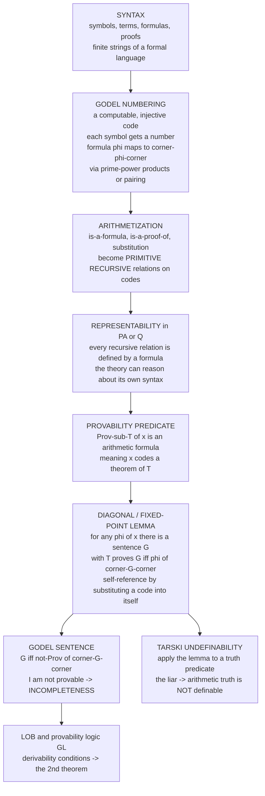

# 🔢 Arithmetization of Syntax and Diagonalization

> [!abstract] TL;DR
> **Arithmetization** is the trick that let a theory of *numbers* become a theory of *itself*. Gödel assigned every symbol, formula, and proof a unique natural number — the **Gödel number** `⌜φ⌝`, computed by a simple computable, injective code (prime-power products `2^a·3^b·5^c…` or a pairing function). Once syntax is coded as arithmetic, the messy syntactic notions — *"`x` is a formula"*, *"`p` is a proof of `x`"*, *"substitute a numeral into a formula"* — turn into ordinary **primitive recursive** relations on numbers, and (because every recursive relation is **representable** in Peano Arithmetic / Robinson's Q) into honest arithmetic **formulas**. In particular the **provability predicate** `Prov_T(x)` ("`x` codes a theorem of `T`", Gödel's *Bew*) is just an arithmetic statement about a number. The payoff is the **Diagonal / Fixed-Point Lemma**: for *any* formula `φ(x)` there is a sentence `G` with `T ⊢ G ↔ φ(⌜G⌝)` — self-reference made rigorous by substituting a formula's own code into itself. Feed it `φ(x) := ¬Prov_T(x)` and you get the **Gödel sentence** `G ↔ ¬Prov_T(⌜G⌝)` ("I am not provable" → incompleteness). Feed it a putative truth predicate and you get **Tarski's undefinability of truth** (arithmetic truth is not arithmetically definable). This is the technical machine room beneath both incompleteness theorems, Löb's theorem, and the computational cousin: **quines** and Kleene's recursion theorem.

---

## Intuition

**Analogy — the library that catalogues its own catalogue.** Imagine every sentence ever written is stamped with a unique **barcode** — a single number that encodes, character by character, exactly what the sentence says. Now the astonishing move: because the barcodes are themselves *numbers*, an ordinary statement *about numbers* ("this number is even", "this number is a product of these primes") is secretly also a statement *about the sentences those numbers encode*. A theory whose whole subject is arithmetic suddenly finds it can talk about grammar, about proofs, about **itself** — all disguised as innocent number theory. Gödel's masterstroke was building exactly this barcode system for the language of arithmetic.

Once mathematics can *refer to* its own formulas by their barcodes, you can play the oldest self-reference game there is — the game of *"this sentence is false."* Take a property like *"the sentence with barcode `n` is not provable"*, and cleverly choose an `n` that is the barcode *of that very sentence*. The result is a perfectly precise arithmetic sentence that, decoded, declares **"I am not provable."** No infinite regress, no hand-waving: it does not literally contain itself, it contains its own *number*, and a substitution function (also arithmetic) closes the loop. Arithmetization is the coding; **diagonalization** is the self-reference trick; together they are the entire engine behind Gödel's incompleteness and Tarski's undefinability of truth.

---

## How It Works

### Core Mechanics

**1. Fix a formal language and a proof system.** Start with a first-order theory strong enough to do a little arithmetic — **Peano Arithmetic (PA)** or even the weak finitely-axiomatized **Robinson arithmetic Q**. Its syntax is finite strings over a fixed alphabet (`0`, `S`, `+`, `·`, `=`, connectives, quantifiers, variables). A **proof** is a finite *sequence* of formulas, each an axiom or following from earlier ones by a rule. Everything in sight is a finite combinatorial object.

**2. Gödel-number the syntax (the coding).** Assign each **symbol** a positive integer code. Encode a **formula** `s₀ s₁ … s_{n-1}` as one number — Gödel's original choice was the **prime-power product** `2^{s₀} · 3^{s₁} · 5^{s₂} · ⋯ · p_{n-1}^{s_{n-1}}`, whose **unique factorization** (see [[Number_Theory_Elementary]]) makes decoding unambiguous. Encode a **proof** (a sequence of formulas) the same way, one layer up. Write `⌜φ⌝` for the code of `φ`. The map is **computable and injective**: you can mechanically go from syntax to number and back. *Any* such coding works — primes, or a **pairing function** — only computability and injectivity matter.

**3. Arithmetize the syntactic relations (the real work).** Now the crucial theorem: the key syntactic predicates, viewed as relations on **codes**, are **primitive recursive** (see [[Primitive_Recursive_and_Mu_Recursive_Functions]]):
   - `Term(x)`, `Formula(x)`, `Sentence(x)` — "`x` codes a well-formed …";
   - `Sub(f, v, t)` — the code of the formula obtained by substituting term-code `t` for variable `v` in formula-code `f`;
   - `Axiom(x)`, and the rule relations;
   - `Proof_T(p, x)` — "`p` codes a *proof in `T`* of the sentence coded by `x`."
   Checking these is pure bounded computation over the factorization of the code, so each is primitive recursive. This step — verifying that *"is a proof of"* is a genuine recursive relation — is the technical heart of the whole enterprise.

**4. Represent them inside the theory (representability).** A recursive relation `R` is **representable** in `T` if there is a *formula* `ρ(x)` such that `T ⊢ ρ(⌜n⌝)` when `R(n)` holds and `T ⊢ ¬ρ(⌜n⌝)` when it fails. The **representability theorem**: *every recursive relation is representable in Q (hence in PA).* So the primitive recursive `Proof_T` becomes an actual arithmetic formula the theory can prove things about, and the **provability predicate**
   `Prov_T(x) := ∃p. Proof_T(p, x)`  (Gödel's *Bew*, "beweisbar")
is an honest, if only `Σ₁`, arithmetic formula meaning "`x` codes a theorem of `T`."

**5. The Diagonal / Fixed-Point Lemma (self-reference made rigorous).** Because substitution is representable, one can prove:
   > For every formula `φ(x)` with one free variable, there is a sentence `G` such that `T ⊢ G ↔ φ(⌜G⌝)`.
   The construction is **constructive** and is *diagonalization*: define the diagonal function `diag(m)` = the code of "substitute the numeral of `m` into the formula coded by `m`". Take `B(x) := φ(diag(x))`, let `b = ⌜B⌝`, and set `G := B(b)`. Then `⌜G⌝ = diag(b)`, so `G ↔ φ(diag(b)) ↔ φ(⌜G⌝)`. The sentence names its own code by *construction*, not by magic — the generalization of *"this sentence"* to a theorem.

**6. Cash it out.**
   - `φ(x) := ¬Prov_T(x)` ⟹ the **Gödel sentence** `G ↔ ¬Prov_T(⌜G⌝)` — *"I am unprovable."* If `T` is consistent, `G` is unprovable (else `T` proves a falsehood); if `T` is `ω`-consistent, `¬G` is unprovable too — **first incompleteness**.
   - `φ(x) := Prov_T(x)` ⟹ Henkin's sentence, resolved by **Löb's theorem**: `T ⊢ Prov_T(⌜A⌝) → A` *only if* `T ⊢ A`. Löb needs the **Hilbert–Bernays–Löb derivability conditions**, and abstracts into the modal **provability logic GL**.
   - `φ(x) := ¬True(x)` for a *supposed* truth predicate ⟹ a **liar** sentence `L ↔ ¬True(⌜L⌝)` — a contradiction, so no arithmetic truth predicate can exist: **Tarski's undefinability of truth**.

**7. The computational twin.** Diagonalization is exactly **Kleene's recursion (fixed-point) theorem** and the **quine** phenomenon: a program can obtain and reason about its own source code. Undecidability of the **halting problem** (see [[The_Halting_Problem_and_Undecidability]]) is the same self-reference one floor down — decidability instead of provability.

### Flow / Architecture



*Syntax is coded into numbers; the syntactic relations become primitive recursive; representability injects them back into the theory as formulas; the diagonal lemma then manufactures a self-referential sentence, which — depending on which formula you feed it — yields incompleteness, undefinability of truth, or Löb's theorem.*

---

## Key Concepts

### Secondary (intuition, no formalism)

- **Barcode for sentences** — give every formula and every proof a unique number so that statements about numbers can secretly be statements about sentences.
- **Talking about yourself with numbers** — because sentences have numbers, a sentence can refer to *"the sentence numbered `n`"*; choose `n` to be its own number and it refers to itself.
- **"I am not provable"** — the constructed self-referential sentence; if the system is honest it can neither prove nor disprove it. That gap *is* incompleteness.
- **Truth vs proof** — you can build a formula meaning "provable", but you provably *cannot* build one meaning "true"; truth needs a bigger language to talk about it.

### Undergraduate (a first course in logic)

- **Gödel numbering** `⌜·⌝` — a computable injection from expressions to `ℕ`, e.g. prime-power `2^{s₀}3^{s₁}⋯`; decoding uses **unique factorization**.
- **Arithmetization** — `Formula(x)`, `Sub(f,v,t)`, `Proof_T(p,x)` are **primitive recursive** relations on codes; `Prov_T(x) := ∃p\,Proof_T(p,x)` is `Σ₁`.
- **Representability** — every recursive relation is representable (defined by a formula, with the theory proving the right instances) already in **Robinson's Q**; strong enough that the theory reasons about its own syntax.
- **Diagonal / Fixed-Point Lemma** — for each `φ(x)` there is `G` with `T ⊢ G ↔ φ(⌜G⌝)`; the proof is a substitution/diagonal construction (`B(x):=φ(diag(x))`, `G:=B(⌜B⌝)`).
- **Gödel sentence** — `G ↔ ¬Prov_T(⌜G⌝)`; consistency ⟹ `G` unprovable, `ω`-consistency ⟹ `¬G` unprovable (Rosser's trick removes the `ω`-consistency assumption).
- **`Σ₁`-completeness** — `T` proves all true `Σ₁` sentences, which is *why* `Prov_T` behaves well and the Gödel sentence is (from outside) *true* but unprovable.

### Graduate (structure and refinements)

- **Hilbert–Bernays–Löb derivability conditions** — (D1) `T⊢A ⟹ T⊢Prov(⌜A⌝)`, (D2) `T⊢Prov(⌜A→B⌝)→(Prov(⌜A⌝)→Prov(⌜B⌝))`, (D3) `T⊢Prov(⌜A⌝)→Prov(⌜Prov(⌜A⌝)⌝)`; these, plus the fixed-point lemma, give the **second incompleteness theorem** `T ⊬ Con_T` and **Löb's theorem**.
- **Provability logic GL** — the modal logic of `□A := Prov(⌜A⌝)` with the **Gödel–Löb axiom** `□(□A→A)→□A`; **Solovay's arithmetical completeness** (1976) says GL captures exactly the schematic provability facts of PA.
- **Tarski's undefinability of truth** — the set of (codes of) true arithmetic sentences is **not arithmetically definable**; the diagonal lemma applied to a hypothetical `True(x)` yields the liar. Contrast with `Prov_T`, which *is* definable but incomplete — the truth/provability gap.
- **Intensionality & the Feferman critique** — `Con_T` depends on *how* you formalize "provable"; different but extensionally-equal provability predicates can behave differently for the second theorem (Feferman 1960).
- **Kleene's recursion theorem / quines** — the computational face: `∃e\,φ_e = φ_{f(e)}`; the same diagonal argument gives Rice's theorem and the undecidability of the halting problem.
- **Strengthenings** — the **arithmetical hierarchy** placement (`Prov_T` is `Σ₁`, `¬Prov_T(⌜G⌝)` is `Π₁`, arithmetic truth is `Δ_{n}` at no finite level); Rosser sentences; concrete independent statements (Goodstein, Paris–Harrington) that need the machinery indirectly.

---

## Python Demo

```python
# ==============================================================================
# ARITHMETIZATION OF SYNTAX & DIAGONALIZATION -- made concrete and runnable.
# numpy + matplotlib only.
#
# PART A: GODEL NUMBERING of a tiny formal language via PRIME-POWER products.
#         symbols -> codes, a FORMULA (sequence of symbols) -> one number, and a
#         PROOF (sequence of formulas) -> one number; DECODE everything back.
#         This is the bijective coding of SYNTAX into ARITHMETIC.
#
# PART B: the DIAGONAL / FIXED-POINT construction. We realize the substitution
#         function diag(.) on codes and build the Godel sentence G whose OWN code
#         appears inside it:  G  <->  ~Prov(<G>).  The computational analog is a
#         QUINE -- a program that prints its own source. Both are self-reference
#         by substituting a description into itself.
#
# PART C: plots -- Godel-number growth for two codings (encode/decode verified),
#         and the fixed point diag(<B>) == <G>.
# ==============================================================================

import numpy as np
import matplotlib.pyplot as plt
import math

# ---- prime "slots" for the prime-power coding --------------------------------
def primes_upto(limit):
    sieve = np.ones(limit + 1, dtype=bool)
    sieve[:2] = False
    for p in range(2, int(limit ** 0.5) + 1):
        if sieve[p]:
            sieve[p * p::p] = False
    return np.nonzero(sieve)[0].tolist()

PRIMES = primes_upto(2000)                    # 303 primes -- ample for short syntax

# ==============================================================================
# PART A -- GODEL NUMBERING via PRIME-POWER products (formula layer)
# ==============================================================================
ALPHABET = {"0": 1, "S": 2, "+": 3, "*": 4, "=": 5, "(": 6, ")": 7,
            "~": 8, "&": 9, ">": 10, "A": 11, "E": 12, "x": 13, "P": 14}
REV = {v: k for k, v in ALPHABET.items()}

def encode_seq(codes):
    """Godel code of a sequence of POSITIVE integers:  prod_i PRIMES[i]**code_i."""
    g = 1
    for i, c in enumerate(codes):
        g *= PRIMES[i] ** int(c)
    return g

def decode_seq(g):
    """Invert encode_seq by reading the exponent of PRIMES[0], PRIMES[1], ..."""
    out, i = [], 0
    while g > 1:
        p, e = PRIMES[i], 0
        while g % p == 0:
            g //= p
            e += 1
        out.append(e)
        i += 1
    return out

def godel_formula(sym):  return encode_seq([ALPHABET[c] for c in sym])
def ungodel_formula(g):  return "".join(REV[e] for e in decode_seq(g))

# ---- Cantor pairing -> injective encoding of a SEQUENCE (the proof layer) -----
#   Prime-power super-encoding of proofs is astronomically large, so we use a
#   pairing-based list code here -- "many coding schemes work" (a key pitfall).
def pair(a, b):
    s = a + b
    return s * (s + 1) // 2 + b

def unpair(z):
    w = (math.isqrt(8 * z + 1) - 1) // 2
    b = z - w * (w + 1) // 2
    return w - b, b

def encode_list(xs):
    code = 0
    for x in reversed(xs):
        code = pair(x, code) + 1
    return code

def decode_list(code):
    xs = []
    while code != 0:
        a, rest = unpair(code - 1)
        xs.append(a)
        code = rest
    return xs

print("=" * 72)
print("PART A -- Godel numbering of a tiny formal language")
print("=" * 72)
phi = "~Px"                                    # schematically: 'x is not provable'
gphi = godel_formula(phi)
print(f"  formula {phi!r}: symbol codes {[ALPHABET[c] for c in phi]}  ->  <phi> = {gphi}")
print(f"  decode(<phi>) = {ungodel_formula(gphi)!r}   round-trip "
      f"{'OK' if ungodel_formula(gphi) == phi else 'FAIL'}")

proof = ["x=x", "Sx=Sx", "~Px"]                # a 3-line 'proof' (illustrative)
lines = [godel_formula(f) for f in proof]
gproof = encode_list(lines)
back = [ungodel_formula(c) for c in decode_list(gproof)]
print(f"\n  proof (list of formulas) : {proof}")
print(f"  per-line Godel codes     : {lines}")
print(f"  <proof> has {len(str(gproof))} decimal digits; "
      f"decode -> {back}   {'OK' if back == proof else 'FAIL'}")

# ==============================================================================
# PART B -- the DIAGONAL / FIXED-POINT construction
# ==============================================================================
print("\n" + "=" * 72)
print("PART B -- the diagonal lemma builds a self-referential sentence")
print("=" * 72)

# A COMPACT base-128 coding. Any computable injective coding works; primes blow
# up once we substitute a big numeral, so we use a compact one to keep it on screen.
BASE = 128
def godel_str(s):
    g = 0
    for ch in reversed(s):
        g = g * BASE + (ord(ch) + 1)           # +1 -> no zero digit -> length recoverable
    return g

def ungodel_str(g):
    out = []
    while g > 0:
        g, r = divmod(g, BASE)
        out.append(chr(r - 1))
    return "".join(out)

# B(#): a formula with a free slot '#', asserting 'diag(#) is not provable'.
template = "~Prov(diag(#))"
b = godel_str(template)                          # <B> = code of the template

def diag(m):
    """diag(m) = code of the formula obtained by substituting the NUMERAL of m
       for the free slot in the formula coded by m -- the diagonalization step."""
    return godel_str(ungodel_str(m).replace("#", str(m)))

G_str = template.replace("#", str(b))            # the Godel sentence text  B(<B>)
g = godel_str(G_str)                             # <G>

print(f"  template B(#)     : {template!r}")
print(f"  <B>               : {b}")
print(f"  Godel sentence G  : {G_str!r}")
print(f"  <G>               : {g}")
print(f"  diag(<B>) == <G>  : {diag(b) == g}"
      f"    <-- FIXED POINT:  G  <->  ~Prov(<G>)")
print("  Reading G: it asserts that diag(<B>) = <G> is NOT provable, i.e.")
print("  G says 'my own code is not provable' -- self-reference, no regress.")

# ---- computational twin: a QUINE (a program that prints its own source) ------
template_q = "s = {!r}\nprint(s.format(s))"
printed = template_q.format(template_q)
source = "s = " + repr(template_q) + "\n" + "print(s.format(s))"
print(f"\n  QUINE (Kleene recursion theorem, in code) reproduces its own source: "
      f"{printed == source}")

# ==============================================================================
# PART C -- visualization
# ==============================================================================
formula = "Ax(Px>0=0)"                           # all symbols live in ALPHABET
lengths = np.arange(1, len(formula) + 1)
prime_digits = [len(str(godel_formula(formula[:k]))) for k in lengths]
base_digits = [len(str(godel_str(formula[:k]))) for k in lengths]

fig, (axL, axR) = plt.subplots(1, 2, figsize=(13.5, 5.2))

# (left) SYNTAX -> NUMBER: two injective codings, both decodable.
axL.plot(lengths, prime_digits, "o-", color="#c0392b", lw=2,
         label="prime-power  2^a 3^b 5^c ...")
axL.plot(lengths, base_digits, "s-", color="#2563eb", lw=2,
         label="compact base-k coding")
axL.set_xlabel("length of the formula prefix (number of symbols)")
axL.set_ylabel("digits in the Godel number")
axL.set_title("Syntax -> Number: computable injective codings\n"
              "(decode reconstructs the formula exactly)")
axL.legend(fontsize=9, loc="upper left")
axL.grid(alpha=0.3)

# (right) the diagonal fixed point:  diag(<B>) equals <G>.
labels = ["<B>\ncode of B(#)", "diag(<B>)", "<G>\ncode of G"]
vals = [len(str(b)), len(str(diag(b))), len(str(g))]
colors = ["#7c3aed", "#16a34a", "#16a34a"]
bars = axR.bar(labels, vals, color=colors, edgecolor="black")
axR.set_ylabel("digits in the code")
axR.set_title("Diagonal lemma:  diag(<B>) == <G>\n"
              "G asserts '<G> is not provable'  (self-reference)")
for bar, v in zip(bars, vals):
    axR.text(bar.get_x() + bar.get_width() / 2, v + 0.6, str(v), ha="center", fontsize=10)
axR.annotate("equal -> FIXED POINT", xy=(2, vals[2]),
             xytext=(0.75, vals[2] + max(vals) * 0.18 + 2),
             arrowprops=dict(arrowstyle="->", color="#16a34a"),
             color="#16a34a", fontsize=10)
axR.set_ylim(0, max(vals) * 1.35 + 3)

fig.suptitle("Arithmetization of syntax + the diagonal lemma: "
             "coding turns a theory of numbers into a theory of itself",
             fontsize=12, y=1.02)
plt.tight_layout()
plt.savefig("arithmetization_and_diagonalization.png", dpi=130)
print("\nSaved figure -> arithmetization_and_diagonalization.png")
```

Running it first shows the **coding is genuinely bijective**: the formula `~Px` maps to a Gödel number and decodes back exactly, and a three-line "proof" (a *sequence* of formulas) is super-encoded into a single number and unpacked losslessly — syntax living inside arithmetic. Part B then executes the **diagonal construction** on real codes: it builds `B(#) := ¬Prov(diag(#))`, computes `b = ⌜B⌝`, forms the Gödel sentence `G = B(b)` by substituting `b`'s numeral into `B`, and verifies `diag(⌜B⌝) == ⌜G⌝` — so `G` provably asserts *"⌜G⌝ is not provable,"* a fixed point with no infinite regress. The accompanying **quine** shows the same self-reference in code (the program reproduces its own source, Kleene's recursion theorem in miniature). The left plot contrasts two valid codings (prime-power balloons, the compact base-`k` code stays linear) while both remain exactly decodable; the right plot shows the two bars `diag(⌜B⌝)` and `⌜G⌝` at identical height — the diagonal lemma's fixed point made visible.

---

## Real-World Applications

> **Example — Lisp's `eval`, quines, and self-replicating code are Gödel numbering in the wild.** The moment a system can treat its own *programs (or formulas) as data* — Lisp's homoiconic `(quote …)`/`eval`, Python's `repr`/`exec`, a compiler that compiles its own source — you have arithmetization: syntax encoded as manipulable values. Kleene's **recursion theorem** (the computability twin of the diagonal lemma) is precisely why a **quine**, a self-reproducing program, and even a self-replicating computer virus are possible; each obtains and copies its own description via the same substitution-into-itself move that builds `G`.

- **Proof assistants and reflection** — Coq, Lean, Isabelle, and Agda routinely *reify* their own syntax as datatypes and prove meta-theorems about it (proof-by-reflection, verified metatheory). Formalizing Gödel's theorems themselves (Paulson's Isabelle proof, the Lean/Coq incompleteness developments) *is* arithmetization done in machine-checked detail.
- **Limits of automated reasoning** — because `Prov_T` is only `Σ₁` (semi-decidable) while arithmetic *truth* is not even arithmetically definable (**Tarski**), no theorem prover can be complete for arithmetic; provability search may run forever, mirroring the [[The_Halting_Problem_and_Undecidability]].
- **Löbian reasoning in AI/decision theory** — self-referential agents that reason about their own proofs run into the **Löbian obstacle** (an agent that trusts `Prov(⌜A⌝)→A` is inconsistent unless it already proves `A`); provability logic **GL** is used to analyze reflective agents and modal fixpoints.
- **Formal semantics and the truth-predicate hierarchy** — Tarski's undefinability forces truth to live in a **metalanguage**; this stratification underlies denotational semantics of programming languages, database query truth, and Kripke-style theories of truth used in linguistics and philosophy of logic.
- **Serialization, hashing, and content addressing** — assigning every syntactic object a canonical number/hash (Git object IDs, Merkle DAGs, AST hashing) is the engineering descendant of Gödel numbering: a computable injective code from structured syntax to a flat identifier.

---

## Common Pitfalls

- **"The specific coding scheme matters."** It does not. Prime-power products, iterated pairing functions, base-`k` positional codes, or any other **computable injection** all serve equally; Gödel's theorems are invariant under the choice. Fixating on `2^a 3^b 5^c` misses that *injectivity + computability* is the entire requirement.
- **"The hard part is the numbering."** No — coding symbols is trivial bookkeeping. The **real technical work is representability of the proof relation**: proving that `Proof_T(p, x)` ("`p` is a proof of `x`") is **primitive recursive** and therefore representable by an actual formula in Q/PA. That is what lets the theory reason about its own provability at all.
- **"The diagonal lemma is an assumption / a trick."** It is a **theorem**, and its proof is **constructive**: given `φ(x)` you *build* the fixed point `G` explicitly via the diagonal (substitution) function. There is no self-reference paradox and no infinite regress — `G` contains its own *numeral*, not itself, and substitution closes the loop.
- **"Truth and provability are interchangeable."** Sharply not. **Provability** `Prov_T(x)` *is* arithmetically definable (it is `Σ₁`) but **incomplete**; arithmetic **truth** is *not* arithmetically definable at all (**Tarski's undefinability**). Feeding the diagonal lemma a truth predicate yields the contradictory liar; feeding it `¬Prov` yields a consistent-but-unprovable Gödel sentence. Conflating them collapses the whole subject.
- **"`Con_T` has one canonical form."** The second incompleteness theorem is **intensional**: it depends on the derivability conditions holding for *your particular* formalization of provability. Pathological "provability" predicates (Rosser's, Feferman's) can make `Con_T`-like statements behave differently — the theorem is about *natural* provability predicates satisfying (D1)–(D3).
- **"The Gödel sentence is false / paradoxical."** From outside the system `G` is *true* (it correctly says it is unprovable) — it is unprovable, not false. The system simply cannot see this; that gap between truth and provability is exactly incompleteness, not inconsistency.

---

## Related Concepts

- [[Mathematical_Logic_Overview]] — the vault entry point; arithmetization is the bridge from proof theory to computability and the engine of the limitative theorems.
- [[Computability_and_Recursion_Theory]] — arithmetized syntax makes syntactic relations *recursive*; provability is `Σ₁` (r.e.), truth is not r.e., and that gap **is** incompleteness. Kleene's recursion theorem is the diagonal lemma's computational twin.
- [[Primitive_Recursive_and_Mu_Recursive_Functions]] — the class in which `Formula`, `Sub`, and `Proof_T` all live; primitive recursiveness is what makes them representable.
- [[First_Order_Predicate_Logic]] — the object language whose formulas and proofs are being coded; `Prov_T` and `G` are ordinary sentences of this language.
- [[Formal_Systems_and_Proof_Calculi]] — proofs as finite syntactic objects; arithmetization codes exactly these derivations, and `Proof_T(p,x)` checks them.
- [[Soundness_and_Completeness]] — completeness (provability captures logical consequence) contrasted with *in*completeness (provability cannot capture arithmetic truth); the truth/provability watershed.
- [[The_Halting_Problem_and_Undecidability]] — the same diagonal self-reference one floor down: undecidability of halting gives an alternative route to the first incompleteness theorem.
- [[Recursive_Functions_and_Lambda_Calculus]] — the computability models behind "primitive recursive proof relation"; the `λ`/recursion-theory side of representability.
- [[Number_Theory_Elementary]] — **unique prime factorization** is exactly what makes the prime-power Gödel code injective and decodable.
- [[Logic_and_Proof_Techniques]] — proof by contradiction and self-reference, the deductive shape of the liar and of the second theorem.
- [[Truth_Theories_and_Metalogic]] — Tarski's undefinability of truth, the object-language/metalanguage split, and semantic paradoxes.
- [[Combinatory_Logic_and_Fixed_Points]] — the `Y` combinator and fixed-point combinators: the operational sibling of the diagonal/fixed-point lemma.
- [[Complexity_Hierarchies_and_Diagonalization]] — diagonalization as a general separation technique (time/space hierarchy theorems), the same anti-diagonal move in complexity theory.
- [[Modal_Logic]] — the modal base of **provability logic GL**, where `□` is read as `Prov_T` and the Gödel–Löb axiom encodes Löb's theorem.
- [[Mathematical_Logic_and_Set_Theory]] — the Mathematics/14 survey note; this is the deep dive of its incompleteness thread.

*Prose-only siblings (notes not yet in the vault): **Godels_Incompleteness_Theorems** (the payoff: first and second theorems assembled from this machinery) and **Peano_Arithmetic_and_Formal_Number_Theory** (the theory PA/Q in which the syntax is arithmetized and represented).*

---

## Review Questions

### Secondary

1. Explain, using the "barcode" analogy, how giving every sentence a unique number lets a theory *about numbers* talk about *sentences* — and eventually about itself.
2. In your own words, how can a precise mathematical sentence end up saying "I am not provable" without being a paradox like "this sentence is false"? What does it refer to instead of literally itself?
3. Why can a system build a formula that means *"provable"* but provably cannot build one that means *"true"*? What is the everyday consequence of that difference?

### Undergraduate

1. Define a Gödel numbering `⌜·⌝` using prime-power products and explain why **unique factorization** guarantees it is injective and decodable. Then define `Prov_T(x)` from `Proof_T(p,x)` and state why it is `Σ₁` rather than decidable.
2. State the **Diagonal / Fixed-Point Lemma** and give its constructive proof: define the diagonal function, set `B(x) := φ(diag(x))`, and show `G := B(⌜B⌝)` satisfies `T ⊢ G ↔ φ(⌜G⌝)`. Where exactly is *representability of substitution* used?
3. From the fixed-point lemma, derive the **Gödel sentence** `G ↔ ¬Prov_T(⌜G⌝)` and argue (assuming consistency, then `ω`-consistency) that neither `G` nor `¬G` is provable. Separately, apply the lemma to a hypothetical truth predicate to derive **Tarski's undefinability**.

### Graduate

1. State the **Hilbert–Bernays–Löb derivability conditions** (D1)–(D3) and use them to prove **Löb's theorem** and then the **second incompleteness theorem** `T ⊬ Con_T`. Where does each condition enter, and why does the argument route through the fixed point of `Prov(x) → ⊥`?
2. Explain the **intensionality** of the second theorem (Feferman): why does `Con_T` depend on *how* provability is formalized, and how can two extensionally-equal provability predicates disagree on `Con_T`? Relate this to which predicates satisfy (D1)–(D3).
3. Contrast **Gödel provability** with **Tarski truth** through the arithmetical hierarchy: `Prov_T` is `Σ₁`-definable, arithmetic truth is definable at *no* finite level. Explain how the diagonal lemma yields a consistent unprovable sentence in the first case but an outright contradiction in the second, and connect this to **Solovay's completeness** of the provability logic **GL**.

---

## Sources

- Gödel, K. (1931). "Über formal unentscheidbare Sätze der *Principia Mathematica* und verwandter Systeme I." *Monatshefte für Mathematik und Physik*, 38, 173–198 — the founding paper: Gödel numbering, the provability predicate *Bew*, the diagonal construction, and both incompleteness theorems.
- Smullyan, R. M. (1992). *Gödel's Incompleteness Theorems*. Oxford University Press — the cleanest modern treatment of arithmetization, representability, the diagonal lemma, and Tarski's theorem.
- Boolos, G., Burgess, J., & Jeffrey, R. (2007). *Computability and Logic* (5th ed.). Cambridge University Press — arithmetization of syntax, representability in Q, the fixed-point lemma, and the derivability conditions, worked in full.
- Tarski, A. (1936). "Der Wahrheitsbegriff in den formalisierten Sprachen" ("The Concept of Truth in Formalized Languages"). *Studia Philosophica*, 1, 261–405 — the undefinability of truth and the object-language/metalanguage distinction.
- Boolos, G. (1993). *The Logic of Provability*. Cambridge University Press — the modal provability logic GL, Löb's theorem, and Solovay's arithmetical completeness.

---

#mathematical-logic #godel-numbering #diagonalization #self-reference #arithmetization
