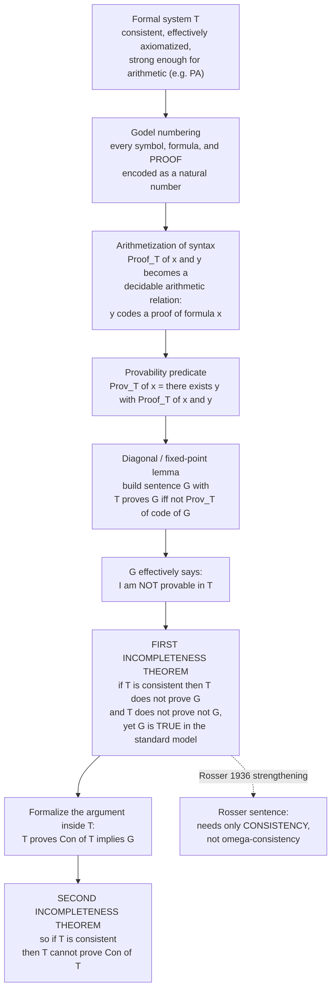

# ♾️ Gödel's Incompleteness Theorems

> [!abstract] TL;DR
> In 1931 Kurt Gödel proved that **any consistent, effectively axiomatized formal system strong enough to express basic arithmetic is *incomplete*** — there is a true arithmetic sentence `G` that the system can neither prove nor refute. The trick: **arithmetize syntax** (encode every formula and proof as a number) so that arithmetic can *talk about its own provability*, then use a **diagonal / fixed-point** construction to build a sentence `G` that effectively asserts **"I am not provable in this system."** If the system is consistent, `G` is *true but unprovable* (**First Theorem**); formalizing that very argument inside the system shows it **cannot prove its own consistency** `Con(T)` (**Second Theorem**). Together they demolished **Hilbert's Program** — the dream of securing all mathematics on a single complete, consistent, mechanically-checkable foundation — and revealed a permanent limit not of *mathematics*, but of the **formal axiomatic method**.

---

## Intuition

**Analogy — the truth-printing machine that cannot print one truth about itself.** Imagine a tireless machine whose job is to print, one by one, *every provable truth of arithmetic*. Feed it the axioms and inference rules; it grinds forever, spitting out theorems. Now Gödel hands it a single, carefully engineered sentence `G` that, decoded, says:

> **"This machine will never print ME."**

Watch the trap spring shut. **If the machine ever prints `G`**, then `G` is false (it *was* printed) — so the machine has printed a *falsehood*, and it is not the trustworthy truth-teller we assumed. **If the machine never prints `G`**, then `G` is *exactly right* — it is a **true** sentence that the machine can **never** reach. Either the machine lies, or there is a truth forever beyond its printout. A consistent machine takes the second horn: `G` is **true but unprovable**.

The genius is that `G` is not vague philosophical mysticism — it is an ordinary arithmetic statement about whole numbers, made to refer to itself through **Gödel numbering**, the same self-reference the Liar Paradox ("this sentence is false") exploits, but rebuilt rigorously so that arithmetic becomes a mirror reflecting its own proofs. This 1931 bombshell shattered **David Hilbert's dream** of a complete, mechanical, self-certifying mathematics: in *any* rich-enough system, there are true statements no proof can ever establish — and the system cannot even prove that it will never contradict itself.

---

## How It Works

### Core Mechanics

Fix a formal system `T` (think **Peano Arithmetic**, PA). Assume `T` is:

1. **Consistent** — it never proves both `φ` and `¬φ`. (A system that proves everything is useless.)
2. **Effectively axiomatized** — there is an *algorithm* that recognizes the axioms and checks proofs (the axiom set is **recursive**). This is what "mechanical foundation" means.
3. **Sufficiently strong** — it can represent all primitive recursive functions, i.e. it can do basic arithmetic (`+`, `×`, successor). PA qualifies; so does ZFC.

The proof proceeds in four moves:

1. **Gödel numbering (arithmetization of syntax).** Assign a unique natural number `⌜φ⌝` to every symbol, formula, and finite *proof*. Sequences are encoded by prime-power products (`2^{a₁}·3^{a₂}·5^{a₃}···`) or β-function tricks, so the encoding is a computable bijection. Now **syntax is arithmetic**: "is a well-formed formula", "is an axiom", and crucially "the sequence coded by `y` is a proof of the formula coded by `x`" all become *decidable arithmetic relations* — see the sibling **Arithmetization_of_Syntax_and_Diagonalization**.

2. **The provability predicate.** Because "`y` codes a proof of `x`" is primitive recursive, it is **representable** in `T` by a formula `Proof_T(x, y)`. Define the **provability predicate** `Prov_T(x) ≡ ∃y · Proof_T(x, y)` — an *arithmetic* statement meaning "the formula coded `x` is provable in `T`." Arithmetic can now assert facts about what arithmetic can prove.

3. **The Diagonal (Fixed-Point) Lemma.** For *any* formula `ψ(x)` with one free variable, there exists a sentence `S` such that `T ⊢ S ↔ ψ(⌜S⌝)` — `S` "says of itself" that its own code has property `ψ`. This is the rigorous engine of self-reference (the logical cousin of a **quine**, a program that prints its own source). Apply it to `ψ(x) ≡ ¬Prov_T(x)` to obtain the **Gödel sentence**:
   `T ⊢ G ↔ ¬Prov_T(⌜G⌝)` — i.e. **"G is not provable in T."**

4. **The two theorems.**
   - **First Incompleteness Theorem.** If `T` is consistent, then `T ⊬ G`. (If `T` proved `G`, then `Prov_T(⌜G⌝)` would hold, but `G` asserts `¬Prov_T(⌜G⌝)` — contradiction.) And under **ω-consistency** (Gödel's original hypothesis) or mere consistency via **Rosser's** trick, `T ⊬ ¬G` as well. So `G` is **independent** — undecidable in `T`. Yet, reasoning *from outside*, since `T` really cannot prove `G`, the sentence `G` is **true** (in the standard model ℕ). *A true arithmetic statement that the system can neither prove nor disprove.*
   - **Second Incompleteness Theorem.** Consistency of `T` can itself be written as an arithmetic sentence `Con(T) ≡ ¬Prov_T(⌜0=1⌝)`. Formalizing the First Theorem's argument *inside* `T` yields `T ⊢ Con(T) → G`. If `T` could prove `Con(T)`, it could prove `G` — contradicting the First Theorem. Therefore, **if `T` is consistent, `T ⊬ Con(T)`**: *no sufficiently strong consistent system can prove its own consistency.* This was the death blow to Hilbert's consistency program.

**Why every hypothesis matters:** drop *consistency* and everything is provable (`G` included). Drop *effective axiomatization* and "true arithmetic" (the complete but non-recursive set of ℕ-truths) is trivially "complete" — but there is no algorithm listing its axioms. Drop *arithmetic strength* and you escape: **Presburger arithmetic** (addition only, no multiplication) is consistent, complete, *and* decidable, because it is too weak to encode the diagonal construction.

### Flow / Architecture



---

## Key Concepts

### Secondary (intuitive)
- **Incomplete system.** A set of rules that cannot settle *every* yes/no question in its own language — some true statements are left permanently undecided.
- **Self-reference.** `G` is a sentence rigged to talk about itself, like "this sentence has no proof." Not a paradox, because it splits truth from provability instead of truth from falsehood.
- **The moral.** No single fixed rulebook can prove *all* mathematical truths and *also* certify that it will never contradict itself. Adding the missing truth as a new axiom just creates a new unprovable truth.

### Undergraduate (formal)
- **Gödel numbering `⌜·⌝`.** A computable injection from expressions and proofs into ℕ, turning metamathematics into arithmetic.
- **Provability predicate `Prov_T(x)`.** `∃y · Proof_T(x, y)`; a `Σ₁` arithmetic formula representing "provable in `T`."
- **Diagonal Lemma.** For every `ψ(x)` there is `S` with `T ⊢ S ↔ ψ(⌜S⌝)`. Instantiating `ψ = ¬Prov_T` gives the **Gödel sentence** `G`.
- **First Theorem.** Consistent + effectively axiomatized + arithmetic-capable ⟹ **incomplete**: some `G` with `T ⊬ G` and `T ⊬ ¬G`, and `ℕ ⊨ G`.
- **Second Theorem.** Such a `T` satisfies `T ⊬ Con(T)` (given `Con(T)` is stated via the standard **Hilbert–Bernbays–Löb derivability conditions**).
- **ω-consistency vs consistency.** Gödel's original used the stronger **ω-consistency**; **Rosser (1936)** replaced `G` with a cleverer sentence needing only plain consistency.

### Graduate (deep)
- **Representability of recursive functions.** Every recursive function is Σ₁-representable in PA; this is what powers arithmetization of `Proof_T`. Ties directly to **Primitive_Recursive_and_Mu_Recursive_Functions** and the Church–Turing equivalence.
- **Derivability conditions (Hilbert–Bernays–Löb).** `Prov_T` must satisfy (D1) `T⊢φ ⟹ T⊢Prov(⌜φ⌝)`, (D2) `T⊢Prov(⌜φ→ψ⌝)→(Prov(⌜φ⌝)→Prov(⌜ψ⌝))`, (D3) `T⊢Prov(⌜φ⌝)→Prov(⌜Prov(⌜φ⌝)⌝)`. The Second Theorem depends on these; a badly-chosen provability predicate can make `Con(T)` provable (**Feferman's** examples) — the intensional subtlety.
- **Löb's Theorem** (1955). `T ⊢ Prov(⌜φ⌝) → φ` implies `T ⊢ φ`. The Second Theorem is the special case `φ = (0=1)`. Formalized in **provability logic** `GL`, whose modal axiom `□(□φ→φ)→□φ` is complete for `Prov_T`.
- **Tarski's Undefinability of Truth.** The same diagonal machinery shows *arithmetic truth is not arithmetically definable* — otherwise the Liar sentence would be constructible and inconsistent. Provability *is* definable (Σ₁); truth is not — the deep asymmetry underlying **Truth_Theories_and_Metalogic**.
- **Concrete natural independent statements.** Beyond the artificial `G`: the **Paris–Harrington** theorem (a Ramsey-type combinatorial truth) and **Goodstein's theorem** are genuinely *mathematical* statements true in ℕ but unprovable in PA — needing induction up to the ordinal `ε₀`, the gateway to **Proof_Theory_and_Ordinal_Analysis**.

---

## Python Demo

Gödel's proof rests on two moving parts we can make *concrete*: **(a)** self-reference — realized computationally by a **quine**, a program that prints its own source (the executable cousin of the diagonal lemma that builds "I am not provable"); and **(b)** **arithmetization** — assigning **Gödel numbers** so a formal system can encode its own formulas, then laying out the fixed point `G ↔ ¬Prov(⌜G⌝)`. We run the quine and verify its output equals its source, encode a toy formula, confirm the encoding is invertible, and draw the self-reference / fixed-point diagram.

```python
# Gödel's Incompleteness — the two engines made concrete:
#   (a) SELF-REFERENCE via a quine (prints its own source)  -> the diagonal lemma
#   (b) ARITHMETIZATION via Gödel numbering + the fixed point G <-> not Prov(#G)
import io, contextlib
import numpy as np
import matplotlib.pyplot as plt

# ---------------------------------------------------------------
# (a) A QUINE: a program whose OUTPUT equals its own SOURCE.
#     This is self-reference realized in code — exactly what the
#     Diagonal Lemma does for formulas ("G talks about G").
# ---------------------------------------------------------------
inner = "s = %r\nprint(s %% s)"
program = "s = " + repr(inner) + "\nprint(s % s)"   # the full 2-line quine source

buf = io.StringIO()
with contextlib.redirect_stdout(buf):
    exec(program)                                    # actually RUN the quine
printed = buf.getvalue().rstrip("\n")

print("=== (a) QUINE / self-reference ===")
print("source :", repr(program))
print("output :", repr(printed))
print("output == source :", printed == program, "  <- computational fixed point\n")

# ---------------------------------------------------------------
# (b) GÖDEL NUMBERING: encode a tiny formal system's symbols so
#     that FORMULAS become NUMBERS. A sequence of symbol-codes
#     s1..sk maps to  prod_i  prime_i ** s_i   (invertible).
# ---------------------------------------------------------------
SYM = {'0':1, 'S':2, '=':3, '+':4, '(':5, ')':6, 'x':7, 'not':8, '->':9, 'forall':10}
CODE2SYM = {v: k for k, v in SYM.items()}

def first_primes(n):
    primes, c = [], 2
    while len(primes) < n:
        if all(c % p for p in primes):
            primes.append(c)
        c += 1
    return primes

def godel_number(tokens):
    codes = [SYM[t] for t in tokens]
    ps = first_primes(len(codes))
    n = 1
    for p, c in zip(ps, codes):
        n *= p ** c
    return n, codes, ps

def decode(n, length):
    ps = first_primes(length)
    out = []
    for p in ps:
        e = 0
        while n % p == 0:
            n //= p; e += 1
        out.append(CODE2SYM[e])
    return out

formula = ['S', '0', '=', 'S', '0']          # the (true) arithmetic sentence  S0 = S0
G, codes, ps = godel_number(formula)
back = decode(G, len(formula))

print("=== (b) ARITHMETIZATION / Gödel numbering ===")
print("formula        :", ' '.join(formula), " (means 1 = 1)")
print("symbol codes   :", codes)
print("primes used    :", ps)
print("Gödel number   :", G, " = " +
      " * ".join(f"{p}^{c}" for p, c in zip(ps, codes)))
print("decoded back   :", ' '.join(back), " -> invertible:", back == formula)
print("\nFixed point built by the Diagonal Lemma:")
print("   G  <->  not Prov_T( code(G) )     ('G says: I am not provable')")
print("   consistent T  =>  T can't prove G AND T can't prove not-G,")
print("   yet G is TRUE.  (First Incompleteness Theorem)")

# ---------------------------------------------------------------
# VISUALIZATION: the quine self-loop + the Gödel/fixed-point diagram
# ---------------------------------------------------------------
fig, (axL, axR) = plt.subplots(1, 2, figsize=(14, 6))

# -- Left: quine self-reference loop --
axL.set_title("(a) Quine: computational self-reference\n(the executable cousin of the Diagonal Lemma)",
              fontsize=11, fontweight='bold')
axL.add_patch(plt.Rectangle((0.15, 0.35), 0.7, 0.32, fc='#eef2ff', ec='#4338ca', lw=2))
axL.text(0.5, 0.51, "PROGRAM  P\ns = %r\nprint(s %% s)", ha='center', va='center',
         family='monospace', fontsize=11)
axL.annotate("", xy=(0.15, 0.62), xytext=(0.85, 0.62),
             arrowprops=dict(arrowstyle="->", lw=2.2, color='#dc2626',
                             connectionstyle="arc3,rad=-0.9"))
axL.text(0.5, 0.90, "output(P)  ==  source(P)", ha='center', fontsize=12,
         color='#dc2626', fontweight='bold')
axL.text(0.5, 0.20, "P refers to itself with no external input\n"
                    "=> a program can 'say its own name'", ha='center',
         fontsize=10, color='#334155')
axL.axis('off')

# -- Right: Gödel numbering + fixed point --
axR.set_title("(b) Arithmetization + Fixed Point\nG  <->  NOT Prov( code(G) )",
              fontsize=11, fontweight='bold')
# symbol bar (log-scale prime powers show the explosive encoding growth)
xs = np.arange(len(codes))
heights = np.array([p ** c for p, c in zip(ps, codes)], dtype=float)
axR.bar(xs, heights, color='#0d9488', width=0.6, zorder=3)
axR.set_yscale('log')
axR.set_xticks(xs)
axR.set_xticklabels([f"{t}\n{p}^{c}" for t, p, c in zip(formula, ps, codes)], fontsize=9)
axR.set_ylabel("prime power  (log scale)")
axR.set_xlabel("symbols of the formula  'S 0 = S 0'")
axR.text(0.5, 0.93, f"Gödel number  ⌜S0=S0⌝ = {G:,}",
         transform=axR.transAxes, ha='center', fontsize=10,
         fontweight='bold', color='#0f766e',
         bbox=dict(boxstyle='round', fc='#ccfbf1', ec='#0d9488'))
axR.text(0.5, 0.80,
         "syntax  ->  numbers  =>  arithmetic can talk about its own proofs\n"
         "Diagonal Lemma glues G to code(G): true-but-unprovable",
         transform=axR.transAxes, ha='center', fontsize=9, color='#334155')
axR.grid(True, axis='y', ls=':', alpha=0.5)

plt.tight_layout()
plt.savefig('godel_incompleteness.png', dpi=120)
plt.show()
```

The quine's `output == source` check comes out **True** — a program that reproduces itself with no input, the executable shadow of `G ↔ ¬Prov(⌜G⌝)`. The Gödel-numbering panel shows syntax collapsing into a single (huge) integer, so arithmetic can quantify over its own formulas; the bars on a log scale reveal *why* the encoding is astronomically large yet perfectly invertible. Together they stage, in miniature, the two ingredients Gödel welded into the first true-but-unprovable sentence.

---

## Real-World Applications

> **Example — the Halting Problem and the birth of computer science.** Gödel's arithmetization of syntax and diagonal argument are the direct ancestors of **Alan Turing's 1936** proof that no algorithm can decide whether an arbitrary program halts. Turing replaced "provable" with "halts" and Gödel numbers with program encodings; the same self-reference (`a machine analyzing a description of itself`) yields the same negative result. Incompleteness and undecidability are two faces of one phenomenon — see **The_Halting_Problem_and_Undecidability**. The theory of computation, and thus every compiler and CPU, grew out of the machinery Gödel invented to talk about proofs as numbers.

- **Automated theorem proving and formal verification.** Because arithmetic truth is not decidable, tools like Coq, Isabelle, Lean, and SMT solvers can *check* proofs but cannot *always find* them; the search space is fundamentally open. Incompleteness sets the outer boundary of what verification can promise.
- **Foundations of set theory.** ZFC is subject to both theorems: by the Second Theorem, ZFC cannot prove `Con(ZFC)` (assuming it is consistent), and the **Continuum Hypothesis** is independent of ZFC (Gödel 1940 + Cohen 1963) — a *concrete* mathematical statement neither provable nor refutable, the spirit of incompleteness realized in **Axiomatic_Set_Theory_ZFC** and forcing.
- **Program correctness limits.** Rice's theorem (a descendant) says every non-trivial semantic property of programs is undecidable — a direct consequence of the same diagonal/self-reference pattern.
- **Security of proof-of-work / self-describing systems.** Anywhere a system must reason about descriptions of itself (reflective interpreters, metacircular evaluators, bootstrapping compilers), the fixed-point/quine construction and its limits appear.

---

## Common Pitfalls

- **"Incompleteness means nothing is provable / math is broken."** False. Almost everything mathematicians care about *is* provable in PA or ZFC. Incompleteness says only that in any *single fixed* consistent, sufficiently-strong system there exist *specific* undecidable sentences — and that you cannot mechanically prove that whole system's own consistency. Mathematics as a practice is unharmed; the *dream of one final self-certifying axiom set* is what died.
- **Confusing it with Gödel's COMPLETENESS theorem.** Opposite results, constantly conflated. The **Completeness Theorem** (1929/30) says first-order *logic* is complete — `⊨` implies `⊢` for the logic. **Incompleteness** (1931) says a strong-enough *theory* like PA leaves some true sentences unprovable. Different subjects (logic vs theory), no contradiction — see **Soundness_and_Completeness**.
- **Forgetting the three hypotheses.** The theorems need a system that is (1) **consistent**, (2) **effectively axiomatized** (recursive axiom set), and (3) **arithmetic-capable**. Presburger arithmetic (addition only) is complete and decidable because it fails (3); "true arithmetic" `Th(ℕ)` is complete but not effectively axiomatized, failing (2); an inconsistent system proves everything, failing (1). Drop any one and there is no incompleteness.
- **ω-consistency vs Rosser.** Gödel's original needed **ω-consistency** to rule out `T ⊢ ¬G`. **Rosser (1936)** engineered a subtler sentence so that plain **consistency** suffices — the standard modern form. Citing the theorem as needing only consistency is correct *only* in the Rosser version.
- **Popular misuses in philosophy and physics.** The **Lucas–Penrose argument** — "humans see `G` is true, so minds transcend machines" — is widely rejected: it assumes the human mind is a *known consistent formal system*, exactly what Gödel forbids us to certify, and machines can also assert `Con(T) → G` (see **Functionalism_and_Machine_Minds**). Likewise, invocations of Gödel to prove "there is no Theory of Everything," to defend theology, or to settle free will are category errors: the theorems concern **formal derivability in arithmetic-capable systems**, not empirical physics, consciousness, or "truth" in general.
- **"Gödel showed truth is subjective / undefinable everywhere."** He showed **arithmetic truth is not arithmetically *definable*** (Tarski) and not fully *provable* — a precise metamathematical claim, not a licence for relativism. `G` has a definite truth value (true).

---

## Related Concepts

- [[Soundness_and_Completeness]] — the crucial contrast: Gödel's *Completeness* theorem (logic captures validity) versus this *Incompleteness* result (a theory cannot capture all arithmetic truth); constantly and wrongly conflated.
- [[Formal_Systems_and_Proof_Calculi]] — defines "effectively axiomatized" and the `⊢` machinery whose limits the theorems expose.
- [[First_Order_Predicate_Logic]] — the language in which Peano Arithmetic and the Gödel sentence `G` are written.
- [[Axiomatic_Set_Theory_ZFC]] — ZFC is itself incomplete; by the Second Theorem it cannot prove `Con(ZFC)`, and CH is independent of it.
- [[The_Continuum_Hypothesis]] — a concrete, *natural* independent statement, incompleteness realized outside artificial self-reference.
- [[Forcing_and_Independence_Proofs]] — Cohen's technique for manufacturing independence results, the constructive complement to Gödel's existence proof.
- [[Computability_and_Recursion_Theory]] — "effectively axiomatized" means the axiom set is recursive; the whole theory of computability grew from arithmetization.
- [[Primitive_Recursive_and_Mu_Recursive_Functions]] — representability of these functions in PA is what makes `Proof_T` an arithmetic relation.
- [[The_Halting_Problem_and_Undecidability]] — Turing's computational twin of incompleteness; same diagonal/self-reference, "halts" replacing "provable."
- [[Turing_Machines_and_the_Church_Turing_Thesis]] — pins down "algorithm" / "effective procedure," making the hypotheses precise and linking to arithmetic's undecidability.
- [[Decidability_and_Recognizability]] — arithmetic truth is not decidable; provability is only recursively enumerable — the r.e.-vs-recursive gap behind incompleteness.
- [[Truth_Theories_and_Metalogic]] — Tarski's undefinability of truth is the same diagonal argument aimed at truth instead of provability.
- [[Philosophy_of_Logic]] — the genuine philosophical import (limits of the formal method) versus the popular misreadings.
- [[Functionalism_and_Machine_Minds]] — the Lucas–Penrose "minds beat machines" argument and why most logicians reject it.
- [[Paradoxes_and_Logical_Puzzles]] — the Liar paradox that `G` rigorously tames by splitting truth from provability.

Siblings developing this section in depth (prose references): **Peano_Arithmetic_and_Formal_Number_Theory** (the canonical system `T`), **Arithmetization_of_Syntax_and_Diagonalization** (Gödel numbering and the fixed-point lemma), **Proof_Theory_and_Ordinal_Analysis** (Gentzen's `ε₀` consistency proof and what *can* be salvaged of Hilbert's Program), and **Undecidability_and_Reducibility** (the recursion-theoretic frame).

---

## Review Questions

**Secondary.** In your own words, what does the sentence `G` "say," and why does a *consistent* truth-printing machine end up unable to print it? Explain why "some truths are unprovable in this system" does **not** mean "mathematics is unreliable."

**Undergraduate.** State the First and Second Incompleteness Theorems precisely, naming the three hypotheses (consistency, effective axiomatization, arithmetic strength) and giving one system that *escapes* incompleteness by failing each hypothesis. Sketch how Gödel numbering turns "provable in `T`" into an arithmetic predicate `Prov_T`, and how the Diagonal Lemma then produces `G` with `T ⊢ G ↔ ¬Prov_T(⌜G⌝)`.

**Graduate.** (a) Explain why the Second Theorem requires the Hilbert–Bernays–Löb derivability conditions and how a poorly-chosen (intensionally wrong) provability predicate can make `Con(T)` provable. (b) Derive the Second Theorem from **Löb's theorem**, or from `T ⊢ Con(T) → G`. (c) Contrast Gödel's original ω-consistency hypothesis with Rosser's consistency-only strengthening, and state Tarski's undefinability theorem as a variant of the same diagonal argument. (d) Critique the Lucas–Penrose argument in one paragraph.

---

## Sources

- Gödel, K. (1931). *Über formal unentscheidbare Sätze der Principia Mathematica und verwandter Systeme I* ("On Formally Undecidable Propositions of Principia Mathematica and Related Systems I"). Monatshefte für Mathematik und Physik 38, 173–198. — the original paper; English in van Heijenoort's *From Frege to Gödel*.
- Nagel, E. & Newman, J. R. (2001, rev. Hofstadter). *Gödel's Proof*. NYU Press. — the classic accessible exposition of the whole argument.
- Smullyan, R. M. (1992). *Gödel's Incompleteness Theorems*. Oxford Logic Guides. — precise, self-contained treatment of the fixed-point lemma, Rosser's trick, and Tarski.
- Boolos, G., Burgess, J. & Jeffrey, R. (2007). *Computability and Logic* (5th ed.), Ch. 17–18. Cambridge University Press. — rigorous modern proof linking incompleteness to computability.
- Raatikainen, P. [*Gödel's Incompleteness Theorems*](https://plato.stanford.edu/entries/goedel-incompleteness/), Stanford Encyclopedia of Philosophy. — careful statement of hypotheses, derivability conditions, and a survey of misuses.

---

#mathematical-logic #godel #incompleteness #self-reference #foundations
