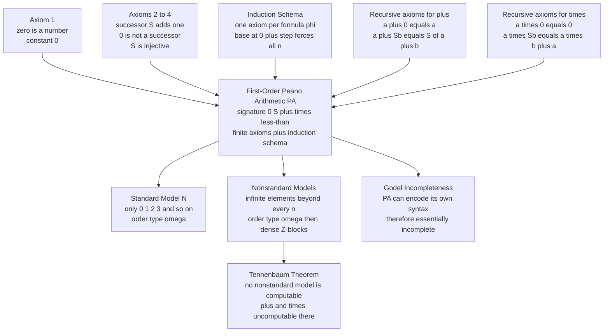

# 🔢 Peano Arithmetic and Formal Number Theory

> [!abstract] TL;DR
> **Peano Arithmetic (PA)** is the formal axiomatization of the natural numbers built from almost nothing: a constant **0**, a **successor** operation `S` ("add one"), and the principle of **induction**. From these Giuseppe Peano derived all of ordinary arithmetic; addition and multiplication enter as **recursive axioms** (`a + 0 = a`, `a + Sb = S(a + b)`; `a·0 = 0`, `a·Sb = a·b + a`). In its **first-order** form PA replaces the single second-order induction *axiom* with an **induction schema** — one axiom per formula, essentially infinitely many. That first-order weakening has two famous consequences: PA has **nonstandard models** containing "infinite" numbers beyond every `0, 1, 2, …` (order type `ω + (ω* + ω)·η`), and PA is exactly the "sufficiently strong" theory where **Gödel's incompleteness** first bites — powerful enough to encode its own syntax, and therefore doomed to be incomplete.

---

## Intuition

**Analogy — building numbers out of nothing.** Imagine you have never been told what numbers "are," and you want to *manufacture* the whole endless sequence `0, 1, 2, 3, …` from pure logic without secretly assuming it already exists. Peano's recipe needs just three ingredients. First, a **starting brick**: call it `0`. Second, a **stacking rule**: given any brick, you may place exactly one new brick on top — the **successor** `S`. So `1` is *nothing but* "the successor of 0" (`S0`), `2` is `SS0`, and so on forever. Third, and most powerful, a **promise about the whole tower — induction**: if a property is true of the ground brick `0`, and whenever it is true of a brick it is also true of the brick stacked on top, then it is true of **every** brick in the tower. This is the domino principle — knock over the first and guarantee each falling one topples the next, and *all* dominoes fall.

That is the entire foundation. Addition is defined by *sliding one tower onto another* (`a + Sb = S(a + b)`), multiplication by *repeated addition* (`a·Sb = a·b + a`), and the order `<` by "reachable by more successors." **Peano Arithmetic is the formal theory of counting.** Its power is also its curse: because it can describe *repeatable, mechanical* operations, it is expressive enough to describe its own proofs as numbers — and that self-reference is precisely what Gödel exploited to show it can never prove every arithmetical truth.

---

## How It Works

### Core Mechanics

**The Dedekind-Peano axioms (1889).** Over a language with a constant `0` and a unary successor `S`:

1. **`0` is a number.** There is a distinguished starting element.
2. **Successor is total.** For every `n`, `Sn` is again a number.
3. **`0` is not a successor.** `Sn ≠ 0` for all `n` — the chain has a genuine beginning; nothing loops back to `0`.
4. **Successor is injective.** If `Sm = Sn` then `m = n` — the chain never merges.
5. **Induction.** If a property `P` holds of `0`, and `P(n) → P(Sn)` for every `n`, then `P` holds of *all* numbers.

Axioms 1–4 give an infinite, non-repeating chain `0, S0, SS0, …`; axiom 5 (induction) is what forbids "extra stuff" floating off to the side and pins the chain down to *exactly* the natural numbers.

**From axioms to arithmetic.** Addition and multiplication are not primitive — they are *defined by recursion* on the successor, and in PA those recursion equations are taken as axioms:

- **Addition:** `a + 0 = a` and `a + Sb = S(a + b)`.
- **Multiplication:** `a · 0 = 0` and `a · Sb = (a · b) + a`.
- **Order:** `a < b` iff `∃c (a + Sc = b)` — `b` is some positive number of successors past `a`.

Every concrete sum and product is computed by *unfolding* these two rules until the second argument reaches `0`. General laws — commutativity, associativity, distributivity — are then *proved by induction*, not assumed.

**First-order PA and the induction schema.** The crucial subtlety: axiom 5 as stated quantifies over *properties* `P` — that is **second-order**. First-order logic cannot quantify over properties, only over numbers. So **first-order Peano Arithmetic (PA)** replaces the single second-order induction axiom with an **induction schema**: for *each* first-order formula `φ(x)` in the language `{0, S, +, ×, <}`, add the axiom

`[φ(0) ∧ ∀x (φ(x) → φ(Sx))] → ∀x φ(x)`.

This is one axiom **per formula** — a countably infinite, properly infinite set of axioms (no finite subset axiomatizes PA). Induction now applies only to properties *expressible in the language* (definable sets), not to arbitrary subsets. That gap between "all subsets" (second-order) and "all definable subsets" (first-order) is exactly the crack through which nonstandard models and incompleteness enter.

### Flow / Architecture



---

## Key Concepts

### Secondary Level

**Numbers as successors.** Forget place-value digits for a moment. In Peano's world a number *is* a stack of `S`'s on top of `0`: `0`, `S0` (which we nickname `1`), `SS0` (`2`), `SSS0` (`3`). Counting is just "apply `S` once more."

**Why `0` is not a successor, and why `S` never merges.** These two axioms keep the chain honest. Without "`0` is not a successor," `0` could be `S`(something) and the line could bend into a loop. Without injectivity, two different numbers could have the same successor, collapsing the chain. Together they guarantee a single, infinite, one-way ladder.

**Induction is the domino principle.** To prove something is true of *every* number, you do not check them one by one (there are infinitely many). Instead you show two things: it is true of `0` (the first domino falls), and *whenever* it is true of a number it is true of the next (each domino knocks over its neighbour). Induction then hands you the conclusion for **all** numbers for free. This single idea is the engine of nearly every proof about the integers.

**Addition as repeated "add one."** `a + b` means "start at `a` and take the successor `b` times." That is exactly what `a + Sb = S(a + b)` says: adding `Sb` is adding `b` and then one more.

### Undergraduate Level

**The first-order signature and axioms.** PA is a first-order theory in the language `L = {0, S, +, ×, <}`. Its axioms are a handful of universally-quantified sentences (successor is injective, `0` is least, the recursion equations for `+` and `×`, defining `<`) **plus the induction schema** — one instance `Ind_φ` for every formula `φ`. Because there is a fresh axiom for each of infinitely many formulas, PA is **not finitely axiomatizable**.

**Robinson Arithmetic (Q) — PA minus induction.** Strip *all* induction and keep only the basic successor, addition, and multiplication axioms, and you get **Robinson arithmetic Q**. Q is astonishingly weak — it cannot even prove `∀x (x + 0 = 0 + x)` or that addition is commutative — yet it is already strong enough to **represent every computable function** and is therefore already **essentially undecidable** and subject to Gödel's first incompleteness theorem. The moral: incompleteness needs very little; induction is not what causes it.

**The standard model ℕ.** The intended model is `(ℕ; 0, S, +, ×, <)` with the ordinary naturals. Everything PA proves is true here (PA is *sound* for ℕ), but — crucially — not everything *true* in ℕ is provable in PA. The set of all first-order sentences true in ℕ is **true arithmetic**, `Th(ℕ)`; it is a complete but **non-recursively-axiomatizable** (highly undecidable) theory, strictly larger than the theorems of PA.

**Representability — the bridge to incompleteness.** A relation is **representable** in PA (already in Q) if there is a formula that PA proves to hold exactly of the right numbers. The key metatheorem is that **every computable (recursive) function and relation is representable**. This is the load-bearing link to Gödel: once syntax is *arithmetized* (formulas and proofs coded as numbers), the relation "`p` is a proof of `φ`" becomes a representable arithmetical relation, letting PA "talk about itself." (Developed in the sibling notes *Primitive_Recursive_and_Mu_Recursive_Functions* and *Arithmetization_of_Syntax_and_Diagonalization*.)

**Presburger vs. Peano.** Drop **multiplication** and keep only `(ℕ; 0, S, +, <)` and you get **Presburger arithmetic** — which is *complete and decidable* (Presburger 1929). Multiplication is what makes full arithmetic undecidable; the interplay `+` and `×` together encode enough combinatorics to simulate computation.

### Graduate Level

**Nonstandard models exist.** Add a fresh constant `c` to the language and the axioms `c > 0, c > S0, c > SS0, …` (one for each numeral). Every *finite* subset of `PA ∪ {those axioms}` is satisfiable (interpret `c` as a big enough standard number), so by the **compactness theorem** the whole set has a model `M ⊨ PA` containing an element `c` larger than every standard numeral — an **infinite** (nonstandard) natural number. By Löwenheim-Skolem there are such models of every infinite cardinality, and countable ones exist (Skolem 1934). No first-order theory can pin ℕ down uniquely — PA is **not categorical**.

**The order type of a countable nonstandard model.** Every countable nonstandard model of PA has order type

`ω + (ω* + ω) · η`,

read: a copy of the **standard block ω** (`0, 1, 2, …`) sitting at the bottom, followed by **densely, endlessly** many **ℤ-blocks** — each block a copy of the integers `… −2, −1, 0, +1, +2, …` (order type `ω* + ω`), and the blocks themselves arranged in the order type `η` of the **rationals ℚ** (dense, no first or last block). Every nonstandard element lives in some ℤ-block: it has an immediate predecessor and successor, but no least nonstandard element exists (given any nonstandard `n`, `n − 1` is still nonstandard). The standard ℕ sits as an initial segment inside every model.

**Tennenbaum's theorem (1959).** You cannot *write down* a nonstandard model of PA: **no countable nonstandard model of PA is computable.** In any nonstandard model, neither `+` nor `×` (as functions on a computable coding of the domain) can be recursive. So while nonstandard models *exist* abstractly (via compactness / ultrapowers), they are inherently *non-constructive* — a sharp limit on how concretely we can grasp them.

**The strength hierarchy.** From weakest to strongest, all in the same language:
- **Robinson Q** — no induction; already essentially undecidable.
- **Fragments `IΣ_n`, `IΔ_0`** — induction restricted to formulas of bounded quantifier complexity; central to **bounded arithmetic** and complexity theory.
- **PA** — full first-order induction schema.
- **PA + Con(PA)** — PA plus the arithmetical sentence asserting its own consistency; *strictly stronger* than PA (by Gödel's second theorem PA cannot prove `Con(PA)`), yet still incomplete, and `PA + ¬Con(PA)` is also consistent.
- **True arithmetic `Th(ℕ)`** — every sentence true in the standard model; complete but not recursively axiomatizable.

**Independence: true statements PA cannot prove.** Beyond the self-referential Gödel sentence, there are *mathematically natural* truths independent of PA. **Goodstein's theorem** (about hereditary base-`n` sequences that provably terminate) and the **Paris-Harrington theorem** (a strengthened finite Ramsey statement) are both **true in ℕ but unprovable in PA**. Their proofs require induction up to the ordinal **ε₀** — transfinite induction beyond what PA can carry out. Gentzen's consistency proof of PA using ε₀-induction, and the identification of ε₀ as PA's **proof-theoretic ordinal**, is the content of **ordinal analysis** (sibling note *Proof_Theory_and_Ordinal_Analysis*).

**Second-order categoricity (Dedekind).** With *second-order* induction (quantifying over *all* subsets, not just definable ones), the Peano axioms are **categorical**: every model is isomorphic to ℕ (Dedekind 1888). The price is that second-order logic has no sound-and-complete effective proof system and loses compactness (sibling note *Second_Order_and_Higher_Order_Logic*). This is the recurring trade: first-order buys a complete proof calculus but admits nonstandard models; second-order pins down ℕ but forfeits effective provability.

---

## Python Demo

```python
"""
Peano Arithmetic, hands on:
  (a) NATURAL NUMBERS AS SUCCESSOR TERMS  0, S0, SS0, ...  and addition and
      multiplication DEFINED purely by the recursive Peano axioms:
          a + 0  = a        a + Sb = S(a + b)
          a * 0  = 0        a * Sb = (a * b) + a
      computed by unfolding the rules -- no use of Python's built-in + or *.
  (b) INDUCTION illustrated by verifying identities (0 + n = n, and the
      associativity of +) as they must be proved in PA: base case + step.
  (c) NONSTANDARD MODELS pictured: PA's countable nonstandard models have
      order type  omega + (omega* + omega) * eta  -- the standard block N,
      then DENSELY many Z-blocks (copies of the integers) indexed by rationals.

numpy + matplotlib only.
"""

import numpy as np
import matplotlib.pyplot as plt
from fractions import Fraction

# ---------------------------------------------------------------------------
# (a) Naturals as successor terms.  Z is zero; S(n) wraps a number.
#     We represent a numeral by its successor-depth for clarity, but ALL
#     arithmetic below is done ONLY through the Peano recursion equations.
# ---------------------------------------------------------------------------
Z = ("Z",)                       # the constant 0
def S(n): return ("S", n)        # successor: add one brick to the tower

def to_int(n):                   # decode a successor term to a Python int (display only)
    k = 0
    while n[0] == "S":
        k += 1
        n = n[1]
    return k

def numeral(k):                  # build S...S0  (k successors)
    n = Z
    for _ in range(k):
        n = S(n)
    return n

def peano_add(a, b):             # a + 0 = a ;  a + Sb = S(a + b)
    if b[0] == "Z":
        return a
    return S(peano_add(a, b[1]))

def peano_mul(a, b):             # a * 0 = 0 ;  a * Sb = (a * b) + a
    if b[0] == "Z":
        return Z
    return peano_add(peano_mul(a, b[1]), a)

# Build addition and multiplication tables straight from the axioms
N = 6
add_table = np.zeros((N, N), dtype=int)
mul_table = np.zeros((N, N), dtype=int)
for i in range(N):
    for j in range(N):
        add_table[i, j] = to_int(peano_add(numeral(i), numeral(j)))
        mul_table[i, j] = to_int(peano_mul(numeral(i), numeral(j)))

# Sanity check: the axioms reproduce ordinary arithmetic exactly
assert np.array_equal(add_table, np.add.outer(range(N), range(N)))
assert np.array_equal(mul_table, np.multiply.outer(range(N), range(N)))
print("=== Arithmetic DEFINED from the Peano axioms (no built-in + or *) ===")
print("2 + 3 =", to_int(peano_add(numeral(2), numeral(3))),
      "   traced as  2+S(S(S0)) = S(S(S(2))) = 5")
print("3 * 4 =", to_int(peano_mul(numeral(3), numeral(4))),
      "   repeated addition ((0+3)+3)+3)+3")
print("addition table matches N x N:", np.array_equal(add_table, np.add.outer(range(N), range(N))))
print("multiplication table matches N x N:", np.array_equal(mul_table, np.multiply.outer(range(N), range(N))))

# ---------------------------------------------------------------------------
# (b) INDUCTION.  In PA, 0 + n = n is NOT an axiom (only n + 0 = n is);
#     it must be PROVED by induction on n.  We mirror the proof shape:
#         base:  0 + 0 = 0                         (from a + 0 = a)
#         step:  assume 0 + n = n; then
#                0 + Sn = S(0 + n) = S(n)          (from a + Sb = S(a + b))
#     and we machine-verify base + step for a range of n.
# ---------------------------------------------------------------------------
def check_left_identity(upto):
    base = to_int(peano_add(Z, Z)) == 0
    step_ok = all(
        to_int(peano_add(Z, S(numeral(n)))) == to_int(S(peano_add(Z, numeral(n))))
        for n in range(upto)
    )
    return base and step_ok

def check_associativity(upto):   # (a + b) + c = a + (b + c), proved by induction on c
    for a in range(upto):
        for b in range(upto):
            for c in range(upto):
                lhs = peano_add(peano_add(numeral(a), numeral(b)), numeral(c))
                rhs = peano_add(numeral(a), peano_add(numeral(b), numeral(c)))
                if to_int(lhs) != to_int(rhs):
                    return False
    return True

print("\n=== Induction ===")
print("0 + n = n  (base holds, step S(0+n)=0+Sn holds for all tested n):",
      check_left_identity(40))
print("associativity (a+b)+c = a+(b+c) verified up to 6:", check_associativity(6))

# ---------------------------------------------------------------------------
# (c) NONSTANDARD MODEL order type  omega + (omega* + omega) * eta.
#     Standard block N on the left; then densely many Z-blocks (order type of
#     the integers) placed at RATIONAL positions -- no first/last block.
# ---------------------------------------------------------------------------
fig = plt.figure(figsize=(13, 8))

# -- top-left: successor chain of the standard naturals -----------------------
ax1 = fig.add_subplot(2, 2, 1)
xs = np.arange(0, 7)
ax1.scatter(xs, np.zeros_like(xs), s=260, c="#1e3a8a", zorder=3)
for k in xs:
    ax1.annotate("", xy=(k, 0), xytext=(k - 1, 0),
                 arrowprops=dict(arrowstyle="-|>", lw=2, color="#2563eb")) if k > 0 else None
    ax1.text(k, 0.16, f"{'S'*k}0" if k <= 3 else str(k),
             ha="center", fontsize=9, color="#1e3a8a")
    ax1.text(k, -0.22, str(k), ha="center", fontsize=10, fontweight="bold")
ax1.text(6.7, 0, r"$\cdots$", fontsize=16, va="center")
ax1.set_title("Standard naturals as successor terms\n0, S0, SS0, ...  (order type $\\omega$)",
              fontsize=10)
ax1.set_xlim(-0.6, 7.2); ax1.set_ylim(-0.6, 0.6); ax1.axis("off")

# -- top-right: addition table computed from the axioms -----------------------
ax2 = fig.add_subplot(2, 2, 2)
im = ax2.imshow(add_table, cmap="Blues", origin="lower")
for i in range(N):
    for j in range(N):
        ax2.text(j, i, add_table[i, j], ha="center", va="center", fontsize=9,
                 color="white" if add_table[i, j] > N else "#1e3a8a")
ax2.set_title("a + b  from  a+0=a,  a+Sb=S(a+b)", fontsize=10)
ax2.set_xlabel("b"); ax2.set_ylabel("a")
ax2.set_xticks(range(N)); ax2.set_yticks(range(N))

# -- bottom (span): nonstandard-model order type ------------------------------
ax3 = fig.add_subplot(2, 1, 2)

# standard block omega
std = np.arange(0, 8)
ax3.scatter(std, np.zeros_like(std), s=90, c="#1e3a8a", zorder=3)
for k in std:
    ax3.text(k, -0.35, str(k), ha="center", fontsize=8, color="#1e3a8a")
ax3.text(8.4, 0, r"$\cdots$", fontsize=16, va="center")
ax3.axvline(9.2, color="#94a3b8", ls="--", lw=1)
ax3.text(4, 0.55, r"standard block  $\omega$", ha="center", fontsize=10,
         color="#1e3a8a", fontweight="bold")

# nonstandard part: Z-blocks at rational positions (dense order type eta)
rationals = [Fraction(1, 2), Fraction(1, 3), Fraction(2, 3),
             Fraction(1, 4), Fraction(3, 4), Fraction(2, 5)]
rationals = sorted(set(rationals))
base_x = 11.0
span = 15.0
for r in rationals:
    cx = base_x + float(r) * span
    offsets = np.arange(-3, 4)                      # ...,-3,-2,-1,0,1,2,3,... = Z
    ys = np.full_like(offsets, 0.0, dtype=float)
    ax3.scatter(cx + offsets * 0.32, ys, s=45, c="#b91c1c", zorder=3)
    ax3.text(cx - 3 * 0.32 - 0.35, 0, r"$\cdots$", fontsize=11, va="center", color="#b91c1c")
    ax3.text(cx + 3 * 0.32 + 0.35, 0, r"$\cdots$", fontsize=11, va="center", color="#b91c1c")
    ax3.text(cx, -0.5, f"$\\mathbb{{Z}}$-block @ {r}", ha="center", fontsize=7.5, color="#b91c1c")
ax3.text(base_x + 0.5 * span, 0.55,
         r"nonstandard part: $(\omega^{*}+\omega)\cdot\eta$  (dense $\mathbb{Z}$-blocks, no first/last)",
         ha="center", fontsize=10, color="#b91c1c", fontweight="bold")
ax3.set_title(r"Order type of a countable nonstandard model of PA:  "
              r"$\omega + (\omega^{*}+\omega)\cdot\eta$", fontsize=11)
ax3.set_xlim(-1, base_x + span + 2); ax3.set_ylim(-1.1, 1.0); ax3.axis("off")

plt.tight_layout(pad=1.4)
plt.savefig("peano_arithmetic.png", dpi=120, bbox_inches="tight")
plt.show()
```

**Expected output:**

```
=== Arithmetic DEFINED from the Peano axioms (no built-in + or *) ===
2 + 3 = 5    traced as  2+S(S(S0)) = S(S(S(2))) = 5
3 * 4 = 12   repeated addition ((0+3)+3)+3)+3
addition table matches N x N: True
multiplication table matches N x N: True

=== Induction ===
0 + n = n  (base holds, step S(0+n)=0+Sn holds for all tested n): True
associativity (a+b)+c = a+(b+c) verified up to 6: True
```

The demo makes the axioms *do the work*: `peano_add` and `peano_mul` never call Python's `+`/`*` on the numbers themselves — they recurse on the successor structure exactly as `a + Sb = S(a + b)` prescribes, and the resulting tables provably coincide with `ℕ × ℕ`. The induction block mirrors a real PA proof: `0 + n = n` is *not* an axiom (only `n + 0 = n` is), so we check the **base case** and the **inductive step** `S(0 + n) = 0 + Sn` separately. The bottom plot is the punchline of nonstandard models: a solid standard block `ω`, then — beyond every finite number — densely packed **ℤ-blocks** at rational positions, each with a predecessor and successor but with *no least nonstandard element*, giving the signature order type `ω + (ω* + ω)·η`.

---

## Real-World Applications

> **Proof assistants and formalized mathematics.** Lean's `mathlib`, Isabelle/HOL, Coq, and Agda build the naturals as an inductive type whose constructors are literally `zero` and `succ`, with a `Nat.rec` recursor that *is* the induction principle. Every proof about integers in these systems ultimately bottoms out in Peano-style induction; the four-colour theorem, the Kepler conjecture (Flyspeck), and Gödel's own theorems have all been machine-checked on this foundation.

> **Presburger arithmetic in compilers and verification.** Full PA is undecidable, but its multiplication-free fragment — **Presburger arithmetic** `(ℕ; 0, S, +, <)` — is decidable, and that decision procedure is a workhorse. The **Omega test**, the **isl** library (used by GCC/LLVM's Polly and the polyhedral loop optimizer), and dependence analysers decide integer-linear constraints to prove loops parallelizable or array accesses in-bounds. SMT solvers (Z3, CVC5) ship Presburger/linear-integer-arithmetic engines used across program verification.

> **Bounded arithmetic and computational complexity.** The fragments `IΔ_0`, `IΣ_1`, and Buss's `S^i_2` restrict induction to formulas of limited quantifier complexity, and their *provably total functions* correspond exactly to complexity classes (polynomial-time, polynomial hierarchy). This "proof complexity meets computational complexity" program studies whether feasible reasoning can prove statements like P vs NP.

> **Ordinal analysis and proof mining.** Identifying PA's proof-theoretic ordinal `ε₀` (Gentzen) is not just foundational bookkeeping: **proof mining** extracts explicit numerical bounds and algorithms from non-constructive proofs by tracking exactly how much induction they use, yielding new results in analysis, ergodic theory, and fixed-point theory.

---

## Common Pitfalls

- **Confusing the first-order induction *schema* with the second-order induction *axiom*.** First-order PA has **infinitely many** induction axioms — one for each formula `φ` — and induction applies only to *definable* sets. The second-order axiom is a *single* statement quantifying over **all** subsets. The schema is strictly weaker: it is *why* PA has nonstandard models while the second-order Peano axioms are categorical (unique model up to isomorphism). Conflating the two erases the whole story.

- **Believing PA pins down ℕ.** By compactness and Löwenheim-Skolem, **PA has nonstandard models** — models satisfying every PA theorem yet containing "infinite" numbers larger than every `0, 1, 2, …`. No first-order theory can characterize ℕ up to isomorphism. "True in ℕ" (true arithmetic `Th(ℕ)`) is strictly bigger than "provable in PA."

- **Thinking induction is what causes incompleteness.** The opposite: **Robinson arithmetic Q** has *no* induction at all yet is already essentially undecidable and incomplete, because it still represents every computable function. Incompleteness comes from arithmetic's capacity to encode computation (the `+`/`×` interplay), not from induction. Meanwhile *Presburger* arithmetic (drop `×`) is *complete and decidable*.

- **Expecting to exhibit a nonstandard model concretely.** **Tennenbaum's theorem** says no countable nonstandard model of PA is computable — you cannot give a Turing-computable presentation of its `+` or `×`. Nonstandard models are guaranteed to exist (compactness, ultrapowers) but are inherently non-constructive; do not expect to "write one down."

- **Assuming PA proves its own consistency.** By Gödel's second incompleteness theorem, PA does **not** prove `Con(PA)` (assuming PA is consistent). `PA + Con(PA)` is strictly stronger, and `PA + ¬Con(PA)` is *also* consistent (it has nonstandard models thinking PA is inconsistent). Consistency strength is a genuine hierarchy, not an on/off switch.

- **Assuming everything true about numbers is provable in PA.** **Goodstein's theorem** and the **Paris-Harrington** principle are true statements about the naturals that PA *cannot* prove; they need transfinite induction up to `ε₀`. Independence is not exotic self-reference only — it reaches natural combinatorics.

---

## Related Concepts

- [[Mathematical_Logic/01_Foundations_of_Formal_Logic/First_Order_Predicate_Logic|First-Order Predicate Logic]] — supplies the language, quantifiers, and structures in which PA is written; the induction *schema* exists precisely because first-order logic cannot quantify over properties.
- [[Mathematical_Logic/01_Foundations_of_Formal_Logic/Compactness_and_Lowenheim_Skolem|Compactness and Löwenheim-Skolem]] — the exact tools that *construct* PA's nonstandard models (add a constant larger than every numeral; every finite subset is satisfiable) and show PA is non-categorical.
- [[Mathematical_Logic/02_Model_Theory/Ultraproducts_and_Nonstandard_Analysis|Ultraproducts and Nonstandard Analysis]] — an ultrapower `ℕ^ℕ/U` is a concrete nonstandard model of arithmetic; the same machinery that yields hyperreals yields "infinite" naturals.
- [[Mathematical_Logic/02_Model_Theory/Categoricity_and_Morley_Theorem|Categoricity and Morley's Theorem]] — frames "why can't PA be categorical?": first-order theories with infinite models are never categorical across all cardinalities, forcing nonstandard models.
- [[Mathematical_Logic/03_Set_Theory/Ordinals_and_Cardinals|Ordinals and Cardinals]] — supplies `ω`, `ω*`, and `ε₀`: the order-type vocabulary for nonstandard models and PA's proof-theoretic ordinal.
- [[Mathematical_Logic/01_Foundations_of_Formal_Logic/Soundness_and_Completeness|Soundness and Completeness]] — PA is sound for ℕ; completeness of the underlying logic is what guarantees nonstandard models satisfy every PA theorem.
- [[Mathematics/04_Discrete_Mathematics/Number_Theory_Elementary|Elementary Number Theory]] — the informal number theory PA formalizes; divisibility, primes, and the division algorithm are theorems of PA.
- [[Mathematics/04_Discrete_Mathematics/Logic_and_Proof_Techniques|Logic and Proof Techniques]] — the discrete-math introduction to induction and proof, the on-ramp to PA's central schema.
- [[Mathematics/04_Discrete_Mathematics/Set_Theory_and_Relations|Set Theory and Relations]] — the order `<` and the successor are relations/functions on the domain; von Neumann's ordinals give the set-theoretic construction of ℕ that models the Peano axioms.
- [[Mathematics/14_Advanced_Topics/Mathematical_Logic_and_Set_Theory|Mathematical Logic and Set Theory]] — situates PA within the broader landscape of formal systems, incompleteness, and ZFC.
- [[Logic_and_Critical_Thinking/02_Deductive_Reasoning/Mathematical_Proof_Strategies|Mathematical Proof Strategies]] — mathematical induction (weak, strong, structural) as a working proof method, the practitioner's view of PA's fifth axiom.
- [[Theory_of_Computation/03_Computability_and_Turing_Machines/Recursive_Functions_and_Lambda_Calculus|Recursive Functions and Lambda Calculus]] — the recursive functions that PA *represents*; this representability is the bridge from computation to arithmetical incompleteness.
- [[Theory_of_Computation/03_Computability_and_Turing_Machines/Turing_Machines_and_the_Church_Turing_Thesis|Turing Machines and the Church-Turing Thesis]] — the model of computation whose encoding into arithmetic makes PA "sufficiently strong," and whose halting problem underlies undecidability.
- [[Theory_of_Computation/03_Computability_and_Turing_Machines/The_Halting_Problem_and_Undecidability|The Halting Problem and Undecidability]] — undecidability of full arithmetic (with `×`) mirrors the halting problem; Presburger arithmetic (without `×`) escapes it and is decidable.

*Siblings in this section (in prose, to be linked once written):* Godels_Incompleteness_Theorems, Arithmetization_of_Syntax_and_Diagonalization, Proof_Theory_and_Ordinal_Analysis, Second_Order_and_Higher_Order_Logic, Primitive_Recursive_and_Mu_Recursive_Functions.

---

## Review Questions

### Secondary

1. Using only `0` and the successor `S`, write the numbers 3 and 5 as successor terms, then compute `3 + 2` by applying the rule `a + Sb = S(a + b)` step by step until the second number reaches `0`.
2. State the "domino principle" version of induction in your own words, and explain why checking "true of 0" and "if true of `n` then true of `Sn`" lets you conclude "true of every number" without testing each one.
3. Why do we need the axiom "`0` is not the successor of anything"? Describe what could go wrong with the number line if that axiom were dropped.

### Undergraduate

1. First-order PA replaces the single second-order induction axiom with an *induction schema*. Explain precisely what the schema is, why it consists of infinitely many axioms, and give one concrete instance (choose a formula `φ(x)` and write out its induction axiom).
2. **Robinson arithmetic Q** drops induction entirely. Name one true arithmetical statement Q *cannot* prove, and yet explain why Q is still enough for Gödel's incompleteness theorem to apply. What property of Q does incompleteness actually require?
3. Sketch how the compactness theorem produces a nonstandard model of PA. What sentences do you add, why is every finite subset satisfiable, and what does the resulting element `c` look like relative to the standard numerals?

### Graduate

1. Describe the order type `ω + (ω* + ω)·η` of a countable nonstandard model of PA. Explain why there is no least nonstandard element, why every nonstandard element sits in a ℤ-block, and why the blocks are ordered like the rationals rather than, say, like the integers.
2. State **Tennenbaum's theorem** and explain its significance: given that compactness *guarantees* nonstandard models exist, what exactly does Tennenbaum say we *cannot* do, and why does it make nonstandard models "non-constructive"?
3. Compare `PA`, `PA + Con(PA)`, `PA + ¬Con(PA)`, and true arithmetic `Th(ℕ)` in terms of consistency, completeness, and recursive axiomatizability. In particular, explain how `PA + ¬Con(PA)` can be consistent, what its models look like, and why this does not contradict PA's soundness for ℕ.

---

## Sources

- [Peano, G. (1889). *Arithmetices principia, nova methodo exposita*.](https://archive.org/details/arithmeticespri00peangoog) — the original axiomatization of arithmetic in symbolic form.
- [Dedekind, R. (1888). *Was sind und was sollen die Zahlen?*](https://www.gutenberg.org/ebooks/21016) — the recursion theorem and the second-order categorical characterization of ℕ that Peano built on.
- [Kaye, R. (1991). *Models of Peano Arithmetic*. Oxford Logic Guides, Oxford University Press.](https://global.oup.com/academic/product/models-of-peano-arithmetic-9780198532132) — the standard reference on nonstandard models, order types, and Tennenbaum's theorem.
- [Hájek, P. & Pudlák, P. (1998). *Metamathematics of First-Order Arithmetic*. Springer (Perspectives in Logic).](https://projecteuclid.org/euclid.pl/1235421926) — the definitive treatment of PA, its fragments, Q, bounded arithmetic, and incompleteness.
- [Boolos, G., Burgess, J. & Jeffrey, R. (2007). *Computability and Logic* (5th ed.). Cambridge University Press.](https://www.cambridge.org/9780521701464) — accessible development of Q, PA, representability of recursive functions, and the incompleteness theorems.

---

#mathematical-logic #peano-arithmetic #induction #number-theory #nonstandard-models
