# 🪜 Proof Theory and Ordinal Analysis

> [!abstract] TL;DR
> **Proof theory** — Hilbert's *metamathematics* — studies proofs themselves as finite combinatorial objects and asks whether a theory can prove a contradiction. Gödel's Second Incompleteness Theorem says no sufficiently strong theory can prove *its own* consistency. **Gerhard Gentzen** (1936) sidestepped this: he proved **Peano Arithmetic** consistent using one extra, finitistically-motivated ingredient — **transfinite induction up to the ordinal $\varepsilon_0 = \omega^{\omega^{\omega^{\cdots}}}$**. His engine was the **cut-elimination theorem (Hauptsatz)**: every sequent-calculus proof can be transformed into a direct, "cut-free" one, and assigning each proof an **ordinal rank** that *strictly decreases* under cut-removal forces the process to terminate. The least ordinal needed to prove a theory consistent is its **proof-theoretic ordinal** $|T|$ — a single infinite number that calibrates logical strength: $\varepsilon_0$ for PA, the Feferman–Schütte ordinal $\Gamma_0$ for predicative analysis, and far beyond. **Ordinal analysis** is thus proof theory's ruler, and it explains concrete *true-but-unprovable* statements like **Goodstein's theorem** and **Paris–Harrington**.

---

## Intuition

**Analogy — Gödel closed one door; Gentzen opened a taller one.** Gödel proved that a formal system strong enough to do arithmetic can never certify *its own* consistency from *inside* — like a witness who cannot vouch for their own honesty using only their own testimony. But what if a *slightly stronger* method could vouch for it? Gentzen did exactly that. He proved arithmetic consistent using ordinary finite reasoning **plus one new principle**: induction that runs not just $0, 1, 2, \dots$ but all the way up a specific *transfinite staircase* whose top step is the ordinal $\varepsilon_0$. That single extra rung is precisely what Peano Arithmetic itself cannot climb — so there is no circularity, and no contradiction with Gödel.

The payoff is a **measuring instrument**. Every theory turns out to need a *specific* height of transfinite staircase to prove itself consistent — and that height, one infinite ordinal, becomes the theory's **strength number**. Weak arithmetic needs $\varepsilon_0$; predicative analysis needs the much taller $\Gamma_0$; set-theoretic subsystems need ordinals with exotic names built from *collapsing functions*. Ordinal analysis converts the vague question "how powerful is this theory?" into an exact answer: *name the ordinal*. It is the remarkable ruler that measures the logical power of a mathematical theory with a single point on the transfinite number line.

---

## How It Works

### Core mechanics

1. **Hilbert's program and metamathematics.** Treat a proof as a *finite syntactic object* — a tree of formulas built by fixed rules — and study it with elementary, "finitary" combinatorial methods. The dream: prove, by such safe means, that no proof ends in $0 = 1$. Gödel showed the dream cannot be fully realized *within* the theory; Gentzen showed exactly how much *extra* strength is required.
2. **The sequent calculus (LK / LJ).** Gentzen reformulated logic around **sequents** $\Gamma \vdash \Delta$ ("from the assumptions in $\Gamma$, at least one of $\Delta$ follows"). Each connective gets **left** and **right** introduction rules, plus structural rules. One special rule, **cut**, lets a proof use a lemma $A$: prove $A$, then use $A$. Cut is where all the "indirectness" and detours hide.
3. **Cut-elimination (the Hauptsatz).** Gentzen's main theorem: **every proof with cuts can be mechanically transformed into a cut-free proof** of the same sequent. A cut-free proof has the **subformula property** — every formula in it is a subformula of the conclusion — so it is *analytic* and "direct." Nothing outside the goal is ever invoked. This is the proof-theoretic analogue of *fully evaluating a program* until no reducible detour remains.
4. **Ordinal ranks force termination.** Cut-elimination could in principle loop, since removing one cut can duplicate others. Gentzen's insight: attach to each proof an **ordinal** (its rank, written in **Cantor normal form**), and show every reduction step **strictly lowers that ordinal**. Because the ordinals are **well-ordered** — no infinite descending chain exists — the procedure *must* terminate. This is *transfinite induction* doing the work a naive integer measure cannot.
5. **From termination to consistency.** A cut-free proof of the empty sequent (a contradiction) is *impossible* by the subformula property. So if PA were inconsistent, cut-elimination would produce such an impossible object. The ordinals guaranteeing the reduction halts go up to — and only up to — **$\varepsilon_0$**. Hence: *PA plus transfinite induction to $\varepsilon_0$ proves PA consistent.*
6. **The proof-theoretic ordinal $|T|$.** Generalize: the **least ordinal $\alpha$ such that transfinite induction up to $\alpha$ proves the consistency (a $\Pi^0_1$ statement) of $T$** is the *strength number* of $T$. $|\mathrm{PA}| = \varepsilon_0$. Stronger theories have larger ordinals, which require ever more elaborate **ordinal notation systems** (Veblen functions, ordinal collapsing functions) merely to *name*.

### Flow / architecture

```mermaid
graph LR
    A["FORMAL THEORY T<br/>e.g. Peano Arithmetic"] --> B["PROOF in T<br/>a finite tree of<br/>sequents WITH CUTS"]
    B --> C["CUT-ELIMINATION<br/>Gentzen Hauptsatz<br/>remove every detour"]
    C --> D["assign each proof an<br/>ORDINAL RANK<br/>in Cantor normal form"]
    D --> E["each reduction STRICTLY<br/>lowers the ordinal<br/>well-founded descent"]
    E --> F["descent must HALT so a<br/>cut-free proof of 0 = 1<br/>is impossible: T CONSISTENT"]
    F --> G["PROOF-THEORETIC ORDINAL<br/>sup of the ranks<br/>the STRENGTH NUMBER of T"]
    G --> H["PA needs epsilon-0<br/>predicative analysis Gamma-0<br/>stronger theories climb higher"]
    style A fill:#2563eb,color:#fff
    style C fill:#7c3aed,color:#fff
    style E fill:#d97706,color:#fff
    style F fill:#dc2626,color:#fff
    style G fill:#059669,color:#fff
    style H fill:#059669,color:#fff
```



---

## Key Concepts

### Secondary (intuitive)
- **A proof is an object you can study.** Just as you can study a chess *game* as a sequence of moves, proof theory studies a *proof* as a finite tree of steps — and asks what such trees can and cannot end in.
- **Consistency = "never proves a contradiction."** A theory is consistent if it can never derive $0 = 1$. That is the single most important property we want to guarantee.
- **The strength number.** Gentzen discovered that each theory has a hidden "size": the height of the infinite staircase you must climb to prove it consistent. For ordinary arithmetic that height is called $\varepsilon_0$ — the tower $\omega^{\omega^{\omega^{\cdots}}}$.
- **Direct proofs exist.** Cut-elimination says: any proof that leans on clever lemmas can be rewritten as a *direct* proof that mentions nothing but pieces of the final statement — a deep guarantee that "there is always an honest, roundabout-free route."
- **Some true things need the extra rung.** **Goodstein's theorem** is a concrete statement about ordinary integers that is *true*, yet *unprovable* in Peano Arithmetic — you need the $\varepsilon_0$ staircase to prove it.

### Undergraduate (formal statements)
- **Sequent $\Gamma \vdash \Delta$.** Antecedent multiset $\Gamma$, succedent multiset $\Delta$; reads "the conjunction of $\Gamma$ entails the disjunction of $\Delta$." Rules come in left/right pairs; the **cut rule** is $\dfrac{\Gamma \vdash \Delta, A \qquad A, \Gamma' \vdash \Delta'}{\Gamma, \Gamma' \vdash \Delta, \Delta'}$.
- **Cut-elimination (Hauptsatz, 1934/35).** For classical (LK) and intuitionistic (LJ) predicate logic, every derivation can be converted to a **cut-free** derivation of the same sequent. Corollary: the **subformula property**, hence *consistency of pure logic* and *interpolation* (Craig) fall out immediately.
- **Cantor normal form (CNF).** Every ordinal $\alpha < \varepsilon_0$ is uniquely $\alpha = \omega^{\beta_1}c_1 + \cdots + \omega^{\beta_k}c_k$ with $\beta_1 > \cdots > \beta_k \ge 0$ and finite $c_i \ge 1$, each $\beta_i$ again in CNF. $\varepsilon_0$ is the least fixed point $\omega^{\varepsilon} = \varepsilon$ — the first ordinal its own tower cannot reach.
- **Gentzen's consistency proof (1936).** Primitive recursive arithmetic + *quantifier-free transfinite induction up to $\varepsilon_0$* proves $\mathrm{Con}(\mathrm{PA})$. By Gödel II, PA itself does **not** prove transfinite induction up to $\varepsilon_0$ (though it proves it for every $\alpha < \varepsilon_0$).
- **Proof-theoretic ordinal.** $|T| = \sup\{\alpha : T \text{ proves that the ordinal notation for } \alpha \text{ is well-founded}\}$; equivalently the least $\alpha$ whose transfinite induction yields $\mathrm{Con}(T)$. $|\mathrm{PA}| = |\mathrm{ACA}_0| = \varepsilon_0$.
- **Goodstein sequences.** Write $n$ in **hereditary base-$b$** notation, replace every $b$ by $b+1$, subtract $1$, repeat. The integers explode astronomically, yet the sequence *always reaches $0$* — provably by mapping each term to a **strictly decreasing ordinal $< \varepsilon_0$**, hence unprovable in PA (Kirby–Paris 1982).

### Graduate (mechanisms and reach)
- **Structural proof theory / normalization.** Gentzen's **natural deduction** has a **normalization theorem** (Prawitz): eliminating introduction-immediately-followed-by-elimination detours terminates. Under the **Curry–Howard correspondence** this *is* $\beta$-reduction of typed $\lambda$-terms; cut-elimination is normalization of the sequent-calculus proof term. Strong normalization of System F (Girard's *candidats de réductibilité*) is a proof-theoretic strength statement in disguise (the ordinal there is $\varepsilon_0$-and-beyond for second-order arithmetic).
- **The ordinal ladder.** $\varepsilon_0$ (PA / $\mathrm{ACA}_0$); the **Feferman–Schütte ordinal $\Gamma_0$** (the limit of *predicativity*, first impredicative theories $\mathrm{ATR}_0$); the **Bachmann–Howard ordinal** (Kripke–Platek set theory $\mathrm{KP}$, $\mathrm{ID}_1$); the **Takeuti–Feferman–Buchholz ordinal** ($\Pi^1_1\text{-}\mathrm{CA}_0$); with full **second-order arithmetic ($\Pi^1_\infty\text{-}\mathrm{CA}$)** still open — its ordinal is beyond current notation systems.
- **Ordinal notation systems.** Naming ordinals past $\varepsilon_0$ requires the **Veblen hierarchy** $\varphi_\alpha(\beta)$ (with $\Gamma_0$ the least $\alpha$ solving $\varphi_\alpha(0) = \alpha$) and, past $\Gamma_0$, **ordinal collapsing functions** $\psi$ / $\vartheta$ (Bachmann, Buchholz, Rathjen) that "collapse" large (even uncountable / recursively inaccessible) ordinals down to countable notations.
- **Calibration invariance.** The proof-theoretic ordinal is a robust invariant: it lines up with the theory's **$\Pi^0_2$ provably-recursive functions** (those below $\varepsilon_0$ are exactly the functions bounded in the **fast-growing / Hardy hierarchy** indexed below $\varepsilon_0$), its **$\Pi^1_1$ ordinal**, and its position in the **Reverse Mathematics** hierarchy.
- **Concrete independence.** Beyond Goodstein, the **Paris–Harrington** strengthening of the finite Ramsey theorem, the **hydra game** (Kirby–Paris), and **Friedman's** miniaturizations (Kruskal's tree theorem $\leadsto$ the **small Veblen ordinal**; the graph minor theorem $\leadsto$ ordinals past $\Gamma_0$) are natural combinatorial truths unprovable in PA or even $\mathrm{ATR}_0$ — *concrete incompleteness* pinned to a proof-theoretic ordinal.
- **Applications: proof mining.** Cut-elimination / functional interpretations (Gödel's **Dialectica**, Kreisel's *unwinding*) **extract computational content** — explicit bounds, rates of convergence — from prima facie non-constructive proofs; a thriving applied program (Kohlenbach) in analysis and optimization.

---

## Python Demo

```python
# Ordinal descent tames explosive integers: the GOODSTEIN sequence.
# We (a) compute Goodstein sequences using HEREDITARY base-n notation,
# (b) map each term to its associated ORDINAL in Cantor normal form by
#     substituting omega for the base -- this ordinal STRICTLY DECREASES
#     even as the integers skyrocket, which is exactly why the sequence
#     PROVABLY terminates (transfinite induction up to epsilon_0, NOT in
#     PA), and (c) visualize the exploding integers alongside the falling
#     ordinal, with epsilon_0 = omega^omega^omega^... as the ceiling.
import numpy as np
import matplotlib.pyplot as plt
import math

# --- hereditary base-b representation --------------------------------
# A natural number becomes a nested structure: a list of
# (exponent_structure, coefficient) pairs, where each exponent is itself
# written hereditarily.  Substituting b -> omega turns it into an ordinal
# in Cantor normal form.
def hb(n, b):
    """Hereditary base-b representation of n as [(exp_struct, coeff), ...]."""
    terms, e = [], 0
    while n > 0:
        d = n % b
        if d:
            terms.append((hb(e, b), d))   # exponent e is itself hereditary
        n //= b
        e += 1
    return terms

def evaluate(struct, b):
    """Evaluate a hereditary structure at base b (b may be an int)."""
    return sum(c * (b ** evaluate(exp, b)) for exp, c in struct)

def cnf_str(struct):
    """Pretty-print the ordinal (substitute base -> 'w' for omega)."""
    if not struct:
        return "0"
    items = sorted(struct, key=lambda t: -evaluate(t[0], 10))   # high exp first
    out = []
    for exp, c in items:
        e = cnf_str(exp)
        if e == "0":                       # omega^0 = 1  -> finite term
            out.append(str(c))
        else:
            p = "w" if e == "1" else (f"w^{e}" if e.isdigit() else f"w^({e})")
            out.append(p if c == 1 else f"{c}*{p}")
    return " + ".join(out)

def goodstein(start, max_terms):
    """Return [(base, integer_value, ordinal_struct), ...]."""
    val, base, seq = start, 2, []
    for _ in range(max_terms):
        struct = hb(val, base)
        seq.append((base, val, struct))
        if val == 0:
            break
        val = evaluate(struct, base + 1) - 1     # bump base, then subtract 1
        base += 1
    return seq

def log10_any(x):
    """Safe log10 for possibly-astronomical Python ints (0 -> None)."""
    if x <= 0:
        return None
    if x < 10 ** 300:
        return math.log10(x)
    return x.bit_length() * math.log10(2)        # exact enough for a log plot

# =====================================================================
# (1) m = 4 : both integers AND ordinal proxy are computable -> the
#     "money" comparison.  Ordinal proxy = evaluate at a FIXED base C
#     larger than every base reached; this is order-preserving on the
#     ordinals, so it strictly DECREASES exactly as the ordinal does.
# =====================================================================
g4 = goodstein(4, 34)
C = max(b for b, _, _ in g4) + 2                 # fixed eval base > all bases
int4  = [v for _, v, _ in g4]
ord4  = [evaluate(s, C) for _, _, s in g4]       # decreasing ordinal proxy
cnf4  = [cnf_str(s) for _, _, s in g4]
strictly_down = all(ord4[i] > ord4[i + 1] for i in range(len(ord4) - 1))
print("GOODSTEIN(4):  first terms")
for k in range(6):
    print(f"  base {g4[k][0]:>2}:  n = {int4[k]:>6}   ordinal = {cnf4[k]}")
print(f"  ...ordinal proxy strictly decreasing over all {len(ord4)} steps: "
      f"{strictly_down}")

# =====================================================================
# (2) m = 16 = 2^(2^2) -> ordinal omega^(omega^omega): a genuinely
#     ASTRONOMICAL integer explosion within a handful of steps.
# =====================================================================
g16 = goodstein(16, 6)
int16 = [v for _, v, _ in g16]
print("\nGOODSTEIN(16):  ordinal w^(w^w); integers explode:")
for (b, v, s) in g16:
    print(f"  base {b:>2}:  n has ~{len(str(v)):>7} digits   ordinal = {cnf_str(s)}")

# =====================================================================
# (3) m = 3 : short enough to run ALL THE WAY to 0 -- termination made
#     fully visible, with the ordinal descending to 0 in lockstep.
# =====================================================================
g3 = goodstein(3, 12)
int3 = [v for _, v, _ in g3]
ord3 = [evaluate(s, max(b for b, _, _ in g3) + 2) for _, _, s in g3]
cnf3 = [cnf_str(s) for _, _, s in g3]
print("\nGOODSTEIN(3):  reaches 0 -->", " , ".join(
    f"{v}[{c}]" for v, c in zip(int3, cnf3)))

# --------------------------- plotting --------------------------------
fig, ax = plt.subplots(2, 2, figsize=(14, 10))

# TL: m=4 exploding integers vs falling ordinal (log scale) + epsilon_0
a = ax[0, 0]
xs = np.arange(len(int4))
a.plot(xs, [log10_any(v) for v in int4], "o-", color="#c62828",
       label="log10  Goodstein integer  (EXPLODES up)")
a.plot(xs, [log10_any(o) for o in ord4], "s-", color="#1565c0",
       label="log10  associated ordinal  (DESCENDS)")
a.axhline(log10_any(max(ord4)) + 6, ls="--", color="#6a1b9a", lw=1.6)
a.text(len(xs) * 0.30, log10_any(max(ord4)) + 6.6,
       r"$\varepsilon_0=\omega^{\omega^{\cdot^{\cdot}}}$  (limit, off-scale)",
       color="#6a1b9a", fontsize=11)
a.set_title("Goodstein(4): integers rocket UP while the ordinal falls DOWN\n"
            "well-founded ordinal descent forces eventual termination")
a.set_xlabel("step  (base 2, 3, 4, ...)"); a.set_ylabel("log10 magnitude")
a.legend(fontsize=8, loc="center right"); a.grid(alpha=0.3)

# TR: m=16 astronomical explosion (digit count), ordinal w^(w^w) fixed high
b = ax[0, 1]
digits16 = [len(str(v)) for v in int16]
b.semilogy(range(len(digits16)), digits16, "o-", color="#ad1457", lw=2)
for i, d in enumerate(digits16):
    b.annotate(f"{d:,}", (i, d), textcoords="offset points",
               xytext=(0, 8), ha="center", fontsize=8)
b.set_title("Goodstein(16), ordinal " r"$\omega^{\omega^{\omega}}$" ":\n"
            "digit-count of the integer explodes astronomically")
b.set_xlabel("step  (base 2, 3, 4, ...)")
b.set_ylabel("number of decimal digits (log)")
b.grid(alpha=0.3, which="both")

# BL: m=3 runs fully to 0 -- integers and ordinal both reach 0
c = ax[1, 0]
xs3 = np.arange(len(int3))
c.plot(xs3, int3, "o-", color="#c62828", label="Goodstein integer")
c.plot(xs3, ord3, "s--", color="#1565c0", label="ordinal proxy (eval)")
for i, lab in enumerate(cnf3):
    c.annotate(lab, (xs3[i], max(int3[i], ord3[i])),
               textcoords="offset points", xytext=(0, 7), ha="center",
               fontsize=8, color="#1565c0")
c.set_title("Goodstein(3) terminates: ordinal w+1 > w > 3 > 2 > 1 > 0\n"
            "strictly decreasing ordinal drives the integer to 0")
c.set_xlabel("step"); c.set_ylabel("value")
c.legend(fontsize=8); c.grid(alpha=0.3)

# BR: the epsilon_0 tower  w, w^w, w^w^w, ...  climbing to epsilon_0
d = ax[1, 1]
heights = [1, 2, 3, 4, 5]                # tetration height of the omega-tower
labels = [r"$\omega$", r"$\omega^{\omega}$", r"$\omega^{\omega^{\omega}}$",
          r"$\omega^{\omega^{\omega^{\omega}}}$",
          r"$\omega^{\omega^{\omega^{\omega^{\omega}}}}$"]
d.bar(range(len(heights)), heights, color="#00897b", zorder=3)
d.axhline(6.3, ls="--", color="#6a1b9a", lw=2)
d.text(0.1, 6.45, r"$\varepsilon_0=\sup\{\omega,\omega^{\omega},"
       r"\omega^{\omega^{\omega}},\dots\}$  (first fixed point $\omega^{\varepsilon}"
       r"=\varepsilon$)", color="#6a1b9a", fontsize=10)
d.set_xticks(range(len(labels)))
d.set_xticklabels(labels, fontsize=12)
d.set_ylim(0, 7.2)
d.set_title("epsilon_0 as the LIMIT of the omega-tower\n"
            "the exact proof-theoretic strength of Peano Arithmetic")
d.set_ylabel("tower height (tetration)")
d.grid(alpha=0.3, axis="y")

plt.tight_layout()
plt.savefig("proof_theory_ordinal_analysis.png", dpi=120)
plt.show()
```

**What it shows.** Part (1) computes **Goodstein(4)** and, crucially, maps each integer term to its ordinal in Cantor normal form (`omega^omega`, then `2*w^2 + 2*w + 2`, `2*w^2 + 2*w + 1`, ...). Evaluating those ordinals at a *fixed* base $C$ larger than any base reached gives a proxy that is **provably strictly decreasing** (the printout confirms `True`), even though the integers climb — this is the well-founded descent that guarantees termination. Part (2) uses $m = 16$, whose ordinal is the taller tower $\omega^{\omega^{\omega}}$, to exhibit a genuinely **astronomical** explosion: the integer's decimal-digit count blows up within a handful of steps while the ordinal only ticks downward. Part (3) runs $m = 3$ *all the way to $0$*, making termination fully visible with the ordinal chain $\omega+1 > \omega > 3 > 2 > 1 > 0$ driving the integer to zero. The final panel renders $\varepsilon_0 = \sup\{\omega, \omega^\omega, \omega^{\omega^\omega}, \dots\}$ — the first fixed point $\omega^{\varepsilon} = \varepsilon$ — as the ceiling of the tower, i.e. the exact proof-theoretic ordinal of Peano Arithmetic.

---

## Real-World Applications

- **Consistency strength as a currency.** Proof-theoretic ordinals give a precise, theory-independent scale for comparing the power of foundations — arithmetic, subsystems of second-order arithmetic (**Reverse Mathematics**), and set theories. "Which axioms do you *really* need?" becomes "which ordinal?"
- **Termination proofs in CS.** Assigning a strictly-decreasing ordinal to each step of a program, rewrite system, or protocol proves it halts — well-foundedness rules out infinite descent. This underlies **termination checkers** and well-founded recursion in Coq, Lean, and Agda, and the analysis of term-rewriting systems (dependency pairs, the Knuth–Bendix / recursive path orderings are ordinal orderings).
- **Extracting computational content (proof mining).** Cut-elimination and functional interpretations (Gödel's **Dialectica**, Kreisel's *unwinding of proofs*) turn non-constructive existence proofs into explicit **bounds and algorithms** — Kohlenbach's program has produced new effective rates in analysis, fixed-point theory, and convex optimization from classical proofs.
- **Automated and structural reasoning.** The **subformula property** of cut-free proofs is the theoretical backbone of analytic **tableaux**, **resolution**, and **sequent-based provers**; interpolation (a corollary of cut-elimination) drives model checking and modular verification.
- **Calibrating combinatorics.** Goodstein, Paris–Harrington, the hydra game, Kruskal's and the graph-minor theorems are each assigned a proof-theoretic ordinal, telling us *exactly* how much induction a natural mathematical statement secretly requires.
- **Curry–Howard / type theory.** Normalization of typed $\lambda$-calculi (the computational face of cut-elimination) guarantees that well-typed programs in total languages **always terminate**, and the ordinal strength of a type theory measures how much it can prove.

---

## Common Pitfalls

- **"Gentzen's proof is circular / it refutes Gödel."** It is neither. Gentzen proves $\mathrm{Con}(\mathrm{PA})$ using *finitary* reasoning **plus transfinite induction up to $\varepsilon_0$** — and PA provably *cannot* carry out $\varepsilon_0$-induction (though it handles every $\alpha < \varepsilon_0$). The extra principle is exactly what Gödel II says PA must lack, so the two results are **complementary**, not contradictory.
- **Confusing the ordinal with "size of the integers."** The Goodstein integers *explode*; the ordinal *shrinks*. The ordinal measures **structural complexity / potential for further growth**, not magnitude. That is the whole point: a decreasing well-founded quantity coexisting with skyrocketing values.
- **Thinking the ordinal measures every kind of strength.** The proof-theoretic ordinal calibrates **$\Pi^0_1$ / consistency strength** (and the closely tied $\Pi^0_2$ provably-total functions). It does **not**, by itself, settle a theory's ability to prove arbitrary $\Sigma^1_2$ statements or its large-cardinal / set-existence strength in full — those need finer invariants.
- **"Cut-elimination is a different thing from normalization."** In natural deduction it is called **normalization** (removing intro/elim detours = $\beta$-reduction); in the sequent calculus it is **cut-elimination**. Via Curry–Howard they are two views of the *same* terminating rewrite. Treating them as unrelated misses the deep bridge to **Type Theory** and programming languages.
- **Assuming $|T|$ is a fixed number independent of presentation.** The proof-theoretic ordinal is well-defined only relative to a **fixed ordinal notation system** and a natural well-ordering proof; pathological "Rosser-style" or artificially re-axiomatized presentations can distort naive readings. Always tie $|T|$ to a *canonical* notation.
- **Overreading $\varepsilon_0$ as "the" boundary of provability.** $\varepsilon_0$ is specifically **PA's** ordinal. Predicative analysis reaches $\Gamma_0$; $\mathrm{KP}$ reaches the Bachmann–Howard ordinal; full second-order arithmetic is beyond current notation. There is no single ceiling — there is a whole *ladder*.

---

## Related Concepts

- [[Mathematical_Logic/03_Set_Theory/Ordinals_and_Cardinals|Ordinals and Cardinals]] — supplies Cantor normal form, $\varepsilon_0$, well-ordering, and transfinite induction — the raw material ordinal analysis measures theories with.
- [[Mathematical_Logic/01_Foundations_of_Formal_Logic/Formal_Systems_and_Proof_Calculi|Formal Systems and Proof Calculi]] — the sequent calculus, natural deduction, and derivations that cut-elimination operates on.
- [[Programming_Language_Theory/04_Curry_Howard_and_Logic/Natural_Deduction_and_Sequent_Calculus|Natural Deduction and Sequent Calculus]] — Gentzen's LK/LJ and the Hauptsatz in their programming-language incarnation; cut-elimination *is* normalization.
- [[Programming_Language_Theory/04_Curry_Howard_and_Logic/The_Curry_Howard_Correspondence|The Curry-Howard Correspondence]] — proofs as programs: cut-elimination becomes $\beta$-reduction, and proof-theoretic strength becomes termination strength.
- [[Programming_Language_Theory/04_Curry_Howard_and_Logic/Intuitionistic_Logic_and_Constructive_Proofs|Intuitionistic Logic and Constructive Proofs]] — the constructive setting where extracting computational content (proof mining) is most natural.
- [[Mathematical_Logic/04_Computability_and_Recursion_Theory/Computability_and_Recursion_Theory|Computability and Recursion Theory]] — the provably-total recursive functions of a theory are exactly those bounded below its proof-theoretic ordinal.
- [[Mathematical_Logic/04_Computability_and_Recursion_Theory/Primitive_Recursive_and_Mu_Recursive_Functions|Primitive Recursive and Mu-Recursive Functions]] — the fast-growing / Hardy hierarchies indexed by ordinals $< \varepsilon_0$ that Goodstein and hydra battles inhabit.
- [[Mathematics/14_Advanced_Topics/Mathematical_Logic_and_Set_Theory|Mathematical Logic and Set Theory]] — the Gödel-incompleteness backdrop against which Gentzen's consistency proof must be read.
- [[Mathematics/04_Discrete_Mathematics/Logic_and_Proof_Techniques|Logic and Proof Techniques]] — ordinary and structural induction, the finite ancestor of transfinite induction.
- [[Theory_of_Computation/03_Computability_and_Turing_Machines/Recursive_Functions_and_Lambda_Calculus|Recursive Functions and Lambda Calculus]] — total recursive functions and termination, the computational shadow of ordinal descent.
- [[Theory_of_Computation/03_Computability_and_Turing_Machines/The_Limits_of_Computation|The Limits of Computation]] — undecidability and incompleteness, the walls proof theory measures the *height* of.
- [[Mathematical_Logic/01_Foundations_of_Formal_Logic/First_Order_Predicate_Logic|First-Order Predicate Logic]] — the language in which Peano Arithmetic and its consistency statement are formalized.

_Sibling notes planned for this Gödel & Proof Theory section (prose only, forthcoming):_ **Godels_Incompleteness_Theorems** (the First and Second theorems that make Gentzen's extra $\varepsilon_0$-rung necessary and non-circular), **Peano_Arithmetic_and_Formal_Number_Theory** (the very theory whose ordinal is $\varepsilon_0$), **Reverse_Mathematics** (the "big five" subsystems whose strengths ordinal analysis calibrates), and **Type_Theory_and_the_Foundations_of_Mathematics** (where normalization = cut-elimination underwrites total, terminating computation).

---

## Review Questions

**Secondary.** In your own words, what does it mean for a theory to be *consistent*, and what is the "strength number" $\varepsilon_0$ that Gentzen attached to ordinary arithmetic? Using the idea that Goodstein sequences have an *ordinal that always goes down*, explain why they must eventually reach $0$ even though the integers first explode.

**Undergraduate.** (a) State the cut-elimination theorem and explain the **subformula property** it yields, and why that property immediately shows a cut-free proof of the empty sequent (a contradiction) is impossible. (b) Sketch how Gentzen assigns *ordinals* to proofs so that cut-reduction strictly decreases the ordinal, and explain why well-foundedness of the ordinals below $\varepsilon_0$ makes the reduction terminate.

**Graduate (scenario / trade-off).** You are told that theory $A$ has proof-theoretic ordinal $\varepsilon_0$ and theory $B$ has ordinal $\Gamma_0$. (a) What can you conclude about their relative consistency strength, and what does $B$ prove that $A$ cannot? (b) Explain precisely why Gentzen's proof of $\mathrm{Con}(\mathrm{PA})$ does **not** violate Gödel's Second Incompleteness Theorem, referencing what PA can and cannot prove about transfinite induction up to $\varepsilon_0$. (c) Goodstein's theorem is a statement purely about integers, yet it is unprovable in PA but provable using $\varepsilon_0$-induction — describe the mechanism (hereditary base notation $\to$ decreasing ordinal) and explain what this reveals about the relationship between a theory's ordinal and the combinatorial statements it can settle.

---

## Sources

- Gentzen, G. (1936). "Die Widerspruchsfreiheit der reinen Zahlentheorie." *Mathematische Annalen* 112, 493–565 — the original $\varepsilon_0$-consistency proof of Peano Arithmetic (English in *The Collected Papers of Gerhard Gentzen*, ed. Szabo, 1969).
- Takeuti, G. (1987). *Proof Theory* (2nd ed.), North-Holland — the classic graduate text on cut-elimination, ordinal diagrams, and consistency proofs.
- Pohlers, W. (2009). *Proof Theory: The First Step into Impredicativity*, Springer — modern development of ordinal analysis from $\varepsilon_0$ to the Bachmann–Howard ordinal and collapsing functions.
- Rathjen, M. (2006). "The art of ordinal analysis." *Proceedings of the ICM 2006*, Vol. II, 45–69 — authoritative survey of ordinal notation systems and the ordinals of strong theories.
- Kirby, L. & Paris, J. (1982). "Accessible independence results for Peano arithmetic." *Bulletin of the LMS* 14, 285–293 — Goodstein's theorem and the hydra game as concrete PA-independent statements.

---

#mathematical-logic #proof-theory #ordinal-analysis #gentzen #cut-elimination
